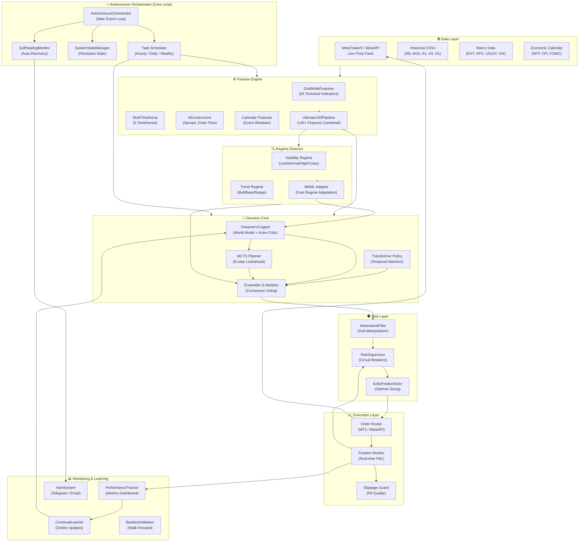
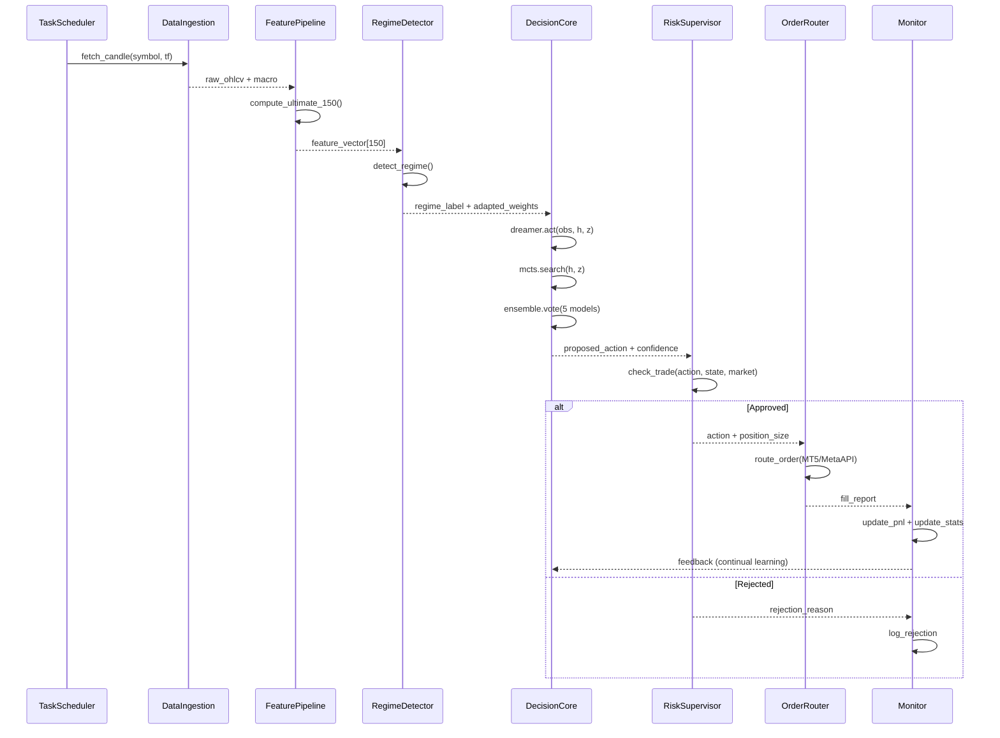
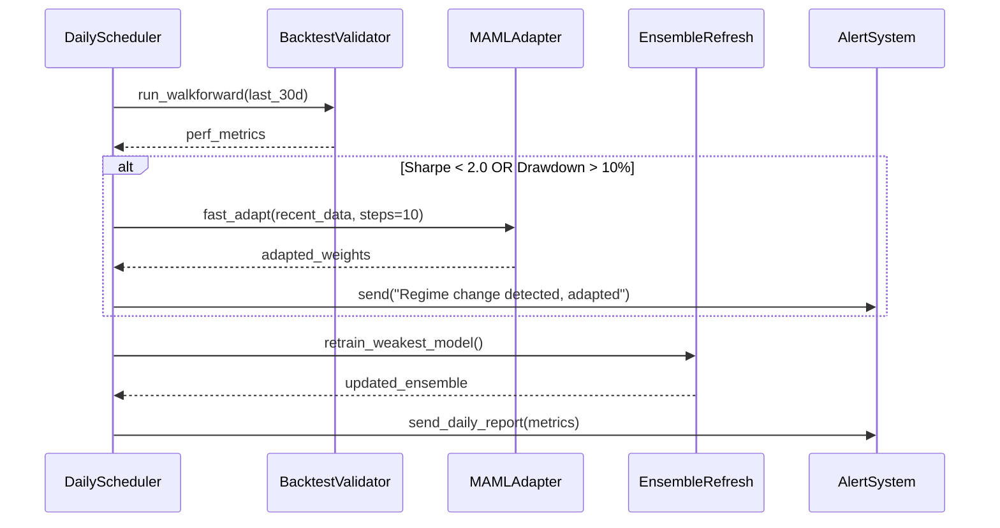

# Design Document: Autonomous Trading AI — End-to-End System

## Overview

Yeh design document us fully autonomous trading AI system ka blueprint hai jo XAUUSD (Gold) ko professionally trade kare — bina kisi human intervention ke. System mein pehle se DreamerV3 agent, Transformer policy, Ensemble, MCTS, Meta-Learning, Position Sizing, Risk Supervisor, aur adversarial training modules exist karte hain, lekin inhe ek unified autonomous loop mein connect karna abhi baaki hai.

Is design ka goal hai: ek **AutonomousOrchestrator** banana jo sare components ko end-to-end integrate kare — data ingestion se le kar live order execution tak — jaise ek professional-grade trading AI hota hai. System self-healing, regime-aware, aur capital-safe hona chahiye.

Target performance:
- Sharpe Ratio ≥ 3.5
- Max Drawdown < 8%
- Win Rate ≥ 60%
- Annual Return ≥ 80%

---

## Architecture (High-Level)



---

## Sequence Diagrams

### Main Trading Loop (Per Candle)



### Daily Self-Optimization Loop



---

## Components and Interfaces

### Component 1: AutonomousOrchestrator

**Purpose**: Poora system ka master controller. Sare sub-systems ko coordinate karta hai.

**Interface**:
```python
class AutonomousOrchestrator:
    def __init__(self, config: OrchestratorConfig) -> None
    async def start(self) -> None
    async def stop(self) -> None
    async def run_one_cycle(self) -> CycleResult
    def get_system_status(self) -> SystemStatus
    def emergency_shutdown(self) -> None
```

**Responsibilities**:
- Har candle close par trading cycle trigger karna
- Sub-system failures ko detect aur recover karna
- System state ko disk par persist karna (crash-safe)
- Daily/weekly optimization tasks schedule karna

---

### Component 2: DataIngestionPipeline

**Purpose**: Live market data fetch karna — MT5 ya MetaAPI se — aur feature-ready format mein deliver karna.

**Interface**:
```python
class DataIngestionPipeline:
    def __init__(self, broker: BrokerAdapter, symbol: str) -> None
    async def fetch_live_candles(self, timeframe: str, n: int) -> pd.DataFrame
    def fetch_macro_data(self) -> pd.DataFrame
    def get_calendar_events(self, lookahead_hours: int) -> List[CalendarEvent]
    def is_data_fresh(self, max_age_seconds: int) -> bool
```

**Responsibilities**:
- Multi-timeframe data (M5, M15, H1, H4, D1) maintain karna
- Macro data (DXY, SPX, US10Y) merge karna
- Stale data detection aur fallback handling
- Rate limiting aur retry logic

---

### Component 3: FeaturePipeline

**Purpose**: Raw OHLCV data se 150+ features compute karna.

**Interface**:
```python
class FeaturePipeline:
    def compute(self, ohlcv: pd.DataFrame, macro: pd.DataFrame) -> np.ndarray
    def get_feature_names(self) -> List[str]
    def get_window_size(self) -> int  # Returns 64
```

**Sub-pipelines (existing code se)**:
- `GodModeFeatures` → 63 technical indicators
- `MultiTimeframe` → H1, H4, D1 resampled features
- `MacroFeatures` → DXY, SPX, US10Y correlations
- `MicrostructureFeatures` → Spread, tick volume analysis
- `CalendarFeatures` → Hours-to-event, event impact score

**Responsibilities**:
- NaN handling aur normalization
- Feature consistency across timeframes
- Incremental computation (only new candles recompute)

---

### Component 4: RegimeDetector

**Purpose**: Current market regime identify karna taake correct model weights use ho sakein.

**Interface**:
```python
class RegimeDetector:
    def detect(self, features: np.ndarray) -> RegimeState
    def get_regime_confidence(self) -> float
    def suggest_adaptation(self) -> AdaptationSignal
```

**Regime Types**:
```python
class RegimeState(Enum):
    TRENDING_BULL = "trending_bull"
    TRENDING_BEAR = "trending_bear"
    RANGING_LOW_VOL = "ranging_low_vol"
    RANGING_HIGH_VOL = "ranging_high_vol"
    CRISIS = "crisis"
    UNKNOWN = "unknown"
```

---

### Component 5: DecisionCore

**Purpose**: Multiple AI models se consensus-based trading decision nikalna.

**Interface**:
```python
class DecisionCore:
    def __init__(
        self,
        dreamer: DreamerV3Agent,
        transformer: TransformerAgentWrapper,
        ensemble: EnsembleAgent,
        mcts: MCTS,
        use_mcts: bool = True
    ) -> None

    def decide(self, obs: np.ndarray, regime: RegimeState) -> Decision

    def update_latent_state(self, obs: np.ndarray) -> Tuple[Tensor, Tensor]
```

**Decision Output**:
```python
@dataclass
class Decision:
    action: int           # 0=flat, 1=long, 2=short
    confidence: float     # 0.0 to 1.0
    consensus_votes: int  # Out of 5 ensemble models
    mcts_value: float     # Expected value from MCTS
    dreamer_q: float      # DreamerV3 critic estimate
    regime: RegimeState
```

---

### Component 6: RiskLayer

**Purpose**: AI ke decisions par hard safety rules enforce karna.

**Interface**:
```python
class RiskLayer:
    def __init__(
        self,
        supervisor: RiskSupervisor,
        position_sizer: KellyPositionSizer,
        adversarial_filter: AdversarialFilter
    ) -> None

    def evaluate(
        self,
        decision: Decision,
        market_data: MarketSnapshot
    ) -> RiskEvaluation

@dataclass
class RiskEvaluation:
    approved: bool
    final_lot_size: float
    stop_loss_pips: float
    take_profit_pips: float
    rejection_reason: Optional[str]
```

---

### Component 7: OrderRouter

**Purpose**: Approved orders ko broker API tak deliver karna (MT5 ya MetaAPI).

**Interface**:
```python
class OrderRouter:
    def __init__(self, broker_adapter: BrokerAdapter) -> None
    async def execute_order(self, eval: RiskEvaluation) -> OrderResult
    async def close_position(self, position_id: str) -> CloseResult
    async def get_open_positions(self) -> List[Position]
    async def get_account_info(self) -> AccountInfo
```

---

### Component 8: ContinualLearner

**Purpose**: Live trade results se online model update karna — bina full retraining ke.

**Interface**:
```python
class ContinualLearner:
    def add_experience(self, obs, action, reward, next_obs, done) -> None
    def maybe_update(self, min_new_samples: int = 100) -> bool
    def detect_performance_degradation(self) -> bool
    def trigger_regime_adaptation(self, recent_data: pd.DataFrame) -> None
```

---

## Data Models

### OrchestratorConfig

```python
@dataclass
class OrchestratorConfig:
    symbol: str = "XAUUSD"
    primary_timeframe: str = "H1"
    broker: str = "metaapi"           # "mt5" or "metaapi"
    model_path: str = "models/saved/dreamer_latest.pt"
    use_mcts: bool = True
    mcts_simulations: int = 50
    ensemble_size: int = 5
    consensus_threshold: int = 3      # 3 out of 5
    max_daily_loss_pct: float = 0.02  # 2%
    max_position_size_pct: float = 0.10
    kelly_fraction: float = 0.25
    check_interval_seconds: int = 10
    daily_optimization_hour: int = 0  # UTC midnight
    enable_alerts: bool = True
    alert_webhook: Optional[str] = None
```

### MarketSnapshot

```python
@dataclass
class MarketSnapshot:
    timestamp: datetime
    bid: float
    ask: float
    spread: float
    current_atr: float
    volatility_ratio: float          # Current vol / 20-period avg
    is_event_window: bool
    is_high_impact_event: bool
    dxy_momentum: float
    session: str                     # "asian" | "london" | "newyork"
```

### SystemStatus

```python
@dataclass
class SystemStatus:
    is_running: bool
    current_regime: RegimeState
    open_positions: List[Position]
    daily_pnl: float
    total_equity: float
    peak_equity: float
    current_drawdown: float
    trades_today: int
    last_decision_time: datetime
    model_health: Dict[str, bool]    # {"dreamer": True, "ensemble": True, ...}
    uptime_hours: float
```

---

## Algorithmic Pseudocode

### Main Autonomous Loop

```pascal
ALGORITHM AutonomousOrchestrator.run_one_cycle()
INPUT: system_state (SystemState), config (OrchestratorConfig)
OUTPUT: cycle_result (CycleResult)

PRECONDITIONS:
  - broker_connection IS connected
  - all models ARE loaded
  - system_state.is_halted = false

BEGIN
  // 1. Data Fetch
  raw_data ← DataIngestionPipeline.fetch_live_candles(config.primary_timeframe)
  macro_data ← DataIngestionPipeline.fetch_macro_data()

  IF NOT DataIngestionPipeline.is_data_fresh(max_age_seconds=120) THEN
    LOG "Stale data — skipping cycle"
    RETURN CycleResult(skipped=true, reason="STALE_DATA")
  END IF

  // 2. Feature Computation
  feature_vector ← FeaturePipeline.compute(raw_data, macro_data)
  // feature_vector.shape = (150,)

  // 3. Regime Detection
  regime ← RegimeDetector.detect(feature_vector)

  IF regime EQUALS CRISIS THEN
    RiskSupervisor.reduce_position_limits(factor=0.5)
  END IF

  // 4. Decision Core
  decision ← DecisionCore.decide(obs=feature_vector, regime=regime)

  // Skip if no consensus
  IF decision.consensus_votes < config.consensus_threshold THEN
    LOG "No consensus — holding position"
    RETURN CycleResult(action=HOLD, reason="NO_CONSENSUS")
  END IF

  // 5. Risk Evaluation
  market_snap ← get_market_snapshot()
  risk_eval ← RiskLayer.evaluate(decision, market_snap)

  IF NOT risk_eval.approved THEN
    LOG "Trade rejected: " + risk_eval.rejection_reason
    RETURN CycleResult(action=HOLD, reason=risk_eval.rejection_reason)
  END IF

  // 6. Order Execution
  current_positions ← OrderRouter.get_open_positions()
  position_changed ← is_action_different(decision.action, current_positions)

  IF position_changed THEN
    IF current_positions NOT EMPTY THEN
      OrderRouter.close_position(current_positions[0].id)
    END IF

    IF decision.action NOT EQUALS FLAT THEN
      order_result ← OrderRouter.execute_order(risk_eval)
      LOG "Order placed: " + order_result.order_id
    END IF
  END IF

  // 7. State Update
  SystemStateManager.update(decision, risk_eval, order_result)

  RETURN CycleResult(action=decision.action, executed=position_changed)
END

POSTCONDITIONS:
  - system_state IS updated
  - If action executed: order_result.status = "FILLED"
  - Risk limits ARE enforced
  - Cycle result IS logged
```

### Decision Core: Consensus Voting

```pascal
ALGORITHM DecisionCore.decide(obs, regime)
INPUT: obs (np.ndarray[150]), regime (RegimeState)
OUTPUT: decision (Decision)

PRECONDITIONS:
  - obs.shape = (150,) AND all values finite
  - regime IS valid RegimeState

BEGIN
  // Update latent state in DreamerV3
  h, z ← dreamer.encode_obs(obs)

  // Collect votes from all 5 ensemble models
  votes ← []
  q_values ← []

  FOR model_i IN ensemble.models DO
    // Each model uses different architecture/seed
    action_i ← model_i.act(obs)
    q_i ← model_i.get_q_value(obs, action_i)
    votes.append(action_i)
    q_values.append(q_i)
  END FOR

  // MCTS Lookahead (if enabled)
  IF use_mcts THEN
    mcts_action ← MCTS.search(h, z)
    mcts_value ← MCTS.get_root_value()
    // MCTS vote counts as 2 votes (more trusted)
    votes.append(mcts_action)
    votes.append(mcts_action)
  END IF

  // Count votes per action
  vote_counts ← COUNT(votes) GROUP BY action

  // Select majority action
  best_action ← ARGMAX(vote_counts)
  confidence ← vote_counts[best_action] / LENGTH(votes)

  // Regime-based confidence adjustment
  IF regime EQUALS CRISIS THEN
    // Force flat during crisis
    IF best_action NOT EQUALS FLAT THEN
      confidence ← confidence * 0.5
    END IF
  END IF

  RETURN Decision(
    action=best_action,
    confidence=confidence,
    consensus_votes=vote_counts[best_action],
    mcts_value=mcts_value,
    dreamer_q=MEAN(q_values),
    regime=regime
  )
END

POSTCONDITIONS:
  - decision.confidence IN [0.0, 1.0]
  - decision.consensus_votes <= LENGTH(ensemble.models) + 2
  - decision.action IN {FLAT, LONG, SHORT}
```

### Risk Layer: Multi-Stage Evaluation

```pascal
ALGORITHM RiskLayer.evaluate(decision, market_snap)
INPUT: decision (Decision), market_snap (MarketSnapshot)
OUTPUT: risk_eval (RiskEvaluation)

PRECONDITIONS:
  - decision IS valid Decision object
  - market_snap.spread > 0
  - system_state IS current

BEGIN
  // Stage 1: Circuit Breakers (hard rules, never bypassed)
  IF supervisor.daily_pnl < -config.max_daily_loss_pct THEN
    RETURN RiskEvaluation(approved=false, reason="DAILY_LOSS_LIMIT")
  END IF

  IF supervisor.current_drawdown > config.max_drawdown THEN
    RETURN RiskEvaluation(approved=false, reason="MAX_DRAWDOWN")
  END IF

  IF supervisor.consecutive_losses >= 5 THEN
    RETURN RiskEvaluation(approved=false, reason="CONSECUTIVE_LOSS_LIMIT")
  END IF

  // Stage 2: Market Condition Filters
  IF market_snap.spread > config.max_spread THEN
    RETURN RiskEvaluation(approved=false, reason="SPREAD_TOO_WIDE")
  END IF

  IF market_snap.volatility_ratio > 3.0 AND decision.action NOT EQUALS FLAT THEN
    RETURN RiskEvaluation(approved=false, reason="HIGH_VOLATILITY")
  END IF

  IF market_snap.is_event_window THEN
    // Allow close-only during news window
    current_pos ← OrderRouter.get_open_positions()
    IF decision.action NOT EQUALS FLAT AND current_pos IS EMPTY THEN
      RETURN RiskEvaluation(approved=false, reason="EVENT_RISK_NO_NEW_ENTRY")
    END IF
  END IF

  // Stage 3: Kelly Position Sizing
  win_prob ← decision.confidence * supervisor.win_rate
  avg_win ← supervisor.avg_win
  avg_loss ← supervisor.avg_loss
  kelly_size ← KellyPositionSizer.compute_position_size(win_prob, avg_win, avg_loss)

  // Volatility adjustment
  vol_adjusted_size ← kelly_size * (normal_volatility / market_snap.current_atr)
  final_size ← MIN(vol_adjusted_size, config.max_position_size_pct)

  // Stage 4: Stop Loss / Take Profit
  atr_value ← market_snap.current_atr
  sl_pips ← atr_value * 1.5    // 1.5x ATR stop
  tp_pips ← atr_value * 3.0    // 3.0x ATR take profit (2:1 R:R)

  RETURN RiskEvaluation(
    approved=true,
    final_lot_size=final_size,
    stop_loss_pips=sl_pips,
    take_profit_pips=tp_pips
  )
END

POSTCONDITIONS:
  - If approved: 0 < final_lot_size <= max_position_size_pct
  - If approved: stop_loss_pips > 0 AND take_profit_pips > 0
  - All circuit breakers checked before approval
```

### MCTS Lookahead Search

```pascal
ALGORITHM MCTS.search(h, z)
INPUT: h (Tensor[hidden_dim]), z (Tensor[stoch_dim])
OUTPUT: best_action (one-hot vector)

PRECONDITIONS:
  - dreamer world model IS loaded and valid
  - h, z ARE valid latent states

BEGIN
  root ← MCTSNode(state=(h, z))

  FOR simulation IN RANGE(num_simulations) DO
    // Selection: traverse to leaf using UCB
    node ← root
    path ← [node]

    WHILE node.expanded() DO
      node ← node.select_child(c_puct=1.0)
      // UCB = Q(s,a) + c * P(a|s) * sqrt(N(s)) / (1 + N(s,a))
      path.append(node)
    END WHILE

    // Expansion: add children for all actions
    h_leaf, z_leaf ← node.state
    state_vec ← dreamer.rssm.get_state(h_leaf, z_leaf)
    priors ← SOFTMAX(dreamer.actor(state_vec))

    FOR action_idx IN RANGE(num_actions) DO
      action_tensor ← one_hot(action_idx, num_actions)
      h_next, z_next ← dreamer.rssm.imagine(action_tensor, h_leaf, z_leaf)
      reward ← SYMEXP(dreamer.reward_predictor(get_state(h_next, z_next)))
      child ← MCTSNode(state=(h_next, z_next), prior=priors[action_idx])
      child.reward ← reward
      node.children[action_idx] ← child
    END FOR

    // Evaluation: critic estimate at leaf
    leaf_value ← dreamer.critic(state_vec)

    // Backpropagation: update all nodes in path
    value ← leaf_value
    FOR node IN REVERSE(path) DO
      node.visit_count += 1
      node.value_sum += value
      value ← node.reward + gamma * value
    END FOR
  END FOR

  // Select action with highest visit count
  best_action_idx ← ARGMAX(child.visit_count FOR child IN root.children)
  RETURN one_hot(best_action_idx, num_actions)
END

POSTCONDITIONS:
  - returned action IS valid one-hot vector
  - All root.children HAVE visit_count > 0
  - Total visits = num_simulations

LOOP INVARIANT (MCTS simulation loop):
  - root.visit_count = number of completed simulations so far
  - For all nodes: value_sum / visit_count = unbiased Q-value estimate
```

### Continual Learning Update

```pascal
ALGORITHM ContinualLearner.maybe_update(min_new_samples)
INPUT: min_new_samples (int)
OUTPUT: updated (bool)

PRECONDITIONS:
  - replay_buffer.size >= min_new_samples
  - dreamer agent IS loaded

BEGIN
  IF replay_buffer.new_samples_since_last_update < min_new_samples THEN
    RETURN false
  END IF

  // Detect performance degradation
  recent_sharpe ← PerformanceTracker.rolling_sharpe(window=20)
  IF recent_sharpe < target_sharpe * 0.6 THEN
    // Performance degraded — trigger regime adaptation
    recent_data ← DataIngestionPipeline.get_last_n_candles(n=200)
    MAMLAdapter.fast_adapt(recent_data, num_steps=10)
    AlertSystem.send("⚠️ Performance degraded — MAML adaptation triggered")
  END IF

  // Online DreamerV3 update (replay buffer)
  FOR step IN RANGE(update_steps=10) DO
    batch ← replay_buffer.sample(batch_size=16)
    dreamer.train_step(batch)  // World model + actor-critic update
  END FOR

  replay_buffer.mark_updated()
  RETURN true
END
```

---

## Key Functions with Formal Specifications

### AutonomousOrchestrator.run_one_cycle()

```python
async def run_one_cycle(self) -> CycleResult:
```

**Preconditions:**
- `self.broker_connection.is_connected() == True`
- `self.models_loaded == True`
- `self.state.is_halted == False`
- System clock is synchronized

**Postconditions:**
- Returns a `CycleResult` with either executed action or skip reason
- If action executed: `order_result.status in {"FILLED", "PARTIAL"}`
- `self.state.last_cycle_time` is updated
- No exceptions propagate (all caught and logged)

**Loop Invariants (main event loop):**
- `self.state.total_equity >= 0` at all times
- `self.state.current_drawdown <= config.max_drawdown` enforced

---

### EnsembleAgent.act() — Consensus Voting

```python
def act(self, obs: np.ndarray, use_consensus: bool = True) -> Tuple[int, EnsembleInfo]:
```

**Preconditions:**
- `obs.shape == (150,)` and `np.all(np.isfinite(obs)) == True`
- `len(self.models) == 5`
- All models are in eval mode

**Postconditions:**
- Returns `(action, info)` where `action in {0, 1, 2}`
- If `use_consensus=True` and `majority_count < consensus_threshold`: returns `action=0` (flat)
- `info.uncertainty in [0.0, max_entropy]` where `max_entropy = log(num_actions)`

---

### KellyPositionSizer.compute_position_size()

```python
def compute_position_size(
    self, win_prob: float, avg_win: float, avg_loss: float
) -> float:
```

**Preconditions:**
- `0 < win_prob < 1`
- `avg_win > 0` and `avg_loss > 0`
- `self.kelly_fraction in (0, 1]`

**Postconditions:**
- Returns `position_fraction in [0.0, self.max_position]`
- If `kelly_criterion <= 0`: returns `0.0` (no edge, no trade)
- Result is deterministic given same inputs

**Loop Invariants:** N/A (no loops)

**Formula:**
```
b = avg_win / avg_loss          # odds ratio
f* = (p * b - q) / b            # full kelly
final = min(f* * kelly_fraction, max_position)
```

---

### RegimeDetector.detect()

```python
def detect(self, features: np.ndarray) -> RegimeState:
```

**Preconditions:**
- `features.shape == (150,)` and finite
- Feature pipeline has been run for at least 100 candles

**Postconditions:**
- Returns valid `RegimeState` enum value
- Never returns `None`
- Crisis detection takes precedence over all other regimes

---

## Error Handling

### Scenario 1: Broker Connection Lost

**Condition**: `broker_connection.is_connected() == False` during cycle  
**Response**: Skip current cycle, log error, schedule reconnect  
**Recovery**: `SelfHealingMonitor` retries connection with exponential backoff (1s, 2s, 4s, 8s, max 60s)  
**Alert**: Send alert if disconnected > 5 minutes

---

### Scenario 2: Stale / Missing Data

**Condition**: `last_candle_timestamp > now - 2 * timeframe_duration`  
**Response**: Skip cycle, continue monitoring  
**Recovery**: Retry data fetch on next cycle; if 3 consecutive failures → pause trading, alert  
**Alert**: Send alert after 3rd consecutive stale data failure

---

### Scenario 3: Model Inference Error (NaN/Inf output)

**Condition**: `np.any(np.isnan(action_probs)) or np.any(np.isinf(action_probs))`  
**Response**: Default to action=0 (flat); log error with stack trace  
**Recovery**: Reload model from last saved checkpoint; if reload fails → emergency shutdown  
**Alert**: Immediate alert — model state may be corrupted

---

### Scenario 4: Order Rejection by Broker

**Condition**: `order_result.status == "REJECTED"` from MT5/MetaAPI  
**Response**: Log rejection code; do not retry immediately  
**Recovery**: Analyze rejection reason:
- `INVALID_PRICE` → Update bid/ask and retry once
- `NO_MONEY` → Update account info, reduce lot size, retry once
- `MARKET_CLOSED` → Pause trading, resume at market open  
**Alert**: Alert if rejection rate > 20% in last hour

---

### Scenario 5: Daily Loss Limit Triggered

**Condition**: `daily_pnl < -max_daily_loss_pct`  
**Response**: `RiskSupervisor` halts all new entries for 24 hours  
**Recovery**: Automatic resume next trading day (UTC midnight reset)  
**Alert**: Immediate alert with P&L breakdown

---

### Scenario 6: Memory Leak / Process Hang

**Condition**: RAM usage > 4GB or main loop not responding > 5 minutes  
**Response**: `SelfHealingMonitor` (separate watchdog process) detects hang  
**Recovery**: Graceful restart of main process; positions remain open in broker  
**Alert**: Alert with system health dump

---

## Testing Strategy

### Unit Testing

Each component tested in isolation:

```python
# Test KellyPositionSizer — edge cases
def test_kelly_no_edge():
    sizer = KellyPositionSizer()
    assert sizer.compute_position_size(0.5, 0.01, 0.01) == 0.0  # No edge

def test_kelly_caps_at_max():
    sizer = KellyPositionSizer(max_position=0.10)
    assert sizer.compute_position_size(0.9, 0.1, 0.01) <= 0.10

# Test RiskSupervisor — circuit breakers
def test_daily_loss_halt():
    sup = RiskSupervisor()
    sup.daily_pnl = -0.025  # Exceeded 2%
    approved, _ = sup.check_trade(1, {}, {})
    assert not approved
```

### Property-Based Testing

**Library**: `hypothesis` (Python)

```python
from hypothesis import given, strategies as st

@given(
    win_prob=st.floats(min_value=0.01, max_value=0.99),
    avg_win=st.floats(min_value=0.001, max_value=0.5),
    avg_loss=st.floats(min_value=0.001, max_value=0.5)
)
def test_kelly_always_bounded(win_prob, avg_win, avg_loss):
    """Kelly position size must always be in [0, max_position]"""
    sizer = KellyPositionSizer(max_position=0.10)
    size = sizer.compute_position_size(win_prob, avg_win, avg_loss)
    assert 0.0 <= size <= 0.10

@given(st.lists(st.integers(min_value=0, max_value=2), min_size=5, max_size=7))
def test_ensemble_flat_on_no_consensus(votes):
    """If no majority >= threshold, ensemble must return flat"""
    # Simulate split votes where no action gets >= 3 votes
    ...
```

### Integration Testing

```python
# Full cycle test with mock broker
async def test_full_cycle_no_trade_on_stale_data():
    mock_broker = MockBrokerAdapter(stale=True)
    orch = AutonomousOrchestrator(config, broker=mock_broker)
    result = await orch.run_one_cycle()
    assert result.skipped == True
    assert result.reason == "STALE_DATA"

# Risk layer blocks trade during crisis
async def test_crisis_blocks_new_entries():
    orch = AutonomousOrchestrator(config)
    orch.regime = RegimeState.CRISIS
    # Force a long decision
    orch.decision_core.mock_decision(action=LONG, confidence=0.9)
    result = await orch.run_one_cycle()
    # Crisis + no existing position = no entry
    assert len(orch.broker.new_orders) == 0
```

### Walk-Forward Backtesting Validation

```python
# Run on 2015-2023 data with walk-forward splits
backtester = RigorousBacktester(orchestrator, data_2015_2023)
wf_results = backtester.walk_forward_validation(
    train_window=252,    # 1 year
    test_window=63       # 3 months
)

for window in wf_results:
    assert window.metrics['sharpe_ratio'] > 1.5
    assert window.metrics['max_drawdown'] < 0.15
```

### Crisis Period Validation

```python
# Must survive 2020 crash, 2022 spike
crisis_tester = CrisisValidation(orchestrator)
crisis_tester.test_2020_covid()    # March 2020 gold spike
crisis_tester.test_2022_inflation() # Aggressive Fed hikes
```

---

## Performance Considerations

### Latency Budget (per cycle, H1 timeframe)

| Stage | Budget | Actual Estimate |
|-------|--------|----------------|
| Data fetch | 500ms | ~200-400ms (MetaAPI) |
| Feature computation | 100ms | ~50ms (numpy vectorized) |
| Regime detection | 10ms | ~5ms |
| DreamerV3 inference | 50ms | ~20ms (CPU) |
| MCTS (50 sims) | 500ms | ~300ms (CPU) |
| Ensemble voting | 100ms | ~50ms |
| Risk evaluation | 10ms | ~2ms |
| Order placement | 500ms | ~200-300ms |
| **Total** | **<2s** | **~1.0-1.5s** |

H1 candle = 3600 seconds. Total budget well within limits.

### Memory Usage

- DreamerV3 model: ~500MB
- Ensemble (5 models): ~2.5GB
- Replay buffer (100k sequences): ~1GB
- Feature cache: ~100MB
- **Total**: ~4.5GB RAM required

Recommendation: 8GB+ RAM, 16GB preferred.

### MCTS Optimization

- Simulations run sequentially; for faster latency reduce to 20 sims during news windows
- Cache world model rollouts when latent state hasn't changed significantly
- Use `torch.no_grad()` for all inference (already implemented)

---

## Security Considerations

### API Credential Management
- All tokens/passwords in `.env` file only (already in `.gitignore`)
- Never log token values — reference by key name only
- Rotate MetaAPI tokens every 90 days

### Order Safety
- Magic number `234000` on all orders — only manage own orders
- Maximum lot size hardcoded in `RiskSupervisor` (cannot be overridden by model)
- Emergency shutdown button accessible via CLI and alert webhook

### Model Security
- Model checkpoint files stored locally (never uploaded to public cloud)
- Validate model output shapes before use; reject NaN/Inf outputs
- Never execute orders if model loaded from unverified path

---

## Dependencies

| Library | Version | Purpose |
|---------|---------|---------|
| `torch` | ≥ 2.0.0 | DreamerV3, Transformer, all neural nets |
| `stable-baselines3` | ≥ 2.0.0 | PPO baseline, environment wrappers |
| `gymnasium` | ≥ 0.29.0 | RL environment interface |
| `metaapi-cloud-sdk` | latest | MetaAPI live trading |
| `MetaTrader5` | ≥ 5.0.0 | MT5 direct integration |
| `pandas` | ≥ 2.0.0 | Data manipulation |
| `numpy` | ≥ 1.24.0 | Numerical computation |
| `python-dotenv` | ≥ 1.0.0 | Credential management |
| `hypothesis` | ≥ 6.0.0 | Property-based testing |
| `aiohttp` / `asyncio` | stdlib | Async broker communication |
| `requests` | ≥ 2.31.0 | Alert webhooks |

---

## Missing Components — Kya Banana Hai (Gap Analysis)

Jo existing code mein HAI:
- ✅ DreamerV3Agent (models/dreamer_agent.py)
- ✅ TransformerAgentWrapper (models/transformer_policy.py)
- ✅ EnsembleAgent (models/ensemble.py)
- ✅ MCTS + DreamerMCTSAgent (models/mcts.py)
- ✅ MAMLTrader (models/meta_learning.py)
- ✅ KellyPositionSizer (models/position_sizing.py)
- ✅ RiskSupervisor + SafeTradingAgent (models/risk_supervisor.py)
- ✅ AdversarialTradingEnv + SelfPlayTrainer (models/adversarial_training.py)
- ✅ GodModeFeatures, MultiTimeframe, MacroFeatures (features/)
- ✅ RigorousBacktester (backtest/backtest_engine.py)
- ✅ Live trading loops: MT5 + MetaAPI (live/)

Jo **NAHI** hai aur banana zaroori hai:
- ❌ `AutonomousOrchestrator` — master controller jo sab kuch tie kare
- ❌ `FeaturePipeline` — unified pipeline jo 150 features ek call mein de
- ❌ `RegimeDetector` — auto regime classification
- ❌ `DecisionCore` — DreamerV3 + MCTS + Ensemble ek saath
- ❌ `RiskLayer` — Kelly + RiskSupervisor combined interface
- ❌ `ContinualLearner` — online learning from live trades
- ❌ `SelfHealingMonitor` — watchdog + auto-restart
- ❌ `SystemStateManager` — persistent state across restarts
- ❌ `AlertSystem` — Telegram/webhook notifications
- ❌ Integration tests — end-to-end test with mock broker
- ❌ `main.py` / entry point — single command se system start ho
