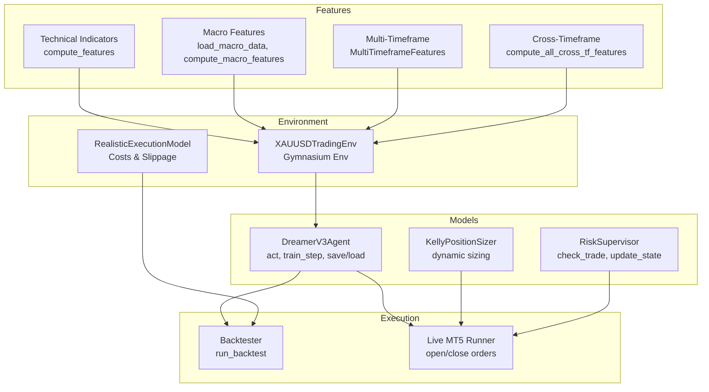
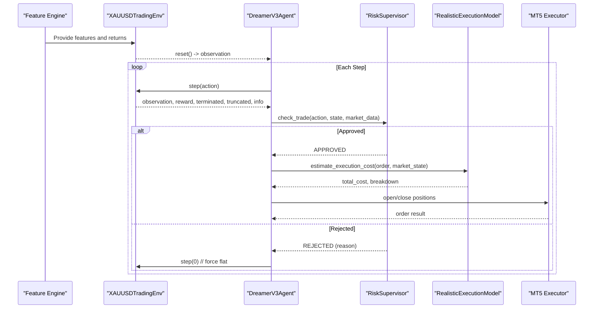
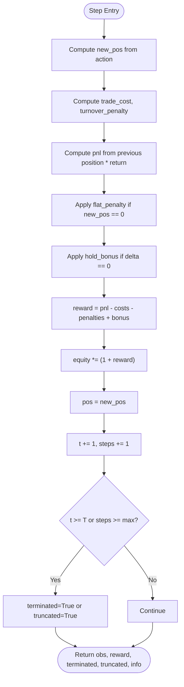
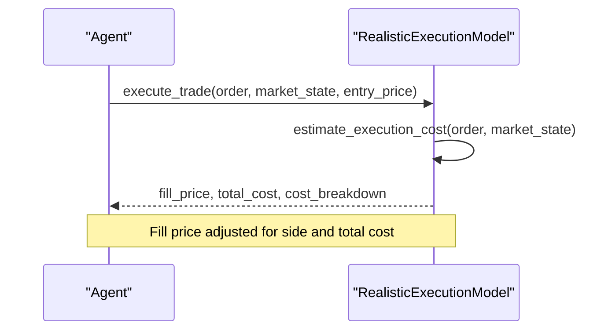
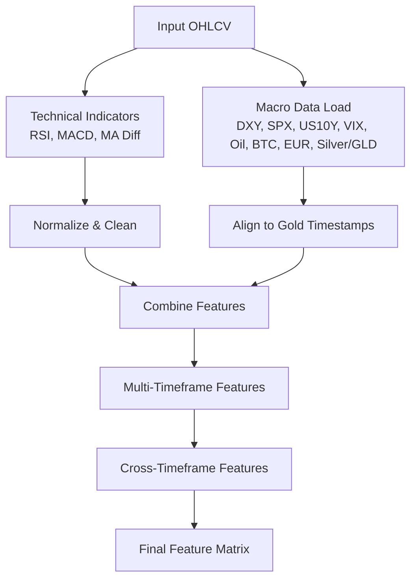
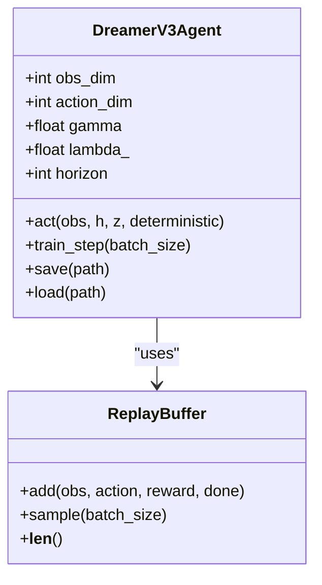
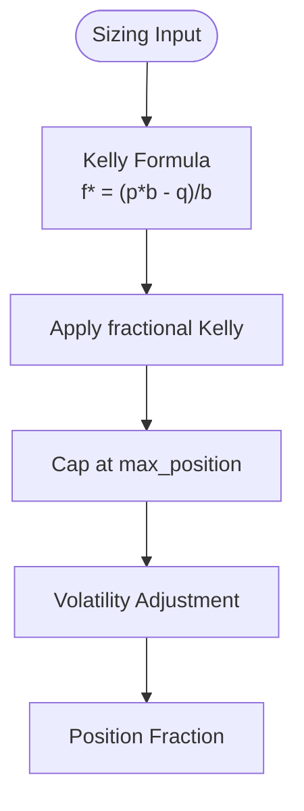
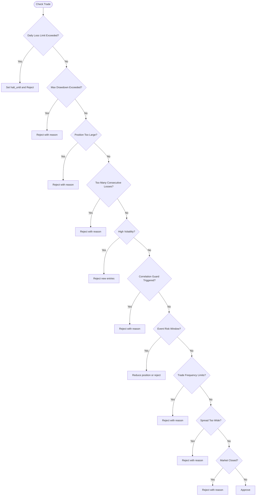
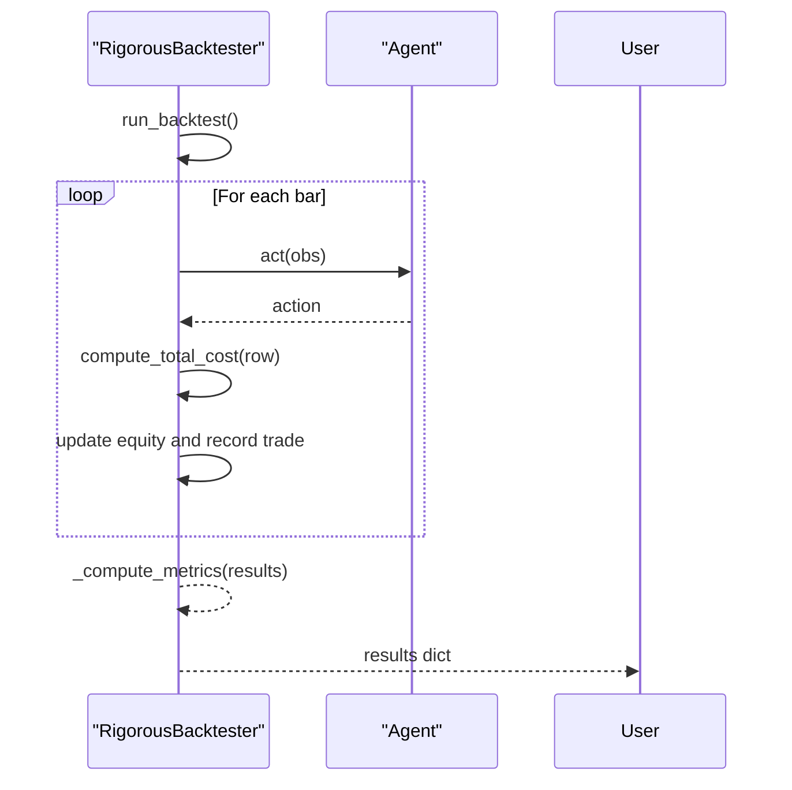
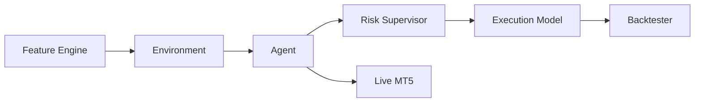

# API Reference

<cite>
**Referenced Files in This Document**
- [xauusd_env.py](file://env/xauusd_env.py)
- [realistic_execution.py](file://env/realistic_execution.py)
- [make_features.py](file://features/make_features.py)
- [macro_features.py](file://features/macro_features.py)
- [multi_timeframe.py](file://features/multi_timeframe.py)
- [cross_timeframe.py](file://features/cross_timeframe.py)
- [dreamer_agent.py](file://models/dreamer_agent.py)
- [position_sizing.py](file://models/position_sizing.py)
- [risk_supervisor.py](file://models/risk_supervisor.py)
- [backtest_engine.py](file://backtest/backtest_engine.py)
- [live_trade_mt5.py](file://live/live_trade_mt5.py)
- [evaluate_model.py](file://evaluate_model.py)
- [README.md](file://README.md)
</cite>

## Table of Contents
1. Introduction
2. Project Structure
3. Core Components
4. Architecture Overview
5. Detailed Component Analysis
6. Dependency Analysis
7. Performance Considerations
8. Troubleshooting Guide
9. Conclusion
10. Appendices

## Introduction
This document provides comprehensive API documentation for the autonomous trading system, focusing on:
- Gymnasium environment interface (reset, step, render, close)
- Feature engineering APIs (technical indicators, macro correlations, multi-timeframe analysis)
- Model training and evaluation APIs (agent initialization, training loop, evaluation)
- Trading execution APIs (order placement, position management, risk control)
- Protocol-specific usage patterns, error handling strategies, performance tips, authentication notes, rate limiting considerations, and versioning guidance

## Project Structure
The system is organized into clear modules:
- Environment and execution simulation under env/
- Feature engineering under features/
- Models and risk controls under models/
- Backtesting under backtest/
- Live trading integration under live/
- Evaluation utilities under evaluate_model.py
- Documentation and guides under README.md



**Diagram sources**
- [xauusd_env.py:7-118](file://env/xauusd_env.py#L7-L118)
- [realistic_execution.py:24-229](file://env/realistic_execution.py#L24-L229)
- [make_features.py:18-83](file://features/make_features.py#L18-L83)
- [macro_features.py:26-445](file://features/macro_features.py#L26-L445)
- [multi_timeframe.py:32-96](file://features/multi_timeframe.py#L32-L96)
- [cross_timeframe.py:205-249](file://features/cross_timeframe.py#L205-L249)
- [dreamer_agent.py:84-427](file://models/dreamer_agent.py#L84-L427)
- [position_sizing.py:29-262](file://models/position_sizing.py#L29-L262)
- [risk_supervisor.py:18-285](file://models/risk_supervisor.py#L18-L285)
- [backtest_engine.py:24-146](file://backtest/backtest_engine.py#L24-L146)
- [live_trade_mt5.py:32-109](file://live/live_trade_mt5.py#L32-L109)

**Section sources**
- [README.md:418-471](file://README.md#L418-L471)

## Core Components
- Gymnasium Environment: Discrete long-only trading environment with windowed observations, action space {Flat, Long}, and reward accounting for costs and penalties.
- Realistic Execution Model: Estimates spread, slippage, commission, market impact, and adverse selection; adjusts fill prices accordingly.
- Feature Engineering: Technical indicators (RSI, MACD, MA diffs), macro correlations (DXY, SPX, US10Y, VIX, Oil, BTC, EUR, Silver/GLD), and multi-timeframe cross-analysis.
- Model Training/Evaluation: DreamerV3 agent with world model learning, actor-critic policy, replay buffer, and evaluation pipeline producing metrics and plots.
- Position Sizing: Kelly-based dynamic sizing with volatility adjustments and ATR-based sizing options.
- Risk Supervisor: Deterministic safety layer enforcing daily loss limits, drawdown protection, trade frequency, spread filters, and event risk controls.
- Backtesting: Rigorous engine with realistic costs, walk-forward validation, and comprehensive metrics.
- Live Execution: MT5 integration for order placement and position management.

**Section sources**
- [xauusd_env.py:7-118](file://env/xauusd_env.py#L7-L118)
- [realistic_execution.py:24-229](file://env/realistic_execution.py#L24-L229)
- [make_features.py:18-83](file://features/make_features.py#L18-L83)
- [macro_features.py:26-445](file://features/macro_features.py#L26-L445)
- [multi_timeframe.py:32-96](file://features/multi_timeframe.py#L32-L96)
- [cross_timeframe.py:205-249](file://features/cross_timeframe.py#L205-L249)
- [dreamer_agent.py:84-427](file://models/dreamer_agent.py#L84-L427)
- [position_sizing.py:29-262](file://models/position_sizing.py#L29-L262)
- [risk_supervisor.py:18-285](file://models/risk_supervisor.py#L18-L285)
- [backtest_engine.py:24-146](file://backtest/backtest_engine.py#L24-L146)
- [live_trade_mt5.py:32-109](file://live/live_trade_mt5.py#L32-L109)

## Architecture Overview
High-level flow from data to decisions to execution:
- Data ingestion and feature computation produce normalized observations.
- The RL agent observes the environment, predicts actions, and interacts via step().
- Execution models simulate realistic costs; risk supervisor enforces safety rules.
- Backtesting validates strategy; live trading executes orders through MT5.



**Diagram sources**
- [xauusd_env.py:70-118](file://env/xauusd_env.py#L70-L118)
- [dreamer_agent.py:148-188](file://models/dreamer_agent.py#L148-L188)
- [risk_supervisor.py:91-174](file://models/risk_supervisor.py#L91-L174)
- [realistic_execution.py:88-199](file://env/realistic_execution.py#L88-L199)
- [live_trade_mt5.py:57-95](file://live/live_trade_mt5.py#L57-L95)

## Detailed Component Analysis

### Gymnasium Environment API (XAUUSDTradingEnv)
- Purpose: Discrete long-only trading environment for RL training and evaluation.
- Key Methods:
  - reset(seed=None, options=None): Resets internal state and returns initial observation and empty info dict.
  - step(action: int): Applies action (0=Flat, 1=Long), computes reward considering PnL, trade cost, turnover penalty, flat penalty, hold bonus; updates equity and time; returns next_obs, reward, terminated, truncated, info.
  - render(): Supported modes include "human" per metadata; implementation details are minimal in this file.
  - close(): Inherited from gym.Env; standard cleanup behavior.
- Parameters:
  - features: np.ndarray shape (T, F)
  - returns: np.ndarray shape (T,)
  - window: int (default 64)
  - cost_per_trade: float (default 0.0001)
  - turnover_coef: float (default 0.0002)
  - flat_penalty: float (default 0.00002)
  - hold_bonus: float (default 0.00002)
  - max_episode_steps: Optional int
- Return Schemas:
  - reset(): (observation: Box[float], info: {})
  - step(): (next_observation: Box[float], reward: float, terminated: bool, truncated: bool, info: dict with equity, pos, trade_cost)
- State Transitions:
  - Position applied on next step to avoid look-ahead bias.
  - Equity updated multiplicatively by (1 + reward).
  - Time advances each step; episode ends when t >= T or steps exceed max_episode_steps.



**Diagram sources**
- [xauusd_env.py:75-118](file://env/xauusd_env.py#L75-L118)

**Section sources**
- [xauusd_env.py:7-118](file://env/xauusd_env.py#L7-L118)

### Realistic Execution API
- Purpose: Simulate real-world execution costs and adjust fill prices.
- Key Methods:
  - get_default_config(): Returns conservative defaults for spread, slippage, commission, volatility multipliers, market impact coefficient, adverse selection cost.
  - estimate_execution_cost(order, market_state): Computes total cost and breakdown based on spread widening, slippage scaling, commissions, market impact, and adverse selection.
  - execute_trade(order, market_state, entry_price): Adjusts fill price based on side and total cost; returns fill_price, total_cost, cost_breakdown.
  - get_statistics(): Aggregates total trades, average cost per trade, total costs, and averaged cost breakdown.
- Inputs:
  - order: dict with keys side ('buy'/'sell'), size (fraction of equity), order_type ('market'/'limit')
  - market_state: dict with keys volatility, normal_volatility, spread, liquidity, is_event_window
- Outputs:
  - estimate_execution_cost(): total_cost (float), cost_breakdown (dict)
  - execute_trade(): fill_price (float), total_cost (float), cost_breakdown (dict)
  - get_statistics(): dict with aggregated stats including cost_in_pips



**Diagram sources**
- [realistic_execution.py:88-199](file://env/realistic_execution.py#L88-L199)

**Section sources**
- [realistic_execution.py:24-229](file://env/realistic_execution.py#L24-L229)

### Feature Engineering API
- Technical Indicators:
  - compute_rsi(series, period=14): Computes RSI using rolling gains/losses; returns series filled with neutral value where NaN.
  - compute_features(df): Builds features including returns, volatility, momentum, moving averages, RSI, MACD differences; optionally integrates macro columns (dxy_close, spx_close, us10y_close); returns cleaned, normalized feature matrix and returns vector.
- Macro Correlations:
  - load_macro_data(data_dir='data'): Loads multiple macro series (DXY, SPX, US10Y, VIX, Oil, BTC, EUR, Silver, GLD) aligned to gold timestamps.
  - compute_macro_features(df_gold, macro_dict): Generates 24 macro features across sources; aligns to gold timeframe; returns DataFrame of macro features.
- Multi-Timeframe Analysis:
  - MultiTimeframeFeatures.create_features(data_dict): Produces per-timeframe features and cross-timeframe features; returns combined DataFrame aligned to fastest timeframe.
  - create_multi_timeframe_data(df_base, base_tf='H1'): Resamples base OHLCV to M5/M15/H1/H4/D1 and returns dict of DataFrames.
- Cross-Timeframe Intelligence:
  - compute_all_cross_tf_features(tf_dict): Combines trend alignment, momentum cascade, volatility regime, and pattern confluence features; returns DataFrame with 12 cross-TF features.



**Diagram sources**
- [make_features.py:18-83](file://features/make_features.py#L18-L83)
- [macro_features.py:26-445](file://features/macro_features.py#L26-L445)
- [multi_timeframe.py:32-96](file://features/multi_timeframe.py#L32-L96)
- [cross_timeframe.py:205-249](file://features/cross_timeframe.py#L205-L249)

**Section sources**
- [make_features.py:18-83](file://features/make_features.py#L18-L83)
- [macro_features.py:26-445](file://features/macro_features.py#L26-L445)
- [multi_timeframe.py:32-96](file://features/multi_timeframe.py#L32-L96)
- [cross_timeframe.py:205-249](file://features/cross_timeframe.py#L205-L249)

### Model Training API (DreamerV3 Agent)
- Purpose: World model-based RL agent that learns market dynamics and improves policy via imagination.
- Initialization:
  - DreamerV3Agent(obs_dim, action_dim=3, device='cpu', embed_dim=256, hidden_dim=512, stoch_dim=32, num_categories=32, lr_world_model=3e-4, lr_actor=1e-4, lr_critic=3e-4, gamma=0.99, lambda_=0.95, horizon=15, free_nats=1.0, kl_balance=0.8)
- Key Methods:
  - act(obs, h=None, z=None, deterministic=False): Encodes observation, updates latent state, samples action; returns action and new latent state tuple.
  - train_step(batch_size=16): Samples sequences from replay buffer, trains world model (reconstruction, reward prediction, KL), imagines trajectories, trains critic and actor; returns loss dict.
  - save(path), load(path): Persist and restore agent state.
- Configuration Parameters:
  - Learning rates for world model, actor, critic
  - Discount factor gamma, GAE lambda
  - Imagination horizon
  - KL regularization parameters
- Callback Interfaces:
  - No explicit callback hooks; training logs returned via loss dict; integrate external callbacks around train_step calls.



**Diagram sources**
- [dreamer_agent.py:24-82](file://models/dreamer_agent.py#L24-L82)
- [dreamer_agent.py:84-427](file://models/dreamer_agent.py#L84-L427)

**Section sources**
- [dreamer_agent.py:84-427](file://models/dreamer_agent.py#L84-L427)

### Position Sizing API
- Purpose: Dynamic position sizing using Kelly Criterion and volatility/ATR adjustments.
- Key Classes:
  - KellyPositionSizer(max_position=0.10, kelly_fraction=0.25)
    - compute_position_size(win_prob, avg_win, avg_loss, equity=1.0): Returns optimal fraction of equity.
    - dynamic_sizing(agent, current_state, obs): Uses agent’s critic to estimate win probability and compute Kelly size.
    - volatility_adjusted_sizing(base_position, current_volatility, normal_volatility): Adjusts position inversely to volatility.
    - update_statistics(trade_result): Updates win rate and average win/loss from recent trades.
    - get_current_stats(): Returns current statistics.
  - FixedFractionSizer(risk_per_trade=0.02): Simple fixed fraction sizing.
  - ATRPositionSizer(account_risk=0.02, atr_multiplier=2.0): ATR-based sizing capped at maximum.



**Diagram sources**
- [position_sizing.py:66-111](file://models/position_sizing.py#L66-L111)
- [position_sizing.py:189-216](file://models/position_sizing.py#L189-L216)

**Section sources**
- [position_sizing.py:29-262](file://models/position_sizing.py#L29-L262)

### Risk Control API (RiskSupervisor)
- Purpose: Deterministic safety layer overriding AI decisions to prevent catastrophic losses.
- Key Methods:
  - check_trade(action, state, market_data): Enforces daily loss limits, drawdown protection, position size limits, consecutive loss protection, volatility filters, correlation guards, event risk filters, trade frequency limits, spread filters, market hours checks; returns (approved: bool, reason: str).
  - update_state(pnl, equity, is_win=None): Updates equity tracking, trade counters, consecutive losses, and history.
  - reset_daily(): Resets daily counters and clears halt if expired.
  - emergency_shutdown(): Halts all trading indefinitely until manual restart.
  - get_statistics(): Returns approval/rejection stats and current state metrics.
- Configuration:
  - Default config includes max_daily_loss, max_position, max_drawdown, vol_threshold, max_spread, max_trades_per_day, min_trade_interval, max_consecutive_losses.



**Diagram sources**
- [risk_supervisor.py:91-174](file://models/risk_supervisor.py#L91-L174)

**Section sources**
- [risk_supervisor.py:18-285](file://models/risk_supervisor.py#L18-L285)

### Backtesting API
- Purpose: Rigorous backtesting with realistic costs, walk-forward validation, and comprehensive metrics.
- Key Methods:
  - run_backtest(): Iterates data, applies agent actions, simulates costs, records trades and equity curve, computes metrics; returns results dict.
  - walk_forward_validation(train_window=252, test_window=63): Performs rolling train/test windows; returns list of results per window.
- Metrics Computed:
  - Total return, annualized return, max drawdown, Sharpe ratio, Sortino ratio, Calmar ratio, number of trades, win rate, average win/loss, profit factor, average duration, total costs.



**Diagram sources**
- [backtest_engine.py:73-146](file://backtest/backtest_engine.py#L73-L146)
- [backtest_engine.py:219-254](file://backtest/backtest_engine.py#L219-L254)

**Section sources**
- [backtest_engine.py:24-146](file://backtest/backtest_engine.py#L24-L146)
- [backtest_engine.py:219-254](file://backtest/backtest_engine.py#L219-L254)

### Live Trading API (MT5 Integration)
- Purpose: Execute trades based on model actions via MetaTrader 5.
- Key Functions:
  - get_market_data(symbol, n=500): Fetches recent candles; returns DataFrame with time and volume.
  - execute_trade(action, current_pos_type): Determines whether to open or close positions based on action vs current position.
  - open_order(order_type): Sends buy/sell order with symbol, volume, deviation, magic number, comment, filling type.
  - close_position(position_type): Closes existing positions by sending opposite orders.
  - get_current_position_type(): Returns current position type (0=Flat, 1=Long) based on magic number filtering.
- Usage Pattern:
  - Initialize MT5, load model, loop to fetch data, compute features, construct observation, predict action, execute trade, sleep between checks.

```mermaid
sequenceDiagram
participant LOOP as "Main Loop"
participant MT5 as "MT5 Client"
participant AG as "Model"
LOOP->>MT5 : get_market_data()
MT5-->>LOOP : df
LOOP->>AG : predict(obs)
AG-->>LOOP : action
LOOP->>MT5 : open/close order
MT5-->>LOOP : order result
LOOP->>LOOP : sleep
```

**Diagram sources**
- [live_trade_mt5.py:21-109](file://live/live_trade_mt5.py#L21-L109)
- [live_trade_mt5.py:111-173](file://live/live_trade_mt5.py#L111-L173)

**Section sources**
- [live_trade_mt5.py:21-109](file://live/live_trade_mt5.py#L21-L109)
- [live_trade_mt5.py:111-173](file://live/live_trade_mt5.py#L111-L173)

### Evaluation API
- Purpose: Evaluate trained models on validation/test periods and generate metrics and visualizations.
- Key Components:
  - TradingEnvironment: Simple environment for evaluation with reset(), step(), observation/action spaces.
  - evaluate_model(agent, env, timestamps): Runs agent over environment, collects equity curve, positions, rewards; computes metrics like total return, annual return, Sharpe ratio, max drawdown, win rate, final equity, number of trades, long percentage.
  - plot_results(equity_curve, positions, dates, metrics, save_path): Plots equity curve, drawdown, and positions; saves figure.
  - print_metrics(metrics, title="EVALUATION RESULTS"): Prints formatted metrics.
- Usage:
  - Load ultimate features, select period, create environment, load agent checkpoint, evaluate, print metrics, plot results, save CSV.

**Section sources**
- [evaluate_model.py:28-161](file://evaluate_model.py#L28-L161)
- [evaluate_model.py:164-215](file://evaluate_model.py#L164-L215)
- [evaluate_model.py:218-306](file://evaluate_model.py#L218-L306)

## Dependency Analysis
Key dependencies and relationships:
- Environment depends on feature outputs for observations.
- Agent depends on environment interactions and uses replay buffer for training.
- Risk supervisor wraps agent decisions to enforce safety constraints.
- Execution model augments backtesting and live trading with realistic costs.
- Live trading depends on MT5 client library and model predictions.



**Diagram sources**
- [xauusd_env.py:7-118](file://env/xauusd_env.py#L7-L118)
- [dreamer_agent.py:84-427](file://models/dreamer_agent.py#L84-L427)
- [risk_supervisor.py:18-285](file://models/risk_supervisor.py#L18-L285)
- [realistic_execution.py:24-229](file://env/realistic_execution.py#L24-L229)
- [backtest_engine.py:24-146](file://backtest/backtest_engine.py#L24-L146)
- [live_trade_mt5.py:32-109](file://live/live_trade_mt5.py#L32-L109)

**Section sources**
- [README.md:418-471](file://README.md#L418-L471)

## Performance Considerations
- Use realistic execution costs in both backtesting and training to avoid overoptimistic results.
- Normalize features and handle NaNs robustly to stabilize training.
- Employ walk-forward validation to assess out-of-sample performance.
- Tune hyperparameters such as learning rates, batch sizes, and imagination horizon for efficiency.
- Monitor volatility regimes and adjust position sizing accordingly.
- Avoid excessive trading frequency to reduce churn and transaction costs.

[No sources needed since this section provides general guidance]

## Troubleshooting Guide
Common issues and resolutions:
- Environment errors: Ensure features and returns arrays match lengths and dimensions; verify window size does not exceed data length.
- Execution failures: Validate order dictionaries and market state inputs; check spread and slippage parameters during high volatility.
- Risk supervisor rejections: Review rejection reasons (daily loss limit, drawdown, high volatility, wide spread); adjust thresholds or pause trading.
- Live trading connectivity: Verify MT5 initialization and terminal connection; handle retries on data fetch failures.
- Evaluation discrepancies: Confirm correct feature loading and period selection; ensure checkpoints exist and load successfully.

**Section sources**
- [xauusd_env.py:33-38](file://env/xauusd_env.py#L33-L38)
- [realistic_execution.py:88-199](file://env/realistic_execution.py#L88-L199)
- [risk_supervisor.py:91-174](file://models/risk_supervisor.py#L91-L174)
- [live_trade_mt5.py:111-131](file://live/live_trade_mt5.py#L111-L131)
- [evaluate_model.py:264-279](file://evaluate_model.py#L264-L279)

## Conclusion
This API reference covers the core interfaces for environment interaction, feature engineering, model training and evaluation, execution simulation, and live trading. By adhering to realistic cost modeling, robust risk controls, and thorough evaluation practices, users can build reliable autonomous trading systems. Follow the documented methods and parameters to integrate components effectively and optimize performance across different market conditions.

[No sources needed since this section summarizes without analyzing specific files]

## Appendices

### Authentication and Security
- Environment variables for API keys should be stored securely and never committed to version control.
- MT5 requires a logged-in terminal; ensure credentials and connections are properly configured.
- MetaAPI cloud trading supports remote execution with token-based authentication.

**Section sources**
- [README.md:264-291](file://README.md#L264-L291)

### Rate Limiting Considerations
- During high volatility or news events, spreads and slippage increase; consider reducing trade frequency and position sizes.
- Implement minimum time between trades to prevent churning and respect broker limits.

**Section sources**
- [risk_supervisor.py:143-167](file://models/risk_supervisor.py#L143-L167)

### Versioning and Compatibility
- Feature package version is declared in __init__.py; maintain backward compatibility when adding new features.
- Gymnasium environment follows standard interface; ensure compatibility with RL libraries like Stable-Baselines3.

**Section sources**
- [features/__init__.py:1-8](file://features/__init__.py#L1-L8)
- [README.md:60-64](file://README.md#L60-L64)