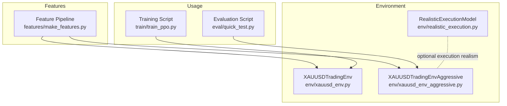
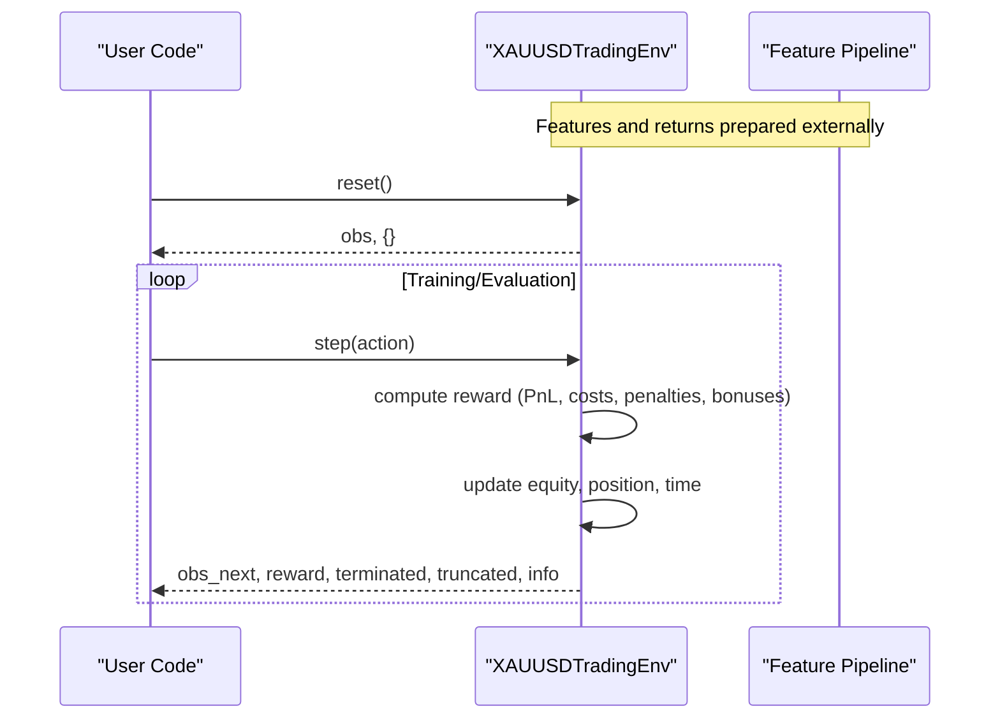
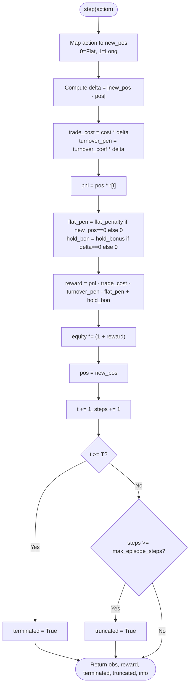
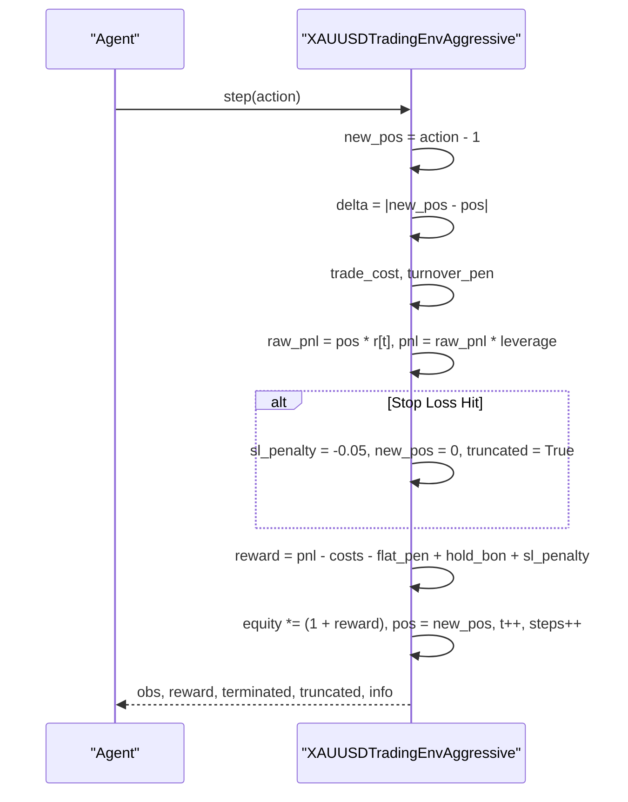
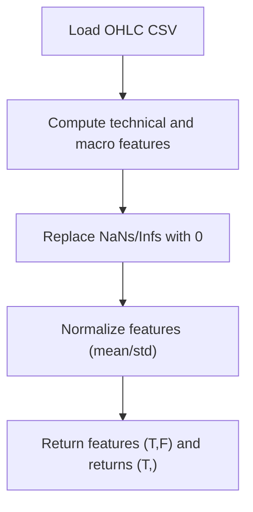
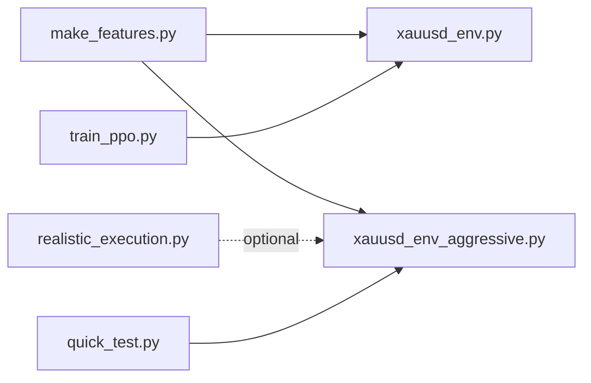

# Environment API

<cite>
**Referenced Files in This Document**
- [xauusd_env.py](file://env/xauusd_env.py)
- [xauusd_env_aggressive.py](file://env/xauusd_env_aggressive.py)
- [realistic_execution.py](file://env/realistic_execution.py)
- [make_features.py](file://features/make_features.py)
- [train_ppo.py](file://train/train_ppo.py)
- [quick_test.py](file://eval/quick_test.py)
</cite>

## Table of Contents
1. [Introduction](#introduction)
2. [Project Structure](#project-structure)
3. [Core Components](#core-components)
4. [Architecture Overview](#architecture-overview)
5. [Detailed Component Analysis](#detailed-component-analysis)
6. [Dependency Analysis](#dependency-analysis)
7. [Performance Considerations](#performance-considerations)
8. [Troubleshooting Guide](#troubleshooting-guide)
9. [Conclusion](#conclusion)
10. [Appendices](#appendices)

## Introduction
This document provides comprehensive API documentation for the Gymnasium-based trading environments focused on XAUUSD (Gold vs US Dollar). It covers:
- The discrete long-only environment class and its aggressive variant
- Observation and action spaces
- Reward function components including PnL, transaction costs, turnover penalties, flat penalties, and stability bonuses
- Step information dictionary contents
- Episode lifecycle and termination conditions
- Practical usage examples for initialization, training loops, and evaluation
- Environment-specific considerations such as look-ahead prevention and performance tips for large datasets

## Project Structure
The relevant code is organized under the env directory with supporting utilities in features and usage scripts in train and eval directories.

**Diagram sources**
- [xauusd_env.py:7-118](file://env/xauusd_env.py#L7-L118)
- [xauusd_env_aggressive.py:6-144](file://env/xauusd_env_aggressive.py#L6-L144)
- [realistic_execution.py:24-229](file://env/realistic_execution.py#L24-L229)
- [make_features.py:18-83](file://features/make_features.py#L18-L83)
- [train_ppo.py:25-93](file://train/train_ppo.py#L25-L93)
- [quick_test.py:10-69](file://eval/quick_test.py#L10-L69)

**Section sources**
- [xauusd_env.py:7-118](file://env/xauusd_env.py#L7-L118)
- [xauusd_env_aggressive.py:6-144](file://env/xauusd_env_aggressive.py#L6-L144)
- [realistic_execution.py:24-229](file://env/realistic_execution.py#L24-L229)
- [make_features.py:18-83](file://features/make_features.py#L18-L83)
- [train_ppo.py:25-93](file://train/train_ppo.py#L25-L93)
- [quick_test.py:10-69](file://eval/quick_test.py#L10-L69)

## Core Components
- XAUUSDTradingEnv: Discrete long-only environment with a windowed feature observation and position state appended. Actions are flat or long. Reward includes PnL from previous position, transaction costs, turnover penalty, flat penalty, and hold bonus. Position updates after reward to prevent look-ahead.
- XAUUSDTradingEnvAggressive: Supports short, flat, and long actions; includes leverage and stop-loss logic that can terminate episodes when risk thresholds are breached.
- RealisticExecutionModel: Optional module modeling spread, slippage, commission, market impact, and adverse selection to estimate realistic execution costs. Not integrated into the base environment classes but useful for advanced backtesting.

Key responsibilities:
- State management: time index t, position pos, equity tracking, step counters
- Observation construction: rolling window of normalized features plus current position
- Action interpretation and reward computation
- Episode termination/truncation based on data horizon and optional max steps

**Section sources**
- [xauusd_env.py:7-118](file://env/xauusd_env.py#L7-L118)
- [xauusd_env_aggressive.py:6-144](file://env/xauusd_env_aggressive.py#L6-L144)
- [realistic_execution.py:24-229](file://env/realistic_execution.py#L24-L229)

## Architecture Overview
The environment follows a standard Gymnasium interface: reset() initializes state and returns an observation; step(action) computes reward, updates state, and returns next observation plus termination flags and info. Data preparation is handled by a feature pipeline that produces normalized features and log returns used by the environment.

**Diagram sources**
- [xauusd_env.py:59-118](file://env/xauusd_env.py#L59-L118)
- [make_features.py:18-83](file://features/make_features.py#L18-L83)

## Detailed Component Analysis

### XAUUSDTradingEnv Class
- Purpose: Discrete long-only trading environment with windowed observations and simple cost/penalty structure.
- Key parameters:
  - features: np.ndarray of shape (T, F), normalized features
  - returns: np.ndarray of shape (T,), log returns aligned with features
  - window: int, size of feature history window
  - cost_per_trade: float, per-unit cost applied when position changes
  - turnover_coef: float, additional penalty for changing position
  - flat_penalty: float, small penalty for being flat to encourage exposure
  - hold_bonus: float, small bonus for maintaining position to reduce flip-flopping
  - max_episode_steps: int or None, optional cap to truncate episodes
- Observation space: Box of shape (window * F + 1), dtype float32, unbounded
- Action space: Discrete(2), where 0 = Flat, 1 = Long
- State variables:
  - t: current time index starting at window
  - pos: current position {0, 1}
  - equity: running equity multiplier initialized to 1.0
  - steps: step counter within episode
- Methods:
  - __init__(...): Validates inputs, sets up spaces, resets internal state
  - reset(seed=None, options=None): Resets state and returns initial observation
  - step(action: int): Computes reward, updates state, returns next observation and info
  - render(): Not implemented in this class; metadata indicates human mode available but no rendering logic present
  - close(): Inherited from gym.Env; no custom implementation here
- Reward function:
  - PnL from holding previous position over current bar: pos * r[t]
  - Transaction cost: cost_per_trade * |new_pos - pos|
  - Turnover penalty: turnover_coef * |new_pos - pos|
  - Flat penalty: flat_penalty if new_pos == 0 else 0
  - Hold bonus: hold_bonus if |new_pos - pos| == 0 else 0
  - Net reward: PnL - trade_cost - turnover_penalty - flat_penalty + hold_bonus
- Equity update: equity *= (1 + reward)
- Look-ahead prevention: Position updated after reward calculation using the action’s intended new position
- Termination:
  - terminated: True when t reaches T (end of data)
  - truncated: True when steps reach max_episode_steps (if set)
- Info dictionary keys returned by step():
  - equity: float, cumulative equity multiplier
  - pos: int, current position after update
  - trade_cost: float, cost incurred this step due to position change

**Diagram sources**
- [xauusd_env.py:75-118](file://env/xauusd_env.py#L75-L118)

**Section sources**
- [xauusd_env.py:21-118](file://env/xauusd_env.py#L21-L118)

### XAUUSDTradingEnvAggressive Class
- Purpose: Aggressive environment supporting short, flat, and long positions with leverage and stop-loss behavior.
- Key parameters:
  - features, returns, window, cost_per_trade, turnover_coef, flat_penalty, hold_bonus, leverage, stop_loss_pct, max_episode_steps
- Observation space: Box of shape (window * F + 1), dtype float32
- Action space: Discrete(3), mapping to positions -1 (Short), 0 (Flat), 1 (Long)
- State variables:
  - t, pos {-1, 0, 1}, entry_price (virtual), equity, steps
- Methods:
  - __init__(...): Validates inputs, sets up spaces, resets internal state
  - reset(seed=None, options=None): Resets state and returns initial observation
  - step(action: int): Computes reward with leverage and stop-loss checks; may force close and truncate on SL hit
  - render(): Not implemented; metadata indicates human mode available but no rendering logic present
  - close(): Inherited from gym.Env; no custom implementation here
- Reward function:
  - raw_pnl = pos * r[t]
  - pnl = raw_pnl * leverage
  - trade_cost = cost_per_trade * |new_pos - pos|
  - turnover_pen = turnover_coef * |new_pos - pos|
  - flat_pen = flat_penalty if new_pos == 0 else 0
  - hold_bon = hold_bonus if delta == 0 else 0
  - sl_penalty: heavy penalty if stop-loss triggered; forces close and truncates episode
  - reward = pnl - trade_cost - turnover_pen - flat_pen + hold_bon + sl_penalty
- Stop-loss logic:
  - If long and r[t] < -stop_loss_pct: apply sl_penalty, force pos=0, truncated=True
  - If short and r[t] > stop_loss_pct: apply sl_penalty, force pos=0, truncated=True
- Info dictionary keys returned by step():
  - equity: float
  - pos: int (-1, 0, 1)
  - trade_cost: float
  - pnl: float (raw PnL before leverage)

**Diagram sources**
- [xauusd_env_aggressive.py:86-144](file://env/xauusd_env_aggressive.py#L86-L144)

**Section sources**
- [xauusd_env_aggressive.py:20-144](file://env/xauusd_env_aggressive.py#L20-L144)

### Feature Pipeline Integration
- Produces normalized features and log returns aligned in time
- Normalization uses mean and std across features; NaNs and infinities are replaced with zeros
- Typical feature set includes returns, volatility, momentum, moving average differences, RSI, MACD difference, and optionally macro correlations

**Diagram sources**
- [make_features.py:18-83](file://features/make_features.py#L18-L83)

**Section sources**
- [make_features.py:18-83](file://features/make_features.py#L18-L83)

### Usage Examples

#### Initialization with Different Configurations
- Basic long-only environment:
  - Use make_features to prepare data, then instantiate XAUUSDTradingEnv with desired window and cost settings
  - Example reference: [train_ppo.py:25-44](file://train/train_ppo.py#L25-L44)
- Aggressive environment with leverage and stop-loss:
  - Instantiate XAUUSDTradingEnvAggressive with leverage and stop_loss_pct
  - Example reference: [quick_test.py:19-27](file://eval/quick_test.py#L19-L27)

#### Typical Training Loop
- Create multiple parallel environments using SubprocVecEnv
- Train with PPO, saving checkpoints periodically
- Example reference: [train_ppo.py:44-67](file://train/train_ppo.py#L44-L67)

#### Evaluation Loop
- Reset environment, run model predictions, collect equity and position histories
- Break on termination or truncation
- Example reference: [train_ppo.py:69-87](file://train/train_ppo.py#L69-L87), [quick_test.py:34-65](file://eval/quick_test.py#L34-L65)

#### Custom Reward Function Implementation
- To customize rewards, subclass the environment and override step() to modify reward computation while preserving state transitions and info structure
- Ensure look-ahead prevention by computing reward based on previous position and updating position afterward
- Reference patterns: [xauusd_env.py:75-118](file://env/xauusd_env.py#L75-L118), [xauusd_env_aggressive.py:86-144](file://env/xauusd_env_aggressive.py#L86-L144)

**Section sources**
- [train_ppo.py:25-93](file://train/train_ppo.py#L25-L93)
- [quick_test.py:10-69](file://eval/quick_test.py#L10-L69)
- [xauusd_env.py:75-118](file://env/xauusd_env.py#L75-L118)
- [xauusd_env_aggressive.py:86-144](file://env/xauusd_env_aggressive.py#L86-L144)

## Dependency Analysis
- XAUUSDTradingEnv depends on numpy and gymnasium spaces for observation/action definitions
- XAUUSDTradingEnvAggressive adds leverage and stop-loss logic
- RealisticExecutionModel is independent and can be used to estimate execution costs separately
- Feature pipeline provides normalized features and returns consumed by environments
- Training and evaluation scripts orchestrate environment usage with RL libraries

**Diagram sources**
- [make_features.py:18-83](file://features/make_features.py#L18-L83)
- [xauusd_env.py:7-118](file://env/xauusd_env.py#L7-L118)
- [xauusd_env_aggressive.py:6-144](file://env/xauusd_env_aggressive.py#L6-L144)
- [realistic_execution.py:24-229](file://env/realistic_execution.py#L24-L229)
- [train_ppo.py:25-93](file://train/train_ppo.py#L25-L93)
- [quick_test.py:10-69](file://eval/quick_test.py#L10-L69)

**Section sources**
- [xauusd_env.py:7-118](file://env/xauusd_env.py#L7-L118)
- [xauusd_env_aggressive.py:6-144](file://env/xauusd_env_aggressive.py#L6-L144)
- [realistic_execution.py:24-229](file://env/realistic_execution.py#L24-L229)
- [make_features.py:18-83](file://features/make_features.py#L18-L83)
- [train_ppo.py:25-93](file://train/train_ppo.py#L25-L93)
- [quick_test.py:10-69](file://eval/quick_test.py#L10-L69)

## Performance Considerations
- Window size: Larger windows increase observation dimensionality and memory usage; choose based on computational budget and signal horizon
- Vectorized environments: Use SubprocVecEnv to parallelize training and improve throughput
- Data normalization: Ensure features are normalized to stabilize learning
- Max episode steps: Cap episodes to avoid excessively long runs during training
- Cost modeling: Adjust cost_per_trade and turnover_coef to reflect realistic trading frictions; overly low costs can lead to unrealistic strategies
- Leverage and stop-loss: In aggressive mode, tune leverage and stop_loss_pct to balance risk and return; stop-loss triggers can cause frequent truncations affecting training stability

[No sources needed since this section provides general guidance]

## Troubleshooting Guide
- Observation shape mismatch: Ensure features array has correct dimensions (T, F) and matches returns length; environment asserts these constraints
- Unexpected truncations: Check max_episode_steps and stop-loss settings; aggressive mode may truncate frequently if stop-loss thresholds are too tight
- Zero reward signals: Verify returns series contains non-zero values and features are properly computed; check for NaNs or infinities in features
- Rendering not working: render() is not implemented in these environment classes; remove calls to render() or implement visualization externally
- Equity stagnation: Inspect reward components; high transaction costs or penalties can suppress equity growth; adjust cost_per_trade, turnover_coef, flat_penalty, hold_bonus accordingly

**Section sources**
- [xauusd_env.py:33-38](file://env/xauusd_env.py#L33-L38)
- [xauusd_env_aggressive.py:36-40](file://env/xauusd_env_aggressive.py#L36-L40)
- [xauusd_env_aggressive.py:101-118](file://env/xauusd_env_aggressive.py#L101-L118)

## Conclusion
The XAUUSDTradingEnv and XAUUSDTradingEnvAggressive provide robust Gymnasium interfaces for training reinforcement learning agents on gold trading tasks. They offer clear separation between observation construction, action interpretation, and reward computation, with explicit mechanisms to prevent look-ahead and manage episode lifecycle. By tuning window size, cost parameters, and risk controls like leverage and stop-loss, users can tailor environments to different trading styles and data characteristics. For more realistic backtesting, integrate the RealisticExecutionModel to account for spread, slippage, commissions, market impact, and adverse selection.

[No sources needed since this section summarizes without analyzing specific files]

## Appendices

### Method Specifications Summary

- XAUUSDTradingEnv.__init__
  - Parameters:
    - features: np.ndarray (T, F)
    - returns: np.ndarray (T,)
    - window: int, default 64
    - cost_per_trade: float, default 0.0001
    - turnover_coef: float, default 0.0002
    - flat_penalty: float, default 0.00002
    - hold_bonus: float, default 0.00002
    - max_episode_steps: int or None, default None
  - Returns: None
  - Side effects: Initializes spaces and internal state

- XAUUSDTradingEnv.reset
  - Parameters: seed=None, options=None
  - Returns: (obs: np.ndarray, info: dict)
  - Behavior: Resets t, pos, steps, equity; returns initial observation

- XAUUSDTradingEnv.step
  - Parameters: action: int (0=Flat, 1=Long)
  - Returns: (obs_next: np.ndarray, reward: float, terminated: bool, truncated: bool, info: dict)
  - Behavior: Computes reward, updates equity and position, advances time, determines termination/truncation

- XAUUSDTradingEnv.render
  - Not implemented; metadata indicates human mode but no rendering logic present

- XAUUSDTradingEnv.close
  - Inherited from gym.Env; no custom implementation

- XAUUSDTradingEnvAggressive methods mirror the above with extended action space and stop-loss logic

**Section sources**
- [xauusd_env.py:21-118](file://env/xauusd_env.py#L21-L118)
- [xauusd_env_aggressive.py:20-144](file://env/xauusd_env_aggressive.py#L20-L144)