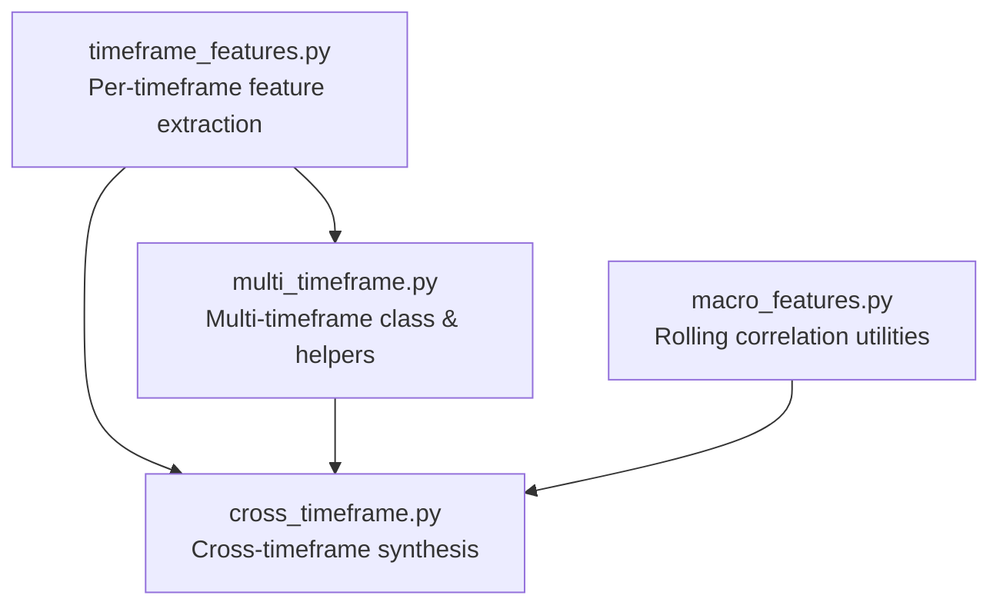
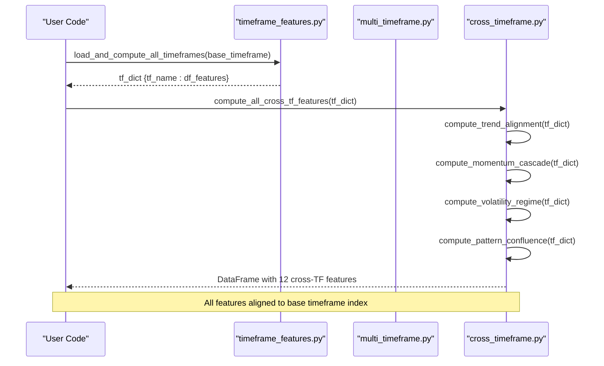
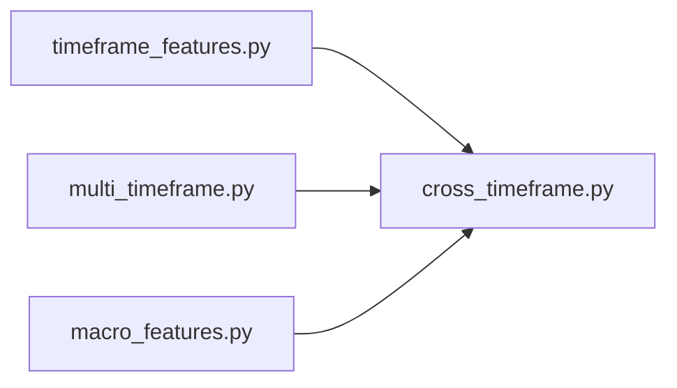

# Cross-Timeframe Features API

<cite>
**Referenced Files in This Document**
- [cross_timeframe.py](file://features/cross_timeframe.py)
- [multi_timeframe.py](file://features/multi_timeframe.py)
- [timeframe_features.py](file://features/timeframe_features.py)
- [macro_features.py](file://features/macro_features.py)
</cite>

## Table of Contents
1. [Introduction](#introduction)
2. [Project Structure](#project-structure)
3. [Core Components](#core-components)
4. [Architecture Overview](#architecture-overview)
5. [Detailed Component Analysis](#detailed-component-analysis)
6. [Dependency Analysis](#dependency-analysis)
7. [Performance Considerations](#performance-considerations)
8. [Troubleshooting Guide](#troubleshooting-guide)
9. [Conclusion](#conclusion)
10. [Appendices](#appendices)

## Introduction
This document provides detailed API documentation for cross-timeframe feature computation in the repository. It focuses on:
- The compute_all_cross_tf_features function and its subcomponents
- Inter-timeframe correlation calculations used elsewhere in the codebase
- Trend consistency metrics across timeframes
- Multi-timeframe momentum indicators and signal aggregation methods
- Parameter specifications for timeframe combinations, correlation windows, and aggregation logic
- Mathematical foundations and effectiveness of cross-timeframe analysis
- Best practices for selecting optimal timeframe combinations and avoiding overfitting

The goal is to enable users to compute robust multi-timeframe features that capture both short-term noise and long-term trends, and to integrate these features into trading models with sound statistical grounding.

## Project Structure
Cross-timeframe feature engineering spans three primary modules:
- Timeframe-level feature extraction (per timeframe)
- Multi-timeframe aggregation and alignment
- Cross-timeframe synthesis and advanced signals

**Diagram sources**
- [timeframe_features.py:22-99](file://features/timeframe_features.py#L22-L99)
- [multi_timeframe.py:32-96](file://features/multi_timeframe.py#L32-L96)
- [cross_timeframe.py:205-249](file://features/cross_timeframe.py#L205-L249)
- [macro_features.py:114-132](file://features/macro_features.py#L114-L132)

**Section sources**
- [timeframe_features.py:22-99](file://features/timeframe_features.py#L22-L99)
- [multi_timeframe.py:32-96](file://features/multi_timeframe.py#L32-L96)
- [cross_timeframe.py:205-249](file://features/cross_timeframe.py#L205-L249)
- [macro_features.py:114-132](file://features/macro_features.py#L114-L132)

## Core Components
- compute_all_cross_tf_features(tf_dict): Main entry point that computes 12 cross-timeframe features by combining trend alignment, momentum cascade, volatility regime, and pattern confluence from a dictionary of per-timeframe feature DataFrames.
- compute_trend_alignment(tf_dict): Computes trend agreement across timeframes using per-timeframe trend columns.
- compute_momentum_cascade(tf_dict): Computes inter-timeframe momentum interactions (e.g., D1×H1, H4×H1, H1×M15).
- compute_volatility_regime(tf_dict): Detects volatility regimes by comparing current volatility to recent/long-term averages.
- compute_pattern_confluence(tf_dict): Identifies support/resistance confluence and breakout alignment across timeframes.
- MultiTimeframeFeatures.create_features(data_dict): Builds per-timeframe features and adds cross-timeframe aggregates aligned to the fastest timeframe.
- load_and_compute_all_timeframes(base_timeframe, data_dir): Loads OHLCV data for multiple timeframes, computes per-timeframe features, and aligns them to a base timeframe.

Key outputs include:
- Trend alignment metrics: overall alignment, strength cascade, divergence
- Momentum cascades: pairwise interactions between higher and lower timeframes
- Volatility regime indicators: regime ratio, spike detection, compression flags
- Pattern confluence: support/resistance proximity and breakout alignment

**Section sources**
- [cross_timeframe.py:21-203](file://features/cross_timeframe.py#L21-L203)
- [cross_timeframe.py:205-249](file://features/cross_timeframe.py#L205-L249)
- [multi_timeframe.py:55-96](file://features/multi_timeframe.py#L55-L96)
- [timeframe_features.py:22-99](file://features/timeframe_features.py#L22-L99)
- [timeframe_features.py:236-304](file://features/timeframe_features.py#L236-L304)

## Architecture Overview
The system follows a layered architecture:
- Layer 1: Per-timeframe feature extraction (returns, volatility, momentum, trend, RSI, MACD, ATR, Bollinger position, volume ratios, distance to high/low)
- Layer 2: Multi-timeframe alignment and aggregation (forward-fill higher TFs to base TF index; compute cross-TF aggregates)
- Layer 3: Cross-timeframe synthesis (trend alignment, momentum cascade, volatility regime, pattern confluence)
- Integration: Rolling correlation utilities from macro module can be extended to compute inter-timeframe correlations if needed

**Diagram sources**
- [timeframe_features.py:236-304](file://features/timeframe_features.py#L236-L304)
- [cross_timeframe.py:205-249](file://features/cross_timeframe.py#L205-L249)

## Detailed Component Analysis

### compute_all_cross_tf_features(tf_dict)
- Purpose: Compute all 12 cross-timeframe features by aggregating trend alignment, momentum cascade, volatility regime, and pattern confluence.
- Input: tf_dict — dictionary mapping timeframe names to feature DataFrames produced by timeframe_features.compute_timeframe_features or similar.
- Output: DataFrame with 12 columns representing cross-timeframe features, aligned to the base timeframe index.
- Behavior:
  - Calls each subcomponent to compute grouped features
  - Concatenates results along columns
  - Fills NaN values with zeros
  - Logs summary and feature list

Parameter specifications:
- tf_dict keys: 'M5', 'M15', 'H1', 'H4', 'D1' (and optionally 'W1')
- Required per-timeframe columns:
  - Trend: {tf}_trend
  - Momentum: {tf}_momentum_10
  - Volatility: {tf}_volatility (used via H1)
  - Distance to high/low: {tf}_dist_to_high, {tf}_dist_to_low

Mathematical foundations:
- Trend alignment: Mean of normalized trend signals across timeframes yields an aggregate measure of directional agreement (-1 to +1).
- Momentum cascade: Multiplicative interaction of momentum signals across adjacent timeframes amplifies consistent flows and dampens conflicting ones.
- Volatility regime: Ratio of current volatility to rolling averages identifies spikes and compression regimes.
- Pattern confluence: Proximity-based scoring of support/resistance alignment and breakout confirmation via sign agreement of momentum signals.

Best practices:
- Ensure all timeframes are aligned to the same base index before calling this function.
- Validate presence of required columns; missing columns will default to neutral values.
- Use conservative thresholds for support/resistance proximity to avoid overfitting to noise.

**Section sources**
- [cross_timeframe.py:205-249](file://features/cross_timeframe.py#L205-L249)
- [cross_timeframe.py:21-66](file://features/cross_timeframe.py#L21-L66)
- [cross_timeframe.py:69-102](file://features/cross_timeframe.py#L69-L102)
- [cross_timeframe.py:105-138](file://features/cross_timeframe.py#L105-L138)
- [cross_timeframe.py:141-203](file://features/cross_timeframe.py#L141-L203)

### Trend Alignment Metrics
- trend_alignment_all: Average of per-timeframe trend signals; measures overall directional agreement.
- trend_strength_cascade: Product of trend signals from higher to lower timeframes; amplifies strong consensus.
- trend_divergence: Standard deviation of trend signals; quantifies disagreement across timeframes.

Implementation details:
- Uses per-timeframe trend columns generated by timeframe_features.compute_timeframe_features.
- Defaults to zero when no trend data available.

Effectiveness:
- Captures hierarchical trend structure; strong alignment indicates robust directional bias, while divergence warns of potential reversals.

**Section sources**
- [cross_timeframe.py:21-66](file://features/cross_timeframe.py#L21-L66)

### Multi-Timeframe Momentum Indicators
- momentum_d1_h1: Interaction between daily and hourly momentum.
- momentum_h4_h1: Interaction between 4-hour and hourly momentum.
- momentum_h1_m15: Interaction between hourly and 15-minute momentum.

Implementation details:
- Extracts {tf}_momentum_10 from each timeframe and computes pairwise products.
- Missing momentum series defaults to zero.

Effectiveness:
- Highlights momentum flow from higher to lower timeframes; positive products indicate aligned momentum, negative products suggest conflicting signals.

**Section sources**
- [cross_timeframe.py:69-102](file://features/cross_timeframe.py#L69-L102)

### Volatility Regime Detection
- volatility_regime: Current H1 volatility divided by long-term average (rolling 100-period mean); >1 indicates elevated volatility.
- volatility_spike: Binary flag when current volatility exceeds twice the recent rolling average (20-period).
- volatility_compression: Binary flag when current volatility falls below half the recent average.

Implementation details:
- Relies on H1 volatility column; defaults to neutral values if unavailable.

Effectiveness:
- Identifies regime shifts critical for strategy adaptation; spikes often precede breakouts, compression suggests impending moves.

**Section sources**
- [cross_timeframe.py:105-138](file://features/cross_timeframe.py#L105-L138)

### Pattern Confluence and Breakout Alignment
- support_confluence: Fraction of timeframes where price is near support within a threshold.
- resistance_confluence: Fraction of timeframes where price is near resistance within a threshold.
- breakout_alignment: Net score indicating whether all selected timeframes show momentum in the same direction.

Implementation details:
- Uses distances to recent high/low and momentum signs across M15/H1/H4.
- Thresholds define “near” support/resistance; breakout alignment requires unanimous momentum direction.

Effectiveness:
- Aggregates microstructure context; confluence increases confidence in support/resistance levels and breakout validity.

**Section sources**
- [cross_timeframe.py:141-203](file://features/cross_timeframe.py#L141-L203)

### MultiTimeframeFeatures Class
- create_features(data_dict): Produces per-timeframe features and adds cross-timeframe aggregates aligned to the fastest timeframe.
- _compute_tf_features(df, timeframe): Generates standard features (returns, volatility, momentum, moving averages, trend, RSI, MACD, ATR, Bollinger position, volume ratios, distance to high/low).
- _compute_cross_tf_features(data_dict): Adds cross-timeframe features including trend alignment, momentum cascade, volatility regime, and support/resistance confluence.

Parameter specifications:
- data_dict: Mapping of timeframe names to OHLCV DataFrames.
- TIMEFRAMES: Default set ['M5', 'M15', 'H1', 'H4', 'D1'].

Effectiveness:
- Provides a unified feature matrix aligned to the base timeframe, enabling downstream modeling with consistent temporal indexing.

**Section sources**
- [multi_timeframe.py:32-96](file://features/multi_timeframe.py#L32-L96)
- [multi_timeframe.py:98-156](file://features/multi_timeframe.py#L98-L156)
- [multi_timeframe.py:158-186](file://features/multi_timeframe.py#L158-L186)
- [multi_timeframe.py:188-303](file://features/multi_timeframe.py#L188-L303)

### Inter-Timeframe Correlation Calculations
While cross-timeframe feature functions primarily use product interactions and ratios, the macro module demonstrates rolling correlation computation that can be adapted for inter-timeframe analysis:
- compute_rolling_correlation(series1, series2, window=120): Computes rolling correlation between two return series over a specified window.

Usage example:
- To compute rolling correlation between D1 and H1 returns, pass their return series and choose a window appropriate for the desired sensitivity (e.g., 20–120 bars depending on timeframe).

Effectiveness:
- Captures dynamic co-movement across timeframes; useful for regime detection and diversification insights.

**Section sources**
- [macro_features.py:114-132](file://features/macro_features.py#L114-L132)

## Dependency Analysis
- cross_timeframe.py depends on per-timeframe features produced by timeframe_features.py (specifically columns like {tf}_trend, {tf}_momentum_10, {tf}_volatility, {tf}_dist_to_high, {tf}_dist_to_low).
- multi_timeframe.py builds per-timeframe features and adds cross-timeframe aggregates; it also provides helper functions for resampling and alignment.
- macro_features.py provides rolling correlation utilities that can be reused for inter-timeframe correlation analysis.

**Diagram sources**
- [timeframe_features.py:22-99](file://features/timeframe_features.py#L22-L99)
- [multi_timeframe.py:55-96](file://features/multi_timeframe.py#L55-L96)
- [cross_timeframe.py:205-249](file://features/cross_timeframe.py#L205-L249)
- [macro_features.py:114-132](file://features/macro_features.py#L114-L132)

**Section sources**
- [timeframe_features.py:22-99](file://features/timeframe_features.py#L22-L99)
- [multi_timeframe.py:55-96](file://features/multi_timeframe.py#L55-L96)
- [cross_timeframe.py:205-249](file://features/cross_timeframe.py#L205-L249)
- [macro_features.py:114-132](file://features/macro_features.py#L114-L132)

## Performance Considerations
- Vectorized operations: Most computations use pandas/numpy vectorization; ensure input DataFrames are properly indexed and sorted to avoid unnecessary reindexing overhead.
- Rolling windows: Larger windows increase memory and compute costs; choose windows based on data frequency and model latency requirements.
- Alignment: Forward-filling higher timeframes to the base index is efficient but may introduce stale information; validate alignment strategies for your use case.
- Feature explosion: Combining many timeframes increases dimensionality; consider feature selection or regularization to mitigate overfitting.

[No sources needed since this section provides general guidance]

## Troubleshooting Guide
Common issues and resolutions:
- Missing timeframe files: load_and_compute_all_timeframes raises FileNotFoundError for required files; ensure all expected CSVs exist in the data directory.
- Missing columns: If required per-timeframe columns (e.g., {tf}_trend, {tf}_momentum_10) are absent, cross-timeframe functions default to neutral values; verify feature computation pipeline produces expected columns.
- NaN handling: compute_all_cross_tf_features fills NaNs with zeros; check upstream computations for unexpected NaNs and adjust rolling windows or fill strategies.
- Timezone alignment: When integrating macro data, ensure timezone normalization and alignment to the gold price index to prevent misalignment errors.

**Section sources**
- [timeframe_features.py:236-304](file://features/timeframe_features.py#L236-L304)
- [cross_timeframe.py:205-249](file://features/cross_timeframe.py#L205-L249)
- [macro_features.py:78-112](file://features/macro_features.py#L78-L112)

## Conclusion
The cross-timeframe feature system provides a robust framework for capturing multi-horizon market dynamics. By combining trend alignment, momentum cascades, volatility regimes, and pattern confluence, it enables models to detect both short-term noise and long-term trends effectively. Adhering to best practices—such as careful timeframe selection, appropriate rolling windows, and rigorous validation—helps avoid overfitting and improves generalization.

[No sources needed since this section summarizes without analyzing specific files]

## Appendices

### API Usage Examples
- Compute cross-timeframe features:
  - Load per-timeframe features using load_and_compute_all_timeframes(base_timeframe='M5').
  - Pass the resulting tf_dict to compute_all_cross_tf_features to obtain the 12 cross-timeframe features.
- Identify trend alignments:
  - Inspect trend_alignment_all and trend_divergence to gauge consensus and disagreement across timeframes.
- Generate multi-timeframe signals:
  - Combine momentum cascade scores with breakout_alignment to filter entries where higher and lower timeframes agree.

**Section sources**
- [timeframe_features.py:236-304](file://features/timeframe_features.py#L236-L304)
- [cross_timeframe.py:205-249](file://features/cross_timeframe.py#L205-L249)

### Mathematical Foundations
- Trend alignment: Aggregate directional bias via mean of normalized trend signals; effective for detecting sustained moves.
- Momentum cascade: Multiplicative interactions amplify consistent flows and penalize conflicts; useful for confirming entries.
- Volatility regime: Ratios and thresholds identify regime shifts; essential for adaptive risk management.
- Pattern confluence: Proximity-based scoring captures structural levels; breakout alignment validates momentum-driven moves.

[No sources needed since this section explains conceptual mathematics]

### Best Practices
- Selecting timeframe combinations:
  - Use nested horizons (e.g., M5/M15 for entries, H1 for context, H4/D1 for trend) to balance responsiveness and stability.
  - Avoid overly granular combinations that increase noise and computational cost.
- Avoiding overfitting:
  - Limit the number of cross-timeframe interactions; prefer interpretable aggregates.
  - Use cross-validation and out-of-sample testing to validate feature efficacy.
  - Regularize models and prune weak features based on importance or stability metrics.
- Correlation windows:
  - Choose windows proportional to the timeframe and intended horizon; shorter windows react faster but are noisier.
  - Validate stability of correlations over different market regimes.

[No sources needed since this section provides general guidance]