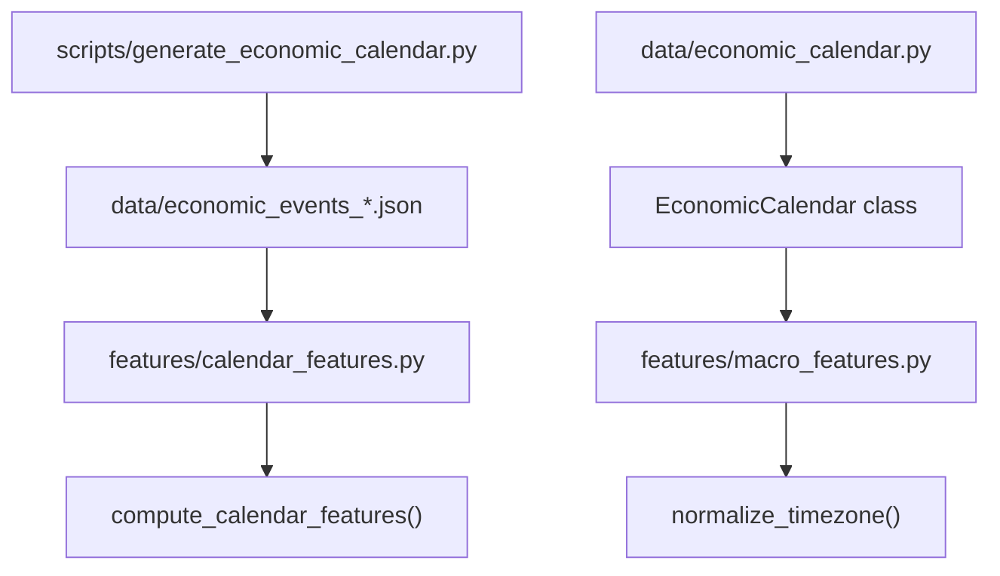
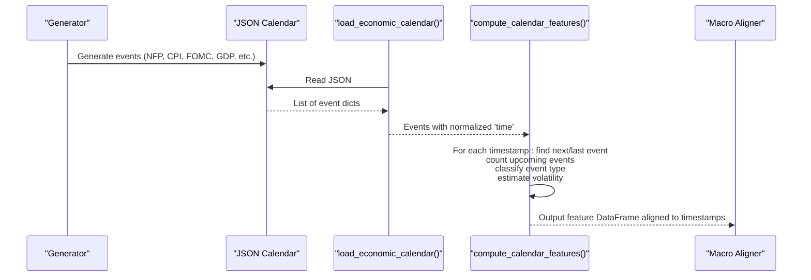
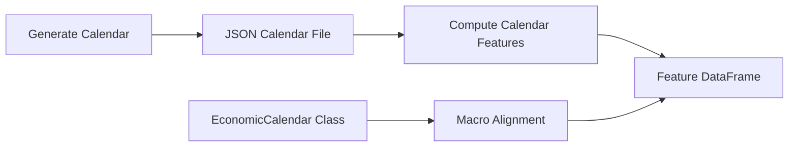

# Economic Calendar Features API

<cite>
**Referenced Files in This Document**
- [calendar_features.py](file://features/calendar_features.py)
- [economic_calendar.py](file://data/economic_calendar.py)
- [generate_economic_calendar.py](file://scripts/generate_economic_calendar.py)
- [macro_features.py](file://features/macro_features.py)
</cite>

## Table of Contents
1. [Introduction](#introduction)
2. [Project Structure](#project-structure)
3. [Core Components](#core-components)
4. [Architecture Overview](#architecture-overview)
5. [Detailed Component Analysis](#detailed-component-analysis)
6. [Dependency Analysis](#dependency-analysis)
7. [Performance Considerations](#performance-considerations)
8. [Troubleshooting Guide](#troubleshooting-guide)
9. [Conclusion](#conclusion)
10. [Appendices](#appendices)

## Introduction
This document provides detailed API documentation for the economic calendar feature computation used to detect high-impact macro events (e.g., NFP, CPI, FOMC decisions, GDP releases) and integrate them into trading strategy features. It focuses on:
- The load_economic_calendar function for loading event data from JSON
- The compute_calendar_features function for generating 8 time-aware features around events
- Event classification system for identifying major announcements
- Time windowing and volatility adjustments
- Integration examples with macro features and timezone handling
- Best practices to avoid lookahead bias when using calendar data

## Project Structure
The economic calendar feature pipeline spans three main areas:
- Data generation: scripts that produce a rule-based historical calendar of USD macro events
- Feature computation: functions that transform timestamps into event-aware features
- Macro integration: modules that align external macro series to market timestamps

**Diagram sources**
- [generate_economic_calendar.py:231-268](file://scripts/generate_economic_calendar.py#L231-L268)
- [calendar_features.py:23-50](file://features/calendar_features.py#L23-L50)
- [economic_calendar.py:27-113](file://data/economic_calendar.py#L27-L113)
- [macro_features.py:78-111](file://features/macro_features.py#L78-L111)

**Section sources**
- [generate_economic_calendar.py:1-310](file://scripts/generate_economic_calendar.py#L1-L310)
- [calendar_features.py:1-315](file://features/calendar_features.py#L1-L315)
- [economic_calendar.py:1-404](file://data/economic_calendar.py#L1-L404)
- [macro_features.py:1-513](file://features/macro_features.py#L1-L513)

## Core Components
- load_economic_calendar(filepath): Loads a JSON file of economic events and returns a list of event dicts with normalized datetime fields.
- compute_calendar_features(df_timestamps, calendar): Computes 8 event-aware features per timestamp, including proximity to next/last events, event density, impact flags, event windows, expected volatility multipliers, and type flags (NFP, FOMC).
- EconomicCalendar class: Provides an object-oriented interface to manage events, classify types, estimate volatility, and generate features for arbitrary timestamps.
- Macro timezone normalization: Utilities to align macro series to market timestamps while ensuring timezone-naive indices for consistent computations.

Key responsibilities:
- Detect high-impact events and mark proximity windows
- Compute time-to-event metrics and density measures
- Provide volatility expectations based on event type
- Offer one-hot style flags for specific event categories

**Section sources**
- [calendar_features.py:23-50](file://features/calendar_features.py#L23-L50)
- [calendar_features.py:111-249](file://features/calendar_features.py#L111-L249)
- [economic_calendar.py:27-113](file://data/economic_calendar.py#L27-L113)
- [economic_calendar.py:181-274](file://data/economic_calendar.py#L181-L274)
- [macro_features.py:78-111](file://features/macro_features.py#L78-L111)

## Architecture Overview
The system generates or loads a JSON calendar of macro events and computes features aligned to market timestamps. Two complementary implementations exist:
- Functional API in features/calendar_features.py for batch processing over DataFrame indexes
- Object-oriented API in data/economic_calendar.py for per-timestamp feature extraction and management

**Diagram sources**
- [generate_economic_calendar.py:231-268](file://scripts/generate_economic_calendar.py#L231-L268)
- [calendar_features.py:23-50](file://features/calendar_features.py#L23-L50)
- [calendar_features.py:111-249](file://features/calendar_features.py#L111-L249)
- [macro_features.py:78-111](file://features/macro_features.py#L78-L111)

## Detailed Component Analysis

### load_economic_calendar(filepath)
Purpose:
- Load a JSON calendar of economic events and normalize datetime fields to a unified format.

Parameters:
- filepath: Path to JSON file containing event records.

Returns:
- List of event dicts with keys including time (datetime), event (string), impact (string).

Behavior:
- If file not found, logs warning and returns empty list.
- Converts 'datetime' strings to datetime objects and ensures a 'time' key exists.

Usage notes:
- Designed for batch feature computation; pair with compute_calendar_features.

**Section sources**
- [calendar_features.py:23-50](file://features/calendar_features.py#L23-L50)

### compute_calendar_features(df_timestamps, calendar)
Purpose:
- Compute 8 event-aware features for each timestamp in the provided index.

Parameters:
- df_timestamps: Pandas DatetimeIndex representing market timestamps.
- calendar: List of event dicts from load_economic_calendar().

Returns:
- DataFrame with columns:
  - hours_to_event: Normalized hours until next event (capped at 1 week)
  - days_since_event: Normalized days since last event (capped at 30 days)
  - event_density: Count of upcoming events in next 7 days (normalized)
  - is_high_impact: Binary flag if next event is HIGH impact
  - in_event_window: Binary flag if within ±2 hours of next event
  - event_volatility_expected: Multiplier based on impact level
  - event_type_nfp: Binary flag for NFP-type events
  - event_type_fomc: Binary flag for FOMC/Fed-related events

Processing logic:
- For each timestamp:
  - Find next event and compute hours_to_event
  - Mark is_high_impact based on impact field
  - Set in_event_window if within ±2 hours
  - Assign event_volatility_expected based on impact
  - Classify event_type_nfp and event_type_fomc via string matching
  - Find last event and compute days_since_event
  - Count upcoming events in next 7 days for event_density
- Normalize features and fill NaNs

Edge cases:
- No future events: defaults to neutral values
- Missing calendar: fills all features with safe defaults

**Section sources**
- [calendar_features.py:111-249](file://features/calendar_features.py#L111-L249)

### EconomicCalendar class (data/economic_calendar.py)
Purpose:
- Manage economic events, classify types, estimate volatility, and provide per-timestamp features.

Key attributes:
- HIGH_IMPACT_EVENTS: List of keywords for high-impact USD events
- EVENT_VOLATILITY_MAP: Expected volatility multipliers by event type

Core methods:
- load_calendar(): Load JSON or fallback to default 2024 calendar
- get_features(current_time): Returns dict of features for a single timestamp
- _is_event_type(event, event_type): Keyword-based classification
- _estimate_volatility(event): Volatility multiplier based on event type and impact
- add_event(datetime_str, event_name, currency='USD', impact='HIGH'): Add manual events
- save_calendar(filename=None): Persist events to JSON
- get_upcoming_events(current_time, days_ahead=7): Retrieve upcoming events

Feature outputs include:
- days_until_event, hours_until_event
- is_high_impact, is_event_window
- is_nfp, is_cpi, is_fomc, is_fed_speech
- event_volatility_forecast
- event_in_24h, event_in_1h

Integration helper:
- add_calendar_features_to_dataframe(df, calendar=None): Adds calendar features to a DataFrame with a 'time' column

**Section sources**
- [economic_calendar.py:27-113](file://data/economic_calendar.py#L27-L113)
- [economic_calendar.py:181-274](file://data/economic_calendar.py#L181-L274)
- [economic_calendar.py:337-374](file://data/economic_calendar.py#L337-L374)

### Macro timezone normalization
Purpose:
- Ensure macro series are aligned to market timestamps with timezone-naive indices to prevent leakage and misalignment.

Key method:
- normalize_timezone(series, reference_index): Converts series to UTC then removes tz, reindexes to reference with forward-fill

Usage:
- Applied across macro feature computations to align DXY, SPX, yields, VIX, oil, BTC, EURUSD, silver/GLD to gold timestamps

**Section sources**
- [macro_features.py:78-111](file://features/macro_features.py#L78-L111)

### Event Classification System
Classification approach:
- String-based keyword matching against event names
- High-impact detection via impact field and predefined keywords
- Type flags:
  - NFP: matches 'NFP' or 'NONFARM'
  - FOMC: matches 'FOMC' or 'FEDERAL RESERVE'
  - CPI: matches 'CPI' or 'CONSUMER PRICE INDEX' or 'INFLATION'
  - Fed speech: matches 'FED CHAIR' or 'POWELL SPEECH' or 'YELLEN SPEECH'

Volatility estimation:
- Uses EVENT_VOLATILITY_MAP to assign multipliers based on event type
- Unknown events fall back to impact-based defaults

**Section sources**
- [economic_calendar.py:38-67](file://data/economic_calendar.py#L38-L67)
- [economic_calendar.py:252-274](file://data/economic_calendar.py#L252-L274)
- [calendar_features.py:182-187](file://features/calendar_features.py#L182-L187)

### Example Integration Patterns
- Batch feature computation:
  - Load calendar via load_economic_calendar()
  - Pass DataFrame index to compute_calendar_features()
  - Concatenate resulting features with other feature sets
- Per-timestamp features:
  - Instantiate EconomicCalendar()
  - Call get_features(timestamp) for live or rolling computations
  - Use add_calendar_features_to_dataframe() to append features to OHLC data

Timezone handling:
- Ensure all timestamps are timezone-naive before alignment
- Use normalize_timezone() when merging macro series with market data

Event frequency management:
- Use count_upcoming_events() or get_upcoming_events() to assess event density over configurable windows
- Cap densities and normalize to stable ranges for modeling

**Section sources**
- [calendar_features.py:23-50](file://features/calendar_features.py#L23-L50)
- [calendar_features.py:111-249](file://features/calendar_features.py#L111-L249)
- [economic_calendar.py:181-274](file://data/economic_calendar.py#L181-L274)
- [macro_features.py:78-111](file://features/macro_features.py#L78-L111)

## Dependency Analysis
High-level dependencies:
- scripts/generate_economic_calendar.py produces JSON calendars used by features/calendar_features.py
- features/calendar_features.py depends on loaded event lists and processes timestamps
- data/economic_calendar.py provides an alternative object-oriented interface and helpers
- features/macro_features.py normalizes macro series to market timestamps for alignment

**Diagram sources**
- [generate_economic_calendar.py:231-268](file://scripts/generate_economic_calendar.py#L231-L268)
- [calendar_features.py:23-50](file://features/calendar_features.py#L23-L50)
- [economic_calendar.py:27-113](file://data/economic_calendar.py#L27-L113)
- [macro_features.py:78-111](file://features/macro_features.py#L78-L111)

**Section sources**
- [generate_economic_calendar.py:1-310](file://scripts/generate_economic_calendar.py#L1-L310)
- [calendar_features.py:1-315](file://features/calendar_features.py#L1-L315)
- [economic_calendar.py:1-404](file://data/economic_calendar.py#L1-L404)
- [macro_features.py:1-513](file://features/macro_features.py#L1-L513)

## Performance Considerations
- Batch vs per-timestamp:
  - compute_calendar_features() is optimized for vectorized-like iteration over timestamps; suitable for large datasets
  - EconomicCalendar.get_features() is more flexible but may be slower for bulk operations
- Event search complexity:
  - Linear scans for next/last events per timestamp; consider sorting events and using binary search for very large calendars
- Normalization and caps:
  - Features are capped and normalized to reduce outlier influence and improve model stability
- Timezone alignment:
  - Ensuring timezone-naive indices avoids costly conversions during alignment

[No sources needed since this section provides general guidance]

## Troubleshooting Guide
Common issues and resolutions:
- Missing calendar file:
  - load_economic_calendar() returns empty list; ensure JSON path exists or generate via scripts/generate_economic_calendar.py
- No future events detected:
  - compute_calendar_features() assigns neutral defaults; verify event dates relative to timestamp range
- Timezone misalignment:
  - Use normalize_timezone() to align macro series to market timestamps; ensure both series are timezone-naive
- Unexpected event classification:
  - Check event name strings match keywords in HIGH_IMPACT_EVENTS and EVENT_VOLATILITY_MAP
- Excessive NaNs:
  - Verify input DataFrame index is sorted and contains valid datetimes; check for gaps in timestamps

**Section sources**
- [calendar_features.py:23-50](file://features/calendar_features.py#L23-L50)
- [calendar_features.py:111-249](file://features/calendar_features.py#L111-L249)
- [macro_features.py:78-111](file://features/macro_features.py#L78-L111)

## Conclusion
The economic calendar feature system provides robust tools to detect high-impact macro events and encode their timing and expected volatility into trading features. By combining functional and object-oriented APIs, users can integrate event awareness into models while maintaining strict temporal integrity and avoiding lookahead bias through careful timestamp alignment and conservative defaults.

[No sources needed since this section summarizes without analyzing specific files]

## Appendices

### API Reference Summary
- load_economic_calendar(filepath)
  - Input: filepath (str)
  - Output: list of event dicts with 'time', 'event', 'impact'
- compute_calendar_features(df_timestamps, calendar)
  - Input: DatetimeIndex, list of event dicts
  - Output: DataFrame with 8 calendar features
- EconomicCalendar
  - Methods: load_calendar(), get_features(), add_event(), save_calendar(), get_upcoming_events()
  - Attributes: HIGH_IMPACT_EVENTS, EVENT_VOLATILITY_MAP
- normalize_timezone(series, reference_index)
  - Input: Series with datetime index, reference DatetimeIndex
  - Output: Series aligned to reference with timezone-naive index

**Section sources**
- [calendar_features.py:23-50](file://features/calendar_features.py#L23-L50)
- [calendar_features.py:111-249](file://features/calendar_features.py#L111-L249)
- [economic_calendar.py:27-113](file://data/economic_calendar.py#L27-L113)
- [economic_calendar.py:181-274](file://data/economic_calendar.py#L181-L274)
- [macro_features.py:78-111](file://features/macro_features.py#L78-L111)

### Best Practices to Avoid Lookahead Bias
- Always compute features using only past and present information relative to each timestamp
- Do not use future event times to influence current features beyond defined windows (e.g., ±2 hours)
- Ensure event calendars are generated offline and do not include real-time updates during training
- Align macro series using forward-fill to avoid peeking into future values
- Validate that no feature uses post-event outcomes to predict pre-event behavior

[No sources needed since this section provides general guidance]