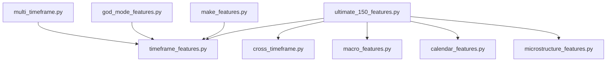
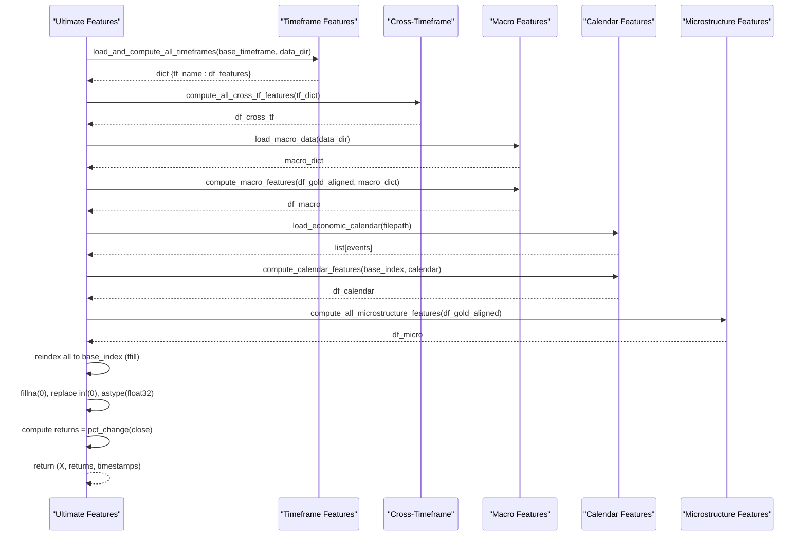
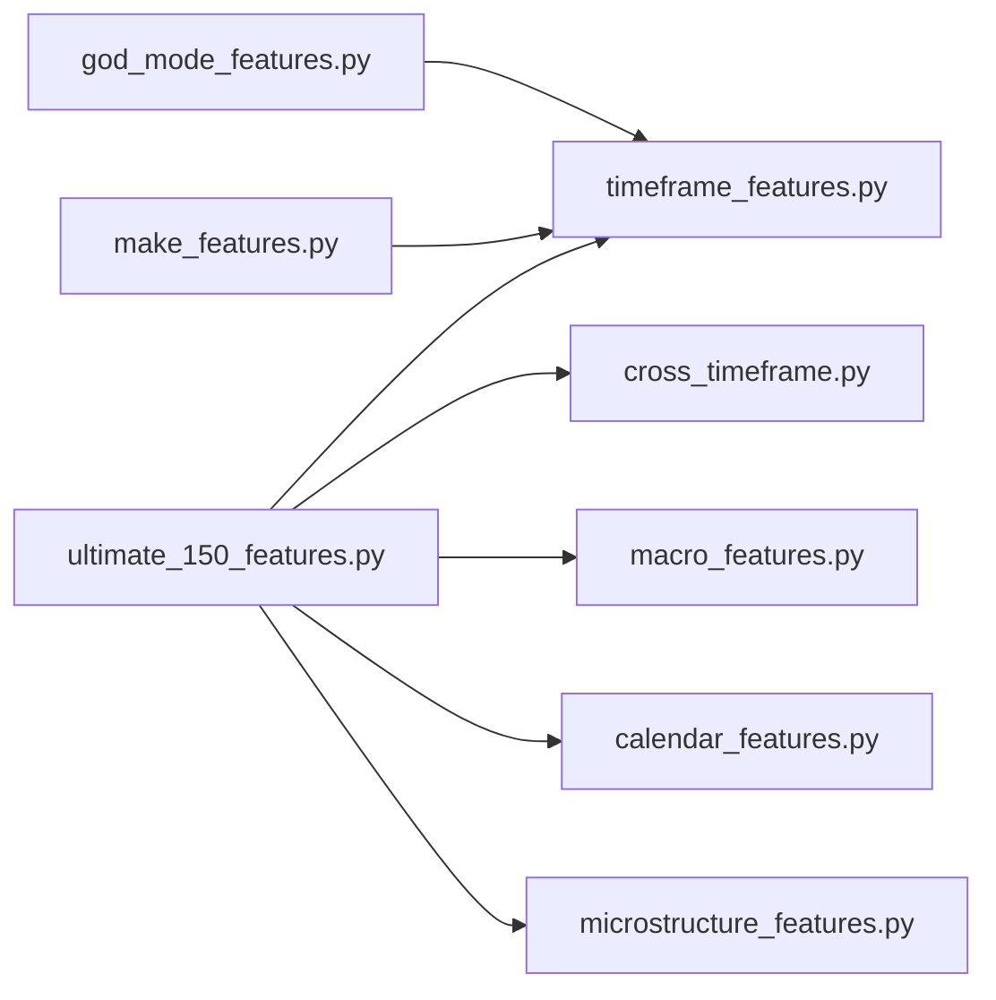

# Feature Engineering API

<cite>
**Referenced Files in This Document**
- [ultimate_150_features.py](file://features/ultimate_150_features.py)
- [timeframe_features.py](file://features/timeframe_features.py)
- [macro_features.py](file://features/macro_features.py)
- [calendar_features.py](file://features/calendar_features.py)
- [microstructure_features.py](file://features/microstructure_features.py)
- [cross_timeframe.py](file://features/cross_timeframe.py)
- [multi_timeframe.py](file://features/multi_timeframe.py)
- [god_mode_features.py](file://features/god_mode_features.py)
- [make_features.py](file://features/make_features.py)
</cite>

## Table of Contents
1. Introduction
2. Project Structure
3. Core Components
4. Architecture Overview
5. Detailed Component Analysis
6. Dependency Analysis
7. Performance Considerations
8. Troubleshooting Guide
9. Conclusion
10. Appendices

## Introduction
This document provides a comprehensive API reference for the feature engineering system that powers the trading AI. It covers:
- Technical indicator computations across multiple timeframes (M5, M15, H1, H4, D1, W1)
- Macro correlation analysis with VIX, Oil, Bitcoin, DXY, SPX, US10Y, EURUSD, Silver/GLD
- Multi-timeframe feature generation and cross-timeframe intelligence
- Economic calendar features for event detection and impact scoring
- Market microstructure features for session effects, volume analysis, and liquidity metrics
- The Ultimate 150+ Features integration class and functions to compute complete feature matrices
- Usage examples for combining feature sets and handling missing data
- Performance considerations and memory management strategies for large datasets

## Project Structure
The feature engineering system is organized into modular components under the features directory:
- ultimate_150_features.py: Master integrator that combines all feature sources into a unified matrix
- timeframe_features.py: Computes 16 standardized technical indicators per timeframe
- macro_features.py: Computes macro correlations and regime features from external market series
- calendar_features.py: Detects economic events and computes timing and impact features
- microstructure_features.py: Captures session effects, time-of-day patterns, volume imbalance, and liquidity regimes
- cross_timeframe.py: Derives cross-timeframe signals such as trend alignment, momentum cascade, volatility regime, and pattern confluence
- multi_timeframe.py: Class-based multi-timeframe feature builder with resampling utilities
- god_mode_features.py: Alternative integrated pipeline producing 100+ features from base OHLCV plus macro inputs
- make_features.py: Lightweight single-timeframe feature builder used by some training scripts

**Diagram sources**
- [ultimate_150_features.py:27-226](file://features/ultimate_150_features.py#L27-L226)
- [timeframe_features.py:22-99](file://features/timeframe_features.py#L22-L99)
- [cross_timeframe.py:205-249](file://features/cross_timeframe.py#L205-L249)
- [macro_features.py:363-445](file://features/macro_features.py#L363-L445)
- [calendar_features.py:111-249](file://features/calendar_features.py#L111-L249)
- [microstructure_features.py:170-225](file://features/microstructure_features.py#L170-L225)

**Section sources**
- [ultimate_150_features.py:27-226](file://features/ultimate_150_features.py#L27-L226)
- [timeframe_features.py:22-99](file://features/timeframe_features.py#L22-L99)
- [macro_features.py:363-445](file://features/macro_features.py#L363-L445)
- [calendar_features.py:111-249](file://features/calendar_features.py#L111-L249)
- [microstructure_features.py:170-225](file://features/microstructure_features.py#L170-L225)
- [cross_timeframe.py:205-249](file://features/cross_timeframe.py#L205-L249)
- [multi_timeframe.py:32-96](file://features/multi_timeframe.py#L32-L96)
- [god_mode_features.py:291-379](file://features/god_mode_features.py#L291-L379)
- [make_features.py:18-78](file://features/make_features.py#L18-L78)

## Core Components
- Ultimate 150+ Features integrator: Orchestrates loading timeframe features, computing cross-timeframe features, macro features, calendar features, and microstructure features; aligns them to a base index; cleans NaNs and infinities; converts to float32; computes target returns; returns feature matrix, returns, and timestamps.
- Timeframe features: For each supported timeframe (M5, M15, H1, H4, D1, W1), computes 16 features including price action, moving averages, RSI, MACD, ATR, Bollinger Band position, volume ratio, and distance to recent high/low.
- Macro features: Loads macro series (DXY, SPX, US10Y, VIX, Oil, Bitcoin, EURUSD, Silver, GLD), normalizes timezones, computes returns, momentum, and rolling correlations with gold; aggregates into 24 features aligned back to the base timeframe.
- Calendar features: Loads an economic calendar JSON, detects next/last events, computes hours/days since or until events, event density, high-impact flags, event window flags, expected volatility multiplier, and NFP/FOMC type flags.
- Microstructure features: Computes session effects (Asian/London/NY/overlap), time features (hour/day/week/month), volume profile and imbalance, spread proxy and liquidity regime.
- Cross-timeframe features: Aggregates trend alignment, momentum cascade, volatility regime, and support/resistance confluence across timeframes.
- Multi-timeframe class: Provides a class-based interface to create features across multiple timeframes and derive cross-timeframe interactions.
- God Mode features: Alternative integrated pipeline producing 100+ features from base OHLCV plus optional macro data.
- Make features: Lightweight single-timeframe feature builder with normalization and return computation.

**Section sources**
- [ultimate_150_features.py:27-226](file://features/ultimate_150_features.py#L27-L226)
- [timeframe_features.py:22-99](file://features/timeframe_features.py#L22-L99)
- [macro_features.py:26-75](file://features/macro_features.py#L26-L75)
- [macro_features.py:114-132](file://features/macro_features.py#L114-L132)
- [macro_features.py:135-360](file://features/macro_features.py#L135-L360)
- [macro_features.py:363-445](file://features/macro_features.py#L363-L445)
- [calendar_features.py:23-50](file://features/calendar_features.py#L23-L50)
- [calendar_features.py:53-108](file://features/calendar_features.py#L53-L108)
- [calendar_features.py:111-249](file://features/calendar_features.py#L111-L249)
- [microstructure_features.py:22-51](file://features/microstructure_features.py#L22-L51)
- [microstructure_features.py:54-86](file://features/microstructure_features.py#L54-L86)
- [microstructure_features.py:89-130](file://features/microstructure_features.py#L89-L130)
- [microstructure_features.py:133-167](file://features/microstructure_features.py#L133-L167)
- [microstructure_features.py:170-225](file://features/microstructure_features.py#L170-L225)
- [cross_timeframe.py:21-66](file://features/cross_timeframe.py#L21-L66)
- [cross_timeframe.py:69-102](file://features/cross_timeframe.py#L69-L102)
- [cross_timeframe.py:105-138](file://features/cross_timeframe.py#L105-L138)
- [cross_timeframe.py:141-202](file://features/cross_timeframe.py#L141-L202)
- [cross_timeframe.py:205-249](file://features/cross_timeframe.py#L205-L249)
- [multi_timeframe.py:32-96](file://features/multi_timeframe.py#L32-L96)
- [multi_timeframe.py:98-156](file://features/multi_timeframe.py#L98-L156)
- [multi_timeframe.py:158-186](file://features/multi_timeframe.py#L158-L186)
- [multi_timeframe.py:188-317](file://features/multi_timeframe.py#L188-L317)
- [multi_timeframe.py:350-396](file://features/multi_timeframe.py#L350-L396)
- [god_mode_features.py:23-50](file://features/god_mode_features.py#L23-L50)
- [god_mode_features.py:53-131](file://features/god_mode_features.py#L53-L131)
- [god_mode_features.py:134-191](file://features/god_mode_features.py#L134-L191)
- [god_mode_features.py:194-232](file://features/god_mode_features.py#L194-L232)
- [god_mode_features.py:235-288](file://features/god_mode_features.py#L235-L288)
- [god_mode_features.py:291-379](file://features/god_mode_features.py#L291-L379)
- [make_features.py:6-16](file://features/make_features.py#L6-L16)
- [make_features.py:18-78](file://features/make_features.py#L18-L78)

## Architecture Overview
The Ultimate 150+ Features pipeline integrates five major feature sources and aligns them to a common base index. It then cleans data, computes target returns, and outputs arrays ready for training.

**Diagram sources**
- [ultimate_150_features.py:27-226](file://features/ultimate_150_features.py#L27-L226)
- [timeframe_features.py:236-304](file://features/timeframe_features.py#L236-L304)
- [cross_timeframe.py:205-249](file://features/cross_timeframe.py#L205-L249)
- [macro_features.py:26-75](file://features/macro_features.py#L26-L75)
- [macro_features.py:363-445](file://features/macro_features.py#L363-L445)
- [calendar_features.py:23-50](file://features/calendar_features.py#L23-L50)
- [calendar_features.py:111-249](file://features/calendar_features.py#L111-L249)
- [microstructure_features.py:170-225](file://features/microstructure_features.py#L170-L225)

## Detailed Component Analysis

### Ultimate 150+ Features API
- Function: make_ultimate_features(base_timeframe='M5', data_dir='data')
- Inputs:
  - base_timeframe: One of 'M5', 'M15', 'H1', 'H4', 'D1', 'W1' (recommended 'M5' for speed)
  - data_dir: Directory containing CSV files for timeframes and macro data
- Outputs:
  - X: ndarray shape (N, 152+) dtype float32
  - returns: ndarray shape (N,) dtype float32
  - timestamps: DatetimeIndex shape (N,)
- Behavior:
  - Loads timeframe features for all supported timeframes
  - Computes cross-timeframe features
  - Loads macro data and computes macro features aligned to base index
  - Loads economic calendar and computes calendar features
  - Computes microstructure features
  - Aligns all feature DataFrames to base index using forward-fill
  - Cleans NaNs and infinities, converts to float32
  - Computes target returns from base timeframe close prices
- Notes:
  - Missing W1 file is skipped gracefully
  - Macro features may be reduced if some macro files are missing
  - Calendar features default to safe values when no calendar is available

**Section sources**
- [ultimate_150_features.py:27-226](file://features/ultimate_150_features.py#L27-L226)

### Timeframe Features API
- Function: compute_timeframe_features(df, tf_name)
- Inputs:
  - df: DataFrame with columns open, high, low, close, volume and DatetimeIndex
  - tf_name: Timeframe name ('M5', 'M15', 'H1', 'H4', 'D1', 'W1')
- Outputs:
  - DataFrame with 16 features prefixed by tf_name
- Features:
  - Price Action: return, volatility (20-period std), momentum_5, momentum_10, momentum_20
  - Trend Indicators: ma_fast (10), ma_slow (50), ma_diff normalized, trend direction (+1/-1)
  - Technical Indicators: rsi (14-period normalized 0-1), macd (normalized histogram), atr_pct (ATR/close), bb_position (0-1)
  - Volume & S/R: volume_ratio (current/20 avg), dist_to_high (50-period), dist_to_low (50-period)
- Helper Functions:
  - compute_rsi(prices, period=14): Returns RSI series filled with 50 where NaN
  - compute_macd(prices, fast=12, slow=26, signal=9): Returns normalized MACD histogram
  - compute_atr(df, period=14): Returns ATR series filled with 0 where NaN
  - compute_bb_position(prices, period=20, num_std=2): Returns BB position clipped to 0-1
- Utility:
  - load_timeframe_data(filepath): Reads CSV, parses time, sets index, validates required columns
  - align_timeframes(tf_dict, base_timeframe='M5'): Reindexes higher TFs to base using ffill
  - load_and_compute_all_timeframes(base_timeframe='M5', data_dir='data'): Loads all timeframe files, computes features, aligns to base

**Section sources**
- [timeframe_features.py:22-99](file://features/timeframe_features.py#L22-L99)
- [timeframe_features.py:102-178](file://features/timeframe_features.py#L102-L178)
- [timeframe_features.py:181-233](file://features/timeframe_features.py#L181-L233)
- [timeframe_features.py:236-304](file://features/timeframe_features.py#L236-L304)

### Macro Features API
- Function: load_macro_data(data_dir='data')
- Inputs:
  - data_dir: Directory containing macro CSV files
- Outputs:
  - Dict mapping names to Series: dxy, spx, us10y, vix, oil, btc, eur, silver, gld
- Behavior:
  - Reads daily series, converts time to timezone-naive UTC, sets index, selects close column
  - Logs warnings for missing files
- Function: compute_macro_features(df_gold, macro_dict)
- Inputs:
  - df_gold: Gold price DataFrame (intraday or daily)
  - macro_dict: Output from load_macro_data()
- Outputs:
  - DataFrame with up to 24 macro features aligned to df_gold index
- Behavior:
  - Resamples gold to daily if needed for macro alignment
  - Computes per-source features:
    - DXY: return, momentum (20-day), gold-DXY correlation (120-day rolling)
    - SPX: return, momentum (20-day), gold-SPX correlation
    - US10Y: change, momentum (20-day diff), gold-yields correlation
    - VIX: level normalized by 50, change, regime (>20 high fear)
    - Oil: return, momentum (20-day), gold-oil correlation
    - Bitcoin: return, momentum (20-day), gold-BTC correlation
    - EURUSD: return, momentum (20-day), gold-EUR correlation
    - Silver/GLD: gold-silver ratio normalized, gold-silver correlation, GLD flow proxy
  - Aligns daily macro features back to original gold timeframe via ffill
  - Fills NaNs with 0.0
- Helper:
  - normalize_timezone(series, reference_index): Ensures timezone-naive alignment and forward-fills to reference index
  - compute_rolling_correlation(series1, series2, window=120): Rolling correlation on returns

**Section sources**
- [macro_features.py:26-75](file://features/macro_features.py#L26-L75)
- [macro_features.py:78-132](file://features/macro_features.py#L78-L132)
- [macro_features.py:135-360](file://features/macro_features.py#L135-L360)
- [macro_features.py:363-445](file://features/macro_features.py#L363-L445)

### Calendar Features API
- Function: load_economic_calendar(filepath='data/economic_events_2015_2025.json')
- Inputs:
  - filepath: Path to JSON file containing economic events
- Outputs:
  - List of event dicts with keys: time (datetime), event (string), impact (string)
- Behavior:
  - Parses datetime strings, handles backward compatibility with 'datetime' key
  - Returns empty list if file not found
- Function: compute_calendar_features(df_timestamps, calendar)
- Inputs:
  - df_timestamps: DatetimeIndex from gold data
  - calendar: Output from load_economic_calendar()
- Outputs:
  - DataFrame with 8 calendar features:
    - hours_to_event: Hours until next event (capped at 168h, normalized to 0-1)
    - days_since_event: Days since last event (capped at 30d, normalized to 0-1)
    - event_density: Count of upcoming events in next 7 days (capped at 10, normalized to 0-1)
    - is_high_impact: Flag for next event impact HIGH
    - in_event_window: Flag within ±2 hours of next event
    - event_volatility_expected: Multiplier based on impact (HIGH=2.0, MEDIUM=1.5, else 1.0)
    - event_type_nfp: Flag for NFP/NONFARM
    - event_type_fomc: Flag for FOMC/FEDERAL RESERVE
- Behavior:
  - Iterates timestamps to find next and last events
  - Computes derived features and normalizes ranges
  - Fills NaNs with 0.0
  - Defaults to safe values when calendar is empty

**Section sources**
- [calendar_features.py:23-50](file://features/calendar_features.py#L23-L50)
- [calendar_features.py:53-108](file://features/calendar_features.py#L53-L108)
- [calendar_features.py:111-249](file://features/calendar_features.py#L111-L249)

### Microstructure Features API
- Function: compute_all_microstructure_features(df)
- Inputs:
  - df: DataFrame with OHLCV and DatetimeIndex
- Outputs:
  - DataFrame with 12 microstructure features grouped as:
    - Session Effects: session_asian, session_london, session_ny, session_overlap
    - Time Effects: hour_of_day (0-1), day_of_week (0-1), week_of_month (first/last/middle), month_of_year (0-1)
    - Volume Analysis: volume_profile (percentile rank over 100), volume_imbalance (net signed volume / total)
    - Liquidity: spread_m5 ((high-low)/close), liquidity_regime (-1/1 based on spread vs rolling mean)
- Behavior:
  - Handles missing volume or OHLC columns with defaults
  - Fills NaNs with appropriate defaults
- Sub-functions:
  - compute_session_features(df): Boolean session flags based on UTC hour ranges
  - compute_time_features(df): Normalized time features
  - compute_volume_features(df): Percentile rank and signed volume imbalance
  - compute_liquidity_features(df): Spread proxy and regime classification

**Section sources**
- [microstructure_features.py:22-51](file://features/microstructure_features.py#L22-L51)
- [microstructure_features.py:54-86](file://features/microstructure_features.py#L54-L86)
- [microstructure_features.py:89-130](file://features/microstructure_features.py#L89-L130)
- [microstructure_features.py:133-167](file://features/microstructure_features.py#L133-L167)
- [microstructure_features.py:170-225](file://features/microstructure_features.py#L170-L225)

### Cross-Timeframe Features API
- Function: compute_all_cross_tf_features(tf_dict)
- Inputs:
  - tf_dict: Dict of feature DataFrames from timeframe_features module keyed by timeframe name
- Outputs:
  - DataFrame with 12 cross-timeframe features:
    - Trend Alignment: trend_alignment_all (mean across trends), trend_strength_cascade (product cascade), trend_divergence (std across trends)
    - Momentum Cascade: momentum_d1_h1, momentum_h4_h1, momentum_h1_m15 (pairwise products)
    - Volatility Regime: volatility_regime (current vs long-term), volatility_spike (binary spike), volatility_compression (binary compression)
    - Pattern Confluence: support_confluence, resistance_confluence, breakout_alignment (all TF momentum agreement)
- Behavior:
  - Uses available timeframe columns; fills missing with zeros
  - Aligns output to M5 index

**Section sources**
- [cross_timeframe.py:21-66](file://features/cross_timeframe.py#L21-L66)
- [cross_timeframe.py:69-102](file://features/cross_timeframe.py#L69-L102)
- [cross_timeframe.py:105-138](file://features/cross_timeframe.py#L105-L138)
- [cross_timeframe.py:141-202](file://features/cross_timeframe.py#L141-L202)
- [cross_timeframe.py:205-249](file://features/cross_timeframe.py#L205-L249)

### Multi-Timeframe Class API
- Class: MultiTimeframeFeatures(timeframes=None)
- Methods:
  - create_features(data_dict): Produces combined features across specified timeframes and adds cross-timeframe features
  - _compute_tf_features(df, timeframe): Computes standard features per timeframe (returns, volatility, momentum, MA diff, trend, RSI, ATR, BB position, volume ratio)
  - _compute_cross_tf_features(data_dict): Adds trend alignment, momentum cascade, volatility regime, support/resistance confluence
  - _trend_alignment(data_dict): Average trend direction across timeframes
  - _momentum_cascade(data_dict): Product of higher and lower timeframe momentum
  - _volatility_regime(data_dict): Ratio of current to long-term volatility
  - _support_resistance_confluence(data_dict): Counts near support/resistance across timeframes
  - _get_ma_window(timeframe, speed): Returns timeframe-specific MA windows
  - _compute_rsi(prices, period=14): Standard RSI implementation
  - _compute_atr(df, period=14): Standard ATR implementation
- Utility:
  - create_multi_timeframe_data(df_base, base_tf='H1'): Resamples base OHLCV to M5/M15/H1/H4/D1

**Section sources**
- [multi_timeframe.py:32-96](file://features/multi_timeframe.py#L32-L96)
- [multi_timeframe.py:98-156](file://features/multi_timeframe.py#L98-L156)
- [multi_timeframe.py:158-186](file://features/multi_timeframe.py#L158-L186)
- [multi_timeframe.py:188-317](file://features/multi_timeframe.py#L188-L317)
- [multi_timeframe.py:350-396](file://features/multi_timeframe.py#L350-L396)

### God Mode Features API
- Function: make_god_mode_features(df, use_multi_timeframe=True)
- Inputs:
  - df: Base DataFrame with OHLCV and optional macro columns (dxy_close, spx_close, us10y_close)
  - use_multi_timeframe: If True, resample to H4/D1 and compute multi-TF features
- Outputs:
  - DataFrame with 100+ features combining timeframe, cross-timeframe, macro, and calendar placeholders
- Behavior:
  - Computes timeframe features for H1/H4/D1 (or single timeframe)
  - Aligns higher TFs to H1 via ffill
  - Computes cross-timeframe features
  - Computes macro features (returns, momentum, rolling correlations)
  - Adds placeholder calendar features
  - Fills NaNs with 0.0
- Function: make_features(csv_path, use_multi_timeframe=True)
- Inputs:
  - csv_path: Path to OHLCV CSV with optional macro columns
- Outputs:
  - features: ndarray (N, F) dtype float32
  - returns: ndarray (N,) dtype float32
- Behavior:
  - Loads CSV, creates features, computes log returns, aligns shapes

**Section sources**
- [god_mode_features.py:23-50](file://features/god_mode_features.py#L23-L50)
- [god_mode_features.py:53-131](file://features/god_mode_features.py#L53-L131)
- [god_mode_features.py:134-191](file://features/god_mode_features.py#L134-L191)
- [god_mode_features.py:194-232](file://features/god_mode_features.py#L194-L232)
- [god_mode_features.py:235-288](file://features/god_mode_features.py#L235-L288)
- [god_mode_features.py:291-379](file://features/god_mode_features.py#L291-L379)
- [god_mode_features.py:382-413](file://features/god_mode_features.py#L382-L413)

### Lightweight Make Features API
- Function: compute_features(df)
- Inputs:
  - df: OHLCV DataFrame with optional macro columns
- Outputs:
  - df_cleaned: DataFrame with features and returns
  - feats: ndarray (N, F) dtype float32
  - rets: ndarray (N,) dtype float32
- Behavior:
  - Computes returns, volatility, momentum, MA diff, RSI, MACD diff
  - Adds macro returns and correlations if available
  - Drops initial warm-up rows, fills NaNs/infs, normalizes features
- Function: make_features(csv_path, window=64)
- Inputs:
  - csv_path: Path to OHLCV CSV
- Outputs:
  - df, feats, rets as above

**Section sources**
- [make_features.py:6-16](file://features/make_features.py#L6-L16)
- [make_features.py:18-78](file://features/make_features.py#L18-L78)

## Dependency Analysis
- ultimate_150_features.py depends on:
  - timeframe_features.load_and_compute_all_timeframes
  - cross_timeframe.compute_all_cross_tf_features
  - macro_features.load_macro_data and compute_macro_features
  - calendar_features.load_economic_calendar and compute_calendar_features
  - microstructure_features.compute_all_microstructure_features
- timeframe_features.py provides core technical indicators reused by other modules
- macro_features.py relies on external daily series and performs timezone normalization and rolling correlation
- calendar_features.py depends on a JSON calendar file and processes event timing
- microstructure_features.py depends on OHLCV data and time index
- cross_timeframe.py depends on outputs from timeframe_features
- multi_timeframe.py can operate independently or feed into other pipelines
- god_mode_features.py provides an alternative integrated pipeline with its own timeframe and macro logic
- make_features.py is a minimal pipeline used by some training scripts

**Diagram sources**
- [ultimate_150_features.py:27-226](file://features/ultimate_150_features.py#L27-L226)
- [god_mode_features.py:291-379](file://features/god_mode_features.py#L291-L379)
- [make_features.py:18-78](file://features/make_features.py#L18-L78)

**Section sources**
- [ultimate_150_features.py:27-226](file://features/ultimate_150_features.py#L27-L226)
- [god_mode_features.py:291-379](file://features/god_mode_features.py#L291-L379)
- [make_features.py:18-78](file://features/make_features.py#L18-L78)

## Performance Considerations
- Memory efficiency:
  - Ultimate pipeline converts final feature matrix to float32 to reduce memory usage
  - Forward-fill alignment avoids creating excessive intermediate copies
  - Rolling computations are vectorized via pandas/numpy
- Large dataset handling:
  - Timeframe loading supports optional W1 file; missing files are skipped gracefully
  - Macro features resample gold to daily for correlation calculations to reduce computational cost
  - Calendar processing iterates timestamps; consider subsetting for testing
  - Microstructure volume percentile uses rolling apply; ensure sufficient history for stable estimates
- Missing data strategies:
  - All modules fill NaNs with safe defaults (0.0, 0.5, or normalized baselines)
  - Replace infinities with 0.0 before training
  - Macro features handle missing series by logging warnings and continuing
- Best practices:
  - Use base_timeframe='M5' for faster processing when possible
  - Ensure consistent timezone handling for macro series
  - Validate input columns (OHLCV required for timeframe and microstructure modules)
  - Pre-warm rolling windows by discarding initial rows or using appropriate periods

[No sources needed since this section provides general guidance]

## Troubleshooting Guide
- Missing macro files:
  - Macro loader logs warnings for missing files and continues with available series
  - Ensure daily CSVs exist in data_dir for desired macro sources
- Timezone mismatches:
  - Macro features normalize timezone to UTC-naive and forward-fill to reference index
  - Verify input series have datetime indexes
- Missing OHLCV columns:
  - Timeframe loader raises ValueError if required columns are absent
  - Microstructure features default to safe values when volume or OHLC columns are missing
- Calendar file not found:
  - Calendar loader returns empty list; compute_calendar_features fills defaults
- NaNs and infinities:
  - Ultimate pipeline fills NaNs with 0.0 and replaces infinities with 0.0
  - Individual modules also fill NaNs with appropriate defaults
- Performance bottlenecks:
  - Rolling apply in volume profile can be slow on very large datasets; consider chunking or reducing window
  - Cross-timeframe computations depend on availability of specific columns; ensure timeframe features are computed first

**Section sources**
- [macro_features.py:51-75](file://features/macro_features.py#L51-L75)
- [macro_features.py:78-111](file://features/macro_features.py#L78-L111)
- [timeframe_features.py:181-204](file://features/timeframe_features.py#L181-L204)
- [microstructure_features.py:101-105](file://features/microstructure_features.py#L101-L105)
- [calendar_features.py:34-50](file://features/calendar_features.py#L34-L50)
- [ultimate_150_features.py:156-174](file://features/ultimate_150_features.py#L156-L174)

## Conclusion
The feature engineering system provides a robust, modular toolkit for generating comprehensive trading features across multiple timeframes, macro environments, economic calendars, and microstructure conditions. The Ultimate 150+ Features integrator offers a single entry point to produce a complete feature matrix aligned to a base timeframe, suitable for training reinforcement learning or supervised models. Each component is designed to handle missing data gracefully, normalize ranges, and maintain performance through vectorized operations and efficient memory usage.

[No sources needed since this section summarizes without analyzing specific files]

## Appendices

### Example Workflows

- Compute full Ultimate 150+ features:
  - Import make_ultimate_features from ultimate_150_features
  - Call with base_timeframe='M5' and data_dir pointing to your data folder
  - Receive X (N, 152+), returns (N,), timestamps (N,)
  - Reference: [ultimate_150_features.py:27-226](file://features/ultimate_150_features.py#L27-L226)

- Combine individual feature sets:
  - Load timeframe features via load_and_compute_all_timeframes
  - Compute cross-timeframe features via compute_all_cross_tf_features
  - Load macro data via load_macro_data and compute macro features via compute_macro_features
  - Load calendar via load_economic_calendar and compute calendar features via compute_calendar_features
  - Compute microstructure features via compute_all_microstructure_features
  - Align all to base index using reindex(method='ffill'), concatenate along axis=1, fill NaNs, convert to float32
  - Reference: [ultimate_150_features.py:47-154](file://features/ultimate_150_features.py#L47-L154)

- Handle missing data scenarios:
  - Macro features: missing files are skipped; features computed only for available series
  - Calendar features: empty calendar results in default values
  - Microstructure features: missing volume/OHLC columns result in defaults
  - Reference: [macro_features.py:51-75](file://features/macro_features.py#L51-L75), [calendar_features.py:128-138](file://features/calendar_features.py#L128-L138), [microstructure_features.py:101-105](file://features/microstructure_features.py#L101-L105)

- Multi-timeframe class usage:
  - Instantiate MultiTimeframeFeatures with desired timeframes
  - Prepare data_dict with OHLCV DataFrames for each timeframe
  - Call create_features to get combined features and cross-timeframe signals
  - Reference: [multi_timeframe.py:32-96](file://features/multi_timeframe.py#L32-L96)

- Lightweight single-timeframe features:
  - Use make_features from make_features to compute basic features and returns
  - Suitable for quick experiments or smaller datasets
  - Reference: [make_features.py:18-78](file://features/make_features.py#L18-L78)