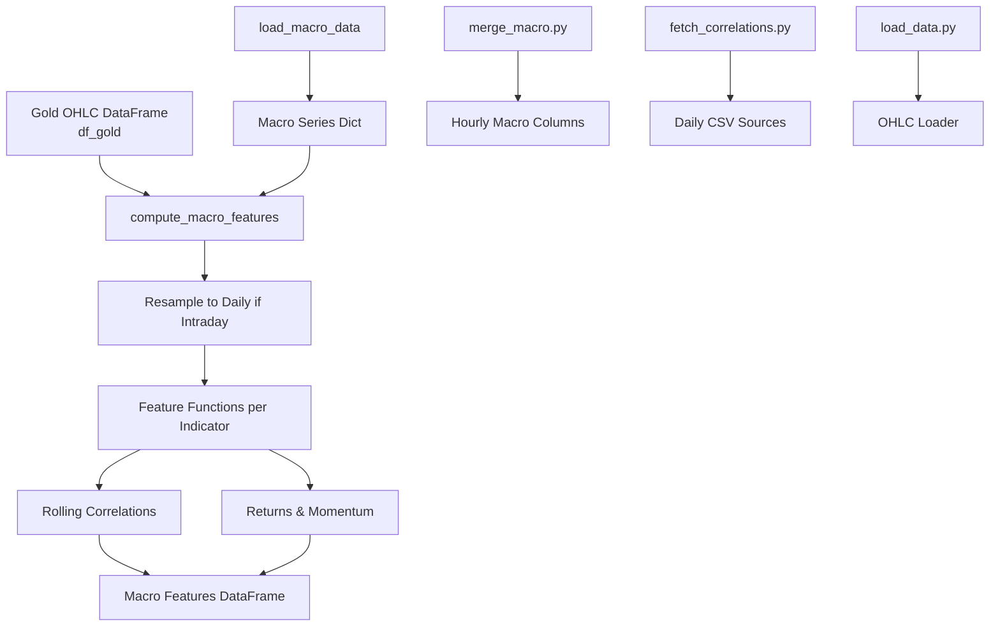
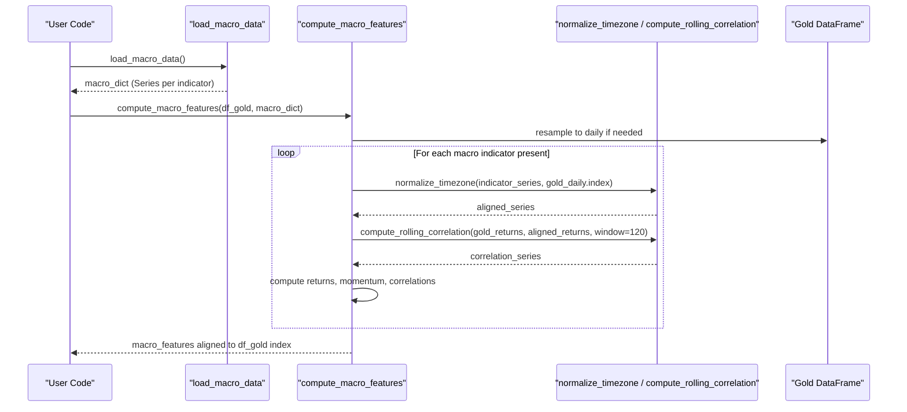
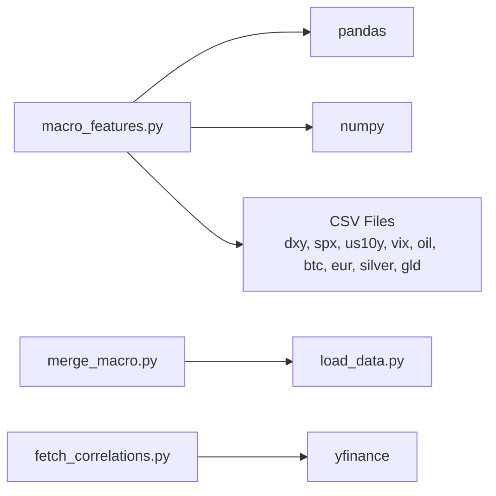

# Macro Correlation Features API

<cite>
**Referenced Files in This Document**
- [macro_features.py](file://features/macro_features.py)
- [merge_macro.py](file://data/merge_macro.py)
- [fetch_correlations.py](file://data/fetch_correlations.py)
- [load_data.py](file://data/load_data.py)
- [god_mode_features.py](file://features/god_mode_features.py)
</cite>

## Table of Contents
1. Introduction
2. Project Structure
3. Core Components
4. Architecture Overview
5. Detailed Component Analysis
6. Dependency Analysis
7. Performance Considerations
8. Troubleshooting Guide
9. Conclusion

## Introduction
This document provides detailed API documentation for the macro correlation feature computation used to correlate XAUUSD with global market indicators such as VIX, Oil, Bitcoin, DXY (US Dollar Index), SPX (S&P 500), and others. It focuses on two primary functions:
- load_macro_data: Loads daily macro series from CSV files into a dictionary of time series aligned to timestamps.
- compute_macro_features: Computes a comprehensive set of macro features (returns, momentum, correlations) and aligns them to the gold price timeframe.

The system supports multiple macro indicators, handles timezone normalization, rolling correlation windows, and forward-filling to align daily macro data to intraday gold frequencies. It also includes guidance for interpreting correlation coefficients and handling missing or misaligned data.

## Project Structure
The macro correlation feature pipeline spans several modules:
- Data loading and alignment utilities
- Macro data fetching and merging
- Feature computation for each macro indicator
- Integration into broader feature pipelines

**Diagram sources**
- [macro_features.py:26-75](file://features/macro_features.py#L26-L75)
- [macro_features.py:363-445](file://features/macro_features.py#L363-L445)
- [merge_macro.py:4-56](file://data/merge_macro.py#L4-L56)
- [fetch_correlations.py:5-52](file://data/fetch_correlations.py#L5-L52)
- [load_data.py:5-73](file://data/load_data.py#L5-L73)

**Section sources**
- [macro_features.py:26-75](file://features/macro_features.py#L26-L75)
- [macro_features.py:363-445](file://features/macro_features.py#L363-L445)
- [merge_macro.py:4-56](file://data/merge_macro.py#L4-L56)
- [fetch_correlations.py:5-52](file://data/fetch_correlations.py#L5-L52)
- [load_data.py:5-73](file://data/load_data.py#L5-L73)

## Core Components
- load_macro_data(data_dir='data')
  - Purpose: Load macro series from CSV files into a dictionary keyed by indicator name.
  - Inputs: data_dir path string; expects daily CSV files with 'time' and 'close'/'Close'.
  - Outputs: dict mapping names like 'dxy', 'spx', 'us10y', 'vix', 'oil', 'btc', 'eur', 'silver', 'gld' to pandas Series indexed by datetime.
  - Behavior: Converts times to UTC then removes timezone; sets index to time; selects close price column; logs warnings for missing files or columns.

- compute_macro_features(df_gold, macro_dict)
  - Purpose: Compute macro features aligned to gold prices.
  - Inputs: df_gold (DataFrame with at least 'close'), macro_dict from load_macro_data.
  - Outputs: DataFrame of macro features aligned to df_gold index via forward-fill.
  - Behavior: Resamples gold to daily if needed; computes returns, momentum, and rolling correlations for each available macro source; fills NaNs; reindexes back to original frequency.

- Helper functions:
  - normalize_timezone(series, reference_index): Aligns series to reference DatetimeIndex, making both timezone-naive and forward-filling gaps.
  - compute_rolling_correlation(series1, series2, window=120): Computes rolling correlation between percentage changes over a specified window.

**Section sources**
- [macro_features.py:26-75](file://features/macro_features.py#L26-L75)
- [macro_features.py:78-111](file://features/macro_features.py#L78-L111)
- [macro_features.py:114-132](file://features/macro_features.py#L114-L132)
- [macro_features.py:363-445](file://features/macro_features.py#L363-L445)

## Architecture Overview
The macro correlation pipeline integrates daily macro data with intraday gold data to produce features that capture economic relationships impacting gold trading.

**Diagram sources**
- [macro_features.py:26-75](file://features/macro_features.py#L26-L75)
- [macro_features.py:78-111](file://features/macro_features.py#L78-L111)
- [macro_features.py:114-132](file://features/macro_features.py#L114-L132)
- [macro_features.py:363-445](file://features/macro_features.py#L363-L445)

## Detailed Component Analysis

### load_macro_data
- Functionality: Reads daily CSV files for macro indicators, standardizes time indices, and extracts close prices.
- Supported indicators: dxy, spx, us10y, vix, oil, btc, eur, silver, gld.
- Timezone handling: Converts to UTC then removes timezone to ensure compatibility.
- Error handling: Logs warnings when files are missing or close columns are absent.

Usage example path:
- [macro_features.py:26-75](file://features/macro_features.py#L26-L75)

**Section sources**
- [macro_features.py:26-75](file://features/macro_features.py#L26-L75)

### compute_macro_features
- Functionality: Orchestrates feature computation across all available macro indicators and aligns results to gold timeframe.
- Steps:
  - Resample gold to daily if intraday to match macro frequency.
  - For each macro indicator present in macro_dict:
    - Compute returns and momentum.
    - Compute rolling correlation with gold returns.
  - Combine feature DataFrames, fill NaNs, and reindex to original gold frequency using forward-fill.
- Output: DataFrame with macro features aligned to df_gold index.

Usage example path:
- [macro_features.py:363-445](file://features/macro_features.py#L363-L445)

**Section sources**
- [macro_features.py:363-445](file://features/macro_features.py#L363-L445)

### normalize_timezone
- Functionality: Ensures series and reference index are timezone-naive and aligned; uses forward-fill to propagate values across gaps.
- Parameters:
  - series: Pandas Series with datetime index.
  - reference_index: Target DatetimeIndex for alignment.
- Returns: Aligned Series with same index as reference.

Usage example path:
- [macro_features.py:78-111](file://features/macro_features.py#L78-L111)

**Section sources**
- [macro_features.py:78-111](file://features/macro_features.py#L78-L111)

### compute_rolling_correlation
- Functionality: Computes rolling correlation between percentage changes of two series over a specified window.
- Parameters:
  - series1, series2: Price series.
  - window: Rolling window size (default 120).
- Returns: Rolling correlation series filled with zeros where NaN.

Usage example path:
- [macro_features.py:114-132](file://features/macro_features.py#L114-L132)

**Section sources**
- [macro_features.py:114-132](file://features/macro_features.py#L114-L132)

### Indicator-specific Feature Functions
Each indicator function follows a consistent pattern:
- Normalize timezone alignment to gold timestamps.
- Compute returns and momentum (typically 20-day percent change).
- Compute rolling correlation with gold returns (window 120).
- Return a DataFrame with indicator-specific features.

Supported indicators and their features:
- DXY: dxy_return, dxy_momentum, gold_dxy_correlation
- SPX: spx_return, spx_momentum, gold_spx_correlation
- US10Y: us10y_change, us10y_momentum, gold_yields_correlation
- VIX: vix_level (normalized), vix_change, vix_regime (high/low fear)
- Oil: oil_return, oil_momentum, gold_oil_correlation
- Bitcoin: btc_return, btc_momentum, gold_btc_correlation
- EURUSD: eur_return, eur_momentum, gold_eur_correlation
- Silver/GLD: gold_silver_ratio, gold_silver_correlation, gld_flow

Usage example paths:
- [macro_features.py:135-160](file://features/macro_features.py#L135-L160)
- [macro_features.py:163-188](file://features/macro_features.py#L163-L188)
- [macro_features.py:191-216](file://features/macro_features.py#L191-L216)
- [macro_features.py:219-242](file://features/macro_features.py#L219-L242)
- [macro_features.py:245-270](file://features/macro_features.py#L245-L270)
- [macro_features.py:273-298](file://features/macro_features.py#L273-L298)
- [macro_features.py:301-326](file://features/macro_features.py#L301-L326)
- [macro_features.py:329-360](file://features/macro_features.py#L329-L360)

**Section sources**
- [macro_features.py:135-360](file://features/macro_features.py#L135-L360)

### Alternative Macro Feature Implementation (God Mode)
An alternative implementation exists within god_mode_features.py that computes macro features directly from hourly data with different parameters:
- Uses log returns and 24-period momentum.
- Applies a shorter rolling correlation window (120) suited for hourly data.
- Produces features: dxy_ret, dxy_mom, spx_ret, spx_mom, us10y_chg, us10y_mom, gold_dxy_corr, gold_spx_corr, gold_yields_corr.

Usage example path:
- [god_mode_features.py:194-232](file://features/god_mode_features.py#L194-L232)

**Section sources**
- [god_mode_features.py:194-232](file://features/god_mode_features.py#L194-L232)

## Dependency Analysis
The macro correlation module depends on:
- pandas/numpy for data manipulation and statistical computations
- CSV files for macro data sources
- Optional integration with other feature modules

**Diagram sources**
- [macro_features.py:17-23](file://features/macro_features.py#L17-L23)
- [merge_macro.py:1-2](file://data/merge_macro.py#L1-L2)
- [fetch_correlations.py:1-3](file://data/fetch_correlations.py#L1-L3)

**Section sources**
- [macro_features.py:17-23](file://features/macro_features.py#L17-L23)
- [merge_macro.py:1-2](file://data/merge_macro.py#L1-L2)
- [fetch_correlations.py:1-3](file://data/fetch_correlations.py#L1-L3)

## Performance Considerations
- Rolling correlation computation is computationally intensive; consider reducing window size for faster processing.
- Forward-filling daily macro data to intraday frequencies can introduce lagged signals; be aware of this when interpreting features.
- Missing macro data leads to fewer features; ensure all required CSV files are present to maximize feature coverage.
- Memory usage increases with large datasets; process in chunks if necessary.

[No sources needed since this section provides general guidance]

## Troubleshooting Guide
Common issues and resolutions:
- Missing macro CSV files:
  - Symptom: Warnings about missing files; fewer features generated.
  - Resolution: Ensure all required CSV files exist in the data directory with correct naming and structure.
  - Reference: [macro_features.py:51-72](file://features/macro_features.py#L51-L72)

- Timezone mismatches:
  - Symptom: Misaligned timestamps; unexpected NaNs.
  - Resolution: Use normalize_timezone to align series to reference index; ensure both are timezone-naive.
  - Reference: [macro_features.py:78-111](file://features/macro_features.py#L78-L111)

- No close price column:
  - Symptom: Warning about missing close price; indicator skipped.
  - Resolution: Rename or add 'close'/'Close' column in CSV files.
  - Reference: [macro_features.py:60-67](file://features/macro_features.py#L60-L67)

- Data frequency alignment:
  - Symptom: Macro features not aligned to gold timeframe.
  - Resolution: Use compute_macro_features which resamples gold to daily and forward-fills back to original frequency.
  - Reference: [macro_features.py:378-428](file://features/macro_features.py#L378-L428)

- Economic calendar integration:
  - Symptom: Calendar features unavailable or default values.
  - Resolution: Ensure economic calendar module is accessible; otherwise defaults are used.
  - Reference: [god_mode_features.py:235-288](file://features/god_mode_features.py#L235-L288)

**Section sources**
- [macro_features.py:51-72](file://features/macro_features.py#L51-L72)
- [macro_features.py:78-111](file://features/macro_features.py#L78-L111)
- [macro_features.py:60-67](file://features/macro_features.py#L60-L67)
- [macro_features.py:378-428](file://features/macro_features.py#L378-L428)
- [god_mode_features.py:235-288](file://features/god_mode_features.py#L235-L288)

## Conclusion
The macro correlation feature computation provides a robust framework for integrating global market indicators into gold trading analysis. By leveraging rolling correlations, momentum, and returns, it captures key economic relationships that influence gold prices. The modular design allows for easy extension to additional indicators and adaptation to different data frequencies. Proper handling of timezone alignment, missing data, and frequency conversion ensures reliable feature generation for downstream modeling tasks.

[No sources needed since this section summarizes without analyzing specific files]