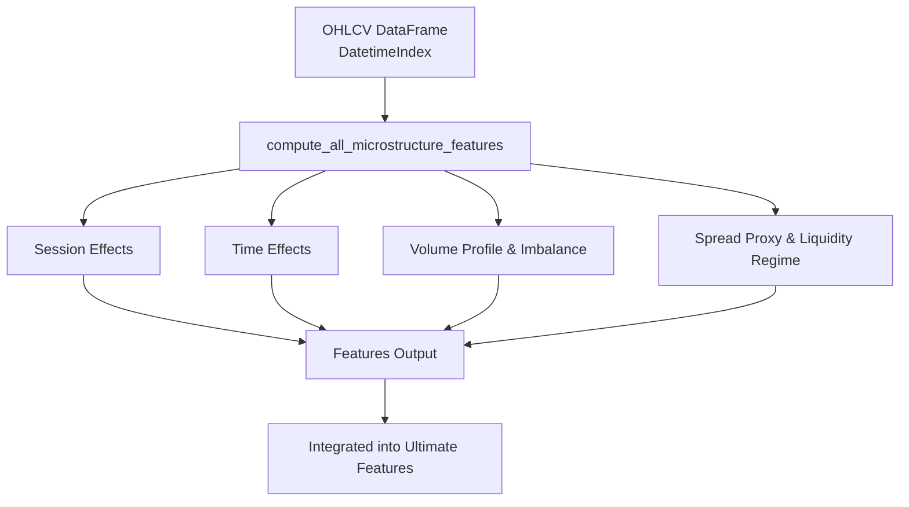
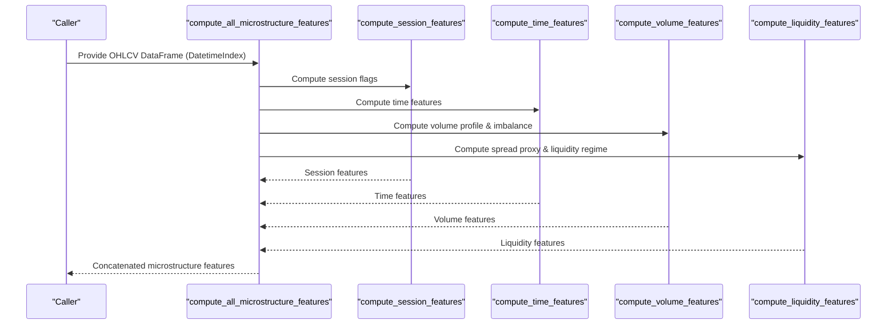
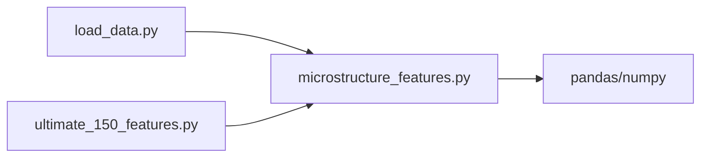

# Market Microstructure Features API

<cite>
**Referenced Files in This Document**
- [microstructure_features.py](file://features/microstructure_features.py)
- [ultimate_150_features.py](file://features/ultimate_150_features.py)
- [load_data.py](file://data/load_data.py)
</cite>

## Table of Contents
1. [Introduction](#introduction)
2. [Project Structure](#project-structure)
3. [Core Components](#core-components)
4. [Architecture Overview](#architecture-overview)
5. [Detailed Component Analysis](#detailed-component-analysis)
6. [Dependency Analysis](#dependency-analysis)
7. [Performance Considerations](#performance-considerations)
8. [Troubleshooting Guide](#troubleshooting-guide)
9. [Conclusion](#conclusion)
10. [Appendices](#appendices)

## Introduction
This document provides detailed API documentation for market microstructure feature computation in the repository. It focuses on the compute_all_microstructure_features function and its subcomponents that derive session effects, time effects, volume profile indicators, and liquidity measures from OHLCV data with a DatetimeIndex. The guide explains parameter expectations, rolling window calculations, statistical aggregations, and how these features integrate into the broader feature pipeline used by training workflows.

## Project Structure
The microstructure feature module resides under features/microstructure_features.py and is consumed by the ultimate feature pipeline in features/ultimate_150_features.py. Data loading utilities are provided in data/load_data.py to standardize OHLC inputs before feature computation.

**Diagram sources**
- [microstructure_features.py:170-225](file://features/microstructure_features.py#L170-L225)
- [ultimate_150_features.py:110-151](file://features/ultimate_150_features.py#L110-L151)

**Section sources**
- [microstructure_features.py:1-225](file://features/microstructure_features.py#L1-L225)
- [ultimate_150_features.py:110-151](file://features/ultimate_150_features.py#L110-L151)
- [load_data.py:5-73](file://data/load_data.py#L5-L73)

## Core Components
- compute_all_microstructure_features(df): Orchestrates computation of 12 microstructure features grouped into session effects, time effects, volume analysis, and liquidity metrics.
- compute_session_features(df): Derives binary flags for Asian, London, New York sessions, and their overlap periods based on UTC hour ranges.
- compute_time_features(df): Produces normalized time-based features including hour-of-day, day-of-week, week-of-month regime, and month-of-year seasonality.
- compute_volume_features(df): Computes volume profile (rolling percentile rank) and a volume imbalance proxy using signed volume derived from price changes over a rolling window.
- compute_liquidity_features(df): Calculates a spread proxy as (high - low) / close and a liquidity regime indicator comparing current spread to a rolling average.

Input requirements:
- DataFrame with a DatetimeIndex.
- Columns: at minimum open, high, low, close; optional volume or tick_volume for volume features.

Output:
- DataFrame aligned to the input index containing 12 columns representing the microstructure features.

**Section sources**
- [microstructure_features.py:22-167](file://features/microstructure_features.py#L22-L167)
- [microstructure_features.py:170-225](file://features/microstructure_features.py#L170-L225)

## Architecture Overview
The microstructure feature pipeline composes four independent feature groups and concatenates them into a single feature matrix. Each group uses vectorized pandas operations with rolling windows to capture short-term dynamics suitable for high-frequency or intraday modeling.

**Diagram sources**
- [microstructure_features.py:170-225](file://features/microstructure_features.py#L170-L225)
- [microstructure_features.py:22-167](file://features/microstructure_features.py#L22-L167)

## Detailed Component Analysis

### compute_all_microstructure_features(df)
Purpose:
- Central entry point to generate all microstructure features.
- Coordinates sub-feature computations and combines results.

Parameters:
- df: pandas.DataFrame with DatetimeIndex and OHLC columns (open, high, low, close). Optional volume/tick_volume improves volume features.

Returns:
- pandas.DataFrame with 12 columns:
  - session_asian, session_london, session_ny, session_overlap
  - hour_of_day, day_of_week, week_of_month, month_of_year
  - volume_profile, volume_imbalance
  - spread_m5, liquidity_regime

Behavior highlights:
- Uses rolling windows for volume profile (percentile rank) and volume imbalance (net signed volume over a rolling sum).
- Computes spread proxy as (high - low) / close and derives a liquidity regime by comparing current spread to a rolling average.
- Fills NaNs to ensure stable downstream usage.

Usage example path:
- See test and usage examples within the module’s test block and docstring comments.

**Section sources**
- [microstructure_features.py:170-225](file://features/microstructure_features.py#L170-L225)

### Session Effects
Metrics:
- session_asian: Binary flag for Asian session hours (UTC).
- session_london: Binary flag for London session hours (UTC).
- session_ny: Binary flag for New York session hours (UTC).
- session_overlap: Binary flag for London–New York overlap period.

Implementation notes:
- Based on UTC hour thresholds applied to the DatetimeIndex.
- Returns float values (0.0 or 1.0) for compatibility with numeric models.

Interpretation:
- Captures intraday session regimes that influence volatility and liquidity.

**Section sources**
- [microstructure_features.py:22-51](file://features/microstructure_features.py#L22-L51)

### Time Effects
Metrics:
- hour_of_day: Normalized hour (0–1).
- day_of_week: Normalized weekday (0–1).
- week_of_month: First/last week effect (0.0 early, 0.5 mid, 1.0 late).
- month_of_year: Normalized month (0–1).

Implementation notes:
- Derived directly from DatetimeIndex properties.
- Provides cyclical time encodings useful for capturing recurring patterns.

Interpretation:
- Helps model periodicity and seasonal effects across trading days and months.

**Section sources**
- [microstructure_features.py:54-86](file://features/microstructure_features.py#L54-L86)

### Volume Profile Indicators
Metrics:
- volume_profile: Rolling percentile rank of current volume relative to recent history.
- volume_imbalance: Net signed volume ratio over a rolling window, using price change direction to approximate buy/sell pressure.

Implementation notes:
- volume_profile uses a rolling percentile calculation over a fixed window.
- volume_imbalance computes signed volume via price diff sign multiplied by volume, then normalizes net volume by total volume over the same window.
- Handles missing volume gracefully by returning defaults when volume column is absent.

Interpretation:
- volume_profile indicates whether current volume is above or below typical levels.
- volume_imbalance captures short-term buying vs selling pressure proxies.

**Section sources**
- [microstructure_features.py:89-130](file://features/microstructure_features.py#L89-L130)

### Liquidity Measures
Metrics:
- spread_m5: Spread proxy computed as (high - low) / close.
- liquidity_regime: Binary-like regime indicating high liquidity (low spread) vs low liquidity (high spread) relative to a rolling average.

Implementation notes:
- Requires high, low, close columns; otherwise returns default values.
- liquidity_regime compares current spread to a rolling mean to classify regime.

Interpretation:
- Lower spreads imply higher liquidity; regime helps detect periods where execution costs may differ.

**Section sources**
- [microstructure_features.py:133-167](file://features/microstructure_features.py#L133-L167)

### Integration with Ultimate Features Pipeline
The microstructure features are integrated into the broader feature set used for training:
- They are computed alongside timeframe, cross-timeframe, macro, and calendar features.
- All features are reindexed to a common base index and concatenated.
- Final arrays are converted to float32 for memory efficiency.

**Section sources**
- [ultimate_150_features.py:110-151](file://features/ultimate_150_features.py#L110-L151)
- [ultimate_150_features.py:172-173](file://features/ultimate_150_features.py#L172-L173)

## Dependency Analysis
- microstructure_features.py depends only on pandas and numpy for vectorized computations.
- ultimate_150_features.py imports and calls compute_all_microstructure_features to include microstructure signals in the final feature matrix.
- load_data.py provides standardized OHLC loading and validation, ensuring consistent inputs for feature computation.

**Diagram sources**
- [microstructure_features.py:170-225](file://features/microstructure_features.py#L170-L225)
- [ultimate_150_features.py:110-151](file://features/ultimate_150_features.py#L110-L151)
- [load_data.py:5-73](file://data/load_data.py#L5-L73)

**Section sources**
- [microstructure_features.py:170-225](file://features/microstructure_features.py#L170-L225)
- [ultimate_150_features.py:110-151](file://features/ultimate_150_features.py#L110-L151)
- [load_data.py:5-73](file://data/load_data.py#L5-L73)

## Performance Considerations
- Vectorization: All computations use pandas rolling and numpy operations to minimize Python-level loops.
- Memory efficiency: The ultimate features pipeline converts outputs to float32 to reduce memory footprint during training.
- Rolling windows: Fixed-size rolling windows (e.g., 20, 100) provide stable statistics while keeping computational cost manageable.
- Missing data handling: Default values are returned when required columns are absent, preventing failures and maintaining throughput.

Recommendations for large datasets:
- Ensure the DataFrame has a sorted DatetimeIndex to optimize rolling operations.
- Use chunked processing if memory constraints arise, aligning indices carefully before concatenation.
- Prefer precomputed OHLC aggregates if tick-level data must be downsampled before feature computation.

[No sources needed since this section provides general guidance]

## Troubleshooting Guide
Common issues and resolutions:
- Missing OHLC columns: If high, low, or close are absent, spread-related features will fall back to defaults. Ensure proper data loading and column naming.
- Missing volume: If volume or tick_volume is not present, volume features return defaults. Add volume data or adjust logic accordingly.
- Invalid OHLC: Data loader validates OHLC consistency; errors indicate malformed rows that should be cleaned upstream.
- NaN propagation: The microstructure module fills NaNs after computation; verify downstream consumers handle edge cases consistently.

Operational checks:
- Confirm DatetimeIndex is timezone-aware or consistently handled across sessions.
- Validate that rolling windows are appropriate for your data frequency (e.g., minute bars vs tick data).

**Section sources**
- [microstructure_features.py:89-167](file://features/microstructure_features.py#L89-L167)
- [load_data.py:55-59](file://data/load_data.py#L55-L59)

## Conclusion
The microstructure feature module delivers a concise set of 12 features capturing session timing, time-of-day effects, volume dynamics, and liquidity conditions. These features are designed for robustness and performance, integrating seamlessly into the broader feature pipeline used for training models. By focusing on vectorized rolling computations and sensible defaults, the module supports efficient processing of intraday and high-frequency data while providing interpretable signals for short-term market behavior.

[No sources needed since this section summarizes without analyzing specific files]

## Appendices

### Parameter Specifications and Data Requirements
- Input DataFrame:
  - Index: DatetimeIndex
  - Required columns: open, high, low, close
  - Optional columns: volume or tick_volume
- Rolling windows:
  - Volume profile: percentile rank over a rolling window
  - Volume imbalance: signed volume sum and total volume over a rolling window
  - Liquidity regime: comparison of current spread to a rolling average
- Outputs:
  - 12 microstructure features aligned to the input index

**Section sources**
- [microstructure_features.py:22-167](file://features/microstructure_features.py#L22-L167)
- [microstructure_features.py:170-225](file://features/microstructure_features.py#L170-L225)

### Example Workflow Paths
- Load OHLC data and prepare DatetimeIndex:
  - See data loading utility for standardized OHLC handling.
- Compute microstructure features:
  - Call compute_all_microstructure_features with prepared DataFrame.
- Integrate into training features:
  - Refer to the ultimate features pipeline for combining microstructure features with other feature sets.

**Section sources**
- [load_data.py:5-73](file://data/load_data.py#L5-L73)
- [microstructure_features.py:170-225](file://features/microstructure_features.py#L170-L225)
- [ultimate_150_features.py:110-151](file://features/ultimate_150_features.py#L110-L151)