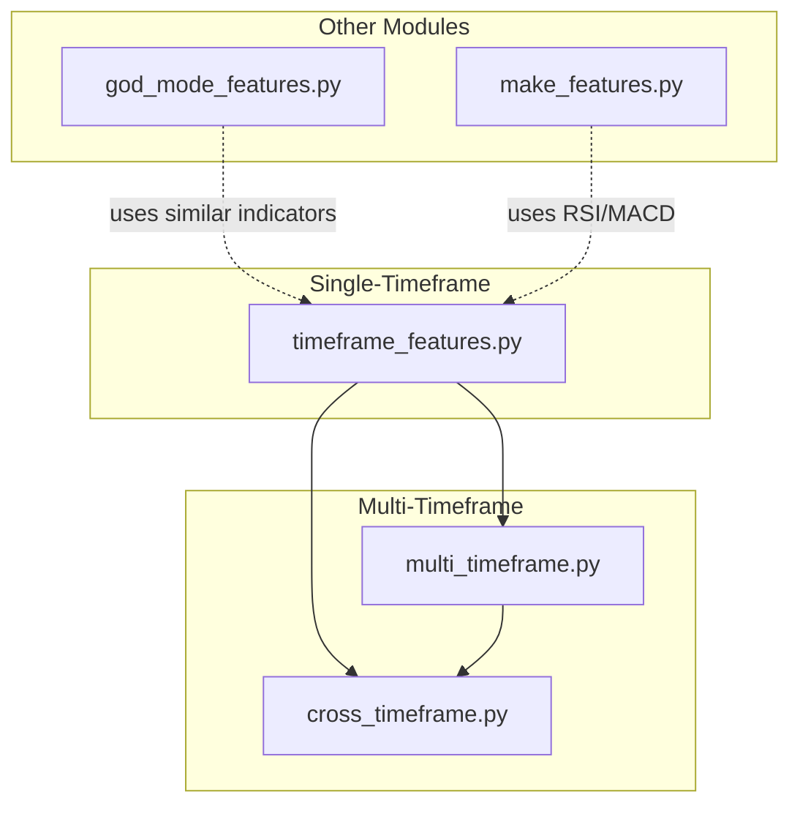
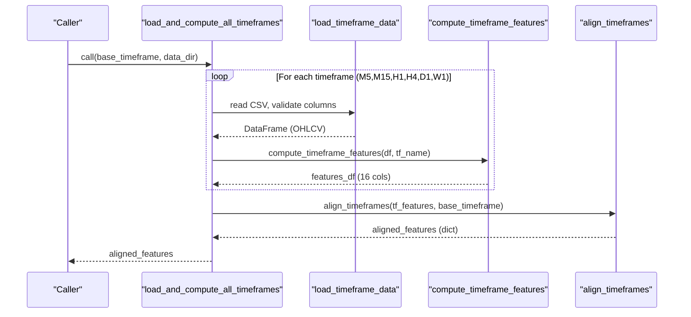
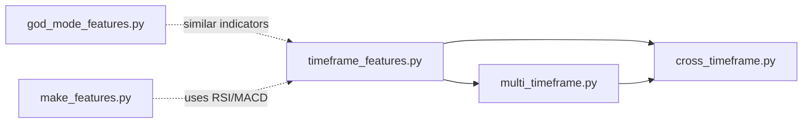

# Timeframe Features API

<cite>
**Referenced Files in This Document**
- [timeframe_features.py](file://features/timeframe_features.py)
- [multi_timeframe.py](file://features/multi_timeframe.py)
- [cross_timeframe.py](file://features/cross_timeframe.py)
- [god_mode_features.py](file://features/god_mode_features.py)
- [make_features.py](file://features/make_features.py)
</cite>

## Table of Contents
1. [Introduction](#introduction)
2. [Project Structure](#project-structure)
3. [Core Components](#core-components)
4. [Architecture Overview](#architecture-overview)
5. [Detailed Component Analysis](#detailed-component-analysis)
6. [Dependency Analysis](#dependency-analysis)
7. [Performance Considerations](#performance-considerations)
8. [Troubleshooting Guide](#troubleshooting-guide)
9. [Conclusion](#conclusion)
10. [Appendices](#appendices)

## Introduction
This document provides detailed API documentation for the timeframe feature computation system used to build multi-timeframe technical features for trading models. It focuses on:
- The main entry point load_and_compute_all_timeframes and its workflow
- Per-timeframe feature computations for M5, M15, H1, H4, D1, W1
- Technical indicators implemented (RSI, MACD, ATR, Bollinger Bands position, momentum, moving averages, volume ratios, support/resistance distances)
- Input parameters such as lookback periods, signal thresholds, normalization options
- Examples of computing features per timeframe, handling missing data, and combining multiple timeframes
- Performance considerations and memory optimization strategies for large datasets

## Project Structure
The timeframe feature system is organized into focused modules:
- Single-timeframe feature computation and utilities
- Multi-timeframe orchestration and cross-timeframe feature creation
- Cross-timeframe intelligence aggregating relationships across timeframes
- Additional implementations of indicators and feature pipelines used elsewhere

**Diagram sources**
- [timeframe_features.py:236-304](file://features/timeframe_features.py#L236-L304)
- [multi_timeframe.py:32-96](file://features/multi_timeframe.py#L32-L96)
- [cross_timeframe.py:205-249](file://features/cross_timeframe.py#L205-L249)

**Section sources**
- [timeframe_features.py:236-304](file://features/timeframe_features.py#L236-L304)
- [multi_timeframe.py:32-96](file://features/multi_timeframe.py#L32-L96)
- [cross_timeframe.py:205-249](file://features/cross_timeframe.py#L205-L249)

## Core Components
- load_and_compute_all_timeframes(base_timeframe='M5', data_dir='data')
  - Loads OHLCV CSVs for M5, M15, H1, H4, D1, W1 (W1 optional)
  - Computes 16 normalized features per timeframe
  - Aligns all timeframes to base timeframe timestamps via forward-fill
  - Returns a dict {tf_name: df_features}

- compute_timeframe_features(df, tf_name)
  - Produces 16 features per timeframe with consistent naming using tf_name prefix
  - Includes price action, trend, technical indicators, volume/SR metrics

- Indicator functions:
  - compute_rsi(prices, period=14)
  - compute_macd(prices, fast=12, slow=26, signal=9)
  - compute_atr(df, period=14)
  - compute_bb_position(prices, period=20, num_std=2)

- Multi-timeframe class MultiTimeframeFeatures
  - create_features(data_dict) builds per-timeframe features and cross-timeframe features
  - Uses timeframe-specific MA windows and computes additional cross-TF signals

- Cross-timeframe module
  - compute_all_cross_tf_features(tf_dict) aggregates 12 advanced cross-TF features
  - Sub-modules: trend alignment, momentum cascade, volatility regime, pattern confluence

**Section sources**
- [timeframe_features.py:22-99](file://features/timeframe_features.py#L22-L99)
- [timeframe_features.py:102-178](file://features/timeframe_features.py#L102-L178)
- [timeframe_features.py:236-304](file://features/timeframe_features.py#L236-L304)
- [multi_timeframe.py:32-96](file://features/multi_timeframe.py#L32-L96)
- [cross_timeframe.py:205-249](file://features/cross_timeframe.py#L205-L249)

## Architecture Overview
End-to-end flow from raw OHLCV to aligned multi-timeframe features:

**Diagram sources**
- [timeframe_features.py:236-304](file://features/timeframe_features.py#L236-L304)
- [timeframe_features.py:181-233](file://features/timeframe_features.py#L181-L233)

## Detailed Component Analysis

### load_and_compute_all_timeframes
- Purpose: Load OHLCV files for multiple timeframes, compute 16 features per timeframe, align to a base timeframe index, and return a dictionary of aligned DataFrames.
- Inputs:
  - base_timeframe: string; default 'M5'
  - data_dir: path-like; default 'data'
- Outputs:
  - Dict mapping timeframe names to feature DataFrames aligned to base_timeframe index
- Behavior:
  - Maps timeframe names to expected filenames
  - Skips W1 if file not found; raises error for other missing required files
  - Uses compute_timeframe_features to generate features
  - Uses align_timeframes to forward-fill higher timeframe data onto base timeframe index
- Notes:
  - All features are filled with zeros or defaults where NaN occurs during computation

**Section sources**
- [timeframe_features.py:236-304](file://features/timeframe_features.py#L236-L304)
- [timeframe_features.py:181-233](file://features/timeframe_features.py#L181-L233)

### compute_timeframe_features
- Purpose: Compute 16 standardized features for a single timeframe with tf_name-prefixed column names.
- Inputs:
  - df: DataFrame with columns open, high, low, close, volume
  - tf_name: string; e.g., 'M5', 'H1'
- Output:
  - DataFrame with 16 columns prefixed by tf_name
- Feature categories:
  - Price Action (5): returns, volatility (20-period std), momentum at 5/10/20 periods
  - Trend Indicators (4): fast MA (10), slow MA (50), normalized MA diff, binary trend direction
  - Technical Indicators (4): RSI(14) normalized to 0–1, MACD histogram normalized by price, ATR% of price, Bollinger Band position (0–1)
  - Volume & S/R (3): volume ratio vs 20-period average, distance to 50-period high/low
- Missing data handling:
  - Initial NaNs are filled with 0.0 after computation

**Section sources**
- [timeframe_features.py:22-99](file://features/timeframe_features.py#L22-L99)

### Technical Indicators

#### RSI
- Function: compute_rsi(prices, period=14)
- Description: Standard RSI calculation over rolling gains/losses; returns values in 0–100 range; NaNs filled with 50.0
- Parameters:
  - prices: Series of close prices
  - period: int; default 14
- Output: Series of RSI values (0–100)

**Section sources**
- [timeframe_features.py:102-116](file://features/timeframe_features.py#L102-L116)

#### MACD
- Function: compute_macd(prices, fast=12, slow=26, signal=9)
- Description: Exponential moving averages for fast/slow lines, signal line smoothing, histogram computed as difference; normalized by price; NaNs filled with 0.0
- Parameters:
  - prices: Series of close prices
  - fast, slow, signal: ints; defaults 12, 26, 9
- Output: Series of normalized MACD histogram

**Section sources**
- [timeframe_features.py:119-135](file://features/timeframe_features.py#L119-L135)

#### ATR
- Function: compute_atr(df, period=14)
- Description: True Range computed from high-low, prior close differences; smoothed via rolling mean; NaNs filled with 0.0
- Parameters:
  - df: DataFrame with high, low, close
  - period: int; default 14
- Output: Series of ATR values

**Section sources**
- [timeframe_features.py:138-156](file://features/timeframe_features.py#L138-L156)

#### Bollinger Bands Position
- Function: compute_bb_position(prices, period=20, num_std=2)
- Description: Computes middle band (SMA), upper/lower bands (mean ± k*std); returns normalized position of price within bands clipped to 0–1; NaNs filled with 0.5
- Parameters:
  - prices: Series of close prices
  - period: int; default 20
  - num_std: float; default 2
- Output: Series of BB position (0–1)

**Section sources**
- [timeframe_features.py:159-178](file://features/timeframe_features.py#L159-L178)

### Multi-Timeframe Features (Class)
- Class: MultiTimeframeFeatures
- Purpose: Create features across multiple timeframes and compute cross-timeframe features
- Key methods:
  - create_features(data_dict): Builds per-timeframe features and cross-timeframe features; prefixes columns with timeframe name; returns combined DataFrame
  - _compute_tf_features(df, timeframe): Computes standard features including returns, volatility, momentum, MAs, RSI, ATR, BB position, volume metrics
  - _compute_cross_tf_features(data_dict): Aggregates trend alignment, momentum cascade, volatility regime, support/resistance confluence
- Timeframe windows:
  - Uses timeframe-specific MA windows for fast/slow MAs
- Missing data handling:
  - Fills NaNs with defaults (e.g., 0 or 1 depending on feature)

**Section sources**
- [multi_timeframe.py:32-96](file://features/multi_timeframe.py#L32-L96)
- [multi_timeframe.py:98-156](file://features/multi_timeframe.py#L98-L156)
- [multi_timeframe.py:158-317](file://features/multi_timeframe.py#L158-L317)

### Cross-Timeframe Intelligence
- Functions:
  - compute_trend_alignment(tf_dict): Computes overall trend agreement, strength cascade, divergence
  - compute_momentum_cascade(tf_dict): Computes pairwise momentum interactions across timeframes
  - compute_volatility_regime(tf_dict): Detects current vs long-term volatility, spikes, compression
  - compute_pattern_confluence(tf_dict): Measures support/resistance confluence and breakout alignment
  - compute_all_cross_tf_features(tf_dict): Orchestrates all cross-timeframe features and returns concatenated DataFrame
- Inputs:
  - tf_dict: Dict of feature DataFrames from timeframe_features module
- Outputs:
  - DataFrame with 12 cross-timeframe features

**Section sources**
- [cross_timeframe.py:21-66](file://features/cross_timeframe.py#L21-L66)
- [cross_timeframe.py:69-102](file://features/cross_timeframe.py#L69-L102)
- [cross_timeframe.py:105-138](file://features/cross_timeframe.py#L105-L138)
- [cross_timeframe.py:141-202](file://features/cross_timeframe.py#L141-L202)
- [cross_timeframe.py:205-249](file://features/cross_timeframe.py#L205-L249)

### Alternative Implementations and Utilities
- god_mode_features.py:
  - Provides alternative RSI and ATR implementations and a timeframe feature builder that includes RSI, MACD, ATR%, BB position, volume ratio, SR distances
- make_features.py:
  - Demonstrates RSI and MACD usage and normalization pipeline for training inputs

**Section sources**
- [god_mode_features.py:23-50](file://features/god_mode_features.py#L23-L50)
- [god_mode_features.py:53-131](file://features/god_mode_features.py#L53-L131)
- [make_features.py:6-16](file://features/make_features.py#L6-L16)
- [make_features.py:18-78](file://features/make_features.py#L18-L78)

## Dependency Analysis
- Single-timeframe features depend on pandas/numpy for vectorized calculations
- Multi-timeframe class depends on per-timeframe features and constructs cross-timeframe features
- Cross-timeframe module consumes outputs from timeframe_features to derive hierarchical market dynamics
- Optional dependencies on macro/calendar features exist in other modules but are outside this scope

**Diagram sources**
- [timeframe_features.py:236-304](file://features/timeframe_features.py#L236-L304)
- [multi_timeframe.py:32-96](file://features/multi_timeframe.py#L32-L96)
- [cross_timeframe.py:205-249](file://features/cross_timeframe.py#L205-L249)

**Section sources**
- [timeframe_features.py:236-304](file://features/timeframe_features.py#L236-L304)
- [multi_timeframe.py:32-96](file://features/multi_timeframe.py#L32-L96)
- [cross_timeframe.py:205-249](file://features/cross_timeframe.py#L205-L249)

## Performance Considerations
- Vectorization:
  - All indicator computations use pandas rolling/ewm operations for efficient vectorization
- Memory usage:
  - Avoid creating unnecessary intermediate DataFrames; reuse series where possible
  - Use dtype float32 for model inputs when exporting features
- Alignment strategy:
  - Forward-fill higher timeframe data to base timeframe reduces interpolation overhead
- Large datasets:
  - Process timeframes sequentially to limit peak memory
  - Consider chunking or streaming if dataset exceeds available RAM
- Normalization:
  - Features are normalized per timeframe (e.g., RSI to 0–1, MACD/BB position normalized)
  - Global normalization can be applied post-computation for modeling

[No sources needed since this section provides general guidance]

## Troubleshooting Guide
Common issues and resolutions:
- Missing required columns:
  - Ensure OHLCV CSV contains open, high, low, close, volume; otherwise ValueError raised
- Missing timeframe files:
  - W1 is optional; others raise FileNotFoundError if absent
- NaN values:
  - Indicators fill initial NaNs with defaults (e.g., RSI→50, MACD→0, BB position→0.5)
  - If unexpected NaNs remain, check input data quality and lookback windows
- Alignment mismatches:
  - align_timeframes uses forward-fill; ensure base timeframe has dense timestamps

**Section sources**
- [timeframe_features.py:181-204](file://features/timeframe_features.py#L181-L204)
- [timeframe_features.py:207-233](file://features/timeframe_features.py#L207-L233)
- [timeframe_features.py:236-304](file://features/timeframe_features.py#L236-L304)

## Conclusion
The timeframe feature system provides a robust, modular pipeline for computing standardized technical indicators across multiple timeframes, aligning them to a common index, and deriving cross-timeframe intelligence. It supports scalable processing of large datasets through vectorized operations and careful memory management. Users can leverage load_and_compute_all_timeframes for quick setup or compose individual components for custom pipelines.

[No sources needed since this section summarizes without analyzing specific files]

## Appendices

### API Reference Summary

- load_and_compute_all_timeframes(base_timeframe='M5', data_dir='data')
  - Inputs: base_timeframe (str), data_dir (path-like)
  - Outputs: dict {tf_name: df_features} aligned to base_timeframe
  - Behavior: loads OHLCV CSVs, computes 16 features per timeframe, aligns via forward-fill

- compute_timeframe_features(df, tf_name)
  - Inputs: df (OHLCV), tf_name (str)
  - Outputs: DataFrame with 16 prefixed columns

- Indicator functions:
  - compute_rsi(prices, period=14) → Series (0–100)
  - compute_macd(prices, fast=12, slow=26, signal=9) → Series (normalized)
  - compute_atr(df, period=14) → Series
  - compute_bb_position(prices, period=20, num_std=2) → Series (0–1)

- MultiTimeframeFeatures.create_features(data_dict)
  - Inputs: data_dict {tf_name: df_ohlc}
  - Outputs: DataFrame with per-timeframe and cross-timeframe features

- compute_all_cross_tf_features(tf_dict)
  - Inputs: tf_dict {tf_name: df_features}
  - Outputs: DataFrame with 12 cross-timeframe features

**Section sources**
- [timeframe_features.py:22-99](file://features/timeframe_features.py#L22-L99)
- [timeframe_features.py:102-178](file://features/timeframe_features.py#L102-L178)
- [timeframe_features.py:236-304](file://features/timeframe_features.py#L236-L304)
- [multi_timeframe.py:32-96](file://features/multi_timeframe.py#L32-L96)
- [cross_timeframe.py:205-249](file://features/cross_timeframe.py#L205-L249)

### Example Workflows

- Compute features for a specific timeframe:
  - Load OHLCV CSV, call compute_timeframe_features(df, 'H1'), access returned DataFrame columns prefixed with 'H1_'

- Combine multiple timeframe features:
  - Use load_and_compute_all_timeframes(base_timeframe='M5') to get aligned features for M5, M15, H1, H4, D1, W1
  - Access tf_features['H1'] for hourly features

- Handle missing data:
  - Ensure required columns exist; handle optional W1 gracefully
  - Rely on built-in NaN filling; verify no unexpected NaNs remain

- Normalize and prepare for modeling:
  - Convert to numpy float32 arrays
  - Apply global normalization (mean/std) if required by your model

[No sources needed since this section provides general guidance]