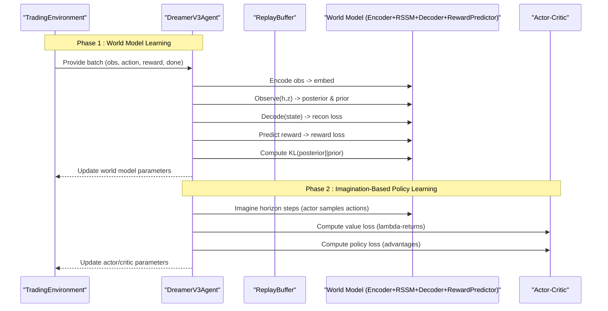
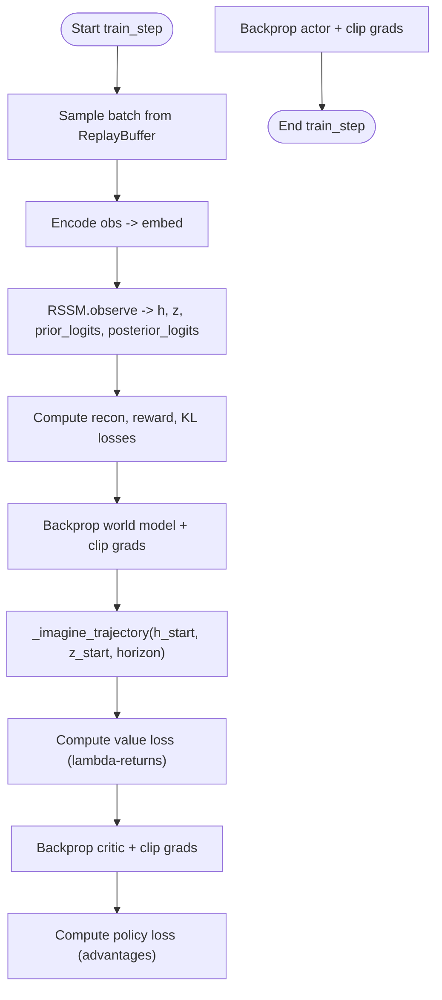
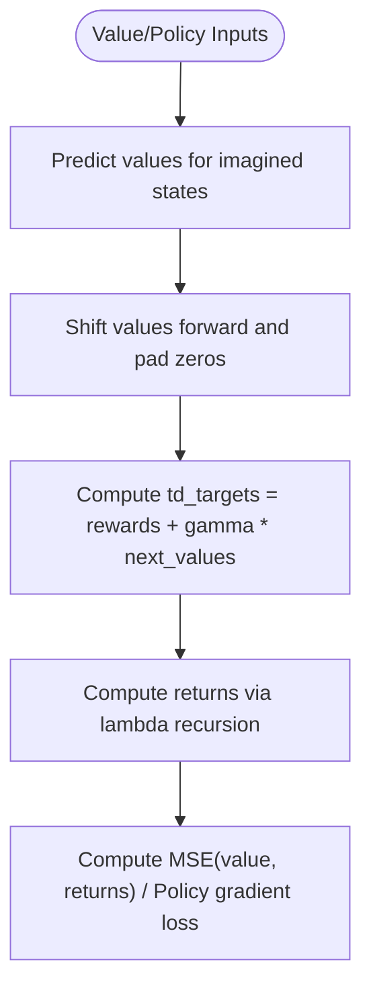
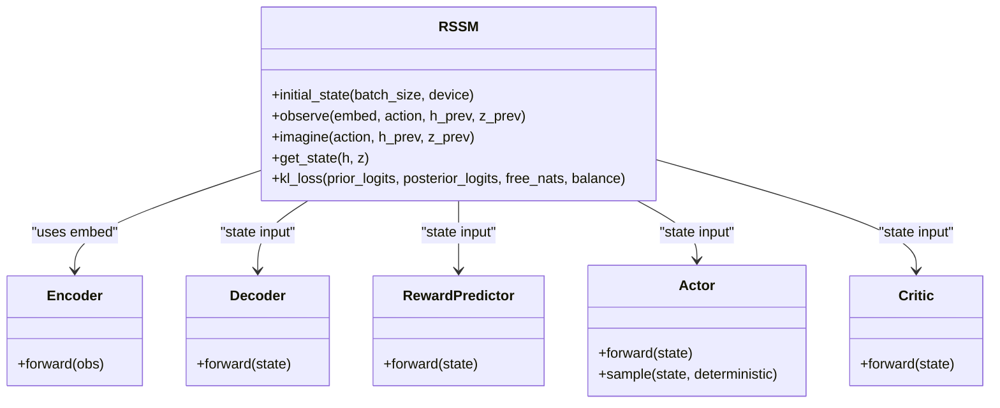
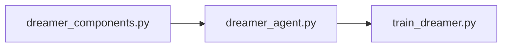

# Dreamer V3 Training API

<cite>
**Referenced Files in This Document**
- [dreamer_agent.py](file://models/dreamer_agent.py)
- [dreamer_components.py](file://models/dreamer_components.py)
- [train_dreamer.py](file://train/train_dreamer.py)
- [DREAMER_IMPLEMENTATION_GUIDE.md](file://DREAMER_IMPLEMENTATION_GUIDE.md)
</cite>

## Table of Contents
1. Introduction
2. Project Structure
3. Core Components
4. Architecture Overview
5. Detailed Component Analysis
6. Dependency Analysis
7. Performance Considerations
8. Troubleshooting Guide
9. Conclusion
10. Appendices

## Introduction
This document provides detailed API documentation for the Dreamer V3 world model-based reinforcement learning training system implemented for trading. It focuses on the DreamerV3Agent class, its initialization with world model components (encoder, RSSM, decoder, reward predictor, actor, critic), and the two-phase training process: Phase 1 for world model learning (representation + dynamics + reward prediction) and Phase 2 for behavior learning through imagination-based planning. It also documents the replay buffer system for sequence storage, trajectory imagination mechanisms, lambda-returns computation, configuration examples, memory optimization strategies, gradient clipping, and checkpoint management for long training runs.

## Project Structure
The implementation is organized into three primary modules:
- models/dreamer_components.py: Neural network building blocks (Encoder, RSSM, Decoder, RewardPredictor, Actor, Critic) and utilities (symlog/symexp, RMSNorm, GRUCell).
- models/dreamer_agent.py: High-level agent orchestration including ReplayBuffer, DreamerV3Agent, training loop logic, imagination rollout, value/policy loss computation, and save/load.
- train/train_dreamer.py: End-to-end training script that constructs a simple trading environment, pre-fills the replay buffer, trains the agent, saves checkpoints, and evaluates on test data.

```mermaid
graph TB
subgraph "Training Script"
T["train_dreamer.py"]
end
subgraph "Agent"
A["DreamerV3Agent<br/>ReplayBuffer"]
end
subgraph "Components"
C1["Encoder"]
C2["RSSM"]
C3["Decoder"]
C4["RewardPredictor"]
C5["Actor"]
C6["Critic"]
end
T --> A
A --> C1
A --> C2
A --> C3
A --> C4
A --> C5
A --> C6
```

**Diagram sources**
- [train_dreamer.py:128-208](file://train/train_dreamer.py#L128-L208)
- [dreamer_agent.py:84-147](file://models/dreamer_agent.py#L84-L147)
- [dreamer_components.py:71-295](file://models/dreamer_components.py#L71-L295)

**Section sources**
- [train_dreamer.py:128-208](file://train/train_dreamer.py#L128-L208)
- [dreamer_agent.py:84-147](file://models/dreamer_agent.py#L84-L147)
- [dreamer_components.py:71-295](file://models/dreamer_components.py#L71-L295)

## Core Components
- Encoder: Maps observations to embeddings using a multi-layer MLP with RMSNorm and SiLU activations; applies symlog transformation to inputs for stability.
- RSSM (Recurrent State-Space Model): Maintains deterministic hidden state h and stochastic latent z; supports posterior inference via observe and prior sampling via imagine; includes KL regularization with free nats and balancing.
- Decoder: Reconstructs observations from the concatenated latent state (h, z); uses symexp to ensure stable outputs.
- RewardPredictor: Predicts rewards in symlog space from the latent state.
- Actor: Outputs categorical action logits over discrete actions; supports sampling or greedy selection.
- Critic: Estimates state values in symlog space from the latent state.

Key hyperparameters exposed by DreamerV3Agent:
- obs_dim, action_dim, embed_dim, hidden_dim, stoch_dim, num_categories
- Learning rates: lr_world_model, lr_actor, lr_critic
- Planning: gamma, lambda_, horizon
- Regularization: free_nats, kl_balance

**Section sources**
- [dreamer_components.py:71-295](file://models/dreamer_components.py#L71-L295)
- [dreamer_agent.py:91-147](file://models/dreamer_agent.py#L91-L147)

## Architecture Overview
The training pipeline alternates between world model learning and policy improvement via imagination:



**Diagram sources**
- [dreamer_agent.py:190-304](file://models/dreamer_agent.py#L190-L304)
- [dreamer_components.py:134-205](file://models/dreamer_components.py#L134-L205)

**Section sources**
- [dreamer_agent.py:190-304](file://models/dreamer_agent.py#L190-L304)

## Detailed Component Analysis

### DreamerV3Agent Initialization and Configuration
- Initializes networks: encoder, rssm, decoder, reward_predictor, actor, critic.
- Sets up optimizers for world model components and actor/critic separately.
- Configures replay buffer capacity and sequence length.
- Stores planning and regularization hyperparameters (gamma, lambda_, horizon, free_nats, kl_balance).

Configuration example references:
- Architecture dimensions: embed_dim, hidden_dim, stoch_dim, num_categories
- Learning rates: lr_world_model, lr_actor, lr_critic
- Planning: gamma, lambda_, horizon
- Regularization: free_nats, kl_balance

**Section sources**
- [dreamer_agent.py:91-147](file://models/dreamer_agent.py#L91-L147)
- [train_dreamer.py:192-208](file://train/train_dreamer.py#L192-L208)

### Replay Buffer System for Sequence Storage
- Stores individual transitions (obs, action, reward, done) in a deque with fixed capacity.
- Samples contiguous sequences of length seq_len for training batches.
- Returns stacked tensors for efficient processing.

Usage in training:
- Prefill phase collects random exploration transitions.
- Training phase samples batches to update world model and policy.

**Section sources**
- [dreamer_agent.py:24-82](file://models/dreamer_agent.py#L24-L82)
- [train_dreamer.py:217-234](file://train/train_dreamer.py#L217-L234)

### Two-Phase Training Process
- Phase 1 (World Model Learning):
  - Encodes observations, updates RSSM posterior and prior, computes reconstruction loss, reward prediction loss, and KL divergence loss.
  - Applies gradient clipping across world model parameters.
- Phase 2 (Behavior Learning via Imagination):
  - Starts from final latent states after real sequence rollout.
  - Imagines trajectories using actor-sampled actions and RSSM prior dynamics.
  - Computes value loss using lambda-returns and policy loss using advantages.
  - Applies gradient clipping for critic and actor.



**Diagram sources**
- [dreamer_agent.py:190-304](file://models/dreamer_agent.py#L190-L304)

**Section sources**
- [dreamer_agent.py:190-304](file://models/dreamer_agent.py#L190-L304)

### Trajectory Imagination Mechanism
- _imagine_trajectory rolls out the actor’s policy within the learned world model for a specified horizon.
- At each step:
  - Extracts latent state from RSSM.
  - Predicts reward using RewardPredictor and transforms back via symexp.
  - Samples action from Actor.
  - Advances latent state via RSSM.imagine (prior dynamics).
- Returns stacked imagined states and rewards for value/policy updates.

**Section sources**
- [dreamer_agent.py:306-338](file://models/dreamer_agent.py#L306-L338)
- [dreamer_components.py:155-168](file://models/dreamer_components.py#L155-L168)

### Lambda-Returns Computation
- Uses bootstrapped TD targets with GAE-style recursion to compute returns for both value and policy updates.
- Combines immediate rewards and discounted next values, then propagates backward with lambda weighting.



**Diagram sources**
- [dreamer_agent.py:340-403](file://models/dreamer_agent.py#L340-L403)

**Section sources**
- [dreamer_agent.py:340-403](file://models/dreamer_agent.py#L340-L403)

### RSSM Details: Posterior, Prior, and KL Regularization
- Posterior inference (observe) combines previous latent state and encoded observation to predict distribution over z_t.
- Prior imagination (imagine) predicts distribution over z_t from h_t alone.
- KL divergence computed between posterior and prior distributions with free nats threshold and balancing to prevent posterior collapse.



**Diagram sources**
- [dreamer_components.py:92-205](file://models/dreamer_components.py#L92-L205)
- [dreamer_components.py:208-295](file://models/dreamer_components.py#L208-L295)

**Section sources**
- [dreamer_components.py:92-205](file://models/dreamer_components.py#L92-L205)

### Environment Integration and Training Loop
- The training script defines a simple TradingEnvironment that produces flat observations and rewards based on position changes and price returns.
- Prefill phase fills the replay buffer with random exploration transitions.
- Training phase alternates environment interaction and agent.train_step calls at a configured frequency.
- Checkpoints are saved periodically and a final model is saved after training.

**Section sources**
- [train_dreamer.py:36-126](file://train/train_dreamer.py#L36-L126)
- [train_dreamer.py:217-292](file://train/train_dreamer.py#L217-L292)

## Dependency Analysis
- dreamer_agent.py depends on dreamer_components.py for all neural modules and utilities.
- train_dreamer.py imports DreamerV3Agent and features to construct the environment and run training.
- The agent composes multiple components but maintains clear separation: world model vs. actor-critic, with distinct optimizers.



**Diagram sources**
- [dreamer_agent.py:18-21](file://models/dreamer_agent.py#L18-L21)
- [train_dreamer.py:17-18](file://train/train_dreamer.py#L17-L18)

**Section sources**
- [dreamer_agent.py:18-21](file://models/dreamer_agent.py#L18-L21)
- [train_dreamer.py:17-18](file://train/train_dreamer.py#L17-L18)

## Performance Considerations
- Memory optimization for large sequences:
  - Adjust batch_size and seq_len to fit GPU/CPU memory constraints.
  - Use smaller embed_dim/hidden_dim/stoch_dim if necessary.
  - Avoid unnecessary tensor copies; detach intermediate states when not needed.
- Gradient clipping strategies:
  - World model parameters clipped to max_norm=100.0 during Phase 1.
  - Critic and actor parameters clipped to max_norm=100.0 during Phase 2.
- Checkpoint management:
  - Save checkpoints every N steps to persist progress and enable resuming training.
  - Final model saved post-training for evaluation and deployment.

Practical tuning guidance:
- Increase free_nats to reduce KL pressure if posterior collapses.
- Decrease free_nats if KL is too high and model underutilizes latent space.
- Tune horizon to balance planning depth and computational cost.
- Adjust learning rates per component to stabilize training.

[No sources needed since this section provides general guidance]

## Troubleshooting Guide
Common issues and remedies:
- CUDA out of memory:
  - Reduce batch_size and/or sequence length.
  - Lower model dimensions (embed_dim, hidden_dim, stoch_dim).
  - Switch to CPU if necessary.
- NaN losses:
  - Validate data for inf/nan before feeding into the agent.
  - Reduce learning rates and increase gradient clipping thresholds.
- KL anomalies:
  - If KL too high (>5.0), increase free_nats.
  - If KL too low (<0.1), risk of posterior collapse; decrease free_nats.
- Stagnant policy:
  - Ensure sufficient prefill steps to populate diverse experiences.
  - Verify action space and reward signal density.

**Section sources**
- [DREAMER_IMPLEMENTATION_GUIDE.md:242-262](file://DREAMER_IMPLEMENTATION_GUIDE.md#L242-L262)

## Conclusion
The Dreamer V3 implementation provides a robust framework for model-based reinforcement learning tailored to trading. By learning a world model of market dynamics and leveraging imagination-based planning, the agent improves its policy efficiently with fewer real interactions. The modular design separates world model learning from policy optimization, enabling targeted tuning of architecture, planning horizons, and regularization. With careful configuration of hyperparameters and attention to memory and gradient stability, the system supports scalable training and reliable deployment.

[No sources needed since this section summarizes without analyzing specific files]

## Appendices

### API Usage Examples
- Configure world model architecture:
  - Set embed_dim, hidden_dim, stoch_dim, num_categories when initializing DreamerV3Agent.
  - Example reference: [train_dreamer.py:192-208](file://train/train_dreamer.py#L192-L208)
- Set imagination horizon:
  - Adjust horizon parameter to control planning depth.
  - Example reference: [train_dreamer.py:192-208](file://train/train_dreamer.py#L192-L208)
- Manage latent state dimensions:
  - stoch_dim and num_categories define the size of the stochastic latent space.
  - Example reference: [dreamer_agent.py:91-147](file://models/dreamer_agent.py#L91-L147)
- Tune KL divergence balancing:
  - free_nats controls minimum KL penalty; kl_balance mixes gradients between KL and detached KL.
  - Example reference: [dreamer_agent.py:91-147](file://models/dreamer_agent.py#L91-L147)

### Checkpoint Management
- Save and load methods:
  - agent.save(path) persists encoder, RSSM, decoder, reward predictor, actor, critic, and training step.
  - agent.load(path) restores all components and continues training from the saved step.
- Periodic saving during training:
  - Checkpoints saved every SAVE_EVERY steps in the training script.

**Section sources**
- [dreamer_agent.py:405-427](file://models/dreamer_agent.py#L405-L427)
- [train_dreamer.py:283-292](file://train/train_dreamer.py#L283-L292)