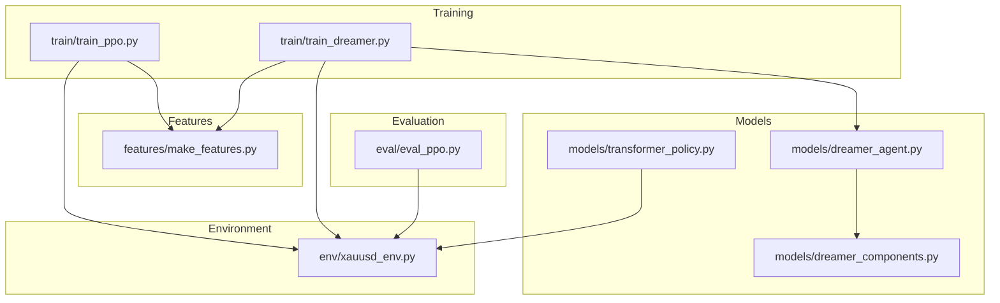
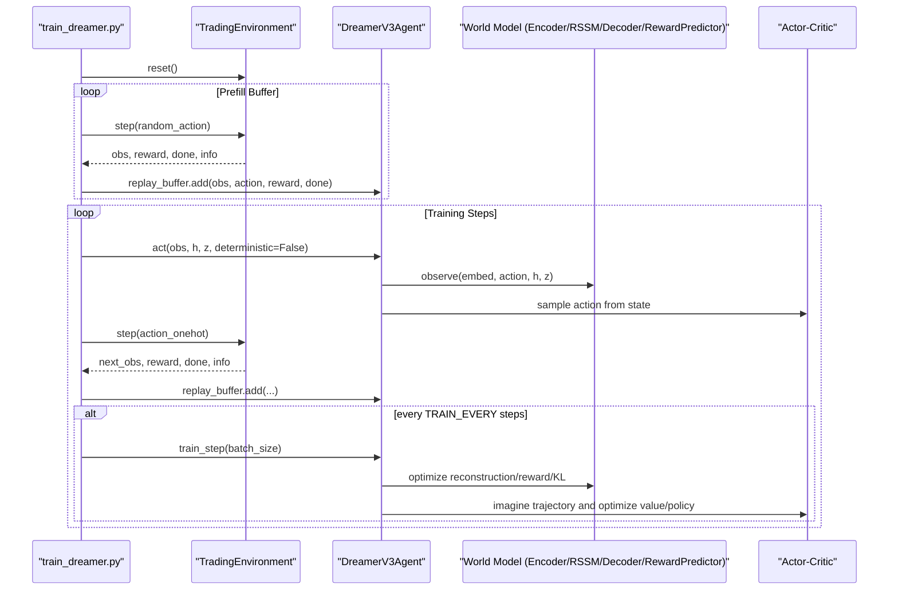
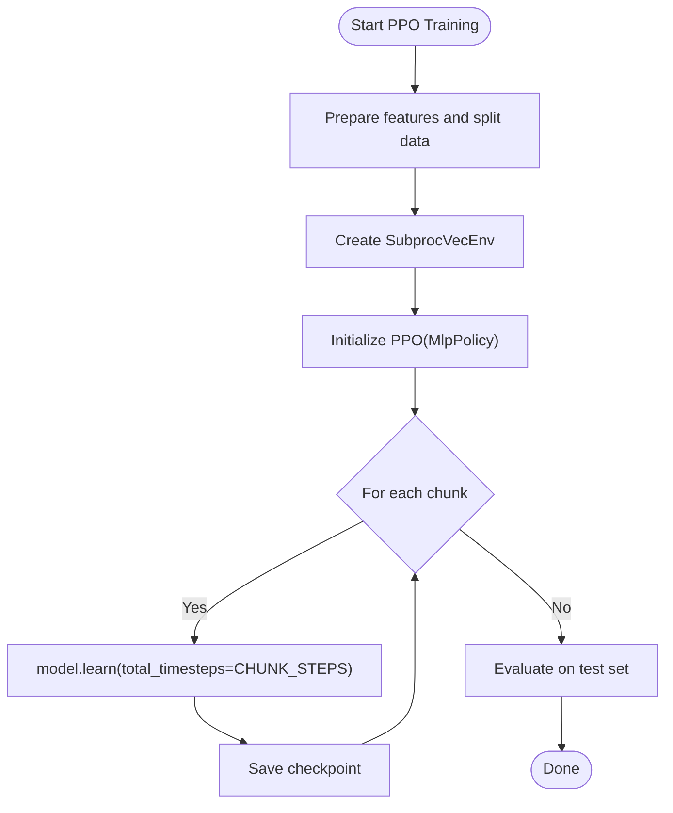
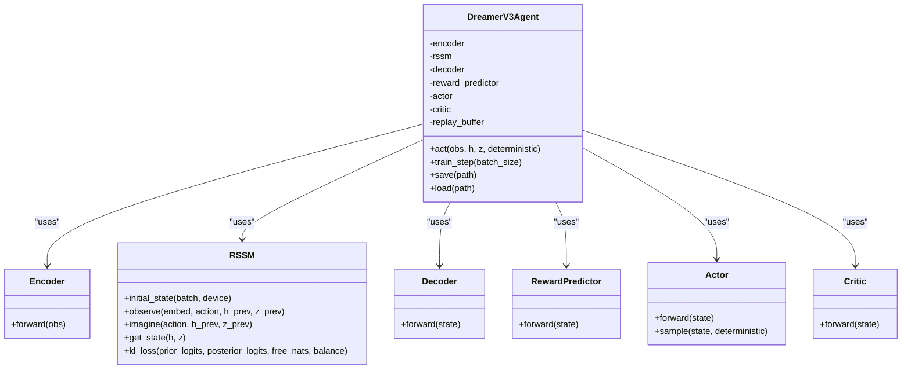
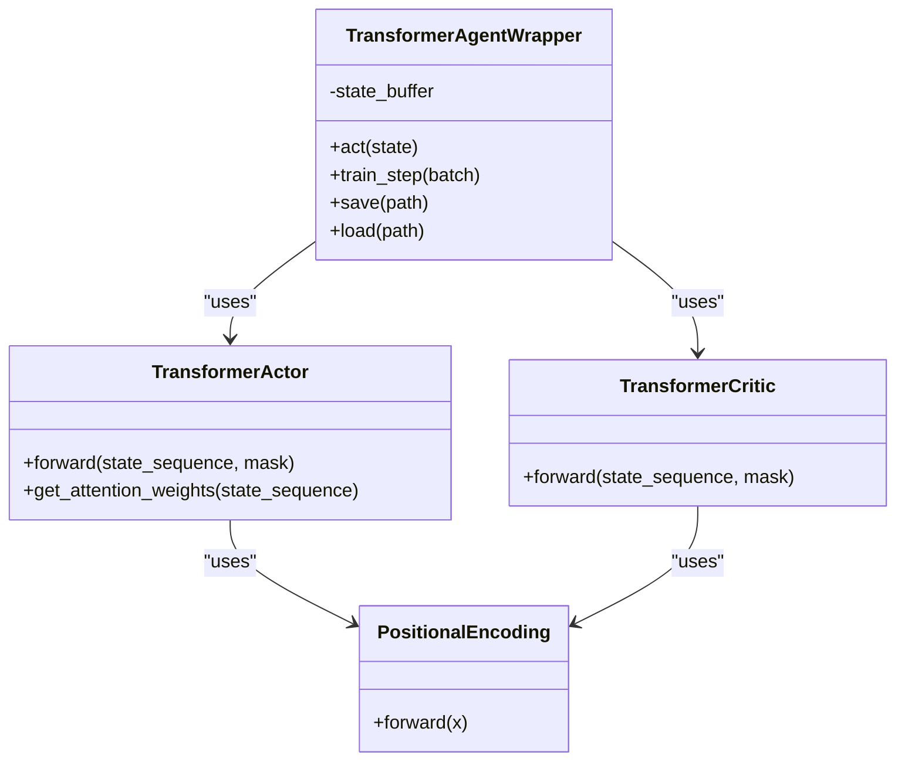
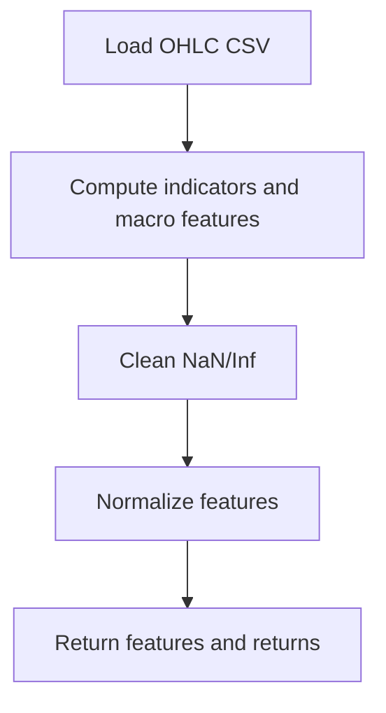
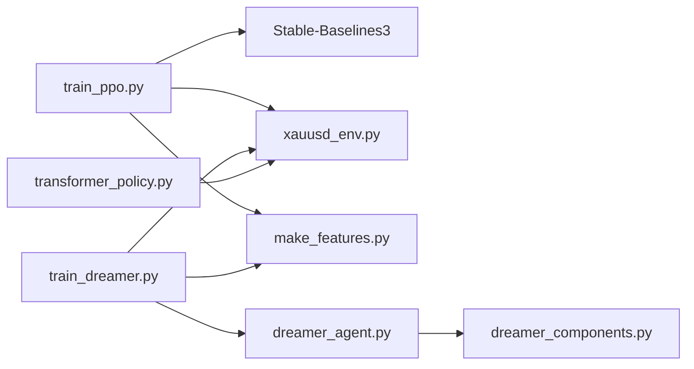

# Model Training API

<cite>
**Referenced Files in This Document**
- [dreamer_agent.py](file://models/dreamer_agent.py)
- [dreamer_components.py](file://models/dreamer_components.py)
- [transformer_policy.py](file://models/transformer_policy.py)
- [train_ppo.py](file://train/train_ppo.py)
- [train_dreamer.py](file://train/train_dreamer.py)
- [xauusd_env.py](file://env/xauusd_env.py)
- [make_features.py](file://features/make_features.py)
- [eval_ppo.py](file://eval/eval_ppo.py)
</cite>

## Table of Contents
1. Introduction
2. Project Structure
3. Core Components
4. Architecture Overview
5. Detailed Component Analysis
6. Dependency Analysis
7. Performance Considerations
8. Troubleshooting Guide
9. Conclusion
10. Appendices

## Introduction
This document provides comprehensive API documentation for model training interfaces covering both PPO and Dreamer V3 implementations used for trading on XAUUSD. It explains agent initialization parameters, training methods, evaluation functions, and callback-like hooks. For Dreamer V3, it documents world model training, imagination-based planning, and policy optimization with hyperparameter specifications. For the transformer policy, it covers attention mechanisms, sequence processing, and integration patterns with RL algorithms. It also outlines training loop configurations, learning rate schedules, batch processing, checkpoint management, examples for configuring scenarios, monitoring progress, saving/loading models, and tuning hyperparameters. Finally, it addresses distributed training considerations, GPU utilization, and memory optimization strategies for large-scale runs.

## Project Structure
The repository organizes training code under train/, models/, env/, features/, and eval/. The key modules are:
- PPO training entry point using Stable-Baselines3
- Dreamer V3 agent and components (world model, actor-critic)
- Transformer-based policy wrapper for sequence modeling
- Trading environment implementing a discrete long-only action space
- Feature pipeline producing normalized sequences and returns
- Evaluation utilities for PPO



**Diagram sources**
- [train_ppo.py:1-93](file://train/train_ppo.py#L1-L93)
- [train_dreamer.py:1-331](file://train/train_dreamer.py#L1-L331)
- [dreamer_agent.py:1-460](file://models/dreamer_agent.py#L1-L460)
- [dreamer_components.py:1-338](file://models/dreamer_components.py#L1-L338)
- [transformer_policy.py:1-442](file://models/transformer_policy.py#L1-L442)
- [xauusd_env.py:1-118](file://env/xauusd_env.py#L1-L118)
- [make_features.py:1-83](file://features/make_features.py#L1-L83)
- [eval_ppo.py:1-94](file://eval/eval_ppo.py#L1-L94)

**Section sources**
- [train_ppo.py:1-93](file://train/train_ppo.py#L1-L93)
- [train_dreamer.py:1-331](file://train/train_dreamer.py#L1-L331)
- [dreamer_agent.py:1-460](file://models/dreamer_agent.py#L1-L460)
- [dreamer_components.py:1-338](file://models/dreamer_components.py#L1-L338)
- [transformer_policy.py:1-442](file://models/transformer_policy.py#L1-L442)
- [xauusd_env.py:1-118](file://env/xauusd_env.py#L1-L118)
- [make_features.py:1-83](file://features/make_features.py#L1-L83)
- [eval_ppo.py:1-94](file://eval/eval_ppo.py#L1-L94)

## Core Components
- PPO Agent (Stable-Baselines3):
  - Uses MlpPolicy with vectorized environments for parallel data collection.
  - Key configuration includes n_steps, batch_size, gamma, and learning_rate.
  - Checkpointing saves periodic snapshots and a latest artifact.

- Dreamer V3 Agent:
  - World model: Encoder + RSSM + Decoder + Reward Predictor.
  - Policy: Actor (categorical actions) and Critic (value).
  - Replay buffer stores sequences; training alternates between world model updates and imagined actor-critic updates.
  - Hyperparameters include embed_dim, hidden_dim, stoch_dim, num_categories, lr_world_model, lr_actor, lr_critic, gamma, lambda_, horizon, free_nats, kl_balance.

- Transformer Policy:
  - TransformerActor and TransformerCritic use multi-head attention with positional encodings to process sequences.
  - Wrapper maintains a sliding window of states and produces actions via softmax over logits.

- Environment:
  - Discrete long-only actions (flat/long), reward includes PnL, trade costs, turnover penalty, flat penalty, and hold bonus.
  - Observation is a flattened window of features plus current position.

- Features:
  - Computes technical indicators and optional macro features, normalizes them, and returns feature matrix and returns series.

**Section sources**
- [train_ppo.py:25-67](file://train/train_ppo.py#L25-L67)
- [dreamer_agent.py:84-147](file://models/dreamer_agent.py#L84-L147)
- [dreamer_components.py:71-295](file://models/dreamer_components.py#L71-L295)
- [transformer_policy.py:67-249](file://models/transformer_policy.py#L67-L249)
- [xauusd_env.py:7-118](file://env/xauusd_env.py#L7-L118)
- [make_features.py:18-83](file://features/make_features.py#L18-L83)

## Architecture Overview
The system supports two primary training paths:

- PPO path:
  - Data preparation via make_features.
  - Vectorized environment for parallel rollouts.
  - SB3 PPO learns with fixed schedule and checkpoints periodically.

- Dreamer V3 path:
  - Custom environment returning flat observations.
  - Agent collects transitions into a replay buffer.
  - Each training step:
    - Phase 1: Train world model (reconstruction, reward prediction, KL regularization).
    - Phase 2: Imagine trajectories using RSSM and update actor-critic on imagined rewards and states.



**Diagram sources**
- [train_dreamer.py:128-331](file://train/train_dreamer.py#L128-L331)
- [dreamer_agent.py:148-304](file://models/dreamer_agent.py#L148-L304)
- [dreamer_components.py:92-205](file://models/dreamer_components.py#L92-L205)

**Section sources**
- [train_dreamer.py:128-331](file://train/train_dreamer.py#L128-L331)
- [dreamer_agent.py:148-304](file://models/dreamer_agent.py#L148-L304)

## Detailed Component Analysis

### PPO Training Interface
- Initialization and Configuration:
  - Window size, cost per trade, number of parallel environments, and split date define data usage.
  - Chunked learning with total_timesteps per chunk and periodic checkpointing.

- Training Loop:
  - SubprocVecEnv creates N parallel environments for efficient rollout collection.
  - PPO.learn runs for CHUNK_STEPS per chunk; model.save persists artifacts.

- Evaluation:
  - Loads latest model and evaluates on test set, printing equity, trades, and time in positions.



**Diagram sources**
- [train_ppo.py:25-67](file://train/train_ppo.py#L25-L67)
- [eval_ppo.py:16-94](file://eval/eval_ppo.py#L16-L94)

**Section sources**
- [train_ppo.py:25-67](file://train/train_ppo.py#L25-L67)
- [eval_ppo.py:16-94](file://eval/eval_ppo.py#L16-L94)

### Dreamer V3 Agent API
- Agent Initialization Parameters:
  - obs_dim, action_dim, device, embed_dim, hidden_dim, stoch_dim, num_categories, lr_world_model, lr_actor, lr_critic, gamma, lambda_, horizon, free_nats, kl_balance.

- Methods:
  - act(obs, h=None, z=None, deterministic=False): Returns action and updated latent state (h, z).
  - train_step(batch_size=16): Performs world model and actor-critic updates; returns loss metrics.
  - save(path), load(path): Checkpoint management.

- Internal Components:
  - Encoder compresses observations using symlog transformation.
  - RSSM maintains deterministic hidden state h and stochastic categorical latent z; supports observe and imagine.
  - Decoder reconstructs observations; RewardPredictor predicts rewards in symlog space.
  - Actor outputs categorical action logits; Critic estimates values.



**Diagram sources**
- [dreamer_agent.py:84-147](file://models/dreamer_agent.py#L84-L147)
- [dreamer_components.py:71-295](file://models/dreamer_components.py#L71-L295)

**Section sources**
- [dreamer_agent.py:84-147](file://models/dreamer_agent.py#L84-L147)
- [dreamer_components.py:71-295](file://models/dreamer_components.py#L71-L295)

### Dreamer V3 Training Loop and Callbacks
- Training Loop:
  - Prefill phase fills replay buffer with random exploration.
  - Main loop collects transitions, adds to buffer, and triggers training every TRAIN_EVERY steps.
  - Losses printed periodically; checkpoints saved every SAVE_EVERY steps.

- Callback Interfaces:
  - Logging: Print losses and episode stats at intervals.
  - Checkpointing: Save model artifacts during training.
  - No explicit callback classes; periodic hooks implemented within the loop.

```mermaid
sequenceDiagram
participant Loop as "Training Loop"
participant Agent as "DreamerV3Agent"
participant Env as "TradingEnvironment"
Loop->>Env : reset()
loop Steps
Loop->>Agent : act(obs, h, z, deterministic=False)
Agent-->>Loop : action_onehot, (h, z)
Loop->>Env : step(action_onehot)
Env-->>Loop : next_obs, reward, done, info
Loop->>Agent : replay_buffer.add(obs, action, reward, done)
alt every TRAIN_EVERY
Loop->>Agent : train_step(batch_size)
Agent-->>Loop : losses dict
Loop->>Loop : print(losses)
end
alt checkpoint interval
Loop->>Agent : save(path)
end
end
```

**Diagram sources**
- [train_dreamer.py:210-331](file://train/train_dreamer.py#L210-L331)
- [dreamer_agent.py:190-304](file://models/dreamer_agent.py#L190-L304)

**Section sources**
- [train_dreamer.py:210-331](file://train/train_dreamer.py#L210-L331)
- [dreamer_agent.py:190-304](file://models/dreamer_agent.py#L190-L304)

### Transformer Policy API
- Components:
  - PositionalEncoding adds sinusoidal positional information to embeddings.
  - TransformerActor processes sequences and outputs action logits.
  - TransformerCritic processes sequences and outputs value estimates.
  - TransformerAgentWrapper manages a sliding window of states and provides act/save/load.

- Attention Mechanisms:
  - Multi-head self-attention via nn.TransformerEncoderLayer.
  - Sequence masking supported via src_key_padding_mask.

- Integration with RL:
  - Wrapper can be adapted to replace MLP actor/critic in other agents by substituting networks.



**Diagram sources**
- [transformer_policy.py:34-249](file://models/transformer_policy.py#L34-L249)

**Section sources**
- [transformer_policy.py:34-249](file://models/transformer_policy.py#L34-L249)

### Environment and Features
- Environment:
  - Discrete actions: 0 = Flat, 1 = Long.
  - Reward composition includes PnL, trade cost, turnover penalty, flat penalty, and hold bonus.
  - Observation concatenates a window of features and current position.

- Features:
  - Technical indicators: returns, volatility, momentum, moving averages, RSI, MACD differences.
  - Optional macro features: DXY, SPX, US10Y changes and correlations.
  - Normalization via mean/std; NaN/Inf handled.



**Diagram sources**
- [make_features.py:18-83](file://features/make_features.py#L18-L83)

**Section sources**
- [xauusd_env.py:7-118](file://env/xauusd_env.py#L7-L118)
- [make_features.py:18-83](file://features/make_features.py#L18-L83)

## Dependency Analysis
- PPO depends on Stable-Baselines3 and Gymnasium environment; uses vectorized environments for parallelism.
- Dreamer V3 depends on custom components (Encoder, RSSM, Decoder, RewardPredictor, Actor, Critic) and a simple trading environment.
- Transformer policy is modular and can be integrated into other agents by replacing actor/critic networks.



**Diagram sources**
- [train_ppo.py:1-93](file://train/train_ppo.py#L1-L93)
- [train_dreamer.py:1-331](file://train/train_dreamer.py#L1-L331)
- [dreamer_agent.py:1-460](file://models/dreamer_agent.py#L1-L460)
- [dreamer_components.py:1-338](file://models/dreamer_components.py#L1-L338)
- [transformer_policy.py:1-442](file://models/transformer_policy.py#L1-L442)
- [xauusd_env.py:1-118](file://env/xauusd_env.py#L1-L118)
- [make_features.py:1-83](file://features/make_features.py#L1-L83)

**Section sources**
- [train_ppo.py:1-93](file://train/train_ppo.py#L1-L93)
- [train_dreamer.py:1-331](file://train/train_dreamer.py#L1-L331)
- [dreamer_agent.py:1-460](file://models/dreamer_agent.py#L1-L460)
- [dreamer_components.py:1-338](file://models/dreamer_components.py#L1-L338)
- [transformer_policy.py:1-442](file://models/transformer_policy.py#L1-L442)
- [xauusd_env.py:1-118](file://env/xauusd_env.py#L1-L118)
- [make_features.py:1-83](file://features/make_features.py#L1-L83)

## Performance Considerations
- Batch Processing:
  - PPO uses n_steps per environment and batch_size for updates; increase N_ENVS for more parallel rollouts.
  - Dreamer V3 uses batch_size for sampling sequences from replay buffer; larger batches improve throughput on GPU.

- Learning Rate Schedules:
  - PPO uses a fixed learning_rate; consider linear decay or cosine annealing for stability.
  - Dreamer V3 uses separate learning rates for world model, actor, and critic; tune based on convergence behavior.

- Memory Optimization:
  - Use gradient clipping to prevent exploding gradients.
  - Reduce seq_len or hidden_dim if out-of-memory occurs.
  - Employ mixed precision (if supported) to reduce memory footprint.

- Distributed Training:
  - PPO leverages SubprocVecEnv for parallel environments; scale N_ENVS to CPU cores.
  - For multi-GPU, consider data parallelism across workers or using torch.distributed for Dreamer V3 components.

- GPU Utilization:
  - Auto-detect device in Dreamer V3 training script; prefer CUDA/MPS when available.
  - Ensure tensors are moved to device consistently to avoid CPU bottlenecks.

[No sources needed since this section provides general guidance]

## Troubleshooting Guide
- Replay Buffer Underflow:
  - If replay buffer has fewer than seq_len + 1 transitions, train_step returns None; ensure sufficient prefill steps.

- Device Mismatch:
  - Verify all tensors are on the same device; Dreamer V3 moves inputs to device explicitly.

- Gradient Issues:
  - Gradient clipping is applied; if instability persists, reduce learning rates or adjust KL balancing/free nats.

- Checkpoint Loading:
  - Ensure checkpoint contains required keys; verify training_step metadata if resuming.

**Section sources**
- [dreamer_agent.py:190-201](file://models/dreamer_agent.py#L190-L201)
- [dreamer_agent.py:256-263](file://models/dreamer_agent.py#L256-L263)
- [dreamer_agent.py:405-427](file://models/dreamer_agent.py#L405-L427)

## Conclusion
The repository provides robust training interfaces for both PPO and Dreamer V3 tailored to XAUUSD trading. PPO offers a straightforward setup with vectorized environments and stable learning. Dreamer V3 introduces world model learning and imagination-based planning, enabling sample-efficient policy optimization. The transformer policy adds sequence-aware modeling capabilities that can be integrated into RL pipelines. With configurable hyperparameters, checkpointing, and evaluation utilities, users can experiment with different training scenarios, monitor progress, and optimize performance for large-scale runs.

[No sources needed since this section summarizes without analyzing specific files]

## Appendices

### Example Configurations and Usage
- PPO:
  - Configure WINDOW, COST, N_ENVS, CHUNK_STEPS, N_CHUNKS, and learning_rate.
  - Run training and evaluate using eval scripts.

- Dreamer V3:
  - Set BATCH_SIZE, PREFILL_STEPS, TRAIN_STEPS, TRAIN_EVERY, SAVE_EVERY.
  - Choose device (auto/cuda/mps/cpu) and adjust architecture dims.

- Transformer Policy:
  - Adjust hidden_dim, num_heads, num_layers, seq_len for capacity vs. compute trade-offs.

**Section sources**
- [train_ppo.py:11-67](file://train/train_ppo.py#L11-L67)
- [train_dreamer.py:21-34](file://train/train_dreamer.py#L21-L34)
- [transformer_policy.py:74-124](file://models/transformer_policy.py#L74-L124)

### Monitoring Training Progress
- PPO:
  - Use verbose logging from SB3 and periodic prints after chunks.

- Dreamer V3:
  - Print world model losses and policy/value losses at intervals; track episode rewards and equity.

**Section sources**
- [train_ppo.py:56-67](file://train/train_ppo.py#L56-L67)
- [train_dreamer.py:270-287](file://train/train_dreamer.py#L270-L287)

### Saving and Loading Models
- PPO:
  - model.save(ckpt_path) and model.load(model_path).

- Dreamer V3:
  - agent.save(path) and agent.load(path); includes training_step metadata.

**Section sources**
- [train_ppo.py:61-67](file://train/train_ppo.py#L61-L67)
- [dreamer_agent.py:405-427](file://models/dreamer_agent.py#L405-L427)

### Hyperparameter Tuning Guidelines
- PPO:
  - Tune n_steps, batch_size, gamma, learning_rate; consider scaling N_ENVS.

- Dreamer V3:
  - Tune embed_dim, hidden_dim, stoch_dim, num_categories, lr_world_model, lr_actor, lr_critic, gamma, lambda_, horizon, free_nats, kl_balance.

- Transformer Policy:
  - Tune hidden_dim, num_heads, num_layers, seq_len, dropout.

**Section sources**
- [train_ppo.py:46-54](file://train/train_ppo.py#L46-L54)
- [dreamer_agent.py:91-147](file://models/dreamer_agent.py#L91-L147)
- [transformer_policy.py:74-124](file://models/transformer_policy.py#L74-L124)