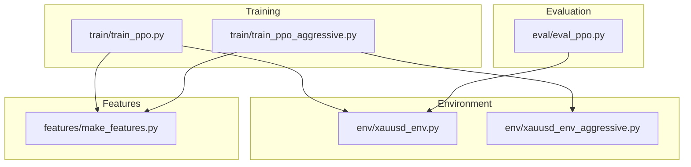
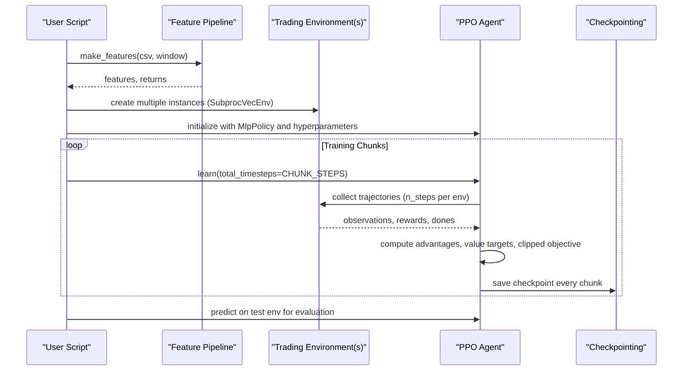
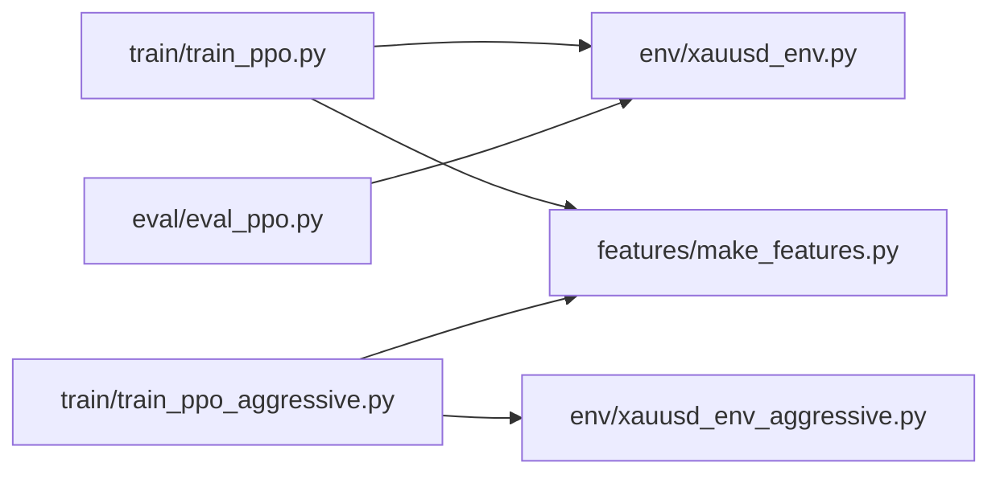
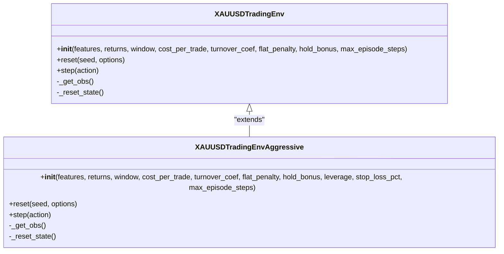
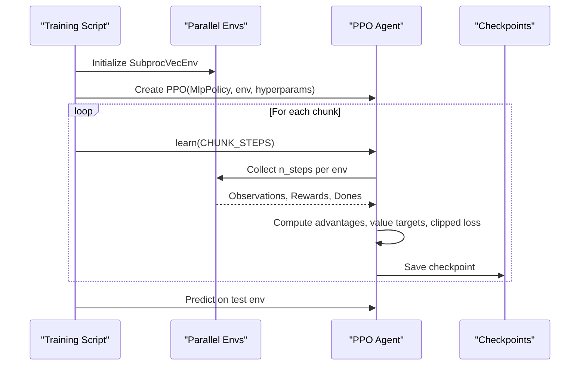

# PPO Training API

<cite>
**Referenced Files in This Document**
- [train_ppo.py](file://train/train_ppo.py)
- [train_ppo_aggressive.py](file://train/train_ppo_aggressive.py)
- [xauusd_env.py](file://env/xauusd_env.py)
- [xauusd_env_aggressive.py](file://env/xauusd_env_aggressive.py)
- [make_features.py](file://features/make_features.py)
- [eval_ppo.py](file://eval/eval_ppo.py)
- [README.md](file://README.md)
</cite>

## Table of Contents
1. [Introduction](#introduction)
2. [Project Structure](#project-structure)
3. [Core Components](#core-components)
4. [Architecture Overview](#architecture-overview)
5. [Detailed Component Analysis](#detailed-component-analysis)
6. [Dependency Analysis](#dependency-analysis)
7. [Performance Considerations](#performance-considerations)
8. [Troubleshooting Guide](#troubleshooting-guide)
9. [Conclusion](#conclusion)
10. [Appendices](#appendices)

## Introduction
This document provides comprehensive API documentation for the Proximal Policy Optimization (PPO) training interfaces used to train autonomous trading agents on XAUUSD data. It covers:
- Agent initialization parameters, including policy network architecture and optimization hyperparameters
- The training loop for environment interaction, experience collection, and policy updates with clipping mechanisms
- Action space handling for discrete trading actions (flat/long; short/flat/long variants)
- Reward shaping strategies and gradient clipping techniques
- Examples for configuring different PPO variants, monitoring training progress, saving policies, and performing hyperparameter tuning
- Memory management for large batch processing, GPU utilization optimization, and distributed training considerations for multi-GPU setups

The implementation uses Stable-Baselines3’s PPO with Gymnasium environments and parallel vectorized environments for efficient training.

## Project Structure
Key directories and files relevant to PPO training:
- train/: Scripts to initialize and run PPO training loops
- env/: Trading environments defining observation/action spaces and reward logic
- features/: Feature engineering pipeline that prepares inputs for the agent
- eval/: Evaluation scripts to test trained models on out-of-sample data
- README.md: High-level project overview and configuration guidance

**Diagram sources**
- [train_ppo.py:25-67](file://train/train_ppo.py#L25-L67)
- [train_ppo_aggressive.py:25-84](file://train/train_ppo_aggressive.py#L25-L84)
- [xauusd_env.py:21-57](file://env/xauusd_env.py#L21-L57)
- [xauusd_env_aggressive.py:20-64](file://env/xauusd_env_aggressive.py#L20-L64)
- [make_features.py:18-78](file://features/make_features.py#L18-L78)
- [eval_ppo.py:16-40](file://eval/eval_ppo.py#L16-L40)

**Section sources**
- [train_ppo.py:25-67](file://train/train_ppo.py#L25-L67)
- [train_ppo_aggressive.py:25-84](file://train/train_ppo_aggressive.py#L25-L84)
- [xauusd_env.py:21-57](file://env/xauusd_env.py#L21-L57)
- [xauusd_env_aggressive.py:20-64](file://env/xauusd_env_aggressive.py#L20-L64)
- [make_features.py:18-78](file://features/make_features.py#L18-L78)
- [eval_ppo.py:16-40](file://eval/eval_ppo.py#L16-L40)

## Core Components
- PPO Agent Initialization:
  - Policy network: MlpPolicy (multi-layer perceptron)
  - Hyperparameters: n_steps, batch_size, gamma, learning_rate, ent_coef (in aggressive variant)
  - Parallel environments via SubprocVecEnv for sample efficiency
- Trading Environments:
  - Discrete action spaces: flat/long or short/flat/long
  - Reward shaping: PnL, trade costs, turnover penalties, flat penalties, hold bonuses, stop-loss penalties
  - Observation construction: windowed features + current position
- Feature Pipeline:
  - Technical indicators and macro features normalized for stable training
- Evaluation:
  - Load saved model and simulate rollout on test data, compare against baselines

**Section sources**
- [train_ppo.py:46-54](file://train/train_ppo.py#L46-L54)
- [train_ppo_aggressive.py:50-59](file://train/train_ppo_aggressive.py#L50-L59)
- [xauusd_env.py:7-17](file://env/xauusd_env.py#L7-L17)
- [xauusd_env_aggressive.py:6-16](file://env/xauusd_env_aggressive.py#L6-L16)
- [make_features.py:18-78](file://features/make_features.py#L18-L78)
- [eval_ppo.py:24-40](file://eval/eval_ppo.py#L24-L40)

## Architecture Overview
The training workflow integrates feature preparation, parallel environment execution, and PPO updates:

**Diagram sources**
- [train_ppo.py:25-67](file://train/train_ppo.py#L25-L67)
- [train_ppo_aggressive.py:25-84](file://train/train_ppo_aggressive.py#L25-L84)
- [xauusd_env.py:70-117](file://env/xauusd_env.py#L70-L117)
- [xauusd_env_aggressive.py:81-143](file://env/xauusd_env_aggressive.py#L81-L143)
- [make_features.py:18-78](file://features/make_features.py#L18-L78)

## Detailed Component Analysis

### PPO Agent Initialization and Hyperparameters
- Policy Network:
  - MlpPolicy is used for both standard and aggressive variants
- Optimization Hyperparameters:
  - Standard variant: n_steps=1024, batch_size=256, gamma=0.99, learning_rate=3e-4
  - Aggressive variant: n_steps=2048, batch_size=512, gamma=0.99, learning_rate=3e-4, ent_coef=0.01
- Clipping Mechanism:
  - PPO’s clipped surrogate objective prevents overly large policy updates; this is handled internally by Stable-Baselines3’s PPO implementation
- Gradient Clipping:
  - Not explicitly configured in these scripts; default SB3 behavior applies

Configuration examples:
- Standard PPO: see [train_ppo.py:46-54](file://train/train_ppo.py#L46-L54)
- Aggressive PPO: see [train_ppo_aggressive.py:50-59](file://train/train_ppo_aggressive.py#L50-L59)

**Section sources**
- [train_ppo.py:46-54](file://train/train_ppo.py#L46-L54)
- [train_ppo_aggressive.py:50-59](file://train/train_ppo_aggressive.py#L50-L59)

### Environment Interaction and Experience Collection
- Parallel Environments:
  - SubprocVecEnv creates multiple independent environment processes to collect experiences concurrently
- Experience Collection:
  - Each environment collects n_steps transitions per update; total samples per update equal n_steps × N_ENVS
- Training Loop:
  - Chunked learning with periodic checkpointing; cumulative timesteps tracked across chunks

Examples:
- Standard training loop: see [train_ppo.py:44-67](file://train/train_ppo.py#L44-L67)
- Aggressive training loop: see [train_ppo_aggressive.py:47-84](file://train/train_ppo_aggressive.py#L47-L84)

**Section sources**
- [train_ppo.py:44-67](file://train/train_ppo.py#L44-L67)
- [train_ppo_aggressive.py:47-84](file://train/train_ppo_aggressive.py#L47-L84)

### Policy Updates with Clipping Mechanisms
- PPO Objective:
  - Uses a clipped surrogate loss to limit policy changes per update step
- Value Function:
  - Shared MLP critic estimates state values; value targets computed from discounted rewards and bootstrapping
- Advantage Estimation:
  - Generalized Advantage Estimation (GAE) is used by default in SB3’s PPO to reduce variance while maintaining bias control

Note: These mechanisms are implemented within Stable-Baselines3’s PPO class; no custom code is required in the training scripts.

**Section sources**
- [train_ppo.py:46-54](file://train/train_ppo.py#L46-L54)
- [train_ppo_aggressive.py:50-59](file://train/train_ppo_aggressive.py#L50-L59)

### Action Space Handling for Discrete Trading Actions
- Standard Environment:
  - Discrete action space {0: Flat, 1: Long}
  - Position applied on next step to avoid look-ahead bias
- Aggressive Environment:
  - Discrete action space {0: Short, 1: Flat, 2: Long}
  - Leverage and optional stop-loss mechanics integrated into reward and episode termination

Action mapping and reward computation:
- Standard: see [xauusd_env.py:75-117](file://env/xauusd_env.py#L75-L117)
- Aggressive: see [xauusd_env_aggressive.py:86-143](file://env/xauusd_env_aggressive.py#L86-L143)

**Section sources**
- [xauusd_env.py:75-117](file://env/xauusd_env.py#L75-L117)
- [xauusd_env_aggressive.py:86-143](file://env/xauusd_env_aggressive.py#L86-L143)

### Reward Shaping Strategies
- Standard Environment Rewards:
  - PnL from previous position over current bar
  - Trade cost proportional to position change
  - Turnover penalty to discourage frequent switching
  - Flat penalty to encourage exposure in trending markets
  - Hold bonus to stabilize positions and reduce flip-flopping
- Aggressive Environment Rewards:
  - PnL scaled by leverage
  - Stop-loss penalty and forced close when thresholds breached
  - Optional flat penalty and hold bonus configurable

Reward composition:
- Standard: see [xauusd_env.py:75-99](file://env/xauusd_env.py#L75-L99)
- Aggressive: see [xauusd_env_aggressive.py:86-125](file://env/xauusd_env_aggressive.py#L86-L125)

**Section sources**
- [xauusd_env.py:75-99](file://env/xauusd_env.py#L75-L99)
- [xauusd_env_aggressive.py:86-125](file://env/xauusd_env_aggressive.py#L86-L125)

### Gradient Clipping Techniques
- Default Behavior:
  - Stable-Baselines3 applies internal gradient clipping during PPO updates unless overridden
- Customization:
  - To adjust gradient norms, modify PPO constructor arguments (e.g., max_grad_norm) if needed

Reference:
- PPO initialization in scripts: see [train_ppo.py:46-54](file://train/train_ppo.py#L46-L54), [train_ppo_aggressive.py:50-59](file://train/train_ppo_aggressive.py#L50-L59)

**Section sources**
- [train_ppo.py:46-54](file://train/train_ppo.py#L46-L54)
- [train_ppo_aggressive.py:50-59](file://train/train_ppo_aggressive.py#L50-L59)

### Monitoring Training Progress and Metrics Logging
- Checkpointing:
  - Models saved periodically with cumulative timestep suffix for easy tracking
- Quick Evaluation:
  - Post-training rollout on test data prints equity, trades, and time-in-position metrics
- Baseline Comparisons:
  - Buy & Hold and Moving Average strategies compared on same test period

Examples:
- Checkpoint saving: see [train_ppo.py:56-67](file://train/train_ppo.py#L56-L67), [train_ppo_aggressive.py:72-84](file://train/train_ppo_aggressive.py#L72-L84)
- Test rollout and metrics: see [train_ppo.py:69-87](file://train/train_ppo.py#L69-L87), [train_ppo_aggressive.py:86-118](file://train/train_ppo_aggressive.py#L86-L118)
- Evaluation script: see [eval_ppo.py:16-90](file://eval/eval_ppo.py#L16-L90)

**Section sources**
- [train_ppo.py:56-87](file://train/train_ppo.py#L56-L87)
- [train_ppo_aggressive.py:72-118](file://train/train_ppo_aggressive.py#L72-L118)
- [eval_ppo.py:16-90](file://eval/eval_ppo.py#L16-L90)

### Saving Trained Policies
- Model persistence:
  - Checkpoints saved at intervals and a “latest” model saved for convenience
- Loading for evaluation:
  - Use PPO.load() to restore models for inference

Examples:
- Saving: see [train_ppo.py:61-67](file://train/train_ppo.py#L61-L67), [train_ppo_aggressive.py:78-84](file://train/train_ppo_aggressive.py#L78-L84)
- Loading: see [eval_ppo.py:24-26](file://eval/eval_ppo.py#L24-L26)

**Section sources**
- [train_ppo.py:61-67](file://train/train_ppo.py#L61-L67)
- [train_ppo_aggressive.py:78-84](file://train/train_ppo_aggressive.py#L78-L84)
- [eval_ppo.py:24-26](file://eval/eval_ppo.py#L24-L26)

### Hyperparameter Tuning Examples
- Adjusting exploration:
  - Increase entropy coefficient (ent_coef) to promote exploration in aggressive variant
- Batch size and steps:
  - Larger batch sizes improve stability but require more memory
  - Increasing n_steps increases sample efficiency per update
- Learning rate and discount factor:
  - Tune learning_rate for convergence speed; gamma controls long-term reward emphasis

References:
- Aggressive variant hyperparameters: see [train_ppo_aggressive.py:50-59](file://train/train_ppo_aggressive.py#L50-L59)
- General configuration guidance: see [README.md:538-559](file://README.md#L538-L559)

**Section sources**
- [train_ppo_aggressive.py:50-59](file://train/train_ppo_aggressive.py#L50-L59)
- [README.md:538-559](file://README.md#L538-L559)

### Memory Management for Large Batch Processing
- Vectorized Environments:
  - SubprocVecEnv isolates each environment process to manage memory per worker
- Batch Size Considerations:
  - Larger batch_size increases memory usage; tune based on available RAM/GPU memory
- Feature Normalization:
  - Features are normalized to reduce numerical instability and memory overhead from extreme values

Guidance:
- Parallel env setup: see [train_ppo.py:44-44](file://train/train_ppo.py#L44-L44), [train_ppo_aggressive.py:47-47](file://train/train_ppo_aggressive.py#L47-L47)
- Feature normalization: see [make_features.py:73-76](file://features/make_features.py#L73-L76)

**Section sources**
- [train_ppo.py:44-44](file://train/train_ppo.py#L44-L44)
- [train_ppo_aggressive.py:47-47](file://train/train_ppo_aggressive.py#L47-L47)
- [make_features.py:73-76](file://features/make_features.py#L73-L76)

### GPU Utilization Optimization
- Device Selection:
  - Use CUDA for NVIDIA GPUs or MPS for Apple Silicon to accelerate training
- Batch and Steps:
  - Increase batch_size and n_steps to better utilize GPU throughput
- Environment Overhead:
  - Keep number of parallel environments balanced to avoid CPU bottlenecks

References:
- Hardware support noted in project docs: see [README.md:65-69](file://README.md#L65-L69)
- Configuration options: see [README.md:548-559](file://README.md#L548-L559)

**Section sources**
- [README.md:65-69](file://README.md#L65-L69)
- [README.md:548-559](file://README.md#L548-L559)

### Distributed Training Considerations for Multi-GPU Setups
- Current Implementation:
  - Uses single-process PPO with parallel environments; not inherently multi-GPU distributed
- Scaling Options:
  - Increase N_ENVS to utilize multiple CPU cores for environment sampling
  - For true multi-GPU scaling, consider using SB3’s built-in distributed modes or external frameworks (e.g., Ray RLlib)

References:
- Parallel environment usage: see [train_ppo.py:44-44](file://train/train_ppo.py#L44-L44), [train_ppo_aggressive.py:47-47](file://train/train_ppo_aggressive.py#L47-L47)

**Section sources**
- [train_ppo.py:44-44](file://train/train_ppo.py#L44-L44)
- [train_ppo_aggressive.py:47-47](file://train/train_ppo_aggressive.py#L47-L47)

## Dependency Analysis

**Diagram sources**
- [train_ppo.py:8-9](file://train/train_ppo.py#L8-L9)
- [train_ppo_aggressive.py:8-9](file://train/train_ppo_aggressive.py#L8-L9)
- [eval_ppo.py:7-8](file://eval/eval_ppo.py#L7-L8)

**Section sources**
- [train_ppo.py:8-9](file://train/train_ppo.py#L8-L9)
- [train_ppo_aggressive.py:8-9](file://train/train_ppo_aggressive.py#L8-L9)
- [eval_ppo.py:7-8](file://eval/eval_ppo.py#L7-L8)

## Performance Considerations
- Sample Efficiency:
  - Increase n_steps and N_ENVS to collect more samples per update
- Stability:
  - Use moderate learning rates and sufficient batch sizes to avoid divergence
- Exploration:
  - Tune ent_coef to balance exploration vs exploitation
- Memory:
  - Monitor RAM/GPU usage; reduce batch_size or N_ENVS if encountering memory pressure
- Hardware:
  - Prefer GPU acceleration for faster training; ensure proper device configuration

[No sources needed since this section provides general guidance]

## Troubleshooting Guide
- Environment Errors:
  - Ensure feature dimensions match expected shapes and returns align with features
- Training Instability:
  - Reduce learning_rate or increase batch_size; check for NaNs in features
- Memory Issues:
  - Lower batch_size or N_ENVS; verify feature normalization
- Evaluation Discrepancies:
  - Confirm model path and test data split dates; validate deterministic predictions

**Section sources**
- [xauusd_env.py:33-38](file://env/xauusd_env.py#L33-L38)
- [make_features.py:63-76](file://features/make_features.py#L63-L76)
- [eval_ppo.py:16-40](file://eval/eval_ppo.py#L16-L40)

## Conclusion
The PPO training interfaces in this repository provide a robust framework for autonomous trading on XAUUSD. By leveraging parallel environments, well-designed reward shaping, and stable PPO updates with clipping, users can train effective policies for discrete trading actions. The included scripts facilitate configuration, monitoring, and evaluation, while offering flexibility for hyperparameter tuning and hardware optimization.

[No sources needed since this section summarizes without analyzing specific files]

## Appendices

### Appendix A: Environment Class Diagram

**Diagram sources**
- [xauusd_env.py:7-117](file://env/xauusd_env.py#L7-L117)
- [xauusd_env_aggressive.py:6-143](file://env/xauusd_env_aggressive.py#L6-L143)

### Appendix B: Training Sequence Diagram

**Diagram sources**
- [train_ppo.py:44-67](file://train/train_ppo.py#L44-L67)
- [train_ppo_aggressive.py:47-84](file://train/train_ppo_aggressive.py#L47-L84)