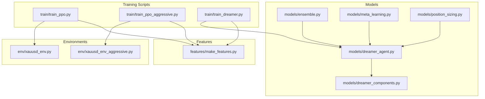
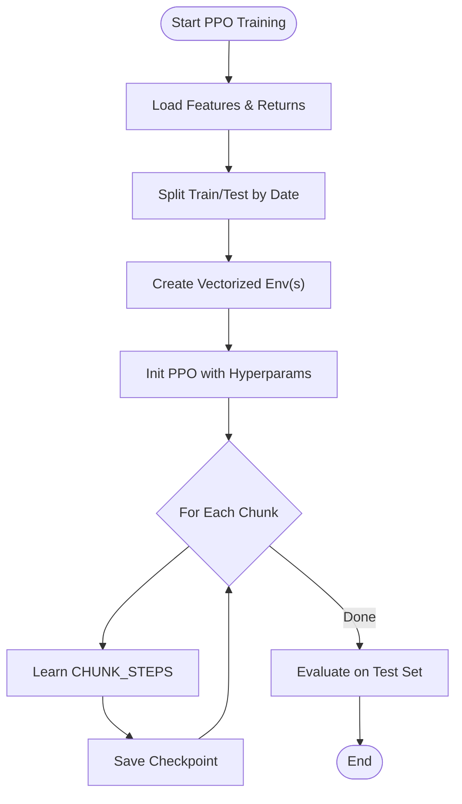
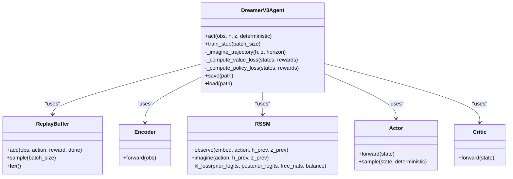
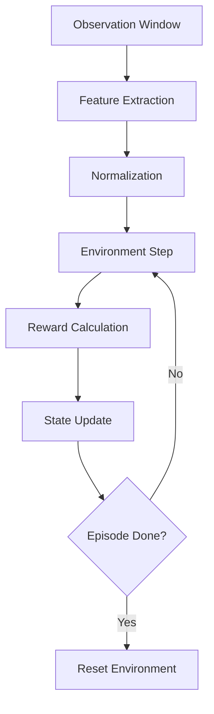
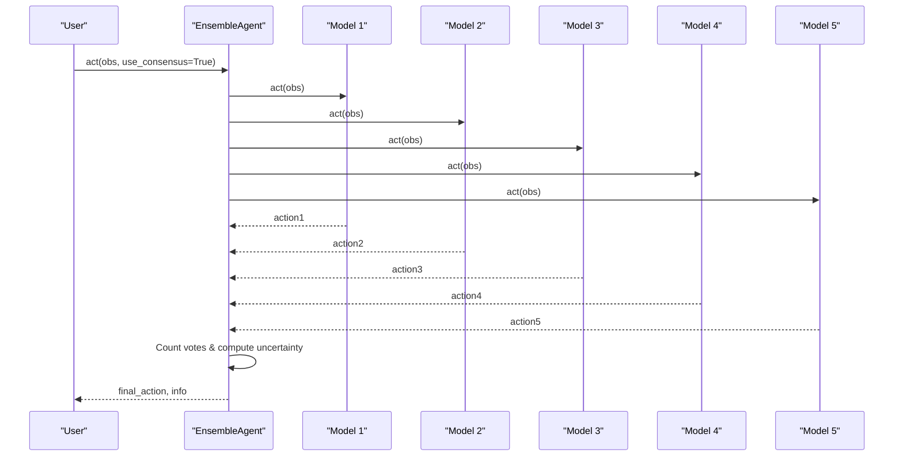
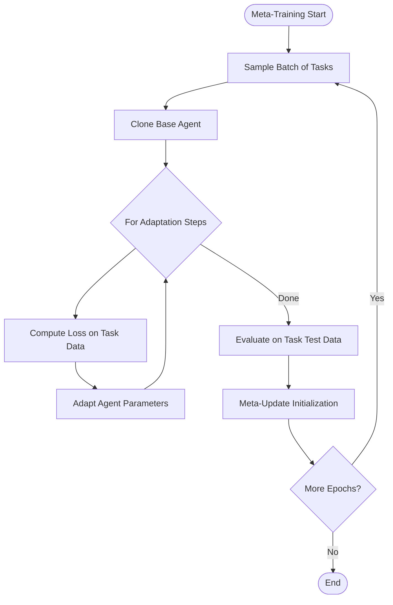
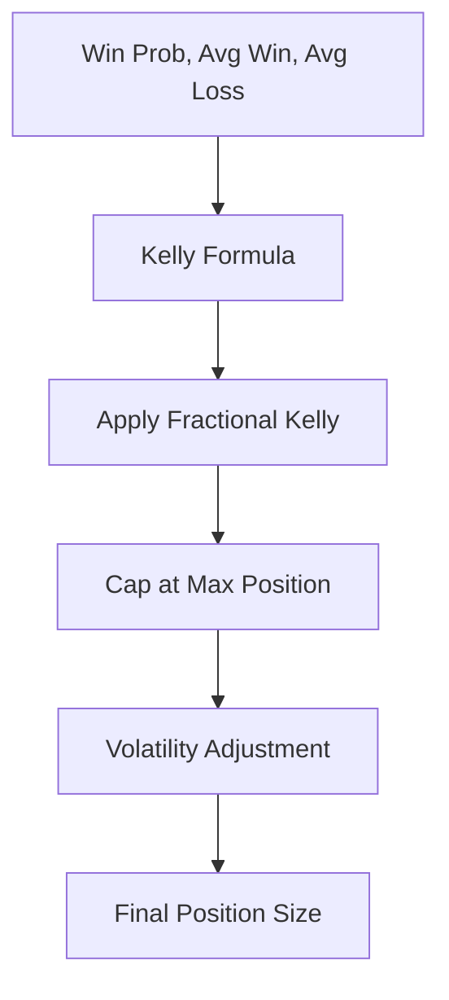
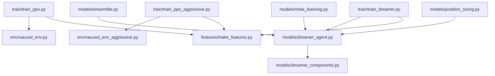

# Training Hyperparameters & Configuration

<cite>
**Referenced Files in This Document**
- [train/train_ppo.py](file://train/train_ppo.py)
- [train/train_dreamer.py](file://train/train_dreamer.py)
- [models/dreamer_agent.py](file://models/dreamer_agent.py)
- [models/dreamer_components.py](file://models/dreamer_components.py)
- [env/xauusd_env.py](file://env/xauusd_env.py)
- [env/xauusd_env_aggressive.py](file://env/xauusd_env_aggressive.py)
- [features/make_features.py](file://features/make_features.py)
- [models/ensemble.py](file://models/ensemble.py)
- [models/meta_learning.py](file://models/meta_learning.py)
- [models/position_sizing.py](file://models/position_sizing.py)
</cite>

## Table of Contents
1. [Introduction](#introduction)
2. [Project Structure](#project-structure)
3. [Core Components](#core-components)
4. [Architecture Overview](#architecture-overview)
5. [Detailed Component Analysis](#detailed-component-analysis)
6. [Dependency Analysis](#dependency-analysis)
7. [Performance Considerations](#performance-considerations)
8. [Troubleshooting Guide](#troubleshooting-guide)
9. [Conclusion](#conclusion)
10. [Appendices](#appendices)

## Introduction
This document provides a comprehensive guide to training hyperparameters and configuration options for the supported algorithms (PPO and Dreamer V3), environment-specific parameters, ensemble training configurations, meta-learning parameters, and position sizing hyperparameters. It also includes guidance on monitoring strategies, computational resource requirements, and scaling considerations for large-scale experiments.

## Project Structure
The repository organizes training scripts under train/, models for agent implementations, env for environments, features for data processing, and utilities for ensemble, meta-learning, and position sizing. The key entry points are:
- PPO training: train/train_ppo.py and train/train_ppo_aggressive.py
- Dreamer V3 training: train/train_dreamer.py
- Environments: env/xauusd_env.py and env/xauusd_env_aggressive.py
- Feature pipeline: features/make_features.py
- Agent components: models/dreamer_agent.py and models/dreamer_components.py
- Ensemble: models/ensemble.py
- Meta-learning: models/meta_learning.py
- Position sizing: models/position_sizing.py



**Diagram sources**
- [train/train_ppo.py:1-93](file://train/train_ppo.py#L1-L93)
- [train/train_dreamer.py:1-331](file://train/train_dreamer.py#L1-L331)
- [models/dreamer_agent.py:1-460](file://models/dreamer_agent.py#L1-L460)
- [models/dreamer_components.py:1-338](file://models/dreamer_components.py#L1-L338)
- [env/xauusd_env.py:1-118](file://env/xauusd_env.py#L1-L118)
- [env/xauusd_env_aggressive.py:1-144](file://env/xauusd_env_aggressive.py#L1-L144)
- [features/make_features.py:1-83](file://features/make_features.py#L1-L83)
- [models/ensemble.py:1-290](file://models/ensemble.py#L1-L290)
- [models/meta_learning.py:1-345](file://models/meta_learning.py#L1-L345)
- [models/position_sizing.py:1-399](file://models/position_sizing.py#L1-L399)

**Section sources**
- [train/train_ppo.py:1-93](file://train/train_ppo.py#L1-L93)
- [train/train_dreamer.py:1-331](file://train/train_dreamer.py#L1-L331)
- [models/dreamer_agent.py:1-460](file://models/dreamer_agent.py#L1-L460)
- [models/dreamer_components.py:1-338](file://models/dreamer_components.py#L1-L338)
- [env/xauusd_env.py:1-118](file://env/xauusd_env.py#L1-L118)
- [env/xauusd_env_aggressive.py:1-144](file://env/xauusd_env_aggressive.py#L1-L144)
- [features/make_features.py:1-83](file://features/make_features.py#L1-L83)
- [models/ensemble.py:1-290](file://models/ensemble.py#L1-L290)
- [models/meta_learning.py:1-345](file://models/meta_learning.py#L1-L345)
- [models/position_sizing.py:1-399](file://models/position_sizing.py#L1-L399)

## Core Components
- PPO Training: Uses Stable Baselines3 PPO with vectorized environments; configurable batch size, learning rate, gamma, and chunked training schedule.
- Dreamer V3 Training: Implements world model learning (encoder, RSSM, decoder, reward predictor) and actor-critic policy optimization with imagination-based planning; supports device auto-detection and replay buffer prefilling.
- Environments: Discrete action spaces with observation windows; cost, penalties, leverage, and stop-loss controls; macro-aware features available.
- Feature Pipeline: Computes technical indicators and optional macro features; normalizes inputs; returns normalized feature matrix and log returns.
- Ensemble: Aggregates multiple agents with diversity via seeds and architecture variations; consensus-based decision making with uncertainty estimation.
- Meta-Learning: MAML-style framework for fast adaptation across market regimes; supports inner-loop adaptation and outer-loop meta-updates.
- Position Sizing: Kelly Criterion-based sizing with fractional Kelly, volatility adjustment, and ATR-based sizing; integrates with agent value estimates.

**Section sources**
- [train/train_ppo.py:25-67](file://train/train_ppo.py#L25-L67)
- [train/train_dreamer.py:128-208](file://train/train_dreamer.py#L128-L208)
- [env/xauusd_env.py:21-57](file://env/xauusd_env.py#L21-L57)
- [env/xauusd_env_aggressive.py:20-63](file://env/xauusd_env_aggressive.py#L20-L63)
- [features/make_features.py:18-78](file://features/make_features.py#L18-L78)
- [models/ensemble.py:27-130](file://models/ensemble.py#L27-L130)
- [models/meta_learning.py:32-115](file://models/meta_learning.py#L32-L115)
- [models/position_sizing.py:29-111](file://models/position_sizing.py#L29-L111)

## Architecture Overview
The system trains two primary algorithms:
- PPO: Policy gradient method with advantage estimation, using vectorized environments for parallel rollouts.
- Dreamer V3: Model-based RL that learns a world model to imagine trajectories and optimize policy via actor-critic updates.

```mermaid
sequenceDiagram
participant Train as "Training Script"
participant Env as "Environment"
participant Agent as "Agent"
participant Buffer as "Replay Buffer"
participant Opt as "Optimizers"
Train->>Env : reset()
loop Training Steps
Train->>Agent : act(obs)
Agent-->>Train : action
Train->>Env : step(action)
Env-->>Train : next_obs, reward, done
Train->>Buffer : add(obs, action, reward, done)
alt Every N steps
Train->>Agent : train_step(batch_size)
Agent->>Buffer : sample(batch_size)
Buffer-->>Agent : batch
Agent->>Opt : update world model + actor/critic
Opt-->>Agent : losses
end
end
```

**Diagram sources**
- [train/train_dreamer.py:214-287](file://train/train_dreamer.py#L214-L287)
- [models/dreamer_agent.py:190-304](file://models/dreamer_agent.py#L190-L304)
- [models/dreamer_agent.py:24-82](file://models/dreamer_agent.py#L24-L82)

**Section sources**
- [train/train_dreamer.py:128-331](file://train/train_dreamer.py#L128-L331)
- [models/dreamer_agent.py:84-460](file://models/dreamer_agent.py#L84-L460)

## Detailed Component Analysis

### PPO Hyperparameters and Configuration
- Learning Rate: 3e-4
- Batch Size: 256 (standard), 512 (aggressive variant)
- Gamma: 0.99
- n_steps: 1024 (standard), 2048 (aggressive)
- Entropy Coefficient: 0.01 (aggressive variant)
- Chunked Training: 50,000 steps per chunk, 10 chunks total
- Environment Parallelism: 8 or 16 SubprocVecEnv instances
- Observation Window: 64 (standard), 120 (aggressive)
- Cost Per Trade: 0.0001 (standard), 0.0002 (aggressive)
- Max Episode Steps: 20,000 (standard), 5,000 (aggressive)



**Diagram sources**
- [train/train_ppo.py:25-67](file://train/train_ppo.py#L25-L67)
- [train/train_ppo_aggressive.py:25-84](file://train/train_ppo_aggressive.py#L25-L84)

**Section sources**
- [train/train_ppo.py:11-67](file://train/train_ppo.py#L11-L67)
- [train/train_ppo_aggressive.py:11-84](file://train/train_ppo_aggressive.py#L11-L84)

### Dreamer V3 Hyperparameters and Configuration
- Architecture:
  - Embed Dim: 256
  - Hidden Dim: 512
  - Stochastic Dim: 32
  - Num Categories: 32
- Optimization:
  - World Model LR: 3e-4
  - Actor LR: 1e-4
  - Critic LR: 3e-4
  - Gradient Clipping: max_norm=100.0 (world model, actor, critic)
- Training:
  - Batch Size: 16 (default), recommended 64 for GPU
  - Prefill Steps: 5,000 (random exploration)
  - Train Steps: 100,000
  - Train Every: 4 environment steps
  - Save Every: 10,000 steps
- Discount Factor: gamma=0.99
- GAE Lambda: lambda_=0.95
- Imagination Horizon: horizon=15
- KL Regularization: free_nats=1.0, kl_balance=0.8



**Diagram sources**
- [models/dreamer_agent.py:84-147](file://models/dreamer_agent.py#L84-L147)
- [models/dreamer_agent.py:148-189](file://models/dreamer_agent.py#L148-L189)
- [models/dreamer_agent.py:190-304](file://models/dreamer_agent.py#L190-L304)
- [models/dreamer_components.py:71-205](file://models/dreamer_components.py#L71-L205)
- [models/dreamer_components.py:246-294](file://models/dreamer_components.py#L246-L294)

**Section sources**
- [train/train_dreamer.py:21-34](file://train/train_dreamer.py#L21-L34)
- [train/train_dreamer.py:194-208](file://train/train_dreamer.py#L194-L208)
- [models/dreamer_agent.py:91-147](file://models/dreamer_agent.py#L91-L147)
- [models/dreamer_agent.py:256-293](file://models/dreamer_agent.py#L256-L293)
- [models/dreamer_components.py:188-205](file://models/dreamer_components.py#L188-L205)

### Environment-Specific Parameters
- Observation Window Sizes:
  - Standard: 64
  - Aggressive: 120–128
- Action Spaces:
  - Standard: Discrete(2) [Flat, Long]
  - Aggressive: Discrete(3) [Short, Flat, Long]
- Reward Scaling Factors:
  - Cost per trade: 0.0001–0.0002
  - Turnover penalty: 0.0–0.0002
  - Flat penalty: 0.0–0.00002
  - Hold bonus: 0.0–0.00002
  - Leverage: 1.0 (configurable)
  - Stop loss percentage: 0.0–0.001
- Macro Features: Optional inclusion of DXY, SPX, US10Y returns and correlations



**Diagram sources**
- [env/xauusd_env.py:65-117](file://env/xauusd_env.py#L65-L117)
- [env/xauusd_env_aggressive.py:73-143](file://env/xauusd_env_aggressive.py#L73-L143)
- [features/make_features.py:18-78](file://features/make_features.py#L18-L78)

**Section sources**
- [env/xauusd_env.py:21-57](file://env/xauusd_env.py#L21-L57)
- [env/xauusd_env_aggressive.py:20-63](file://env/xauusd_env_aggressive.py#L20-L63)
- [features/make_features.py:41-62](file://features/make_features.py#L41-L62)

### Ensemble Training Configurations
- Number of Models: 5 (default)
- Diversity Strategy: Different random seeds and slight architecture variations (hidden_dim offset)
- Consensus Threshold: Minimum agreeing models (default: 3/5)
- Uncertainty Estimation: Entropy over action distribution from models
- Training: Sequential training of each model with same hyperparameters



**Diagram sources**
- [models/ensemble.py:67-130](file://models/ensemble.py#L67-L130)

**Section sources**
- [models/ensemble.py:27-130](file://models/ensemble.py#L27-L130)

### Meta-Learning Parameters
- Meta Learning Rate: 1e-3
- Adaptation Learning Rate: 1e-2
- Adaptation Steps: 5
- Market Regimes: Trending, Ranging, High Volatility, Low Volatility, Crash Recovery
- Inner Loop: Few-shot adaptation on task-specific data
- Outer Loop: Meta-update across sampled tasks



**Diagram sources**
- [models/meta_learning.py:66-115](file://models/meta_learning.py#L66-L115)

**Section sources**
- [models/meta_learning.py:32-115](file://models/meta_learning.py#L32-L115)

### Position Sizing Hyperparameters
- Kelly Criterion:
  - Fractional Kelly: 0.25 (quarter Kelly recommended)
  - Maximum Position: 0.10 (10% cap)
  - Win Probability: Estimated from agent value differences
  - Average Win/Loss: Updated from trade history
- Volatility Adjustment: Inverse scaling based on current vs normal volatility
- ATR-Based Sizing: Account risk % and ATR multiplier for stop distance



**Diagram sources**
- [models/position_sizing.py:66-111](file://models/position_sizing.py#L66-L111)
- [models/position_sizing.py:189-216](file://models/position_sizing.py#L189-L216)

**Section sources**
- [models/position_sizing.py:29-111](file://models/position_sizing.py#L29-L111)
- [models/position_sizing.py:189-216](file://models/position_sizing.py#L189-L216)

## Dependency Analysis
The training scripts depend on environments and feature pipelines, while models encapsulate algorithm logic. Ensemble and meta-learning modules wrap base agents for advanced configurations.



**Diagram sources**
- [train/train_ppo.py:1-93](file://train/train_ppo.py#L1-L93)
- [train/train_dreamer.py:1-331](file://train/train_dreamer.py#L1-L331)
- [models/dreamer_agent.py:1-460](file://models/dreamer_agent.py#L1-L460)
- [models/dreamer_components.py:1-338](file://models/dreamer_components.py#L1-L338)
- [env/xauusd_env.py:1-118](file://env/xauusd_env.py#L1-L118)
- [env/xauusd_env_aggressive.py:1-144](file://env/xauusd_env_aggressive.py#L1-L144)
- [features/make_features.py:1-83](file://features/make_features.py#L1-L83)
- [models/ensemble.py:1-290](file://models/ensemble.py#L1-L290)
- [models/meta_learning.py:1-345](file://models/meta_learning.py#L1-L345)
- [models/position_sizing.py:1-399](file://models/position_sizing.py#L1-L399)

**Section sources**
- [train/train_ppo.py:1-93](file://train/train_ppo.py#L1-L93)
- [train/train_dreamer.py:1-331](file://train/train_dreamer.py#L1-L331)
- [models/dreamer_agent.py:1-460](file://models/dreamer_agent.py#L1-L460)
- [models/dreamer_components.py:1-338](file://models/dreamer_components.py#L1-L338)
- [env/xauusd_env.py:1-118](file://env/xauusd_env.py#L1-L118)
- [env/xauusd_env_aggressive.py:1-144](file://env/xauusd_env_aggressive.py#L1-L144)
- [features/make_features.py:1-83](file://features/make_features.py#L1-L83)
- [models/ensemble.py:1-290](file://models/ensemble.py#L1-L290)
- [models/meta_learning.py:1-345](file://models/meta_learning.py#L1-L345)
- [models/position_sizing.py:1-399](file://models/position_sizing.py#L1-L399)

## Performance Considerations
- Computational Resources:
  - CPU: Suitable for small experiments; Dreamer V3 may be slow without GPU acceleration.
  - GPU: Recommended for Dreamer V3; batch size can be increased to 64 for better throughput.
  - MPS: Apple Metal support available for Mac users.
- Memory Usage:
  - Replay Buffer: Capacity 100,000 transitions; sequence length 64 for sampling.
  - Model Size: Depends on hidden dimensions; larger models increase memory usage.
- Scaling Considerations:
  - Parallel Environments: Use SubprocVecEnv for PPO; adjust N_ENVS based on hardware.
  - Chunked Training: Break long runs into manageable chunks with checkpoints.
  - Mixed Precision: Not implemented; could be added for efficiency.

[No sources needed since this section provides general guidance]

## Troubleshooting Guide
- Overfitting Detection:
  - Monitor training vs test performance gaps.
  - Use ensemble disagreement as uncertainty measure.
  - Reduce model complexity or increase regularization.
- Underfitting Detection:
  - High bias in both train and test sets.
  - Increase model capacity or training duration.
  - Adjust learning rates and batch sizes.
- Gradient Issues:
  - Gradient clipping prevents explosion (max_norm=100.0).
  - Monitor loss curves for stability.
- Environment Issues:
  - Ensure correct observation window and feature normalization.
  - Verify action space compatibility with agent output.

**Section sources**
- [models/dreamer_agent.py:256-293](file://models/dreamer_agent.py#L256-L293)
- [models/ensemble.py:132-154](file://models/ensemble.py#L132-L154)
- [features/make_features.py:73-78](file://features/make_features.py#L73-L78)

## Conclusion
This document outlined the hyperparameters and configurations for PPO and Dreamer V3 training, including environment settings, ensemble and meta-learning options, and position sizing strategies. By understanding these components, practitioners can effectively tune and scale their trading algorithms for different market conditions while monitoring for overfitting and underfitting.

[No sources needed since this section summarizes without analyzing specific files]

## Appendices
- Example Hyperparameter Ranges:
  - PPO: Learning rate 1e-4 to 1e-3, batch size 128–512, gamma 0.99–0.999
  - Dreamer V3: Embed dim 128–512, hidden dim 256–1024, batch size 16–64
- Automated Tuning Workflows:
  - Use grid search or Bayesian optimization over key hyperparameters.
  - Validate on out-of-sample data to prevent overfitting.
- Monitoring Strategies:
  - Track equity curves, drawdowns, and Sharpe ratios.
  - Log loss components for Dreamer V3 (reconstruction, reward, KL, value, policy).

[No sources needed since this section provides general guidance]