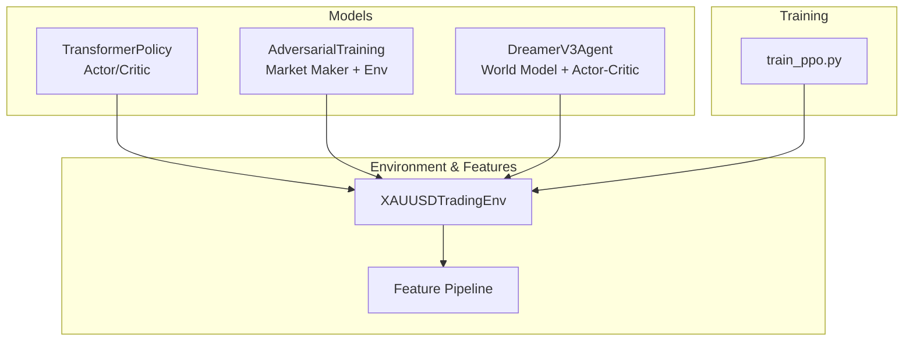
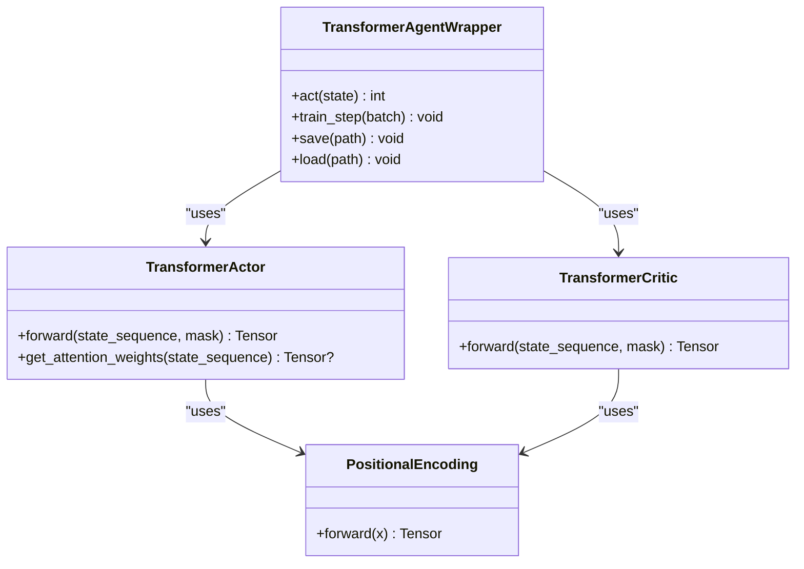
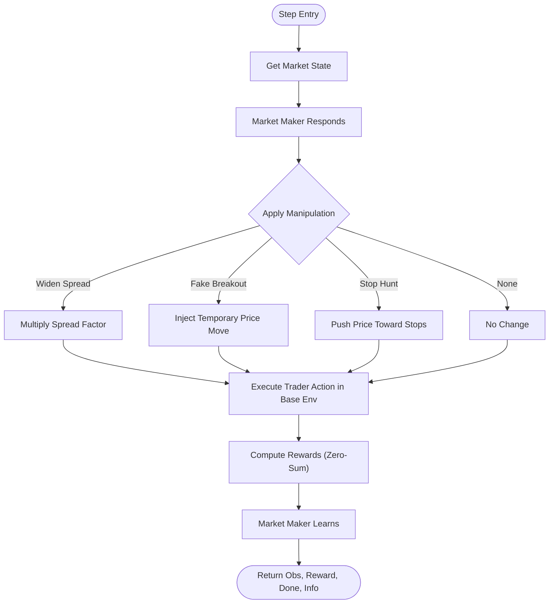
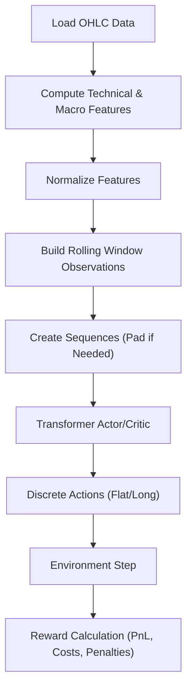
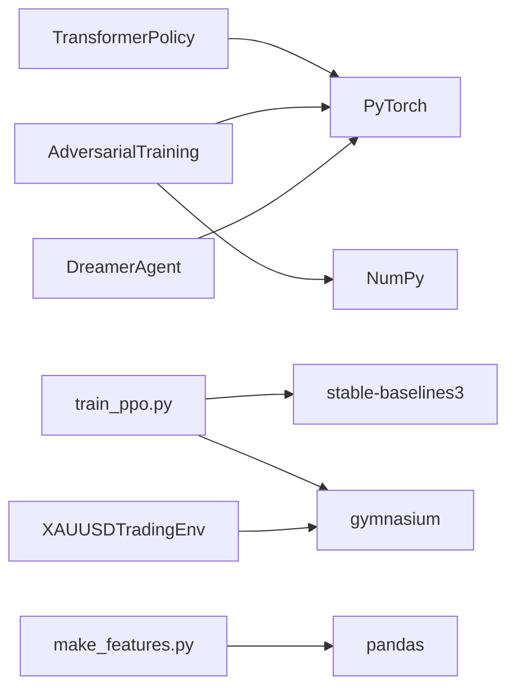

# Transformer Policy API

<cite>
**Referenced Files in This Document**
- [transformer_policy.py](file://models/transformer_policy.py)
- [adversarial_training.py](file://models/adversarial_training.py)
- [dreamer_agent.py](file://models/dreamer_agent.py)
- [train_ppo.py](file://train/train_ppo.py)
- [xauusd_env.py](file://env/xauusd_env.py)
- [make_features.py](file://features/make_features.py)
</cite>

## Table of Contents
1. [Introduction](#introduction)
2. [Project Structure](#project-structure)
3. [Core Components](#core-components)
4. [Architecture Overview](#architecture-overview)
5. [Detailed Component Analysis](#detailed-component-analysis)
6. [Dependency Analysis](#dependency-analysis)
7. [Performance Considerations](#performance-considerations)
8. [Troubleshooting Guide](#troubleshooting-guide)
9. [Conclusion](#conclusion)
10. [Appendices](#appendices)

## Introduction
This document provides comprehensive API documentation for transformer-based policy networks and adversarial training capabilities in the trading system. It covers:
- Transformer policy architecture with attention mechanisms, positional encoding, and sequence processing for temporal market data
- Integration with reinforcement learning algorithms through standardized policy interfaces
- Adversarial training features to improve robustness against market perturbations and noise
- Configuration examples for transformer layers, attention heads, sequence lengths, and adversarial perturbation strengths
- Performance optimization techniques for transformer inference, memory management for long sequences, and compatibility with different RL algorithms
- Guidance on when to use transformer policies versus traditional MLP policies and their trade-offs

## Project Structure
The repository organizes transformer policies and adversarial training under models, integrates with environments and feature pipelines, and includes training scripts for RL algorithms.



**Diagram sources**
- [transformer_policy.py:67-153](file://models/transformer_policy.py#L67-L153)
- [adversarial_training.py:223-356](file://models/adversarial_training.py#L223-L356)
- [dreamer_agent.py:84-190](file://models/dreamer_agent.py#L84-L190)
- [xauusd_env.py:7-118](file://env/xauusd_env.py#L7-L118)
- [make_features.py:18-83](file://features/make_features.py#L18-L83)
- [train_ppo.py:25-93](file://train/train_ppo.py#L25-L93)

**Section sources**
- [transformer_policy.py:1-442](file://models/transformer_policy.py#L1-L442)
- [adversarial_training.py:1-556](file://models/adversarial_training.py#L1-L556)
- [dreamer_agent.py:1-460](file://models/dreamer_agent.py#L1-L460)
- [xauusd_env.py:1-118](file://env/xauusd_env.py#L1-L118)
- [make_features.py:1-83](file://features/make_features.py#L1-L83)
- [train_ppo.py:1-93](file://train/train_ppo.py#L1-L93)

## Core Components
- Transformer Actor and Critic: Sequence-aware policy and value networks using self-attention over historical states
- Positional Encoding: Sinusoidal encodings to inject temporal order into state embeddings
- Transformer Agent Wrapper: Maintains a sliding window of recent states and exposes an act() interface compatible with RL loops
- Adversarial Training: Market Maker agent that manipulates environment dynamics; Self-Play Trainer alternates between training Trader and Market Maker
- DreamerV3 Agent: World model-based RL agent with actor-critic trained via imagination; serves as a reference for standard policy interfaces
- Environment and Features: Discrete action space (flat/long), reward shaping, and feature engineering pipeline producing normalized inputs

Key responsibilities:
- Transformer components process temporal sequences and produce actions or values
- Adversarial components simulate hostile market conditions to train robust policies
- Dreamer agent demonstrates a complete RL loop with world modeling and policy optimization
- Environment encapsulates trading dynamics and rewards; features prepare time-series inputs

**Section sources**
- [transformer_policy.py:34-153](file://models/transformer_policy.py#L34-L153)
- [transformer_policy.py:166-250](file://models/transformer_policy.py#L166-L250)
- [transformer_policy.py:252-373](file://models/transformer_policy.py#L252-L373)
- [adversarial_training.py:35-221](file://models/adversarial_training.py#L35-L221)
- [adversarial_training.py:223-356](file://models/adversarial_training.py#L223-L356)
- [dreamer_agent.py:84-190](file://models/dreamer_agent.py#L84-L190)
- [xauusd_env.py:7-118](file://env/xauusd_env.py#L7-L118)
- [make_features.py:18-83](file://features/make_features.py#L18-L83)

## Architecture Overview
The system supports two primary policy architectures:
- Transformer-based Actor-Critic: Processes sequences of past states to capture temporal dependencies and relevant historical patterns
- DreamerV3-based Actor-Critic: Learns a world model and trains policy via imagined trajectories

Both integrate with the same environment interface and can be used within RL training loops.

```mermaid
sequenceDiagram
participant Env as "XAUUSDTradingEnv"
participant TP as "TransformerAgentWrapper"
participant Actor as "TransformerActor"
participant Critic as "TransformerCritic"
participant RL as "RL Trainer"
RL->>Env : reset()
loop Steps
RL->>TP : act(state)
TP->>Actor : forward(sequence)
Actor-->>TP : action_logits
TP-->>RL : action
RL->>Env : step(action)
Env-->>RL : obs, reward, done, info
RL->>TP : train_step(batch)
TP->>Critic : forward(sequence)
Critic-->>TP : value
TP-->>RL : losses
end
```

**Diagram sources**
- [transformer_policy.py:297-347](file://models/transformer_policy.py#L297-L347)
- [transformer_policy.py:125-153](file://models/transformer_policy.py#L125-L153)
- [transformer_policy.py:222-250](file://models/transformer_policy.py#L222-L250)
- [xauusd_env.py:70-118](file://env/xauusd_env.py#L70-L118)

## Detailed Component Analysis

### Transformer Policy Architecture
- PositionalEncoding: Adds sinusoidal positional information to embeddings to preserve sequence order
- TransformerActor: Embeds state sequences, applies positional encoding, runs through TransformerEncoder, and outputs action logits via a small feed-forward head
- TransformerCritic: Similar structure to Actor but outputs scalar value estimates
- TransformerAgentWrapper: Manages a sliding window buffer of states, constructs padded sequences, and exposes act() for inference; includes save/load utilities

Configuration parameters:
- state_dim: Input feature dimension per timestep
- action_dim: Number of discrete actions
- hidden_dim: Transformer embedding size (must be divisible by num_heads)
- num_heads: Attention heads
- num_layers: Stacked encoder layers
- seq_len: Maximum sequence length processed at once
- dropout: Regularization rate

Example configuration paths:
- Actor initialization: [transformer_policy.py:67-124](file://models/transformer_policy.py#L67-L124)
- Critic initialization: [transformer_policy.py:166-221](file://models/transformer_policy.py#L166-L221)
- Wrapper initialization and act(): [transformer_policy.py:252-347](file://models/transformer_policy.py#L252-L347)



**Diagram sources**
- [transformer_policy.py:34-65](file://models/transformer_policy.py#L34-L65)
- [transformer_policy.py:67-153](file://models/transformer_policy.py#L67-L153)
- [transformer_policy.py:166-250](file://models/transformer_policy.py#L166-L250)
- [transformer_policy.py:252-373](file://models/transformer_policy.py#L252-L373)

**Section sources**
- [transformer_policy.py:34-153](file://models/transformer_policy.py#L34-L153)
- [transformer_policy.py:166-250](file://models/transformer_policy.py#L166-L250)
- [transformer_policy.py:252-373](file://models/transformer_policy.py#L252-L373)

### Adversarial Training Capabilities
- MarketMakerAgent: Learns manipulation strategies (e.g., widen spreads, fake breakouts, stop hunts) based on detected trader patterns
- AdversarialTradingEnv: Wraps base environment to apply manipulations and returns zero-sum rewards between trader and market maker
- SelfPlayTrainer: Alternates training phases to improve both trader and market maker over epochs

Perturbation and manipulation controls:
- Manipulation types are discrete actions controlled by the Market Maker
- Spread widening multiplies spread factor
- Fake breakout injects temporary price moves
- Stop hunt pushes price toward common stop levels

Example configuration paths:
- Market Maker policy and respond(): [adversarial_training.py:35-117](file://models/adversarial_training.py#L35-L117)
- Pattern detection: [adversarial_training.py:119-194](file://models/adversarial_training.py#L119-L194)
- Adversarial environment step and manipulation application: [adversarial_training.py:223-356](file://models/adversarial_training.py#L223-L356)
- Self-play training loop: [adversarial_training.py:358-485](file://models/adversarial_training.py#L358-L485)



**Diagram sources**
- [adversarial_training.py:252-356](file://models/adversarial_training.py#L252-L356)

**Section sources**
- [adversarial_training.py:35-221](file://models/adversarial_training.py#L35-L221)
- [adversarial_training.py:223-356](file://models/adversarial_training.py#L223-L356)
- [adversarial_training.py:358-485](file://models/adversarial_training.py#L358-L485)

### Integration with Reinforcement Learning Algorithms
- Standardized policy interface: Both transformer and Dreamer agents expose act(obs) returning actions, enabling integration with RL trainers
- PPO integration example: Uses SubprocVecEnv and MlpPolicy; transformer policies can replace MLP policy by providing a compatible wrapper
- DreamerV3 agent: Implements world model learning and actor-critic training via imagination; demonstrates sequence handling and replay buffer usage

Integration points:
- Environment observation shape and action space must match policy expectations
- Feature pipeline produces normalized inputs suitable for transformer input embeddings
- RL trainers consume env.step() and call policy.act() each step

Example configuration paths:
- PPO training script: [train_ppo.py:25-93](file://train/train_ppo.py#L25-L93)
- DreamerV3 agent act(): [dreamer_agent.py:148-190](file://models/dreamer_agent.py#L148-L190)
- Replay buffer sampling sequences: [dreamer_agent.py:24-82](file://models/dreamer_agent.py#L24-L82)

```mermaid
sequenceDiagram
participant RL as "PPO Trainer"
participant Env as "XAUUSDTradingEnv"
participant Policy as "TransformerAgentWrapper"
participant Actor as "TransformerActor"
RL->>Env : reset()
loop Timesteps
RL->>Policy : act(obs)
Policy->>Actor : forward(sequence)
Actor-->>Policy : action_logits
Policy-->>RL : action
RL->>Env : step(action)
Env-->>RL : obs, reward, done, info
end
```

**Diagram sources**
- [train_ppo.py:46-67](file://train/train_ppo.py#L46-L67)
- [transformer_policy.py:297-347](file://models/transformer_policy.py#L297-L347)
- [transformer_policy.py:125-153](file://models/transformer_policy.py#L125-L153)
- [xauusd_env.py:70-118](file://env/xauusd_env.py#L70-L118)

**Section sources**
- [train_ppo.py:25-93](file://train/train_ppo.py#L25-L93)
- [dreamer_agent.py:24-82](file://models/dreamer_agent.py#L24-L82)
- [dreamer_agent.py:148-190](file://models/dreamer_agent.py#L148-L190)

### Data Flow and Sequence Processing
- Features: Compute technical indicators and macro correlations; normalize features for stable training
- Environment: Builds observations from rolling windows of features plus current position; applies costs and penalties to rewards
- Transformer: Consumes sequences of normalized features; uses last token representation for decision-making

Example configuration paths:
- Feature computation and normalization: [make_features.py:18-83](file://features/make_features.py#L18-L83)
- Observation construction and reward calculation: [xauusd_env.py:59-118](file://env/xauusd_env.py#L59-L118)
- Transformer sequence creation and padding: [transformer_policy.py:330-347](file://models/transformer_policy.py#L330-L347)



**Diagram sources**
- [make_features.py:18-83](file://features/make_features.py#L18-L83)
- [xauusd_env.py:59-118](file://env/xauusd_env.py#L59-L118)
- [transformer_policy.py:330-347](file://models/transformer_policy.py#L330-L347)

**Section sources**
- [make_features.py:18-83](file://features/make_features.py#L18-L83)
- [xauusd_env.py:59-118](file://env/xauusd_env.py#L59-L118)
- [transformer_policy.py:330-347](file://models/transformer_policy.py#L330-L347)

## Dependency Analysis
- TransformerPolicy depends on PyTorch modules for linear layers, positional encoding, and TransformerEncoder
- AdversarialTraining depends on numpy and torch for policy and environment manipulation
- DreamerAgent composes multiple submodules (encoder, RSSM, decoder, reward predictor, actor, critic)
- Training scripts depend on stable-baselines3 and gymnasium environments



**Diagram sources**
- [transformer_policy.py:24-31](file://models/transformer_policy.py#L24-L31)
- [adversarial_training.py:25-32](file://models/adversarial_training.py#L25-L32)
- [dreamer_agent.py:11-21](file://models/dreamer_agent.py#L11-L21)
- [train_ppo.py:1-9](file://train/train_ppo.py#L1-L9)
- [xauusd_env.py:1-5](file://env/xauusd_env.py#L1-L5)
- [make_features.py:1-5](file://features/make_features.py#L1-L5)

**Section sources**
- [transformer_policy.py:24-31](file://models/transformer_policy.py#L24-L31)
- [adversarial_training.py:25-32](file://models/adversarial_training.py#L25-L32)
- [dreamer_agent.py:11-21](file://models/dreamer_agent.py#L11-L21)
- [train_ppo.py:1-9](file://train/train_ppo.py#L1-L9)
- [xauusd_env.py:1-5](file://env/xauusd_env.py#L1-L5)
- [make_features.py:1-5](file://features/make_features.py#L1-L5)

## Performance Considerations
- Transformer inference optimization:
  - Use batch_first=True and pre-allocate tensors to reduce overhead
  - Cache positional encodings as buffers to avoid recomputation
  - Limit seq_len to necessary horizon to control memory usage
  - Employ gradient checkpointing during training if needed
- Memory management for long sequences:
  - Pad sequences efficiently and avoid unnecessary copies
  - Use sliding window buffers to bound memory footprint
  - Consider chunked processing for very long histories
- Compatibility with RL algorithms:
  - Ensure policy.act() returns discrete actions consistent with environment action spaces
  - Align sequence lengths with environment observation windows
  - For PPO, vectorize environments to parallelize rollouts

[No sources needed since this section provides general guidance]

## Troubleshooting Guide
Common issues and resolutions:
- Shape mismatches: Verify state_dim matches feature dimensions and seq_len aligns with window sizes
- Padding artifacts: Ensure masks or proper padding strategies are applied when sequences are shorter than max length
- Adversarial instability: Tune manipulation strengths and ensure zero-sum balance in self-play training
- Gradient explosion: Use gradient clipping in training loops (already present in Dreamer agent)
- Environment resets: Confirm reset methods return correct observation shapes and initial states

Relevant implementation references:
- Transformer sequence creation and padding: [transformer_policy.py:330-347](file://models/transformer_policy.py#L330-L347)
- Adversarial environment step and manipulation: [adversarial_training.py:252-356](file://models/adversarial_training.py#L252-L356)
- Dreamer gradient clipping: [dreamer_agent.py:256-263](file://models/dreamer_agent.py#L256-L263)

**Section sources**
- [transformer_policy.py:330-347](file://models/transformer_policy.py#L330-L347)
- [adversarial_training.py:252-356](file://models/adversarial_training.py#L252-L356)
- [dreamer_agent.py:256-263](file://models/dreamer_agent.py#L256-L263)

## Conclusion
The transformer-based policy network offers sequence-aware decision-making for trading by leveraging attention mechanisms and positional encoding to capture temporal dependencies. The adversarial training framework enhances robustness by simulating market manipulations, while the DreamerV3 agent demonstrates a complete RL approach with world modeling. Integrating these components with standardized policy interfaces enables compatibility across RL algorithms such as PPO. Careful configuration of transformer hyperparameters, sequence lengths, and adversarial perturbation strengths is essential for performance and stability.

[No sources needed since this section summarizes without analyzing specific files]

## Appendices

### Configuration Examples
- Transformer layers and attention heads:
  - hidden_dim, num_heads, num_layers, dropout: [transformer_policy.py:67-124](file://models/transformer_policy.py#L67-L124)
- Sequence lengths:
  - seq_len parameter and buffer management: [transformer_policy.py:252-347](file://models/transformer_policy.py#L252-L347)
- Adversarial perturbation strengths:
  - Spread widening, fake breakout magnitude, stop hunt behavior: [adversarial_training.py:299-340](file://models/adversarial_training.py#L299-L340)

### When to Use Transformer vs MLP Policies
- Use transformers when:
  - Temporal dependencies and historical pattern recognition are critical
  - Long-range context improves decision quality
  - Computational resources allow for sequence processing
- Use MLPs when:
  - Latency constraints are tight
  - Historical context is short or irrelevant
  - Simpler policies suffice for the task

Trade-offs:
- Transformers provide richer temporal modeling at higher computational cost
- MLPs are faster and more memory-efficient but lack explicit sequence awareness

[No sources needed since this section provides general guidance]