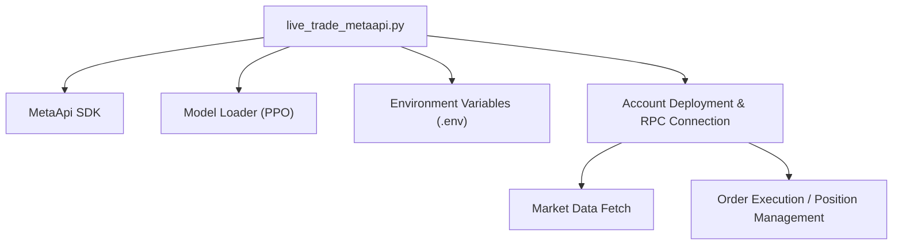
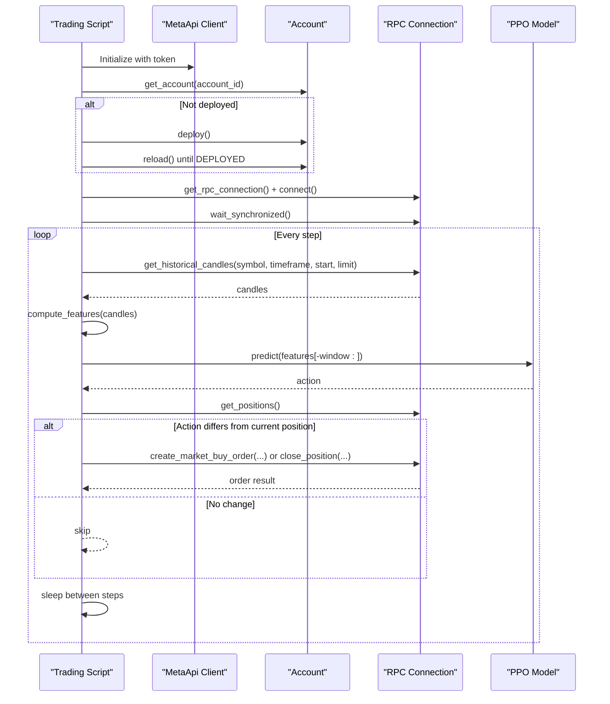
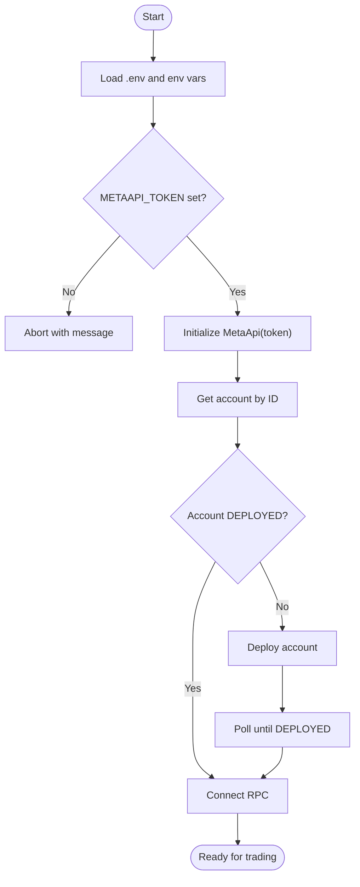
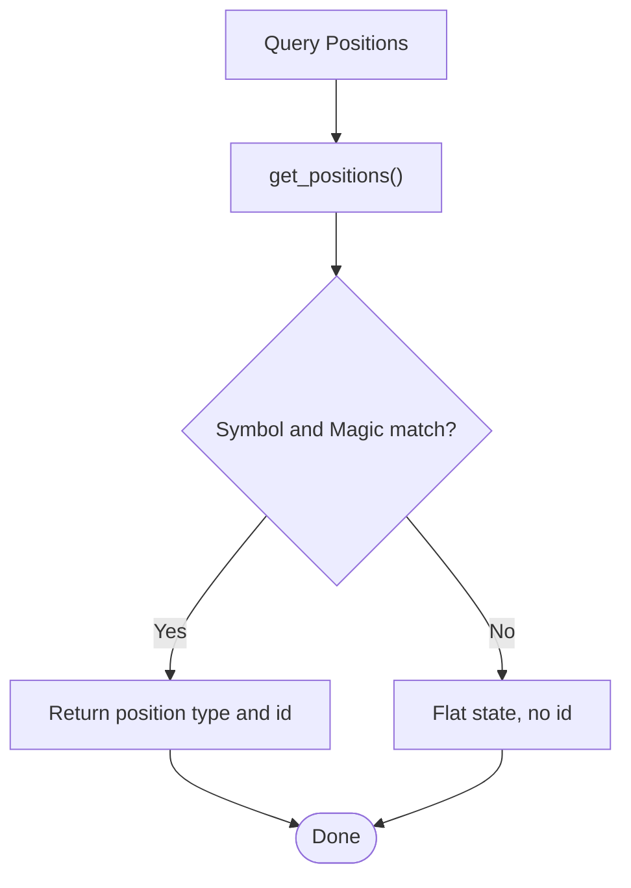
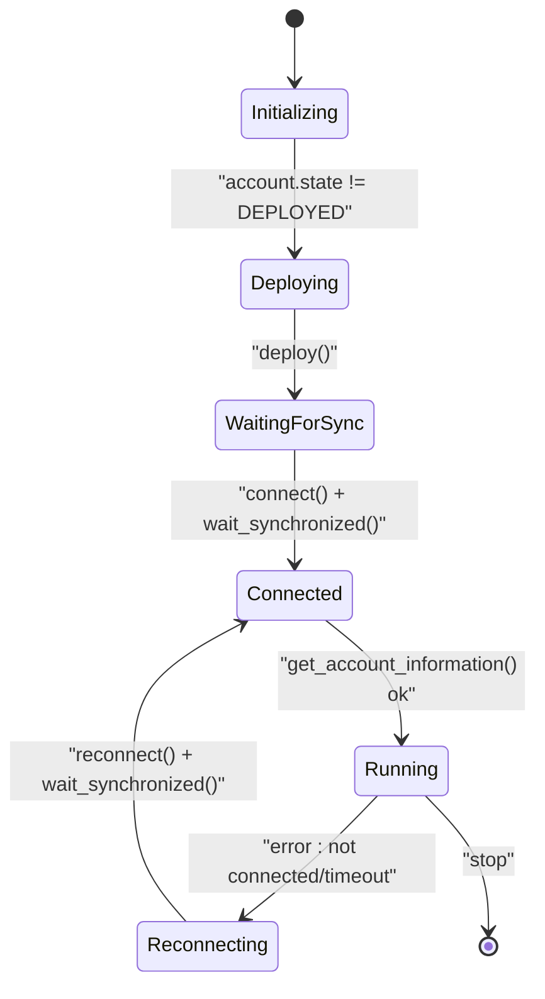
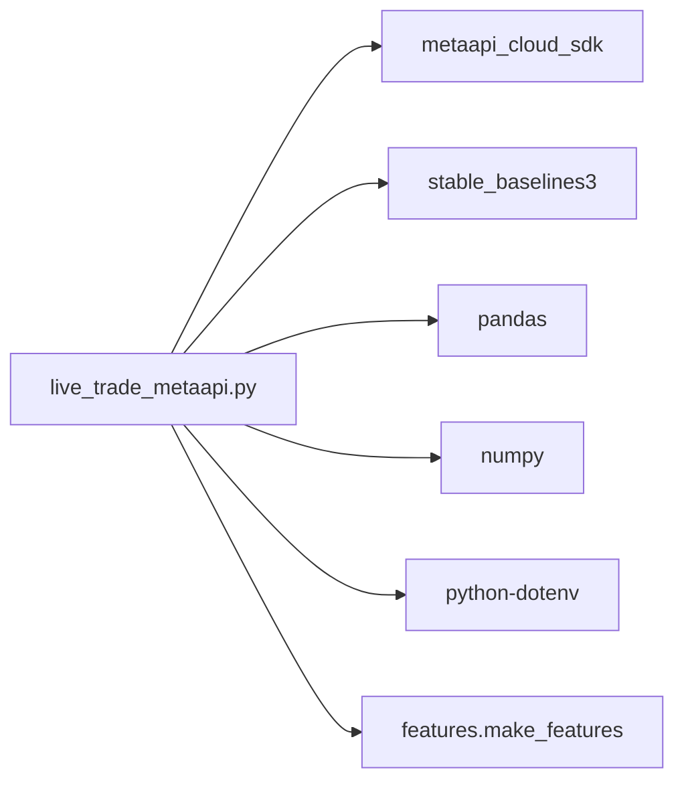

# MetaAPI Cloud Trading

<cite>
**Referenced Files in This Document**
- [live_trade_metaapi.py](file://live/live_trade_metaapi.py)
- [README.md](file://README.md)
- [SECURITY.md](file://SECURITY.md)
- [requirements.txt](file://requirements.txt)
</cite>

## Table of Contents
1. Introduction
2. Project Structure
3. Core Components
4. Architecture Overview
5. Detailed Component Analysis
6. Dependency Analysis
7. Performance Considerations
8. Troubleshooting Guide
9. Conclusion
10. Appendices

## Introduction
This document provides detailed API documentation for integrating cloud-based trading via MetaAPI within this project. It focuses on authentication, secure credential management, remote execution capabilities (asynchronous order placement and position management), error handling, session persistence, and performance best practices for reliable live trading. The implementation is centered around the MetaAPI Python SDK and an asynchronous trading loop that connects to a deployed MetaTrader account, fetches market data, computes features, runs a trained model, and executes orders remotely.

## Project Structure
The MetaAPI integration lives under the live trading module and uses environment variables for credentials. Key files:
- live/live_trade_metaapi.py: Main entry point for MetaAPI cloud trading, including initialization, deployment, connection, data fetching, feature computation, model inference, and order execution.
- README.md: High-level overview, setup instructions, and quick start guidance for both MT5 and MetaAPI modes.
- SECURITY.md: Security policy covering API key storage, environment variables, rotation, and production hardening.
- requirements.txt: Dependencies list; note that the MetaAPI SDK is imported but not explicitly listed here.



**Diagram sources**
- [live_trade_metaapi.py:1-231](file://live/live_trade_metaapi.py#L1-L231)

**Section sources**
- [live_trade_metaapi.py:1-231](file://live/live_trade_metaapi.py#L1-L231)
- [README.md:135-148](file://README.md#L135-L148)
- [SECURITY.md:1-167](file://SECURITY.md#L1-L167)
- [requirements.txt:1-29](file://requirements.txt#L1-L29)

## Core Components
- Authentication and Account Setup
  - Credentials are loaded from environment variables using python-dotenv.
  - The MetaApi client is initialized with the token, then the target account is retrieved by ID.
  - If the account is not deployed, it is deployed and polled until ready.
- Remote Execution
  - An RPC connection is obtained from the account and connected synchronously after async setup.
  - Market data is fetched asynchronously with timeouts and retries.
  - Orders are placed and positions closed asynchronously with error handling.
- Model Integration
  - A pre-trained PPO model is loaded and used to predict actions deterministically.
- Loop and Resilience
  - The main loop wraps each step with timeouts and handles reconnection on network issues.

**Section sources**
- [live_trade_metaapi.py:23-39](file://live/live_trade_metaapi.py#L23-L39)
- [live_trade_metaapi.py:40-86](file://live/live_trade_metaapi.py#L40-L86)
- [live_trade_metaapi.py:88-134](file://live/live_trade_metaapi.py#L88-L134)
- [live_trade_metaapi.py:135-231](file://live/live_trade_metaapi.py#L135-L231)

## Architecture Overview
The system follows an event-driven, asynchronous architecture:
- Initialization loads credentials, creates the MetaApi client, retrieves and deploys the account if needed, and establishes an RPC connection.
- Each loop iteration fetches historical candles, computes features, infers an action from the model, checks current position, and executes orders or closes positions as needed.
- Robustness is achieved through timeouts, retries, and automatic reconnection logic.



**Diagram sources**
- [live_trade_metaapi.py:135-231](file://live/live_trade_metaapi.py#L135-L231)
- [live_trade_metaapi.py:40-86](file://live/live_trade_metaapi.py#L40-L86)
- [live_trade_metaapi.py:88-134](file://live/live_trade_metaapi.py#L88-L134)

## Detailed Component Analysis

### Authentication and Secure Credential Management
- Environment-based secrets:
  - METAAPI_TOKEN and METAAPI_ACCOUNT_ID are read from environment variables via dotenv.
  - The script guards against missing credentials and exits early if defaults are present.
- Best practices:
  - Store secrets in .env locally and in platform-specific secret managers in production.
  - Restrict file permissions on .env and avoid committing secrets.
  - Rotate keys immediately if compromised and use separate keys for test vs production.



**Diagram sources**
- [live_trade_metaapi.py:23-39](file://live/live_trade_metaapi.py#L23-L39)
- [live_trade_metaapi.py:135-176](file://live/live_trade_metaapi.py#L135-L176)

**Section sources**
- [live_trade_metaapi.py:23-39](file://live/live_trade_metaapi.py#L23-L39)
- [SECURITY.md:1-167](file://SECURITY.md#L1-L167)
- [README.md:264-292](file://README.md#L264-L292)

### Remote Execution: Asynchronous Order Placement and Response Handling
- Data fetching:
  - Uses asyncio.wait_for with a timeout to retrieve historical candles.
  - Implements retry logic for empty responses and exceptions.
- Position awareness:
  - Queries current positions and filters by symbol and magic number.
- Order execution:
  - Opens long positions with create_market_buy_order when action indicates long and no position exists.
  - Closes positions with close_position when action indicates flat and a long position exists.
- Error handling:
  - Try/except blocks around order calls print failures without crashing the loop.

```mermaid
sequenceDiagram
participant Loop as "Main Loop"
participant Conn as "RPC Connection"
participant Model as "PPO Model"
Loop->>Conn : get_historical_candles(...)
Conn-->>Loop : candles
Loop->>Loop : compute_features(candles)
Loop->>Model : predict(obs)
Model-->>Loop : action
Loop->>Conn : get_positions()
alt Open Long
Loop->>Conn : create_market_buy_order(symbol, volume, options={magic})
Conn-->>Loop : orderId
else Close Long
Loop->>Conn : close_position(pos_id, options={})
Conn-->>Loop : orderId
else No Change
Loop-->>Loop : continue
end
```

**Diagram sources**
- [live_trade_metaapi.py:40-86](file://live/live_trade_metaapi.py#L40-L86)
- [live_trade_metaapi.py:88-134](file://live/live_trade_metaapi.py#L88-L134)

**Section sources**
- [live_trade_metaapi.py:40-86](file://live/live_trade_metaapi.py#L40-L86)
- [live_trade_metaapi.py:88-134](file://live/live_trade_metaapi.py#L88-L134)

### Position Management APIs
- Querying positions:
  - Retrieves all positions and filters by symbol and magic number to determine current exposure.
- Closing positions:
  - Closes a specific position by ID returned from previous operations.
- Monitoring account status:
  - Periodically tests connectivity by calling get_account_information with a timeout.



**Diagram sources**
- [live_trade_metaapi.py:88-99](file://live/live_trade_metaapi.py#L88-L99)

**Section sources**
- [live_trade_metaapi.py:88-99](file://live/live_trade_metaapi.py#L88-L99)
- [live_trade_metaapi.py:182-197](file://live/live_trade_metaapi.py#L182-L197)

### Session Persistence and Reconnection
- Deployment lifecycle:
  - Ensures the account is deployed before connecting; polls until DEPLOYED.
- Connection stabilization:
  - Waits for synchronization and adds delays to stabilize subscriptions.
- Reconnect logic:
  - Detects “not connected” or timeout errors and attempts to reconnect with backoff.



**Diagram sources**
- [live_trade_metaapi.py:135-180](file://live/live_trade_metaapi.py#L135-L180)
- [live_trade_metaapi.py:202-220](file://live/live_trade_metaapi.py#L202-L220)

**Section sources**
- [live_trade_metaapi.py:135-180](file://live/live_trade_metaapi.py#L135-L180)
- [live_trade_metaapi.py:202-220](file://live/live_trade_metaapi.py#L202-L220)

## Dependency Analysis
- External libraries:
  - metaapi_cloud_sdk: Provides MetaApi client, account management, and RPC connection methods used throughout the script.
  - stable_baselines3: Loads and runs the PPO model for decision making.
  - pandas/numpy: Data processing and feature preparation.
  - python-dotenv: Loads environment variables for secure configuration.
- Local modules:
  - features.make_features.compute_features: Computes indicators and signals used as model input.



**Diagram sources**
- [live_trade_metaapi.py:1-10](file://live/live_trade_metaapi.py#L1-L10)
- [requirements.txt:1-29](file://requirements.txt#L1-L29)

**Section sources**
- [live_trade_metaapi.py:1-10](file://live/live_trade_metaapi.py#L1-L10)
- [requirements.txt:1-29](file://requirements.txt#L1-L29)

## Performance Considerations
- Network efficiency:
  - Use asyncio.wait_for to prevent blocking on slow network calls.
  - Implement retries with short backoffs for transient failures.
- Data pipeline:
  - Fetch sufficient history for feature normalization; sort and reset index to ensure consistent ordering.
- Execution cadence:
  - Sleep between steps to avoid excessive API calls and respect rate limits.
- Resource usage:
  - Keep feature windows bounded to reduce memory footprint.
- Reliability:
  - Wrap critical operations in try/except to maintain loop continuity.
  - Reconnect automatically on detected network issues.

[No sources needed since this section provides general guidance]

## Troubleshooting Guide
Common issues and resolutions:
- Missing credentials:
  - Ensure METAAPI_TOKEN and METAAPI_ACCOUNT_ID are set in the environment; the script will abort if defaults are detected.
- Account not deployed:
  - The script auto-deploys and polls until DEPLOYED; verify region and broker connectivity if deployment stalls.
- Connection failures:
  - The loop detects “not connected” or timeout errors and attempts reconnection; check network stability and firewall rules.
- Data fetch timeouts:
  - Historical candle retrieval includes timeouts and retries; increase timeouts or adjust limits if necessary.
- Order execution errors:
  - Errors are caught and logged; verify symbol availability, lot sizes, and margin requirements.

**Section sources**
- [live_trade_metaapi.py:135-139](file://live/live_trade_metaapi.py#L135-L139)
- [live_trade_metaapi.py:153-166](file://live/live_trade_metaapi.py#L153-L166)
- [live_trade_metaapi.py:182-197](file://live/live_trade_metaapi.py#L182-L197)
- [live_trade_metaapi.py:202-220](file://live/live_trade_metaapi.py#L202-L220)

## Conclusion
This MetaAPI integration demonstrates a robust, asynchronous approach to cloud-based trading. It emphasizes secure credential handling, resilient connections, and clear separation between data ingestion, model inference, and order execution. By following the security guidelines and leveraging the built-in retry and reconnection logic, users can operate reliably in production environments while maintaining control over risk and performance.

[No sources needed since this section summarizes without analyzing specific files]

## Appendices

### Practical Examples

- Authenticate with MetaAPI
  - Set METAAPI_TOKEN and METAAPI_ACCOUNT_ID in your environment or .env file.
  - Initialize the MetaApi client with the token and retrieve the account by ID.
  - Deploy the account if not already deployed and establish an RPC connection.

- Handle API rate limits and throttling
  - Use asyncio.wait_for to enforce timeouts on API calls.
  - Add sleeps between steps to avoid overwhelming the service.
  - Implement retries with exponential backoff for transient failures.

- Implement proper error handling for network failures
  - Wrap network calls in try/except blocks.
  - Detect “not connected” or timeout conditions and trigger reconnection.
  - Log errors clearly without halting the trading loop.

- Manage session persistence
  - Ensure the account remains deployed; poll until DEPLOYED before connecting.
  - Wait for synchronization and stabilize subscriptions before trading.
  - Persist minimal state locally (e.g., last known position) if needed for recovery.

- Security considerations
  - Store API keys in environment variables or secret managers; never commit them.
  - Restrict file permissions on .env and rotate keys promptly if compromised.
  - Use HTTPS-enabled services (provided by the SDK) and secure server configurations.

**Section sources**
- [live_trade_metaapi.py:23-39](file://live/live_trade_metaapi.py#L23-L39)
- [live_trade_metaapi.py:40-86](file://live/live_trade_metaapi.py#L40-L86)
- [live_trade_metaapi.py:135-180](file://live/live_trade_metaapi.py#L135-L180)
- [SECURITY.md:1-167](file://SECURITY.md#L1-L167)
- [README.md:264-292](file://README.md#L264-L292)