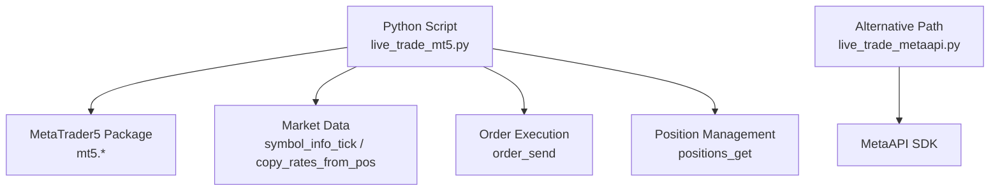
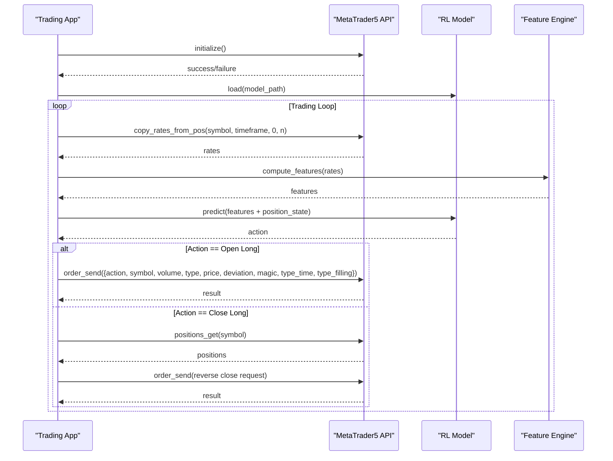
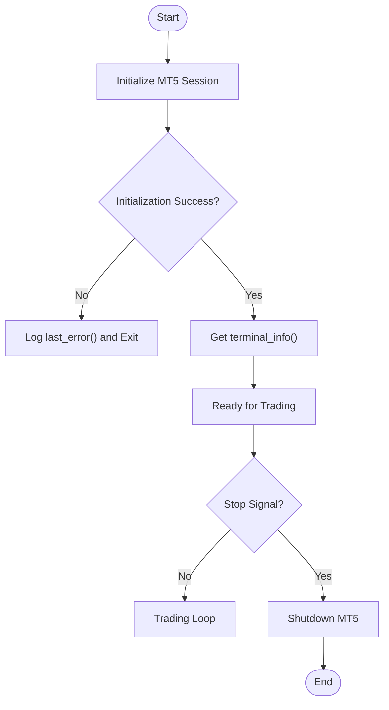
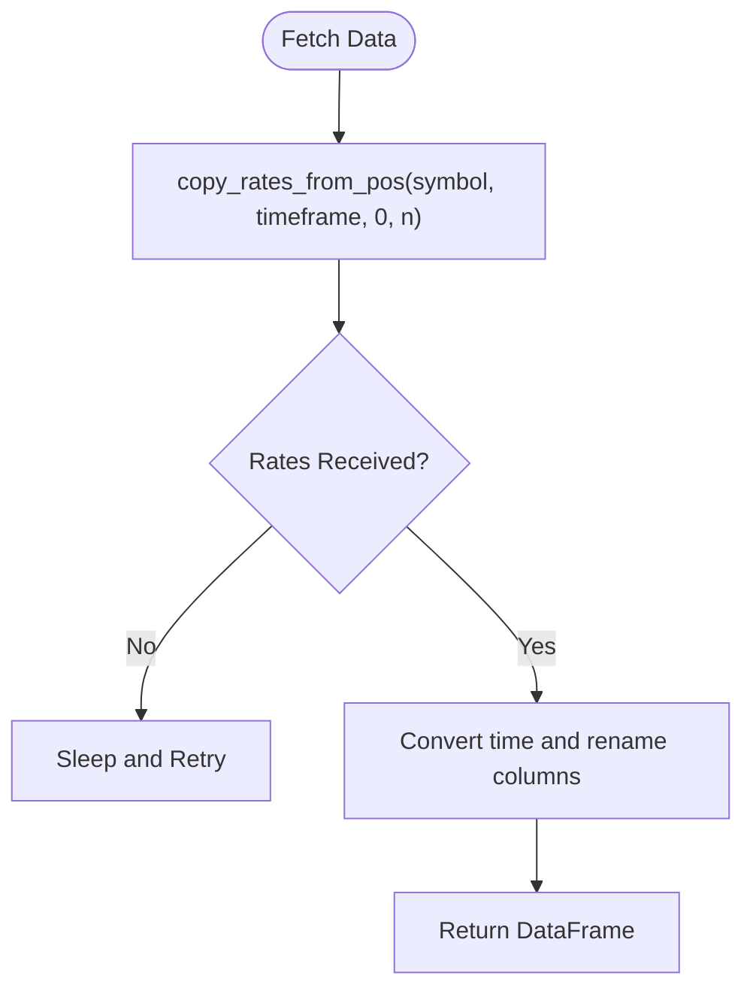
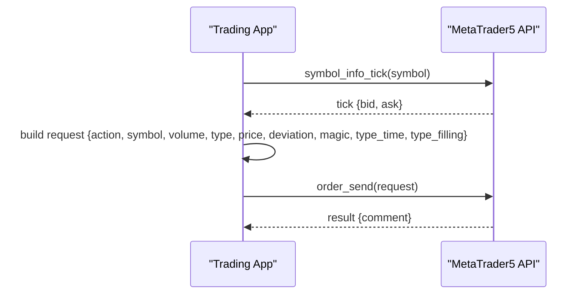
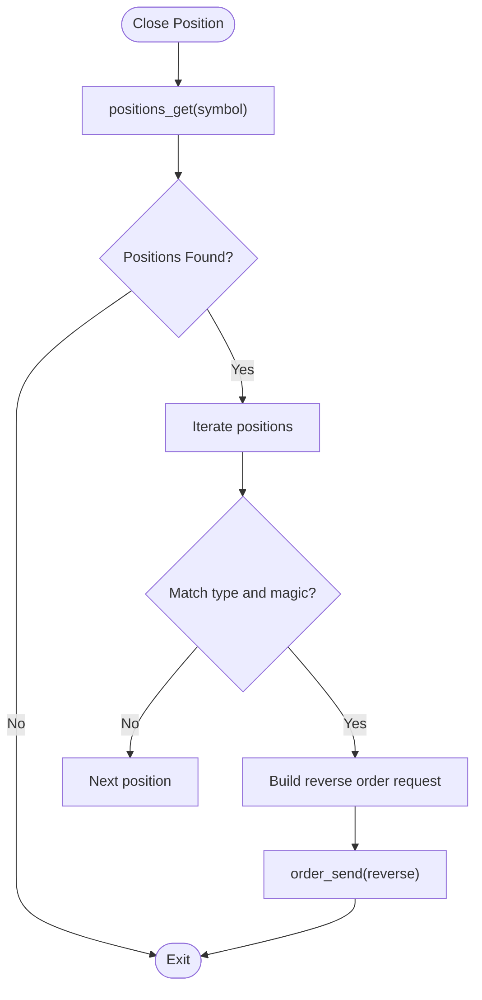
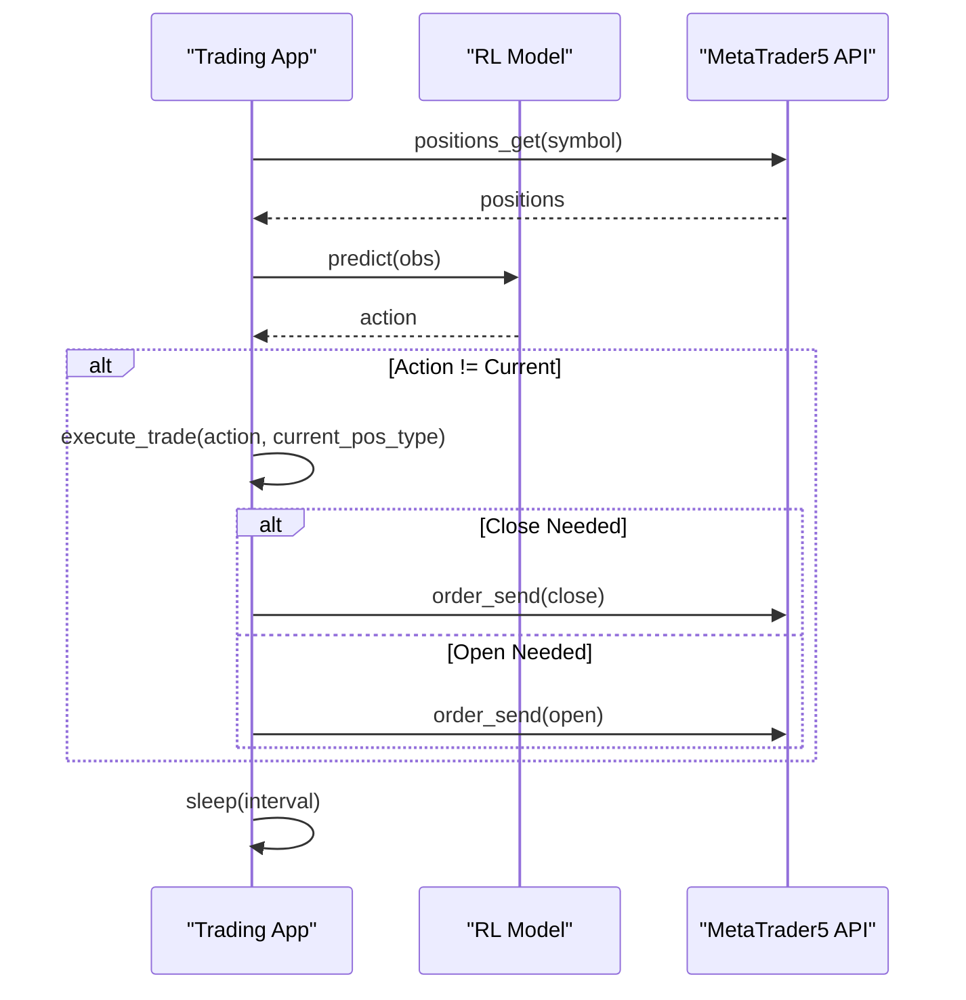
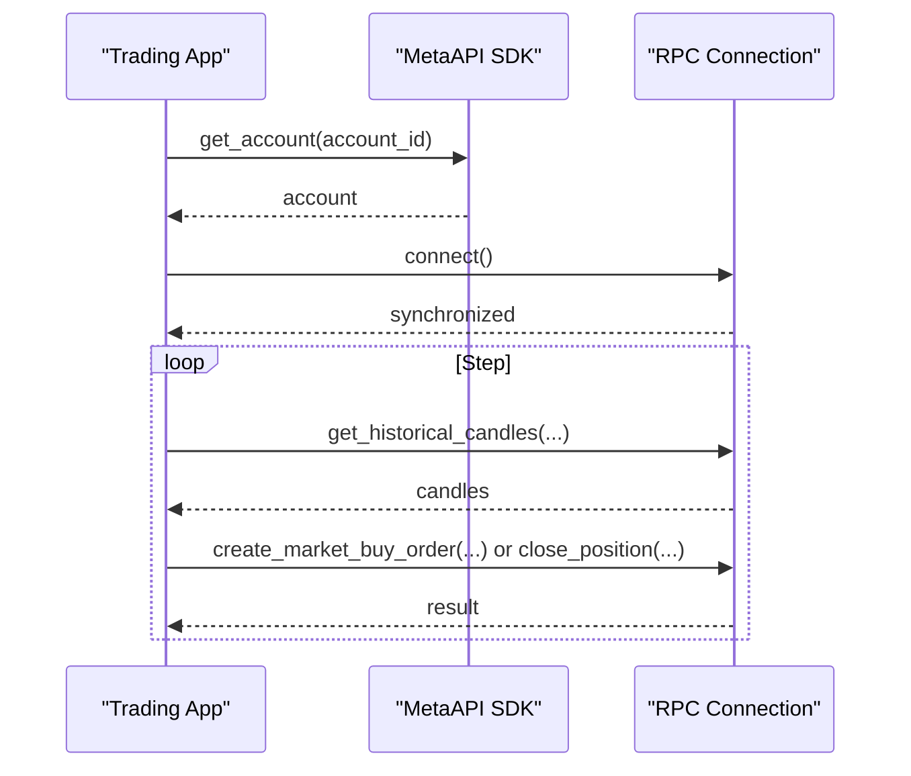
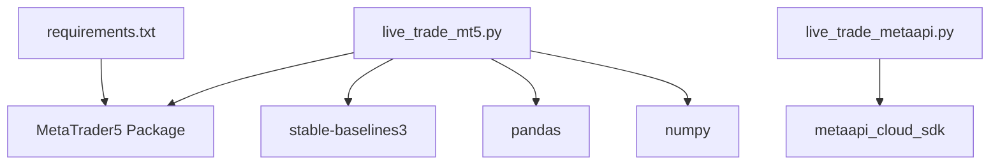

# MetaTrader 5 Integration

<cite>
**Referenced Files in This Document**
- [live_trade_mt5.py](file://live/live_trade_mt5.py)
- [live_trade_metaapi.py](file://live/live_trade_metaapi.py)
- [requirements.txt](file://requirements.txt)
- [README.md](file://README.md)
</cite>

## Table of Contents
1. [Introduction](#introduction)
2. [Project Structure](#project-structure)
3. [Core Components](#core-components)
4. [Architecture Overview](#architecture-overview)
5. [Detailed Component Analysis](#detailed-component-analysis)
6. [Dependency Analysis](#dependency-analysis)
7. [Performance Considerations](#performance-considerations)
8. [Troubleshooting Guide](#troubleshooting-guide)
9. [Conclusion](#conclusion)
10. [Appendices](#appendices)

## Introduction
This document provides comprehensive API documentation for integrating with MetaTrader 5 (MT5) to enable direct platform connectivity, order execution, and position management. It covers MT5 initialization, connection handling, terminal communication via the Python API, and concrete usage patterns for placing orders and managing positions. It also documents MT5-specific concepts such as ORDER_TIME_GTC and ORDER_FILLING_IOC, and explains how magic numbers are used to identify trades. Practical examples include establishing connections, handling failures with retry logic, executing market orders with error handling, and managing the full order lifecycle from placement to completion. Security considerations for local MT5 terminal access and best practices for production deployment are included.

## Project Structure
The repository contains two primary live trading implementations:
- Direct MT5 integration using the MetaTrader5 Python package
- Cloud-based integration using MetaAPI

Key files relevant to this documentation:
- live/live_trade_mt5.py: Direct MT5 integration for data fetching, order execution, and position management
- live/live_trade_metaapi.py: Alternative cloud-based approach using MetaAPI
- requirements.txt: Declares the MetaTrader5 dependency
- README.md: Installation and security setup guidance

**Diagram sources**
- [live_trade_mt5.py:21-109](file://live/live_trade_mt5.py#L21-L109)
- [live_trade_metaapi.py:40-133](file://live/live_trade_metaapi.py#L40-L133)

**Section sources**
- [live_trade_mt5.py:1-174](file://live/live_trade_mt5.py#L1-L174)
- [live_trade_metaapi.py:1-231](file://live/live_trade_metaapi.py#L1-L231)
- [requirements.txt:11-11](file://requirements.txt#L11-L11)
- [README.md:250-407](file://README.md#L250-L407)

## Core Components
- MT5 Initialization and Connection:
  - Initialize the MT5 terminal session and verify connectivity
  - Retrieve terminal information to confirm successful connection
- Market Data Access:
  - Fetch recent candles for feature computation
  - Retrieve current tick prices for order pricing
- Order Placement:
  - Build and send market orders with symbol, volume, type, price, deviation, magic number, time-in-force, and filling mode
- Position Management:
  - Query existing positions filtered by symbol and magic number
  - Close positions by sending reverse market orders
- Error Handling and Retries:
  - Handle initialization failures and network timeouts
  - Implement retry loops for robust operation

**Section sources**
- [live_trade_mt5.py:111-116](file://live/live_trade_mt5.py#L111-L116)
- [live_trade_mt5.py:21-30](file://live/live_trade_mt5.py#L21-L30)
- [live_trade_mt5.py:57-75](file://live/live_trade_mt5.py#L57-L75)
- [live_trade_mt5.py:77-109](file://live/live_trade_mt5.py#L77-L109)
- [live_trade_metaapi.py:40-86](file://live/live_trade_metaapi.py#L40-L86)
- [live_trade_metaapi.py:135-220](file://live/live_trade_metaapi.py#L135-L220)

## Architecture Overview
The system integrates a reinforcement learning model with MT5 to automate trading decisions. The flow includes:
- Initializing MT5 and loading the trained model
- Fetching market data and computing features
- Predicting actions and mapping them to trade operations
- Executing orders or closing positions based on current state
- Monitoring and logging results

**Diagram sources**
- [live_trade_mt5.py:21-30](file://live/live_trade_mt5.py#L21-L30)
- [live_trade_mt5.py:57-75](file://live/live_trade_mt5.py#L57-L75)
- [live_trade_mt5.py:77-109](file://live/live_trade_mt5.py#L77-L109)
- [live_trade_mt5.py:111-170](file://live/live_trade_mt5.py#L111-L170)

## Detailed Component Analysis

### MT5 Initialization and Connection Handling
- Initialization:
  - Call the initialization function to establish a session with the local MT5 terminal
  - On failure, retrieve the last error code for diagnostics
- Terminal Info:
  - After successful initialization, query terminal info to confirm connectivity and environment details
- Shutdown:
  - Ensure proper shutdown when stopping the application to release resources

**Diagram sources**
- [live_trade_mt5.py:111-116](file://live/live_trade_mt5.py#L111-L116)
- [live_trade_mt5.py:168-170](file://live/live_trade_mt5.py#L168-L170)

**Section sources**
- [live_trade_mt5.py:111-116](file://live/live_trade_mt5.py#L111-L116)
- [live_trade_mt5.py:168-170](file://live/live_trade_mt5.py#L168-L170)

### Market Data Access
- Fetching Candles:
  - Use the copy function to retrieve historical rates for the specified symbol and timeframe
  - Convert timestamps and normalize column names for downstream processing
- Tick Prices:
  - Retrieve current bid/ask prices for order execution
- Error Handling:
  - If data retrieval fails, log and retry after a delay

**Diagram sources**
- [live_trade_mt5.py:21-30](file://live/live_trade_mt5.py#L21-L30)

**Section sources**
- [live_trade_mt5.py:21-30](file://live/live_trade_mt5.py#L21-L30)

### Order Placement API: open_order()
- Purpose:
  - Place a market order for the configured symbol with specified parameters
- Parameters:
  - Symbol: Target instrument (e.g., XAUUSD)
  - Volume: Lot size (minimum lot size is enforced by the broker)
  - Type: Order direction (buy/sell)
  - Price: Current tick price (bid for sell, ask for buy)
  - Deviation: Maximum allowed slippage in points
  - Magic Number: Identifier for trade attribution and filtering
  - Time In Force: ORDER_TIME_GTC (Good Till Cancelled)
  - Filling Mode: ORDER_FILLING_IOC (Immediate Or Cancel)
- Execution Flow:
  - Build a request dictionary with all required fields
  - Send the order via the platform API
  - Print or log the result comment for visibility

**Diagram sources**
- [live_trade_mt5.py:57-75](file://live/live_trade_mt5.py#L57-L75)

**Section sources**
- [live_trade_mt5.py:57-75](file://live/live_trade_mt5.py#L57-L75)

### Position Management: close_position() and get_current_position_type()
- Closing Positions:
  - Retrieve positions for the symbol
  - For each matching position, construct a reverse market order to close it
  - Use current tick price and appropriate deviation
- Position State Monitoring:
  - Query positions and filter by magic number to determine current state
  - Return a simplified state indicator (flat or long)

**Diagram sources**
- [live_trade_mt5.py:77-95](file://live/live_trade_mt5.py#L77-L95)
- [live_trade_mt5.py:97-109](file://live/live_trade_mt5.py#L97-L109)

**Section sources**
- [live_trade_mt5.py:77-109](file://live/live_trade_mt5.py#L77-L109)

### Trading Decision and Execution Loop
- Decision Logic:
  - Compare predicted action with current position state
  - Close existing positions if needed; open new positions if desired
- Execution:
  - Execute trades via open_order() and close_position()
  - Sleep between iterations to avoid excessive polling

**Diagram sources**
- [live_trade_mt5.py:32-56](file://live/live_trade_mt5.py#L32-L56)
- [live_trade_mt5.py:124-166](file://live/live_trade_mt5.py#L124-L166)

**Section sources**
- [live_trade_mt5.py:32-56](file://live/live_trade_mt5.py#L32-L56)
- [live_trade_mt5.py:124-166](file://live/live_trade_mt5.py#L124-L166)

### Alternative Integration: MetaAPI
- Cloud-Based Approach:
  - Uses MetaAPI SDK to connect to MT5 accounts remotely
  - Includes robust retry logic for data fetching and connection stability
  - Supports asynchronous operations and timeout handling
- Key Operations:
  - Deploy account if not already deployed
  - Establish RPC connection and wait for synchronization
  - Fetch historical candles and manage positions via API methods

**Diagram sources**
- [live_trade_metaapi.py:135-220](file://live/live_trade_metaapi.py#L135-L220)
- [live_trade_metaapi.py:40-86](file://live/live_trade_metaapi.py#L40-L86)
- [live_trade_metaapi.py:88-133](file://live/live_trade_metaapi.py#L88-L133)

**Section sources**
- [live_trade_metaapi.py:40-86](file://live/live_trade_metaapi.py#L40-L86)
- [live_trade_metaapi.py:88-133](file://live/live_trade_metaapi.py#L88-L133)
- [live_trade_metaapi.py:135-220](file://live/live_trade_metaapi.py#L135-L220)

## Dependency Analysis
- External Dependencies:
  - MetaTrader5 Python package for direct terminal integration
  - Stable Baselines 3 for RL model inference
  - Pandas and NumPy for data manipulation
- Internal Coupling:
  - Trading scripts depend on feature computation utilities
  - Position and order functions rely on MT5 API calls

**Diagram sources**
- [requirements.txt:1-29](file://requirements.txt#L1-L29)
- [live_trade_mt5.py:1-9](file://live_trade_mt5.py#L1-L9)
- [live_trade_metaapi.py:1-10](file://live_trade_metaapi.py#L1-L10)

**Section sources**
- [requirements.txt:1-29](file://requirements.txt#L1-L29)
- [live_trade_mt5.py:1-9](file://live/live_trade_mt5.py#L1-L9)
- [live_trade_metaapi.py:1-10](file://live/live_trade_metaapi.py#L1-L10)

## Performance Considerations
- Polling Frequency:
  - Adjust sleep intervals to balance responsiveness and resource usage
- Data Efficiency:
  - Fetch only necessary history to minimize memory and processing overhead
- Order Execution:
  - Use appropriate filling modes to reduce partial fills and slippage
- Connection Stability:
  - Implement retries and timeouts to handle transient network issues
- Model Inference:
  - Ensure deterministic predictions during live trading to maintain consistency

[No sources needed since this section provides general guidance]

## Troubleshooting Guide
- Initialization Failures:
  - Check MT5 terminal status and logs
  - Use last_error() to diagnose issues
- Data Retrieval Errors:
  - Verify symbol availability and timeframe settings
  - Implement retry logic with exponential backoff
- Order Rejections:
  - Validate volume limits, symbol trading hours, and margin requirements
  - Review deviation and filling mode settings
- Position Mismatches:
  - Confirm magic number usage to isolate trades
  - Reconcile positions after network interruptions

**Section sources**
- [live_trade_mt5.py:111-116](file://live/live_trade_mt5.py#L111-L116)
- [live_trade_mt5.py:124-131](file://live/live_trade_mt5.py#L124-L131)
- [live_trade_metaapi.py:40-86](file://live/live_trade_metaapi.py#L40-L86)
- [live_trade_metaapi.py:182-196](file://live/live_trade_metaapi.py#L182-L196)

## Conclusion
This document outlined the integration of MetaTrader 5 for automated trading, covering initialization, connection handling, order execution, and position management. It provided detailed API usage patterns, including parameter specifications for order placement and MT5-specific concepts like ORDER_TIME_GTC and ORDER_FILLING_IOC. Practical examples demonstrated connection establishment, error handling with retries, and lifecycle management of orders. Security considerations and best practices for production deployment were addressed to ensure robust and safe operation.

[No sources needed since this section summarizes without analyzing specific files]

## Appendices

### MT5-Specific Concepts
- ORDER_TIME_GTC: Orders remain active until canceled or filled
- ORDER_FILLING_IOC: Orders must be executed immediately at available prices or canceled
- Magic Number: Unique identifier used to attribute and filter trades by strategy or agent

**Section sources**
- [live_trade_mt5.py:61-72](file://live/live_trade_mt5.py#L61-L72)
- [live_trade_mt5.py:97-109](file://live/live_trade_mt5.py#L97-L109)

### Security Considerations and Best Practices
- Local MT5 Terminal Access:
  - Ensure the terminal is running and logged into the correct account
  - Restrict access to the machine and environment variables containing credentials
- Production Deployment:
  - Use minimum position sizes and risk controls
  - Monitor daily performance and set daily loss limits
  - Prefer paper trading before going live
  - Implement robust error handling and logging

**Section sources**
- [README.md:264-291](file://README.md#L264-L291)
- [README.md:380-415](file://README.md#L380-L415)