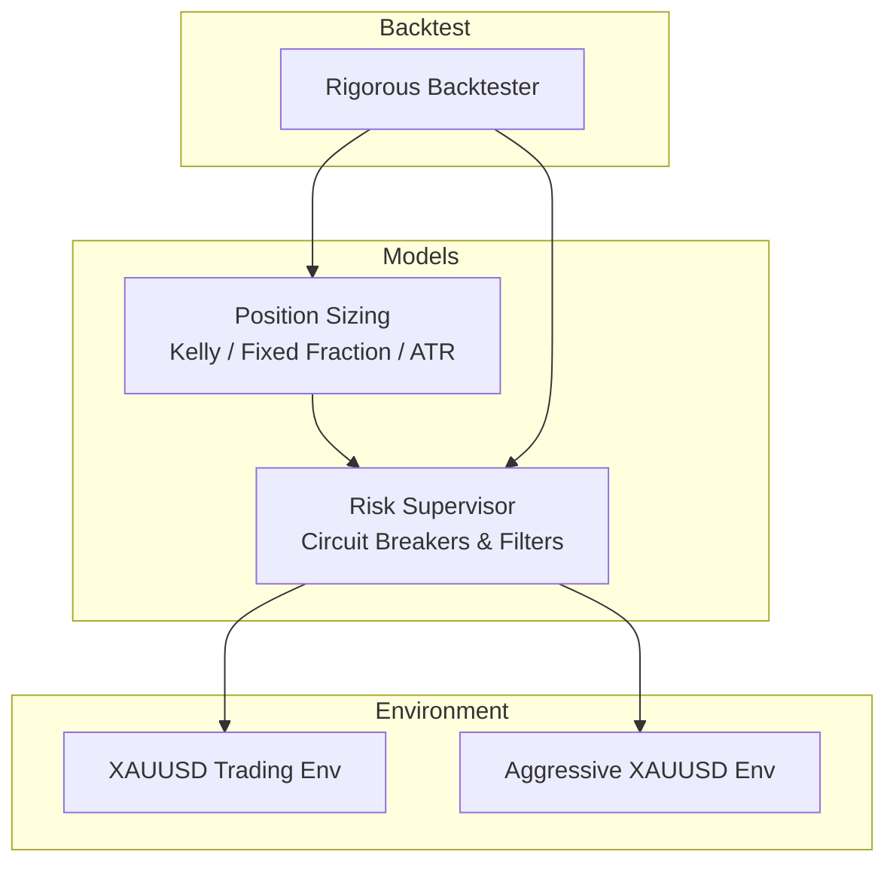
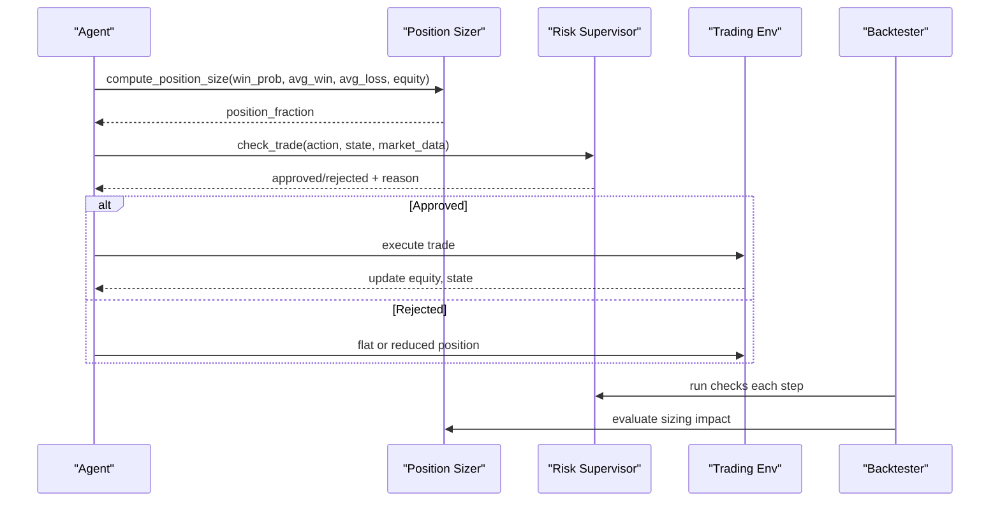
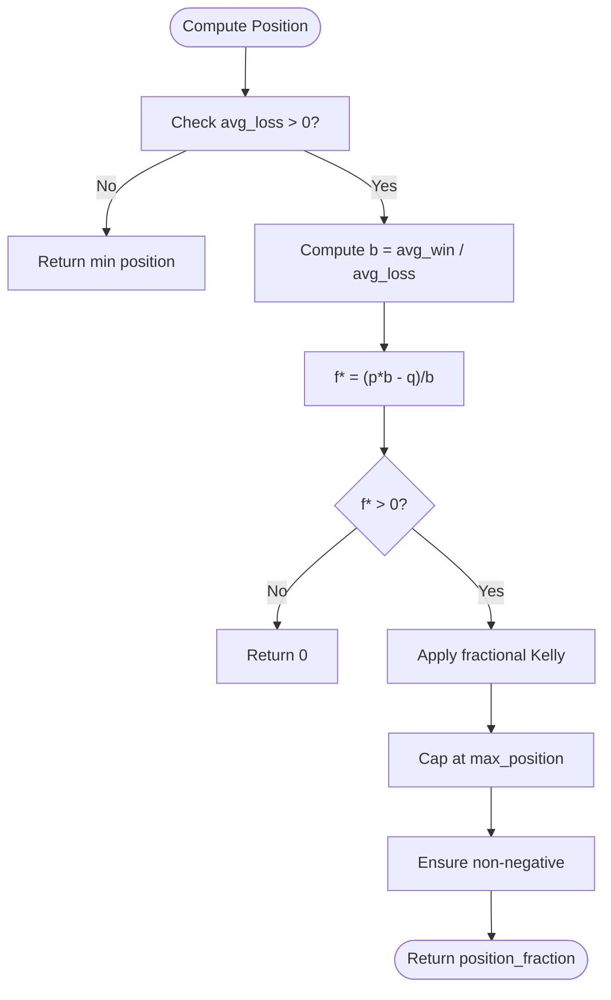
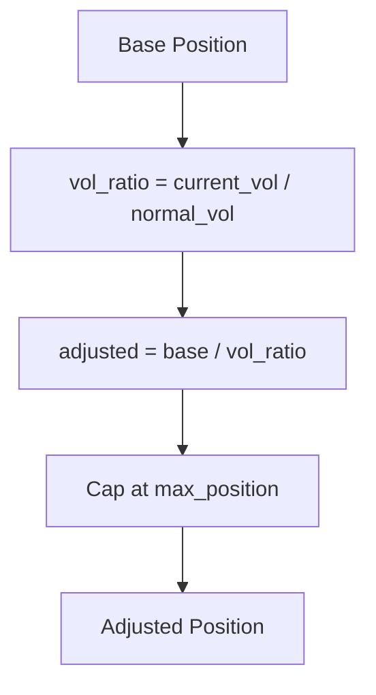
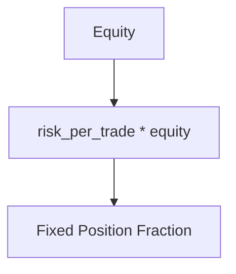
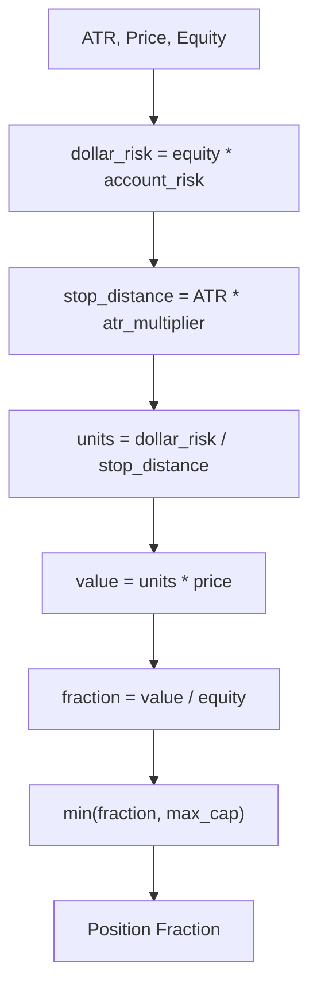
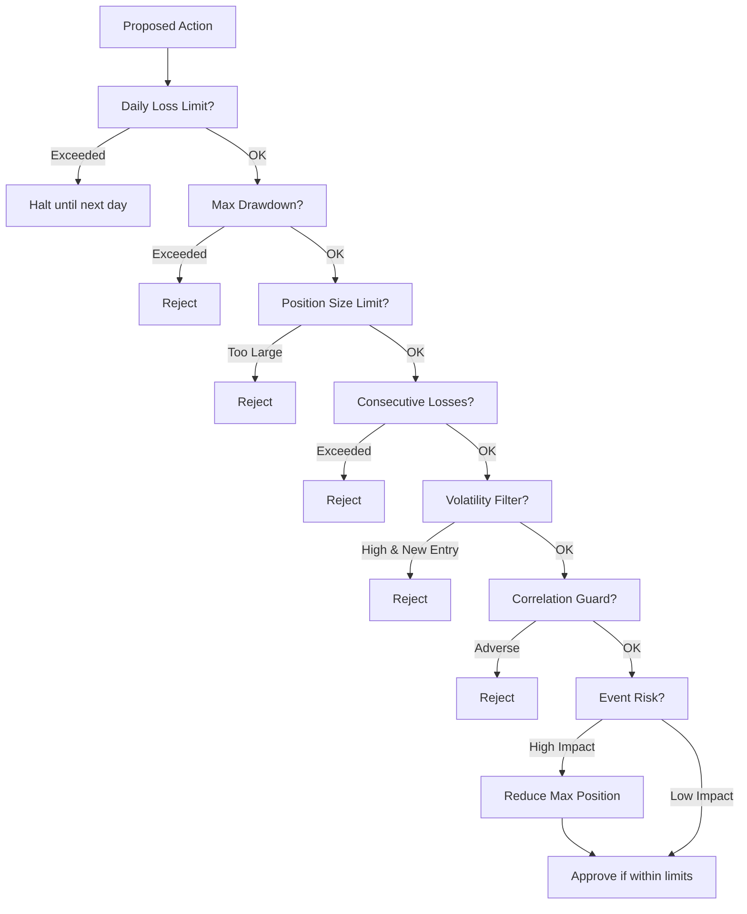
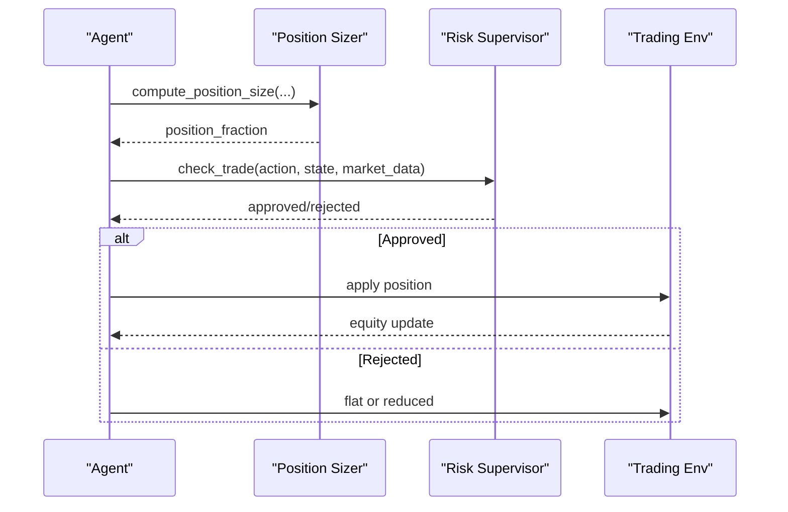
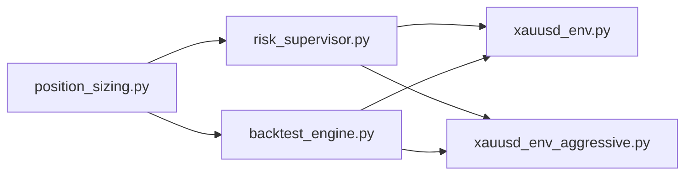

# Position Sizing Strategies

<cite>
**Referenced Files in This Document**
- [position_sizing.py](file://models/position_sizing.py)
- [risk_supervisor.py](file://models/risk_supervisor.py)
- [backtest_engine.py](file://backtest/backtest_engine.py)
- [xauusd_env.py](file://env/xauusd_env.py)
- [xauusd_env_aggressive.py](file://env/xauusd_env_aggressive.py)
</cite>

## Table of Contents
1. [Introduction](#introduction)
2. [Project Structure](#project-structure)
3. [Core Components](#core-components)
4. [Architecture Overview](#architecture-overview)
5. [Detailed Component Analysis](#detailed-component-analysis)
6. [Dependency Analysis](#dependency-analysis)
7. [Performance Considerations](#performance-considerations)
8. [Troubleshooting Guide](#troubleshooting-guide)
9. [Conclusion](#conclusion)
10. [Appendices](#appendices)

## Introduction
This document explains the position sizing algorithms and risk-based allocation strategies implemented in the repository. It covers:
- Kelly criterion for optimal bet sizing based on win probability and payoff ratio
- Volatility targeting methods that adjust positions to market volatility regimes
- Fixed fractional sizing with configurable risk per trade
- ATR-based sizing using Average True Range
- Safety mechanisms including maximum position limits, minimum lot sizes, drawdown protection, and event/volatility filters
- Integration points with trading environments and backtesting framework for dynamic sizing during live trading
- Parameter tuning guidelines and performance comparison approaches

## Project Structure
The position sizing logic is primarily implemented under models/, with supporting environment and backtesting utilities in env/ and backtest/. The key files are:
- models/position_sizing.py: Kelly, fixed fraction, ATR-based sizing, and volatility adjustment
- models/risk_supervisor.py: Hard-coded safety layer (circuit breakers, drawdown protection, spread/volatility/event filters)
- backtest/backtest_engine.py: Rigorous backtester with realistic costs and metrics
- env/xauusd_env.py and env/xauusd_env_aggressive.py: Discrete action spaces used by agents; sizing can be integrated via wrappers or agent policies

**Diagram sources**
- [position_sizing.py:29-335](file://models/position_sizing.py#L29-L335)
- [risk_supervisor.py:18-174](file://models/risk_supervisor.py#L18-L174)
- [xauusd_env.py:7-118](file://env/xauusd_env.py#L7-L118)
- [xauusd_env_aggressive.py:6-144](file://env/xauusd_env_aggressive.py#L6-L144)
- [backtest_engine.py:24-217](file://backtest/backtest_engine.py#L24-L217)

**Section sources**
- [position_sizing.py:1-399](file://models/position_sizing.py#L1-L399)
- [risk_supervisor.py:1-387](file://models/risk_supervisor.py#L1-L387)
- [backtest_engine.py:1-423](file://backtest/backtest_engine.py#L1-L423)
- [xauusd_env.py:1-118](file://env/xauusd_env.py#L1-L118)
- [xauusd_env_aggressive.py:1-144](file://env/xauusd_env_aggressive.py#L1-L144)

## Core Components
- KellyPositionSizer: Computes optimal position size using Kelly criterion with fractional scaling, max caps, and volatility adjustment. Tracks win rate, average win/loss, and reward-to-risk.
- FixedFractionSizer: Simple constant risk-per-trade sizing.
- ATRPositionSizer: Size positions based on account risk percentage and ATR stop distance.
- RiskSupervisor: Deterministic safety layer enforcing daily loss limits, drawdown protection, position size caps, volatility/spread/event filters, and overtrading prevention.
- Backtester: Realistic cost modeling and comprehensive metrics for evaluating sizing strategies.

**Section sources**
- [position_sizing.py:29-335](file://models/position_sizing.py#L29-L335)
- [risk_supervisor.py:18-174](file://models/risk_supervisor.py#L18-L174)
- [backtest_engine.py:24-217](file://backtest/backtest_engine.py#L24-L217)

## Architecture Overview
The system integrates a sizing engine with a safety supervisor and trading environments. During live trading or backtesting:
- Agent proposes actions and desired exposure
- Position sizer computes an optimal fraction based on strategy signals and market conditions
- Risk supervisor validates and potentially overrides decisions to enforce hard constraints
- Environment executes trades and updates equity/state
- Backtester evaluates performance with realistic costs

**Diagram sources**
- [position_sizing.py:66-111](file://models/position_sizing.py#L66-L111)
- [risk_supervisor.py:91-174](file://models/risk_supervisor.py#L91-L174)
- [xauusd_env.py:75-117](file://env/xauusd_env.py#L75-L117)
- [backtest_engine.py:73-146](file://backtest/backtest_engine.py#L73-L146)

## Detailed Component Analysis

### Kelly Criterion Implementation
- Inputs: win probability, average win, average loss, equity
- Logic:
  - Compute odds b = avg_win / avg_loss
  - Full Kelly f* = (p*b - q)/b where q = 1 - p
  - Apply fractional Kelly (e.g., quarter Kelly) for safety
  - Cap at maximum position size
  - Return non-negative fraction
- Dynamic sizing:
  - Uses agent’s value estimates to approximate win probability
  - Converts advantage to probability via sigmoid and clamps to reasonable range
- Volatility adjustment:
  - Scales base position inversely with current vs normal volatility
- Statistics tracking:
  - Maintains recent trade history to update win rate and average win/loss

**Diagram sources**
- [position_sizing.py:66-111](file://models/position_sizing.py#L66-L111)

**Section sources**
- [position_sizing.py:29-111](file://models/position_sizing.py#L29-L111)
- [position_sizing.py:113-187](file://models/position_sizing.py#L113-L187)
- [position_sizing.py:189-216](file://models/position_sizing.py#L189-L216)
- [position_sizing.py:218-262](file://models/position_sizing.py#L218-L262)

### Volatility Targeting Methods
- Inverse volatility scaling:
  - Adjusted position = base_position / (current_volatility / normal_volatility)
  - Respects maximum position cap
- Use cases:
  - Reduce exposure in high-volatility regimes to maintain consistent dollar risk
  - Increase exposure in low-volatility regimes within safe bounds

**Diagram sources**
- [position_sizing.py:189-216](file://models/position_sizing.py#L189-L216)

**Section sources**
- [position_sizing.py:189-216](file://models/position_sizing.py#L189-L216)

### Fixed Fractional Sizing
- Always risk a fixed fraction of equity per trade
- Simple and robust baseline; easy to tune risk_per_trade

**Diagram sources**
- [position_sizing.py:265-283](file://models/position_sizing.py#L265-L283)

**Section sources**
- [position_sizing.py:265-283](file://models/position_sizing.py#L265-L283)

### ATR-Based Sizing
- Position units = (account_risk * equity) / (ATR * atr_multiplier)
- Convert units to position value and then to fraction of equity
- Caps position to prevent excessive exposure

**Diagram sources**
- [position_sizing.py:286-335](file://models/position_sizing.py#L286-L335)

**Section sources**
- [position_sizing.py:286-335](file://models/position_sizing.py#L286-L335)

### Risk Supervisor (Safety Layer)
- Enforces:
  - Daily loss limit (circuit breaker)
  - Maximum drawdown protection
  - Position size limits
  - Consecutive losses protection
  - Volatility filter (blocks new entries above threshold)
  - Correlation guard (e.g., USD momentum vs Gold)
  - Event risk filter (reduce position size during high-impact events)
  - Overtrading prevention (max trades/day, cooldown between trades)
  - Spread filter (avoid wide spreads)
  - Market hours check
- Provides approval/rejection with reasons and statistics

**Diagram sources**
- [risk_supervisor.py:91-174](file://models/risk_supervisor.py#L91-L174)

**Section sources**
- [risk_supervisor.py:18-174](file://models/risk_supervisor.py#L18-L174)
- [risk_supervisor.py:176-241](file://models/risk_supervisor.py#L176-L241)
- [risk_supervisor.py:243-285](file://models/risk_supervisor.py#L243-L285)

### Integration with Trading Environments
- Discrete action spaces:
  - Long-only environment with actions {Flat, Long}
  - Aggressive environment with actions {Short, Flat, Long}, leverage, and stop-loss mechanics
- Sizing integration patterns:
  - Wrap agent to compute desired exposure from sizer outputs
  - Use RiskSupervisor to approve or override actions
  - Update equity and state after execution

**Diagram sources**
- [xauusd_env.py:75-117](file://env/xauusd_env.py#L75-L117)
- [xauusd_env_aggressive.py:86-143](file://env/xauusd_env_aggressive.py#L86-L143)
- [position_sizing.py:66-111](file://models/position_sizing.py#L66-L111)
- [risk_supervisor.py:91-174](file://models/risk_supervisor.py#L91-L174)

**Section sources**
- [xauusd_env.py:7-118](file://env/xauusd_env.py#L7-L118)
- [xauusd_env_aggressive.py:6-144](file://env/xauusd_env_aggressive.py#L6-L144)

## Dependency Analysis
- Models:
  - position_sizing.py depends on numpy/torch for computations and optional agent integration
  - risk_supervisor.py depends on datetime/numpy for time-based checks and state tracking
- Backtester:
  - backtest_engine.py orchestrates evaluation with realistic costs and metrics
- Environments:
  - xauusd_env.py and xauusd_env_aggressive.py define discrete action spaces and reward structures

**Diagram sources**
- [position_sizing.py:21-23](file://models/position_sizing.py#L21-L23)
- [risk_supervisor.py:10-12](file://models/risk_supervisor.py#L10-L12)
- [backtest_engine.py:15-18](file://backtest/backtest_engine.py#L15-L18)
- [xauusd_env.py:1-4](file://env/xauusd_env.py#L1-L4)
- [xauusd_env_aggressive.py:1-3](file://env/xauusd_env_aggressive.py#L1-L3)

**Section sources**
- [position_sizing.py:21-23](file://models/position_sizing.py#L21-L23)
- [risk_supervisor.py:10-12](file://models/risk_supervisor.py#L10-L12)
- [backtest_engine.py:15-18](file://backtest/backtest_engine.py#L15-L18)

## Performance Considerations
- Cost-aware backtesting:
  - Spreads, slippage, and commissions modeled conservatively to avoid overoptimism
  - Walk-forward validation supports robustness across regimes
- Metrics:
  - Total return, annualized return, max drawdown, Sharpe, Sortino, Calmar ratios
  - Trade-level stats: win rate, avg win/loss, profit factor, duration
- Sizing impacts:
  - Higher volatility reduces position sizes to stabilize risk
  - Fractional Kelly balances growth and drawdowns
  - ATR sizing adapts to instrument-specific volatility

[No sources needed since this section provides general guidance]

## Troubleshooting Guide
Common issues and mitigations:
- Zero average loss:
  - Sizer returns a minimum position to avoid division by zero
- Negative Kelly edge:
  - No trade recommended; wait for better signal
- High volatility regime:
  - Risk supervisor blocks new entries; consider reducing exposure or waiting
- Wide spreads:
  - Trades rejected; avoid trading during illiquid periods
- Daily loss limit exceeded:
  - Circuit breaker halts trading until next day
- Excessive drawdown:
  - Risk supervisor rejects trades beyond configured thresholds

**Section sources**
- [position_sizing.py:86-100](file://models/position_sizing.py#L86-L100)
- [risk_supervisor.py:104-174](file://models/risk_supervisor.py#L104-L174)

## Conclusion
The repository provides a robust suite of position sizing strategies and safety mechanisms:
- Kelly criterion with fractional scaling and volatility adjustment for adaptive sizing
- Fixed fractional and ATR-based methods for simplicity and volatility adaptation
- A deterministic risk supervisor enforcing critical safeguards during live trading
- A rigorous backtester to evaluate strategies under realistic conditions
These components together enable dynamic, risk-aware position sizing suitable for both research and production environments.

[No sources needed since this section summarizes without analyzing specific files]

## Appendices

### Practical Examples and Parameter Tuning Guidelines
- Kelly sizing:
  - Use quarter or half Kelly to reduce drawdowns while preserving growth
  - Tune kelly_fraction and max_position based on historical win rate and reward-to-risk
- Volatility targeting:
  - Estimate normal_volatility from rolling windows; adjust current_volatility dynamically
  - Ensure caps prevent overexposure during spikes
- Fixed fractional:
  - Set risk_per_trade according to account size and tolerance (e.g., 1–2%)
- ATR sizing:
  - Choose atr_multiplier based on typical stop distances; calibrate account_risk to target per-trade risk
- Risk supervisor:
  - Configure max_daily_loss, max_drawdown, vol_threshold, max_spread, and event filters to match market conditions
  - Monitor rejection reasons to refine parameters

[No sources needed since this section provides general guidance]

### Backtesting and Performance Comparisons
- Use RigorousBacktester to compare:
  - Kelly vs Fixed Fraction vs ATR sizing under identical data and costs
  - Evaluate metrics: Sharpe, Sortino, Calmar, max drawdown, profit factor
- Conduct walk-forward validation to assess stability across regimes
- Compare results with and without RiskSupervisor to quantify safety benefits

**Section sources**
- [backtest_engine.py:73-217](file://backtest/backtest_engine.py#L73-L217)
- [backtest_engine.py:219-391](file://backtest/backtest_engine.py#L219-L391)