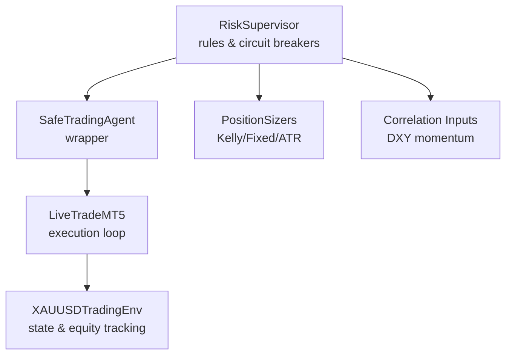
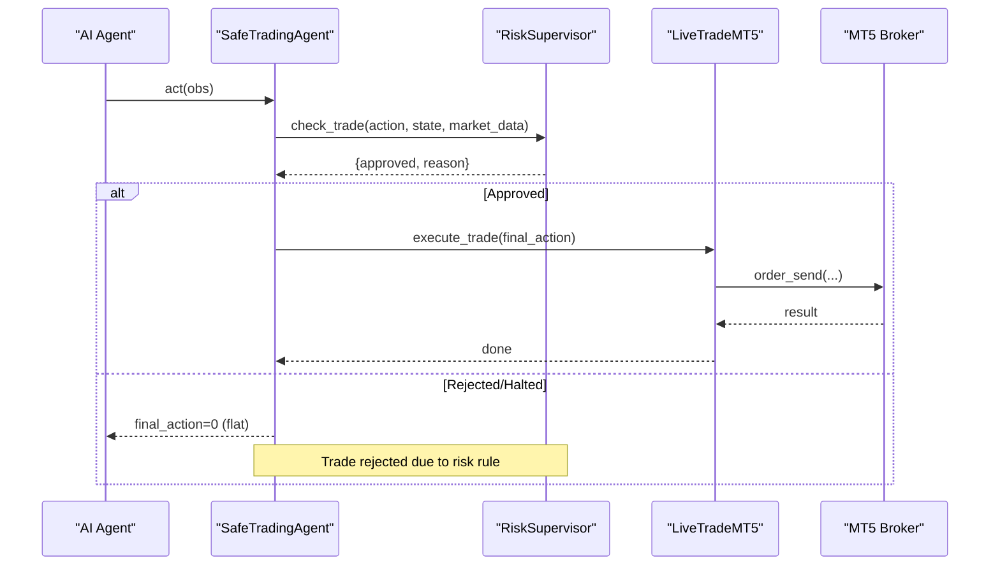
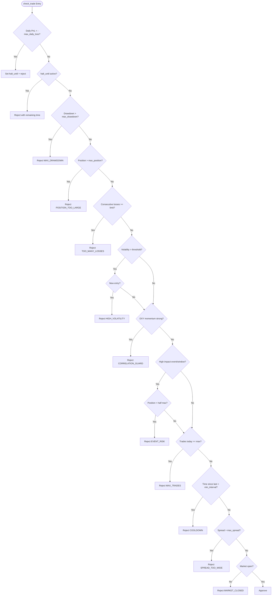
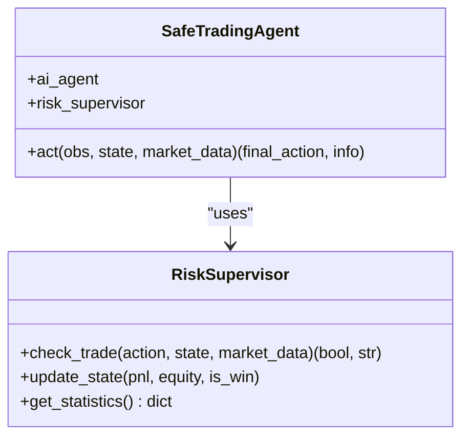
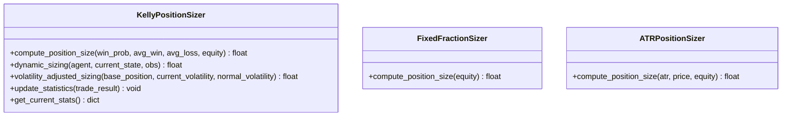
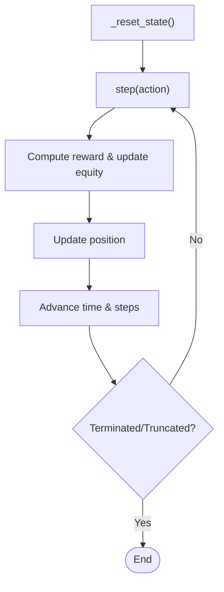
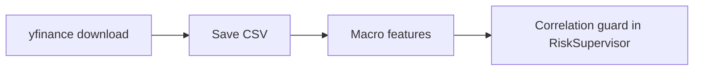
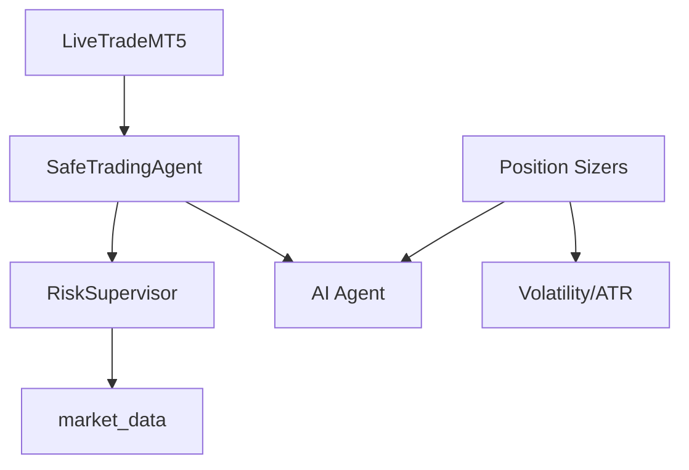

# Risk Supervision System

<cite>
**Referenced Files in This Document**
- [risk_supervisor.py](file://models/risk_supervisor.py)
- [position_sizing.py](file://models/position_sizing.py)
- [live_trade_mt5.py](file://live/live_trade_mt5.py)
- [xauusd_env.py](file://env/xauusd_env.py)
- [fetch_correlations.py](file://data/fetch_correlations.py)
</cite>

## Table of Contents
1. [Introduction](#introduction)
2. [Project Structure](#project-structure)
3. [Core Components](#core-components)
4. [Architecture Overview](#architecture-overview)
5. [Detailed Component Analysis](#detailed-component-analysis)
6. [Dependency Analysis](#dependency-analysis)
7. [Performance Considerations](#performance-considerations)
8. [Troubleshooting Guide](#troubleshooting-guide)
9. [Conclusion](#conclusion)
10. [Appendices](#appendices)

## Introduction
This document describes the risk supervision system that safeguards live trading by enforcing drawdown protection, maximum position limits, and circuit breaker mechanisms. It explains real-time risk monitoring for portfolio exposure, individual position risks, and account health metrics. It also details automated risk controls (drawdown-based sizing reductions and trading halts), maximum position limit enforcement (per-symbol caps, total exposure, correlation guards), and circuit breakers that halt trading during extreme conditions. Finally, it covers integration with execution systems and reporting of risk events and violations.

## Project Structure
The risk supervision system is implemented as a deterministic safety layer integrated around an AI agent and live execution pipeline:
- Risk Supervisor: Hard-coded rules that approve or reject trades and can trigger trading halts.
- Position Sizing: Algorithms to compute safe position sizes based on Kelly Criterion, volatility, and ATR.
- Live Execution: MetaTrader 5 loop that fetches market data, computes features, runs the model, and executes trades.
- Environment: Gym-style environment used for training and evaluation, exposing equity and position state.
- Correlation Data: Macro data fetching utilities that support correlation-based risk guards.



**Diagram sources**
- [risk_supervisor.py:18-174](file://models/risk_supervisor.py#L18-L174)
- [position_sizing.py:29-111](file://models/position_sizing.py#L29-L111)
- [live_trade_mt5.py:111-166](file://live/live_trade_mt5.py#L111-L166)
- [xauusd_env.py:7-118](file://env/xauusd_env.py#L7-L118)
- [fetch_correlations.py:5-54](file://data/fetch_correlations.py#L5-L54)

**Section sources**
- [risk_supervisor.py:18-174](file://models/risk_supervisor.py#L18-L174)
- [position_sizing.py:29-111](file://models/position_sizing.py#L29-L111)
- [live_trade_mt5.py:111-166](file://live/live_trade_mt5.py#L111-L166)
- [xauusd_env.py:7-118](file://env/xauusd_env.py#L7-L118)
- [fetch_correlations.py:5-54](file://data/fetch_correlations.py#L5-L54)

## Core Components
- RiskSupervisor: Enforces daily loss limits, maximum drawdown, position size caps, volatility filters, correlation guards, event risk filters, overtrading prevention, spread filters, and market hours checks. It tracks daily PnL, peak/current equity, trade counters, consecutive losses, and can issue trading halts.
- SafeTradingAgent: Wraps an AI agent and enforces RiskSupervisor decisions before execution; overrides risky actions to flat when necessary.
- Position Sizers: KellyPositionSizer (fractional Kelly), FixedFractionSizer, and ATRPositionSizer provide dynamic sizing with caps and volatility adjustments.
- LiveExecution (MetaTrader 5): Fetches market data, constructs observations, predicts actions, and executes orders; integrates with risk controls via wrapper logic.
- Environment: Tracks equity and position changes, providing state for risk monitoring and reward computation.

Key responsibilities:
- Real-time risk monitoring: Daily PnL, drawdown, trade frequency, spread, volatility, and correlation signals.
- Automated interventions: Reject trades, reduce positions, or halt trading when thresholds are breached.
- Reporting: Approval/rejection statistics, rejection reasons, and warnings logged for auditability.

**Section sources**
- [risk_supervisor.py:18-285](file://models/risk_supervisor.py#L18-L285)
- [position_sizing.py:29-335](file://models/position_sizing.py#L29-L335)
- [live_trade_mt5.py:111-166](file://live/live_trade_mt5.py#L111-L166)
- [xauusd_env.py:7-118](file://env/xauusd_env.py#L7-L118)

## Architecture Overview
The architecture layers risk control between decision-making and execution:
- The AI agent proposes actions.
- The RiskSupervisor evaluates market state and account metrics to approve, reject, or override actions.
- If approved, the LiveExecution module sends orders to the broker; otherwise, trading is halted or reduced.
- Position sizing modules adjust exposure based on strategy confidence, volatility, and ATR.



**Diagram sources**
- [risk_supervisor.py:91-174](file://models/risk_supervisor.py#L91-L174)
- [risk_supervisor.py:289-339](file://models/risk_supervisor.py#L289-L339)
- [live_trade_mt5.py:32-95](file://live/live_trade_mt5.py#L32-L95)

## Detailed Component Analysis

### RiskSupervisor: Drawdown Protection, Circuit Breakers, and Limits
- Drawdown protection: Monitors peak vs current equity; if drawdown exceeds threshold, rejects new entries.
- Circuit breaker: On daily loss limit breach, sets a trading halt until next day; emergency shutdown available for manual restart.
- Maximum position limits: Caps per-trade exposure; reduces allowed size during high-impact events.
- Volatility and spread filters: Prevents entries under extreme volatility or wide spreads.
- Correlation guard: Uses DXY momentum to avoid long Gold when USD rallies strongly.
- Overtrading prevention: Limits max trades per day and enforces minimum time between trades.
- State updates: Tracks daily PnL, equity, peak equity, consecutive losses, and logs warnings.



**Diagram sources**
- [risk_supervisor.py:91-174](file://models/risk_supervisor.py#L91-L174)

**Section sources**
- [risk_supervisor.py:35-174](file://models/risk_supervisor.py#L35-L174)
- [risk_supervisor.py:176-285](file://models/risk_supervisor.py#L176-L285)

### SafeTradingAgent: Integration Wrapper
- Orchestrates AI action proposals and RiskSupervisor approvals.
- Overrides rejected actions to flat to enforce safety.
- Returns approval metadata for logging and monitoring.



**Diagram sources**
- [risk_supervisor.py:289-339](file://models/risk_supervisor.py#L289-L339)
- [risk_supervisor.py:91-174](file://models/risk_supervisor.py#L91-L174)

**Section sources**
- [risk_supervisor.py:289-339](file://models/risk_supervisor.py#L289-L339)

### Position Sizing: Dynamic Exposure Control
- KellyPositionSizer: Computes fractional Kelly position sizes based on win probability and risk/reward; caps at maximum; supports volatility-adjusted sizing.
- FixedFractionSizer: Simple fixed-risk-per-trade approach.
- ATRPositionSizer: Adjusts position size using ATR to maintain consistent dollar risk across varying volatility regimes.



**Diagram sources**
- [position_sizing.py:29-111](file://models/position_sizing.py#L29-L111)
- [position_sizing.py:265-335](file://models/position_sizing.py#L265-L335)

**Section sources**
- [position_sizing.py:29-111](file://models/position_sizing.py#L29-L111)
- [position_sizing.py:265-335](file://models/position_sizing.py#L265-L335)

### Live Execution: Monitoring and Intervention Points
- Fetches market data and computes features for observation construction.
- Executes trades only when risk controls allow; integrates with risk wrapper to ensure compliance.
- Provides hooks to incorporate risk metrics into the observation or pre-execution checks.

```mermaid
sequenceDiagram
participant Loop as "main()"
participant Data as "get_market_data()"
participant Feat as "compute_features()"
participant Model as "model.predict()"
participant Exec as "execute_trade()"
participant MT5 as "mt5.order_send()"
Loop->>Data : fetch rates
Data-->>Loop : df
Loop->>Feat : compute features
Feat-->>Loop : feats
Loop->>Model : predict(obs)
Model-->>Loop : action
Loop->>Exec : execute_trade(action, current_pos)
Exec->>MT5 : order_send(...)
MT5-->>Exec : result
```

**Diagram sources**
- [live_trade_mt5.py:21-95](file://live/live_trade_mt5.py#L21-L95)
- [live_trade_mt5.py:111-166](file://live/live_trade_mt5.py#L111-L166)

**Section sources**
- [live_trade_mt5.py:21-95](file://live/live_trade_mt5.py#L21-L95)
- [live_trade_mt5.py:111-166](file://live/live_trade_mt5.py#L111-L166)

### Environment: Equity and Position Tracking
- Tracks equity evolution and position state each step.
- Exposes info including equity and position for risk monitoring and reporting.



**Diagram sources**
- [xauusd_env.py:59-118](file://env/xauusd_env.py#L59-L118)

**Section sources**
- [xauusd_env.py:59-118](file://env/xauusd_env.py#L59-L118)

### Correlation-Based Risk Aggregation
- Correlation inputs (e.g., DXY momentum) inform risk guards to avoid adverse macro conditions.
- Macro data fetching supports building correlation features for risk decisions.



**Diagram sources**
- [fetch_correlations.py:5-54](file://data/fetch_correlations.py#L5-L54)
- [risk_supervisor.py:136-141](file://models/risk_supervisor.py#L136-L141)

**Section sources**
- [fetch_correlations.py:5-54](file://data/fetch_correlations.py#L5-L54)
- [risk_supervisor.py:136-141](file://models/risk_supervisor.py#L136-L141)

## Dependency Analysis
- RiskSupervisor depends on market_data fields such as volatility, spread, dxy_momentum, and event flags to enforce rules.
- SafeTradingAgent depends on both the AI agent and RiskSupervisor to mediate actions.
- Live execution depends on MT5 connectivity and feature computation to produce observations and execute orders.
- Position sizers depend on strategy outputs (win probability, average win/loss) and market volatility/ATR.



**Diagram sources**
- [risk_supervisor.py:91-174](file://models/risk_supervisor.py#L91-L174)
- [risk_supervisor.py:289-339](file://models/risk_supervisor.py#L289-L339)
- [position_sizing.py:29-111](file://models/position_sizing.py#L29-L111)
- [live_trade_mt5.py:111-166](file://live/live_trade_mt5.py#L111-L166)

**Section sources**
- [risk_supervisor.py:91-174](file://models/risk_supervisor.py#L91-L174)
- [position_sizing.py:29-111](file://models/position_sizing.py#L29-L111)
- [live_trade_mt5.py:111-166](file://live/live_trade_mt5.py#L111-L166)

## Performance Considerations
- Keep risk checks lightweight to avoid latency in live loops; most checks are constant-time comparisons.
- Use fractional Kelly and volatility-adjusted sizing to reduce drawdowns without sacrificing growth potential.
- Limit frequent re-computation of macro features; cache correlation indicators where possible.
- Monitor log volume from risk rejections to prevent I/O bottlenecks in high-frequency environments.

[No sources needed since this section provides general guidance]

## Troubleshooting Guide
Common issues and resolutions:
- Frequent rejections due to high volatility or wide spreads: Adjust thresholds or pause trading during news events.
- Trading halts triggered by daily loss limit: Review consecutive losses and strategy performance; consider reducing position sizes.
- Correlation guard blocking entries: Validate DXY momentum calculation and ensure macro data feeds are up-to-date.
- Overtrading limits reached: Increase minimum time between trades or reduce max trades per day.
- Emergency shutdown: Requires manual restart; verify system integrity before resuming.

**Section sources**
- [risk_supervisor.py:104-174](file://models/risk_supervisor.py#L104-L174)
- [risk_supervisor.py:231-241](file://models/risk_supervisor.py#L231-L241)

## Conclusion
The risk supervision system provides robust, deterministic safeguards layered over AI-driven trading. It enforces drawdown protection, maximum position limits, and circuit breakers while integrating seamlessly with live execution. Through correlation guards, volatility filters, and event risk management, it minimizes catastrophic losses and ensures sustainable trading operations. Continuous monitoring and reporting enable proactive risk management and rapid response to adverse conditions.

[No sources needed since this section summarizes without analyzing specific files]

## Appendices

### Configuration Examples
- RiskSupervisor defaults include conservative limits for daily loss, position size, drawdown, volatility, spread, and trade frequency. Customize these parameters to match your risk appetite and market regime.
- Position sizing parameters:
  - KellyPositionSizer: Set kelly_fraction and max_position to balance growth and stability.
  - ATRPositionSizer: Tune account_risk and atr_multiplier to align stop distances with volatility.

**Section sources**
- [risk_supervisor.py:35-89](file://models/risk_supervisor.py#L35-L89)
- [position_sizing.py:41-64](file://models/position_sizing.py#L41-L64)
- [position_sizing.py:295-304](file://models/position_sizing.py#L295-L304)

### Real-Time Monitoring Metrics
- Track daily PnL, peak/current equity, drawdown percentage, consecutive losses, and trade counts.
- Log approval/rejection statistics and reasons for auditability.
- Integrate with dashboards to visualize risk metrics and alerts.

**Section sources**
- [risk_supervisor.py:176-285](file://models/risk_supervisor.py#L176-L285)

### Integration with Execution Systems
- Wrap AI agent with SafeTradingAgent to enforce risk controls before sending orders.
- In live loops, ensure market_data includes required fields (volatility, spread, dxy_momentum, event flags) for accurate risk checks.
- Use environment state (equity, position) to inform risk calculations and reporting.

**Section sources**
- [risk_supervisor.py:289-339](file://models/risk_supervisor.py#L289-L339)
- [live_trade_mt5.py:111-166](file://live/live_trade_mt5.py#L111-L166)
- [xauusd_env.py:75-118](file://env/xauusd_env.py#L75-L118)