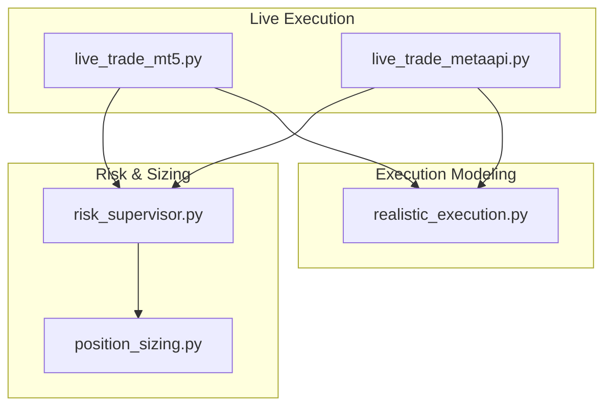
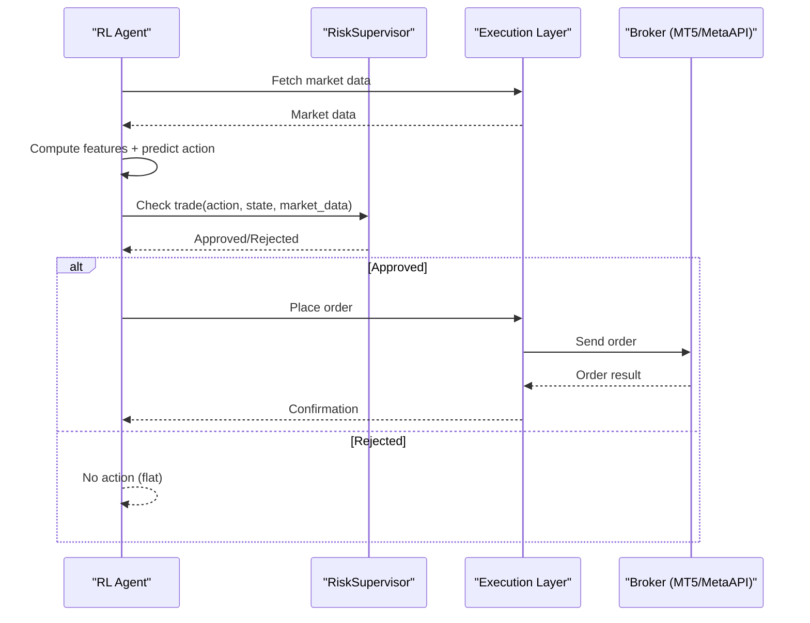
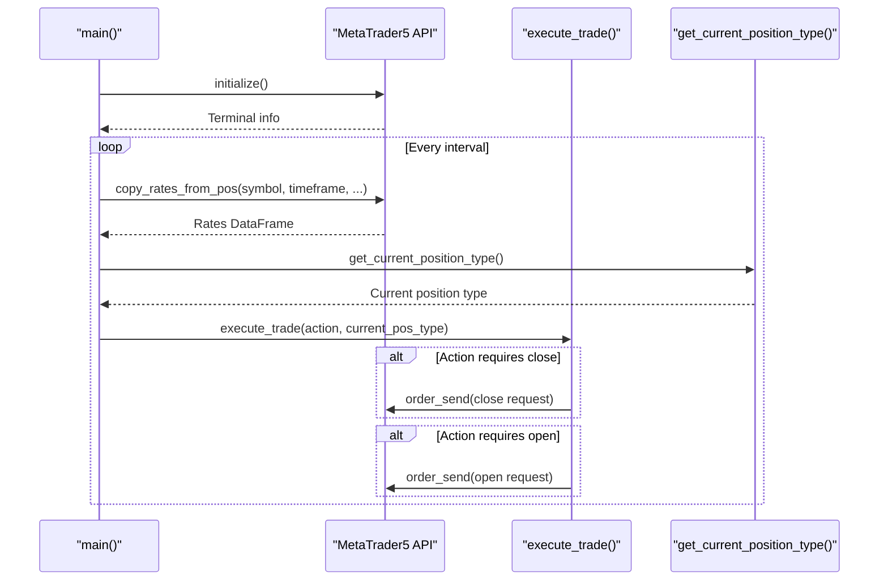
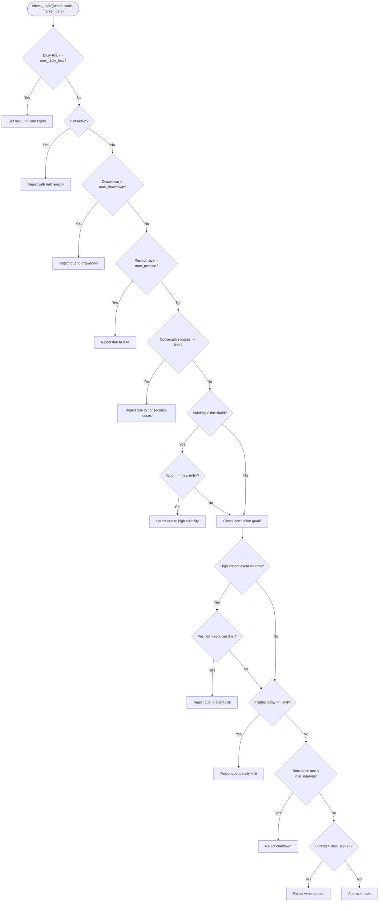
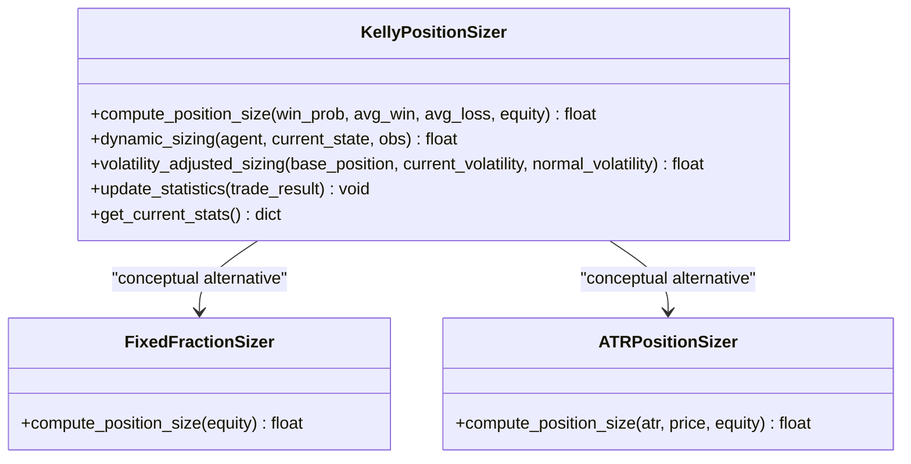
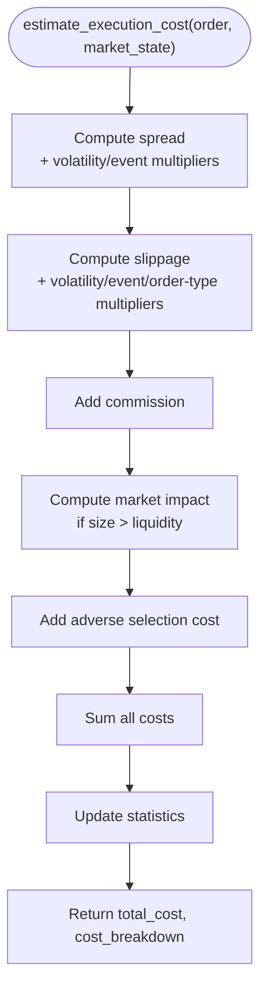
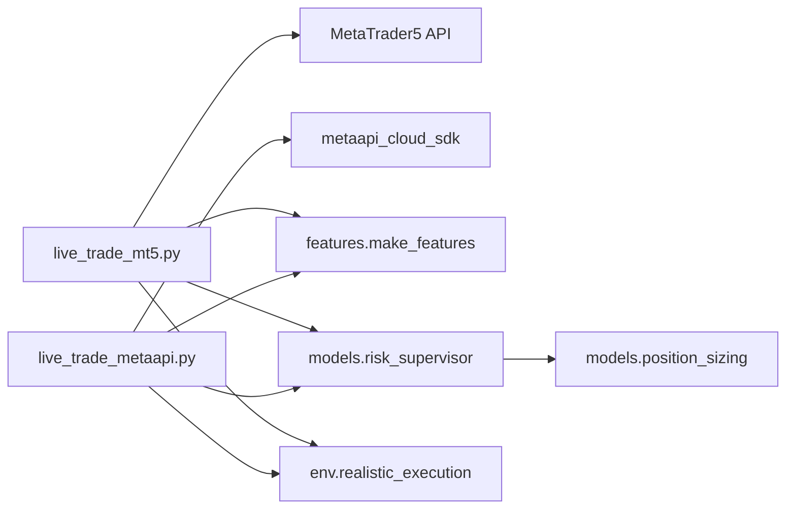

# Trading Execution API

<cite>
**Referenced Files in This Document**
- [live_trade_mt5.py](file://live/live_trade_mt5.py)
- [live_trade_metaapi.py](file://live/live_trade_metaapi.py)
- [position_sizing.py](file://models/position_sizing.py)
- [risk_supervisor.py](file://models/risk_supervisor.py)
- [realistic_execution.py](file://env/realistic_execution.py)
- [README.md](file://README.md)
- [SECURITY.md](file://SECURITY.md)
</cite>

## Table of Contents
1. [Introduction](#introduction)
2. [Project Structure](#project-structure)
3. [Core Components](#core-components)
4. [Architecture Overview](#architecture-overview)
5. [Detailed Component Analysis](#detailed-component-analysis)
6. [Dependency Analysis](#dependency-analysis)
7. [Performance Considerations](#performance-considerations)
8. [Troubleshooting Guide](#troubleshooting-guide)
9. [Conclusion](#conclusion)
10. [Appendices](#appendices)

## Introduction
This document provides detailed API documentation for live trading execution interfaces that integrate with MetaTrader 5 (MT5) and MetaAPI cloud trading. It covers order placement, position management, risk control mechanisms, position sizing algorithms, authentication and error handling, and production best practices for deploying trained models into live markets.

The system supports:
- Direct MT5 connectivity for local or VPS-based execution
- Cloud-based MetaAPI integration with robust reconnection and retry logic
- Deterministic risk supervision to prevent catastrophic losses
- Multiple position sizing methods including Kelly criterion, volatility targeting, and ATR-based sizing
- Realistic execution modeling for slippage, spread widening, market impact, and adverse selection

**Section sources**
- [README.md:135-156](file://README.md#L135-L156)

## Project Structure
The live trading execution layer is implemented under the live directory with two integrations:
- MetaTrader 5 direct execution
- MetaAPI cloud execution

Risk and sizing logic are encapsulated in the models directory, while realistic execution costs are modeled in the env directory.



**Diagram sources**
- [live_trade_mt5.py:1-174](file://live/live_trade_mt5.py#L1-L174)
- [live_trade_metaapi.py:1-231](file://live/live_trade_metaapi.py#L1-L231)
- [risk_supervisor.py:1-387](file://models/risk_supervisor.py#L1-L387)
- [position_sizing.py:1-399](file://models/position_sizing.py#L1-L399)
- [realistic_execution.py:1-356](file://env/realistic_execution.py#L1-L356)

**Section sources**
- [README.md:418-471](file://README.md#L418-L471)

## Core Components
- MetaTrader 5 Live Execution: Initializes platform, fetches market data, computes features, predicts actions, and executes orders via MT5 Python API.
- MetaAPI Cloud Execution: Authenticates via token and account ID, deploys and synchronizes accounts, manages connections, handles retries and timeouts, and executes orders through RPC.
- Risk Supervisor: Deterministic safety layer enforcing daily loss limits, drawdown protection, position size caps, volatility filters, event risk filters, trade frequency controls, and spread checks.
- Position Sizing: Implements Kelly criterion (fractional), fixed fraction, and ATR-based sizing; includes dynamic sizing using agent value estimates and volatility adjustments.
- Realistic Execution Model: Estimates total execution cost components (spread, slippage, commission, market impact, adverse selection) and simulates fill prices under varying market conditions.

**Section sources**
- [live_trade_mt5.py:11-174](file://live/live_trade_mt5.py#L11-L174)
- [live_trade_metaapi.py:23-231](file://live/live_trade_metaapi.py#L23-L231)
- [risk_supervisor.py:18-387](file://models/risk_supervisor.py#L18-L387)
- [position_sizing.py:29-399](file://models/position_sizing.py#L29-L399)
- [realistic_execution.py:24-356](file://env/realistic_execution.py#L24-L356)

## Architecture Overview
The execution architecture integrates model inference with broker connectivity and risk controls. The flow differs slightly between MT5 and MetaAPI but shares common steps: data acquisition, feature computation, action prediction, risk approval, and order execution.



**Diagram sources**
- [live_trade_mt5.py:111-174](file://live/live_trade_mt5.py#L111-L174)
- [live_trade_metaapi.py:135-231](file://live/live_trade_metaapi.py#L135-L231)
- [risk_supervisor.py:91-174](file://models/risk_supervisor.py#L91-L174)

## Detailed Component Analysis

### MetaTrader 5 Integration
- Connectivity: Initializes MT5 terminal, retrieves terminal info, and uses symbol tick data for pricing.
- Order Types and Execution Modes: Uses market deals with specific filling modes and time-in-force settings.
- Position Management: Detects current positions by symbol and magic number; closes existing positions before opening new ones when needed.
- Data Flow: Fetches recent candles, computes features, constructs observations, predicts actions, and executes trades based on policy.

Key behaviors:
- Open order request includes symbol, volume, type, price, deviation, magic, comment, time type, and filling mode.
- Close position request reverses side and targets the specific ticket.
- Current position detection filters by symbol and magic number to isolate managed positions.



**Diagram sources**
- [live_trade_mt5.py:21-109](file://live/live_trade_mt5.py#L21-L109)
- [live_trade_mt5.py:111-174](file://live/live_trade_mt5.py#L111-L174)

**Section sources**
- [live_trade_mt5.py:11-174](file://live/live_trade_mt5.py#L11-L174)

### MetaAPI Cloud Integration
- Authentication: Loads token and account ID from environment variables; initializes MetaApi client and resolves account region.
- Deployment and Synchronization: Ensures account is deployed, waits for deployment completion, establishes RPC connection, and synchronizes subscriptions.
- Connection Resilience: Implements retries, timeouts, and automatic reconnection on network issues; tests connection stability before starting the loop.
- Order Lifecycle: Creates market buy orders and closes positions by ID; logs results and handles exceptions gracefully.

```mermaid
sequenceDiagram
participant Loop as "trade_loop()"
participant API as "MetaApi Client"
participant Conn as "RPC Connection"
participant Step as "run_step()"
Loop->>API : get_account(ACCOUNT_ID)
API-->>Loop : Account object
alt Not deployed
Loop->>API : deploy()
Loop->>API : reload() until DEPLOYED
end
Loop->>Conn : connect()
Loop->>Conn : wait_synchronized()
loop Every step
Loop->>Step : run_step(account, connection, model)
Step->>Conn : get_historical_candles(...)
Step->>Conn : get_positions()
Step->>Conn : create_market_buy_order(...) or close_position(...)
Conn-->>Step : Order results
end
```

**Diagram sources**
- [live_trade_metaapi.py:135-231](file://live/live_trade_metaapi.py#L135-L231)
- [live_trade_metaapi.py:40-134](file://live/live_trade_metaapi.py#L40-L134)

**Section sources**
- [live_trade_metaapi.py:23-231](file://live/live_trade_metaapi.py#L23-L231)

### Risk Supervisor
- Circuit Breakers: Enforces daily loss limits and halts trading for a defined period if breached.
- Drawdown Protection: Monitors peak equity vs current equity to enforce maximum drawdown thresholds.
- Position Limits: Caps position sizes and reduces exposure during high-impact events.
- Volatility and Spread Filters: Prevents new entries during extreme volatility or wide spreads; allows exits only.
- Trade Frequency Controls: Limits trades per day and enforces minimum intervals to avoid churn.
- Correlation Guard: Rejects long entries when correlated assets move against the intended direction.



**Diagram sources**
- [risk_supervisor.py:91-174](file://models/risk_supervisor.py#L91-L174)

**Section sources**
- [risk_supervisor.py:18-387](file://models/risk_supervisor.py#L18-L387)

### Position Sizing Algorithms
- Kelly Criterion: Computes optimal fraction based on win probability and reward-to-risk ratio; applies fractional Kelly for safety and caps at maximum position.
- Dynamic Sizing: Uses agent’s value estimates to approximate win probability and adjusts sizing accordingly.
- Volatility Targeting: Scales base position inversely with current volatility relative to normal levels.
- Fixed Fraction: Simple constant risk per trade.
- ATR-Based: Derives position size from account risk percentage and stop distance measured in ATR units.



**Diagram sources**
- [position_sizing.py:29-399](file://models/position_sizing.py#L29-L399)

**Section sources**
- [position_sizing.py:29-399](file://models/position_sizing.py#L29-L399)

### Realistic Execution Modeling
- Cost Components: Spread, slippage, commission, market impact, adverse selection.
- Dynamic Adjustments: Spread and slippage widen during high volatility and news events; market impact scales with order size relative to liquidity.
- Fill Simulation: Adjusts entry price based on side and total cost; returns breakdown for analysis.



**Diagram sources**
- [realistic_execution.py:88-169](file://env/realistic_execution.py#L88-L169)

**Section sources**
- [realistic_execution.py:24-356](file://env/realistic_execution.py#L24-L356)

## Dependency Analysis
- MT5 Execution depends on MetaTrader5 Python API for market data and order submission.
- MetaAPI Execution depends on metaapi_cloud_sdk for account management and RPC operations.
- Both executions rely on feature computation modules and RL model inference.
- Risk Supervisor is independent and can wrap any agent to enforce deterministic safety rules.
- Position Sizers are modular and can be integrated into execution pipelines to determine appropriate sizing.



**Diagram sources**
- [live_trade_mt5.py:1-174](file://live/live_trade_mt5.py#L1-L174)
- [live_trade_metaapi.py:1-231](file://live/live_trade_metaapi.py#L1-L231)
- [risk_supervisor.py:1-387](file://models/risk_supervisor.py#L1-L387)
- [position_sizing.py:1-399](file://models/position_sizing.py#L1-L399)
- [realistic_execution.py:1-356](file://env/realistic_execution.py#L1-L356)

**Section sources**
- [live_trade_mt5.py:1-174](file://live/live_trade_mt5.py#L1-L174)
- [live_trade_metaapi.py:1-231](file://live/live_trade_metaapi.py#L1-L231)

## Performance Considerations
- Data Fetch Latency: Use reasonable history windows and handle timeouts; MetaAPI implementation includes retries and timeouts to mitigate network delays.
- Feature Computation: Ensure sufficient historical data to compute stable features; skip steps until enough data is available.
- Order Filling: Choose appropriate filling modes and deviations; monitor spreads and volatility to avoid poor fills.
- Risk Controls: Tighten parameters during high volatility or news events; use circuit breakers to prevent cascading losses.
- Execution Costs: Incorporate realistic execution modeling to set expectations for slippage and spread widening; adjust sizing accordingly.

[No sources needed since this section provides general guidance]

## Troubleshooting Guide
Common issues and recovery strategies:
- MT5 Initialization Failure: Check terminal connection and last error code; ensure correct symbol and timeframe configuration.
- Data Fetch Failures: Implement retries with backoff; log errors and continue after transient failures.
- MetaAPI Connection Issues: Auto-reconnect on timeout or “not connected” errors; wait for synchronization and subscription stabilization.
- Order Execution Errors: Log order send results and comments; handle partial fills and rejection reasons; verify magic numbers and symbols.
- Risk Supervisor Halts: Review daily PnL and drawdown metrics; reset counters at day boundaries; investigate rejection reasons.

**Section sources**
- [live_trade_mt5.py:111-174](file://live/live_trade_mt5.py#L111-L174)
- [live_trade_metaapi.py:40-231](file://live/live_trade_metaapi.py#L40-L231)
- [risk_supervisor.py:176-241](file://models/risk_supervisor.py#L176-L241)

## Conclusion
This trading execution API provides robust integrations with MT5 and MetaAPI, layered with deterministic risk supervision and flexible position sizing. By combining resilient connectivity, comprehensive error handling, and realistic execution modeling, the system supports safe and efficient deployment of trained models into live markets. Production deployments should emphasize secure credential management, continuous monitoring, and conservative risk parameters.

[No sources needed since this section summarizes without analyzing specific files]

## Appendices

### Practical Examples
- Deploying Trained Models to Live Trading:
  - Load the model and start the live loop; ensure sufficient data and feature computation before predicting actions.
  - For MT5, initialize the platform and confirm connectivity; for MetaAPI, authenticate and deploy the account before connecting.
- Handling Connection Failures:
  - Implement retries and timeouts; auto-reconnect on network issues; wait for synchronization before proceeding.
- Managing Order Lifecycle:
  - Close existing positions before opening new ones when necessary; verify order results and log outcomes.
- Error Recovery:
  - Catch exceptions around data fetching and order submission; log and continue; use risk supervisor to halt trading if thresholds are breached.

**Section sources**
- [live_trade_mt5.py:111-174](file://live/live_trade_mt5.py#L111-L174)
- [live_trade_metaapi.py:135-231](file://live/live_trade_metaapi.py#L135-L231)
- [risk_supervisor.py:91-174](file://models/risk_supervisor.py#L91-L174)

### Security Considerations and Best Practices
- API Key Management:
  - Store credentials in environment variables or .env files; never commit secrets to version control.
  - Rotate keys immediately if compromised; revoke and regenerate tokens in provider dashboards.
- Monitoring Best Practices:
  - Monitor connection health, order results, and risk supervisor alerts; track daily PnL and drawdown metrics.
  - Use separate keys for testing vs production; enable 2FA on broker accounts.
- Operational Security:
  - Restrict file permissions for sensitive files; use firewalls and VPNs for server access; keep dependencies updated.

**Section sources**
- [SECURITY.md:1-167](file://SECURITY.md#L1-L167)
- [README.md:264-292](file://README.md#L264-L292)