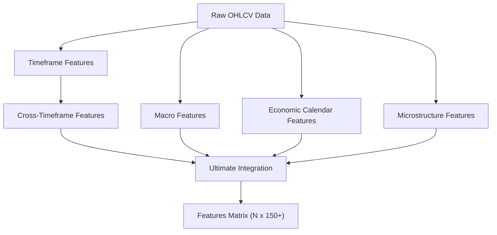
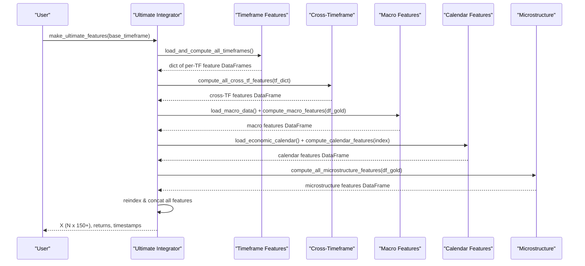
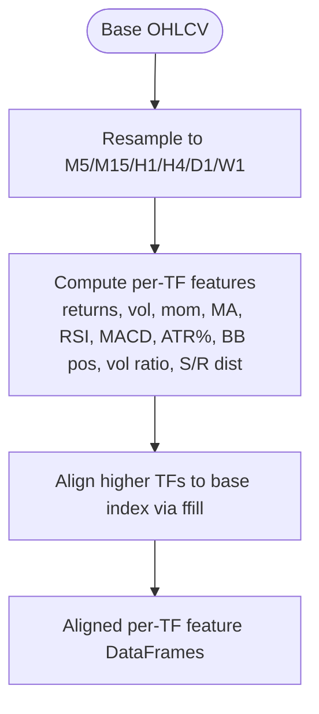
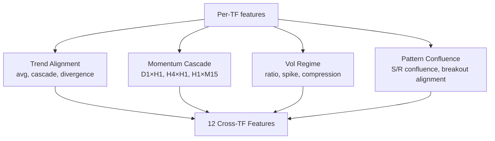
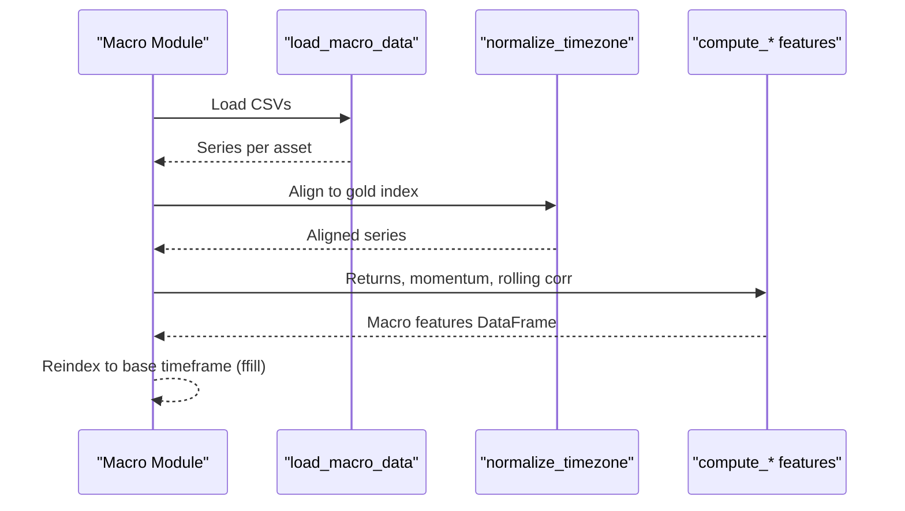
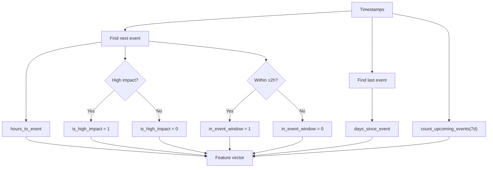
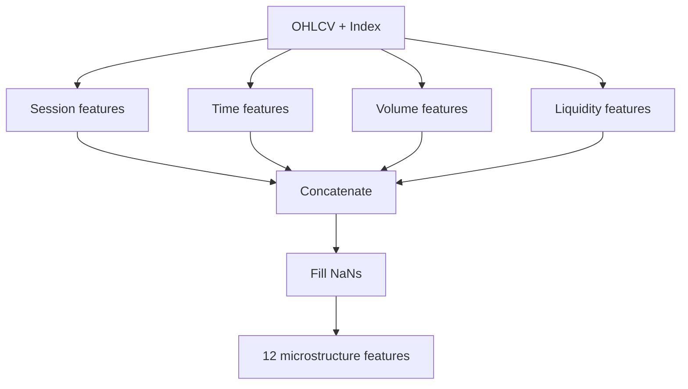
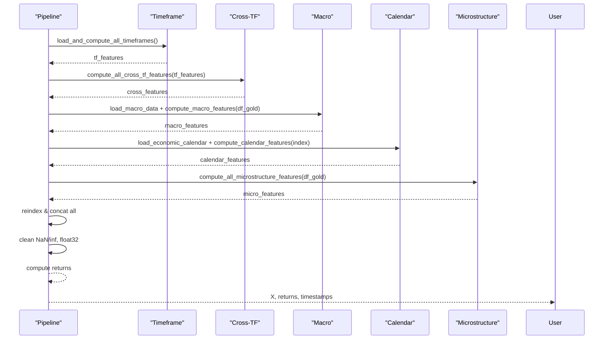
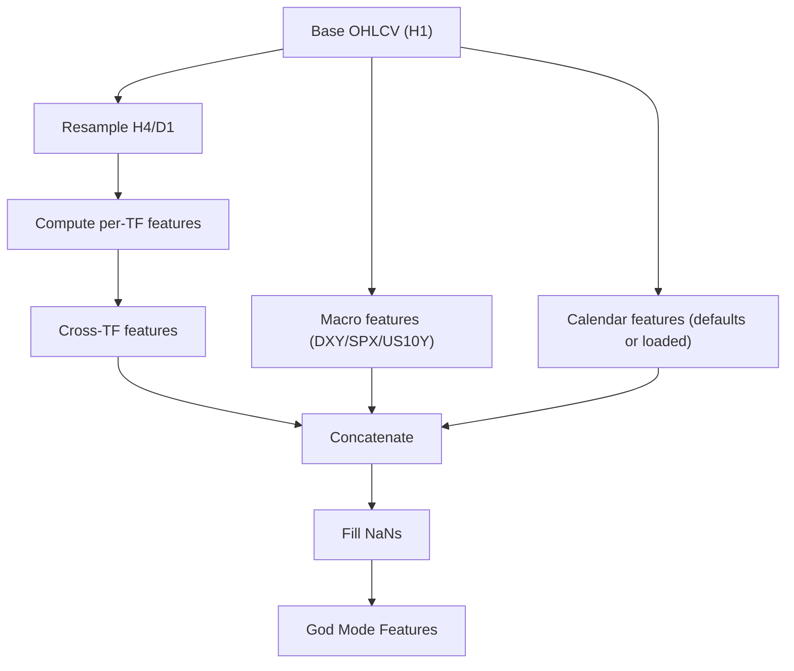
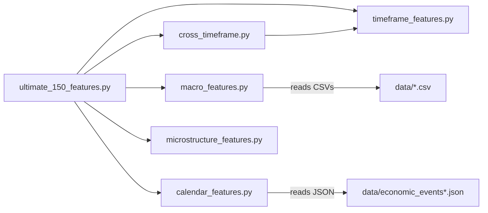

# Advanced Feature Engineering

<cite>
**Referenced Files in This Document**
- [god_mode_features.py](file://features/god_mode_features.py)
- [multi_timeframe.py](file://features/multi_timeframe.py)
- [cross_timeframe.py](file://features/cross_timeframe.py)
- [macro_features.py](file://features/macro_features.py)
- [calendar_features.py](file://features/calendar_features.py)
- [timeframe_features.py](file://features/timeframe_features.py)
- [microstructure_features.py](file://features/microstructure_features.py)
- [ultimate_150_features.py](file://features/ultimate_150_features.py)
- [economic_calendar.py](file://data/economic_calendar.py)
- [sentiment_analysis.py](file://data/sentiment_analysis.py)
- [make_features.py](file://features/make_features.py)
- [README.md](file://README.md)
</cite>

## Table of Contents
1. Introduction
2. Project Structure
3. Core Components
4. Architecture Overview
5. Detailed Component Analysis
6. Dependency Analysis
7. Performance Considerations
8. Troubleshooting Guide
9. Conclusion
10. Appendices

## Introduction
This document explains the advanced feature engineering system powering the autonomous trading platform. It covers:
- Developing custom technical indicators and extending existing modules
- Implementing multi-timeframe correlation analysis
- Building adaptive feature selection mechanisms
- The God Mode features system that integrates macro correlations, economic calendar awareness, and sentiment signals
- Practical examples for combining timeframes, optimizing computation, and validating new features
- Common pitfalls such as look-ahead bias, overfitting, and computational efficiency

The system produces a rich observation space (140+ features) by combining price action, technical indicators, cross-timeframe relationships, macro data, economic events, microstructure, and optional sentiment.

**Section sources**
- [README.md:73-120](file://README.md#L73-L120)

## Project Structure
The feature pipeline is modularized into specialized components that are orchestrated by an integration layer:
- Timeframe features: per-timeframe technicals and price/volume metrics
- Cross-timeframe features: trend alignment, momentum cascade, volatility regime, support/resistance confluence
- Macro features: DXY, SPX, US10Y, VIX, Oil, BTC, EURUSD, Silver/GLD with rolling correlations
- Economic calendar features: event timing, impact flags, expected volatility
- Microstructure features: session effects, time-of-day, volume profile, liquidity proxies
- Ultimate integration: combines all modules into a unified feature matrix aligned to a base timeframe
- God Mode: a streamlined pipeline producing 100+ features including macro and calendar context

**Diagram sources**
- [ultimate_150_features.py:47-154](file://features/ultimate_150_features.py#L47-L154)
- [timeframe_features.py:236-304](file://features/timeframe_features.py#L236-L304)
- [cross_timeframe.py:205-249](file://features/cross_timeframe.py#L205-L249)
- [macro_features.py:363-445](file://features/macro_features.py#L363-L445)
- [calendar_features.py:111-249](file://features/calendar_features.py#L111-L249)
- [microstructure_features.py:170-225](file://features/microstructure_features.py#L170-L225)

**Section sources**
- [ultimate_150_features.py:47-154](file://features/ultimate_150_features.py#L47-L154)
- [timeframe_features.py:236-304](file://features/timeframe_features.py#L236-L304)

## Core Components
- Multi-timeframe engine: resamples base data to M5/M15/H1/H4/D1/W1 and computes standardized technicals per timeframe
- Cross-timeframe intelligence: aggregates trends, momentum cascades, volatility regimes, and S/R confluence across timeframes
- Macro module: loads multiple macro series, aligns timestamps, computes returns/momentum/rolling correlations with gold
- Economic calendar: tracks upcoming events, flags high-impact windows, estimates expected volatility
- Microstructure: captures session effects, time-based patterns, volume imbalance, spread/liquidity proxies
- Ultimate integrator: concatenates all feature sets, aligns indices, cleans NaNs/infs, and outputs training-ready arrays
- God Mode: a focused pipeline that builds multi-TF, macro, and calendar features quickly for rapid iteration

Key responsibilities and entry points:
- Multi-timeframe: class-based API for creating features and cross-TF metrics
- Cross-timeframe: functions computing 12 composite features
- Macro: load_macro_data + compute_macro_features
- Calendar: load_economic_calendar + compute_calendar_features
- Microstructure: compute_all_microstructure_features
- Ultimate: make_ultimate_features orchestrating all modules
- God Mode: make_god_mode_features and make_features

**Section sources**
- [multi_timeframe.py:32-96](file://features/multi_timeframe.py#L32-L96)
- [cross_timeframe.py:205-249](file://features/cross_timeframe.py#L205-L249)
- [macro_features.py:26-75](file://features/macro_features.py#L26-L75)
- [calendar_features.py:23-50](file://features/calendar_features.py#L23-L50)
- [microstructure_features.py:170-225](file://features/microstructure_features.py#L170-L225)
- [ultimate_150_features.py:27-154](file://features/ultimate_150_features.py#L27-L154)
- [god_mode_features.py:291-379](file://features/god_mode_features.py#L291-L379)

## Architecture Overview
The architecture separates concerns into composable modules and an orchestrator that aligns all features to a common index (typically the fastest timeframe). Data flows from raw OHLCV through parallel pipelines and converge into a single feature matrix.

**Diagram sources**
- [ultimate_150_features.py:47-154](file://features/ultimate_150_features.py#L47-L154)
- [timeframe_features.py:236-304](file://features/timeframe_features.py#L236-L304)
- [cross_timeframe.py:205-249](file://features/cross_timeframe.py#L205-L249)
- [macro_features.py:363-445](file://features/macro_features.py#L363-L445)
- [calendar_features.py:111-249](file://features/calendar_features.py#L111-L249)
- [microstructure_features.py:170-225](file://features/microstructure_features.py#L170-L225)

## Detailed Component Analysis

### Multi-Timeframe Engine
- Resampling strategy: base OHLCV is resampled to M5/M15/H1/H4/D1/W1 using appropriate aggregation rules (open=first, high=max, low=min, close=last, volume=sum)
- Per-timeframe features: returns, volatility, momentum at multiple horizons, moving averages (fast/slow), trend direction, RSI, MACD, ATR%, Bollinger Band position, volume ratio, distance to recent high/low
- Alignment: higher timeframe features are forward-filled to the base timeframe to maintain temporal consistency without look-ahead

**Diagram sources**
- [multi_timeframe.py:350-396](file://features/multi_timeframe.py#L350-L396)
- [timeframe_features.py:22-99](file://features/timeframe_features.py#L22-L99)

**Section sources**
- [multi_timeframe.py:32-96](file://features/multi_timeframe.py#L32-L96)
- [timeframe_features.py:22-99](file://features/timeframe_features.py#L22-L99)

### Cross-Timeframe Intelligence
- Trend alignment: average trend across timeframes; strength cascade multiplies trends from higher to lower TF; divergence measured by std of trends
- Momentum cascade: product of momentum between adjacent or distant timeframes (e.g., D1×H1, H4×H1, H1×M15)
- Volatility regime: current vs long-term volatility ratio; spike/compression flags
- Pattern confluence: counts of TFs near support/resistance; breakout alignment when multiple TFs agree on momentum direction

**Diagram sources**
- [cross_timeframe.py:21-203](file://features/cross_timeframe.py#L21-L203)

**Section sources**
- [cross_timeframe.py:21-203](file://features/cross_timeframe.py#L21-L203)

### Macro Correlations
- Loads multiple macro series (DXY, SPX, US10Y, VIX, Oil, BTC, EURUSD, Silver, GLD)
- Normalizes timezone and aligns to gold timestamps
- Computes returns, momentum, and rolling correlations with gold (windowed)
- Aggregates into a unified macro feature set and forward-fills to intraday frequency

**Diagram sources**
- [macro_features.py:26-75](file://features/macro_features.py#L26-L75)
- [macro_features.py:78-132](file://features/macro_features.py#L78-L132)
- [macro_features.py:363-445](file://features/macro_features.py#L363-L445)

**Section sources**
- [macro_features.py:26-75](file://features/macro_features.py#L26-L75)
- [macro_features.py:363-445](file://features/macro_features.py#L363-L445)

### Economic Calendar Integration
- Loads JSON calendar with event times and impacts
- For each timestamp, finds next/past events, computes hours/days until event, flags high-impact windows, detects NFP/FOMC types
- Produces normalized features: hours_to_event, days_since_event, event_density, is_high_impact, in_event_window, expected_volatility_multiplier, type flags

**Diagram sources**
- [calendar_features.py:53-108](file://features/calendar_features.py#L53-L108)
- [calendar_features.py:111-249](file://features/calendar_features.py#L111-L249)

**Section sources**
- [calendar_features.py:23-50](file://features/calendar_features.py#L23-L50)
- [calendar_features.py:111-249](file://features/calendar_features.py#L111-L249)

### Market Microstructure
- Session effects: Asian/London/NY and overlap detection based on UTC hour
- Time effects: hour_of_day, day_of_week, week_of_month, month_of_year
- Volume analysis: rolling percentile profile and volume imbalance proxy
- Liquidity: spread proxy and regime classification relative to rolling average

**Diagram sources**
- [microstructure_features.py:22-167](file://features/microstructure_features.py#L22-L167)
- [microstructure_features.py:170-225](file://features/microstructure_features.py#L170-L225)

**Section sources**
- [microstructure_features.py:22-167](file://features/microstructure_features.py#L22-L167)
- [microstructure_features.py:170-225](file://features/microstructure_features.py#L170-L225)

### Ultimate Integration Pipeline
- Orchestrates all modules, aligns to base timeframe, concatenates, cleans NaNs/infs, converts to float32
- Computes target returns from base timeframe close prices
- Outputs training-ready arrays and metadata (timestamps)

**Diagram sources**
- [ultimate_150_features.py:47-182](file://features/ultimate_150_features.py#L47-L182)

**Section sources**
- [ultimate_150_features.py:27-182](file://features/ultimate_150_features.py#L27-L182)

### God Mode Features System
- Provides a streamlined path to 100+ features:
  - Multi-timeframe features (H1/H4/D1 derived from base)
  - Macro correlations (DXY, SPX, US10Y)
  - Economic calendar awareness (placeholder defaults if calendar unavailable)
- Offers both full multi-TF mode and faster single-TF mode
- Includes helper functions for quick testing and integration

**Diagram sources**
- [god_mode_features.py:53-131](file://features/god_mode_features.py#L53-L131)
- [god_mode_features.py:134-191](file://features/god_mode_features.py#L134-L191)
- [god_mode_features.py:194-232](file://features/god_mode_features.py#L194-L232)
- [god_mode_features.py:235-288](file://features/god_mode_features.py#L235-L288)
- [god_mode_features.py:291-379](file://features/god_mode_features.py#L291-L379)

**Section sources**
- [god_mode_features.py:291-379](file://features/god_mode_features.py#L291-L379)

### Custom Technical Indicators and Extensions
- Existing building blocks include RSI, MACD, ATR, Bollinger Bands, moving averages, and volume ratios
- To add a new indicator:
  - Implement a function that takes a price series and returns a normalized series
  - Integrate into compute_timeframe_features or a dedicated module
  - Ensure proper handling of initial NaNs and scaling
  - Validate no look-ahead bias by using only past data up to t

Example extension pattern:
- Add a new oscillator or volatility measure in timeframe_features.py
- Prefix columns with timeframe name to avoid collisions
- Update cross-timeframe logic if needed (e.g., include in trend alignment or momentum cascade)

**Section sources**
- [timeframe_features.py:102-178](file://features/timeframe_features.py#L102-L178)
- [multi_timeframe.py:98-156](file://features/multi_timeframe.py#L98-L156)

### Adaptive Feature Selection Mechanisms
- Use correlation stability and predictive power to select features:
  - Rolling correlation with target returns to detect non-stationarity
  - Feature importance from tree-based models (e.g., SHAP values)
  - Variance thresholding to drop near-constant features
  - Multicollapsing reduction via PCA or variance inflation factor checks
- Implement a selection step after cleaning and before training:
  - Drop features with high missingness or instability
  - Retain top-K features per regime or time window
  - Periodically re-evaluate and update the selected subset

[No sources needed since this section provides general guidance]

### Combining Multiple Timeframes Effectively
- Align higher timeframes to the base timeframe using forward-fill to avoid look-ahead
- Normalize features per timeframe to comparable scales
- Use cross-timeframe aggregations (trend alignment, momentum cascade) to capture hierarchical market structure
- Avoid mixing incompatible windows; ensure consistent lookback periods

**Section sources**
- [multi_timeframe.py:350-396](file://features/multi_timeframe.py#L350-L396)
- [timeframe_features.py:207-233](file://features/timeframe_features.py#L207-L233)

### Optimizing Feature Computation for Performance
- Vectorize operations using pandas/numpy rolling and ewm functions
- Minimize repeated computations by caching intermediate results
- Use efficient resampling and reindex strategies
- Convert to float32 to reduce memory footprint
- Process large datasets in chunks where possible

**Section sources**
- [ultimate_150_features.py:156-182](file://features/ultimate_150_features.py#L156-L182)
- [macro_features.py:363-445](file://features/macro_features.py#L363-L445)

### Validating New Feature Effectiveness
- Backtest with ablation studies: train with and without the new feature to measure impact
- Check feature stability: rolling mean/std, autocorrelation, and distribution shifts
- Evaluate predictive power: correlation with future returns, information coefficient, or model SHAP importance
- Guard against look-ahead bias: ensure all calculations use strictly past data

**Section sources**
- [ultimate_150_features.py:156-182](file://features/ultimate_150_features.py#L156-L182)
- [macro_features.py:114-132](file://features/macro_features.py#L114-L132)

## Dependency Analysis
The feature system exhibits clear separation of concerns with minimal coupling:
- Ultimate integrator depends on all submodules but they remain independent
- Cross-timeframe depends on per-timeframe outputs
- Macro and calendar modules depend on external data files
- Microstructure depends on OHLCV and DatetimeIndex

**Diagram sources**
- [ultimate_150_features.py:47-154](file://features/ultimate_150_features.py#L47-L154)
- [macro_features.py:26-75](file://features/macro_features.py#L26-L75)
- [calendar_features.py:23-50](file://features/calendar_features.py#L23-L50)

**Section sources**
- [ultimate_150_features.py:47-154](file://features/ultimate_150_features.py#L47-L154)

## Performance Considerations
- Memory usage: convert to float32 and avoid unnecessary copies
- Computation cost: prefer vectorized rolling operations; limit overly long windows
- I/O bottlenecks: batch read macro calendars and macro CSVs once per run
- Alignment overhead: minimize reindex operations; pre-align where possible
- Parallelization: consider parallelizing independent modules (macro, calendar, microstructure) if dataset size warrants it

[No sources needed since this section provides general guidance]

## Troubleshooting Guide
Common issues and resolutions:
- Missing macro data: macro module logs warnings and proceeds with available assets; ensure CSVs exist in data directory
- Timezone mismatches: normalize timezone-aware indexes to naive UTC before alignment
- NaN propagation: fill NaNs after each stage; verify final feature matrix has no NaNs/infs
- Calendar file not found: fallback defaults are used; provide a valid JSON calendar for accurate event features
- Look-ahead bias: confirm all rolling windows and resampling do not use future data; forward-fill higher TFs only

**Section sources**
- [macro_features.py:26-75](file://features/macro_features.py#L26-L75)
- [macro_features.py:78-112](file://features/macro_features.py#L78-L112)
- [calendar_features.py:23-50](file://features/calendar_features.py#L23-L50)
- [ultimate_150_features.py:156-182](file://features/ultimate_150_features.py#L156-L182)

## Conclusion
The feature engineering system provides a robust, modular foundation for advanced trading AI. By combining multi-timeframe analysis, macro correlations, economic calendar awareness, microstructure insights, and optional sentiment, it creates a comprehensive observation space. The ultimate integrator ensures alignment, cleanliness, and performance, while God Mode offers a fast path to high-quality features. Following best practices—avoiding look-ahead bias, validating feature stability, and optimizing computation—will improve model reliability and training efficiency.

[No sources needed since this section summarizes without analyzing specific files]

## Appendices

### Practical Examples

#### Extending Existing Feature Modules
- Add a new technical indicator to timeframe_features.py:
  - Implement a function returning a normalized series
  - Include in compute_timeframe_features with appropriate prefix
  - Validate with test_timeframe_features

**Section sources**
- [timeframe_features.py:22-99](file://features/timeframe_features.py#L22-L99)

#### Combining Multiple Timeframes Effectively
- Use create_multi_timeframe_data to generate M5/M15/H1/H4/D1 from base H1
- Apply MultiTimeframeFeatures.create_features to produce aligned features
- Leverage cross-timeframe functions for trend alignment and momentum cascade

**Section sources**
- [multi_timeframe.py:350-396](file://features/multi_timeframe.py#L350-L396)
- [multi_timeframe.py:32-96](file://features/multi_timeframe.py#L32-L96)

#### Optimizing Feature Computation
- Use vectorized rolling and ewm operations
- Convert to float32 early to save memory
- Align indices once and reuse across modules

**Section sources**
- [ultimate_150_features.py:156-182](file://features/ultimate_150_features.py#L156-L182)

#### Validating New Feature Effectiveness
- Perform ablation studies by removing the feature and measuring performance change
- Inspect rolling statistics and correlation stability
- Use model interpretability tools to assess feature importance

**Section sources**
- [ultimate_150_features.py:156-182](file://features/ultimate_150_features.py#L156-L182)

### God Mode Quickstart
- Use make_god_mode_features for rapid iteration with multi-TF, macro, and calendar features
- Switch to single-TF mode for speed during experiments

**Section sources**
- [god_mode_features.py:291-379](file://features/god_mode_features.py#L291-L379)

### Sentiment Analysis Integration
- Optional module supports FinBERT or keyword-based sentiment
- Aggregate news, Fed speech, and social sentiment into unified features
- Integrate into the pipeline as an additional feature group

**Section sources**
- [sentiment_analysis.py:22-235](file://data/sentiment_analysis.py#L22-L235)