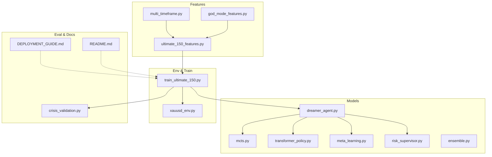
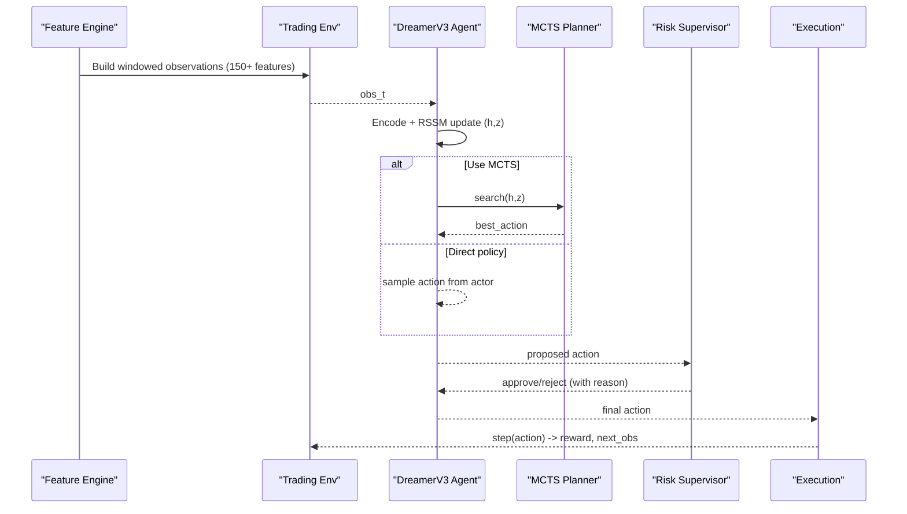
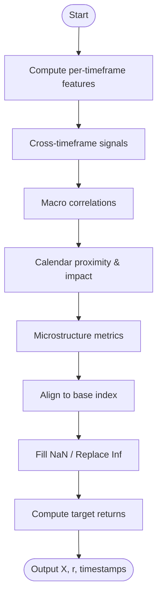
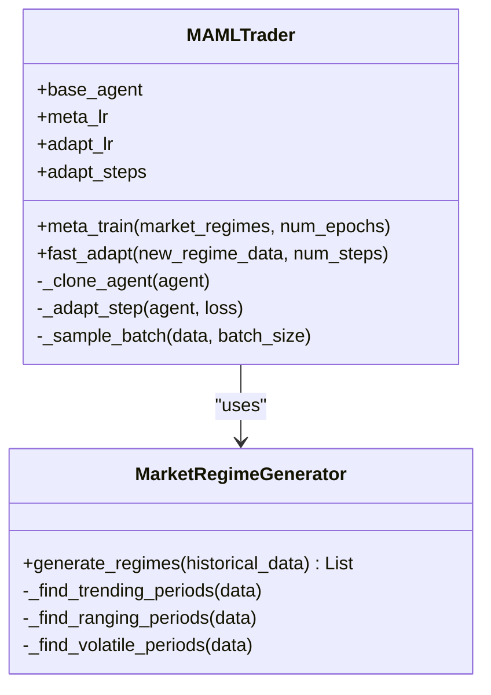
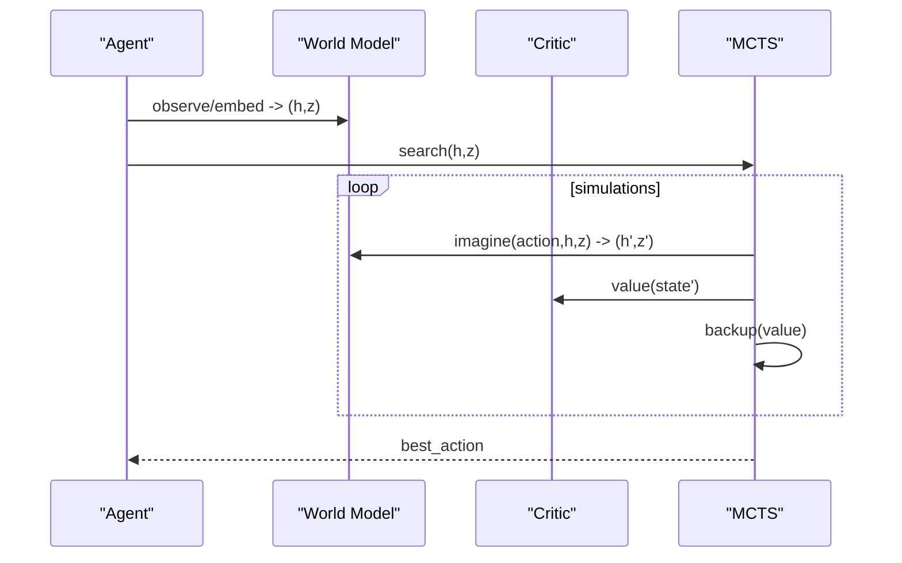
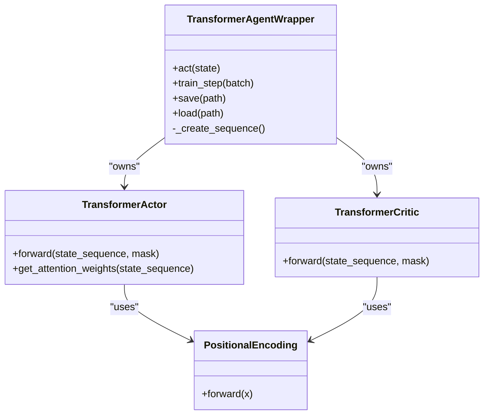
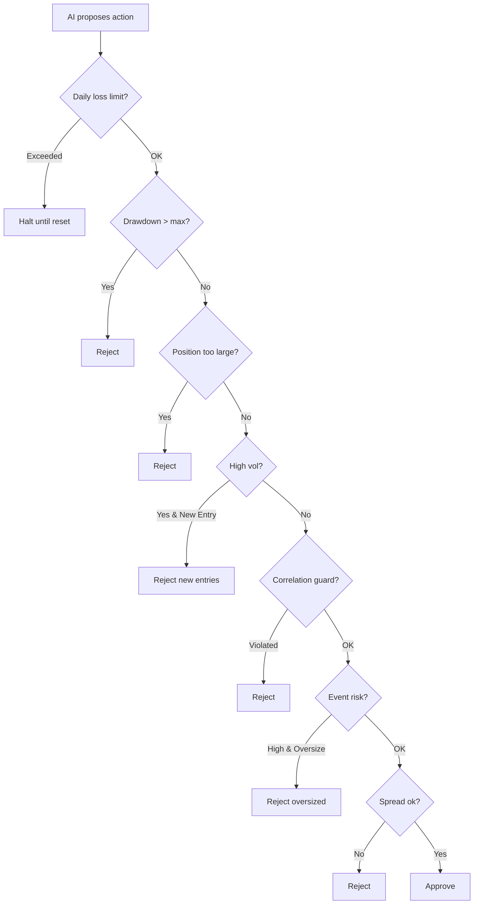
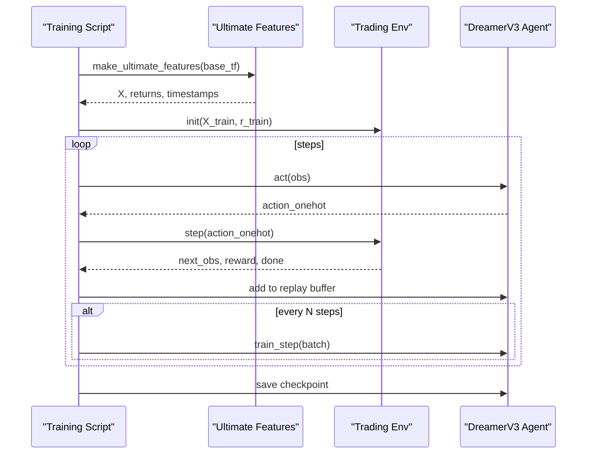
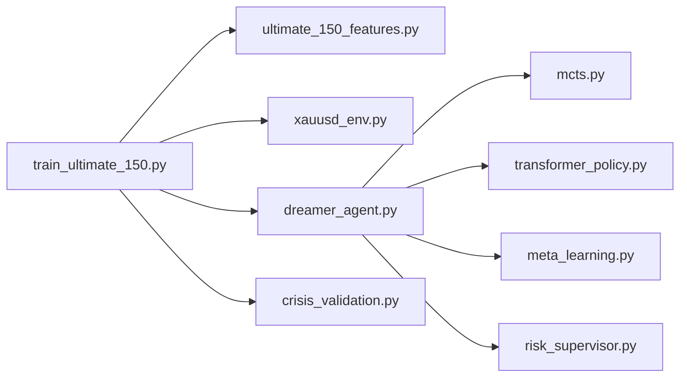

# Advanced Topics

<cite>
**Referenced Files in This Document**
- [README.md](file://README.md)
- [DEPLOYMENT_GUIDE.md](file://DEPLOYMENT_GUIDE.md)
- [features/multi_timeframe.py](file://features/multi_timeframe.py)
- [features/god_mode_features.py](file://features/god_mode_features.py)
- [features/ultimate_150_features.py](file://features/ultimate_150_features.py)
- [models/meta_learning.py](file://models/meta_learning.py)
- [models/mcts.py](file://models/mcts.py)
- [models/transformer_policy.py](file://models/transformer_policy.py)
- [models/risk_supervisor.py](file://models/risk_supervisor.py)
- [models/dreamer_agent.py](file://models/dreamer_agent.py)
- [env/xauusd_env.py](file://env/xauusd_env.py)
- [train/train_ultimate_150.py](file://train/train_ultimate_150.py)
- [eval/crisis_validation.py](file://eval/crisis_validation.py)
</cite>

## Table of Contents
1. Introduction
2. Project Structure
3. Core Components
4. Architecture Overview
5. Detailed Component Analysis
6. Dependency Analysis
7. Performance Considerations
8. Troubleshooting Guide
9. Conclusion
10. Appendices

## Introduction
This document provides expert-level guidance for extending and customizing the autonomous trading system. It focuses on advanced feature engineering (custom indicators, multi-timeframe correlation, adaptive selection), model customization (meta-learning, Monte Carlo Tree Search integration, transformer policy architectures), configuration and tuning, performance profiling, debugging complex interactions, research-level topics (regime detection, adaptive risk management, multi-objective optimization), and production-grade optimizations for large-scale experiments and deployment.

## Project Structure
The repository is organized by capability:
- features/: Multi-timeframe, macro, calendar, microstructure, and composite feature pipelines
- models/: RL agents (DreamerV3), meta-learning, MCTS planning, transformer policies, ensemble strategies, risk supervisor
- env/: Gymnasium environment for training and evaluation
- train/: Training scripts orchestrating data loading, environment setup, and agent training loops
- eval/: Validation utilities including crisis period testing
- live/: Live execution integrations (MT5, MetaAPI)
- docs and guides: Deployment and training instructions

**Diagram sources**
- [features/ultimate_150_features.py:27-226](file://features/ultimate_150_features.py#L27-L226)
- [train/train_ultimate_150.py:154-331](file://train/train_ultimate_150.py#L154-L331)
- [models/dreamer_agent.py:84-460](file://models/dreamer_agent.py#L84-L460)
- [models/mcts.py:118-293](file://models/mcts.py#L118-L293)
- [models/transformer_policy.py:67-373](file://models/transformer_policy.py#L67-L373)
- [models/meta_learning.py:32-171](file://models/meta_learning.py#L32-L171)
- [models/risk_supervisor.py:18-387](file://models/risk_supervisor.py#L18-L387)
- [env/xauusd_env.py:7-118](file://env/xauusd_env.py#L7-L118)
- [eval/crisis_validation.py:29-419](file://eval/crisis_validation.py#L29-L419)
- [DEPLOYMENT_GUIDE.md:1-192](file://DEPLOYMENT_GUIDE.md#L1-L192)
- [README.md:418-471](file://README.md#L418-L471)

**Section sources**
- [README.md:418-471](file://README.md#L418-L471)

## Core Components
- Feature pipeline: Multi-timeframe aggregation, cross-timeframe signals, macro correlations, economic calendar, microstructure metrics, and a master assembler producing 150+ features.
- Environment: A windowed observation space with cost-aware rewards and position dynamics.
- Agent: DreamerV3 world-model-based RL with replay buffer, imagination horizon, and actor-critic training.
- Planning: MCTS over latent states to improve action selection via lookahead.
- Policy alternatives: Transformer-based actor/critic that attend to historical sequences.
- Adaptation: Meta-learning wrapper for fast regime adaptation.
- Safety: Deterministic risk supervisor enforcing hard constraints.
- Evaluation: Crisis validation across known stress periods.

**Section sources**
- [features/multi_timeframe.py:32-347](file://features/multi_timeframe.py#L32-L347)
- [features/god_mode_features.py:53-379](file://features/god_mode_features.py#L53-L379)
- [features/ultimate_150_features.py:27-226](file://features/ultimate_150_features.py#L27-L226)
- [env/xauusd_env.py:7-118](file://env/xauusd_env.py#L7-L118)
- [models/dreamer_agent.py:84-460](file://models/dreamer_agent.py#L84-L460)
- [models/mcts.py:118-293](file://models/mcts.py#L118-L293)
- [models/transformer_policy.py:67-373](file://models/transformer_policy.py#L67-L373)
- [models/meta_learning.py:32-171](file://models/meta_learning.py#L32-L171)
- [models/risk_supervisor.py:18-387](file://models/risk_supervisor.py#L18-L387)
- [eval/crisis_validation.py:29-419](file://eval/crisis_validation.py#L29-L419)

## Architecture Overview
The system composes features into a high-dimensional state, feeds it into a world-model agent that learns market dynamics, then uses either direct policy sampling or MCTS planning to select actions. A risk supervisor enforces safety rules before execution.

**Diagram sources**
- [features/ultimate_150_features.py:27-226](file://features/ultimate_150_features.py#L27-L226)
- [env/xauusd_env.py:7-118](file://env/xauusd_env.py#L7-L118)
- [models/dreamer_agent.py:148-188](file://models/dreamer_agent.py#L148-L188)
- [models/mcts.py:145-193](file://models/mcts.py#L145-L193)
- [models/risk_supervisor.py:91-174](file://models/risk_supervisor.py#L91-L174)

## Detailed Component Analysis

### Advanced Feature Engineering
- Multi-timeframe analysis: Computes per-timeframe price action, momentum, volatility, moving averages, RSI, ATR, Bollinger positions, volume ratios; aggregates cross-timeframe trend alignment, momentum cascade, volatility regime, and support/resistance confluence.
- God Mode assembly: Combines timeframe features, macro correlations (DXY, SPX, US10Y), economic calendar proximity and impact flags, and microstructure metrics into a unified dataset aligned to a base frequency.
- Ultimate 150+: Orchestrates all modules, aligns indices, cleans NaN/Inf, computes returns, and outputs arrays ready for training.

Practical extension points:
- Add new indicators inside per-timeframe computation functions and register them in the aggregator.
- Introduce adaptive feature selection by computing feature importance online (e.g., SHAP or permutation importance) and masking low-signal columns during training/inference.
- Implement dynamic resampling windows based on realized volatility regimes to keep features scale-invariant.

**Diagram sources**
- [features/multi_timeframe.py:55-186](file://features/multi_timeframe.py#L55-L186)
- [features/god_mode_features.py:291-379](file://features/god_mode_features.py#L291-L379)
- [features/ultimate_150_features.py:27-226](file://features/ultimate_150_features.py#L27-L226)

**Section sources**
- [features/multi_timeframe.py:32-347](file://features/multi_timeframe.py#L32-L347)
- [features/god_mode_features.py:53-379](file://features/god_mode_features.py#L53-L379)
- [features/ultimate_150_features.py:27-226](file://features/ultimate_150_features.py#L27-L226)

### Model Customization: Meta-Learning (MAML)
- Purpose: Learn an initialization that adapts quickly to new market regimes using few gradient steps.
- Implementation highlights:
  - Wraps a base agent, performs inner-loop adaptation on sampled tasks (regimes), and updates the shared initialization via outer-loop meta-gradients.
  - Provides fast_adapt for online regime shifts.
- Usage pattern: Generate diverse regime tasks from historical data, meta-train, then adapt at inference time when regime changes are detected.

**Diagram sources**
- [models/meta_learning.py:32-171](file://models/meta_learning.py#L32-L171)
- [models/meta_learning.py:174-261](file://models/meta_learning.py#L174-L261)

**Section sources**
- [models/meta_learning.py:32-171](file://models/meta_learning.py#L32-L171)
- [models/meta_learning.py:174-261](file://models/meta_learning.py#L174-L261)

### Model Customization: Monte Carlo Tree Search Integration
- Purpose: Improve decision quality by simulating futures in the learned world model and selecting actions with higher expected value.
- Key elements:
  - MCTSNode stores state, prior, visit counts, and values; selects children via UCB.
  - MCTS expands nodes using the world model’s imagine function and evaluates leaf nodes via critic.
  - DreamerMCTSAgent integrates MCTS with DreamerV3, optionally falling back to direct actor sampling for speed.

**Diagram sources**
- [models/mcts.py:20-116](file://models/mcts.py#L20-L116)
- [models/mcts.py:118-243](file://models/mcts.py#L118-L243)
- [models/mcts.py:245-293](file://models/mcts.py#L245-L293)
- [models/dreamer_agent.py:148-188](file://models/dreamer_agent.py#L148-L188)

**Section sources**
- [models/mcts.py:118-293](file://models/mcts.py#L118-L293)

### Model Customization: Transformer-Based Policy
- Purpose: Replace MLP actor/critic with attention-based networks that can recall relevant historical patterns.
- Components:
  - PositionalEncoding for sequence order.
  - TransformerActor produces action logits from recent state sequences.
  - TransformerCritic estimates value from sequences.
  - Wrapper maintains a sliding buffer and constructs padded sequences for inference.

**Diagram sources**
- [models/transformer_policy.py:34-65](file://models/transformer_policy.py#L34-L65)
- [models/transformer_policy.py:67-163](file://models/transformer_policy.py#L67-L163)
- [models/transformer_policy.py:166-249](file://models/transformer_policy.py#L166-L249)
- [models/transformer_policy.py:252-373](file://models/transformer_policy.py#L252-L373)

**Section sources**
- [models/transformer_policy.py:67-373](file://models/transformer_policy.py#L67-L373)

### Risk Management and Adaptive Controls
- RiskSupervisor enforces deterministic safety rules: daily loss limits, drawdown protection, position sizing caps, volatility filters, correlation guards, event risk filters, trade rate limiting, spread checks, and market hours gating.
- SafeTradingAgent wraps any AI agent to enforce approvals before execution.

**Diagram sources**
- [models/risk_supervisor.py:91-174](file://models/risk_supervisor.py#L91-L174)
- [models/risk_supervisor.py:289-339](file://models/risk_supervisor.py#L289-L339)

**Section sources**
- [models/risk_supervisor.py:18-387](file://models/risk_supervisor.py#L18-L387)

### Environment and Training Loop
- Environment builds a windowed observation vector and applies cost-aware rewards with turnover penalties and stability nudges.
- Training script loads ultimate features, splits train/validation, instantiates the agent, pre-fills the replay buffer, and runs the main loop with periodic training and checkpointing.

**Diagram sources**
- [features/ultimate_150_features.py:27-226](file://features/ultimate_150_features.py#L27-L226)
- [env/xauusd_env.py:7-118](file://env/xauusd_env.py#L7-L118)
- [train/train_ultimate_150.py:154-331](file://train/train_ultimate_150.py#L154-L331)
- [models/dreamer_agent.py:190-304](file://models/dreamer_agent.py#L190-L304)

**Section sources**
- [env/xauusd_env.py:7-118](file://env/xauusd_env.py#L7-L118)
- [train/train_ultimate_150.py:154-331](file://train/train_ultimate_150.py#L154-L331)

### Research-Level Topics
- Regime detection: Use volatility regime features and trend alignment to segment regimes; integrate with meta-learning for fast adaptation.
- Adaptive risk management: Combine RiskSupervisor with regime-aware position sizing and event-window restrictions.
- Multi-objective optimization: Optimize for return, Sharpe, and drawdown simultaneously by combining scalarized objectives or Pareto-front tracking during training.

[No sources needed since this section synthesizes concepts without analyzing specific files]

## Dependency Analysis
Key dependencies and coupling:
- Training script depends on feature pipeline and agent implementation.
- MCTS depends on DreamerV3’s RSSM and actor/critic interfaces.
- Transformer policy can replace MLP components if integrated into the agent.
- RiskSupervisor is independent but must wrap agent calls in live loops.
- CrisisValidator tests agent behavior on historical crises.

**Diagram sources**
- [train/train_ultimate_150.py:154-331](file://train/train_ultimate_150.py#L154-L331)
- [features/ultimate_150_features.py:27-226](file://features/ultimate_150_features.py#L27-L226)
- [env/xauusd_env.py:7-118](file://env/xauusd_env.py#L7-L118)
- [models/dreamer_agent.py:84-460](file://models/dreamer_agent.py#L84-L460)
- [models/mcts.py:118-293](file://models/mcts.py#L118-L293)
- [models/transformer_policy.py:67-373](file://models/transformer_policy.py#L67-L373)
- [models/meta_learning.py:32-171](file://models/meta_learning.py#L32-L171)
- [models/risk_supervisor.py:18-387](file://models/risk_supervisor.py#L18-L387)
- [eval/crisis_validation.py:29-419](file://eval/crisis_validation.py#L29-L419)

**Section sources**
- [train/train_ultimate_150.py:154-331](file://train/train_ultimate_150.py#L154-L331)

## Performance Considerations
- Feature pipeline:
  - Prefer vectorized pandas/numpy operations; avoid row-wise loops.
  - Reuse computed rolling statistics across timeframes where possible.
  - Use float32 arrays to reduce memory footprint.
- Training:
  - Increase batch size within GPU memory limits; tune learning rates per component (world model vs actor/critic).
  - Use replay buffer prefetching and asynchronous collection to keep GPUs busy.
  - Enable mixed precision if supported by your hardware.
- MCTS:
  - Limit num_simulations at inference time; cache latent states when possible.
  - Parallelize tree expansions across actions.
- Transformers:
  - Sequence length impacts memory quadratically; use sliding windows and masking.
  - Gradient checkpointing for deep stacks.
- Production:
  - Deploy on lightweight VMs; run headless inference with minimal overhead.
  - Use process supervisors (systemd) for auto-restart and logging.

[No sources needed since this section provides general guidance]

## Troubleshooting Guide
Common issues and diagnostics:
- Feature pipeline NaN/Inf:
  - Ensure proper handling of initial warm-up periods; fill missing values consistently.
  - Validate alignment across timeframes before concatenation.
- Training divergence:
  - Check gradient norms and clip gradients; verify learning rates per network.
  - Inspect replay buffer composition and ensure sufficient diversity.
- MCTS instability:
  - Tune c_puct and gamma; validate world model predictions before planning.
- Risk supervisor rejections:
  - Review rejection reasons; adjust thresholds for spreads, volatility, and event windows.
- Crisis validation failures:
  - Analyze equity curves and drawdowns; consider conservative defaults during stress periods.

**Section sources**
- [features/ultimate_150_features.py:156-182](file://features/ultimate_150_features.py#L156-L182)
- [models/dreamer_agent.py:190-304](file://models/dreamer_agent.py#L190-L304)
- [models/mcts.py:145-243](file://models/mcts.py#L145-L243)
- [models/risk_supervisor.py:91-174](file://models/risk_supervisor.py#L91-L174)
- [eval/crisis_validation.py:236-317](file://eval/crisis_validation.py#L236-L317)

## Conclusion
This system offers a robust foundation for advanced trading automation. By leveraging multi-timeframe intelligence, world-model-based RL, planning via MCTS, and safe execution through a risk supervisor, you can build resilient strategies. Extend with meta-learning for rapid regime adaptation, transformer policies for long-range dependency modeling, and rigorous validation under crisis conditions. For production, prioritize efficient feature computation, scalable training, and reliable deployment practices.

[No sources needed since this section summarizes without analyzing specific files]

## Appendices

### Configuration Options for Fine-Tuning
- Training parameters:
  - Steps, batch size, device selection, learning rates, discount factor, entropy coefficient, number of parallel environments.
- Live trading parameters:
  - Risk per trade, daily loss limits, maximum positions, check intervals, slippage and spread thresholds.

**Section sources**
- [README.md:538-575](file://README.md#L538-L575)

### Performance Profiling Techniques
- Profile feature generation with timing logs to identify bottlenecks.
- Use PyTorch profiler to measure compute hotspots in world model and actor/critic updates.
- Monitor memory usage during MCTS planning and adjust simulation budgets accordingly.

[No sources needed since this section provides general guidance]

### Debugging Complex Interactions
- Log intermediate states (latent h/z) and MCTS visit counts to understand exploration/exploitation balance.
- Track risk supervisor decisions and reasons to diagnose overly restrictive or permissive settings.
- Use crisis validation to detect regime-specific weaknesses early.

**Section sources**
- [models/mcts.py:195-243](file://models/mcts.py#L195-L243)
- [models/risk_supervisor.py:243-285](file://models/risk_supervisor.py#L243-L285)
- [eval/crisis_validation.py:109-171](file://eval/crisis_validation.py#L109-L171)

### Production Deployment Optimizations
- Choose lightweight cloud instances; run headless inference with minimal dependencies.
- Use systemd services for auto-start and log rotation.
- Keep model sizes small and optimize inference paths (e.g., disable MCTS at peak load).

**Section sources**
- [DEPLOYMENT_GUIDE.md:1-192](file://DEPLOYMENT_GUIDE.md#L1-L192)