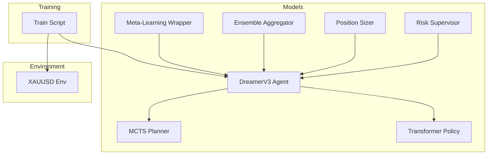
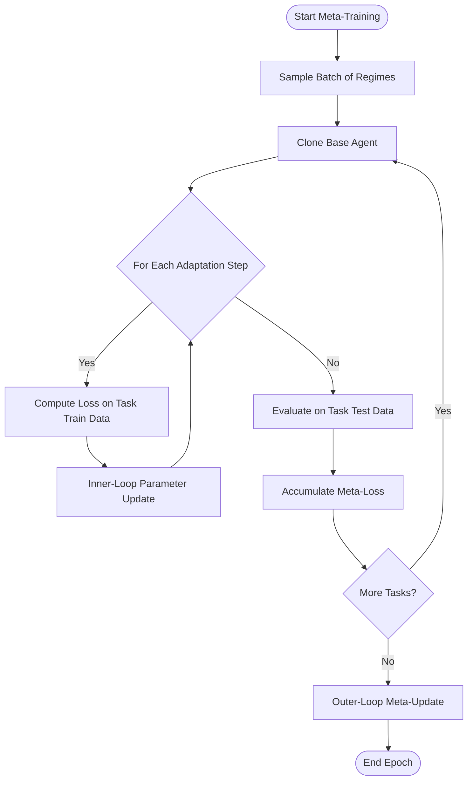
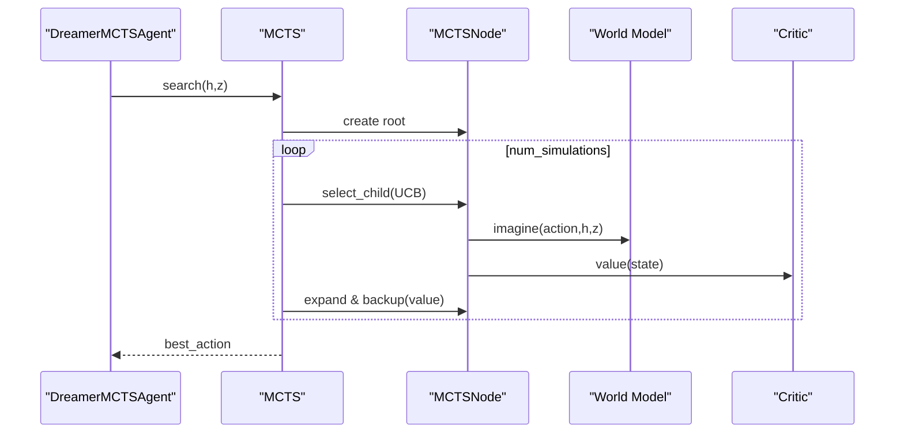
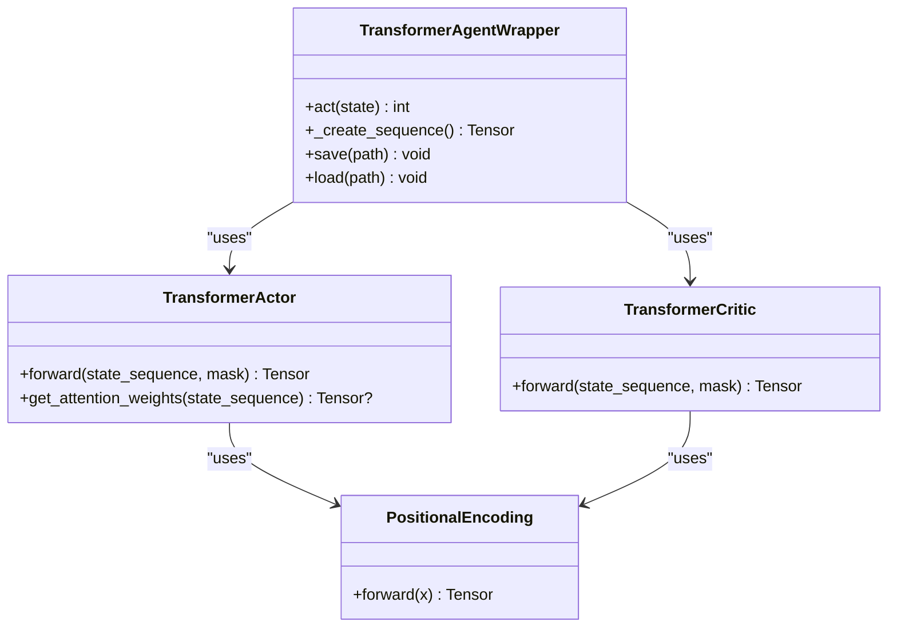
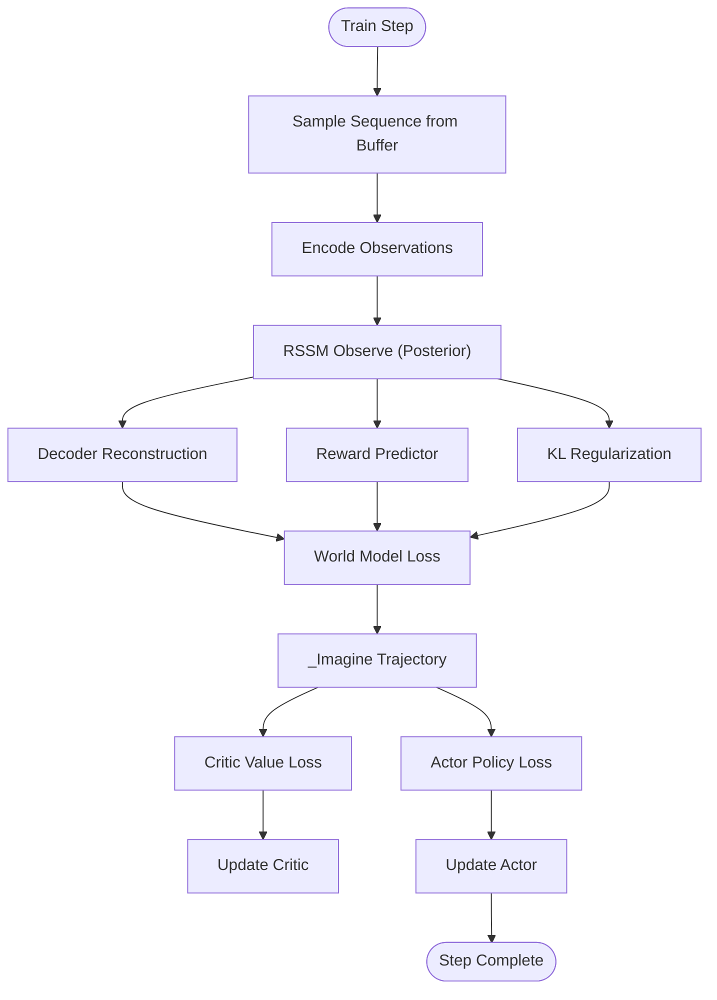
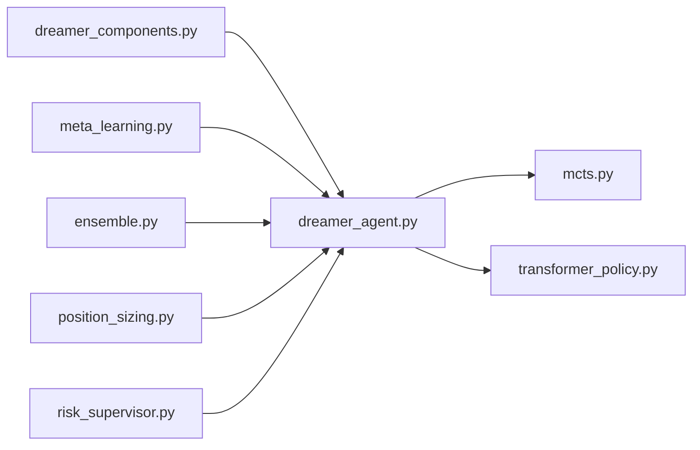

# Model Customization

<cite>
**Referenced Files in This Document**
- [models/meta_learning.py](file://models/meta_learning.py)
- [models/mcts.py](file://models/mcts.py)
- [models/transformer_policy.py](file://models/transformer_policy.py)
- [models/dreamer_agent.py](file://models/dreamer_agent.py)
- [models/dreamer_components.py](file://models/dreamer_components.py)
- [models/ensemble.py](file://models/ensemble.py)
- [models/position_sizing.py](file://models/position_sizing.py)
- [models/risk_supervisor.py](file://models/risk_supervisor.py)
- [train/train_dreamer.py](file://train/train_dreamer.py)
- [env/xauusd_env.py](file://env/xauusd_env.py)
</cite>

## Table of Contents
1. Introduction
2. Project Structure
3. Core Components
4. Architecture Overview
5. Detailed Component Analysis
6. Dependency Analysis
7. Performance Considerations
8. Troubleshooting Guide
9. Conclusion
10. Appendices

## Introduction
This document explains how to customize and extend the trading agent system with advanced model options: meta-learning for rapid adaptation, Monte Carlo Tree Search (MCTS) for lookahead planning, and transformer-based policy networks for improved sequence modeling. It also covers integrating ensemble methods, custom reward design, hyperparameter tuning, training stability techniques, and debugging complex interactions. The goal is to enable robust, extensible RL agents that can adapt quickly to new market regimes and make high-quality decisions under uncertainty.

## Project Structure
The repository organizes core components by capability:
- Models: DreamerV3 agent, MCTS planner, transformer policies, meta-learning wrapper, ensemble aggregator, position sizing, and risk supervisor
- Training: scripts to train DreamerV3 on XAUUSD features
- Environment: discrete long-only trading environment with realistic cost/reward shaping
- Features and data pipelines are used by training scripts



**Diagram sources**
- [models/dreamer_agent.py:84-147](file://models/dreamer_agent.py#L84-L147)
- [models/mcts.py:118-193](file://models/mcts.py#L118-L193)
- [models/transformer_policy.py:252-347](file://models/transformer_policy.py#L252-L347)
- [models/meta_learning.py:32-116](file://models/meta_learning.py#L32-L116)
- [models/ensemble.py:27-130](file://models/ensemble.py#L27-L130)
- [models/position_sizing.py:29-111](file://models/position_sizing.py#L29-L111)
- [models/risk_supervisor.py:18-174](file://models/risk_supervisor.py#L18-L174)
- [train/train_dreamer.py:128-208](file://train/train_dreamer.py#L128-L208)
- [env/xauusd_env.py:7-118](file://env/xauusd_env.py#L7-L118)

**Section sources**
- [models/dreamer_agent.py:84-147](file://models/dreamer_agent.py#L84-L147)
- [train/train_dreamer.py:128-208](file://train/train_dreamer.py#L128-L208)
- [env/xauusd_env.py:7-118](file://env/xauusd_env.py#L7-L118)

## Core Components
- DreamerV3 Agent: Learns a world model (encoder, RSSM, decoder, reward predictor) and an actor-critic policy trained via imagined rollouts. Includes replay buffer and two-phase training (world model + policy).
- MCTS Planner: Adds Stockfish-like lookahead using the world model to simulate futures and select actions based on visit counts and UCB selection.
- Transformer Policy: Provides attention-based actor/critic that models long-range dependencies in sequences of states.
- Meta-Learning Wrapper: Implements MAML-style meta-training over multiple market regimes to learn fast-adaptable initialization.
- Ensemble Aggregator: Trains diverse models and uses consensus voting with uncertainty estimation to improve robustness.
- Position Sizing: Implements Kelly Criterion and volatility-adjusted sizing to scale exposure safely.
- Risk Supervisor: Deterministic safety layer enforcing daily loss limits, drawdown protection, volatility filters, event risk, and more.

**Section sources**
- [models/dreamer_agent.py:84-403](file://models/dreamer_agent.py#L84-L403)
- [models/mcts.py:20-193](file://models/mcts.py#L20-L193)
- [models/transformer_policy.py:34-347](file://models/transformer_policy.py#L34-L347)
- [models/meta_learning.py:32-171](file://models/meta_learning.py#L32-L171)
- [models/ensemble.py:27-180](file://models/ensemble.py#L27-L180)
- [models/position_sizing.py:29-336](file://models/position_sizing.py#L29-L336)
- [models/risk_supervisor.py:18-339](file://models/risk_supervisor.py#L18-L339)

## Architecture Overview
The system combines model-based RL with search and attention:
- World model learns latent dynamics from observations; actor samples actions; critic estimates values.
- MCTS explores action space by simulating futures using the world model and selecting actions with highest visit counts.
- Transformer policy replaces MLP actor/critic to capture temporal patterns across sequences.
- Meta-learning adapts the base agent rapidly to new regimes; ensemble aggregates multiple agents for robust decisions; risk supervisor enforces hard constraints.

```mermaid
sequenceDiagram
participant Env as "Trading Env"
participant Agent as "DreamerV3 Agent"
participant MCTS as "MCTS Planner"
participant WM as "World Model (RSSM)"
participant Actor as "Actor"
participant Critic as "Critic"
Env->>Agent : obs
Agent->>WM : encode(obs), observe(h,z)
WM-->>Agent : h,z
alt Use MCTS
Agent->>MCTS : search(h,z)
MCTS->>WM : imagine(action,h,z)
MCTS->>Critic : value(state)
MCTS-->>Agent : best_action
else Direct policy
Agent->>Actor : sample(state)
Actor-->>Agent : action
end
Agent-->>Env : action
Env-->>Agent : next_obs, reward, done
```

**Diagram sources**
- [models/dreamer_agent.py:148-188](file://models/dreamer_agent.py#L148-L188)
- [models/mcts.py:145-193](file://models/mcts.py#L145-L193)
- [models/dreamer_components.py:92-186](file://models/dreamer_components.py#L92-L186)

## Detailed Component Analysis

### Meta-Learning Framework (MAML)
- Purpose: Learn an initialization that enables rapid adaptation to new market regimes with few gradient steps.
- Key classes:
  - MAMLTrader: Wraps a base agent, performs inner-loop adaptation per task and outer-loop meta-update across tasks.
  - MarketRegimeGenerator: Generates regime-specific datasets (trending, ranging, volatile) for meta-training.
- Training loop:
  - Sample batch of regimes
  - For each regime, clone agent, perform K adaptation steps on task train data
  - Evaluate adapted agent on task test data to compute meta-loss
  - Update base agent parameters via meta-optimizer
- Fast adaptation: Apply K steps on new regime data to quickly specialize.



**Diagram sources**
- [models/meta_learning.py:66-116](file://models/meta_learning.py#L66-L116)
- [models/meta_learning.py:117-147](file://models/meta_learning.py#L117-L147)

**Section sources**
- [models/meta_learning.py:32-171](file://models/meta_learning.py#L32-L171)
- [models/meta_learning.py:174-261](file://models/meta_learning.py#L174-L261)

### Monte Carlo Tree Search Integration
- Purpose: Improve decision quality by exploring future trajectories using the world model before acting.
- Key classes:
  - MCTSNode: Represents state-action nodes with prior, value, and children; supports UCB selection and backup.
  - MCTS: Orchestrates selection, expansion, simulation, and backpropagation; returns best action by visit count.
  - DreamerMCTSAgent: Integrates MCTS with DreamerV3; optionally switches between MCTS and direct actor sampling.
- Planning flow:
  - Selection: Traverse tree using UCB formula balancing Q-value and exploration bonus
  - Expansion: Expand leaf node using world model imagination and policy priors
  - Simulation: Evaluate leaf using critic value
  - Backpropagation: Update ancestors with discounted rewards and values



**Diagram sources**
- [models/mcts.py:20-116](file://models/mcts.py#L20-L116)
- [models/mcts.py:118-193](file://models/mcts.py#L118-L193)
- [models/mcts.py:245-291](file://models/mcts.py#L245-L291)

**Section sources**
- [models/mcts.py:20-291](file://models/mcts.py#L20-L291)

### Transformer-Based Policy Networks
- Purpose: Capture long-range temporal dependencies using self-attention for better sequence modeling.
- Key classes:
  - PositionalEncoding: Adds sinusoidal positional encodings to embeddings.
  - TransformerActor: Produces action logits from sequences of states.
  - TransformerCritic: Estimates state values from sequences.
  - TransformerAgentWrapper: Manages state buffer, creates sequences, and runs inference.
- Benefits: Attention identifies relevant historical patterns; multi-head attention captures diverse aspects; positional encoding preserves order.



**Diagram sources**
- [models/transformer_policy.py:34-163](file://models/transformer_policy.py#L34-L163)
- [models/transformer_policy.py:166-249](file://models/transformer_policy.py#L166-L249)
- [models/transformer_policy.py:252-347](file://models/transformer_policy.py#L252-L347)

**Section sources**
- [models/transformer_policy.py:34-347](file://models/transformer_policy.py#L34-L347)

### DreamerV3 Agent and Components
- Purpose: Model-based RL agent that learns world dynamics and improves policy via imagination.
- Key components:
  - Encoder/RSSM/Decoder: Encode observations, infer latent dynamics, reconstruct observations.
  - RewardPredictor: Predicts rewards in latent space.
  - Actor/Critic: Policy and value networks trained on imagined trajectories.
  - ReplayBuffer: Stores transitions and samples sequences for training.
- Training phases:
  - Phase 1: Train world model (reconstruction, reward prediction, KL regularization)
  - Phase 2: Imagine trajectories and train actor-critic using lambda-returns and policy gradients



**Diagram sources**
- [models/dreamer_agent.py:190-304](file://models/dreamer_agent.py#L190-L304)
- [models/dreamer_components.py:71-205](file://models/dreamer_components.py#L71-L205)
- [models/dreamer_components.py:227-294](file://models/dreamer_components.py#L227-L294)

**Section sources**
- [models/dreamer_agent.py:84-403](file://models/dreamer_agent.py#L84-L403)
- [models/dreamer_components.py:71-294](file://models/dreamer_components.py#L71-L294)

### Ensemble Methods
- Purpose: Increase robustness by aggregating predictions from diverse models and measuring uncertainty.
- Key behaviors:
  - Create multiple models with varied seeds/architectures
  - Vote on actions; require consensus threshold to trade
  - Compute entropy-based uncertainty from vote distribution
- Benefits: Reduces overfitting, provides uncertainty estimates, improves generalization

**Section sources**
- [models/ensemble.py:27-180](file://models/ensemble.py#L27-L180)

### Position Sizing and Risk Management
- Position Sizing:
  - Kelly Criterion computes optimal fraction based on win probability and risk/reward ratio
  - Volatility-adjusted sizing scales positions inversely with current volatility
  - Fixed fraction and ATR-based sizing provide alternatives
- Risk Supervisor:
  - Enforces hard constraints: daily loss limits, max drawdown, position caps, volatility filters, event risk, spread checks, trade frequency limits
  - Provides approval/rejection with reasons and statistics
  - SafeTradingAgent wraps AI agent to enforce safety

**Section sources**
- [models/position_sizing.py:29-336](file://models/position_sizing.py#L29-L336)
- [models/risk_supervisor.py:18-339](file://models/risk_supervisor.py#L18-L339)

## Dependency Analysis
- DreamerV3 depends on dreamer_components for encoder, RSSM, decoder, reward predictor, actor, critic
- MCTS depends on DreamerV3’s world model and actor/critic for planning
- Transformer policy can replace MLP actor/critic for sequence-aware modeling
- Meta-learning wraps any base agent to enable fast adaptation
- Ensemble aggregates multiple agents for consensus decisions
- Position sizing and risk supervisor operate as post-processing layers to control exposure and safety



**Diagram sources**
- [models/dreamer_components.py:71-294](file://models/dreamer_components.py#L71-L294)
- [models/dreamer_agent.py:84-147](file://models/dreamer_agent.py#L84-L147)
- [models/mcts.py:118-193](file://models/mcts.py#L118-L193)
- [models/transformer_policy.py:252-347](file://models/transformer_policy.py#L252-L347)
- [models/meta_learning.py:32-116](file://models/meta_learning.py#L32-L116)
- [models/ensemble.py:27-130](file://models/ensemble.py#L27-L130)
- [models/position_sizing.py:29-111](file://models/position_sizing.py#L29-L111)
- [models/risk_supervisor.py:18-174](file://models/risk_supervisor.py#L18-L174)

**Section sources**
- [models/dreamer_agent.py:84-147](file://models/dreamer_agent.py#L84-L147)
- [models/mcts.py:118-193](file://models/mcts.py#L118-L193)
- [models/transformer_policy.py:252-347](file://models/transformer_policy.py#L252-L347)
- [models/meta_learning.py:32-116](file://models/meta_learning.py#L32-L116)
- [models/ensemble.py:27-130](file://models/ensemble.py#L27-L130)
- [models/position_sizing.py:29-111](file://models/position_sizing.py#L29-L111)
- [models/risk_supervisor.py:18-174](file://models/risk_supervisor.py#L18-L174)

## Performance Considerations
- MCTS computational cost scales with number of simulations; tune num_simulations for latency vs accuracy tradeoff
- Transformer attention complexity grows with sequence length; choose seq_len carefully
- DreamerV3 training involves two-phase updates; ensure sufficient replay buffer size and appropriate batch sizes
- Gradient clipping is applied to stabilize training; monitor loss magnitudes
- Ensemble increases inference time linearly with number of models; balance diversity and speed

[No sources needed since this section provides general guidance]

## Troubleshooting Guide
- MCTS issues:
  - If no children are expanded, verify world model imagination and policy priors are computed correctly
  - Check UCB constant c_puct to balance exploration/exploitation
- Transformer policy:
  - Ensure sequence padding and masking are correct; validate input shapes
  - Monitor attention weights if available for interpretability
- Meta-learning:
  - Verify inner-loop adaptation steps and learning rates; too aggressive adaptation can destabilize
  - Ensure regime generation produces meaningful train/test splits
- DreamerV3:
  - Watch reconstruction and reward losses; divergence may indicate unstable world model
  - Tune free_nats and kl_balance to prevent posterior collapse
- Ensemble:
  - High disagreement indicates uncertainty; consider reducing position size or halting
- Risk supervisor:
  - Frequent rejections suggest overly conservative thresholds; adjust daily loss limits, volatility thresholds, or spread filters
  - Track rejection reasons to identify common failure modes

**Section sources**
- [models/mcts.py:145-193](file://models/mcts.py#L145-L193)
- [models/transformer_policy.py:297-347](file://models/transformer_policy.py#L297-L347)
- [models/meta_learning.py:66-147](file://models/meta_learning.py#L66-L147)
- [models/dreamer_agent.py:190-304](file://models/dreamer_agent.py#L190-L304)
- [models/ensemble.py:67-130](file://models/ensemble.py#L67-L130)
- [models/risk_supervisor.py:91-174](file://models/risk_supervisor.py#L91-L174)

## Conclusion
The system provides a flexible foundation for advanced model customization:
- Meta-learning enables rapid adaptation to new regimes with few examples
- MCTS adds powerful lookahead planning using the learned world model
- Transformer policies improve sequence modeling through attention mechanisms
- Ensemble methods enhance robustness and provide uncertainty estimates
- Position sizing and risk supervision ensure safe and controlled trading behavior
By combining these components, you can implement novel training strategies, integrate advanced search techniques, and tune hyperparameters for stable and effective trading agents.

[No sources needed since this section summarizes without analyzing specific files]

## Appendices

### Practical Examples and Extensions
- Modify existing RL algorithms:
  - Replace MLP actor/critic with transformer variants for sequence-aware decisions
  - Integrate MCTS into the agent’s act method to plan before executing
  - Wrap base agent with meta-learning to support fast adaptation
- Implement custom reward functions:
  - Adjust environment reward shaping to penalize turnover, encourage holding, or incorporate transaction costs
  - Use symlog/symexp transformations for stable reward prediction
- Integrate ensemble methods:
  - Train multiple agents with different seeds and architectures
  - Use consensus voting and uncertainty measures to gate trades
- Configuration options for hyperparameter tuning:
  - MCTS: num_simulations, c_puct, gamma
  - Transformer: hidden_dim, num_heads, num_layers, seq_len, dropout
  - DreamerV3: embed_dim, hidden_dim, stoch_dim, num_categories, lr_* rates, gamma, lambda_, horizon, free_nats, kl_balance
  - Meta-learning: meta_lr, adapt_lr, adapt_steps
  - Ensemble: num_models, consensus_threshold
  - Position sizing: max_position, kelly_fraction, account_risk, atr_multiplier
  - Risk supervisor: max_daily_loss, max_drawdown, vol_threshold, max_spread, max_trades_per_day, min_trade_interval, max_consecutive_losses

**Section sources**
- [models/mcts.py:126-136](file://models/mcts.py#L126-L136)
- [models/transformer_policy.py:74-85](file://models/transformer_policy.py#L74-L85)
- [models/dreamer_agent.py:91-111](file://models/dreamer_agent.py#L91-L111)
- [models/meta_learning.py:39-53](file://models/meta_learning.py#L39-L53)
- [models/ensemble.py:35-43](file://models/ensemble.py#L35-L43)
- [models/position_sizing.py:41-54](file://models/position_sizing.py#L41-L54)
- [models/risk_supervisor.py:44-55](file://models/risk_supervisor.py#L44-L55)
- [env/xauusd_env.py:21-31](file://env/xauusd_env.py#L21-L31)