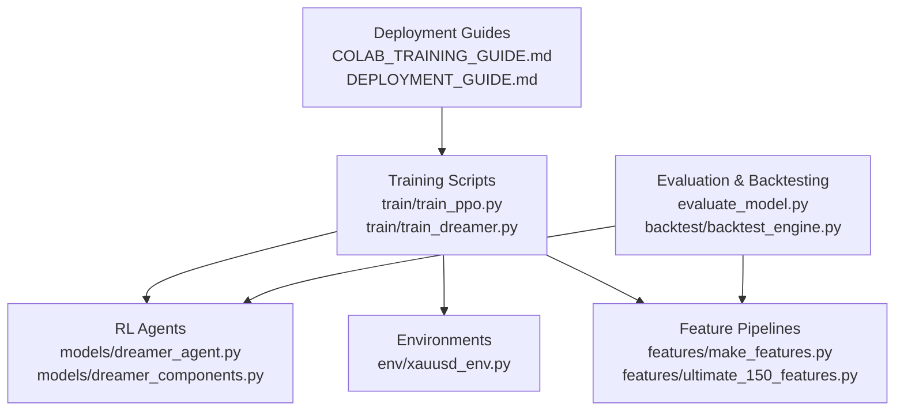
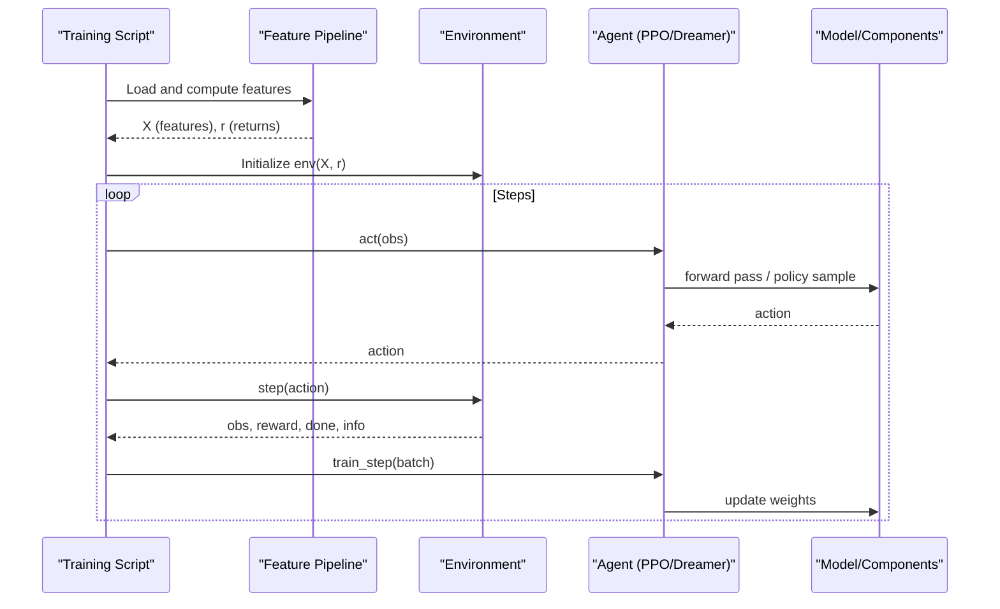
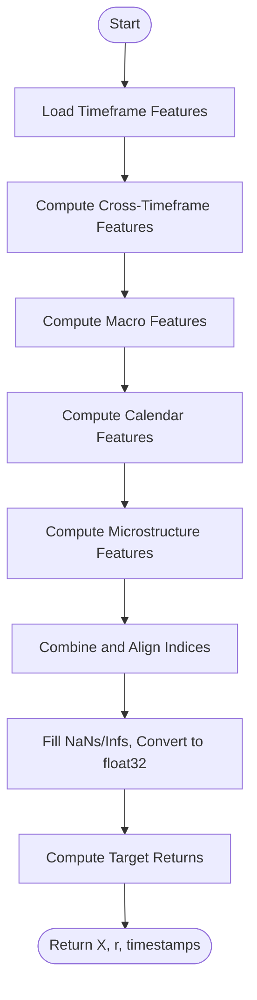
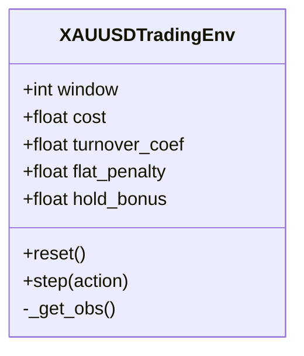
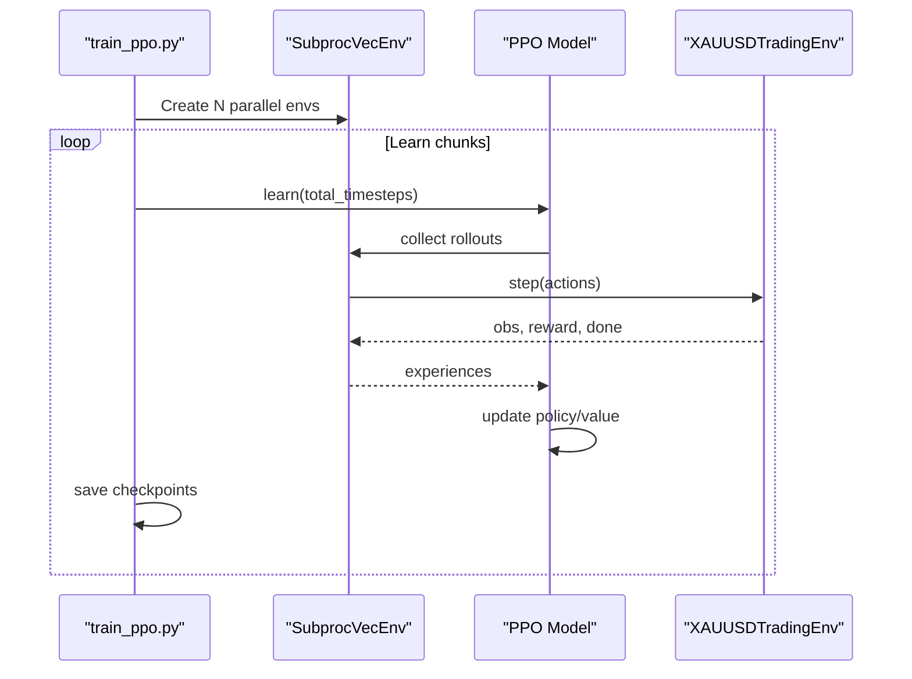
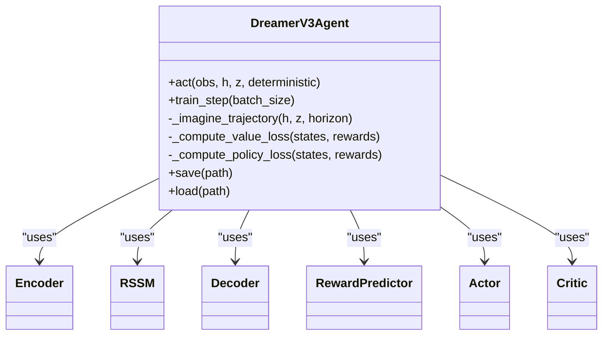
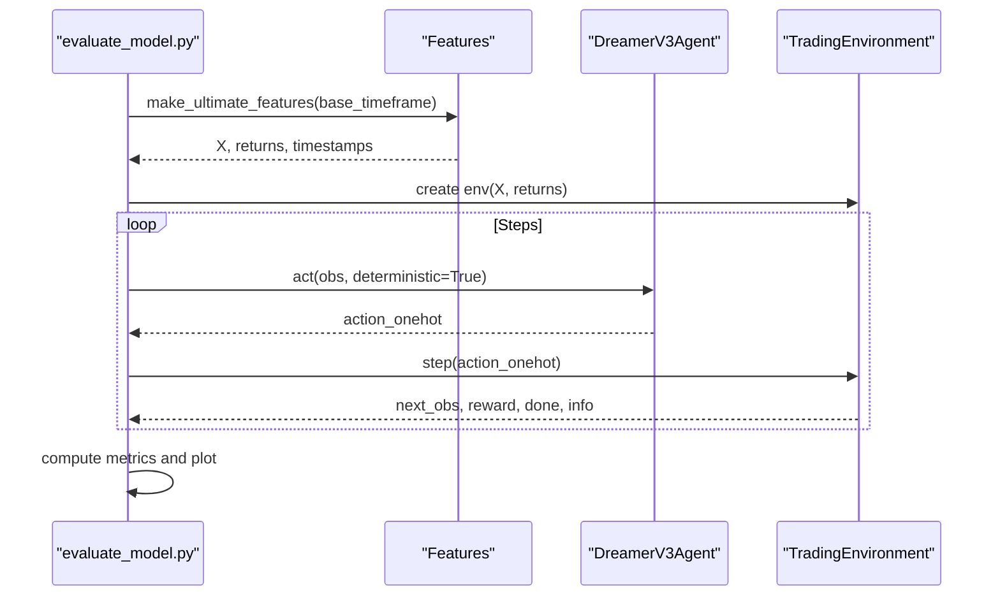
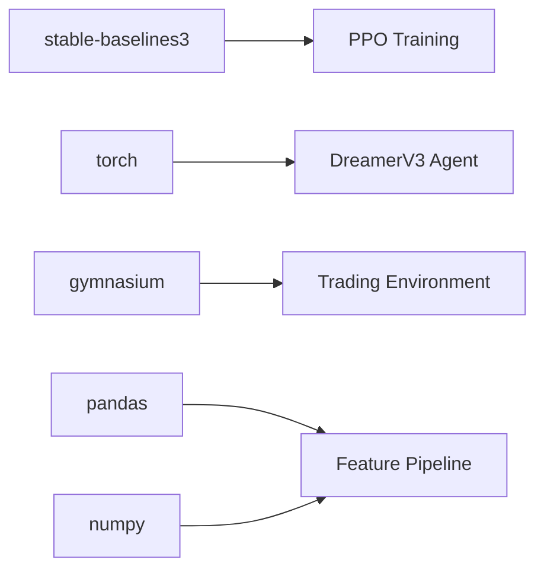

# Performance Optimization

<cite>
**Referenced Files in This Document**
- [README.md](file://README.md)
- [requirements.txt](file://requirements.txt)
- [train/train_ppo.py](file://train/train_ppo.py)
- [train/train_dreamer.py](file://train/train_dreamer.py)
- [models/dreamer_agent.py](file://models/dreamer_agent.py)
- [models/dreamer_components.py](file://models/dreamer_components.py)
- [features/make_features.py](file://features/make_features.py)
- [features/ultimate_150_features.py](file://features/ultimate_150_features.py)
- [env/xauusd_env.py](file://env/xauusd_env.py)
- [backtest/backtest_engine.py](file://backtest/backtest_engine.py)
- [evaluate_model.py](file://evaluate_model.py)
- [COLAB_TRAINING_GUIDE.md](file://COLAB_TRAINING_GUIDE.md)
- [DEPLOYMENT_GUIDE.md](file://DEPLOYMENT_GUIDE.md)
</cite>

## Table of Contents
1. Introduction
2. Project Structure
3. Core Components
4. Architecture Overview
5. Detailed Component Analysis
6. Dependency Analysis
7. Performance Considerations
8. Troubleshooting Guide
9. Conclusion
10. Appendices

## Introduction
This document provides a comprehensive guide to performance optimization for the autonomous trading system, focusing on training speed, memory usage, and inference performance across feature computation, model training, and execution pipelines. It also covers profiling strategies, large-scale experiment practices, distributed training considerations, GPU utilization, batch processing, caching mechanisms, and monitoring/logging for extended runs and live operations.

## Project Structure
The system is organized into modular components:
- Training scripts orchestrate environment setup, data loading, and algorithm-specific training loops.
- Models implement RL agents (PPO via Stable-Baselines3 and DreamerV3 with custom components).
- Features assemble market intelligence from multiple sources and timeframes.
- Environments provide Gym-compatible interfaces for RL training and evaluation.
- Backtesting and evaluation modules measure performance under realistic costs and slippage.
- Deployment guides outline production run patterns and resource needs.

**Diagram sources**
- [train/train_ppo.py:25-67](file://train/train_ppo.py#L25-L67)
- [train/train_dreamer.py:128-208](file://train/train_dreamer.py#L128-L208)
- [models/dreamer_agent.py:84-147](file://models/dreamer_agent.py#L84-L147)
- [models/dreamer_components.py:71-206](file://models/dreamer_components.py#L71-L206)
- [env/xauusd_env.py:7-57](file://env/xauusd_env.py#L7-L57)
- [features/make_features.py:18-83](file://features/make_features.py#L18-L83)
- [features/ultimate_150_features.py:27-226](file://features/ultimate_150_features.py#L27-L226)
- [evaluate_model.py:87-161](file://evaluate_model.py#L87-L161)
- [backtest/backtest_engine.py:24-146](file://backtest/backtest_engine.py#L24-L146)
- [COLAB_TRAINING_GUIDE.md:132-195](file://COLAB_TRAINING_GUIDE.md#L132-L195)
- [DEPLOYMENT_GUIDE.md:176-191](file://DEPLOYMENT_GUIDE.md#L176-L191)

**Section sources**
- [README.md:418-471](file://README.md#L418-L471)

## Core Components
Key performance-critical components include:
- Feature computation pipeline that aggregates multi-timeframe, macro, calendar, and microstructure features.
- RL environments that compute rewards and manage state transitions efficiently.
- PPO training loop using parallel vectorized environments for throughput.
- DreamerV3 agent implementing world model learning, imagination-based planning, and actor-critic updates.
- Evaluation and backtesting modules that simulate realistic costs and produce metrics.

Optimization levers:
- Batch size tuning per device capability.
- Parallel environment count for PPO.
- Memory-efficient data types (float32) and normalization.
- Device selection (CPU/MPS/CUDA) and auto-detection.
- Replay buffer sizing and sequence sampling for DreamerV3.

**Section sources**
- [features/ultimate_150_features.py:27-226](file://features/ultimate_150_features.py#L27-L226)
- [env/xauusd_env.py:21-57](file://env/xauusd_env.py#L21-L57)
- [train/train_ppo.py:25-67](file://train/train_ppo.py#L25-L67)
- [train/train_dreamer.py:128-208](file://train/train_dreamer.py#L128-L208)
- [models/dreamer_agent.py:84-147](file://models/dreamer_agent.py#L84-L147)

## Architecture Overview
The training architecture integrates feature generation, environment stepping, and RL algorithms:

**Diagram sources**
- [train/train_ppo.py:25-67](file://train/train_ppo.py#L25-L67)
- [train/train_dreamer.py:246-292](file://train/train_dreamer.py#L246-L292)
- [models/dreamer_agent.py:148-189](file://models/dreamer_agent.py#L148-L189)
- [models/dreamer_agent.py:190-304](file://models/dreamer_agent.py#L190-L304)
- [env/xauusd_env.py:75-118](file://env/xauusd_env.py#L75-L118)

## Detailed Component Analysis

### Feature Computation Pipeline
- Aggregates timeframe features, cross-timeframe correlations, macro indicators, economic calendar signals, and microstructure metrics.
- Uses float32 arrays and normalization to reduce memory footprint and improve numerical stability.
- Provides both lightweight and ultimate feature sets; choose based on compute constraints.

Optimization tips:
- Prefer base_timeframe='M5' for faster iteration when feasible.
- Cache intermediate DataFrames and avoid repeated reindexing.
- Use vectorized pandas/numpy operations; minimize Python loops.

**Diagram sources**
- [features/ultimate_150_features.py:47-226](file://features/ultimate_150_features.py#L47-L226)

**Section sources**
- [features/ultimate_150_features.py:27-226](file://features/ultimate_150_features.py#L27-L226)
- [features/make_features.py:18-83](file://features/make_features.py#L18-L83)

### Environment and Reward Engineering
- Discrete long-only actions with cost-aware rewards, turnover penalties, and stability bonuses to reduce oscillation.
- Efficient observation construction by slicing windows and concatenating position state.

Optimization tips:
- Keep window sizes moderate to balance context and memory.
- Tune cost and penalty parameters to reflect realistic trading frictions without over-penalizing exploration.

**Diagram sources**
- [env/xauusd_env.py:7-57](file://env/xauusd_env.py#L7-L57)
- [env/xauusd_env.py:75-118](file://env/xauusd_env.py#L75-L118)

**Section sources**
- [env/xauusd_env.py:21-118](file://env/xauusd_env.py#L21-L118)

### PPO Training Loop
- Uses SubprocVecEnv for parallel environment rollout to increase throughput.
- Configurable n_steps, batch_size, gamma, and learning_rate.
- Periodic checkpointing and final quick evaluation.

Optimization tips:
- Increase N_ENVS to match CPU cores for better parallelism.
- Adjust batch_size to fit GPU memory; larger batches can improve throughput but require more VRAM.
- Use device='cuda' or 'mps' for acceleration; ensure correct backend installation.

**Diagram sources**
- [train/train_ppo.py:25-67](file://train/train_ppo.py#L25-L67)
- [env/xauusd_env.py:75-118](file://env/xauusd_env.py#L75-L118)

**Section sources**
- [train/train_ppo.py:25-67](file://train/train_ppo.py#L25-L67)

### DreamerV3 Agent and World Model
- Implements RSSM (Recurrent State Space Model) with encoder, decoder, reward predictor, actor, and critic.
- Training alternates between world model learning and imagined trajectory optimization.
- Replay buffer stores sequences for efficient sampling.

Optimization tips:
- Tune embed_dim, hidden_dim, stoch_dim, num_categories to balance capacity and memory.
- Use appropriate batch_size for GPU; consider gradient accumulation if needed.
- Clip gradients to stabilize training.

**Diagram sources**
- [models/dreamer_agent.py:84-147](file://models/dreamer_agent.py#L84-L147)
- [models/dreamer_agent.py:148-189](file://models/dreamer_agent.py#L148-L189)
- [models/dreamer_agent.py:190-304](file://models/dreamer_agent.py#L190-L304)
- [models/dreamer_components.py:71-206](file://models/dreamer_components.py#L71-L206)

**Section sources**
- [models/dreamer_agent.py:84-427](file://models/dreamer_agent.py#L84-L427)
- [models/dreamer_components.py:71-295](file://models/dreamer_components.py#L71-L295)
- [train/train_dreamer.py:128-292](file://train/train_dreamer.py#L128-L292)

### Evaluation and Backtesting
- Evaluation script loads features, constructs an environment, runs deterministic policy, and computes metrics (return, Sharpe, drawdown, win rate).
- Backtester simulates realistic transaction costs, slippage, and commission; supports walk-forward validation.

Optimization tips:
- Use CPU for evaluation to avoid unnecessary GPU overhead.
- Precompute observations where possible to reduce per-step computation.
- Log detailed metrics and save equity curves for analysis.

**Diagram sources**
- [evaluate_model.py:87-161](file://evaluate_model.py#L87-L161)
- [evaluate_model.py:218-288](file://evaluate_model.py#L218-L288)
- [features/ultimate_150_features.py:27-226](file://features/ultimate_150_features.py#L27-L226)

**Section sources**
- [evaluate_model.py:87-161](file://evaluate_model.py#L87-L161)
- [backtest/backtest_engine.py:24-146](file://backtest/backtest_engine.py#L24-L146)

## Dependency Analysis
Core dependencies and their roles:
- stable-baselines3: PPO implementation and VecEnv utilities.
- torch: Neural network layers, distributions, and device management.
- gymnasium: Environment interface.
- pandas/numpy: Data manipulation and numerical computations.
- MetaTrader5: Live trading integration (not used in training/evaluation).

**Diagram sources**
- [requirements.txt:1-29](file://requirements.txt#L1-L29)
- [train/train_ppo.py:1-10](file://train/train_ppo.py#L1-L10)
- [models/dreamer_agent.py:11-21](file://models/dreamer_agent.py#L11-L21)
- [env/xauusd_env.py:1-5](file://env/xauusd_env.py#L1-L5)
- [features/make_features.py:1-5](file://features/make_features.py#L1-L5)

**Section sources**
- [requirements.txt:1-29](file://requirements.txt#L1-L29)

## Performance Considerations
Training speed:
- PPO: Increase N_ENVS for parallel rollouts; tune batch_size and n_steps to maximize GPU utilization.
- DreamerV3: Adjust batch_size and horizon; use larger embeddings cautiously to avoid memory pressure.
- Device selection: Auto-detect CUDA/MPS; prefer GPU for training; use CPU for evaluation.

Memory usage:
- Use float32 throughout; normalize features to reduce dynamic range.
- Limit replay buffer capacity and sequence length for DreamerV3.
- Avoid unnecessary copies; reuse arrays where possible.

Inference performance:
- Run evaluation on CPU to reduce overhead; precompute observations.
- Use deterministic mode for consistent decisions during backtests.

Batch processing techniques:
- Vectorize feature computations; leverage pandas rolling/window functions efficiently.
- For DreamerV3, sample sequences from replay buffer to amortize overhead.

Caching mechanisms:
- Cache intermediate feature DataFrames and aligned indices to avoid recomputation.
- Persist checkpoints frequently to resume training after interruptions.

GPU utilization strategies:
- Ensure proper backend installation (CUDA/MPS); monitor device availability.
- Scale batch_size to fit VRAM; use gradient clipping to stabilize training.

Large-scale experiments:
- Train multiple models with different seeds for ensembles.
- Use staged training (chunks) and periodic saves to manage long runs.

Distributed training setups:
- PPO uses SubprocVecEnv for multi-process rollouts; scale processes to CPU cores.
- For multi-GPU, consider framework-level distribution (e.g., torch.distributed) beyond current scope.

Production deployment optimizations:
- Minimal resource usage; 512 MB RAM sufficient for live inference.
- Use systemd services or nohup/screen for persistent operation.
- Monitor logs and health via journalctl or log files.

Monitoring and logging:
- Use tqdm progress bars and structured logging for training steps and losses.
- Save equity curves, positions, and metrics; visualize drawdown and performance.
- In production, tail logs and track process status.

**Section sources**
- [train/train_ppo.py:25-67](file://train/train_ppo.py#L25-L67)
- [train/train_dreamer.py:128-208](file://train/train_dreamer.py#L128-L208)
- [models/dreamer_agent.py:190-304](file://models/dreamer_agent.py#L190-L304)
- [features/ultimate_150_features.py:156-183](file://features/ultimate_150_features.py#L156-L183)
- [COLAB_TRAINING_GUIDE.md:132-195](file://COLAB_TRAINING_GUIDE.md#L132-L195)
- [DEPLOYMENT_GUIDE.md:176-191](file://DEPLOYMENT_GUIDE.md#L176-L191)

## Troubleshooting Guide
Common issues and resolutions:
- Out of memory: Reduce batch_size; decrease embedding dimensions; limit replay buffer size.
- Slow training: Verify GPU enabled; increase N_ENVS; optimize feature pipeline; avoid redundant computations.
- Session disconnects (Colab): Resume from last checkpoint; stage training; keep browser active.
- Data not found: Check paths; verify uploads; run diagnostic cells to confirm data loading.
- Device mismatch: Ensure correct backend; set device explicitly; check torch.cuda.is_available().

Profiling tools and methods:
- Use tqdm for progress tracking and timing.
- Log loss components and episode metrics to identify bottlenecks.
- Monitor GPU usage via nvidia-smi or system tools; adjust batch_size accordingly.

**Section sources**
- [COLAB_TRAINING_GUIDE.md:163-195](file://COLAB_TRAINING_GUIDE.md#L163-L195)
- [train/train_dreamer.py:246-292](file://train/train_dreamer.py#L246-L292)
- [backtest/backtest_engine.py:362-391](file://backtest/backtest_engine.py#L362-L391)

## Conclusion
Performance optimization in this autonomous trading system hinges on efficient feature computation, well-tuned RL training loops, and careful resource management. By leveraging parallel environments, device acceleration, batch sizing, and robust logging, you can achieve faster training, lower memory usage, and reliable inference. Adopt staged experiments, frequent checkpoints, and production-ready deployment practices to sustain long-running operations and live trading.

## Appendices
- Hardware targets and expected training times are outlined in project documentation.
- Deployment options include cloud VMs and local machines with minimal resource requirements.

**Section sources**
- [README.md:212-216](file://README.md#L212-L216)
- [DEPLOYMENT_GUIDE.md:176-191](file://DEPLOYMENT_GUIDE.md#L176-L191)