# Research Extensions

<cite>
**Referenced Files in This Document**
- [risk_supervisor.py](file://models/risk_supervisor.py)
- [ensemble.py](file://models/ensemble.py)
- [sentiment_analysis.py](file://data/sentiment_analysis.py)
- [meta_learning.py](file://models/meta_learning.py)
- [adversarial_training.py](file://models/adversarial_training.py)
- [position_sizing.py](file://models/position_sizing.py)
- [mcts.py](file://models/mcts.py)
- [macro_features.py](file://features/macro_features.py)
- [microstructure_features.py](file://features/microstructure_features.py)
- [crisis_validation.py](file://eval/crisis_validation.py)
- [backtest_engine.py](file://backtest/backtest_engine.py)
- [dreamer_agent.py](file://models/dreamer_agent.py)
</cite>

## Table of Contents
1. Introduction
2. Project Structure
3. Core Components
4. Architecture Overview
5. Detailed Component Analysis
6. Dependency Analysis
7. Performance Considerations
8. Troubleshooting Guide
9. Conclusion
10. Appendices

## Introduction
This document explains research-level extensions and experimental features for the autonomous trading system, focusing on:
- Regime detection and adaptive risk management
- Multi-objective optimization techniques
- Risk supervisor module that dynamically adjusts trading parameters based on market conditions
- Ensemble methods to combine multiple strategy predictions
- Sentiment analysis integration for alternative data sources
- Guidance for implementing novel research ideas, designing controlled experiments, and validating against baselines
- Statistical validation techniques, backtesting methodologies for research, and publication-ready result formatting

The goal is to provide a comprehensive, code-grounded guide that researchers can use to extend the system safely and rigorously.

## Project Structure
The repository organizes research-oriented modules across models, features, evaluation, and backtesting:
- Models: risk supervisor, ensemble agent, meta-learning (MAML), adversarial training, Monte Carlo Tree Search (MCTS), position sizing, and the core DreamerV3 agent
- Features: macroeconomic indicators and microstructure signals
- Evaluation: crisis period validation
- Backtesting: rigorous framework with realistic costs and walk-forward validation

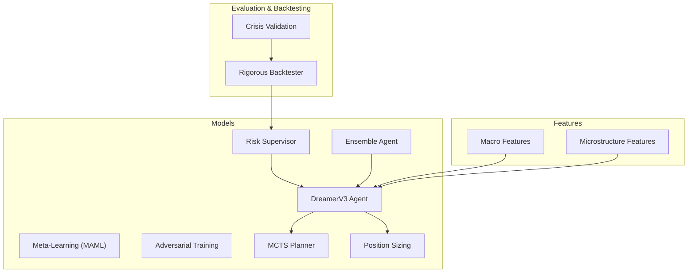

**Diagram sources**
- [risk_supervisor.py:18-174](file://models/risk_supervisor.py#L18-L174)
- [ensemble.py:27-130](file://models/ensemble.py#L27-L130)
- [meta_learning.py:32-171](file://models/meta_learning.py#L32-L171)
- [adversarial_training.py:35-355](file://models/adversarial_training.py#L35-L355)
- [mcts.py:20-242](file://models/mcts.py#L20-L242)
- [position_sizing.py:29-262](file://models/position_sizing.py#L29-L262)
- [macro_features.py:26-445](file://features/macro_features.py#L26-L445)
- [microstructure_features.py:22-225](file://features/microstructure_features.py#L22-L225)
- [crisis_validation.py:29-171](file://eval/crisis_validation.py#L29-L171)
- [backtest_engine.py:24-195](file://backtest/backtest_engine.py#L24-L195)
- [dreamer_agent.py:84-188](file://models/dreamer_agent.py#L84-L188)

**Section sources**
- [risk_supervisor.py:18-174](file://models/risk_supervisor.py#L18-L174)
- [ensemble.py:27-130](file://models/ensemble.py#L27-L130)
- [sentiment_analysis.py:22-235](file://data/sentiment_analysis.py#L22-L235)
- [meta_learning.py:32-171](file://models/meta_learning.py#L32-L171)
- [adversarial_training.py:35-355](file://models/adversarial_training.py#L35-L355)
- [position_sizing.py:29-262](file://models/position_sizing.py#L29-L262)
- [mcts.py:20-242](file://models/mcts.py#L20-L242)
- [macro_features.py:26-445](file://features/macro_features.py#L26-L445)
- [microstructure_features.py:22-225](file://features/microstructure_features.py#L22-L225)
- [crisis_validation.py:29-171](file://eval/crisis_validation.py#L29-L171)
- [backtest_engine.py:24-195](file://backtest/backtest_engine.py#L24-L195)
- [dreamer_agent.py:84-188](file://models/dreamer_agent.py#L84-L188)

## Core Components
- Risk Supervisor: Deterministic safety layer enforcing daily loss limits, drawdown protection, volatility filters, correlation guards, event risk filters, overtrading prevention, spread filters, and market hours checks. It can halt trading and tracks statistics for approval/rejection reasons.
- Ensemble Agent: Trains multiple diverse models and uses consensus voting to decide actions; provides uncertainty estimation via disagreement entropy.
- Meta-Learning (MAML): Learns an initialization that adapts quickly to new regimes using few-shot adaptation steps; includes regime generation utilities.
- Adversarial Training: Self-play between a Trader and a Market Maker that manipulates spreads, creates fake breakouts, hunts stops, and induces slippage; trains robustness to manipulation.
- MCTS Planner: Uses world model imagination to simulate futures and select actions via UCB-based search; integrates with DreamerV3.
- Position Sizing: Implements Kelly Criterion with fractional scaling, volatility-adjusted sizing, and ATR-based sizing; updates statistics from trade history.
- Macro/Micro Features: Rich feature sets capturing macroeconomic drivers and intraday microstructure patterns.
- Crisis Validation: Tests agents across known crisis periods with pass/fail criteria.
- Rigorous Backtester: Realistic transaction costs, slippage, walk-forward validation, and comprehensive metrics.

**Section sources**
- [risk_supervisor.py:18-174](file://models/risk_supervisor.py#L18-L174)
- [ensemble.py:27-130](file://models/ensemble.py#L27-L130)
- [meta_learning.py:32-171](file://models/meta_learning.py#L32-L171)
- [adversarial_training.py:35-355](file://models/adversarial_training.py#L35-L355)
- [mcts.py:20-242](file://models/mcts.py#L20-L242)
- [position_sizing.py:29-262](file://models/position_sizing.py#L29-L262)
- [macro_features.py:26-445](file://features/macro_features.py#L26-L445)
- [microstructure_features.py:22-225](file://features/microstructure_features.py#L22-L225)
- [crisis_validation.py:29-171](file://eval/crisis_validation.py#L29-L171)
- [backtest_engine.py:24-195](file://backtest/backtest_engine.py#L24-L195)

## Architecture Overview
The system composes a DreamerV3 agent with planning, risk controls, ensembling, and advanced training paradigms. The flow integrates features, sentiment, and macro inputs into the agent’s observation pipeline, while the risk supervisor gates execution.

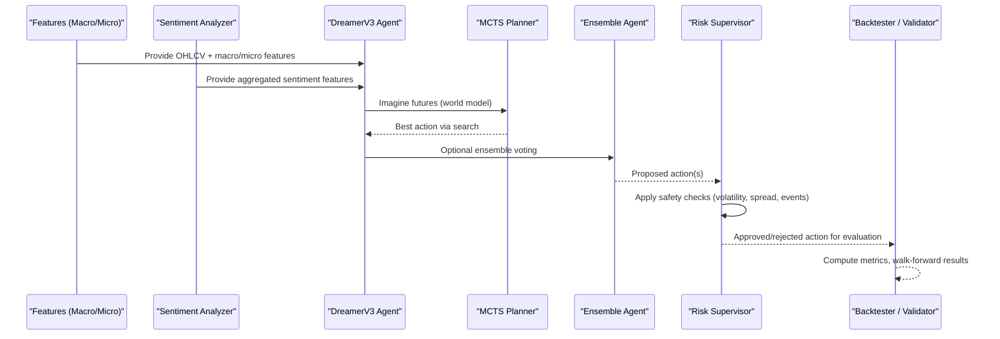

**Diagram sources**
- [macro_features.py:363-445](file://features/macro_features.py#L363-L445)
- [microstructure_features.py:170-225](file://features/microstructure_features.py#L170-L225)
- [sentiment_analysis.py:190-235](file://data/sentiment_analysis.py#L190-L235)
- [dreamer_agent.py:148-188](file://models/dreamer_agent.py#L148-L188)
- [mcts.py:145-193](file://models/mcts.py#L145-L193)
- [ensemble.py:67-130](file://models/ensemble.py#L67-L130)
- [risk_supervisor.py:91-174](file://models/risk_supervisor.py#L91-L174)
- [backtest_engine.py:73-146](file://backtest/backtest_engine.py#L73-L146)

## Detailed Component Analysis

### Risk Supervisor Module
- Purpose: Hard-coded safety layer that overrides AI decisions to prevent catastrophic losses.
- Key mechanisms:
  - Daily loss limit circuit breaker
  - Maximum drawdown protection
  - Position size limits
  - Volatility filter (restricts new entries during high vol)
  - Correlation guard (e.g., USD momentum vs Gold)
  - Event risk filter (news windows reduce position sizes)
  - Overtrading prevention (max trades/day, min time between trades)
  - Spread filter and market hours check
- State tracking: equity, peak equity, daily PnL, consecutive losses, trade counters, halt timers
- Integration: SafeTradingAgent wrapper combines AI agent with risk supervisor gating

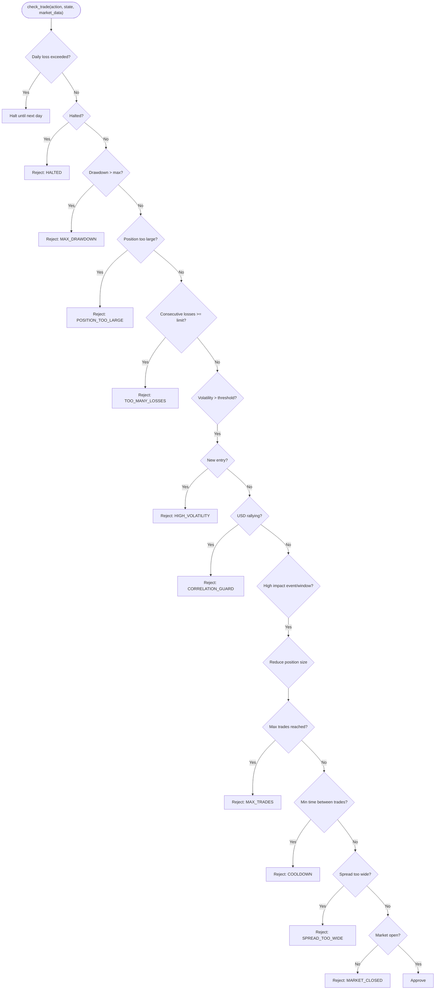

**Diagram sources**
- [risk_supervisor.py:91-174](file://models/risk_supervisor.py#L91-L174)

**Section sources**
- [risk_supervisor.py:18-174](file://models/risk_supervisor.py#L18-L174)
- [risk_supervisor.py:288-339](file://models/risk_supervisor.py#L288-L339)

### Ensemble Methods for Combining Predictions
- Strategy: Train multiple models with varied seeds/architectures; vote for majority action; require consensus threshold to trade; compute uncertainty via entropy of votes.
- Benefits: Robustness to individual model failures, uncertainty estimation, reduced overfitting, better generalization.
- Usage: act(obs, use_consensus=True, consensus_threshold=3) returns final action and info including uncertainties and Q-values if available.

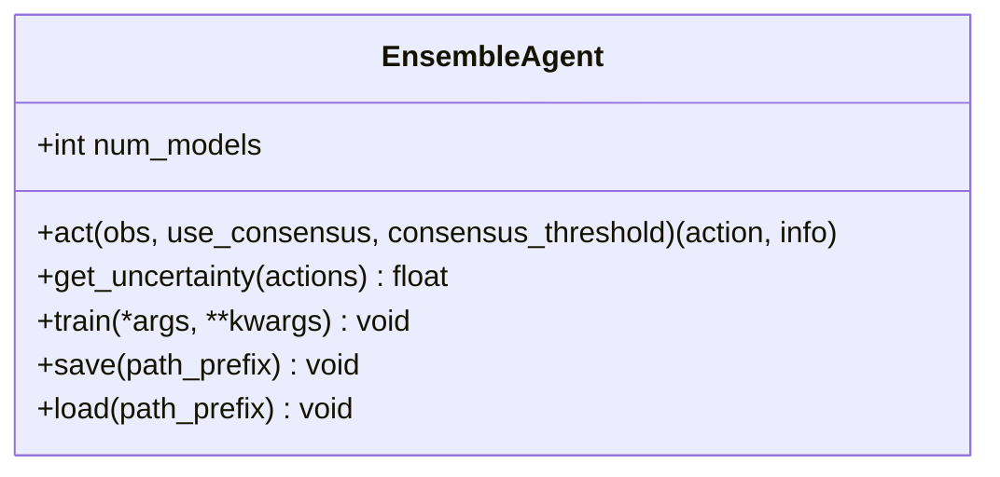

**Diagram sources**
- [ensemble.py:27-130](file://models/ensemble.py#L27-L130)

**Section sources**
- [ensemble.py:27-130](file://models/ensemble.py#L27-L130)

### Sentiment Analysis Integration
- Sources: News headlines, Fed speeches, social media placeholders.
- Methods: FinBERT optional path or keyword-based fallback; aggregate weighted scores; track momentum and divergence.
- Output: Features like news_sentiment, fed_sentiment, social_sentiment, overall_sentiment, sentiment_momentum, sentiment_divergence.

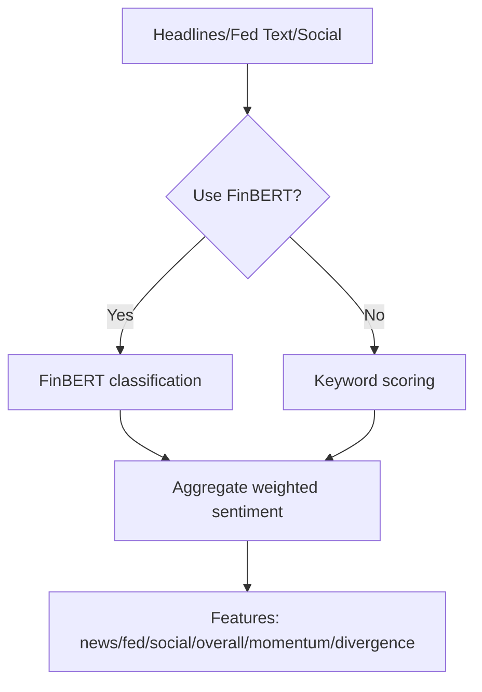

**Diagram sources**
- [sentiment_analysis.py:60-235](file://data/sentiment_analysis.py#L60-L235)

**Section sources**
- [sentiment_analysis.py:22-235](file://data/sentiment_analysis.py#L22-L235)

### Meta-Learning (MAML) for Regime Adaptation
- Concept: Learn an initialization adaptable to new regimes with few examples; supports fast_adapt for quick fine-tuning.
- Components: MAMLTrader with meta-optimizer, inner-loop adaptation steps, and MarketRegimeGenerator to create tasks from historical data (trending, ranging, volatile).
- Use cases: Rapid adaptation when market dynamics shift; fewer samples needed compared to full retraining.

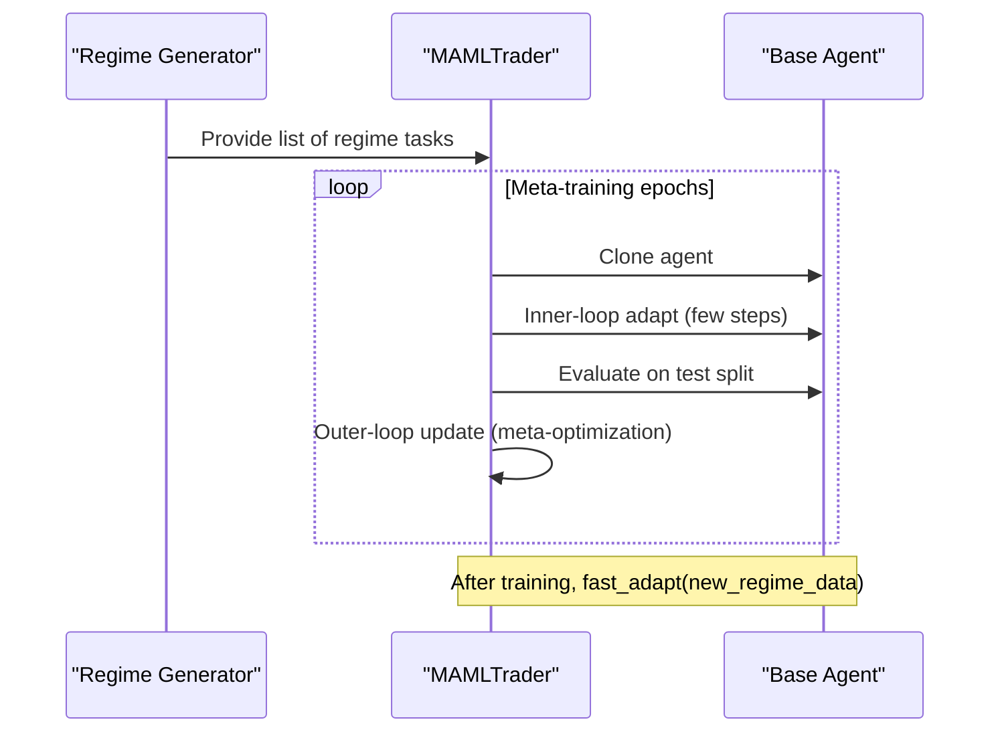

**Diagram sources**
- [meta_learning.py:66-171](file://models/meta_learning.py#L66-L171)
- [meta_learning.py:174-261](file://models/meta_learning.py#L174-L261)

**Section sources**
- [meta_learning.py:32-171](file://models/meta_learning.py#L32-L171)
- [meta_learning.py:174-261](file://models/meta_learning.py#L174-L261)

### Adversarial Training (Self-Play)
- Concept: Two-agent self-play where a Market Maker learns to exploit Trader weaknesses via spread widening, fake breakouts, stop hunting, and slippage induction.
- Environment: AdversarialTradingEnv wraps base environment, applies MM manipulations, and records info for learning.
- Trainer: SelfPlayTrainer alternates phases to train both Trader and MM, balancing zero-sum rewards.

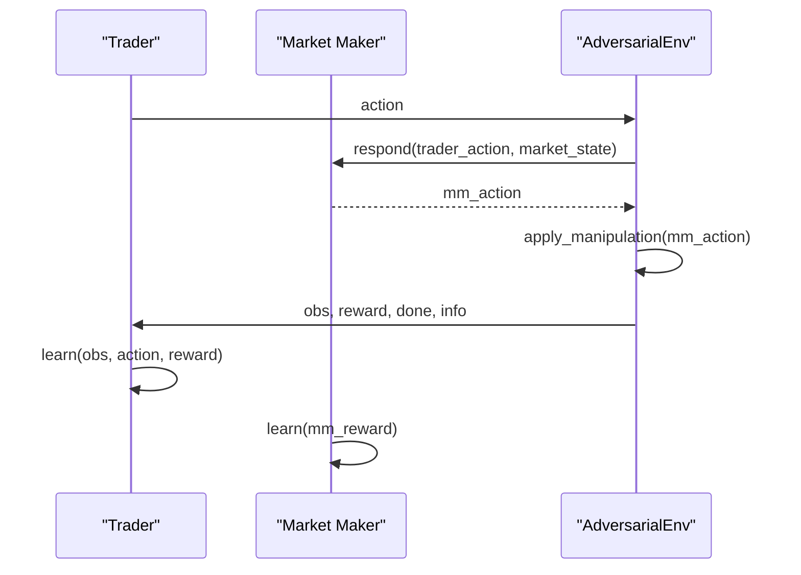

**Diagram sources**
- [adversarial_training.py:223-355](file://models/adversarial_training.py#L223-L355)
- [adversarial_training.py:358-484](file://models/adversarial_training.py#L358-L484)

**Section sources**
- [adversarial_training.py:35-355](file://models/adversarial_training.py#L35-L355)
- [adversarial_training.py:358-484](file://models/adversarial_training.py#L358-L484)

### Monte Carlo Tree Search (MCTS) Planning
- Purpose: Lookahead planning using world model imagination to evaluate future trajectories and select best action via UCB selection.
- Integration: DreamerMCTSAgent wraps DreamerV3 agent; optionally uses MCTS for action selection; returns stats for analysis.

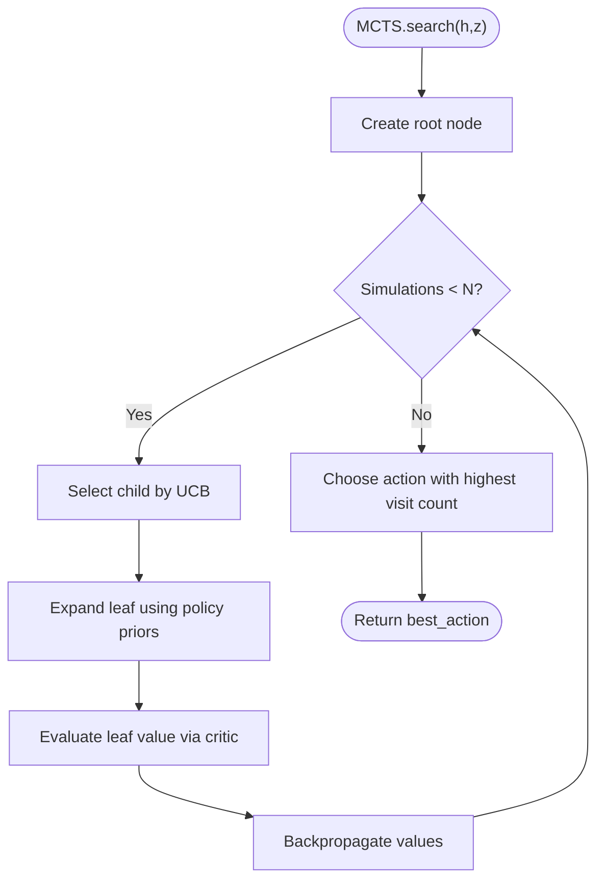

**Diagram sources**
- [mcts.py:118-193](file://models/mcts.py#L118-L193)
- [mcts.py:245-291](file://models/mcts.py#L245-L291)

**Section sources**
- [mcts.py:20-242](file://models/mcts.py#L20-L242)
- [mcts.py:245-291](file://models/mcts.py#L245-L291)

### Position Sizing and Adaptive Risk Management
- Kelly Criterion: Computes optimal fraction based on win probability and risk/reward; supports fractional Kelly for safety; caps at maximum position.
- Dynamic sizing: Uses agent’s world model estimates to infer win probability; volatility-adjusted sizing scales positions inversely with volatility.
- ATR-based sizing: Positions sized by account risk and stop distance in ATR units.

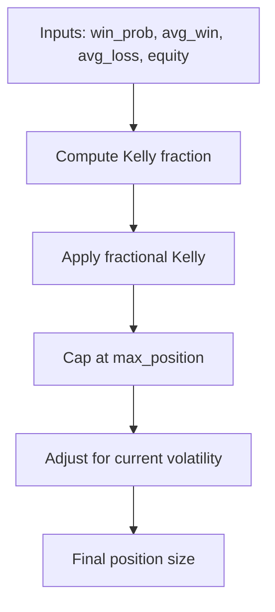

**Diagram sources**
- [position_sizing.py:66-111](file://models/position_sizing.py#L66-L111)
- [position_sizing.py:189-216](file://models/position_sizing.py#L189-L216)

**Section sources**
- [position_sizing.py:29-262](file://models/position_sizing.py#L29-L262)

### Macro and Microstructure Features
- Macro Features: 24 features across DXY, SPX, US10Y, VIX, Oil, Bitcoin, EURUSD, Silver/GLD; include returns, momentum, rolling correlations; aligned to gold timestamps.
- Microstructure Features: Session effects, time effects, volume profile/imbalance, liquidity regime; capture intraday patterns and mechanics.

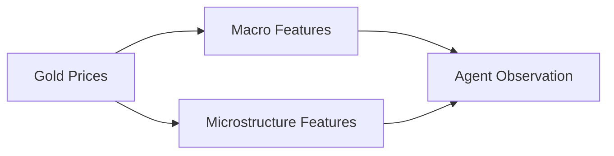

**Diagram sources**
- [macro_features.py:363-445](file://features/macro_features.py#L363-L445)
- [microstructure_features.py:170-225](file://features/microstructure_features.py#L170-L225)

**Section sources**
- [macro_features.py:26-445](file://features/macro_features.py#L26-L445)
- [microstructure_features.py:22-225](file://features/microstructure_features.py#L22-L225)

### Crisis Validation and Baseline Comparisons
- CrisisValidator tests agents across known crises (COVID crash, rate hikes, SVB collapse, Ukraine invasion) with pass/fail criteria: survival, drawdown limits, Sharpe ratio, overtrading constraints.
- Provides structured results per crisis and overall summary.

**Section sources**
- [crisis_validation.py:29-171](file://eval/crisis_validation.py#L29-L171)
- [crisis_validation.py:236-317](file://eval/crisis_validation.py#L236-L317)

### Rigorous Backtesting Methodology
- RigorousBacktester implements realistic transaction costs (spread multiplier, slippage, commission), walk-forward validation, and comprehensive metrics (returns, risk ratios, trade stats, costs).
- Supports conservative assumptions to avoid overestimation.

**Section sources**
- [backtest_engine.py:24-195](file://backtest/backtest_engine.py#L24-L195)
- [backtest_engine.py:219-360](file://backtest/backtest_engine.py#L219-L360)

## Dependency Analysis
- The DreamerV3 agent serves as the core policy/value learner; MCTS enhances decision quality via lookahead; ensemble improves robustness; risk supervisor ensures safe execution; features feed rich context; backtesting and crisis validation provide evaluation pipelines.
- Coupling:
  - MCTS depends on DreamerV3’s world model components (RSSM, actor, critic).
  - Ensemble wraps any agent class with consistent API.
  - Risk supervisor is agnostic but expects standardized action/state/market_data interfaces.
  - Features are independent modules producing normalized series aligned to timestamps.
- External dependencies:
  - PyTorch for neural networks
  - Pandas/Numpy for data processing
  - Optional transformers for FinBERT

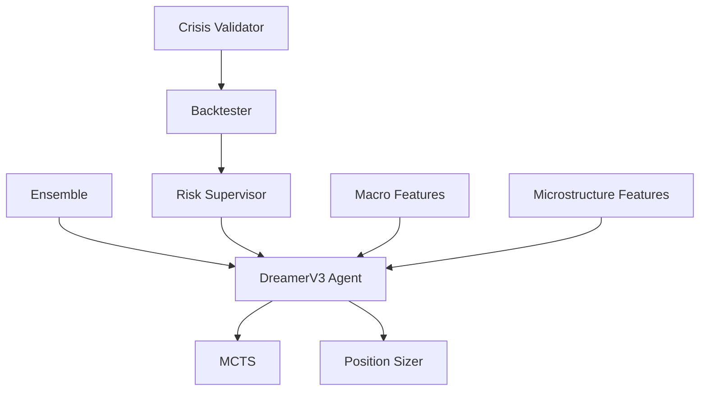

**Diagram sources**
- [dreamer_agent.py:84-188](file://models/dreamer_agent.py#L84-L188)
- [mcts.py:245-291](file://models/mcts.py#L245-L291)
- [ensemble.py:27-130](file://models/ensemble.py#L27-L130)
- [risk_supervisor.py:288-339](file://models/risk_supervisor.py#L288-L339)
- [macro_features.py:363-445](file://features/macro_features.py#L363-L445)
- [microstructure_features.py:170-225](file://features/microstructure_features.py#L170-L225)
- [backtest_engine.py:73-146](file://backtest/backtest_engine.py#L73-L146)
- [crisis_validation.py:109-171](file://eval/crisis_validation.py#L109-L171)

**Section sources**
- [dreamer_agent.py:84-188](file://models/dreamer_agent.py#L84-L188)
- [ensemble.py:27-130](file://models/ensemble.py#L27-L130)
- [risk_supervisor.py:288-339](file://models/risk_supervisor.py#L288-L339)
- [macro_features.py:363-445](file://features/macro_features.py#L363-L445)
- [microstructure_features.py:170-225](file://features/microstructure_features.py#L170-L225)
- [backtest_engine.py:73-146](file://backtest/backtest_engine.py#L73-L146)
- [crisis_validation.py:109-171](file://eval/crisis_validation.py#L109-L171)

## Performance Considerations
- Computational cost:
  - MCTS adds planning overhead proportional to number of simulations; tune num_simulations for latency vs accuracy trade-offs.
  - Ensemble multiplies inference cost by number of models; consider pruning or caching strategies.
  - FinBERT inference requires GPU resources; fallback to keyword-based method reduces cost.
- Risk and stability:
  - Risk supervisor prevents catastrophic losses; ensure thresholds are calibrated to instrument characteristics (e.g., XAUUSD spreads).
  - Position sizing should be conservative; fractional Kelly recommended.
- Data alignment:
  - Macro features require timezone normalization and resampling; ensure correct alignment to intraday timestamps.
- Backtesting realism:
  - Use spread multipliers and slippage to avoid optimistic bias; employ walk-forward validation to assess robustness.

[No sources needed since this section provides general guidance]

## Troubleshooting Guide
- Risk Supervisor rejections:
  - Check daily loss limits, drawdown thresholds, volatility spikes, wide spreads, event windows, and market hours.
  - Review get_statistics() for rejection reasons and approval rates.
- Ensemble uncertainty:
  - High entropy indicates disagreement; consider reducing exposure or waiting for clearer signals.
- MCTS performance:
  - If planning is slow, reduce num_simulations or c_puct; verify world model states and action encoding.
- Feature issues:
  - Ensure macro data files exist and are correctly formatted; handle NaNs via forward-fill; confirm timezone alignment.
- Backtest discrepancies:
  - Verify cost assumptions (spread multiplier, slippage, commission); inspect equity curves and metrics for anomalies.

**Section sources**
- [risk_supervisor.py:243-285](file://models/risk_supervisor.py#L243-L285)
- [ensemble.py:132-154](file://models/ensemble.py#L132-L154)
- [mcts.py:145-193](file://models/mcts.py#L145-L193)
- [macro_features.py:78-111](file://features/macro_features.py#L78-L111)
- [backtest_engine.py:202-217](file://backtest/backtest_engine.py#L202-L217)

## Conclusion
The system provides a robust foundation for research-level extensions:
- Regime detection and adaptation via meta-learning
- Adaptive risk management through deterministic safeguards and dynamic position sizing
- Multi-objective considerations via ensemble uncertainty and MCTS planning
- Alternative data integration through sentiment analysis
- Rigorous evaluation via crisis validation and realistic backtesting

Researchers can build upon these components to implement novel strategies, design controlled experiments, and validate approaches against baselines with publication-ready metrics.

[No sources needed since this section summarizes without analyzing specific files]

## Appendices

### Implementing Novel Research Ideas
- Define clear hypotheses and objectives; choose appropriate modules (e.g., add regime classifier, integrate additional alternative data).
- Design controlled experiments:
  - Baselines: simple strategies (buy-and-hold, moving average crossover)
  - Ablation studies: remove components (e.g., disable MCTS or ensemble)
  - Sensitivity analysis: vary thresholds (volatility, spread, consensus)
- Validate with:
  - Walk-forward validation
  - Crisis period testing
  - Statistical significance tests (e.g., bootstrap confidence intervals for returns)

### Statistical Validation Techniques
- Metrics: total return, annualized return, max drawdown, Sharpe/Sortino/Calmar ratios, win rate, profit factor, average trade duration
- Significance:
  - Compare strategies using paired tests on out-of-sample windows
  - Report confidence intervals and p-values for performance differences
- Robustness:
  - Stress-test under different cost assumptions
  - Evaluate sensitivity to hyperparameters

### Backtesting Methodologies for Research
- Use RigorousBacktester with conservative cost assumptions
- Employ walk-forward validation to simulate real-world deployment
- Record detailed trade logs and equity curves for reproducibility

### Publication-Ready Result Formatting
- Present tables with key metrics and confidence intervals
- Include plots: equity curves, drawdown profiles, rolling Sharpe
- Detail methodology: data sources, feature engineering, model architecture, training procedures, evaluation protocols
- Provide code references and configuration settings for reproducibility

[No sources needed since this section provides general guidance]