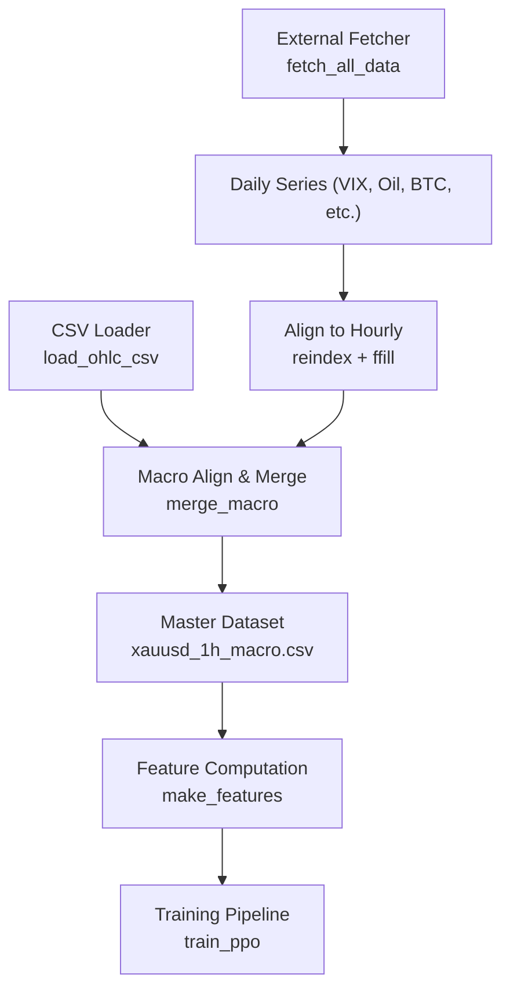
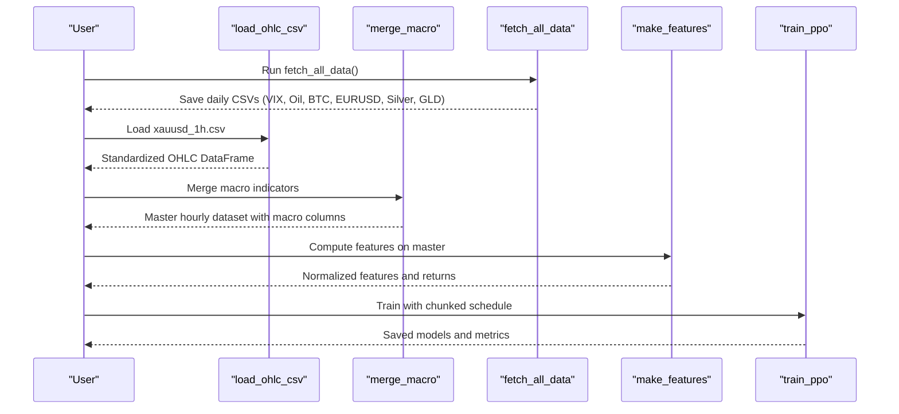
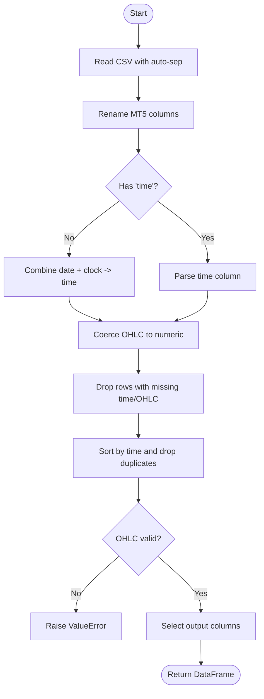
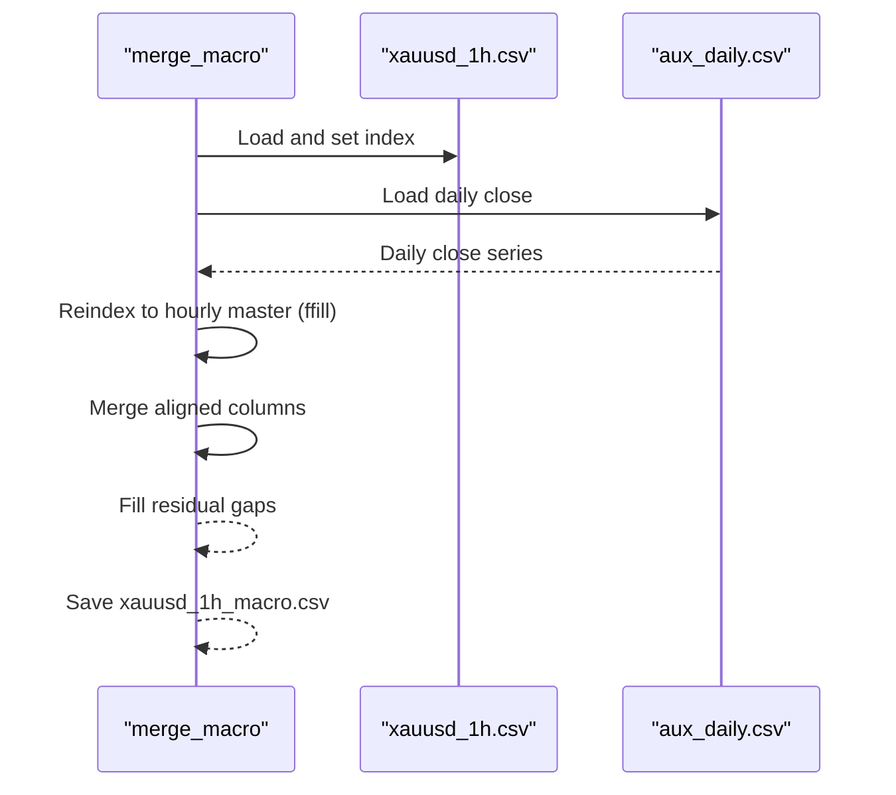
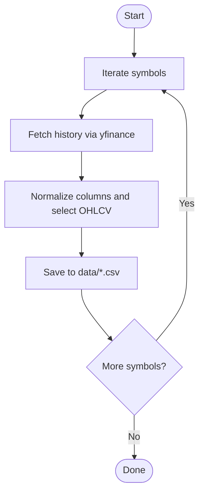
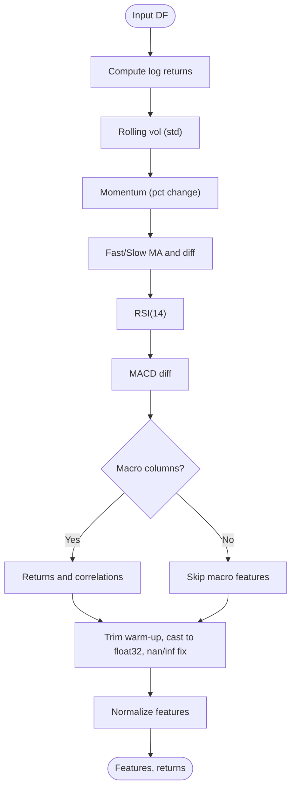
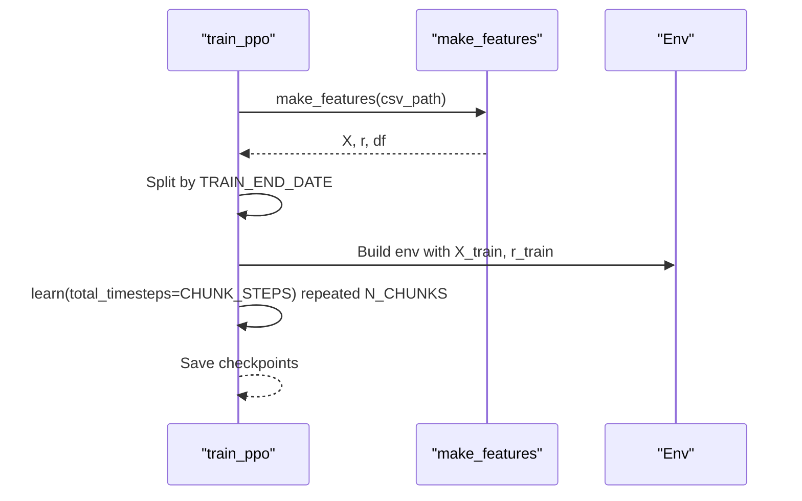
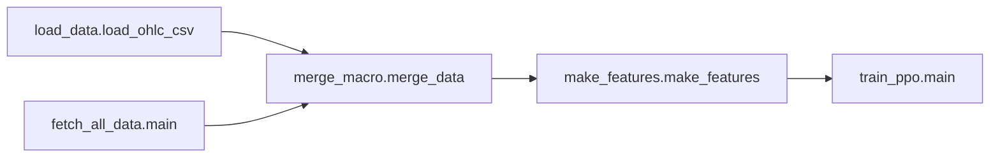

# Data Loading System

<cite>
**Referenced Files in This Document**
- [load_data.py](file://data/load_data.py)
- [merge_macro.py](file://data/merge_macro.py)
- [fetch_all_data.py](file://scripts/fetch_all_data.py)
- [economic_calendar.py](file://data/economic_calendar.py)
- [make_features.py](file://features/make_features.py)
- [train_ppo.py](file://train/train_ppo.py)
</cite>

## Table of Contents
1. [Introduction](#introduction)
2. [Project Structure](#project-structure)
3. [Core Components](#core-components)
4. [Architecture Overview](#architecture-overview)
5. [Detailed Component Analysis](#detailed-component-analysis)
6. [Dependency Analysis](#dependency-analysis)
7. [Performance Considerations](#performance-considerations)
8. [Troubleshooting Guide](#troubleshooting-guide)
9. [Conclusion](#conclusion)
10. [Appendices](#appendices)

## Introduction
This document explains the data loading system for large financial datasets, focusing on efficient CSV reading, standardization across heterogeneous sources, missing value handling, consistent datetime indexing, and integration into feature computation and model training. It also covers practical usage patterns such as filtering by date ranges and accessing preprocessed data for feature engineering. While memory mapping is not implemented in the current codebase, the system emphasizes robust parsing, validation, and alignment to support scalable processing.

## Project Structure
The data pipeline spans several modules:
- Raw data ingestion from broker exports and external APIs
- Standardization and validation of OHLCV time series
- Alignment and merging of macro indicators to a master frequency
- Feature computation and normalization
- Training pipeline consumption with chunked learning schedules

**Diagram sources**
- [load_data.py:5-73](file://data/load_data.py#L5-L73)
- [merge_macro.py:4-56](file://data/merge_macro.py#L4-L56)
- [fetch_all_data.py:27-128](file://scripts/fetch_all_data.py#L27-L128)
- [make_features.py:18-82](file://features/make_features.py#L18-L82)
- [train_ppo.py:25-32](file://train/train_ppo.py#L25-L32)

**Section sources**
- [load_data.py:5-73](file://data/load_data.py#L5-L73)
- [merge_macro.py:4-56](file://data/merge_macro.py#L4-L56)
- [fetch_all_data.py:27-128](file://scripts/fetch_all_data.py#L27-L128)
- [make_features.py:18-82](file://features/make_features.py#L18-L82)
- [train_ppo.py:25-32](file://train/train_ppo.py#L25-L32)

## Core Components
- Efficient CSV loader with auto-separator detection, column renaming, numeric coercion, missing value removal, sorting, deduplication, and sanity checks for OHLC consistency.
- Macro data merger that aligns daily indicators to an hourly master series using forward fill and reindexing.
- External data fetcher that downloads multiple assets and saves standardized daily CSVs.
- Feature computation module that derives returns, volatility, momentum, moving averages, RSI, MACD, correlations, and normalizes features for modeling.
- Training entry point that loads features, splits by date, and trains with chunked steps.

**Section sources**
- [load_data.py:5-73](file://data/load_data.py#L5-L73)
- [merge_macro.py:4-56](file://data/merge_macro.py#L4-L56)
- [fetch_all_data.py:27-128](file://scripts/fetch_all_data.py#L27-L128)
- [make_features.py:18-82](file://features/make_features.py#L18-L82)
- [train_ppo.py:25-32](file://train/train_ppo.py#L25-L32)

## Architecture Overview
The system ingests raw CSVs and external daily series, standardizes them, merges macro indicators onto an hourly master, computes features, and feeds them into the training loop.

**Diagram sources**
- [fetch_all_data.py:131-194](file://scripts/fetch_all_data.py#L131-L194)
- [load_data.py:5-73](file://data/load_data.py#L5-L73)
- [merge_macro.py:4-56](file://data/merge_macro.py#L4-L56)
- [make_features.py:18-82](file://features/make_features.py#L18-L82)
- [train_ppo.py:25-32](file://train/train_ppo.py#L25-L32)

## Detailed Component Analysis

### CSV Loader: load_ohlc_csv
- Reads CSV with automatic separator detection and converts MT5 angle-bracket columns to standardized names.
- Builds a unified datetime index from separate date/time or uses existing time column; coerces to datetime with error handling.
- Ensures numeric types for OHLC and optional tick volume; drops rows with missing critical fields.
- Sorts by time, removes duplicate timestamps, and validates OHLC constraints.
- Selects a minimal output set while preserving relevant macro columns when present.

**Diagram sources**
- [load_data.py:5-73](file://data/load_data.py#L5-L73)

**Section sources**
- [load_data.py:5-73](file://data/load_data.py#L5-L73)

### Macro Merger: merge_macro
- Loads the master hourly series and auxiliary daily series (e.g., DXY, SPX, US10Y).
- Converts times to naive datetimes, sets index, and resamples/reindexes to match the master’s hourly timestamps using forward fill.
- Merges aligned columns and fills any remaining gaps; saves the resulting macro-enhanced dataset.

**Diagram sources**
- [merge_macro.py:4-56](file://data/merge_macro.py#L4-L56)

**Section sources**
- [merge_macro.py:4-56](file://data/merge_macro.py#L4-L56)

### External Fetcher: fetch_all_data
- Downloads multiple daily series (VIX, WTI, Bitcoin, EURUSD, Silver, GLD, DXY) and writes standardized CSVs.
- Provides a helper to align daily series to an hourly reference via forward fill and reindexing.

**Diagram sources**
- [fetch_all_data.py:27-128](file://scripts/fetch_all_data.py#L27-L128)
- [fetch_all_data.py:131-194](file://scripts/fetch_all_data.py#L131-L194)

**Section sources**
- [fetch_all_data.py:27-128](file://scripts/fetch_all_data.py#L27-L128)
- [fetch_all_data.py:131-194](file://scripts/fetch_all_data.py#L131-L194)

### Feature Computation: make_features
- Derives log returns, rolling volatility, momentum, fast/slow moving averages, RSI, MACD differences.
- If macro columns exist, adds their returns and rolling correlations with gold returns.
- Drops initial warm-up period, converts to float32 arrays, handles NaNs/infinities, and normalizes features.

**Diagram sources**
- [make_features.py:18-82](file://features/make_features.py#L18-L82)

**Section sources**
- [make_features.py:18-82](file://features/make_features.py#L18-L82)

### Training Integration: train_ppo
- Loads features via make_features, slices by a cutoff date, and constructs parallel environments for PPO training.
- Uses chunked learning to iteratively train over large datasets without reloading.

**Diagram sources**
- [train_ppo.py:25-32](file://train/train_ppo.py#L25-L32)
- [train_ppo.py:56-67](file://train/train_ppo.py#L56-L67)
- [make_features.py:80-82](file://features/make_features.py#L80-L82)

**Section sources**
- [train_ppo.py:25-32](file://train/train_ppo.py#L25-L32)
- [train_ppo.py:56-67](file://train/train_ppo.py#L56-L67)
- [make_features.py:80-82](file://features/make_features.py#L80-L82)

## Dependency Analysis
- The loader is a foundational dependency used by both macro merging and feature computation.
- The macro merger depends on the loader and produces a master dataset consumed by feature computation.
- The external fetcher provides daily series that are aligned and merged into the master.
- The training pipeline consumes the computed features and operates in chunks to manage memory and compute time.

**Diagram sources**
- [load_data.py:5-73](file://data/load_data.py#L5-L73)
- [merge_macro.py:4-56](file://data/merge_macro.py#L4-L56)
- [fetch_all_data.py:131-194](file://scripts/fetch_all_data.py#L131-L194)
- [make_features.py:18-82](file://features/make_features.py#L18-L82)
- [train_ppo.py:25-32](file://train/train_ppo.py#L25-L32)

**Section sources**
- [load_data.py:5-73](file://data/load_data.py#L5-L73)
- [merge_macro.py:4-56](file://data/merge_macro.py#L4-L56)
- [fetch_all_data.py:131-194](file://scripts/fetch_all_data.py#L131-L194)
- [make_features.py:18-82](file://features/make_features.py#L18-L82)
- [train_ppo.py:25-32](file://train/train_ppo.py#L25-L32)

## Performance Considerations
- CSV reading uses pandas with auto-separator detection; for very large files, consider:
  - Specifying dtypes to reduce memory footprint
  - Using chunked reads if needed for extremely large inputs
  - Avoiding unnecessary columns during read
- Validation and deduplication ensure data integrity but add overhead; run once per dataset load.
- Macro alignment uses forward fill and reindexing; this is efficient for daily-to-hourly expansion.
- Feature computation casts to float32 and normalizes in-place where possible to reduce memory usage.
- Training uses chunked learning to avoid loading all timesteps at once into memory.

[No sources needed since this section provides general guidance]

## Troubleshooting Guide
- Missing required columns: Ensure the input CSV contains date/clock or time plus OHLC; the loader will raise an error if required columns are absent.
- Invalid OHLC values: The loader enforces high >= max(open, close, low) and low <= min(open, close, high); clean upstream data if violations occur.
- Timezone issues: Macro merging explicitly removes timezone info; ensure consistent naive datetimes across sources.
- Empty or partial downloads: External fetcher may return no data for certain symbols or dates; verify network connectivity and symbol availability.
- Feature NaNs: Initial warm-up periods produce NaNs; the pipeline trims these before normalization.

**Section sources**
- [load_data.py:26-59](file://data/load_data.py#L26-L59)
- [merge_macro.py:10-12](file://data/merge_macro.py#L10-L12)
- [fetch_all_data.py:42-64](file://scripts/fetch_all_data.py#L42-L64)
- [make_features.py:63-77](file://features/make_features.py#L63-L77)

## Conclusion
The data loading system provides a robust foundation for processing large financial datasets: it standardizes heterogeneous inputs, ensures data quality through validation, aligns multi-frequency series, and delivers normalized features ready for modeling. While memory mapping is not currently used, the pipeline’s design supports scalability through careful type casting, chunked training, and efficient alignment strategies.

[No sources needed since this section summarizes without analyzing specific files]

## Appendices

### Practical Usage Examples
- Load a broker CSV and get a standardized DataFrame:
  - Use the loader function with a path to your OHLC CSV.
  - Reference: [load_data.py:5-73](file://data/load_data.py#L5-L73)
- Filter by date range after loading:
  - Convert the time column to datetime (if not already), then slice by start/end timestamps.
  - Reference: [load_data.py:33-40](file://data/load_data.py#L33-L40)
- Access preprocessed features for modeling:
  - Call the feature computation function with the master CSV path to obtain normalized features and returns.
  - Reference: [make_features.py:80-82](file://features/make_features.py#L80-L82)
- Integrate macro data:
  - Run the merger to combine daily indicators into the hourly master, then proceed to feature computation.
  - Reference: [merge_macro.py:4-56](file://data/merge_macro.py#L4-L56)
- Train with chunked steps:
  - Use the training script to split data by date and iterate over chunks for stable, memory-efficient training.
  - Reference: [train_ppo.py:25-32](file://train/train_ppo.py#L25-L32), [train_ppo.py:56-67](file://train/train_ppo.py#L56-L67)

[No additional sources beyond those cited above]