# Data Management

<cite>
**Referenced Files in This Document**
- [economic_calendar.py](file://data/economic_calendar.py)
- [sentiment_analysis.py](file://data/sentiment_analysis.py)
- [load_data.py](file://data/load_data.py)
- [merge_macro.py](file://data/merge_macro.py)
- [fetch_correlations.py](file://data/fetch_correlations.py)
- [fetch_all_data.py](file://scripts/fetch_all_data.py)
- [generate_economic_calendar.py](file://scripts/generate_economic_calendar.py)
- [resample_m1_to_all_timeframes.py](file://scripts/resample_m1_to_all_timeframes.py)
- [calendar_features.py](file://features/calendar_features.py)
- [macro_features.py](file://features/macro_features.py)
- [make_features.py](file://features/make_features.py)
- [README.md](file://README.md)
</cite>

## Table of Contents
1. Introduction
2. Project Structure
3. Core Components
4. Architecture Overview
5. Detailed Component Analysis
6. Dependency Analysis
7. Performance Considerations
8. Troubleshooting Guide
9. Conclusion
10. Appendices

## Introduction
This document explains the data management system for an autonomous trading AI focused on XAUUSD. It covers:
- Data collection scripts for historical market data, macro indicators, and sentiment sources
- Economic calendar generation with event parsing, importance classification, and integration into features
- Data resampling utilities to convert between timeframes
- Data loading mechanisms optimized for large datasets
- Sentiment analysis integration for alternative data
- Practical usage examples, configuration, preprocessing, storage optimization
- Validation, quality checks, error handling for corrupted or incomplete data
- Relationships with feature engineering and model training
- Performance considerations, caching strategies, and incremental updates

## Project Structure
The data pipeline spans three main areas:
- Data acquisition and preparation (scripts and data modules)
- Feature engineering (calendar and macro features)
- Integration points feeding models and environments

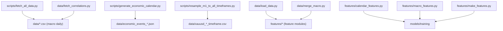

**Diagram sources**
- [fetch_all_data.py:131-214](file://scripts/fetch_all_data.py#L131-L214)
- [generate_economic_calendar.py:231-268](file://scripts/generate_economic_calendar.py#L231-L268)
- [resample_m1_to_all_timeframes.py:103-166](file://scripts/resample_m1_to_all_timeframes.py#L103-L166)
- [load_data.py:5-73](file://data/load_data.py#L5-L73)
- [merge_macro.py:4-56](file://data/merge_macro.py#L4-L56)
- [fetch_correlations.py:5-52](file://data/fetch_correlations.py#L5-L52)
- [calendar_features.py:23-50](file://features/calendar_features.py#L23-L50)
- [macro_features.py:26-75](file://features/macro_features.py#L26-L75)
- [make_features.py:18-78](file://features/make_features.py#L18-L78)

**Section sources**
- [README.md:172-216](file://README.md#L172-L216)
- [README.md:294-325](file://README.md#L294-L325)

## Core Components
- Data loaders and validators: robust CSV parsing, column renaming, timezone handling, OHLC sanity checks
- Resampler: converts high-frequency M1 data to multiple timeframes efficiently
- Macro fetcher: downloads daily series from Yahoo Finance for macro indicators
- Calendar generator: builds a rule-based economic calendar covering major USD events
- Calendar features: computes timing, impact, and type features aligned to price timestamps
- Macro features: computes returns, momentum, and rolling correlations across macro series
- Sentiment analyzer: keyword-based or FinBERT-based sentiment scoring with aggregation
- Merge utility: aligns daily macro series to hourly gold prices via forward-fill

**Section sources**
- [load_data.py:5-73](file://data/load_data.py#L5-L73)
- [resample_m1_to_all_timeframes.py:23-88](file://scripts/resample_m1_to_all_timeframes.py#L23-L88)
- [fetch_all_data.py:27-128](file://scripts/fetch_all_data.py#L27-L128)
- [generate_economic_calendar.py:25-228](file://scripts/generate_economic_calendar.py#L25-L228)
- [calendar_features.py:53-249](file://features/calendar_features.py#L53-L249)
- [macro_features.py:78-445](file://features/macro_features.py#L78-L445)
- [sentiment_analysis.py:22-235](file://data/sentiment_analysis.py#L22-L235)
- [merge_macro.py:4-56](file://data/merge_macro.py#L4-L56)

## Architecture Overview
End-to-end flow from raw data to model-ready features:

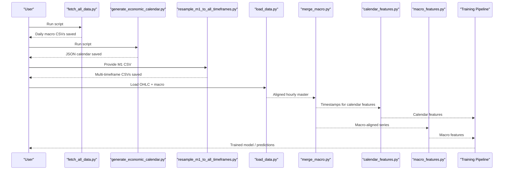

**Diagram sources**
- [fetch_all_data.py:131-214](file://scripts/fetch_all_data.py#L131-L214)
- [generate_economic_calendar.py:271-303](file://scripts/generate_economic_calendar.py#L271-L303)
- [resample_m1_to_all_timeframes.py:103-166](file://scripts/resample_m1_to_all_timeframes.py#L103-L166)
- [load_data.py:5-73](file://data/load_data.py#L5-L73)
- [merge_macro.py:4-56](file://data/merge_macro.py#L4-L56)
- [calendar_features.py:111-249](file://features/calendar_features.py#L111-L249)
- [macro_features.py:363-445](file://features/macro_features.py#L363-L445)

## Detailed Component Analysis

### Data Loading and Validation
- Reads MT5-style CSVs with auto-detection of separators and renames angle-bracket columns to standard names
- Combines date and time into a unified timestamp; supports both OHLC and macro formats
- Enforces numeric types, drops invalid rows, sorts by time, removes duplicates
- Performs OHLC sanity checks (high >= max(open, close, low), low <= min(open, close, high))
- Selects only necessary columns for downstream use

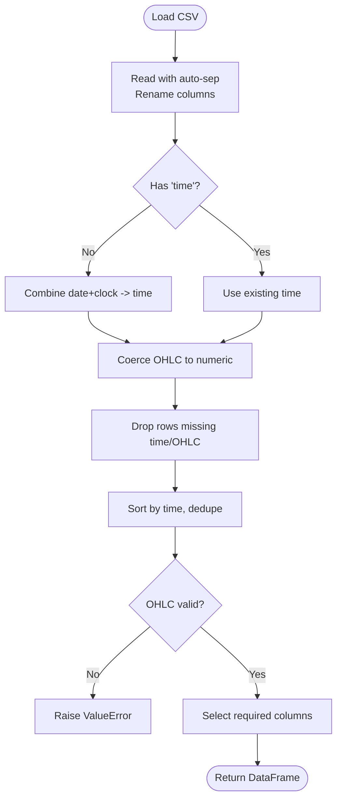

**Diagram sources**
- [load_data.py:5-73](file://data/load_data.py#L5-L73)

**Section sources**
- [load_data.py:5-73](file://data/load_data.py#L5-L73)

### Resampling Utilities
- Loads M1 data from MetaTrader format, sets datetime index, and resamples to M5, M15, H1, H4, D1 using correct OHLC aggregations
- Drops incomplete periods and saves standardized CSVs with consistent column names

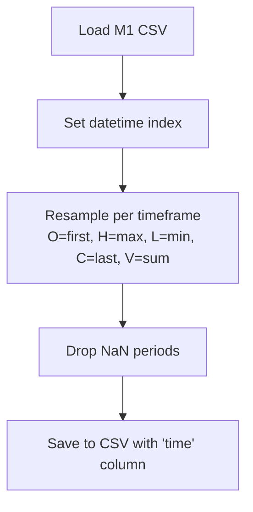

**Diagram sources**
- [resample_m1_to_all_timeframes.py:23-88](file://scripts/resample_m1_to_all_timeframes.py#L23-L88)
- [resample_m1_to_all_timeframes.py:91-100](file://scripts/resample_m1_to_all_timeframes.py#L91-L100)

**Section sources**
- [resample_m1_to_all_timeframes.py:23-166](file://scripts/resample_m1_to_all_timeframes.py#L23-L166)

### Macro Data Collection
- Downloads daily series for VIX, WTI Oil, Bitcoin, EURUSD, Silver, GLD, and optionally Dollar Index
- Normalizes column names and saves to data directory
- Provides helper to align daily series to hourly reference via forward-fill

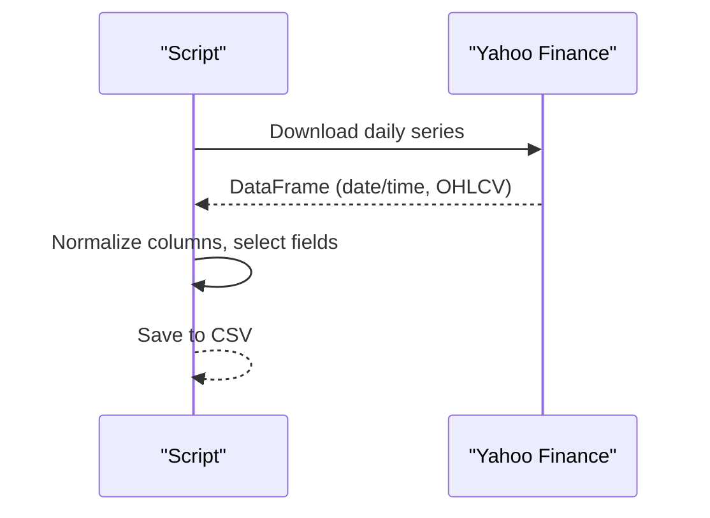

**Diagram sources**
- [fetch_all_data.py:27-128](file://scripts/fetch_all_data.py#L27-L128)
- [fetch_all_data.py:131-214](file://scripts/fetch_all_data.py#L131-L214)

**Section sources**
- [fetch_all_data.py:27-128](file://scripts/fetch_all_data.py#L27-L128)
- [fetch_all_data.py:131-214](file://scripts/fetch_all_data.py#L131-L214)

### Economic Calendar Generation
- Rule-based generator creates events for NFP, CPI, FOMC, GDP, Retail Sales, PCE over a multi-year range
- Each event includes datetime, name, currency, impact level, description, and typical move estimate
- Outputs a JSON file consumed by calendar features

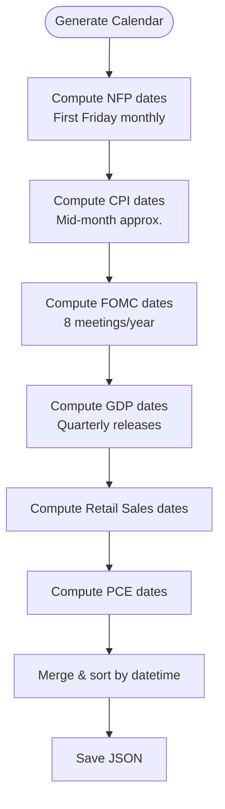

**Diagram sources**
- [generate_economic_calendar.py:25-228](file://scripts/generate_economic_calendar.py#L25-L228)
- [generate_economic_calendar.py:231-268](file://scripts/generate_economic_calendar.py#L231-L268)

**Section sources**
- [generate_economic_calendar.py:25-268](file://scripts/generate_economic_calendar.py#L25-L268)

### Economic Calendar Features
- Loads JSON calendar, finds next/past events relative to each timestamp
- Computes timing features (hours to event, days since event), density (events in next 7 days), impact flags, event window detection, expected volatility multiplier, and one-hot event types (NFP, FOMC)
- Normalizes and fills NaNs; integrates seamlessly with price indices

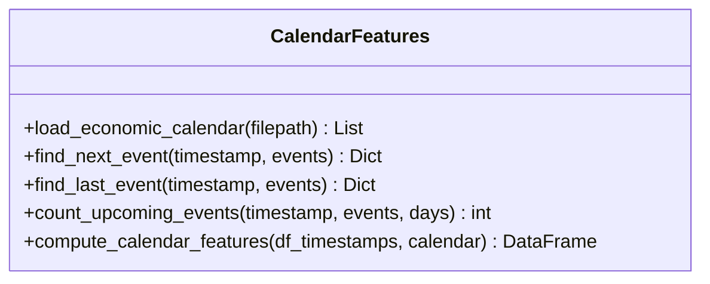

**Diagram sources**
- [calendar_features.py:23-50](file://features/calendar_features.py#L23-L50)
- [calendar_features.py:53-249](file://features/calendar_features.py#L53-L249)

**Section sources**
- [calendar_features.py:23-249](file://features/calendar_features.py#L23-L249)

### Macro Features
- Loads macro series (DXY, SPX, US10Y, VIX, Oil, BTC, EURUSD, Silver, GLD)
- Aligns daily series to gold timestamps using timezone normalization and forward-fill
- Computes per-source features: returns, momentum, and rolling correlation with gold
- Aggregates all source features and reindexes back to original intraday frequency

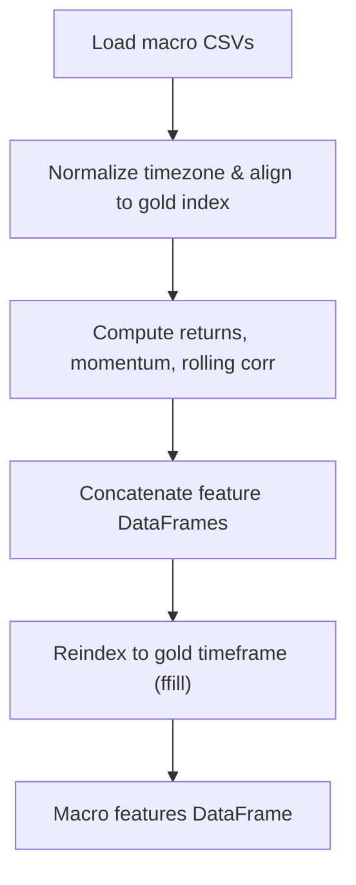

**Diagram sources**
- [macro_features.py:26-75](file://features/macro_features.py#L26-L75)
- [macro_features.py:78-132](file://features/macro_features.py#L78-L132)
- [macro_features.py:135-445](file://features/macro_features.py#L135-L445)

**Section sources**
- [macro_features.py:26-445](file://features/macro_features.py#L26-L445)

### Sentiment Analysis Integration
- Optional FinBERT-based headline sentiment or keyword-based fallback
- Fed speech hawkish/dovish scoring via keyword counts
- Aggregation across news, Fed text, and social placeholders with momentum and divergence metrics
- Designed to be extended with real APIs (NewsAPI, Twitter, Reddit)

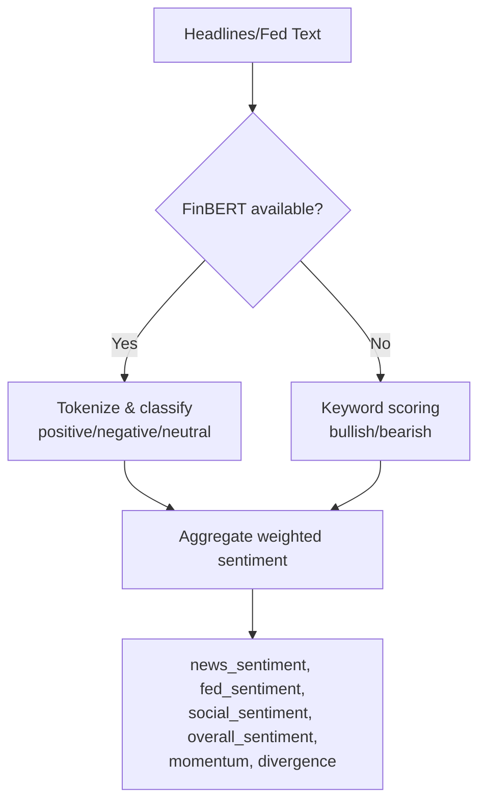

**Diagram sources**
- [sentiment_analysis.py:22-235](file://data/sentiment_analysis.py#L22-L235)

**Section sources**
- [sentiment_analysis.py:22-235](file://data/sentiment_analysis.py#L22-L235)

### Data Merging Utility
- Loads master hourly gold series and merges daily macro series (DXY, SPX, US10Y) by forward-filling to hourly timestamps
- Saves merged dataset ready for feature computation

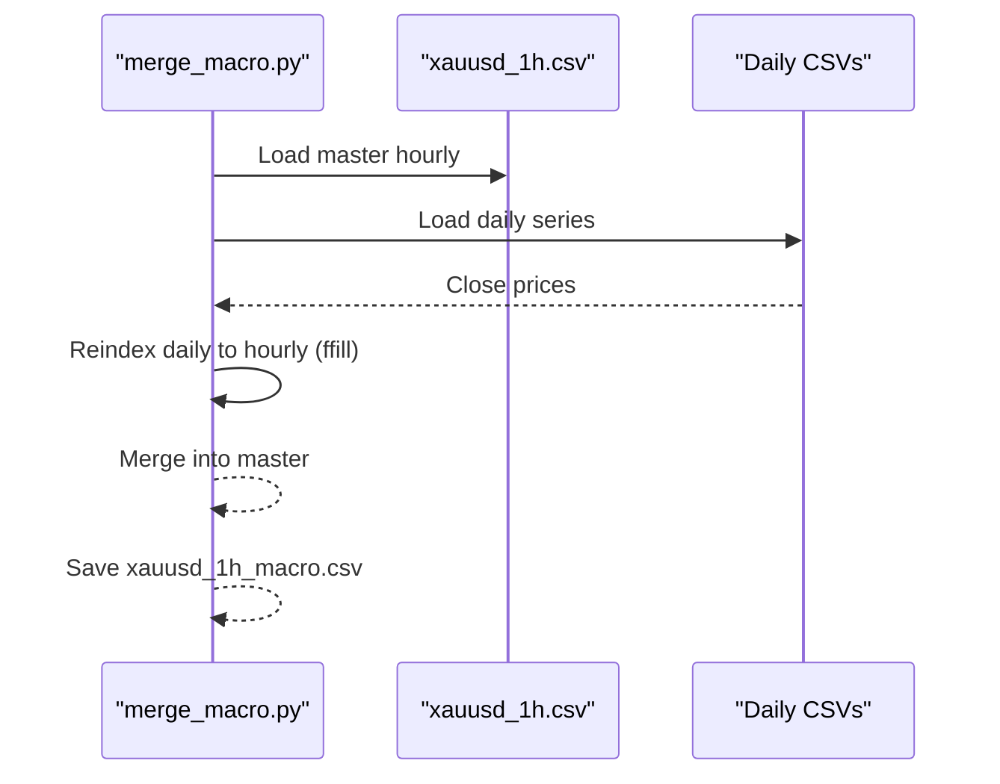

**Diagram sources**
- [merge_macro.py:4-56](file://data/merge_macro.py#L4-L56)

**Section sources**
- [merge_macro.py:4-56](file://data/merge_macro.py#L4-L56)

### Feature Engineering and Training Inputs
- Technical features: log returns, rolling volatility, momentum, moving averages, RSI, MACD
- Macro-aware features: log returns of DXY/SPX, US10Y changes, rolling correlations
- Final arrays are cleaned (NaN/inf replaced), normalized, and prepared for model training

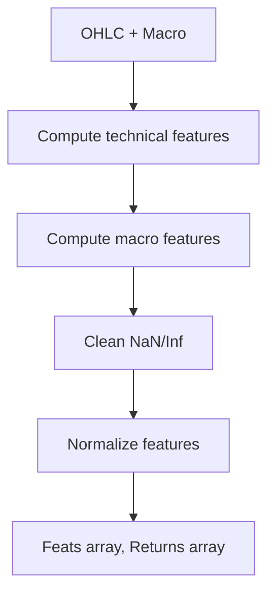

**Diagram sources**
- [make_features.py:18-78](file://features/make_features.py#L18-L78)

**Section sources**
- [make_features.py:18-78](file://features/make_features.py#L18-L78)

## Dependency Analysis
Key dependencies and relationships:
- Scripts produce artifacts consumed by feature modules:
  - fetch_all_data.py → daily macro CSVs used by macro_features.py
  - generate_economic_calendar.py → JSON calendar used by calendar_features.py
  - resample_m1_to_all_timeframes.py → multi-timeframe CSVs used by environment and feature pipelines
- load_data.py is a shared utility for reading and validating CSVs
- merge_macro.py bridges daily macro to hourly gold for simpler feature workflows
- calendar_features.py and macro_features.py feed into training via make_features.py or direct usage

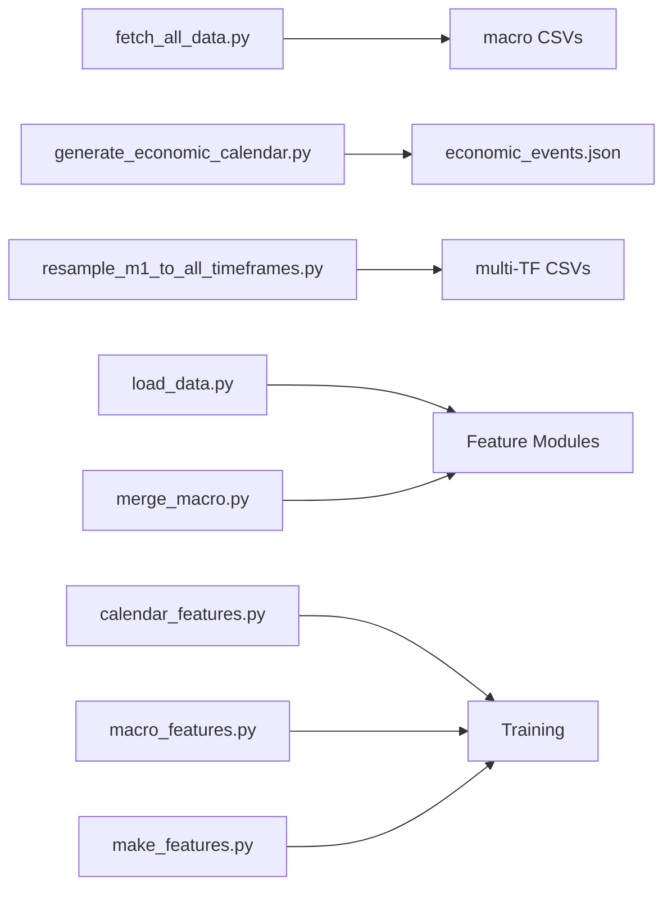

**Diagram sources**
- [fetch_all_data.py:131-214](file://scripts/fetch_all_data.py#L131-L214)
- [generate_economic_calendar.py:271-303](file://scripts/generate_economic_calendar.py#L271-L303)
- [resample_m1_to_all_timeframes.py:103-166](file://scripts/resample_m1_to_all_timeframes.py#L103-L166)
- [load_data.py:5-73](file://data/load_data.py#L5-L73)
- [merge_macro.py:4-56](file://data/merge_macro.py#L4-L56)
- [calendar_features.py:111-249](file://features/calendar_features.py#L111-L249)
- [macro_features.py:363-445](file://features/macro_features.py#L363-L445)
- [make_features.py:18-78](file://features/make_features.py#L18-L78)

**Section sources**
- [README.md:418-471](file://README.md#L418-L471)

## Performance Considerations
- Efficient resampling uses vectorized pandas operations; ensure M1 input is sorted and indexed by datetime to minimize overhead
- Forward-fill alignment for daily macro to hourly reduces memory churn; consider chunking if working with very long series
- Rolling correlations and momentum computations scale with window size; tune windows to balance signal quality and performance
- For large datasets:
  - Prefer parquet or feather for intermediate storage to reduce I/O time and preserve dtypes
  - Use lazy evaluation where possible (e.g., dask) if memory becomes constrained
  - Cache computed calendars and macro series to avoid recomputation during training runs
- Incremental updates:
  - Append new daily macro rows and re-align rather than full reload when feasible
  - Maintain append-only logs for M1 data and regenerate higher timeframes incrementally

[No sources needed since this section provides general guidance]

## Troubleshooting Guide
Common issues and resolutions:
- Missing files or paths:
  - Ensure macro CSVs exist before running macro features; handle warnings and continue gracefully
  - If calendar JSON is missing, calendar features fall back to neutral defaults
- Timezone mismatches:
  - Macro features normalize timezones to UTC then remove tzinfo; verify indexes are naive DatetimeIndex
  - Merge utility explicitly localizes and removes tz to avoid misalignment
- Invalid OHLC:
  - load_data.py raises errors if high < max(open, close, low) or low > min(open, close, high); inspect raw data and clean outliers
- Empty or partial downloads:
  - fetch_all_data.py logs warnings when no data returned; verify symbols and network connectivity
- NaN propagation:
  - After computing features, fill NaNs with zeros or appropriate defaults; check for excessive NaNs in final feature sets

**Section sources**
- [load_data.py:26-73](file://data/load_data.py#L26-L73)
- [macro_features.py:78-112](file://features/macro_features.py#L78-L112)
- [merge_macro.py:16-56](file://data/merge_macro.py#L16-L56)
- [fetch_all_data.py:42-64](file://scripts/fetch_all_data.py#L42-L64)
- [calendar_features.py:128-138](file://features/calendar_features.py#L128-L138)

## Conclusion
The data management system provides a robust, modular pipeline that:
- Collects diverse macro and market data
- Generates comprehensive economic calendars
- Resamples high-frequency data to multiple timeframes
- Validates and cleans data rigorously
- Produces rich features for model training
It balances flexibility and performance while offering clear extension points for additional data sources and improved sentiment analysis.

[No sources needed since this section summarizes without analyzing specific files]

## Appendices

### Practical Usage Examples
- Fetch macro data:
  - Run the script to download daily series and save CSVs
  - Reference: [fetch_all_data.py:131-214](file://scripts/fetch_all_data.py#L131-L214)
- Generate economic calendar:
  - Create a JSON calendar spanning multiple years
  - Reference: [generate_economic_calendar.py:271-303](file://scripts/generate_economic_calendar.py#L271-L303)
- Resample M1 to other timeframes:
  - Provide M1 CSV and output multi-TF CSVs
  - Reference: [resample_m1_to_all_timeframes.py:103-166](file://scripts/resample_m1_to_all_timeframes.py#L103-L166)
- Merge macro into hourly gold:
  - Align daily macro to hourly master and save merged dataset
  - Reference: [merge_macro.py:4-56](file://data/merge_macro.py#L4-L56)
- Load and validate OHLC:
  - Use loader to read, validate, and prepare data
  - Reference: [load_data.py:5-73](file://data/load_data.py#L5-L73)

**Section sources**
- [README.md:294-325](file://README.md#L294-L325)
- [fetch_all_data.py:131-214](file://scripts/fetch_all_data.py#L131-L214)
- [generate_economic_calendar.py:271-303](file://scripts/generate_economic_calendar.py#L271-L303)
- [resample_m1_to_all_timeframes.py:103-166](file://scripts/resample_m1_to_all_timeframes.py#L103-L166)
- [merge_macro.py:4-56](file://data/merge_macro.py#L4-L56)
- [load_data.py:5-73](file://data/load_data.py#L5-L73)