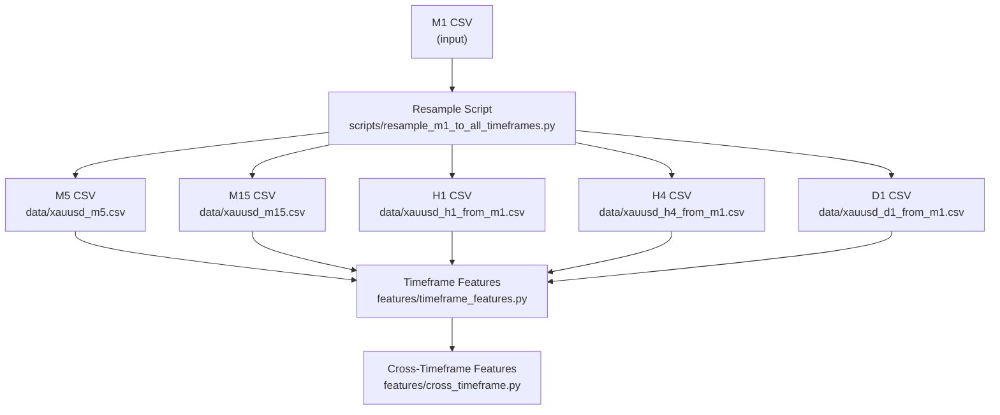
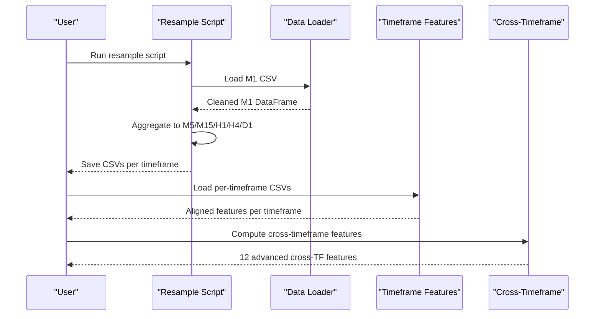
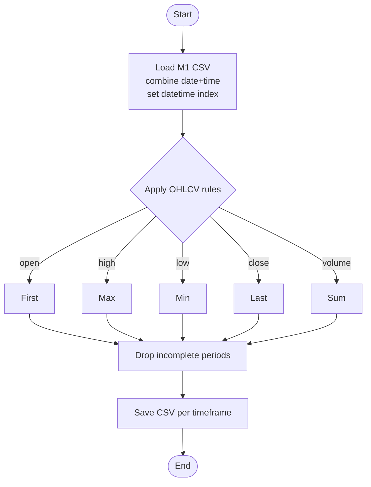
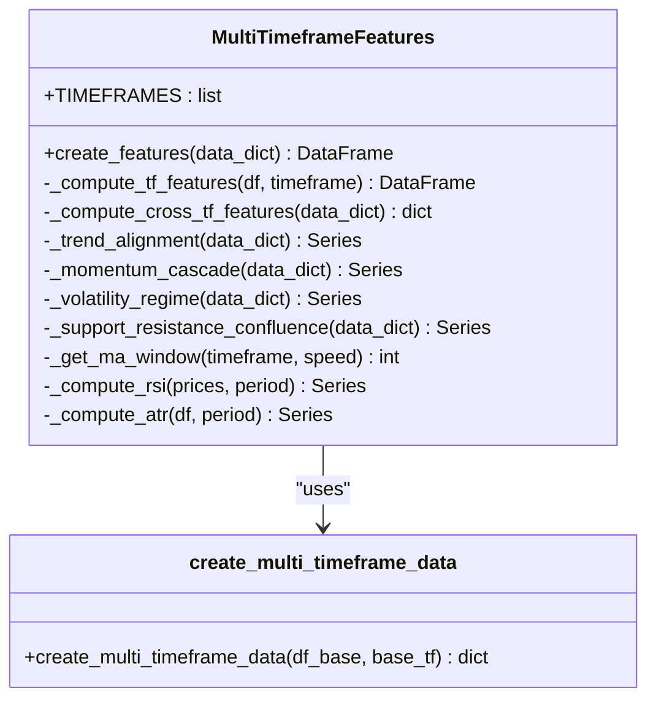
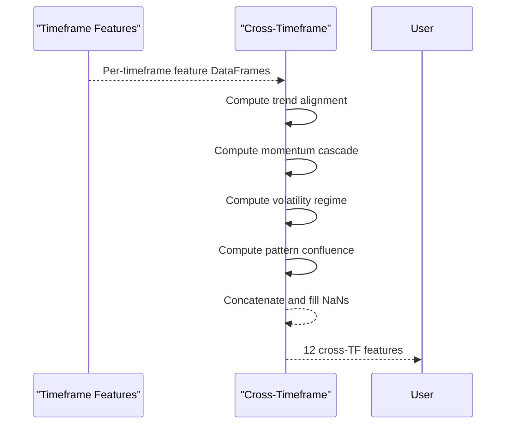
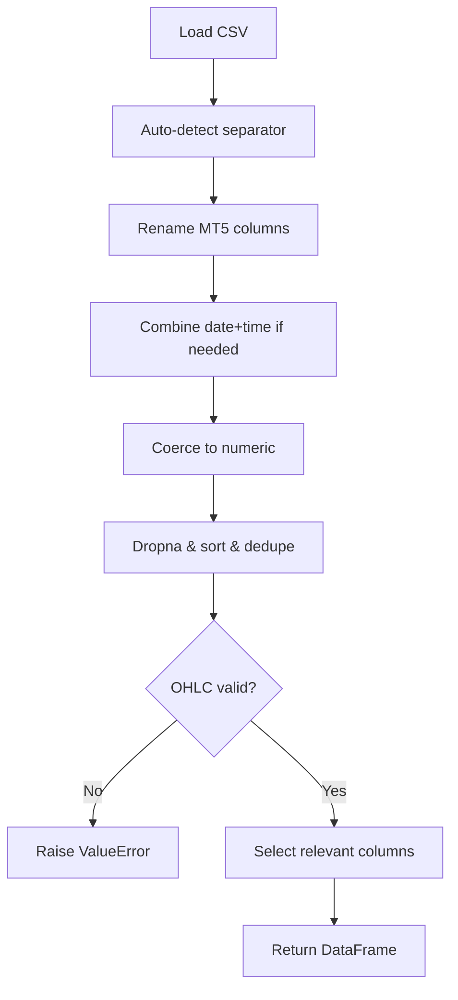
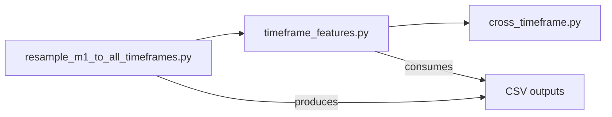

# Data Resampling Utilities

<cite>
**Referenced Files in This Document**
- [resample_m1_to_all_timeframes.py](file://scripts/resample_m1_to_all_timeframes.py)
- [multi_timeframe.py](file://features/multi_timeframe.py)
- [cross_timeframe.py](file://features/cross_timeframe.py)
- [timeframe_features.py](file://features/timeframe_features.py)
- [load_data.py](file://data/load_data.py)
</cite>

## Table of Contents
1. [Introduction](#introduction)
2. [Project Structure](#project-structure)
3. [Core Components](#core-components)
4. [Architecture Overview](#architecture-overview)
5. [Detailed Component Analysis](#detailed-component-analysis)
6. [Dependency Analysis](#dependency-analysis)
7. [Performance Considerations](#performance-considerations)
8. [Troubleshooting Guide](#troubleshooting-guide)
9. [Conclusion](#conclusion)
10. [Appendices](#appendices)

## Introduction
This document explains the data resampling utilities that transform high-resolution M1 (1-minute) OHLCV data into multiple timeframes: M5, M15, H1, H4, D1, and W1. It details the aggregation rules used for OHLCV transformation, how missing data and gaps are handled, and how resampled data integrates with multi-timeframe analysis features. Practical usage instructions, configuration guidance, and validation steps are included to ensure quality and reproducibility. Performance considerations for large datasets and incremental resampling strategies are also provided.

## Project Structure
The resampling pipeline is centered around a dedicated script that reads M1 data and produces standardized CSV outputs for each target timeframe. Downstream modules consume these files to compute per-timeframe features and cross-timeframe intelligence.

**Diagram sources**
- [resample_m1_to_all_timeframes.py:103-136](file://scripts/resample_m1_to_all_timeframes.py#L103-L136)
- [timeframe_features.py:236-304](file://features/timeframe_features.py#L236-L304)
- [cross_timeframe.py:205-249](file://features/cross_timeframe.py#L205-L249)

**Section sources**
- [resample_m1_to_all_timeframes.py:1-172](file://scripts/resample_m1_to_all_timeframes.py#L1-172)
- [timeframe_features.py:1-356](file://features/timeframe_features.py#L1-L356)
- [cross_timeframe.py:1-309](file://features/cross_timeframe.py#L1-L309)

## Core Components
- Resampling script: Reads M1 data, aggregates to target timeframes using OHLCV rules, and saves CSVs.
- Timeframe feature module: Loads per-timeframe CSVs, computes indicators, and aligns all timeframes to a base index.
- Cross-timeframe module: Derives advanced features capturing relationships across timeframes (trend alignment, momentum cascade, volatility regime, pattern confluence).
- Data loader: Robustly loads OHLCV CSVs, normalizes columns, validates OHLC consistency, and cleans data.

Key responsibilities:
- Aggregation: open=first, high=max, low=min, close=last, volume=sum.
- Alignment: Higher timeframe data forward-filled to the base timeframe’s timestamps.
- Validation: Ensures required columns, numeric types, and OHLC logical constraints.

**Section sources**
- [resample_m1_to_all_timeframes.py:61-88](file://scripts/resample_m1_to_all_timeframes.py#L61-L88)
- [timeframe_features.py:181-233](file://features/timeframe_features.py#L181-L233)
- [cross_timeframe.py:205-249](file://features/cross_timeframe.py#L205-L249)
- [load_data.py:5-73](file://data/load_data.py#L5-L73)

## Architecture Overview
The system follows a clear separation of concerns:
- Data ingestion and cleaning via a robust loader.
- Deterministic resampling from M1 to higher timeframes.
- Feature computation per timeframe.
- Cross-timeframe synthesis for richer signals.

**Diagram sources**
- [resample_m1_to_all_timeframes.py:103-136](file://scripts/resample_m1_to_all_timeframes.py#L103-L136)
- [timeframe_features.py:236-304](file://features/timeframe_features.py#L236-L304)
- [cross_timeframe.py:205-249](file://features/cross_timeframe.py#L205-L249)
- [load_data.py:5-73](file://data/load_data.py#L5-L73)

## Detailed Component Analysis

### Resampling Engine (M1 to All Timeframes)
- Input format: MetaTrader-style CSV with date/time and OHLCV fields; script combines date/time into a datetime index and renames columns to a standard schema.
- Aggregation rules:
  - Open: first value in the period
  - High: maximum price in the period
  - Low: minimum price in the period
  - Close: last value in the period
  - Volume: sum of volumes in the period
- Output: One CSV per target timeframe with a time column and OHLCV fields.

**Diagram sources**
- [resample_m1_to_all_timeframes.py:23-58](file://scripts/resample_m1_to_all_timeframes.py#L23-L58)
- [resample_m1_to_all_timeframes.py:61-88](file://scripts/resample_m1_to_all_timeframes.py#L61-L88)
- [resample_m1_to_all_timeframes.py:91-101](file://scripts/resample_m1_to_all_timeframes.py#L91-L101)

Practical usage:
- Configure input path and output directory in the script’s main function.
- Target timeframes are defined in a mapping of name to pandas resample rule and filename.
- After running, verify generated CSVs exist and contain expected rows.

Validation tips:
- Check row counts and compression ratios relative to M1 bars.
- Spot-check a few periods to confirm open/close/high/low/volume logic.
- Ensure no NaNs remain after dropping incomplete periods.

**Section sources**
- [resample_m1_to_all_timeframes.py:103-166](file://scripts/resample_m1_to_all_timeframes.py#L103-L166)

### Multi-Timeframe Feature Construction
- Computes per-timeframe features including returns, volatility, momentum, moving averages, RSI, MACD, ATR, Bollinger Band position, volume ratio, and distances to recent highs/lows.
- Aligns all timeframes to a base timeframe (default M5) by reindexing higher timeframes with forward-fill to match the base timestamps.

**Diagram sources**
- [multi_timeframe.py:32-96](file://features/multi_timeframe.py#L32-L96)
- [multi_timeframe.py:98-156](file://features/multi_timeframe.py#L98-L156)
- [multi_timeframe.py:158-317](file://features/multi_timeframe.py#L158-L317)
- [multi_timeframe.py:350-396](file://features/multi_timeframe.py#L350-L396)

Alignment behavior:
- Higher timeframe series are forward-filled to the base timeframe’s index, ensuring every base bar has aligned values from higher timeframes.

**Section sources**
- [multi_timeframe.py:32-96](file://features/multi_timeframe.py#L32-L96)
- [multi_timeframe.py:350-396](file://features/multi_timeframe.py#L350-L396)

### Cross-Timeframe Intelligence
- Produces 12 advanced features grouped into:
  - Trend alignment (agreement across timeframes)
  - Momentum cascade (higher-to-lower momentum interactions)
  - Volatility regime (current vs long-term volatility, spikes, compression)
  - Pattern confluence (support/resistance alignment and breakout confirmation)
- Operates on per-timeframe feature DataFrames produced by the timeframe module.

**Diagram sources**
- [cross_timeframe.py:205-249](file://features/cross_timeframe.py#L205-L249)
- [cross_timeframe.py:21-66](file://features/cross_timeframe.py#L21-L66)
- [cross_timeframe.py:69-102](file://features/cross_timeframe.py#L69-L102)
- [cross_timeframe.py:105-138](file://features/cross_timeframe.py#L105-L138)
- [cross_timeframe.py:141-202](file://features/cross_timeframe.py#L141-L202)

**Section sources**
- [cross_timeframe.py:205-249](file://features/cross_timeframe.py#L205-L249)

### Data Loading and Validation
- Automatically detects separators and handles MT5 angle-bracket column names.
- Combines date and time into a single datetime column when needed.
- Enforces numeric types for OHLC fields and optional tick volume.
- Drops invalid or missing rows and deduplicates by timestamp.
- Validates OHLC logical constraints (e.g., high >= max(open, close, low)).

**Diagram sources**
- [load_data.py:5-73](file://data/load_data.py#L5-L73)

**Section sources**
- [load_data.py:5-73](file://data/load_data.py#L5-L73)

## Dependency Analysis
- The resample script depends only on pandas/numpy and writes CSVs consumed by downstream modules.
- Timeframe features module reads those CSVs, computes indicators, and aligns timeframes.
- Cross-timeframe module consumes per-timeframe features to produce advanced signals.

**Diagram sources**
- [resample_m1_to_all_timeframes.py:103-136](file://scripts/resample_m1_to_all_timeframes.py#L103-L136)
- [timeframe_features.py:236-304](file://features/timeframe_features.py#L236-L304)
- [cross_timeframe.py:205-249](file://features/cross_timeframe.py#L205-L249)

**Section sources**
- [resample_m1_to_all_timeframes.py:103-136](file://scripts/resample_m1_to_all_timeframes.py#L103-L136)
- [timeframe_features.py:236-304](file://features/timeframe_features.py#L236-L304)
- [cross_timeframe.py:205-249](file://features/cross_timeframe.py#L205-L249)

## Performance Considerations
- Memory footprint: Large M1 datasets can be memory-intensive. Consider chunked processing or downcasting numeric types where possible before resampling.
- Vectorized operations: The resampling uses pandas’ vectorized resample and aggregation, which are efficient for large inputs.
- Alignment strategy: Forward-filling higher timeframes avoids expensive joins and minimizes memory churn.
- Incremental resampling: For ongoing updates, append new M1 bars and re-run resampling only for affected windows. Since aggregation is window-based, newly completed windows can be computed independently and concatenated to existing outputs.
- Disk I/O: Batch writes per timeframe and avoid unnecessary intermediate copies. Use consistent naming to simplify incremental pipelines.

[No sources needed since this section provides general guidance]

## Troubleshooting Guide
Common issues and resolutions:
- Missing columns: Ensure CSVs contain required OHLCV fields. The loader enforces presence and raises errors otherwise.
- Invalid OHLC: If high < max(open, close, low) or low > min(open, close, high), the loader will raise an error. Inspect raw data for anomalies.
- NaNs after resampling: Incomplete periods are dropped. Verify that your M1 data covers full trading sessions for target timeframes.
- Misaligned timezones: Ensure timestamps are timezone-aware or consistently naive across datasets to avoid unexpected shifts.
- File not found: Confirm that resampled CSVs exist at expected paths before running feature modules.

Operational checks:
- Validate row counts and date ranges post-resampling.
- Spot-check a few bars per timeframe to confirm aggregation correctness.
- Use the built-in tests in timeframe and cross-timeframe modules to validate end-to-end flows.

**Section sources**
- [load_data.py:26-73](file://data/load_data.py#L26-L73)
- [resample_m1_to_all_timeframes.py:83-88](file://scripts/resample_m1_to_all_timeframes.py#L83-L88)
- [timeframe_features.py:236-304](file://features/timeframe_features.py#L236-L304)
- [cross_timeframe.py:252-287](file://features/cross_timeframe.py#L252-L287)

## Conclusion
The resampling utilities provide a robust, deterministic pathway from M1 data to multiple higher timeframes using well-defined OHLCV aggregation rules. Downstream modules build rich per-timeframe and cross-timeframe features aligned to a common base timeframe, enabling comprehensive multi-timeframe analysis. With careful handling of missing data, validation, and performance-conscious practices, this pipeline supports scalable and reliable market analysis workflows.

[No sources needed since this section summarizes without analyzing specific files]

## Appendices

### Running the Resampling Script
- Prepare M1 CSV with MT5-style columns or standardize to the expected schema.
- Update input/output paths in the script’s main function if necessary.
- Execute the script to generate M5, M15, H1, H4, and D1 CSVs.
- Verify outputs by checking file existence, row counts, and sample rows.

Configuration options:
- Target timeframes are configured via a mapping of timeframe names to pandas resample rules and filenames.
- Output directory can be adjusted to suit project structure.

Quality validation:
- Compare compression ratios to expected multiples (e.g., H1 should be roughly 1/60 of M1).
- Validate that open/close correspond to first/last prices and that high/low span the period correctly.
- Ensure no residual NaNs in critical fields.

**Section sources**
- [resample_m1_to_all_timeframes.py:103-166](file://scripts/resample_m1_to_all_timeframes.py#L103-L166)

### Relationship to Multi-Timeframe Analysis
- Resampled CSVs feed directly into the timeframe features module, which computes indicators per timeframe and aligns them to a base timeframe (default M5).
- Cross-timeframe features then synthesize relationships across timeframes to capture trend alignment, momentum cascades, volatility regimes, and support/resistance confluence.
- This layered approach enables nuanced decision-making by combining short-term timing (M5/M15) with medium-term context (H1/H4) and long-term direction (D1/W1).

**Section sources**
- [timeframe_features.py:236-304](file://features/timeframe_features.py#L236-L304)
- [cross_timeframe.py:205-249](file://features/cross_timeframe.py#L205-L249)
- [multi_timeframe.py:32-96](file://features/multi_timeframe.py#L32-L96)