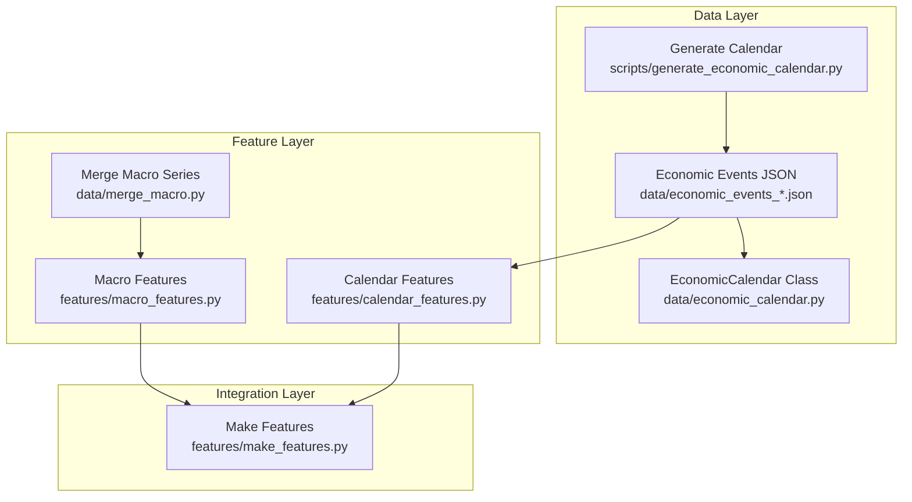
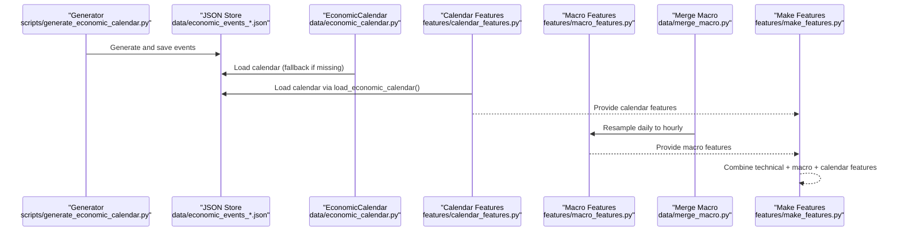
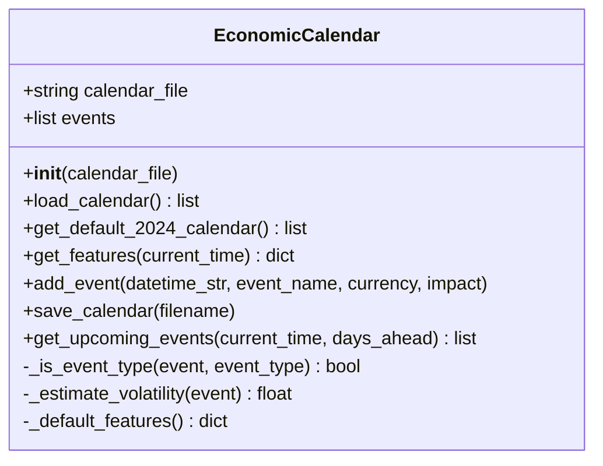
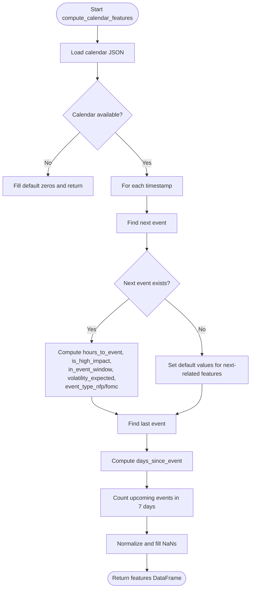
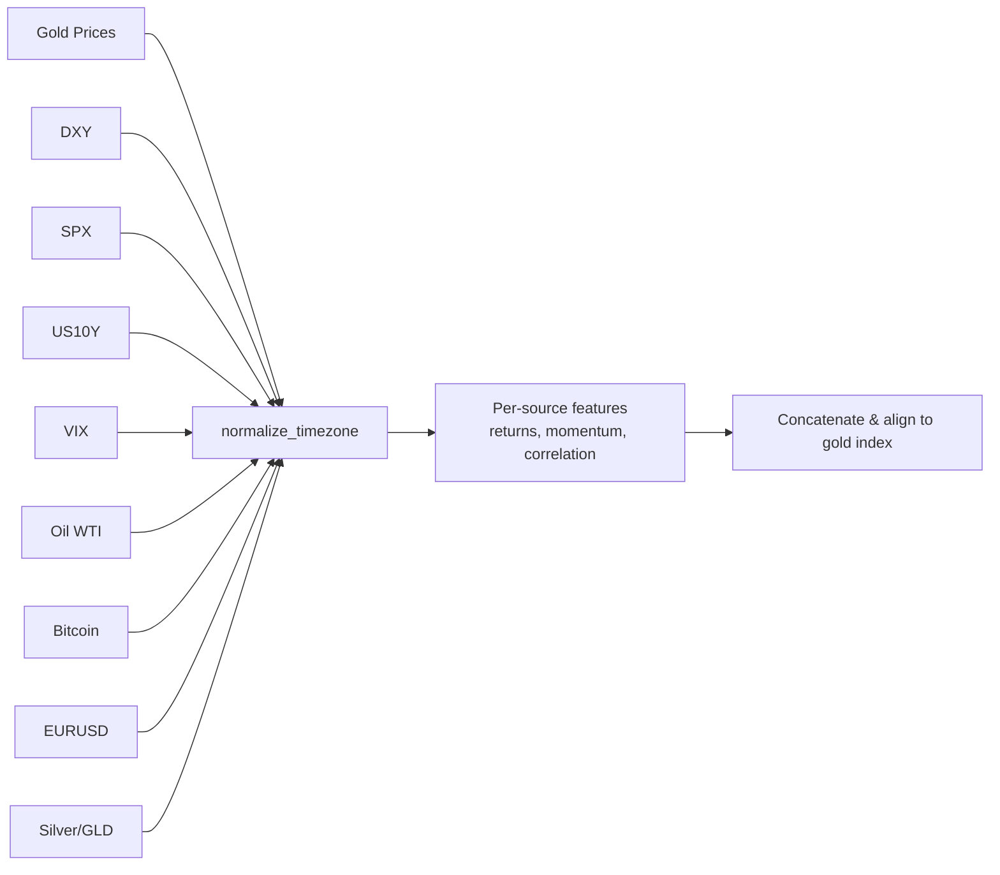
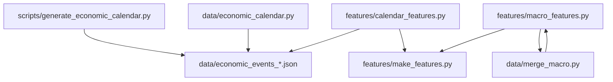

# Economic Calendar Processing

<cite>
**Referenced Files in This Document**
- [economic_calendar.py](file://data/economic_calendar.py)
- [calendar_features.py](file://features/calendar_features.py)
- [generate_economic_calendar.py](file://scripts/generate_economic_calendar.py)
- [macro_features.py](file://features/macro_features.py)
- [merge_macro.py](file://data/merge_macro.py)
- [make_features.py](file://features/make_features.py)
</cite>

## Table of Contents
1. [Introduction](#introduction)
2. [Project Structure](#project-structure)
3. [Core Components](#core-components)
4. [Architecture Overview](#architecture-overview)
5. [Detailed Component Analysis](#detailed-component-analysis)
6. [Dependency Analysis](#dependency-analysis)
7. [Performance Considerations](#performance-considerations)
8. [Troubleshooting Guide](#troubleshooting-guide)
9. [Conclusion](#conclusion)
10. [Appendices](#appendices)

## Introduction
This document explains the economic calendar processing system used to ingest, parse, and transform macroeconomic announcements into features that inform trading models. It covers:
- The event parsing pipeline that extracts high-impact events (e.g., NFP, CPI, FOMC) from rule-based generators and JSON calendars
- The importance classification system (high, medium, low) and how it drives volatility expectations
- The JSON format for storing economic events with dates, descriptions, actual vs forecast values, and currency impacts
- Practical examples for generating calendars, customizing filters, and integrating calendar data with trading features
- How calendar features are computed and consumed by model training pipelines
- Data quality checks, duplicate handling strategies, and timezone considerations for global events

## Project Structure
The economic calendar system spans data ingestion, feature computation, and integration with broader macro features:
- Data layer: rule-based generator and JSON storage for scheduled events
- Feature layer: calendar-specific features and advanced macro features
- Integration layer: merging macro series and combining all features for modeling

**Diagram sources**
- [generate_economic_calendar.py:231-268](file://scripts/generate_economic_calendar.py#L231-L268)
- [economic_calendar.py:27-79](file://data/economic_calendar.py#L27-L79)
- [calendar_features.py:23-50](file://features/calendar_features.py#L23-L50)
- [macro_features.py:26-75](file://features/macro_features.py#L26-L75)
- [merge_macro.py:4-56](file://data/merge_macro.py#L4-L56)
- [make_features.py:18-78](file://features/make_features.py#L18-L78)

**Section sources**
- [generate_economic_calendar.py:231-268](file://scripts/generate_economic_calendar.py#L231-L268)
- [economic_calendar.py:27-79](file://data/economic_calendar.py#L27-L79)
- [calendar_features.py:23-50](file://features/calendar_features.py#L23-L50)
- [macro_features.py:26-75](file://features/macro_features.py#L26-L75)
- [merge_macro.py:4-56](file://data/merge_macro.py#L4-L56)
- [make_features.py:18-78](file://features/make_features.py#L18-L78)

## Core Components
- EconomicCalendar class: loads a JSON calendar or falls back to a default set of major USD events; computes time-to-event features and expected volatility multipliers
- Calendar features module: computes eight normalized features per timestamp based on next/last events, impact flags, event windows, and type indicators
- Macro features module: aligns external macro series (DXY, SPX, yields, VIX, oil, BTC, EURUSD, silver/GLD) to gold timestamps and derives returns, momentum, and correlations
- Merge macro module: resamples daily macro series to hourly to match master OHLC
- Make features module: combines price-derived technical features with macro features for modeling

Key responsibilities:
- Parsing and validating JSON calendars
- Computing event-aware features for each timestamp
- Aligning heterogeneous macro data across timezones and frequencies
- Producing clean, normalized feature sets for training

**Section sources**
- [economic_calendar.py:27-79](file://data/economic_calendar.py#L27-L79)
- [calendar_features.py:111-249](file://features/calendar_features.py#L111-L249)
- [macro_features.py:363-445](file://features/macro_features.py#L363-L445)
- [merge_macro.py:4-56](file://data/merge_macro.py#L4-L56)
- [make_features.py:18-78](file://features/make_features.py#L18-L78)

## Architecture Overview
End-to-end flow from event generation to model-ready features:

**Diagram sources**
- [generate_economic_calendar.py:271-307](file://scripts/generate_economic_calendar.py#L271-L307)
- [economic_calendar.py:81-113](file://data/economic_calendar.py#L81-L113)
- [calendar_features.py:23-50](file://features/calendar_features.py#L23-L50)
- [merge_macro.py:4-56](file://data/merge_macro.py#L4-L56)
- [macro_features.py:363-445](file://features/macro_features.py#L363-L445)
- [make_features.py:18-78](file://features/make_features.py#L18-L78)

## Detailed Component Analysis

### EconomicCalendar Class
Responsibilities:
- Load JSON calendar or generate default 2024 USD events
- Compute features for any timestamp: days/hours until next event, event window flags, event type one-hot, expected volatility multiplier
- Add/save events and query upcoming events within a horizon

Important behaviors:
- Impact classification: HIGH/MEDIUM/LOW stored in events; defaults applied when missing
- Volatility estimation: maps known event types to multipliers; unknown HIGH events get moderate boost
- Time handling: converts ISO strings to datetime objects; supports string/Timestamp inputs

**Diagram sources**
- [economic_calendar.py:27-79](file://data/economic_calendar.py#L27-L79)
- [economic_calendar.py:81-113](file://data/economic_calendar.py#L81-L113)
- [economic_calendar.py:115-179](file://data/economic_calendar.py#L115-L179)
- [economic_calendar.py:181-275](file://data/economic_calendar.py#L181-L275)
- [economic_calendar.py:276-334](file://data/economic_calendar.py#L276-L334)

**Section sources**
- [economic_calendar.py:27-79](file://data/economic_calendar.py#L27-L79)
- [economic_calendar.py:81-113](file://data/economic_calendar.py#L81-L113)
- [economic_calendar.py:115-179](file://data/economic_calendar.py#L115-L179)
- [economic_calendar.py:181-275](file://data/economic_calendar.py#L181-L275)
- [economic_calendar.py:276-334](file://data/economic_calendar.py#L276-L334)

### Calendar Features Module
Computes eight normalized features per timestamp:
- hours_to_event: distance to next event, capped and normalized
- days_since_event: time since last event, capped and normalized
- event_density: count of upcoming events in next 7 days, capped and normalized
- is_high_impact: flag for next event’s impact
- in_event_window: binary indicator within ±2 hours of next event
- event_volatility_expected: multiplier based on impact
- event_type_nfp: one-hot for NFP-type events
- event_type_fomc: one-hot for FOMC/Fed Reserve events

Processing logic:
- Loads calendar JSON, converts datetime fields, and handles missing files gracefully
- Iterates timestamps to compute nearest future/past events and density
- Normalizes outputs and fills NaNs

**Diagram sources**
- [calendar_features.py:23-50](file://features/calendar_features.py#L23-L50)
- [calendar_features.py:53-108](file://features/calendar_features.py#L53-L108)
- [calendar_features.py:111-249](file://features/calendar_features.py#L111-L249)

**Section sources**
- [calendar_features.py:23-50](file://features/calendar_features.py#L23-L50)
- [calendar_features.py:53-108](file://features/calendar_features.py#L53-L108)
- [calendar_features.py:111-249](file://features/calendar_features.py#L111-L249)

### Macro Features Module
Integrates multiple macro series to produce 24 features:
- For each source (DXY, SPX, US10Y, VIX, Oil, BTC, EURUSD, Silver/GLD): returns, momentum, and rolling correlation with gold
- Timezone normalization ensures alignment to gold timestamps
- Daily macro series are aligned to intraday gold via forward-fill

Key functions:
- load_macro_data: reads CSVs, normalizes timezones, selects close prices
- normalize_timezone: converts to UTC then removes tzinfo and reindexes to reference
- compute_*_features: derive returns, momentum, and correlations per source
- compute_macro_features: combine all feature DataFrames and align back to original timeframe

**Diagram sources**
- [macro_features.py:26-75](file://features/macro_features.py#L26-L75)
- [macro_features.py:78-112](file://features/macro_features.py#L78-L112)
- [macro_features.py:135-360](file://features/macro_features.py#L135-L360)
- [macro_features.py:363-445](file://features/macro_features.py#L363-L445)

**Section sources**
- [macro_features.py:26-75](file://features/macro_features.py#L26-L75)
- [macro_features.py:78-112](file://features/macro_features.py#L78-L112)
- [macro_features.py:135-360](file://features/macro_features.py#L135-L360)
- [macro_features.py:363-445](file://features/macro_features.py#L363-L445)

### Merge Macro Module
Aligns daily macro series to hourly master dataset:
- Loads master OHLC (hourly), ensures naive datetimes
- Loads auxiliary daily series, keeps close only
- Reindexes to master index using forward-fill to propagate daily values across hours
- Merges columns and saves combined dataset

**Section sources**
- [merge_macro.py:4-56](file://data/merge_macro.py#L4-L56)

### Make Features Module
Combines technical and macro features for modeling:
- Computes log returns, volatility, momentum, moving average differences, RSI, MACD
- Adds macro returns and correlations when available
- Cleans NaNs, normalizes features, and returns arrays for training

**Section sources**
- [make_features.py:18-78](file://features/make_features.py#L18-L78)

## Dependency Analysis
- Generator depends on date utilities to create recurring event schedules
- EconomicCalendar depends on JSON I/O and datetime conversion
- Calendar features depend on loaded calendar and iterate over timestamps
- Macro features depend on CSV inputs and perform timezone normalization and rolling computations
- Merge macro depends on master hourly data and daily series to align frequencies
- Make features depends on merged macro data and produces final feature matrices

**Diagram sources**
- [generate_economic_calendar.py:231-268](file://scripts/generate_economic_calendar.py#L231-L268)
- [economic_calendar.py:81-113](file://data/economic_calendar.py#L81-L113)
- [calendar_features.py:23-50](file://features/calendar_features.py#L23-L50)
- [macro_features.py:363-445](file://features/macro_features.py#L363-L445)
- [merge_macro.py:4-56](file://data/merge_macro.py#L4-L56)
- [make_features.py:18-78](file://features/make_features.py#L18-L78)

**Section sources**
- [generate_economic_calendar.py:231-268](file://scripts/generate_economic_calendar.py#L231-L268)
- [economic_calendar.py:81-113](file://data/economic_calendar.py#L81-L113)
- [calendar_features.py:23-50](file://features/calendar_features.py#L23-L50)
- [macro_features.py:363-445](file://features/macro_features.py#L363-L445)
- [merge_macro.py:4-56](file://data/merge_macro.py#L4-L56)
- [make_features.py:18-78](file://features/make_features.py#L18-L78)

## Performance Considerations
- Event search efficiency: finding next/last events iterates over all events per timestamp; consider indexing events by datetime for large datasets
- Feature computation loops: calendar features loop over timestamps; vectorized approaches can reduce overhead
- Macro alignment: forward-filling daily data to hourly is efficient but may introduce stale values during holidays; validate gaps
- Memory usage: concatenating many feature DataFrames can be memory-intensive; process in chunks if needed

[No sources needed since this section provides general guidance]

## Troubleshooting Guide
Common issues and resolutions:
- Missing calendar file: modules fall back to defaults or empty features; ensure JSON exists at expected paths
- Timezone mismatches: macro features normalize to UTC then remove tzinfo; verify master timestamps are naive
- NaN propagation: ensure forward-fill and back-fill steps run after merges; check holiday gaps
- Duplicate events: generator creates deterministic schedules; deduplicate by sorting and unique keys if needed
- Unexpected volatility multipliers: confirm impact field presence; unknown events default to moderate boosts

Operational checks:
- Validate JSON schema includes required fields (datetime/time, event, impact, currency)
- Confirm event times are in consistent timezone before loading
- Verify feature ranges post-normalization and fill operations

**Section sources**
- [calendar_features.py:23-50](file://features/calendar_features.py#L23-L50)
- [macro_features.py:78-112](file://features/macro_features.py#L78-L112)
- [merge_macro.py:4-56](file://data/merge_macro.py#L4-L56)

## Conclusion
The economic calendar processing system integrates scheduled macro events into trading features through robust parsing, classification, and alignment mechanisms. It enables models to anticipate high-impact releases, adjust volatility expectations, and incorporate macro context alongside technical signals. With careful attention to timezone handling, data quality, and performance, the system provides a reliable foundation for event-aware trading strategies.

[No sources needed since this section summarizes without analyzing specific files]

## Appendices

### JSON Format for Economic Events
Typical structure stored in JSON:
- datetime/time: ISO string or parsed datetime
- event: human-readable name (e.g., Non-Farm Payrolls, CPI, FOMC Rate Decision)
- currency: affected currency (e.g., USD)
- impact: HIGH, MEDIUM, LOW
- description: optional text describing the release
- typical_move_pips: optional expected move magnitude
- forecast/previous: optional fields for actual vs forecast comparisons

Usage notes:
- Generator writes standardized entries with consistent fields
- Calendar loaders convert datetime strings to datetime objects
- Features use impact and event names to compute flags and volatility multipliers

**Section sources**
- [generate_economic_calendar.py:49-66](file://scripts/generate_economic_calendar.py#L49-L66)
- [generate_economic_calendar.py:84-101](file://scripts/generate_economic_calendar.py#L84-L101)
- [generate_economic_calendar.py:130-148](file://scripts/generate_economic_calendar.py#L130-L148)
- [calendar_features.py:41-47](file://features/calendar_features.py#L41-L47)
- [economic_calendar.py:81-113](file://data/economic_calendar.py#L81-L113)

### Importance Classification System
- HIGH: Major releases like NFP, CPI, FOMC decisions; drive larger volatility multipliers
- MEDIUM: Moderate impact events such as Retail Sales; moderate multipliers
- LOW: Minor releases; baseline multipliers

Implementation:
- Impact field in events determines flags and expected volatility
- Unknown events with HIGH impact receive moderate boosts; others default to baseline

**Section sources**
- [economic_calendar.py:57-67](file://data/economic_calendar.py#L57-L67)
- [calendar_features.py:165-180](file://features/calendar_features.py#L165-L180)

### Generating Economic Calendars
- Use the generator to produce a comprehensive calendar spanning multiple years
- Customize event rules (dates, times, impacts) by editing generator functions
- Save output to JSON for downstream consumption

Practical steps:
- Run generator script to create JSON
- Verify event counts and date ranges
- Integrate with calendar features module

**Section sources**
- [generate_economic_calendar.py:231-268](file://scripts/generate_economic_calendar.py#L231-L268)
- [generate_economic_calendar.py:271-307](file://scripts/generate_economic_calendar.py#L271-L307)

### Customizing Event Filters
- Filter by currency: select events affecting specific currencies
- Filter by impact: focus on HIGH or MEDIUM events
- Filter by event type: detect NFP/CPI/FOMC via string matching
- Adjust event windows: modify thresholds for “in event window” detection

**Section sources**
- [calendar_features.py:182-187](file://features/calendar_features.py#L182-L187)
- [economic_calendar.py:252-256](file://data/economic_calendar.py#L252-L256)

### Integrating Calendar Data with Trading Features
- Calendar features augment technical and macro features
- Combine via make_features pipeline to produce final input matrices
- Ensure alignment to master timestamps and consistent normalization

**Section sources**
- [make_features.py:18-78](file://features/make_features.py#L18-L78)
- [calendar_features.py:111-249](file://features/calendar_features.py#L111-L249)

### Relationship Between Economic Events and Model Training
- Calendar features provide awareness of upcoming macro events
- Models can learn to adjust positions around event windows
- Expected volatility multipliers help calibrate risk and position sizing

**Section sources**
- [calendar_features.py:165-187](file://features/calendar_features.py#L165-L187)
- [economic_calendar.py:181-234](file://data/economic_calendar.py#L181-L234)

### Data Quality Checks, Duplicate Handling, and Timezone Considerations
- Data quality: validate JSON schema, ensure datetime parsing, handle missing fields
- Duplicate handling: sort events by datetime and apply uniqueness if necessary
- Timezone: macro features normalize to UTC then remove tzinfo; master timestamps should be naive for alignment

**Section sources**
- [macro_features.py:78-112](file://features/macro_features.py#L78-L112)
- [merge_macro.py:10-12](file://data/merge_macro.py#L10-L12)
- [calendar_features.py:41-47](file://features/calendar_features.py#L41-L47)