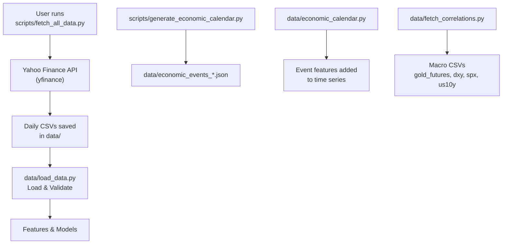
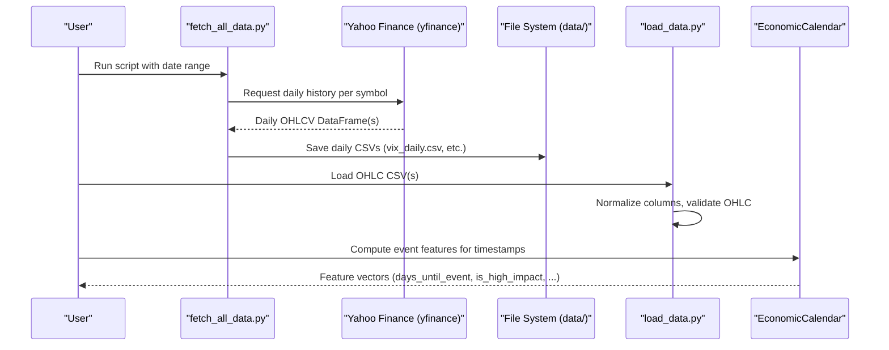
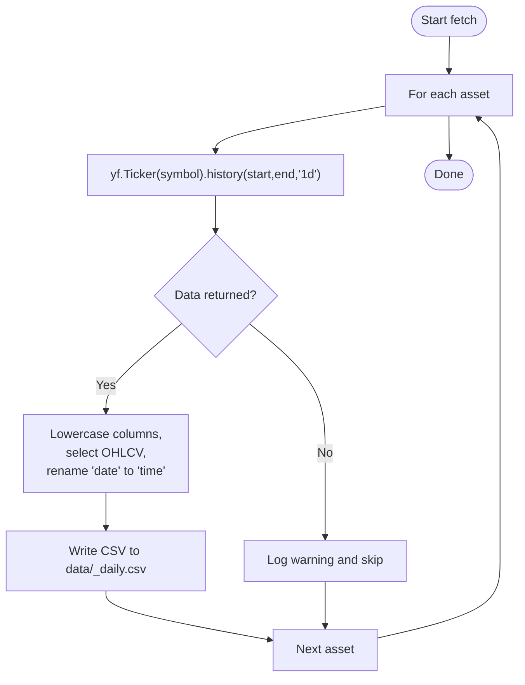
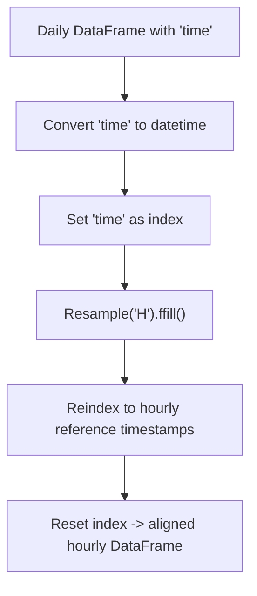
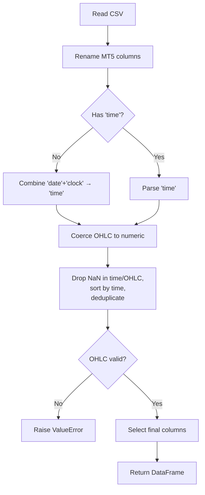
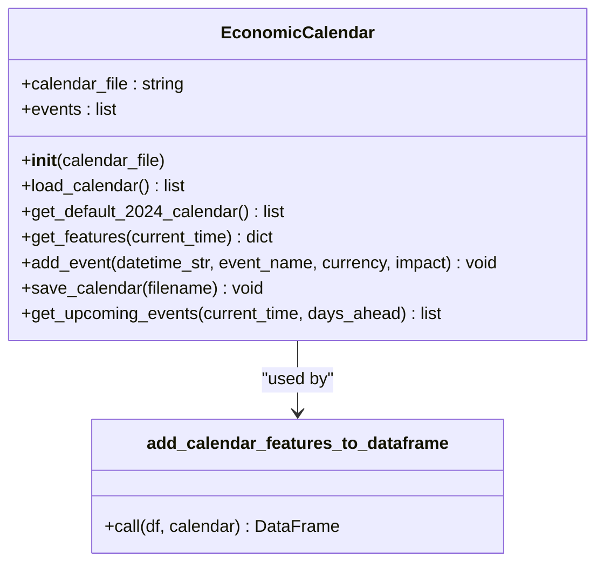
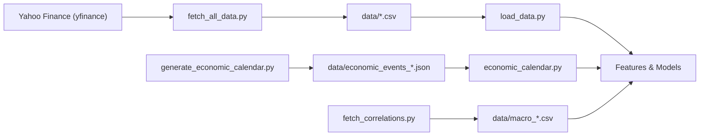

# Market Data Collection

<cite>
**Referenced Files in This Document**
- [fetch_all_data.py](file://scripts/fetch_all_data.py)
- [load_data.py](file://data/load_data.py)
- [economic_calendar.py](file://data/economic_calendar.py)
- [generate_economic_calendar.py](file://scripts/generate_economic_calendar.py)
- [fetch_correlations.py](file://data/fetch_correlations.py)
- [README.md](file://README.md)
</cite>

## Table of Contents
1. [Introduction](#introduction)
2. [Project Structure](#project-structure)
3. [Core Components](#core-components)
4. [Architecture Overview](#architecture-overview)
5. [Detailed Component Analysis](#detailed-component-analysis)
6. [Dependency Analysis](#dependency-analysis)
7. [Performance Considerations](#performance-considerations)
8. [Troubleshooting Guide](#troubleshooting-guide)
9. [Conclusion](#conclusion)
10. [Appendices](#appendices)

## Introduction
This document explains the market data collection system used to gather macro and asset class data for downstream feature engineering and model training. The system automates downloading daily historical data from Yahoo Finance for multiple assets (VIX, WTI crude oil, Bitcoin, EURUSD, silver, GLD ETF, US Dollar Index), aligns daily series to hourly frequency via forward-filling, and provides utilities to load, validate, and integrate macro data with OHLC time series. It also documents error handling, logging, output formats, storage conventions, and operational guidance for running and maintaining the pipeline.

## Project Structure
The data collection functionality is primarily implemented under scripts/ and data/:
- scripts/fetch_all_data.py: Orchestrates fetching multiple assets from Yahoo Finance and saving daily CSVs into data/.
- data/load_data.py: Loads and validates OHLC CSVs, standardizes column names, and ensures numeric integrity.
- data/economic_calendar.py: Provides an EconomicCalendar class to compute event-driven features and manage a JSON calendar.
- scripts/generate_economic_calendar.py: Generates a rule-based economic calendar covering major USD events across years.
- data/fetch_correlations.py: Fetches additional macro series (gold futures, DXY, SPX, US10Y) as daily CSVs.
- README.md: High-level project overview and quick start instructions including how to run data fetchers.

**Diagram sources**
- [fetch_all_data.py:27-101](file://scripts/fetch_all_data.py#L27-L101)
- [load_data.py:5-73](file://data/load_data.py#L5-L73)
- [economic_calendar.py:27-374](file://data/economic_calendar.py#L27-L374)
- [generate_economic_calendar.py:231-283](file://scripts/generate_economic_calendar.py#L231-L283)
- [fetch_correlations.py:5-51](file://data/fetch_correlations.py#L5-L51)

**Section sources**
- [README.md:294-324](file://README.md#L294-L324)

## Core Components
- Automated daily data fetcher for multiple assets using yfinance.
- Hourly alignment routine that resamples daily data to hourly frequency using forward-fill against a reference hourly timeline.
- Robust loader and validator for OHLC CSVs, ensuring consistent columns, numeric types, and sanity checks.
- Economic calendar generator and consumer for event-aware features.
- Macro correlation fetcher for additional indices and yields.

Key responsibilities:
- Fetching: Retrieve daily OHLCV for VIX, WTI, BTC, EURUSD, Silver, GLD, DXY.
- Aligning: Convert daily series to hourly by forward-filling to match hourly timestamps.
- Loading: Parse MT5-style or macro CSVs, normalize columns, validate OHLC relationships.
- Calendar: Generate and consume scheduled macro events to produce time-to-event features.
- Correlations: Download long-history macro series for gold-related drivers.

**Section sources**
- [fetch_all_data.py:27-128](file://scripts/fetch_all_data.py#L27-L128)
- [load_data.py:5-73](file://data/load_data.py#L5-L73)
- [economic_calendar.py:27-374](file://data/economic_calendar.py#L27-L374)
- [generate_economic_calendar.py:231-283](file://scripts/generate_economic_calendar.py#L231-L283)
- [fetch_correlations.py:5-51](file://data/fetch_correlations.py#L5-L51)

## Architecture Overview
The pipeline consists of three main stages:
1. Data Acquisition: Daily OHLCV fetched from Yahoo Finance for each asset.
2. Data Alignment: Daily series are resampled to hourly frequency and forward-filled to align with hourly timestamps.
3. Data Integration: Loaded and validated series are combined with economic calendar features for modeling.

**Diagram sources**
- [fetch_all_data.py:27-101](file://scripts/fetch_all_data.py#L27-L101)
- [load_data.py:5-73](file://data/load_data.py#L5-L73)
- [economic_calendar.py:181-234](file://data/economic_calendar.py#L181-L234)

## Detailed Component Analysis

### Automated Data Fetching Pipeline (Yahoo Finance)
- Purpose: Download daily OHLCV for multiple assets and persist as CSV files in data/.
- Assets covered: VIX (^VIX), WTI Crude Oil (CL=F), Bitcoin (BTC-USD), EURUSD (EURUSD=X), Silver (SI=F), GLD ETF (GLD), US Dollar Index (DX-Y.NYB).
- Process:
  - For each asset, create a ticker and request daily history within configured date range.
  - Normalize column names to lowercase and select core OHLCV fields; rename date to time.
  - Log progress and handle empty responses.
  - Save each dataset to a dedicated CSV file in data/.
- Output naming convention:
  - vix_daily.csv, oil_wti_daily.csv, bitcoin_daily.csv, eurusd_daily.csv, silver_daily.csv, gld_etf_daily.csv.

**Diagram sources**
- [fetch_all_data.py:27-101](file://scripts/fetch_all_data.py#L27-L101)

**Section sources**
- [fetch_all_data.py:27-101](file://scripts/fetch_all_data.py#L27-L101)
- [fetch_all_data.py:131-194](file://scripts/fetch_all_data.py#L131-L194)

### Data Alignment: Daily to Hourly via Forward-Fill
- Purpose: Convert daily macro series to hourly frequency so they can be merged with intraday OHLC data.
- Mechanism:
  - Ensure time columns are datetime-typed.
  - Set time as index on daily series.
  - Resample to hourly ('H') and apply forward-fill to propagate last known daily value across hours.
  - Reindex to a provided hourly reference timestamp list to ensure alignment with target series.
- Usage: Intended to be applied to macro series before merging with intraday price data.

**Diagram sources**
- [fetch_all_data.py:104-128](file://scripts/fetch_all_data.py#L104-L128)

**Section sources**
- [fetch_all_data.py:104-128](file://scripts/fetch_all_data.py#L104-L128)

### Loader and Validator for OHLC Data
- Purpose: Standardize loading of OHLC CSVs (including MT5 exports) and enforce data quality.
- Key behaviors:
  - Auto-detect delimiter and read CSV.
  - Rename MT5 angle-bracket columns to standardized names (e.g., <DATE> → date, <TIME> → clock).
  - Combine date + clock into a unified 'time' column if not present; otherwise parse existing 'time'.
  - Coerce OHLC to numeric and fill missing tick_volume with zeros.
  - Drop rows with missing critical fields; sort by time and deduplicate.
  - Validate OHLC consistency (high >= max(open, close, low); low <= min(open, close, high)).
  - Return a clean subset of required columns plus any macro-derived columns ending with _close/_ret/_chg.

**Diagram sources**
- [load_data.py:5-73](file://data/load_data.py#L5-L73)

**Section sources**
- [load_data.py:5-73](file://data/load_data.py#L5-L73)

### Economic Calendar Generation and Consumption
- Generator:
  - Produces a comprehensive JSON calendar of major USD events (NFP, CPI, FOMC, GDP, Retail Sales, PCE) spanning multiple years.
  - Saves to data/economic_events_2015_2025.json.
- Consumer:
  - EconomicCalendar class loads events from JSON or falls back to a default set.
  - Computes features such as days/hours until next event, flags for high-impact windows, one-hot encodings for event types, and expected volatility multipliers.
  - Utility function adds these features row-wise to a DataFrame with a 'time' column.

**Diagram sources**
- [economic_calendar.py:27-374](file://data/economic_calendar.py#L27-L374)

**Section sources**
- [generate_economic_calendar.py:231-283](file://scripts/generate_economic_calendar.py#L231-L283)
- [economic_calendar.py:27-374](file://data/economic_calendar.py#L27-L374)

### Macro Correlation Fetcher
- Purpose: Download long-history daily series for key macro variables (gold futures, DXY, SPX, US10Y) to support correlation analysis and feature engineering.
- Behavior:
  - Uses yfinance to download 15-year daily data per symbol.
  - Normalizes MultiIndex columns to single level, lowercases headers, and maps date/datetime to 'time'.
  - Saves each series as a CSV in data/ with descriptive filenames.

**Section sources**
- [fetch_correlations.py:5-51](file://data/fetch_correlations.py#L5-L51)

## Dependency Analysis
- External dependencies:
  - yfinance: Used for downloading daily market data from Yahoo Finance.
  - pandas/numpy: Used for data manipulation, resampling, and validation.
- Internal dependencies:
  - fetch_all_data.py depends on yfinance and writes CSVs consumed by downstream loaders.
  - load_data.py reads CSVs produced by fetch_all_data.py and other sources.
  - economic_calendar.py consumes JSON calendars generated by generate_economic_calendar.py and provides features for time series.
  - fetch_correlations.py produces additional macro CSVs for integration.

**Diagram sources**
- [fetch_all_data.py:27-101](file://scripts/fetch_all_data.py#L27-L101)
- [load_data.py:5-73](file://data/load_data.py#L5-L73)
- [generate_economic_calendar.py:231-283](file://scripts/generate_economic_calendar.py#L231-L283)
- [economic_calendar.py:27-374](file://data/economic_calendar.py#L27-L374)
- [fetch_correlations.py:5-51](file://data/fetch_correlations.py#L5-L51)

**Section sources**
- [fetch_all_data.py:27-101](file://scripts/fetch_all_data.py#L27-L101)
- [load_data.py:5-73](file://data/load_data.py#L5-L73)
- [generate_economic_calendar.py:231-283](file://scripts/generate_economic_calendar.py#L231-L283)
- [economic_calendar.py:27-374](file://data/economic_calendar.py#L27-L374)
- [fetch_correlations.py:5-51](file://data/fetch_correlations.py#L5-L51)

## Performance Considerations
- Large dataset downloads:
  - Use conservative date ranges when possible to reduce payload size.
  - Prefer daily intervals for macro series; use hourly only after alignment where necessary.
- Rate limiting strategies:
  - The current implementation does not implement explicit rate limiting or retries. When integrating with external APIs, consider adding delays between requests and retry logic with exponential backoff to respect service limits and mitigate transient failures.
- Incremental updates:
  - Implement logic to detect the latest timestamp in existing CSVs and request only new data beyond that point.
  - Append new rows and re-sort/deduplicate to maintain chronological integrity.
- Memory efficiency:
  - When processing large datasets, avoid unnecessary copies; use in-place operations where feasible.
  - Consider chunked reading/writing for very large files.

[No sources needed since this section provides general guidance]

## Troubleshooting Guide
Common issues and resolutions:
- Network errors or incomplete downloads:
  - The fetcher logs warnings when no data is returned for a symbol and continues with others. If all symbols fail, check internet connectivity and Yahoo Finance availability.
  - Add retry logic and backoff to improve resilience against transient network issues.
- Missing or malformed CSVs:
  - load_data.py raises FileNotFoundError if input path does not exist and ValueError if required columns are missing or OHLC constraints are violated. Verify file paths and column names.
- Timezone and timestamp mismatches:
  - Ensure time columns are parsed consistently. The loader coerces to datetime and drops rows with invalid times. Confirm timezone expectations when merging with intraday data.
- Empty or partial macro series:
  - Some assets may have limited history (e.g., Bitcoin). Adjust start dates accordingly or use alternative sources.

Operational tips:
- Logging:
  - The fetcher uses Python logging to report progress and errors. Increase log verbosity for detailed diagnostics.
- Validation:
  - After loading, inspect the shape and head/tail of DataFrames to confirm correctness.
  - Use the built-in OHLC sanity checks to catch anomalies early.

**Section sources**
- [fetch_all_data.py:42-64](file://scripts/fetch_all_data.py#L42-L64)
- [load_data.py:5-73](file://data/load_data.py#L5-L73)

## Conclusion
The market data collection system provides a robust foundation for acquiring, aligning, and validating macro and asset class data. It supports automated daily downloads from Yahoo Finance, converts daily series to hourly via forward-filling, and integrates economic calendar features to enhance model inputs. By adopting incremental updates, rate limiting, and enhanced error handling, the pipeline can scale reliably for production use.

[No sources needed since this section summarizes without analyzing specific files]

## Appendices

### Running fetch_all_data.py
- Execute the script to download macro data:
  - Command: python scripts/fetch_all_data.py
- Configure date ranges:
  - Edit START_DATE and END_DATE constants in the script to adjust the retrieval window.
- Customize data sources:
  - Modify or extend the asset list and corresponding fetch functions to include additional symbols.
- Handling failures:
  - Review logs for warnings about missing data or exceptions. Re-run after resolving connectivity issues.

**Section sources**
- [fetch_all_data.py:131-194](file://scripts/fetch_all_data.py#L131-L194)
- [README.md:294-324](file://README.md#L294-L324)

### Output Format and Storage Structure
- Directory: data/
- File naming conventions:
  - vix_daily.csv, oil_wti_daily.csv, bitcoin_daily.csv, eurusd_daily.csv, silver_daily.csv, gld_etf_daily.csv
- Columns:
  - time, open, high, low, close, volume (lowercase, normalized)
- Additional macro CSVs:
  - gold_futures.csv, dxy.csv, spx.csv, us10y.csv (from fetch_correlations.py)

**Section sources**
- [fetch_all_data.py:150-184](file://scripts/fetch_all_data.py#L150-L184)
- [fetch_correlations.py:20-46](file://data/fetch_correlations.py#L20-L46)

### Data Alignment Details
- Input: Daily DataFrame with 'time' column and OHLCV fields.
- Steps:
  - Convert 'time' to datetime.
  - Set 'time' as index.
  - Resample to hourly and forward-fill.
  - Reindex to hourly reference timestamps to align with target series.
- Output: Hourly-aligned DataFrame ready for merging with intraday data.

**Section sources**
- [fetch_all_data.py:104-128](file://scripts/fetch_all_data.py#L104-L128)

### Economic Calendar Usage
- Generate calendar:
  - Run scripts/generate_economic_calendar.py to produce data/economic_events_2015_2025.json.
- Consume calendar:
  - Use EconomicCalendar.get_features(timestamp) to obtain event-aware features.
  - Apply add_calendar_features_to_dataframe to annotate time series with event indicators.

**Section sources**
- [generate_economic_calendar.py:231-283](file://scripts/generate_economic_calendar.py#L231-L283)
- [economic_calendar.py:181-234](file://data/economic_calendar.py#L181-L234)