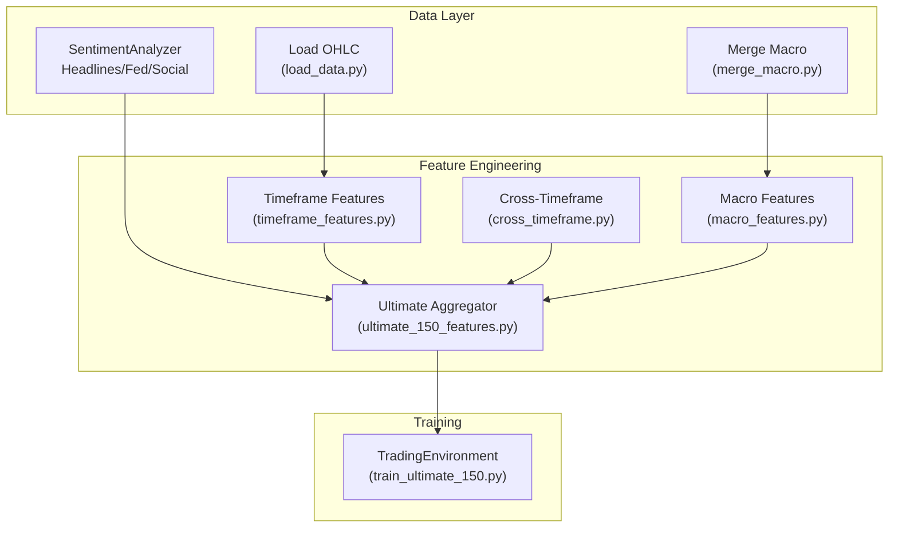
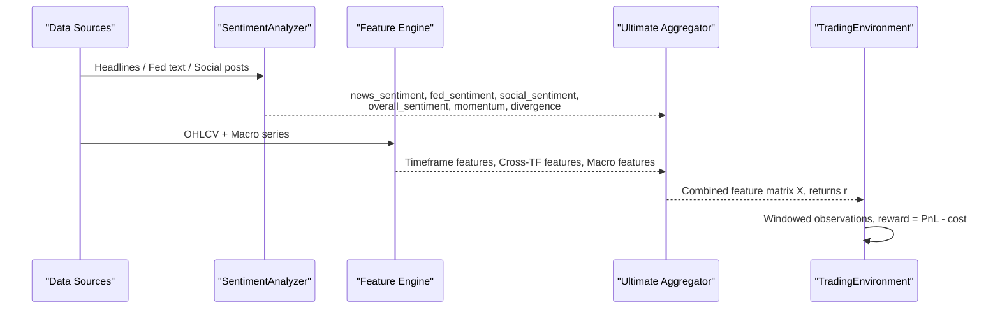
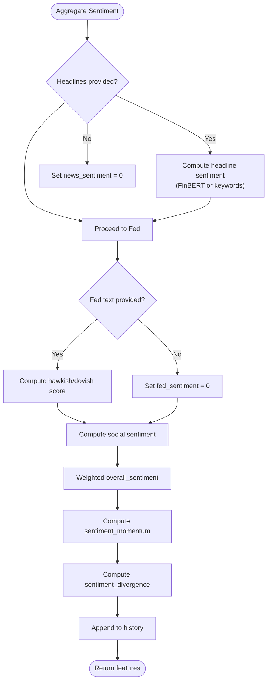
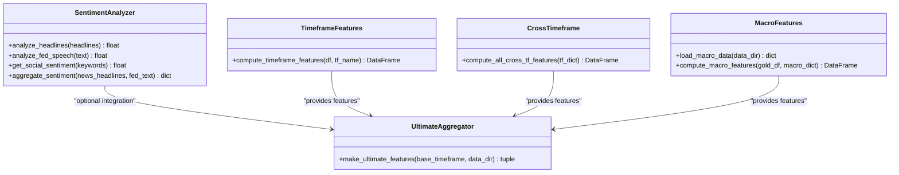
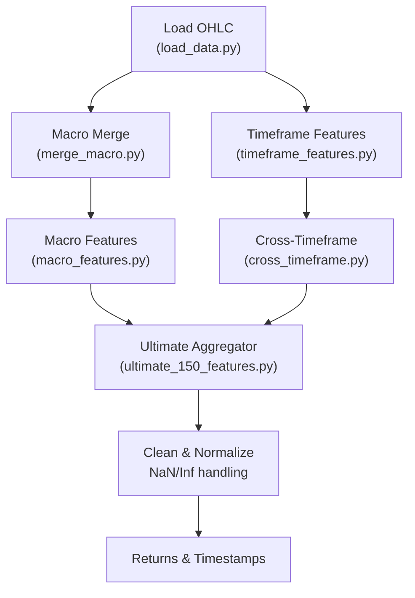
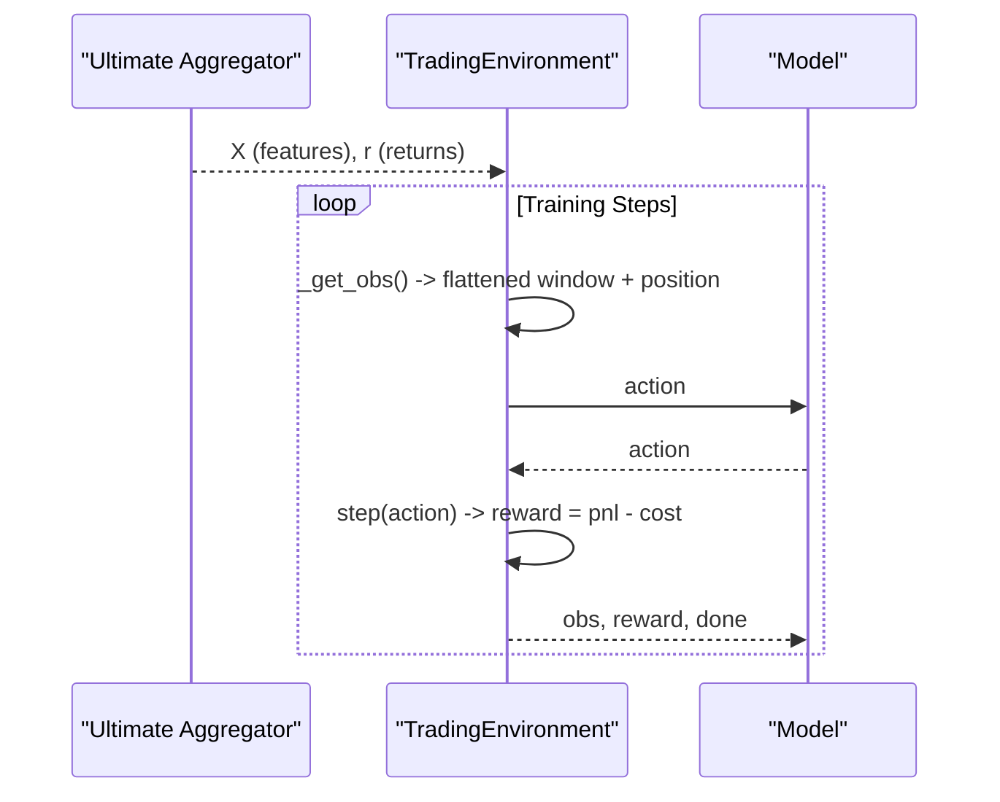

# Sentiment Analysis Integration

<cite>
**Referenced Files in This Document**
- [sentiment_analysis.py](file://data/sentiment_analysis.py)
- [make_features.py](file://features/make_features.py)
- [ultimate_150_features.py](file://features/ultimate_150_features.py)
- [macro_features.py](file://features/macro_features.py)
- [timeframe_features.py](file://features/timeframe_features.py)
- [cross_timeframe.py](file://features/cross_timeframe.py)
- [load_data.py](file://data/load_data.py)
- [merge_macro.py](file://data/merge_macro.py)
- [train_ultimate_150.py](file://train/train_ultimate_150.py)
</cite>

## Table of Contents
1. [Introduction](#introduction)
2. [Project Structure](#project-structure)
3. [Core Components](#core-components)
4. [Architecture Overview](#architecture-overview)
5. [Detailed Component Analysis](#detailed-component-analysis)
6. [Dependency Analysis](#dependency-analysis)
7. [Performance Considerations](#performance-considerations)
8. [Troubleshooting Guide](#troubleshooting-guide)
9. [Conclusion](#conclusion)
10. [Appendices](#appendices)

## Introduction
This document explains the sentiment analysis integration within a multi-source feature engineering system for trading. It covers:
- Alternative data sources for market sentiment (news, social media, central bank communications)
- Sentiment scoring algorithms that convert unstructured text into quantitative metrics
- Integration points with the feature engineering pipeline and how sentiment features join technical indicators and macro correlations
- Practical examples to run sentiment analysis, configure data sources, and interpret signals
- End-to-end data pipeline from raw sentiment inputs through processing to final feature integration
- Challenges such as noise filtering, temporal alignment, and reliability assessment
- The relationship between sentiment features and trading strategy performance

## Project Structure
The repository organizes sentiment-related logic under data and features modules, with training scripts consuming the engineered feature set. Key elements:
- Sentiment module provides headline, Fed speech, and social sentiment scoring with optional FinBERT support
- Feature modules compute timeframe-based technicals, cross-timeframe intelligence, macro correlations, calendar events, and microstructure signals
- Ultimate feature aggregator combines all sources into a unified observation space used by training environments

**Diagram sources**
- [sentiment_analysis.py:22-235](file://data/sentiment_analysis.py#L22-L235)
- [load_data.py:5-73](file://data/load_data.py#L5-L73)
- [merge_macro.py:4-56](file://data/merge_macro.py#L4-L56)
- [timeframe_features.py:22-99](file://features/timeframe_features.py#L22-L99)
- [cross_timeframe.py:21-200](file://features/cross_timeframe.py#L21-L200)
- [macro_features.py:26-445](file://features/macro_features.py#L26-L445)
- [ultimate_150_features.py:27-226](file://features/ultimate_150_features.py#L27-L226)
- [train_ultimate_150.py:49-151](file://train/train_ultimate_150.py#L49-L151)

**Section sources**
- [sentiment_analysis.py:22-235](file://data/sentiment_analysis.py#L22-L235)
- [ultimate_150_features.py:27-226](file://features/ultimate_150_features.py#L27-L226)
- [train_ultimate_150.py:49-151](file://train/train_ultimate_150.py#L49-L151)

## Core Components
- SentimentAnalyzer: Provides headline sentiment, Fed speech hawkish/dovish classification, social sentiment placeholder, and aggregation into composite features including momentum and divergence
- Timeframe features: 16 standardized technical features per timeframe (returns, volatility, momentum, moving averages, RSI, MACD, ATR, Bollinger position, volume ratio, distance to high/low)
- Cross-timeframe features: Trend alignment, momentum cascade, volatility regime, pattern confluence across multiple timeframes
- Macro features: Returns, momentum, and rolling correlations for DXY, SPX, US10Y, VIX, Oil, Bitcoin, EURUSD, Silver/GLD; aligned to gold timestamps
- Ultimate aggregator: Combines timeframe, cross-timeframe, macro, calendar, and microstructure features into a single dataset for training
- Trading environment: Consumes the aggregated features to form observations and rewards based on returns and costs

**Section sources**
- [sentiment_analysis.py:22-235](file://data/sentiment_analysis.py#L22-L235)
- [timeframe_features.py:22-99](file://features/timeframe_features.py#L22-L99)
- [cross_timeframe.py:21-200](file://features/cross_timeframe.py#L21-L200)
- [macro_features.py:26-445](file://features/macro_features.py#L26-L445)
- [ultimate_150_features.py:27-226](file://features/ultimate_150_features.py#L27-L226)
- [train_ultimate_150.py:49-151](file://train/train_ultimate_150.py#L49-L151)

## Architecture Overview
The system ingests price data and optional sentiment/macro inputs, computes rich features, and feeds them into a reinforcement learning environment for training.

**Diagram sources**
- [sentiment_analysis.py:60-235](file://data/sentiment_analysis.py#L60-L235)
- [timeframe_features.py:22-99](file://features/timeframe_features.py#L22-L99)
- [macro_features.py:363-445](file://features/macro_features.py#L363-L445)
- [ultimate_150_features.py:47-226](file://features/ultimate_150_features.py#L47-L226)
- [train_ultimate_150.py:49-151](file://train/train_ultimate_150.py#L49-L151)

## Detailed Component Analysis

### Sentiment Analysis Module
Responsibilities:
- Headline sentiment via FinBERT or keyword fallback
- Fed speech hawkish/dovish classification
- Social sentiment placeholder ready for API integration
- Aggregation into composite features with history tracking

Key behaviors:
- FinBERT path uses tokenization and softmax probabilities to derive a -1 to +1 score per headline; mean across headlines yields overall headline sentiment
- Keyword fallback counts bullish/bearish terms and normalizes to -1 to +1
- Fed speech scoring counts hawkish vs dovish keywords and normalizes to -1 (hawkish) to +1 (dovish)
- Aggregation weights news, Fed, and social components, computes momentum (change over time), and divergence (news vs social)

**Diagram sources**
- [sentiment_analysis.py:190-235](file://data/sentiment_analysis.py#L190-L235)

Practical usage example paths:
- Running headline analysis: [sentiment_analysis.py:60-104](file://data/sentiment_analysis.py#L60-L104)
- Running Fed speech analysis: [sentiment_analysis.py:141-175](file://data/sentiment_analysis.py#L141-L175)
- Aggregating features: [sentiment_analysis.py:190-235](file://data/sentiment_analysis.py#L190-L235)

Interpretation guidance:
- Positive overall_sentiment suggests bullish bias; negative suggests bearish
- Rising sentiment_momentum indicates improving sentiment trend
- Large sentiment_divergence may signal conflicting information between news and social channels

Challenges addressed:
- Noise filtering: Keyword fallback is robust when FinBERT is unavailable; aggregation smooths noisy signals
- Temporal alignment: History deque tracks recent values for momentum computation
- Reliability: Weighted aggregation balances source contributions; divergence highlights potential unreliability

**Section sources**
- [sentiment_analysis.py:22-235](file://data/sentiment_analysis.py#L22-L235)

### Feature Engineering Integration Points
Integration overview:
- Timeframe features provide baseline technical context across multiple horizons
- Cross-timeframe features capture hierarchical relationships and regime shifts
- Macro features add external market context (rates, equities, volatility, commodities)
- Calendar features encode event risk windows
- Microstructure features reflect order flow dynamics

Where sentiment fits:
- The current ultimate aggregator does not explicitly include sentiment columns; however, the architecture supports adding sentiment features alongside macro/calendar/microstructure features
- To integrate sentiment, append sentiment feature columns to the combined DataFrame before reindexing and cleaning steps

**Diagram sources**
- [sentiment_analysis.py:22-235](file://data/sentiment_analysis.py#L22-L235)
- [timeframe_features.py:22-99](file://features/timeframe_features.py#L22-L99)
- [cross_timeframe.py:21-200](file://features/cross_timeframe.py#L21-L200)
- [macro_features.py:26-445](file://features/macro_features.py#L26-L445)
- [ultimate_150_features.py:27-226](file://features/ultimate_150_features.py#L27-L226)

**Section sources**
- [ultimate_150_features.py:47-226](file://features/ultimate_150_features.py#L47-L226)
- [macro_features.py:363-445](file://features/macro_features.py#L363-L445)
- [timeframe_features.py:22-99](file://features/timeframe_features.py#L22-L99)
- [cross_timeframe.py:21-200](file://features/cross_timeframe.py#L21-L200)

### Data Pipeline: From Raw Inputs to Final Features
End-to-end flow:
- Load OHLC data with standardized column handling and validation
- Optionally merge daily macro series into intraday frames using forward fill
- Compute timeframe features for multiple horizons
- Compute cross-timeframe intelligence
- Compute macro features aligned to gold timestamps
- Aggregate everything into a unified feature matrix
- Prepare target returns and clean NaN/inf values

**Diagram sources**
- [load_data.py:5-73](file://data/load_data.py#L5-L73)
- [merge_macro.py:4-56](file://data/merge_macro.py#L4-L56)
- [timeframe_features.py:22-99](file://features/timeframe_features.py#L22-L99)
- [cross_timeframe.py:21-200](file://features/cross_timeframe.py#L21-L200)
- [macro_features.py:363-445](file://features/macro_features.py#L363-L445)
- [ultimate_150_features.py:47-226](file://features/ultimate_150_features.py#L47-L226)

**Section sources**
- [load_data.py:5-73](file://data/load_data.py#L5-L73)
- [merge_macro.py:4-56](file://data/merge_macro.py#L4-L56)
- [ultimate_150_features.py:47-226](file://features/ultimate_150_features.py#L47-L226)

### Training Environment and Strategy Performance
- The trading environment consumes the aggregated feature matrix and computes windowed observations
- Rewards are derived from returns and trade costs; actions control position state
- Adding sentiment features can improve predictive power if they correlate with future returns and are properly normalized and aligned

**Diagram sources**
- [train_ultimate_150.py:49-151](file://train/train_ultimate_150.py#L49-L151)
- [ultimate_150_features.py:175-226](file://features/ultimate_150_features.py#L175-L226)

**Section sources**
- [train_ultimate_150.py:49-151](file://train/train_ultimate_150.py#L49-L151)

## Dependency Analysis
- SentimentAnalyzer depends on optional transformers/torch for FinBERT; otherwise falls back to keyword scoring
- Ultimate aggregator depends on timeframe, cross-timeframe, macro, calendar, and microstructure modules
- Macro features depend on availability of daily series files and align them to gold timestamps
- Training script depends on the ultimate aggregator to produce the feature matrix and returns

Potential coupling:
- Strong cohesion within each feature module; aggregator orchestrates concatenation and alignment
- External dependencies limited to pandas/numpy and optional ML libraries

Circular dependencies:
- None observed; aggregator imports feature modules but they do not import aggregator

**Section sources**
- [sentiment_analysis.py:33-58](file://data/sentiment_analysis.py#L33-L58)
- [ultimate_150_features.py:47-154](file://features/ultimate_150_features.py#L47-L154)
- [macro_features.py:26-75](file://features/macro_features.py#L26-L75)

## Performance Considerations
- FinBERT inference adds latency; keyword fallback is lightweight and suitable for real-time or constrained environments
- Rolling computations (correlations, momentum, volatility) scale with window sizes; choose appropriate windows to balance responsiveness and stability
- Memory usage grows with number of timeframes and features; the aggregator converts to float32 to reduce memory footprint
- Forward-fill alignment introduces lag; ensure acceptable delay for your strategy horizon

[No sources needed since this section provides general guidance]

## Troubleshooting Guide
Common issues and resolutions:
- Missing transformers package: FinBERT path will fail gracefully; system switches to keyword-based sentiment
- Missing macro CSV files: Macro features module logs warnings and proceeds without those sources; ensure required files exist
- Timezone misalignment: Macro features normalize timezone and align to gold index; verify input indices are datetime and sorted
- NaN/Inf in features: Aggregator fills NaN with zeros and replaces infinities; validate upstream computations to minimize anomalies
- Invalid OHLC data: Loader performs sanity checks; correct data format before ingestion

Operational tips:
- Validate headline lists are non-empty to avoid zero scores
- Use consistent timeframes when merging macro data; prefer forward-fill for daily to intraday alignment
- Monitor sentiment_momentum and sentiment_divergence to detect unstable signals

**Section sources**
- [sentiment_analysis.py:45-58](file://data/sentiment_analysis.py#L45-L58)
- [macro_features.py:51-75](file://features/macro_features.py#L51-L75)
- [macro_features.py:78-111](file://features/macro_features.py#L78-L111)
- [ultimate_150_features.py:156-174](file://features/ultimate_150_features.py#L156-L174)
- [load_data.py:55-73](file://data/load_data.py#L55-L73)

## Conclusion
The sentiment analysis integration provides flexible, extensible sentiment scoring that can be combined with comprehensive technical and macro features. While the current aggregator focuses on timeframe, cross-timeframe, macro, calendar, and microstructure features, the modular design allows straightforward addition of sentiment features. Proper temporal alignment, noise filtering, and reliability assessment are essential to ensure sentiment signals enhance strategy performance. When integrated thoughtfully, sentiment features can complement technical and macro indicators, offering additional predictive context for trading decisions.

[No sources needed since this section summarizes without analyzing specific files]

## Appendices

### Practical Examples
- Run headline sentiment:
  - Provide a list of headlines to analyze; expect a -1 to +1 score reflecting bullishness/bearishness
  - Reference: [sentiment_analysis.py:60-104](file://data/sentiment_analysis.py#L60-L104)
- Analyze Fed speech:
  - Input speech text; output -1 (hawkish) to +1 (dovish)
  - Reference: [sentiment_analysis.py:141-175](file://data/sentiment_analysis.py#L141-L175)
- Aggregate sentiment features:
  - Combine news and Fed inputs; obtain overall_sentiment, momentum, divergence
  - Reference: [sentiment_analysis.py:190-235](file://data/sentiment_analysis.py#L190-L235)
- Configure data sources:
  - Ensure macro CSV files exist for desired sources; aggregator will log available sources
  - Reference: [macro_features.py:26-75](file://features/macro_features.py#L26-L75)
- Interpret signals:
  - Positive overall_sentiment and rising momentum suggest bullish conditions
  - High divergence indicates conflicting signals; consider caution or reduced exposure

[No sources needed since this section references code paths already cited above]