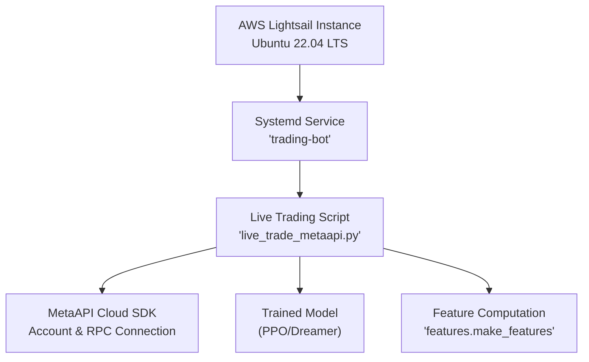
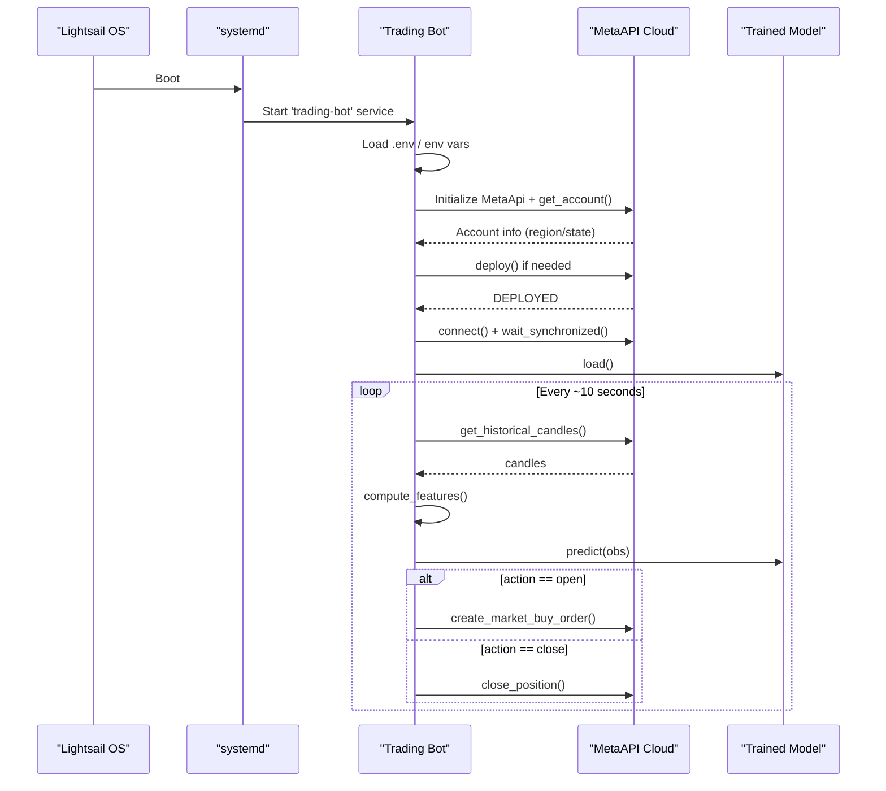
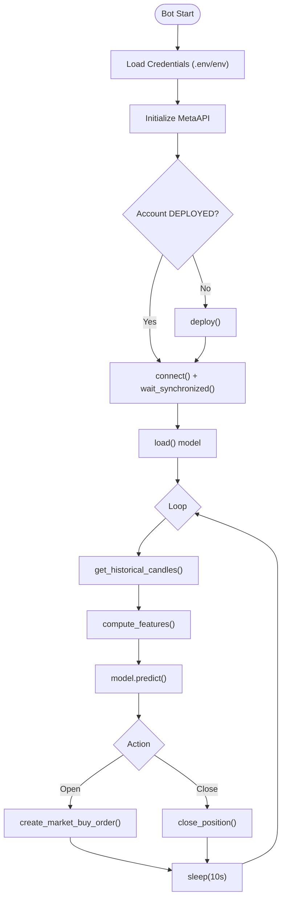
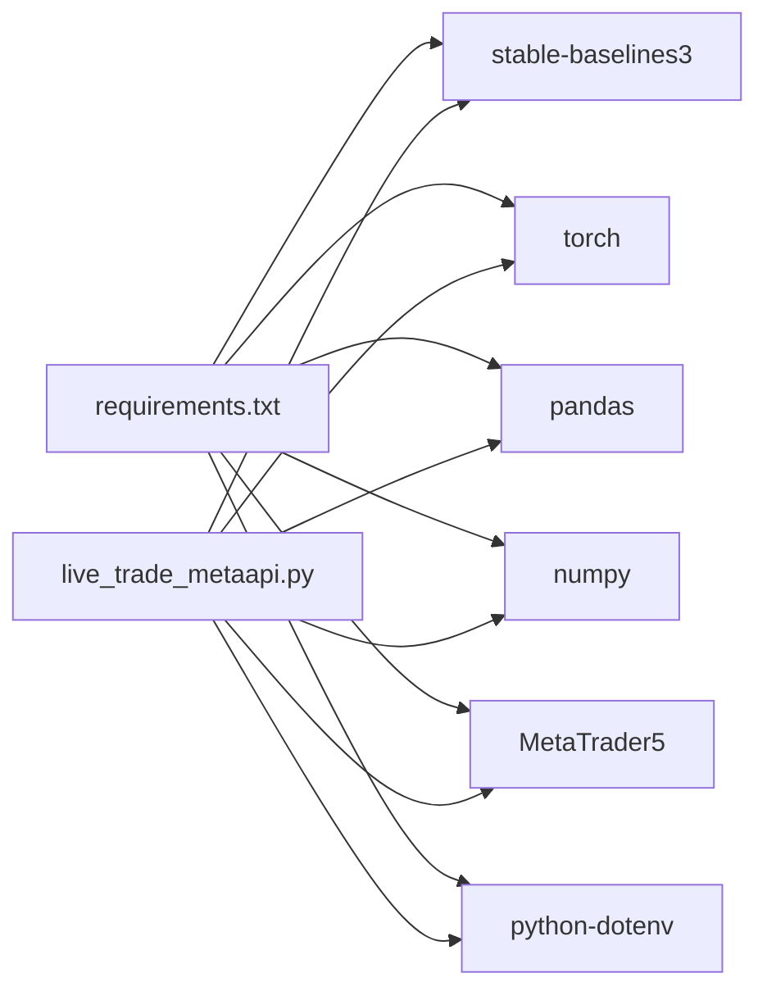

# AWS Lightsail Setup

<cite>
**Referenced Files in This Document**
- [DEPLOYMENT_GUIDE.md](file://DEPLOYMENT_GUIDE.md)
- [SECURITY.md](file://SECURITY.md)
- [README.md](file://README.md)
- [requirements.txt](file://requirements.txt)
- [live_trade_metaapi.py](file://live/live_trade_metaapi.py)
</cite>

## Table of Contents
1. [Introduction](#introduction)
2. [Project Structure](#project-structure)
3. [Core Components](#core-components)
4. [Architecture Overview](#architecture-overview)
5. [Detailed Component Analysis](#detailed-component-analysis)
6. [Dependency Analysis](#dependency-analysis)
7. [Performance Considerations](#performance-considerations)
8. [Troubleshooting Guide](#troubleshooting-guide)
9. [Conclusion](#conclusion)
10. [Appendices](#appendices)

## Introduction
This document provides a complete, step-by-step guide to deploying the autonomous trading system on AWS Lightsail using an Ubuntu 22.04 LTS instance. It covers instance creation, SSH configuration, uploading deployment scripts, configuring auto-start services with systemd, and managing the trading bot lifecycle. It also includes cost optimization strategies, monitoring setup with CloudWatch, security best practices for API key management, and troubleshooting common issues such as network connectivity and resource constraints. All commands and procedures are aligned with the project’s existing deployment guidance and security policies.

## Project Structure
The repository is organized into modules for training, features, live trading, evaluation, and utilities. For production deployment on Lightsail, the primary runtime entry point is the live trading script that connects to MetaAPI, loads a trained model, and executes trades based on AI decisions. The deployment guide references a systemd service unit and a setup script to automate installation and startup.

**Diagram sources**
- [DEPLOYMENT_GUIDE.md:1-68](file://DEPLOYMENT_GUIDE.md#L1-L68)
- [live_trade_metaapi.py:1-231](file://live/live_trade_metaapi.py#L1-L231)

**Section sources**
- [DEPLOYMENT_GUIDE.md:1-68](file://DEPLOYMENT_GUIDE.md#L1-L68)
- [README.md:418-471](file://README.md#L418-L471)

## Core Components
- Live trading runtime: Asynchronous loop connecting to MetaAPI, fetching market data, computing features, loading a trained model, and executing orders.
- Systemd service: Ensures the trading bot starts automatically on boot and restarts on failure.
- Environment variables: Securely store API keys and account IDs via .env or exported variables.
- Dependencies: Python packages defined in requirements.txt, including stable-baselines3, torch, pandas, numpy, and MetaTrader5.

Key responsibilities:
- Secure credential handling (never commit secrets).
- Robust connection and retry logic for network resilience.
- Minimal resource usage suitable for a $3.50/month Lightsail instance.

**Section sources**
- [live_trade_metaapi.py:23-38](file://live/live_trade_metaapi.py#L23-L38)
- [live_trade_metaapi.py:40-86](file://live/live_trade_metaapi.py#L40-L86)
- [live_trade_metaapi.py:135-231](file://live/live_trade_metaapi.py#L135-L231)
- [SECURITY.md:23-84](file://SECURITY.md#L23-L84)
- [requirements.txt:1-29](file://requirements.txt#L1-L29)

## Architecture Overview
The deployed system runs as a persistent service on Lightsail. On boot, systemd launches the trading bot, which:
1. Loads environment variables for credentials.
2. Connects to MetaAPI and ensures the account is deployed.
3. Establishes an RPC connection and waits for synchronization.
4. Loads the trained model from disk.
5. Enters a loop to fetch market data, compute features, predict actions, and execute orders with retries and timeouts.

**Diagram sources**
- [DEPLOYMENT_GUIDE.md:37-68](file://DEPLOYMENT_GUIDE.md#L37-L68)
- [live_trade_metaapi.py:135-231](file://live/live_trade_metaapi.py#L135-L231)

## Detailed Component Analysis

### AWS Lightsail Instance Creation and SSH
- Create an instance with Ubuntu 22.04 LTS and the $3.50/month plan (512 MB RAM, 1 vCPU).
- Use the Lightsail web console or SSH to connect.
- Upload deployment scripts and the trading code to the server.

Operational steps include:
- Uploading setup script and service unit file.
- Running the setup script to install dependencies and configure the environment.
- Copying the trading code directory to the server.

**Section sources**
- [DEPLOYMENT_GUIDE.md:5-35](file://DEPLOYMENT_GUIDE.md#L5-L35)

### Systemd Service Configuration and Auto-Start
- Install the service unit file under /etc/systemd/system/.
- Reload systemd daemon, enable the service to start on boot, and start it immediately.
- Monitor status and logs using systemctl and journalctl.

Service management commands:
- Enable and start the service.
- Stop, restart, and check status.
- View live logs and recent log lines.

**Section sources**
- [DEPLOYMENT_GUIDE.md:37-68](file://DEPLOYMENT_GUIDE.md#L37-L68)

### Live Trading Runtime Behavior
- Credentials are loaded from environment variables or .env file.
- The bot initializes MetaAPI, deploys the account if necessary, and establishes an RPC connection.
- It loads the trained model and enters a loop that:
  - Fetches historical candles with timeout and retry logic.
  - Computes features and constructs observations.
  - Predicts actions and executes orders (open/close) with error handling.
  - Reconnects on network issues and continues operation.

**Diagram sources**
- [live_trade_metaapi.py:23-38](file://live/live_trade_metaapi.py#L23-L38)
- [live_trade_metaapi.py:40-86](file://live/live_trade_metaapi.py#L40-L86)
- [live_trade_metaapi.py:135-231](file://live/live_trade_metaapi.py#L135-L231)

**Section sources**
- [live_trade_metaapi.py:23-38](file://live/live_trade_metaapi.py#L23-L38)
- [live_trade_metaapi.py:40-86](file://live/live_trade_metaapi.py#L40-L86)
- [live_trade_metaapi.py:135-231](file://live/live_trade_metaapi.py#L135-L231)

### Security Best Practices for API Key Management
- Store sensitive credentials in .env or environment variables; never hardcode them in code.
- Ensure .env is excluded from version control.
- Restrict file permissions on .env.
- Rotate compromised credentials immediately and update the environment.
- Use separate keys for testing vs production and enable 2FA where possible.

**Section sources**
- [SECURITY.md:9-84](file://SECURITY.md#L9-L84)
- [SECURITY.md:113-162](file://SECURITY.md#L113-L162)

### Monitoring and Logging
- Use systemd journalctl to view live logs and recent entries for the trading-bot service.
- Check service status to confirm uptime and health.
- Integrate CloudWatch Logs for centralized logging and alerts on Lightsail instances.
- Set up CloudWatch alarms for CPU utilization and memory usage to detect resource constraints.

**Section sources**
- [DEPLOYMENT_GUIDE.md:37-68](file://DEPLOYMENT_GUIDE.md#L37-L68)

## Dependency Analysis
The runtime depends on Python packages for deep learning, data processing, and trading platform integration. The minimum viable production stack includes:
- stable-baselines3 and torch for model inference.
- pandas and numpy for feature computation.
- MetaTrader5 and metaapi_cloud_sdk for execution.
- python-dotenv for secure environment variable loading.

**Diagram sources**
- [requirements.txt:1-29](file://requirements.txt#L1-L29)
- [live_trade_metaapi.py:1-231](file://live/live_trade_metaapi.py#L1-L231)

**Section sources**
- [requirements.txt:1-29](file://requirements.txt#L1-L29)
- [live_trade_metaapi.py:1-231](file://live/live_trade_metaapi.py#L1-L231)

## Performance Considerations
- The $3.50/month Lightsail instance (512 MB RAM, 1 vCPU) is sufficient for the trading bot because it:
  - Fetches data periodically.
  - Runs one ML model prediction per cycle.
  - Makes occasional API calls.
- Optimize by:
  - Using minimal batch sizes during inference.
  - Limiting feature window size to reduce memory footprint.
  - Enabling swap space cautiously if needed.
  - Monitoring CPU and memory via CloudWatch and adjusting as necessary.

[No sources needed since this section provides general guidance]

## Troubleshooting Guide
Common issues and resolutions:
- Network connectivity:
  - Retries and timeouts are built-in; ensure outbound internet access is allowed in Lightsail firewall rules.
  - If connection fails, the bot attempts reconnection and continues after stabilization.
- Resource constraints:
  - Monitor CPU and memory usage; consider enabling swap or upgrading the instance if OOM errors occur.
- Credential problems:
  - Verify .env contains correct METAAPI_TOKEN and METAAPI_ACCOUNT_ID.
  - Ensure .env is not committed and has restrictive permissions.
- Service management:
  - Use systemctl to restart the service if the process crashes.
  - Use journalctl to inspect logs for errors and warnings.

Operational commands:
- Check service status and logs.
- Restart or stop the service.
- View recent log lines.

**Section sources**
- [DEPLOYMENT_GUIDE.md:37-68](file://DEPLOYMENT_GUIDE.md#L37-L68)
- [live_trade_metaapi.py:135-231](file://live/live_trade_metaapi.py#L135-L231)
- [SECURITY.md:70-84](file://SECURITY.md#L70-L84)

## Conclusion
Deploying the autonomous trading system on AWS Lightsail with Ubuntu 22.04 LTS and systemd ensures reliable, automated operation at low cost. By following the provided steps for instance creation, service configuration, and secure credential management, you can run the trading bot continuously with robust error handling and monitoring. Use CloudWatch for observability and adjust resources as needed to maintain performance and stability.

[No sources needed since this section summarizes without analyzing specific files]

## Appendices

### Cost Optimization Strategies
- Choose the $3.50/month Lightsail plan for minimal cost while meeting runtime needs.
- Use lightweight dependencies and avoid unnecessary background processes.
- Leverage CloudWatch free tier metrics and set budget alerts to prevent unexpected charges.
- Consider reserved pricing or savings plans if scaling beyond a single instance.

[No sources needed since this section provides general guidance]

### Monitoring Setup with CloudWatch
- Install and configure the CloudWatch agent on the Lightsail instance to collect system metrics and application logs.
- Create dashboards for CPU, memory, disk I/O, and custom metrics from the trading bot.
- Set alarms for high CPU usage, low memory, or frequent service restarts.
- Centralize logs in CloudWatch Logs for easier debugging and retention.

[No sources needed since this section provides general guidance]

### Security Checklist for Production
- Ensure .env is present and properly secured.
- Confirm no secrets are embedded in code or logs.
- Restrict SSH access using key-based authentication and firewall rules.
- Regularly rotate API keys and review access logs.
- Test fail-safes and kill switches before going live.

**Section sources**
- [SECURITY.md:150-162](file://SECURITY.md#L150-L162)