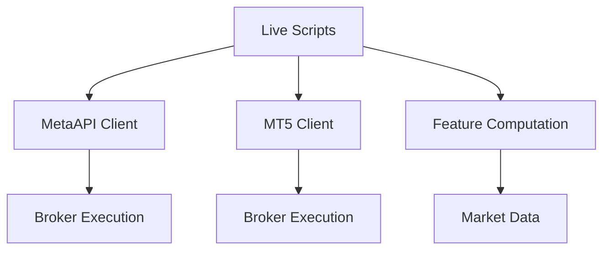
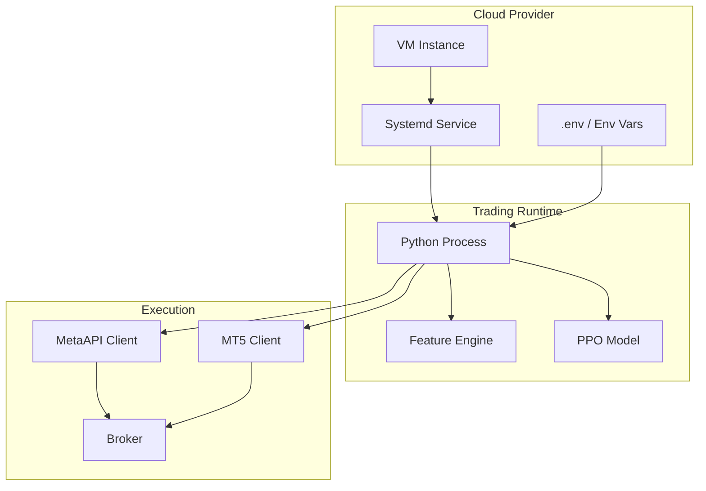
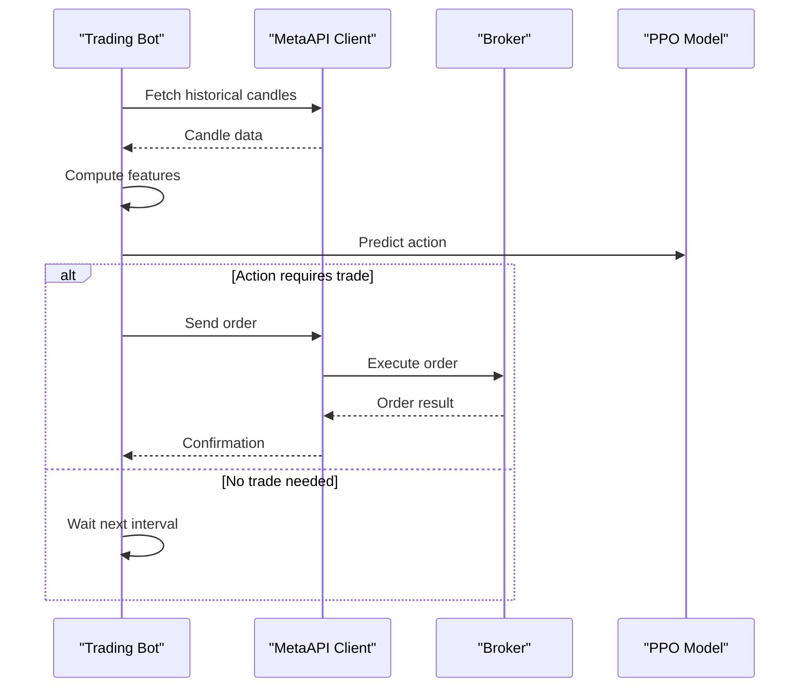
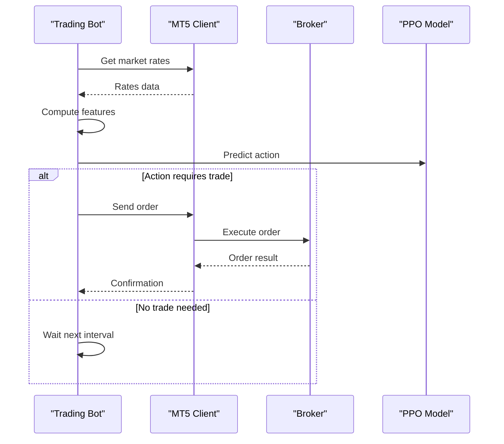

# Cloud Deployment Options

<cite>
**Referenced Files in This Document**
- [DEPLOYMENT_GUIDE.md](file://DEPLOYMENT_GUIDE.md)
- [FREE_DEPLOYMENT.md](file://FREE_DEPLOYMENT.md)
- [README.md](file://README.md)
- [SECURITY.md](file://SECURITY.md)
- [live_trade_metaapi.py](file://live/live_trade_metaapi.py)
- [live_trade_mt5.py](file://live/live_trade_mt5.py)
- [requirements.txt](file://requirements.txt)
</cite>

## Table of Contents
1. [Introduction](#introduction)
2. [Project Structure](#project-structure)
3. [Core Components](#core-components)
4. [Architecture Overview](#architecture-overview)
5. [Detailed Component Analysis](#detailed-component-analysis)
6. [Dependency Analysis](#dependency-analysis)
7. [Performance Considerations](#performance-considerations)
8. [Troubleshooting Guide](#troubleshooting-guide)
9. [Conclusion](#conclusion)
10. [Appendices](#appendices)

## Introduction
This document provides comprehensive cloud deployment guidance for the autonomous trading system across multiple providers: AWS Lightsail, DigitalOcean, and Google Cloud free tier. It also covers local development options using screen and nohup. The guide includes step-by-step setup instructions, service management with systemd, cost optimization strategies, environment variable configuration, API key management, security best practices, monitoring, and troubleshooting for common issues such as network connectivity and resource constraints.

The system supports two live execution modes:
- MetaAPI (cloud-based trading integration)
- MetaTrader 5 (local MT5 terminal or VPS-hosted MT5)

Both modes run a trained model to make decisions and execute trades based on market data and feature computation.

**Section sources**
- [DEPLOYMENT_GUIDE.md:1-192](file://DEPLOYMENT_GUIDE.md#L1-L192)
- [FREE_DEPLOYMENT.md:1-360](file://FREE_DEPLOYMENT.md#L1-L360)
- [README.md:219-292](file://README.md#L219-L292)
- [SECURITY.md:1-167](file://SECURITY.md#L1-L167)

## Project Structure
At a high level, the repository contains:
- Live trading scripts that connect to brokers via MetaAPI or MT5
- Feature engineering modules used by both live scripts
- Training and evaluation utilities
- Documentation for deployment and security

For deployment, focus on:
- Live execution entry points: live/live_trade_metaapi.py and live/live_trade_mt5.py
- Environment variables and credentials: .env file and SECURITY.md guidance
- Systemd service files for auto-start and restart policies
- OS-level dependencies and Python packages from requirements.txt

[No sources needed since this diagram shows conceptual workflow, not actual code structure]

**Section sources**
- [README.md:418-471](file://README.md#L418-L471)
- [requirements.txt:1-29](file://requirements.txt#L1-L29)

## Core Components
- Live trading loop (MetaAPI): Asynchronous loop fetching candles, computing features, predicting actions, and executing orders with retry and reconnection logic.
- Live trading loop (MT5): Synchronous loop fetching rates from MT5, computing features, predicting actions, and sending orders through MT5 API.
- Feature computation: Shared module used by both live scripts to generate observations from market data.
- Environment configuration: Credentials loaded via python-dotenv; sensitive values stored in .env and managed per platform.

Key behaviors:
- Network resilience: retries, timeouts, and automatic reconnection attempts in MetaAPI mode.
- Model loading: loads a pre-trained PPO model from disk before starting the trading loop.
- Logging and monitoring: prints status updates and errors; logs can be captured via systemd journal or log files.

**Section sources**
- [live_trade_metaapi.py:1-231](file://live/live_trade_metaapi.py#L1-L231)
- [live_trade_mt5.py:1-174](file://live/live_trade_mt5.py#L1-L174)
- [README.md:264-292](file://README.md#L264-L292)
- [SECURITY.md:23-84](file://SECURITY.md#L23-L84)

## Architecture Overview
The deployment architecture varies by provider but shares common elements:
- VM instance hosting the Python environment and trading scripts
- Systemd service ensuring auto-start and restart on failure
- Environment variables for credentials and configuration
- Outbound network access to broker APIs (MetaAPI or MT5)

[No sources needed since this diagram shows conceptual workflow, not actual code structure]

## Detailed Component Analysis

### AWS Lightsail Deployment
- Create an Ubuntu 22.04 LTS instance with at least 512 MB RAM and 1 vCPU.
- Connect via SSH and set up Python environment and dependencies.
- Upload project code and place .env securely.
- Create a systemd unit file to manage the process, enable it, and start it.
- Monitor via journalctl and manage with systemctl.

Cost optimization:
- Use the smallest viable instance size (e.g., $3.50/month plan).
- Avoid unnecessary storage and bandwidth usage.
- Keep only required packages installed to minimize overhead.

Service management:
- Enable auto-start on boot and configure restart policy.
- Capture logs centrally via systemd journal.

**Section sources**
- [DEPLOYMENT_GUIDE.md:3-68](file://DEPLOYMENT_GUIDE.md#L3-L68)

### DigitalOcean Droplet Deployment
- Create a Droplet with Ubuntu 22.04 LTS and minimal resources (e.g., 512 MB RAM, 1 CPU).
- Follow the same steps as AWS Lightsail for setup, code upload, and systemd service configuration.
- Performance tuning:
  - Ensure swap space is configured if memory pressure occurs.
  - Limit background processes and keep the environment lean.
  - Use efficient package installation and avoid heavy optional dependencies unless needed.

Monitoring:
- Use DigitalOcean’s built-in metrics and dashboards.
- Combine with systemd journal for application-level logs.

**Section sources**
- [DEPLOYMENT_GUIDE.md:72-86](file://DEPLOYMENT_GUIDE.md#L72-L86)

### Google Cloud Free Tier Deployment
- Provision an e2-micro VM in a free-tier eligible region (us-central1, us-west1, or us-east1).
- Install Python 3.12, create a virtual environment, and install dependencies.
- Upload project code and set environment variables.
- Configure a systemd service to run the bot 24/7 with auto-restart.
- Monitor VM usage and ensure you remain within free tier limits (disk, network egress).

Resource limits and monitoring:
- Track CPU, memory, and disk usage via Google Cloud Console.
- Set billing alerts to prevent accidental charges.
- Stop/start instances when maintenance is needed to conserve free tier hours.

**Section sources**
- [FREE_DEPLOYMENT.md:11-183](file://FREE_DEPLOYMENT.md#L11-L183)
- [FREE_DEPLOYMENT.md:260-334](file://FREE_DEPLOYMENT.md#L260-L334)

### Local Deployment Using screen and nohup
- Use screen to run the bot in a detachable session; reattach later to view output.
- Use nohup to run the bot in the background and capture logs to a file.
- Suitable for development and quick testing on your machine.

Operational tips:
- For screen: create a named session, detach with Ctrl+A then D, reattach with screen -r.
- For nohup: redirect stdout/stderr to a log file and monitor with tail.

**Section sources**
- [DEPLOYMENT_GUIDE.md:101-133](file://DEPLOYMENT_GUIDE.md#L101-L133)

### Systemd Service Management
- Create a unit file specifying WorkingDirectory, ExecStart, User, and Restart policy.
- Place the unit under /etc/systemd/system/, reload daemon, enable and start the service.
- Manage lifecycle with systemctl commands and inspect logs via journalctl.

Best practices:
- Use Restart=always and RestartSec to ensure resilience.
- Set appropriate User and Environment variables for secure credential handling.
- Rotate logs and limit journal size to control disk usage.

**Section sources**
- [DEPLOYMENT_GUIDE.md:37-68](file://DEPLOYMENT_GUIDE.md#L37-L68)
- [FREE_DEPLOYMENT.md:145-183](file://FREE_DEPLOYMENT.md#L145-L183)

### Environment Variables and API Key Management
- Store credentials in a .env file and load via python-dotenv.
- On servers, set environment variables directly or use a secure .env file excluded from version control.
- Restrict file permissions for .env and avoid committing secrets.

Required variables:
- METAAPI_TOKEN
- METAAPI_ACCOUNT_ID

Optional:
- NEWS_API_KEY (if using news features)

Security checklist:
- Ensure .env is in .gitignore.
- Use separate keys for testing vs production.
- Rotate compromised keys immediately and update services.

**Section sources**
- [README.md:264-292](file://README.md#L264-L292)
- [SECURITY.md:23-84](file://SECURITY.md#L23-L84)

### Security Best Practices Across Platforms
- Use SSH keys instead of passwords for server access.
- Configure firewall rules to allow only necessary outbound connections (broker APIs).
- Keep dependencies updated and review code changes before deployment.
- Enable 2FA on broker accounts and use read-only keys where possible for monitoring.
- Monitor logs for suspicious activity and set up alerts.

**Section sources**
- [SECURITY.md:113-167](file://SECURITY.md#L113-L167)

## Dependency Analysis
Runtime dependencies include:
- Stable Baselines3 for RL inference
- PyTorch for model execution
- Pandas and NumPy for data processing
- MetaTrader5 or MetaAPI SDK for broker integration
- python-dotenv for environment variable loading
- Optional libraries for data fetching and visualization

Ensure these are installed in the server environment prior to running the live scripts.

**Section sources**
- [requirements.txt:1-29](file://requirements.txt#L1-L29)

## Performance Considerations
- Choose the smallest viable VM that meets minimum RAM/CPU requirements.
- Minimize background processes and disable unused services.
- Use efficient logging (avoid excessive print statements in tight loops).
- Tune model batch sizes and observation windows to balance accuracy and performance.
- Monitor memory usage and consider swap space on low-memory instances.
- Prefer cloud regions close to broker endpoints to reduce latency.

[No sources needed since this section provides general guidance]

## Troubleshooting Guide

Common issues and resolutions:
- Bot not running:
  - Check service status and recent logs.
  - Restart the service and verify environment variables.
- Cannot connect to VM:
  - Confirm VM state and network settings.
  - Start the instance if stopped.
- Out of disk space:
  - Clean up unused packages and logs.
  - Review journal size and rotate logs.
- Network connectivity problems:
  - Verify outbound access to broker APIs.
  - Check firewall rules and DNS resolution.
- Resource constraints:
  - Monitor CPU/memory usage and adjust instance size if needed.
  - Reduce logging verbosity and optimize data fetches.

Platform-specific checks:
- AWS Lightsail: Use console logs and instance status; validate firewall and snapshots.
- DigitalOcean: Use droplet metrics and snapshots; check firewall and backups.
- Google Cloud: Use Compute Engine dashboard and billing alerts; confirm free tier limits.

**Section sources**
- [DEPLOYMENT_GUIDE.md:137-158](file://DEPLOYMENT_GUIDE.md#L137-L158)
- [FREE_DEPLOYMENT.md:303-334](file://FREE_DEPLOYMENT.md#L303-L334)

## Conclusion
You can deploy the autonomous trading system reliably across AWS Lightsail, DigitalOcean, and Google Cloud free tier using lightweight VMs and systemd for robust process management. Securely manage credentials via environment variables, monitor performance and costs, and follow the troubleshooting steps to maintain uptime. For local development, screen and nohup provide convenient ways to run and observe the bot during testing.

[No sources needed since this section summarizes without analyzing specific files]

## Appendices

### Live Trading Flow (MetaAPI)

[No sources needed since this diagram shows conceptual workflow, not actual code structure]

### Live Trading Flow (MT5)

[No sources needed since this diagram shows conceptual workflow, not actual code structure]