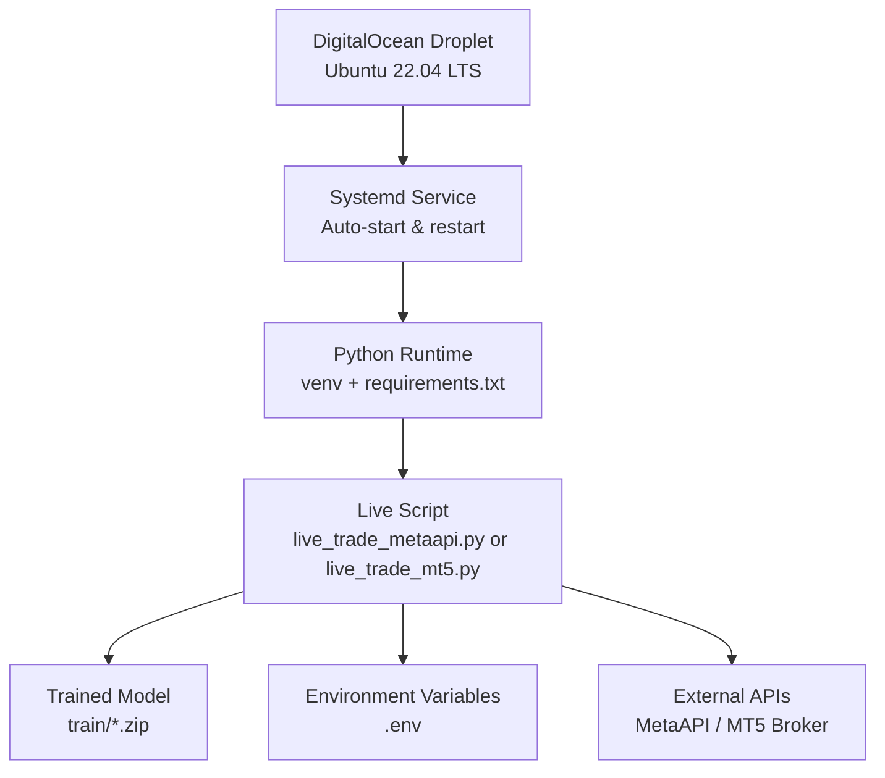
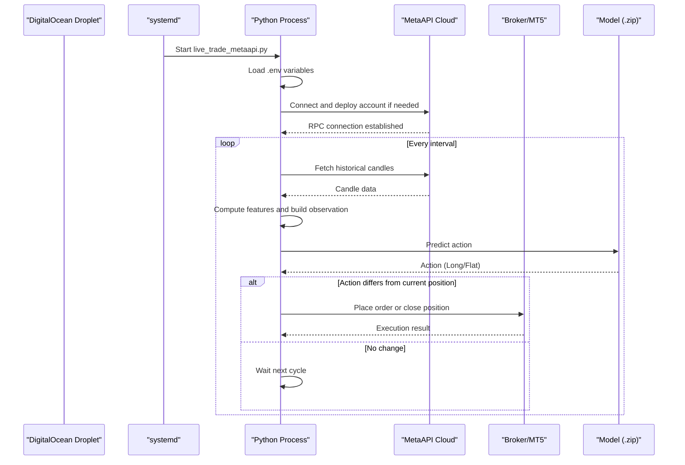
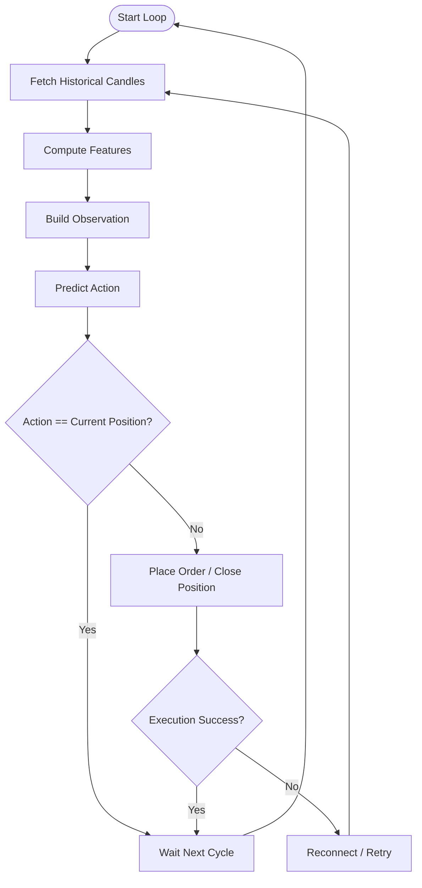
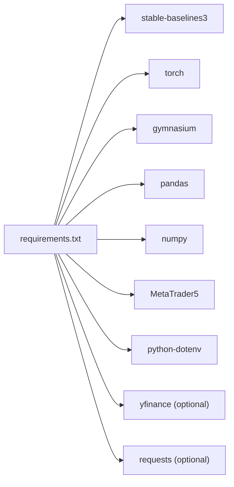

# DigitalOcean Deployment

<cite>
**Referenced Files in This Document**
- [DEPLOYMENT_GUIDE.md](file://DEPLOYMENT_GUIDE.md)
- [README.md](file://README.md)
- [requirements.txt](file://requirements.txt)
- [.env.example](file://.env.example)
- [live_trade_metaapi.py](file://live/live_trade_metaapi.py)
- [live_trade_mt5.py](file://live/live_trade_mt5.py)
</cite>

## Table of Contents
1. Introduction
2. Project Structure
3. Core Components
4. Architecture Overview
5. Detailed Component Analysis
6. Dependency Analysis
7. Performance Considerations
8. Troubleshooting Guide
9. Conclusion
10. Appendices

## Introduction
This document provides a complete DigitalOcean deployment guide for the autonomous trading system, tailored to the $4/month Basic plan (512 MB RAM, 1 CPU) running Ubuntu 22.04 LTS. It covers droplet creation, SSH key setup, environment preparation, code deployment, service configuration, and operational management. It also includes DigitalOcean-specific guidance on firewall rules, snapshots, monitoring dashboards, cost control, and scaling strategies as trading requirements evolve.

The system supports two live execution modes:
- MetaAPI cloud trading via an async Python script
- MetaTrader 5 local client integration

Both modes rely on a trained model artifact and environment variables for credentials and runtime settings.

**Section sources**
- [DEPLOYMENT_GUIDE.md:72-85](file://DEPLOYMENT_GUIDE.md#L72-L85)
- [README.md:219-261](file://README.md#L219-L261)
- [README.md:397-415](file://README.md#L397-L415)

## Project Structure
At a high level, the repository is organized into modules for training, features, environments, evaluation, and live trading. For DigitalOcean deployment, focus on:
- Live scripts under live/
- Trained model artifacts under train/
- Environment variables under .env.example
- Python dependencies under requirements.txt

[No sources needed since this diagram shows conceptual workflow, not actual code structure]

## Core Components
- Live execution scripts:
  - MetaAPI mode: asynchronous loop that fetches market data, computes features, predicts actions, and places orders with retry and reconnection logic.
  - MT5 mode: synchronous loop using the MetaTrader 5 client library to fetch data, compute features, predict actions, and execute trades.
- Configuration:
  - Credentials and runtime parameters are loaded from environment variables defined in .env.example.
- Dependencies:
  - Python packages listed in requirements.txt define the runtime environment.

Key responsibilities:
- Data acquisition from broker/cloud API
- Feature computation and observation construction
- Inference using a pre-trained model
- Order placement and position management
- Robust error handling, retries, and reconnection

**Section sources**
- [live_trade_metaapi.py:23-39](file://live/live_trade_metaapi.py#L23-L39)
- [live_trade_metaapi.py:40-86](file://live/live_trade_metaapi.py#L40-L86)
- [live_trade_metaapi.py:135-220](file://live/live_trade_metaapi.py#L135-L220)
- [live_trade_mt5.py:10-19](file://live/live_trade_mt5.py#L10-L19)
- [live_trade_mt5.py:21-30](file://live/live_trade_mt5.py#L21-L30)
- [live_trade_mt5.py:111-173](file://live/live_trade_mt5.py#L111-L173)
- [.env.example:1-21](file://.env.example#L1-L21)
- [requirements.txt:1-29](file://requirements.txt#L1-L29)

## Architecture Overview
The production flow on DigitalOcean uses systemd to manage the bot process, ensuring it starts automatically and restarts on failure. The live script loads environment variables, connects to the trading backend (MetaAPI or MT5), retrieves market data, computes features, runs inference, and executes trades.

**Diagram sources**
- [live_trade_metaapi.py:135-220](file://live/live_trade_metaapi.py#L135-L220)
- [live_trade_mt5.py:111-173](file://live/live_trade_mt5.py#L111-L173)

**Section sources**
- [DEPLOYMENT_GUIDE.md:72-85](file://DEPLOYMENT_GUIDE.md#L72-L85)
- [DEPLOYMENT_GUIDE.md:137-158](file://DEPLOYMENT_GUIDE.md#L137-L158)

## Detailed Component Analysis

### DigitalOcean Droplet Setup
- Create a Droplet with Ubuntu 22.04 LTS and select the Basic plan ($4/month, 512 MB RAM, 1 CPU).
- Add an SSH key during creation for secure access.
- Choose a datacenter closest to your broker’s servers to minimize latency.

After creation:
- Connect via SSH using your key.
- Proceed with environment setup and deployment steps below.

**Section sources**
- [DEPLOYMENT_GUIDE.md:72-85](file://DEPLOYMENT_GUIDE.md#L72-L85)

### Server Initialization and Environment Setup
On the Droplet:
- Update system packages and install Python 3.12 and venv.
- Install build tools and Git.
- Create a project directory and a virtual environment.
- Activate the venv and install Python dependencies from requirements.txt.

Ensure network access to required services (MetaAPI or MT5 broker endpoints).

**Section sources**
- [requirements.txt:1-29](file://requirements.txt#L1-L29)
- [README.md:219-261](file://README.md#L219-L261)

### Code Deployment
- Transfer the repository or relevant files to the Droplet (e.g., live scripts, features, models).
- Ensure the trained model artifact exists at the expected path referenced by the live script.
- Create a .env file based on .env.example and populate credentials and runtime settings.

Verify connectivity and run a test execution before enabling auto-start.

**Section sources**
- [.env.example:1-21](file://.env.example#L1-L21)
- [live_trade_metaapi.py:23-39](file://live/live_trade_metaapi.py#L23-L39)
- [live_trade_mt5.py:10-19](file://live/live_trade_mt5.py#L10-L19)

### Service Configuration (systemd)
Create a systemd unit to run the bot as a managed service:
- Define the working directory, user, and environment variables (PYTHONPATH and any custom vars).
- Point ExecStart to the venv Python interpreter and the live script.
- Enable automatic restart on failure and set restart delay.

Enable and start the service, then verify status and logs.

**Section sources**
- [DEPLOYMENT_GUIDE.md:37-68](file://DEPLOYMENT_GUIDE.md#L37-L68)
- [DEPLOYMENT_GUIDE.md:137-158](file://DEPLOYMENT_GUIDE.md#L137-L158)

### Live Trading Modes

#### MetaAPI Mode
- Loads credentials from environment variables.
- Deploys the MetaAPI account if not already deployed.
- Establishes an RPC connection and waits for synchronization.
- Periodically fetches candles, computes features, predicts actions, and places orders with retries and timeouts.
- Handles disconnections and attempts reconnection.

**Diagram sources**
- [live_trade_metaapi.py:40-86](file://live/live_trade_metaapi.py#L40-L86)
- [live_trade_metaapi.py:135-220](file://live/live_trade_metaapi.py#L135-L220)

**Section sources**
- [live_trade_metaapi.py:23-39](file://live/live_trade_metaapi.py#L23-L39)
- [live_trade_metaapi.py:40-86](file://live/live_trade_metaapi.py#L40-L86)
- [live_trade_metaapi.py:135-220](file://live/live_trade_metaapi.py#L135-L220)

#### MetaTrader 5 Mode
- Initializes the MT5 client and loads the model.
- Fetches market data, computes features, builds observations, and predicts actions.
- Executes buy/close operations based on the predicted action versus current position.
- Includes basic error handling and periodic sleep between cycles.

**Section sources**
- [live_trade_mt5.py:10-19](file://live/live_trade_mt5.py#L10-L19)
- [live_trade_mt5.py:21-30](file://live/live_trade_mt5.py#L21-L30)
- [live_trade_mt5.py:111-173](file://live/live_trade_mt5.py#L111-L173)

## Dependency Analysis
Runtime dependencies include deep learning libraries, data processing tools, and trading integrations. On DigitalOcean, ensure these are installed within the virtual environment.

**Diagram sources**
- [requirements.txt:1-29](file://requirements.txt#L1-L29)

**Section sources**
- [requirements.txt:1-29](file://requirements.txt#L1-L29)

## Performance Considerations
- Memory constraints: The Basic plan has 512 MB RAM. Avoid heavy concurrent processes and keep feature windows reasonable. The live scripts use modest window sizes and minimal background tasks.
- CPU usage: The inference loop runs periodically; avoid excessive polling frequency to reduce CPU load.
- Disk space: Keep only necessary data and model artifacts. Clean up old logs and temporary files regularly.
- Network: Choose a datacenter near your broker to reduce latency and improve execution reliability.

[No sources needed since this section provides general guidance]

## Troubleshooting Guide
Common issues and resolutions on DigitalOcean:

- Service not running:
  - Check status and logs with systemctl and journalctl.
  - Restart the service after fixing configuration or environment issues.

- Missing environment variables:
  - Ensure .env is present and correctly populated per .env.example.
  - Verify PYTHONPATH points to the project root so imports resolve.

- Connection failures:
  - For MetaAPI: The script includes retries and reconnection logic; check logs for timeout or “not connected” messages.
  - For MT5: Confirm the MT5 terminal is accessible and authenticated on the server.

- Out of memory or CPU spikes:
  - Reduce feature window size or polling frequency.
  - Monitor resource usage via DigitalOcean metrics and adjust accordingly.

- Disk space exhaustion:
  - Use df to inspect usage and clean up logs or unused data.

**Section sources**
- [DEPLOYMENT_GUIDE.md:37-68](file://DEPLOYMENT_GUIDE.md#L37-L68)
- [DEPLOYMENT_GUIDE.md:137-158](file://DEPLOYMENT_GUIDE.md#L137-L158)
- [live_trade_metaapi.py:135-220](file://live/live_trade_metaapi.py#L135-L220)

## Conclusion
Deploying the autonomous trading system on DigitalOcean involves creating a small, cost-effective Droplet, preparing the environment, deploying code and credentials, and managing the process with systemd. The live scripts provide robust connectivity and error handling for both MetaAPI and MT5 modes. With proper monitoring, snapshots, and firewall rules, you can operate reliably while controlling costs and scaling as needed.

[No sources needed since this section summarizes without analyzing specific files]

## Appendices

### DigitalOcean-Specific Operations

- Firewall Rules:
  - Restrict inbound traffic to essential ports (e.g., SSH).
  - Allow outbound connections to MetaAPI and broker endpoints.

- Snapshots:
  - Take snapshots before major updates or configuration changes.
  - Restore from snapshots if needed to revert to a known good state.

- Monitoring Dashboards:
  - Use DigitalOcean metrics to track CPU, memory, disk, and network usage.
  - Set alerts for unusual spikes or sustained high utilization.

- Cost Management:
  - Stay on the Basic plan unless performance requires more resources.
  - Use snapshots sparingly and prune old ones to control storage costs.
  - Monitor bandwidth egress to avoid unexpected charges.

- Scaling Options:
  - Upgrade Droplet plan if memory or CPU becomes a bottleneck.
  - Consider separate instances for training vs. live trading to isolate workloads.
  - Use multiple Droplets for redundancy or multi-region deployments if latency is critical.

[No sources needed since this section provides general guidance]