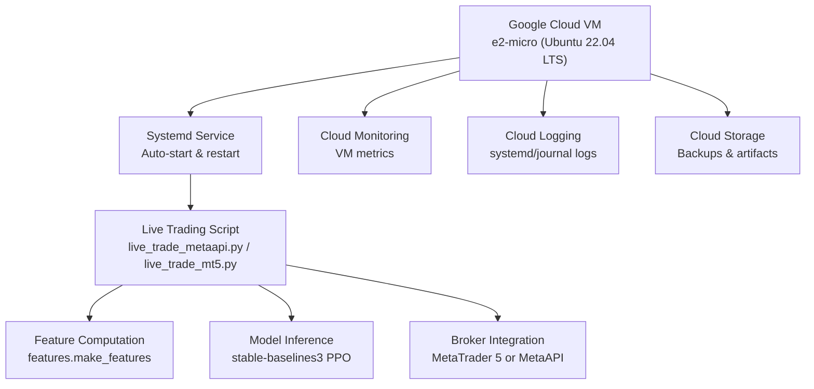
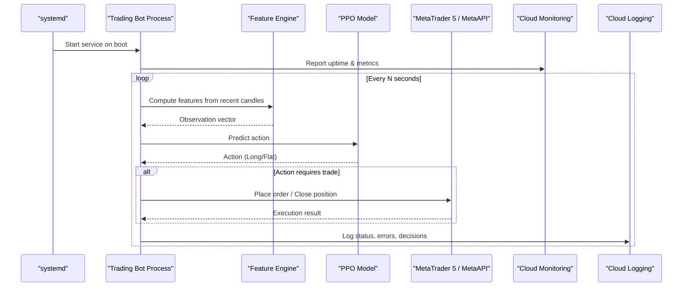
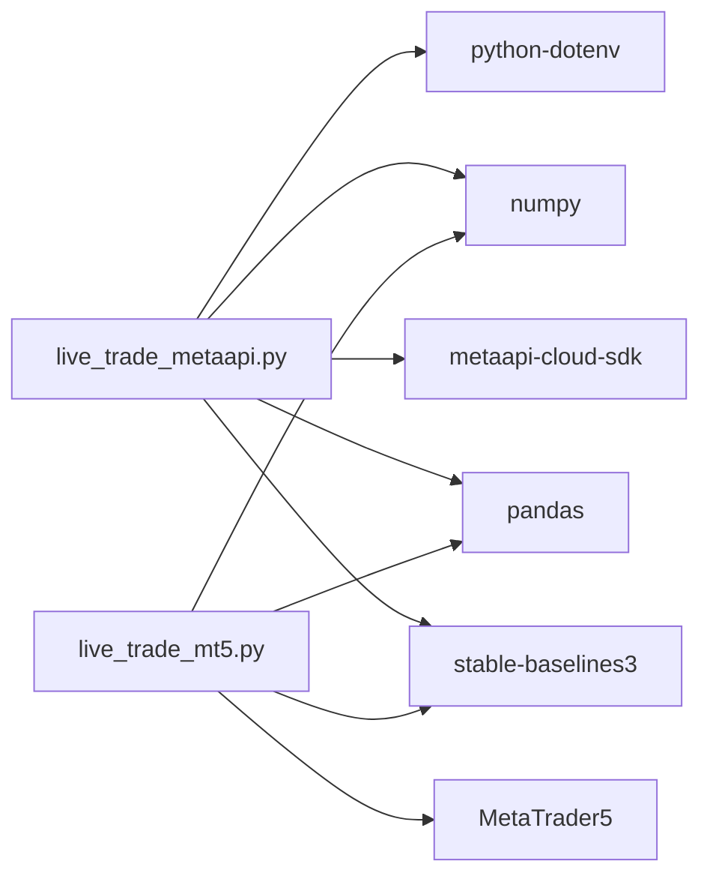
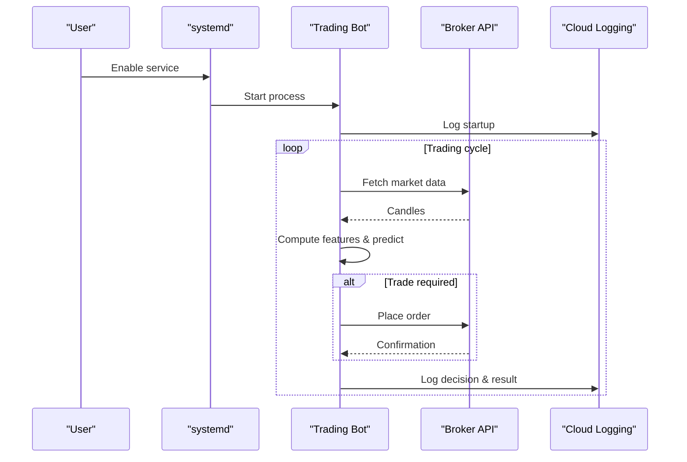

# Google Cloud Free Tier

<cite>
**Referenced Files in This Document**
- [FREE_DEPLOYMENT.md](file://FREE_DEPLOYMENT.md)
- [DEPLOYMENT_GUIDE.md](file://DEPLOYMENT_GUIDE.md)
- [README.md](file://README.md)
- [requirements.txt](file://requirements.txt)
- [live_trade_metaapi.py](file://live/live_trade_metaapi.py)
- [live_trade_mt5.py](file://live/live_trade_mt5.py)
</cite>

## Table of Contents
1. [Introduction](#introduction)
2. [Project Structure](#project-structure)
3. [Core Components](#core-components)
4. [Architecture Overview](#architecture-overview)
5. [Detailed Component Analysis](#detailed-component-analysis)
6. [Dependency Analysis](#dependency-analysis)
7. [Performance Considerations](#performance-considerations)
8. [Troubleshooting Guide](#troubleshooting-guide)
9. [Conclusion](#conclusion)
10. [Appendices](#appendices)

## Introduction
This document provides a comprehensive guide to deploying the autonomous trading system on Google Cloud’s free tier using an e2-micro instance with Ubuntu 22.04 LTS. It covers VM creation, network configuration, resource limitations and optimization strategies for staying within free tier limits, monitoring and logging via Google Cloud services, cost tracking, backup strategies using Google Cloud Storage, and disaster recovery procedures tailored to the free tier environment. The guidance is grounded in the repository’s deployment documentation and live trading components.

## Project Structure
The project includes:
- Live trading scripts that connect to brokers via MetaTrader 5 or MetaAPI
- Feature engineering and model inference modules
- Training scripts and evaluation utilities
- Deployment guides and free-tier instructions

**Diagram sources**
- [FREE_DEPLOYMENT.md:11-55](file://FREE_DEPLOYMENT.md#L11-L55)
- [FREE_DEPLOYMENT.md:145-183](file://FREE_DEPLOYMENT.md#L145-L183)
- [live_trade_metaapi.py:1-231](file://live/live_trade_metaapi.py#L1-L231)
- [live_trade_mt5.py:1-174](file://live/live_trade_mt5.py#L1-L174)

**Section sources**
- [FREE_DEPLOYMENT.md:11-55](file://FREE_DEPLOYMENT.md#L11-L55)
- [DEPLOYMENT_GUIDE.md:88-98](file://DEPLOYMENT_GUIDE.md#L88-L98)
- [README.md:418-471](file://README.md#L418-L471)

## Core Components
- Live trading entry points:
  - MetaAPI-based live trading script with async loops, retries, and connection management
  - MetaTrader 5-based live trading script with synchronous execution
- System service management:
  - systemd unit file to auto-start and auto-restart the bot
- Resource constraints:
  - e2-micro instance with limited CPU and memory; optimized for low-latency data fetches and minimal overhead

Key responsibilities:
- Fetch market data and compute features
- Load pre-trained models and predict actions
- Execute trades via broker APIs with error handling and reconnection logic
- Persist logs and ensure resilience through auto-restart mechanisms

**Section sources**
- [live_trade_metaapi.py:40-86](file://live/live_trade_metaapi.py#L40-L86)
- [live_trade_metaapi.py:100-134](file://live/live_trade_metaapi.py#L100-L134)
- [live_trade_metaapi.py:135-231](file://live/live_trade_metaapi.py#L135-L231)
- [live_trade_mt5.py:21-30](file://live/live_trade_mt5.py#L21-L30)
- [live_trade_mt5.py:32-96](file://live/live_trade_mt5.py#L32-L96)
- [live_trade_mt5.py:111-174](file://live/live_trade_mt5.py#L111-L174)
- [FREE_DEPLOYMENT.md:145-183](file://FREE_DEPLOYMENT.md#L145-L183)

## Architecture Overview
The deployment architecture centers around a single e2-micro VM running the trading bot as a managed systemd service. The bot connects to a broker via MetaTrader 5 or MetaAPI, computes features from market data, runs model inference, and executes orders. Google Cloud Monitoring tracks VM performance, while Cloud Logging captures application logs. Backups are stored in Google Cloud Storage.

**Diagram sources**
- [FREE_DEPLOYMENT.md:145-183](file://FREE_DEPLOYMENT.md#L145-L183)
- [live_trade_metaapi.py:135-231](file://live/live_trade_metaapi.py#L135-L231)
- [live_trade_mt5.py:111-174](file://live/live_trade_mt5.py#L111-L174)

## Detailed Component Analysis

### VM Provisioning and OS Setup (Google Cloud Free Tier)
- Create an e2-micro instance in a free-tier eligible region (us-central1, us-west1, or us-east1)
- Use Ubuntu 22.04 LTS image with a 30 GB standard persistent disk
- Allow HTTP/HTTPS traffic if needed for external access
- Connect via SSH and install Python 3.12, virtual environment, and dependencies

Optimization tips:
- Keep only essential packages installed to minimize memory footprint
- Use a lightweight Python virtual environment per project
- Avoid unnecessary background services

**Section sources**
- [FREE_DEPLOYMENT.md:24-55](file://FREE_DEPLOYMENT.md#L24-L55)
- [FREE_DEPLOYMENT.md:59-94](file://FREE_DEPLOYMENT.md#L59-L94)
- [DEPLOYMENT_GUIDE.md:88-98](file://DEPLOYMENT_GUIDE.md#L88-L98)

### Network Configuration
- Ensure outbound connectivity to broker endpoints (MetaTrader 5 or MetaAPI)
- If exposing any services, restrict firewall rules to necessary ports
- Use internal IPs where possible to avoid external IP charges beyond free tier allowances

**Section sources**
- [DEPLOYMENT_GUIDE.md:88-98](file://DEPLOYMENT_GUIDE.md#L88-L98)

### Application Deployment and Auto-Start
- Install Python dependencies into a virtual environment
- Upload code and trained models to the VM
- Create a systemd service to run the bot continuously with automatic restarts
- Manage logs via journalctl and integrate with Cloud Logging

Operational commands:
- Start, stop, restart, and check status of the service
- View live logs and last entries

**Section sources**
- [FREE_DEPLOYMENT.md:98-141](file://FREE_DEPLOYMENT.md#L98-L141)
- [FREE_DEPLOYMENT.md:145-183](file://FREE_DEPLOYMENT.md#L145-L183)
- [FREE_DEPLOYMENT.md:186-217](file://FREE_DEPLOYMENT.md#L186-L217)

### Live Trading Scripts
- MetaAPI integration:
  - Async trading loop with retries and timeouts
  - Connection stabilization and reconnection logic
  - Position checks and order execution with magic numbers for identification
- MetaTrader 5 integration:
  - Synchronous loop fetching rates from MT5 terminal
  - Order placement and position closure with deviation and filling modes
  - Continuous polling with sleep intervals

Error handling patterns:
- Retry on network timeouts and transient failures
- Graceful disconnection and cleanup on critical errors

**Section sources**
- [live_trade_metaapi.py:40-86](file://live/live_trade_metaapi.py#L40-L86)
- [live_trade_metaapi.py:100-134](file://live/live_trade_metaapi.py#L100-L134)
- [live_trade_metaapi.py:135-231](file://live/live_trade_metaapi.py#L135-L231)
- [live_trade_mt5.py:21-30](file://live/live_trade_mt5.py#L21-L30)
- [live_trade_mt5.py:32-96](file://live/live_trade_mt5.py#L32-L96)
- [live_trade_mt5.py:111-174](file://live/live_trade_mt5.py#L111-L174)

### Monitoring and Logging
- Cloud Monitoring:
  - Track CPU usage, network traffic, and uptime from the VM instances page
- Cloud Logging:
  - Capture systemd journal logs for the trading-bot service
  - Forward logs to Cloud Logging for centralized analysis and alerting

Cost tracking:
- Set budgets and alerts to prevent unexpected charges
- Monitor free tier usage to stay within limits

**Section sources**
- [FREE_DEPLOYMENT.md:260-278](file://FREE_DEPLOYMENT.md#L260-L278)
- [FREE_DEPLOYMENT.md:338-345](file://FREE_DEPLOYMENT.md#L338-L345)

### Backup Strategy Using Google Cloud Storage
- Periodically back up:
  - Trained models (e.g., .zip files)
  - Configuration files (.env, feature caches)
  - Logs and reports
- Use gsutil or the Cloud Console to upload backups to a dedicated bucket
- Implement lifecycle policies to retain recent backups and archive older ones

Disaster recovery:
- Restore models and configs from storage to a new VM
- Reinstall dependencies and restore service configuration
- Validate connectivity and resume trading operations

[No sources needed since this section provides general guidance]

## Dependency Analysis
The runtime depends on:
- stable-baselines3 for RL model inference
- torch for deep learning backend
- pandas and numpy for data processing
- MetaTrader5 or metaapi-cloud-sdk for broker integration
- python-dotenv for secure credential loading

**Diagram sources**
- [live_trade_metaapi.py:1-231](file://live/live_trade_metaapi.py#L1-L231)
- [live_trade_mt5.py:1-174](file://live/live_trade_mt5.py#L1-L174)
- [requirements.txt:1-29](file://requirements.txt#L1-L29)

**Section sources**
- [requirements.txt:1-29](file://requirements.txt#L1-L29)
- [README.md:248-261](file://README.md#L248-L261)

## Performance Considerations
- CPU and memory constraints:
  - e2-micro provides shared vCPU and limited RAM; keep processes minimal
  - Prefer asynchronous operations and efficient data pipelines
- Data fetching optimization:
  - Limit historical window sizes to reduce memory usage
  - Cache features when appropriate to avoid recomputation
- Model inference:
  - Use deterministic predictions to reduce variability
  - Batch operations where feasible without exceeding memory limits
- Network efficiency:
  - Minimize API calls and implement retry/backoff strategies
  - Monitor egress to stay within free tier limits

[No sources needed since this section provides general guidance]

## Troubleshooting Guide
Common issues and resolutions:
- Bot not running:
  - Check systemd status and journal logs
  - Restart the service if necessary
- Cannot connect to VM:
  - Verify VM state and start if stopped
- Out of disk space:
  - Clean up unused packages and temporary files
- Network timeouts:
  - Inspect logs for timeout messages and adjust retry intervals
- Quota and free tier restrictions:
  - Ensure machine type remains e2-micro in eligible regions
  - Monitor network egress and disk usage to avoid overages

**Section sources**
- [FREE_DEPLOYMENT.md:303-335](file://FREE_DEPLOYMENT.md#L303-L335)
- [FREE_DEPLOYMENT.md:281-299](file://FREE_DEPLOYMENT.md#L281-L299)

## Conclusion
Deploying the autonomous trading system on Google Cloud’s free tier with an e2-micro instance is feasible and cost-effective when carefully managed. By adhering to free tier limits, optimizing resource usage, leveraging Cloud Monitoring and Logging, and implementing robust backup and disaster recovery procedures, you can maintain reliable trading operations at no cost. Always monitor quotas and costs to prevent unexpected charges and ensure long-term sustainability.

[No sources needed since this section summarizes without analyzing specific files]

## Appendices

### Step-by-Step Free Tier Deployment Summary
- Create Google Cloud account and activate free tier
- Provision e2-micro VM with Ubuntu 22.04 LTS and 30 GB disk
- Install Python 3.12, virtual environment, and dependencies
- Upload code and models; configure environment variables securely
- Create systemd service for auto-start and auto-restart
- Monitor via Cloud Monitoring and Cloud Logging
- Set budget alerts and track free tier usage

**Section sources**
- [FREE_DEPLOYMENT.md:11-55](file://FREE_DEPLOYMENT.md#L11-L55)
- [FREE_DEPLOYMENT.md:59-94](file://FREE_DEPLOYMENT.md#L59-L94)
- [FREE_DEPLOYMENT.md:145-183](file://FREE_DEPLOYMENT.md#L145-L183)
- [FREE_DEPLOYMENT.md:260-278](file://FREE_DEPLOYMENT.md#L260-L278)
- [FREE_DEPLOYMENT.md:338-345](file://FREE_DEPLOYMENT.md#L338-L345)

### Live Trading Workflow Sequence

**Diagram sources**
- [FREE_DEPLOYMENT.md:145-183](file://FREE_DEPLOYMENT.md#L145-L183)
- [live_trade_metaapi.py:135-231](file://live/live_trade_metaapi.py#L135-L231)
- [live_trade_mt5.py:111-174](file://live/live_trade_mt5.py#L111-L174)