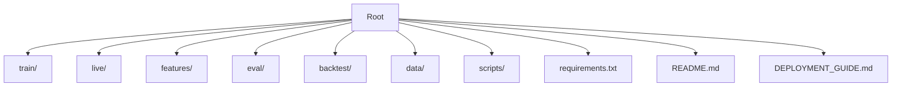
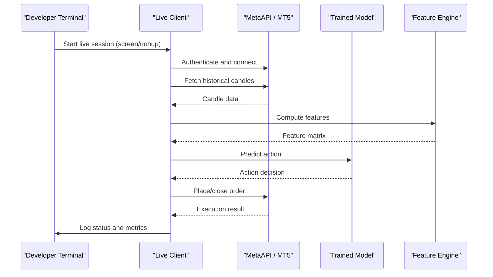
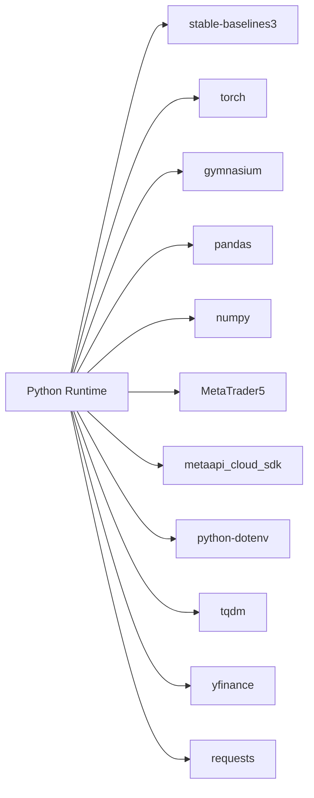

# Local Development Environment

<cite>
**Referenced Files in This Document**
- [README.md](file://README.md)
- [requirements.txt](file://requirements.txt)
- [DEPLOYMENT_GUIDE.md](file://DEPLOYMENT_GUIDE.md)
- [live_trade_mt5.py](file://live/live_trade_mt5.py)
- [live_trade_metaapi.py](file://live/live_trade_metaapi.py)
- [train_ultimate_150.py](file://train/train_ultimate_150.py)
- [evaluate_model.py](file://evaluate_model.py)
</cite>

## Table of Contents
1. Introduction
2. Project Structure
3. Core Components
4. Architecture Overview
5. Detailed Component Analysis
6. Dependency Analysis
7. Performance Considerations
8. Troubleshooting Guide
9. Conclusion
10. Appendices

## Introduction
This document provides a complete local development environment guide for running the autonomous trading system on personal computers (Mac and Linux). It covers installation, environment configuration, API key management, training workflows, evaluation, live paper trading, and production-style background execution using screen or nohup. It also includes process management, log monitoring, testing strategies, and platform-specific considerations to help you develop and validate your setup before deploying to production.

## Project Structure
The repository is organized into feature-based modules:
- Training scripts under train/
- Live trading clients under live/
- Feature engineering under features/
- Evaluation and backtesting under eval/ and backtest/
- Data utilities under data/ and scripts/
- Requirements and documentation at the root

**Section sources**
- [README.md:418-471](file://README.md#L418-L471)

## Core Components
- Training pipeline: DreamerV3/PPO training with multi-timeframe features and configurable device selection.
- Live trading clients: MT5 direct integration and MetaAPI cloud integration for paper/live trading.
- Evaluation: Model evaluation script producing metrics and plots.
- Dependencies: Python packages for RL, data processing, and trading integrations.

Key responsibilities:
- train_ultimate_150.py: Orchestrates feature loading, environment creation, and training loops.
- live_trade_mt5.py: Connects to MT5 terminal, loads model, fetches market data, computes features, predicts actions, and executes orders.
- live_trade_metaapi.py: Async client connecting to MetaAPI, handling deployment, connection stability, retries, and order execution.
- evaluate_model.py: Runs evaluation over historical data, computes performance metrics, and generates visualizations.

**Section sources**
- [train_ultimate_150.py:154-200](file://train/train_ultimate_150.py#L154-L200)
- [live_trade_mt5.py:111-174](file://live/live_trade_mt5.py#L111-L174)
- [live_trade_metaapi.py:135-231](file://live/live_trade_metaapi.py#L135-L231)
- [evaluate_model.py:87-161](file://evaluate_model.py#L87-L161)

## Architecture Overview
Local development workflow spans data preparation, training, evaluation, and live trading. The following diagram shows how components interact during live trading via MetaAPI and MT5.

**Diagram sources**
- [live_trade_metaapi.py:40-86](file://live/live_trade_metaapi.py#L40-L86)
- [live_trade_metaapi.py:135-231](file://live/live_trade_metaapi.py#L135-L231)
- [live_trade_mt5.py:21-30](file://live/live_trade_mt5.py#L21-L30)
- [live_trade_mt5.py:111-174](file://live/live_trade_mt5.py#L111-L174)

## Detailed Component Analysis

### Installation and Environment Setup
- Prerequisites:
  - Python 3.12+
  - 8GB+ RAM recommended
  - Disk space for data and models
- Create and activate a virtual environment
- Install dependencies from requirements.txt
- For Apple Silicon MPS support, ensure PyTorch supports MPS; otherwise use CPU or CUDA on NVIDIA GPUs

Environment variables and API keys:
- Use python-dotenv to load credentials from .env
- Required keys for MetaAPI: METAAPI_TOKEN, METAAPI_ACCOUNT_ID
- Ensure .env is excluded from version control

Platform notes:
- Mac: Use brew to install screen if needed; MPS acceleration available on M1/M2/M3
- Linux: Use systemd services or nohup/screen for background execution; ensure GPU drivers if using CUDA

**Section sources**
- [README.md:219-261](file://README.md#L219-L261)
- [README.md:264-291](file://README.md#L264-L291)
- [requirements.txt:1-29](file://requirements.txt#L1-L29)

### Screen-Based Deployment (Interactive Sessions)
Use screen to run interactive sessions that persist across terminal disconnects:
- Install screen (Mac: brew install screen; Linux: package manager)
- Start a named session and run the live client
- Detach with Ctrl+A then D; reattach with screen -r <session>
- Kill session when done

Example flows:
- MetaAPI client: start screen, run live_trade_metaapi.py, detach
- MT5 client: start screen, run live_trade_mt5.py, detach

Log monitoring:
- Reattach to screen to view logs in real time
- Alternatively, redirect output to files and tail them

**Section sources**
- [DEPLOYMENT_GUIDE.md:101-118](file://DEPLOYMENT_GUIDE.md#L101-L118)

### Nohup-Based Deployment (Background Processes)
Run clients in the background without an interactive session:
- Use nohup to launch the client and redirect stdout/stderr to a log file
- Monitor logs with tail -f
- Find process IDs with ps and stop processes with kill

Example flows:
- MetaAPI client: nohup python live_trade_metaapi.py > metaapi.log 2>&1 &
- MT5 client: nohup python live_trade_mt5.py > mt5.log 2>&1 &

Process management:
- Check running processes
- Stop processes by PID
- Rotate logs periodically to avoid large files

**Section sources**
- [DEPLOYMENT_GUIDE.md:120-133](file://DEPLOYMENT_GUIDE.md#L120-L133)

### Environment Variable Configuration and API Key Management
- Create a .env file based on .env.example
- Set METAAPI_TOKEN and METAAPI_ACCOUNT_ID
- Load via python-dotenv in live clients
- Verify credentials are not committed to git

Security best practices:
- Keep .env out of version control
- Use separate .env files for dev/demo/prod
- Rotate tokens regularly

**Section sources**
- [README.md:264-291](file://README.md#L264-L291)
- [live_trade_metaapi.py:23-31](file://live/live_trade_metaapi.py#L23-L31)

### Training Workflow (Local Development)
- Prepare data: fetch macro data and generate economic calendar
- Train models: choose device (cpu/mps/cuda), set steps and batch size
- Monitor progress: checkpoints saved periodically; logs show rewards and losses
- Resume training if needed

Device selection:
- Mac: --device mps
- Linux/NVIDIA: --device cuda
- Fallback: --device cpu

Training parameters:
- Steps, batch size, learning rate, gamma, exploration coefficient
- Parallel environments for faster training

**Section sources**
- [README.md:296-361](file://README.md#L296-L361)
- [train_ultimate_150.py:154-200](file://train/train_ultimate_150.py#L154-L200)

### Evaluation Workflow
- Run evaluation against validation/test data
- Metrics include total return, annualized return, Sharpe ratio, max drawdown, win rate, position stats
- Visualize equity curve, drawdown, and positions

Usage:
- Provide model path to evaluate_model.py
- Inspect outputs and plots for performance validation

**Section sources**
- [evaluate_model.py:87-161](file://evaluate_model.py#L87-L161)
- [evaluate_model.py:164-200](file://evaluate_model.py#L164-L200)

### Live Trading Clients

#### MetaAPI Client (Cloud Trading)
- Asynchronous client with retry logic and timeouts
- Handles account deployment and connection stabilization
- Fetches historical candles, computes features, predicts actions, and places orders
- Robust error handling for network issues and reconnection

Key behaviors:
- Automatic region detection and deployment
- Connection tests with retries
- Graceful shutdown and logging

**Section sources**
- [live_trade_metaapi.py:40-86](file://live/live_trade_metaapi.py#L40-L86)
- [live_trade_metaapi.py:135-231](file://live/live_trade_metaapi.py#L135-L231)

#### MT5 Client (Direct Integration)
- Requires MetaTrader 5 installed and logged into a demo/real account
- Initializes MT5, loads model, fetches market data, computes features, predicts actions, and executes orders
- Simple long-only strategy with flat/long actions

Key behaviors:
- Market data retrieval from MT5
- Order placement and position closing
- Loop with periodic checks and graceful shutdown

**Section sources**
- [live_trade_mt5.py:21-30](file://live/live_trade_mt5.py#L21-L30)
- [live_trade_mt5.py:111-174](file://live/live_trade_mt5.py#L111-L174)

### Process Management and Log Monitoring
- Use screen for interactive sessions; reattach to monitor logs
- Use nohup for background processes; tail logs and manage PIDs
- On Linux, consider systemd services for auto-start and centralized logging

Commands:
- Start screen session and run client
- Detach and reattach sessions
- Background with nohup and tail logs
- List processes and kill by PID

**Section sources**
- [DEPLOYMENT_GUIDE.md:101-158](file://DEPLOYMENT_GUIDE.md#L101-L158)

## Dependency Analysis
Core dependencies include RL libraries, data processing tools, and trading integrations.

**Diagram sources**
- [requirements.txt:1-29](file://requirements.txt#L1-L29)

**Section sources**
- [requirements.txt:1-29](file://requirements.txt#L1-L29)

## Performance Considerations
- Hardware selection:
  - Mac: MPS acceleration for faster training on Apple Silicon
  - Linux: CUDA for NVIDIA GPUs; otherwise CPU
- Memory usage:
  - Increase batch size cautiously; monitor memory
  - Use smaller windows or fewer features if constrained
- Network latency:
  - MetaAPI client includes retries and timeouts; tune intervals
  - MT5 client depends on local terminal connectivity
- Logging overhead:
  - Redirect logs to files and rotate periodically
  - Reduce verbosity in production runs

[No sources needed since this section provides general guidance]

## Troubleshooting Guide
Common issues and resolutions:

- Missing or invalid API keys:
  - Ensure .env contains correct METAAPI_TOKEN and METAAPI_ACCOUNT_ID
  - Verify python-dotenv loads successfully in the client

- MT5 connection failures:
  - Confirm MetaTrader 5 is installed and logged into the correct account
  - Check terminal initialization and last_error messages

- Network timeouts and reconnections:
  - MetaAPI client handles timeouts and retries; check logs for reconnection attempts
  - Adjust timeout values if necessary

- Insufficient data for features:
  - Ensure enough historical candles are fetched before computing features
  - Validate feature computation and window sizes

- Process management:
  - Use ps to find processes; kill stale processes
  - Rotate logs to prevent disk exhaustion

- Platform-specific issues:
  - Mac: Install screen via brew; verify MPS availability
  - Linux: Ensure CUDA drivers if using GPU; configure systemd service paths

**Section sources**
- [live_trade_metaapi.py:40-86](file://live/live_trade_metaapi.py#L40-L86)
- [live_trade_metaapi.py:135-231](file://live/live_trade_metaapi.py#L135-L231)
- [live_trade_mt5.py:111-174](file://live/live_trade_mt5.py#L111-L174)
- [DEPLOYMENT_GUIDE.md:101-158](file://DEPLOYMENT_GUIDE.md#L101-L158)

## Conclusion
You now have a comprehensive guide to set up, configure, and run the autonomous trading system locally on Mac and Linux. Use screen or nohup for persistent sessions, manage API keys securely, train and evaluate models, and validate performance through paper trading before moving to production. Follow the troubleshooting steps and best practices to maintain a robust development workflow.

[No sources needed since this section summarizes without analyzing specific files]

## Appendices

### Quick Commands Reference
- Install dependencies: pip install -r requirements.txt
- Train model: python train/train_ultimate_150.py --steps 1000000 --device mps --batch-size 64
- Evaluate model: python evaluate_model.py --model train/ppo_xauusd_latest.zip
- Paper trade (MT5): python live/live_trade_mt5.py
- Paper trade (MetaAPI): python live/live_trade_metaapi.py
- Screen session: screen -S trading-bot; run client; detach with Ctrl+A, D; reattach with screen -r trading-bot
- Nohup background: nohup python live/live_trade_metaapi.py > metaapi.log 2>&1 &; tail -f metaapi.log

**Section sources**
- [README.md:296-361](file://README.md#L296-L361)
- [DEPLOYMENT_GUIDE.md:101-133](file://DEPLOYMENT_GUIDE.md#L101-L133)