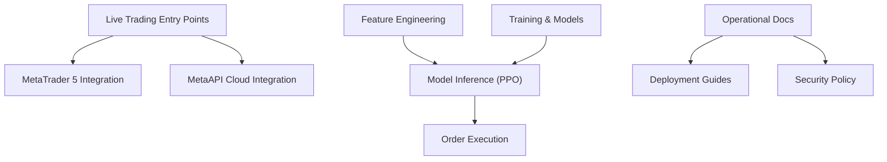
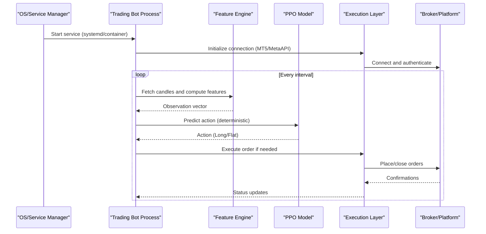
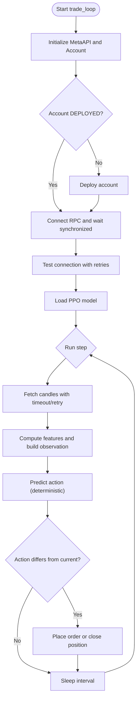
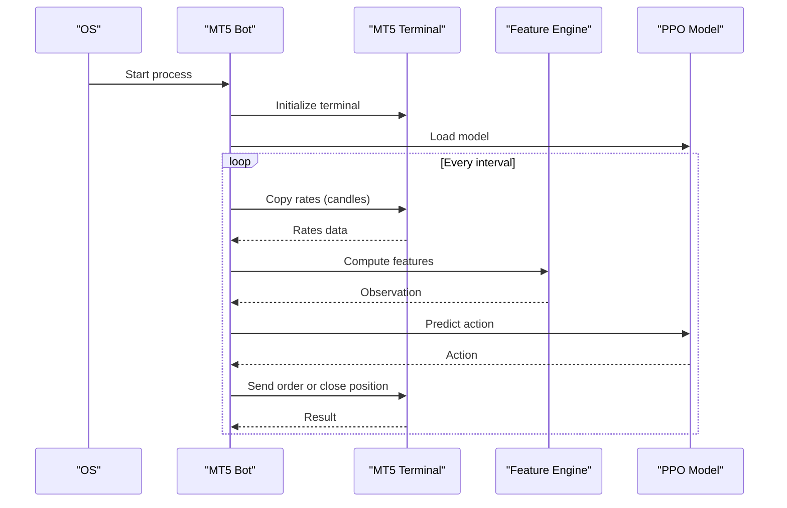
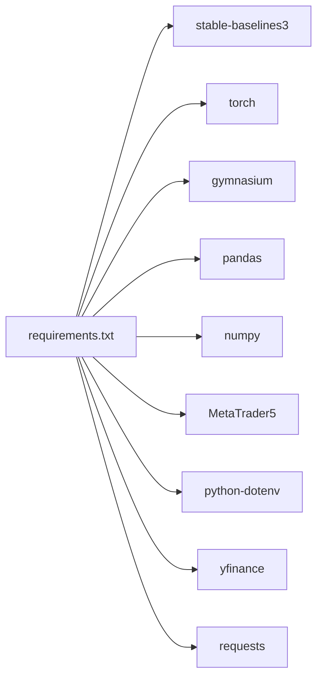

# Deployment and Operations

<cite>
**Referenced Files in This Document**
- [README.md](file://README.md)
- [DEPLOYMENT_GUIDE.md](file://DEPLOYMENT_GUIDE.md)
- [FREE_DEPLOYMENT.md](file://FREE_DEPLOYMENT.md)
- [SECURITY.md](file://SECURITY.md)
- [requirements.txt](file://requirements.txt)
- [live_trade_metaapi.py](file://live/live_trade_metaapi.py)
- [live_trade_mt5.py](file://live/live_trade_mt5.py)
</cite>

## Table of Contents
1. Introduction
2. Project Structure
3. Core Components
4. Architecture Overview
5. Detailed Component Analysis
6. Dependency Analysis
7. Performance Considerations
8. Troubleshooting Guide
9. Conclusion
10. Appendices

## Introduction
This document provides production deployment and operations guidance for the autonomous trading system focused on XAUUSD. It covers cloud deployment options (including containerization and orchestration), free deployment strategies, security practices, monitoring and observability, maintenance procedures, scalability, disaster recovery, and rollback mechanisms. The goal is to enable safe, reliable, and maintainable operation of the trading bot in production environments.

## Project Structure
The repository includes training scripts, feature engineering, model components, evaluation tools, live trading entry points, and operational documentation. Key runtime entry points are the live trading scripts that connect to MetaTrader 5 or MetaAPI, load a trained PPO model, compute features, and execute trades based on model decisions. Operational guidance is provided via dedicated guides for general deployment, free-tier hosting, and security best practices.

**Diagram sources**
- [live_trade_mt5.py:1-174](file://live/live_trade_mt5.py#L1-L174)
- [live_trade_metaapi.py:1-231](file://live/live_trade_metaapi.py#L1-L231)
- [README.md:418-471](file://README.md#L418-L471)

**Section sources**
- [README.md:418-471](file://README.md#L418-L471)

## Core Components
- Live trading engines:
  - MT5-based engine for local execution with direct broker integration.
  - MetaAPI-based engine for cloud-based execution with auto-reconnect and deployment handling.
- Feature computation pipeline used by both engines to prepare observations for the model.
- Trained model loading and inference using Stable-Baselines3 PPO.
- Operational guides covering VPS/cloud deployment, free-tier hosting, and security.

Key responsibilities:
- Data acquisition from market feeds (MT5 or MetaAPI).
- Feature normalization and windowing for model input.
- Deterministic policy inference and trade decision logic.
- Order placement and position management with retries and error handling.
- Environment variable-driven configuration for credentials and runtime settings.

**Section sources**
- [live_trade_mt5.py:1-174](file://live/live_trade_mt5.py#L1-L174)
- [live_trade_metaapi.py:1-231](file://live/live_trade_metaapi.py#L1-L231)
- [README.md:219-262](file://README.md#L219-L262)

## Architecture Overview
The production architecture centers around two deployment modes:
- On-premises/VPS running MT5 locally with the bot process managed by systemd or similar.
- Cloud-hosted using MetaAPI where the bot runs as a long-lived service with robust reconnection and deployment checks.

**Diagram sources**
- [live_trade_mt5.py:111-174](file://live/live_trade_mt5.py#L111-L174)
- [live_trade_metaapi.py:135-231](file://live/live_trade_metaapi.py#L135-L231)

## Detailed Component Analysis

### MetaAPI Live Trading Service
- Loads environment variables for credentials and configuration.
- Initializes MetaAPI client, retrieves account, ensures deployment state, and establishes RPC connection.
- Implements retry logic for data fetching and connection tests.
- Runs a periodic loop that computes features, predicts actions, and executes orders with timeouts and reconnection handling.

**Diagram sources**
- [live_trade_metaapi.py:23-39](file://live/live_trade_metaapi.py#L23-L39)
- [live_trade_metaapi.py:40-86](file://live/live_trade_metaapi.py#L40-L86)
- [live_trade_metaapi.py:100-134](file://live/live_trade_metaapi.py#L100-L134)
- [live_trade_metaapi.py:135-231](file://live/live_trade_metaapi.py#L135-L231)

**Section sources**
- [live_trade_metaapi.py:23-39](file://live/live_trade_metaapi.py#L23-L39)
- [live_trade_metaapi.py:40-86](file://live/live_trade_metaapi.py#L40-L86)
- [live_trade_metaapi.py:100-134](file://live/live_trade_metaapi.py#L100-L134)
- [live_trade_metaapi.py:135-231](file://live/live_trade_metaapi.py#L135-L231)

### MT5 Live Trading Service
- Initializes MT5 terminal and loads the trained PPO model.
- Periodically fetches market data, computes features, constructs observations, and predicts actions.
- Executes buy/sell or close operations based on current positions and model decisions.
- Includes basic error handling and shutdown on user interrupt.

**Diagram sources**
- [live_trade_mt5.py:111-174](file://live/live_trade_mt5.py#L111-L174)

**Section sources**
- [live_trade_mt5.py:111-174](file://live/live_trade_mt5.py#L111-L174)

## Dependency Analysis
Runtime dependencies include deep learning and RL libraries, data processing packages, trading platform integrations, and utilities for environment configuration. These are declared in the requirements file and consumed by the live trading scripts and training modules.

**Diagram sources**
- [requirements.txt:1-29](file://requirements.txt#L1-L29)

**Section sources**
- [requirements.txt:1-29](file://requirements.txt#L1-L29)

## Performance Considerations
- Resource usage: The bot performs periodic data fetches, feature computation, and single-model inference. Typical deployments run on low-memory VMs (e.g., 512 MB–1 GB RAM) without issues.
- Latency: Network timeouts and retries are implemented in the MetaAPI engine; ensure adequate network stability and consider reducing polling intervals if latency-sensitive.
- Scaling: Horizontal scaling can be achieved by running multiple independent instances per symbol or strategy, each with isolated credentials and models. Vertical scaling may involve increasing batch sizes during training or optimizing feature computation.
- Optimization opportunities:
  - Cache recent candles and reuse computed features when possible.
  - Use deterministic inference and minimize unnecessary object allocations in hot paths.
  - Tune check intervals and timeouts based on broker limits and market conditions.

[No sources needed since this section provides general guidance]

## Troubleshooting Guide
Common operational issues and resolutions:
- Credentials not set: Ensure environment variables are configured and loaded at runtime.
- Connection failures: Use built-in retries and reconnection logic; verify account deployment status and broker connectivity.
- Insufficient data: Wait until enough historical candles are available to compute features within the required window.
- Logs and monitoring:
  - Systemd services: use journalctl to view logs and status.
  - Local processes: capture stdout/stderr to log files and monitor with tail.
  - Cloud platforms: leverage platform-specific logging dashboards.

Operational commands and references:
- Managing services and viewing logs are described in deployment guides.
- Security policy outlines credential rotation and protection steps.

**Section sources**
- [DEPLOYMENT_GUIDE.md:137-158](file://DEPLOYMENT_GUIDE.md#L137-L158)
- [FREE_DEPLOYMENT.md:186-217](file://FREE_DEPLOYMENT.md#L186-L217)
- [SECURITY.md:70-84](file://SECURITY.md#L70-L84)

## Conclusion
Production deployment of the autonomous trading system should prioritize secure credential management, resilient connections, and clear operational procedures. Choose between MT5 local execution or MetaAPI cloud execution based on your infrastructure preferences. Implement monitoring, alerting, and backup/rollback strategies to ensure reliability and safety in live trading environments.

[No sources needed since this section summarizes without analyzing specific files]

## Appendices

### Cloud Deployment Options
- VPS/cloud servers (AWS Lightsail, DigitalOcean, Google Cloud):
  - Provision a small VM, install Python dependencies, configure environment variables, and run the bot as a systemd service or container.
  - Use platform firewalls and SSH key-based access.
- Containerization with Docker:
  - Package the application and dependencies into an image.
  - Run with environment variables via --env-file or platform secret stores.
  - Orchestrate with Kubernetes for high availability, rolling updates, and autoscaling.
- Free deployment strategies:
  - Follow the free-tier guide to deploy on Google Cloud e2-micro with systemd-managed service.
  - Alternative platforms (Render, Railway) can host long-running processes with environment variables and managed logs.

**Section sources**
- [DEPLOYMENT_GUIDE.md:3-192](file://DEPLOYMENT_GUIDE.md#L3-L192)
- [FREE_DEPLOYMENT.md:1-360](file://FREE_DEPLOYMENT.md#L1-L360)

### Monitoring and Observability
- Metrics to track:
  - Process health (uptime, restarts).
  - Market data fetch success rate and latency.
  - Model inference time and prediction distribution.
  - Order execution success rate, slippage, and fill times.
  - Risk metrics (daily PnL, drawdown, position counts).
- Logging:
  - Centralize logs using journald or cloud logging services.
  - Include timestamps, correlation IDs, and structured fields for analysis.
- Alerting:
  - Set alerts for repeated connection failures, order errors, and risk breaches.
  - Integrate with notification channels (email, Slack, PagerDuty).

[No sources needed since this section provides general guidance]

### Security Considerations
- API key management:
  - Store secrets in environment variables or platform secret managers.
  - Never commit secrets to version control; use .env.example as a template.
  - Rotate compromised keys immediately and update configurations.
- Secure communication:
  - Use HTTPS/TLS for all external APIs.
  - Restrict server access via SSH keys and firewall rules.
- Access control:
  - Limit permissions to only necessary services and accounts.
  - Use separate keys for testing vs production.
  - Enable multi-factor authentication on broker/platform accounts.

**Section sources**
- [SECURITY.md:7-84](file://SECURITY.md#L7-L84)
- [SECURITY.md:115-132](file://SECURITY.md#L115-L132)

### Maintenance Procedures
- Model retraining:
  - Schedule periodic retraining using updated market data and economic events.
  - Validate new models with backtesting and crisis validation before deployment.
- Data pipeline updates:
  - Refresh macro data and economic calendars regularly.
  - Verify data integrity and completeness before training/inference.
- System health checks:
  - Monitor disk space, memory, CPU, and network connectivity.
  - Automate health checks and self-healing via service managers or orchestrators.

**Section sources**
- [README.md:296-360](file://README.md#L296-L360)
- [README.md:587-610](file://README.md#L587-L610)

### Scalability Strategies
- Horizontal scaling:
  - Run multiple instances per symbol/strategy with isolated credentials and models.
  - Distribute workloads across nodes using orchestrators.
- Vertical scaling:
  - Increase instance resources for heavier feature computations or larger models.
- Resource optimization:
  - Tune polling intervals and timeouts.
  - Optimize feature windows and batch sizes.
  - Leverage caching and efficient data structures.

[No sources needed since this section provides general guidance]

### Disaster Recovery and Rollback
- Backup strategies:
  - Regularly back up models, configuration, and critical data.
  - Version control models and artifacts; store backups offsite.
- Rollback mechanisms:
  - Maintain previous stable versions of models and code.
  - Use blue/green or rolling updates in orchestrated environments.
  - Validate rollbacks with smoke tests and minimal-risk execution modes.
- Incident response:
  - Define runbooks for common failures (network outages, broker downtime, model drift).
  - Automate kill switches to halt trading under extreme conditions.

[No sources needed since this section provides general guidance]