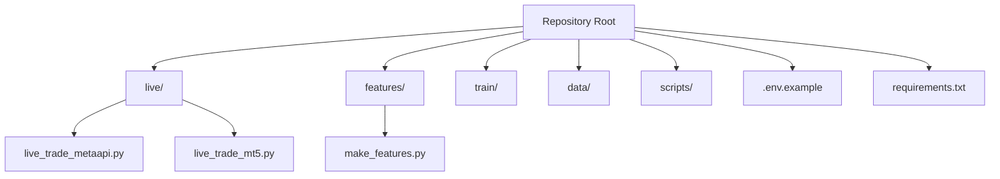
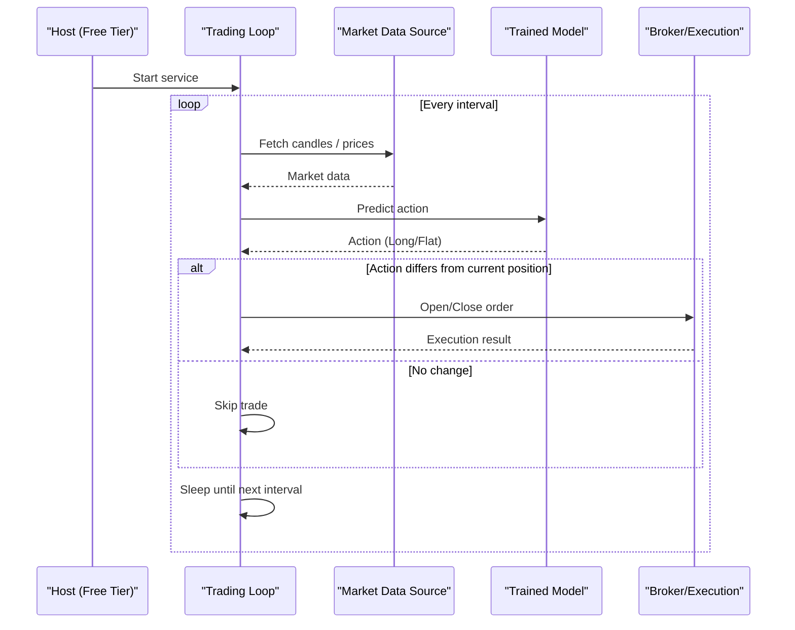
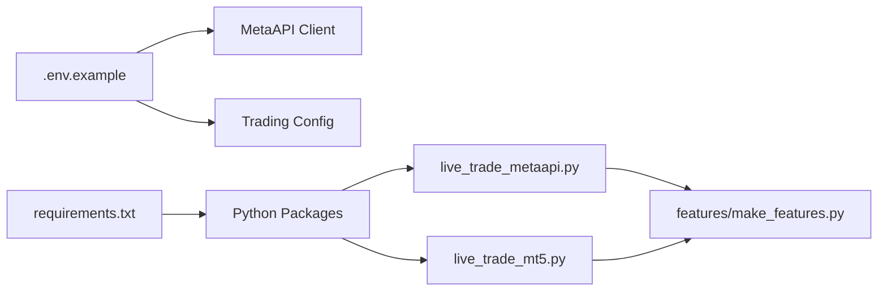

# Free Hosting Solutions

<cite>
**Referenced Files in This Document**
- [README.md](file://README.md)
- [DEPLOYMENT_GUIDE.md](file://DEPLOYMENT_GUIDE.md)
- [FREE_DEPLOYMENT.md](file://FREE_DEPLOYMENT.md)
- [.env.example](file://.env.example)
- [requirements.txt](file://requirements.txt)
- [live_trade_metaapi.py](file://live/live_trade_metaapi.py)
- [live_trade_mt5.py](file://live/live_trade_mt5.py)
</cite>

## Table of Contents
1. Introduction
2. Project Structure
3. Core Components
4. Architecture Overview
5. Detailed Component Analysis
6. Dependency Analysis
7. Performance Considerations
8. Troubleshooting Guide
9. Conclusion
10. Appendices

## Introduction
This document provides a practical guide to deploying the trading bot on free hosting platforms and services, with a focus on:
- GitHub Actions for automated CI/CD (workflow configuration, scheduled execution, artifact management)
- Render.com deployment (environment setup, process management, scaling considerations)
- Railway.app deployment (database integration, environment variables, monitoring)
- Limitations and workarounds for free tiers (sleep modes, resource limits, storage constraints)
- Migration strategies from free to paid hosting as requirements grow
- Reliability and backup strategies for production deployments on free platforms

The guidance is grounded in the repository’s live trading entry points, environment configuration, and existing deployment documentation.

## Project Structure
The project includes two live trading entry points:
- MetaAPI-based cloud trading (no local MT5 required)
- Local MetaTrader 5 integration (requires MT5 terminal)

Environment variables are managed via a .env file loaded at runtime. Dependencies are declared in requirements.txt. The repository also contains deployment guides for VPS-style hosting and a free-tier VM approach.

**Diagram sources**
- [live_trade_metaapi.py:1-231](file://live/live_trade_metaapi.py#L1-L231)
- [live_trade_mt5.py:1-174](file://live/live_trade_mt5.py#L1-L174)
- [.env.example:1-21](file://.env.example#L1-L21)
- [requirements.txt:1-29](file://requirements.txt#L1-L29)

**Section sources**
- [README.md:418-470](file://README.md#L418-L470)
- [requirements.txt:1-29](file://requirements.txt#L1-L29)
- [.env.example:1-21](file://.env.example#L1-L21)

## Core Components
- Live trading entry points:
  - MetaAPI-based loop that fetches market data, computes features, loads a trained model, and executes orders with retries and reconnection logic.
  - MT5-based loop that uses the local MT5 terminal for data and order execution.
- Environment configuration:
  - API keys and trading parameters are loaded from environment variables using python-dotenv.
- Dependencies:
  - Python packages for RL, data processing, and trading integrations are listed in requirements.txt.

Key responsibilities:
- Data acquisition and feature computation
- Model inference and decision making
- Order execution and position management
- Robust error handling and reconnection

**Section sources**
- [live_trade_metaapi.py:23-39](file://live/live_trade_metaapi.py#L23-L39)
- [live_trade_metaapi.py:40-86](file://live/live_trade_metaapi.py#L40-L86)
- [live_trade_metaapi.py:100-134](file://live/live_trade_metaapi.py#L100-L134)
- [live_trade_metaapi.py:135-231](file://live/live_trade_metaapi.py#L135-L231)
- [live_trade_mt5.py:21-30](file://live/live_trade_mt5.py#L21-L30)
- [live_trade_mt5.py:32-96](file://live/live_trade_mt5.py#L32-L96)
- [live_trade_mt5.py:111-174](file://live/live_trade_mt5.py#L111-L174)
- [.env.example:1-21](file://.env.example#L1-L21)
- [requirements.txt:1-29](file://requirements.txt#L1-L29)

## Architecture Overview
The system runs continuously on a host (VM or container), periodically:
- Fetches market data
- Computes features
- Loads a pre-trained model
- Predicts actions
- Executes trades via MetaAPI or MT5

**Diagram sources**
- [live_trade_metaapi.py:100-134](file://live/live_trade_metaapi.py#L100-L134)
- [live_trade_metaapi.py:135-231](file://live/live_trade_metaapi.py#L135-L231)
- [live_trade_mt5.py:111-174](file://live/live_trade_mt5.py#L111-L174)

## Detailed Component Analysis

### GitHub Actions CI/CD for Automated Deployment
Recommended workflow goals:
- Validate code and dependencies on push
- Build artifacts (e.g., zip model and assets)
- Deploy to free hosting (Render/Railway) via their CLI or APIs
- Schedule nightly updates or periodic checks

Suggested steps:
- Set up secrets for platform tokens and API keys
- Use a matrix strategy if testing multiple environments
- Cache pip dependencies to speed up builds
- Upload artifacts for deployment jobs
- Trigger deployments on tags or branches

Notes:
- Ensure your deployment targets support long-running processes or scheduled jobs
- For stateful components (e.g., databases), use external managed services even on free tiers

[No sources needed since this section provides general guidance]

### Render.com Deployment
Considerations:
- Use a Web Service or Worker depending on whether you need HTTP endpoints
- Configure environment variables from .env.example
- Manage process lifecycle (auto-restart on crash)
- Scale horizontally by adding instances if needed; note free tier limitations

Steps:
- Connect your repository
- Define build command (install dependencies)
- Define start command (run the appropriate live script)
- Add environment variables (tokens, account IDs, risk settings)
- Monitor logs and set alerts

Limitations and workarounds:
- Free tier may have sleep/idle behavior; prefer Workers for background tasks
- Persistent storage is limited; avoid storing large datasets locally
- Use external storage for models and logs when possible

[No sources needed since this section provides general guidance]

### Railway.app Deployment
Considerations:
- Database integration: provision a managed database (free tier) and connect via connection string
- Environment variables: map all secrets and config values
- Monitoring: use built-in logs and metrics; integrate alerting

Steps:
- Create services for app and database
- Link environment variables and secrets
- Configure build and run commands
- Enable automatic restarts and health checks

Limitations and workarounds:
- Free tier resources are constrained; optimize memory usage
- Avoid heavy computations during request cycles; offload to background jobs
- Use external object storage for large files

[No sources needed since this section provides general guidance]

### Free Tier Limitations and Workarounds
Common constraints:
- Sleep modes and cold starts: schedule jobs or use keep-alive strategies where allowed
- Resource limits: minimize memory footprint, avoid large in-memory structures
- Storage constraints: store models and logs externally; prune temporary files

Workarounds:
- Use lightweight containers and minimal base images
- Stream data instead of caching large datasets
- Implement retry and backoff for network calls
- Use external managed services for databases and storage

[No sources needed since this section provides general guidance]

### Migration Strategies from Free to Paid Hosting
When to migrate:
- Increased latency sensitivity
- Need for persistent high availability
- Larger compute/storage needs
- Advanced observability and compliance requirements

Migration path:
- Move to a managed PaaS or VPS with guaranteed uptime
- Introduce load balancing and auto-scaling
- Centralize logging and metrics with dedicated tools
- Back up databases and artifacts regularly
- Update CI/CD to deploy to new infrastructure seamlessly

[No sources needed since this section provides general guidance]

### Reliability and Backup Strategies
Best practices:
- Health checks and auto-restart policies
- Structured logging and centralized log aggregation
- Regular backups of models, configs, and any persisted state
- Alerting on failures and degraded performance
- Run paper trading mode in parallel to validate changes before live trading

[No sources needed since this section provides general guidance]

## Dependency Analysis
Runtime dependencies include deep learning, data processing, and trading integrations. The live scripts depend on environment variables for credentials and configuration.

**Diagram sources**
- [requirements.txt:1-29](file://requirements.txt#L1-L29)
- [.env.example:1-21](file://.env.example#L1-L21)
- [live_trade_metaapi.py:1-231](file://live/live_trade_metaapi.py#L1-L231)
- [live_trade_mt5.py:1-174](file://live/live_trade_mt5.py#L1-L174)

**Section sources**
- [requirements.txt:1-29](file://requirements.txt#L1-L29)
- [.env.example:1-21](file://.env.example#L1-L21)

## Performance Considerations
- Keep intervals between steps reasonable to balance responsiveness and resource usage
- Preload models once and reuse across steps
- Minimize I/O by batching requests and avoiding unnecessary downloads
- Use efficient data structures and avoid loading entire histories into memory when not needed
- Monitor CPU and memory usage; adjust batch sizes and window lengths accordingly

[No sources needed since this section provides general guidance]

## Troubleshooting Guide
Common issues and resolutions:
- Missing environment variables: ensure .env is configured and loaded
- Network timeouts: implement retries and backoff; check firewall rules
- Connection drops: use reconnection logic and verify broker status
- Disk space: clean up temporary files and rotate logs
- Model loading errors: verify model path and integrity

Operational tips:
- Use structured logging to capture errors and context
- Set up health checks and alerts for critical failures
- Maintain a rollback plan for model and code updates

**Section sources**
- [live_trade_metaapi.py:40-86](file://live/live_trade_metaapi.py#L40-L86)
- [live_trade_metaapi.py:182-197](file://live/live_trade_metaapi.py#L182-L197)
- [live_trade_metaapi.py:202-231](file://live/live_trade_metaapi.py#L202-L231)
- [live_trade_mt5.py:124-174](file://live/live_trade_mt5.py#L124-L174)

## Conclusion
Deploying the trading bot on free hosting platforms is feasible with careful planning around environment configuration, process management, and resource constraints. Use GitHub Actions for CI/CD, choose Render or Railway based on your needs, and prepare for migration to paid hosting as reliability and scale requirements increase. Implement robust error handling, monitoring, and backup strategies to ensure production readiness.

[No sources needed since this section summarizes without analyzing specific files]

## Appendices

### Appendix A: Environment Variables Reference
- METAAPI_TOKEN: Authentication token for MetaAPI
- METAAPI_ACCOUNT_ID: Trading account identifier
- SYMBOL: Trading symbol (e.g., XAUUSD)
- TIMEFRAME: Timeframe for analysis
- VOLUME: Default trade volume
- MODEL_PATH: Path to the trained model file
- Risk parameters: MAX_RISK_PER_TRADE, MAX_DAILY_LOSS, MAX_POSITIONS
- Optional API keys: NEWS_API_KEY, ALPHA_VANTAGE_API_KEY

**Section sources**
- [.env.example:1-21](file://.env.example#L1-L21)

### Appendix B: Existing Deployment Options
- AWS Lightsail, DigitalOcean, Google Cloud free tier, and local execution are documented in the repository’s deployment guide.
- Free VM deployment details are provided for Google Cloud with systemd service management and monitoring.

**Section sources**
- [DEPLOYMENT_GUIDE.md:1-192](file://DEPLOYMENT_GUIDE.md#L1-L192)
- [FREE_DEPLOYMENT.md:1-360](file://FREE_DEPLOYMENT.md#L1-L360)