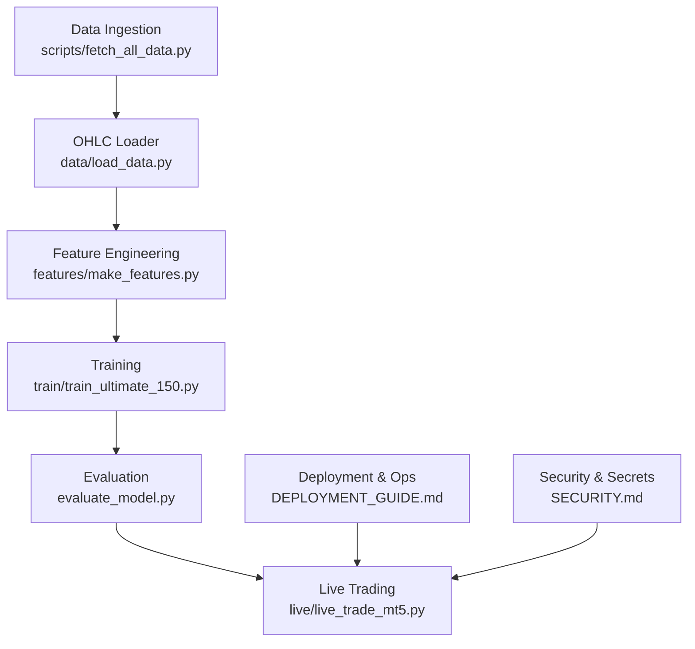
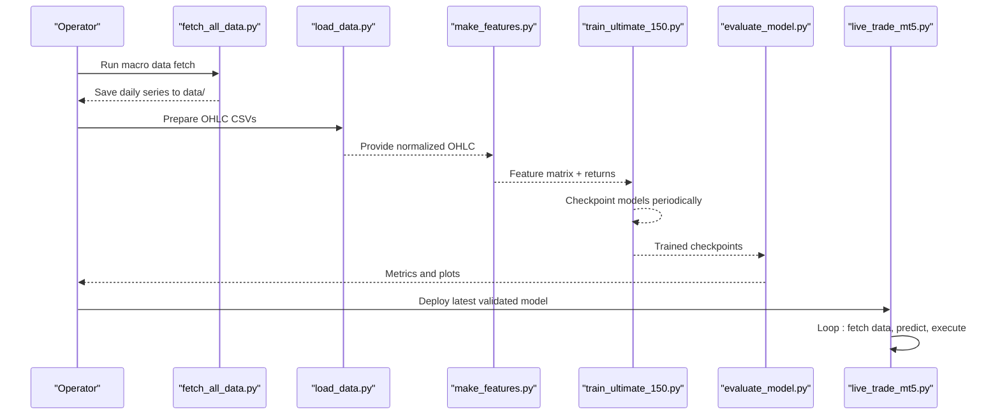
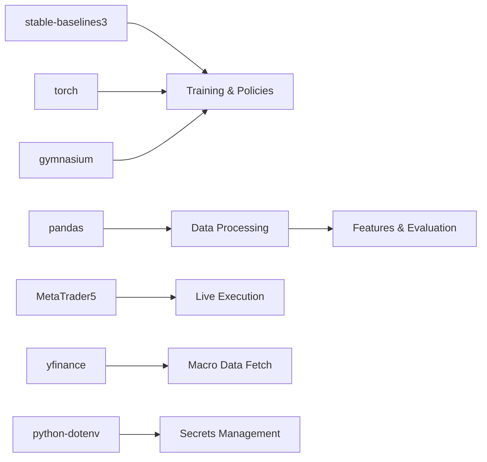
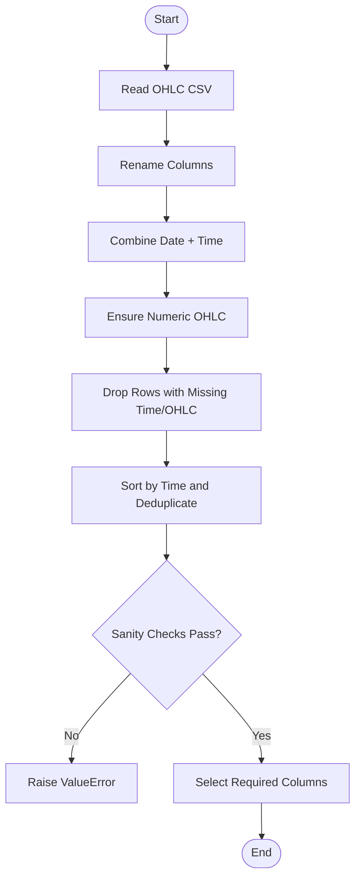

# Maintenance Procedures

<cite>
**Referenced Files in This Document**
- [README.md](file://README.md)
- [requirements.txt](file://requirements.txt)
- [DEPLOYMENT_GUIDE.md](file://DEPLOYMENT_GUIDE.md)
- [SECURITY.md](file://SECURITY.md)
- [train/train_ultimate_150.py](file://train/train_ultimate_150.py)
- [scripts/fetch_all_data.py](file://scripts/fetch_all_data.py)
- [data/load_data.py](file://data/load_data.py)
- [features/make_features.py](file://features/make_features.py)
- [evaluate_model.py](file://evaluate_model.py)
- [live/live_trade_mt5.py](file://live/live_trade_mt5.py)
</cite>

## Table of Contents
1. Introduction
2. Project Structure
3. Core Components
4. Architecture Overview
5. Detailed Component Analysis
6. Dependency Analysis
7. Performance Considerations
8. Troubleshooting Guide
9. Conclusion
10. Appendices

## Introduction
This document provides comprehensive maintenance procedures for ongoing operation of the autonomous trading system focused on XAUUSD. It covers model retraining schedules, data pipeline maintenance, system health checks, backup and disaster recovery, update procedures, and operational runbooks for common tasks and emergencies. The guidance is grounded in the repository’s training scripts, data ingestion utilities, feature engineering modules, evaluation tools, and live trading integration.

## Project Structure
The system is organized into distinct areas:
- Training: scripts to train models (e.g., DreamerV3 with 150+ features).
- Data: scripts to fetch macro data and loaders for OHLC CSVs.
- Features: modules to compute technical and macro features.
- Evaluation: scripts to validate model performance and generate metrics.
- Live: execution interfaces to trade via MetaTrader 5 or cloud brokers.
- Deployment and Security: guides for running services securely and reliably.



**Diagram sources**
- [scripts/fetch_all_data.py:131-214](file://scripts/fetch_all_data.py#L131-L214)
- [data/load_data.py:5-73](file://data/load_data.py#L5-L73)
- [features/make_features.py:18-78](file://features/make_features.py#L18-L78)
- [train/train_ultimate_150.py:154-327](file://train/train_ultimate_150.py#L154-L327)
- [evaluate_model.py:218-301](file://evaluate_model.py#L218-L301)
- [live/live_trade_mt5.py:111-173](file://live/live_trade_mt5.py#L111-L173)
- [DEPLOYMENT_GUIDE.md:137-158](file://DEPLOYMENT_GUIDE.md#L137-L158)
- [SECURITY.md:47-84](file://SECURITY.md#L47-L84)

**Section sources**
- [README.md:418-470](file://README.md#L418-L470)
- [DEPLOYMENT_GUIDE.md:137-158](file://DEPLOYMENT_GUIDE.md#L137-L158)

## Core Components
- Data ingestion: automated fetching of macro series and alignment helpers.
- OHLC loader: robust parsing, validation, and normalization of MT5 exports.
- Feature engine: computes returns, volatility, momentum, moving averages, RSI, MACD, and optional macro correlations.
- Training: DreamerV3 agent with replay buffer, periodic checkpointing, and device auto-detection.
- Evaluation: backtest-like evaluation producing equity curves, drawdown, Sharpe ratio, win rate, and position stats.
- Live trading: loop that fetches market data, computes features, predicts actions, and executes orders via MT5.

Key responsibilities and maintenance touchpoints are detailed in subsequent sections.

**Section sources**
- [scripts/fetch_all_data.py:27-128](file://scripts/fetch_all_data.py#L27-L128)
- [data/load_data.py:5-73](file://data/load_data.py#L5-L73)
- [features/make_features.py:18-78](file://features/make_features.py#L18-L78)
- [train/train_ultimate_150.py:154-327](file://train/train_ultimate_150.py#L154-L327)
- [evaluate_model.py:87-161](file://evaluate_model.py#L87-L161)
- [live/live_trade_mt5.py:21-173](file://live/live_trade_mt5.py#L21-L173)

## Architecture Overview
The end-to-end flow spans data collection, feature computation, model training, evaluation, and live deployment. Operational safeguards include environment variable-based secrets management and service lifecycle control via systemd or process managers.



**Diagram sources**
- [scripts/fetch_all_data.py:131-214](file://scripts/fetch_all_data.py#L131-L214)
- [data/load_data.py:5-73](file://data/load_data.py#L5-L73)
- [features/make_features.py:18-78](file://features/make_features.py#L18-L78)
- [train/train_ultimate_150.py:258-327](file://train/train_ultimate_150.py#L258-L327)
- [evaluate_model.py:218-301](file://evaluate_model.py#L218-L301)
- [live/live_trade_mt5.py:111-173](file://live/live_trade_mt5.py#L111-L173)

## Detailed Component Analysis

### Model Retraining Schedule and Validation
- Frequency determination:
  - Retrain when new macro data significantly shifts distributions or after major regime changes (e.g., policy shifts, crises).
  - Use evaluation windows to detect performance decay; trigger retraining if key metrics degrade beyond thresholds.
- Data pipeline updates:
  - Refresh macro series using the fetch script before retraining to ensure up-to-date inputs.
  - Validate OHLC integrity and recalculate features to match any schema changes.
- Model validation procedures:
  - Evaluate on validation and test periods to confirm stability.
  - Track total return, annualized return, Sharpe ratio, max drawdown, win rate, and long percentage.
  - Compare against baselines and crisis scenarios to ensure robustness.

Operational notes:
- Training saves periodic checkpoints and a final model artifact for reproducibility.
- Device selection supports CPU, MPS, and CUDA for flexible resource usage.

**Section sources**
- [train/train_ultimate_150.py:38-46](file://train/train_ultimate_150.py#L38-L46)
- [train/train_ultimate_150.py:205-235](file://train/train_ultimate_150.py#L205-L235)
- [train/train_ultimate_150.py:258-327](file://train/train_ultimate_150.py#L258-L327)
- [evaluate_model.py:87-161](file://evaluate_model.py#L87-L161)
- [evaluate_model.py:218-301](file://evaluate_model.py#L218-L301)

### Data Pipeline Maintenance
- Market data collection:
  - Macro series are fetched from free sources and saved as CSVs; ensure date ranges cover desired training horizons.
  - Align daily series to higher-frequency references when needed.
- Feature engineering updates:
  - Compute returns, volatility, momentum, moving average differences, RSI, MACD, and optional macro correlations.
  - Normalize features and handle NaN/inf values to maintain stable training.
- Data quality checks:
  - OHLC loader enforces required columns, numeric types, time sorting, deduplication, and sanity checks (high >= max(open, close, low), low <= min(open, close, high)).
  - Drop invalid rows and keep only necessary columns to reduce noise.

Maintenance tasks:
- Periodically rerun macro fetch to extend history.
- Revalidate OHLC files after broker or export format changes.
- Monitor feature distributions for drift and adjust normalization if necessary.

**Section sources**
- [scripts/fetch_all_data.py:27-128](file://scripts/fetch_all_data.py#L27-L128)
- [scripts/fetch_all_data.py:131-214](file://scripts/fetch_all_data.py#L131-L214)
- [data/load_data.py:5-73](file://data/load_data.py#L5-L73)
- [features/make_features.py:18-78](file://features/make_features.py#L18-L78)

### System Health Checks
- Automated diagnostics:
  - Verify MT5 connectivity and terminal initialization before starting live trading.
  - Ensure model artifacts exist and can be loaded by evaluation and live scripts.
- Performance monitoring:
  - During live trading, log timestamps, positions, and actions to detect stalls or unexpected behavior.
  - Review evaluation outputs (equity curve, drawdown, Sharpe) post-retraining to confirm improvements.
- Capacity planning:
  - Choose appropriate device (CPU/MPS/CUDA) based on available hardware for training and evaluation.
  - For live trading, ensure sufficient memory and disk space for feature windows and logs.

Operational tips:
- Use systemd or process managers to monitor uptime and restart on failure.
- Keep logs accessible via journalctl or log files for quick triage.

**Section sources**
- [live/live_trade_mt5.py:111-173](file://live/live_trade_mt5.py#L111-L173)
- [DEPLOYMENT_GUIDE.md:137-158](file://DEPLOYMENT_GUIDE.md#L137-L158)
- [train/train_ultimate_150.py:205-216](file://train/train_ultimate_150.py#L205-L216)

### Backup and Disaster Recovery
- Data backups:
  - Back up macro CSVs and OHLC exports regularly to prevent data loss.
  - Version control datasets alongside code changes to enable reproducible runs.
- Model versioning:
  - Treat each trained checkpoint as a versioned artifact; retain best-performing and recent models.
  - Record training parameters and device settings used to produce each model.
- Rollback strategies:
  - If a new model underperforms, revert to the previous validated checkpoint.
  - Maintain a known-good configuration for live trading and restore it quickly if issues arise.

Best practices:
- Store secrets separately from code and data; rotate credentials promptly if compromised.
- Automate backups and verify restore procedures periodically.

**Section sources**
- [train/train_ultimate_150.py:305-327](file://train/train_ultimate_150.py#L305-L327)
- [SECURITY.md:70-84](file://SECURITY.md#L70-L84)
- [SECURITY.md:100-111](file://SECURITY.md#L100-L111)

### Update Procedures
- Dependencies:
  - Update Python packages according to requirements.txt; pin versions to avoid breaking changes.
  - Test upgrades in a non-production environment before applying to live systems.
- Security patches:
  - Regularly review and apply security updates for OS, Python runtime, and libraries.
  - Rotate API keys and tokens per security policy if exposure is suspected.
- Feature enhancements:
  - Introduce new features incrementally; validate impact on model performance and live behavior.
  - Maintain backward compatibility where possible to simplify rollbacks.

**Section sources**
- [requirements.txt:1-29](file://requirements.txt#L1-L29)
- [SECURITY.md:122-132](file://SECURITY.md#L122-L132)
- [SECURITY.md:70-84](file://SECURITY.md#L70-L84)

### Operational Runbooks

#### Routine Tasks
- Refresh macro data:
  - Run the macro fetch script to update external series.
  - Confirm output files exist and contain expected date ranges.
- Recompute features:
  - Validate OHLC loader handles current file formats.
  - Inspect feature generation for completeness and correctness.
- Retrain and evaluate:
  - Launch training with appropriate device and steps; monitor checkpoints.
  - Evaluate on validation/test periods; compare metrics to baseline.

**Section sources**
- [scripts/fetch_all_data.py:131-214](file://scripts/fetch_all_data.py#L131-L214)
- [data/load_data.py:5-73](file://data/load_data.py#L5-L73)
- [train/train_ultimate_150.py:258-327](file://train/train_ultimate_150.py#L258-L327)
- [evaluate_model.py:218-301](file://evaluate_model.py#L218-L301)

#### Emergency Procedures
- Live trading stall or error:
  - Check MT5 connection status and terminal initialization.
  - Inspect logs for errors; restart the service if necessary.
- Model degradation:
  - Roll back to the last validated checkpoint.
  - Investigate data drift and consider retraining with updated data.
- Credential compromise:
  - Revoke exposed keys immediately and generate new ones.
  - Update environment variables and restart services.

**Section sources**
- [live/live_trade_mt5.py:111-173](file://live/live_trade_mt5.py#L111-L173)
- [SECURITY.md:70-84](file://SECURITY.md#L70-L84)
- [SECURITY.md:100-111](file://SECURITY.md#L100-L111)

## Dependency Analysis
The system depends on deep learning, RL, data processing, and trading platform libraries. Maintaining compatible versions is critical for stability.



**Diagram sources**
- [requirements.txt:1-29](file://requirements.txt#L1-L29)
- [scripts/fetch_all_data.py:16-20](file://scripts/fetch_all_data.py#L16-L20)
- [live/live_trade_mt5.py:1-7](file://live/live_trade_mt5.py#L1-L7)

**Section sources**
- [requirements.txt:1-29](file://requirements.txt#L1-L29)

## Performance Considerations
- Training efficiency:
  - Use GPU acceleration when available; otherwise leverage MPS or CPU with adjusted batch sizes.
  - Monitor replay buffer size and training frequency to balance speed and stability.
- Feature computation:
  - Normalize features consistently; handle missing values to avoid instability.
  - Limit unnecessary computations in live loops to reduce latency.
- Live execution:
  - Minimize polling frequency to reasonable intervals aligned with timeframe.
  - Ensure order execution paths are resilient to network failures and retries.

[No sources needed since this section provides general guidance]

## Troubleshooting Guide
Common issues and resolutions:
- Missing OHLC columns or invalid OHLC:
  - Ensure exported files conform to expected schemas; loader will raise clear errors for missing or inconsistent data.
- Macro data fetch failures:
  - Verify internet connectivity and source availability; check logs for specific errors and retry.
- Model loading errors:
  - Confirm checkpoint paths and model signatures; re-evaluate to regenerate artifacts if needed.
- MT5 connection problems:
  - Initialize MT5 properly; check terminal status and permissions; inspect last error codes.

**Section sources**
- [data/load_data.py:5-73](file://data/load_data.py#L5-L73)
- [scripts/fetch_all_data.py:27-64](file://scripts/fetch_all_data.py#L27-L64)
- [evaluate_model.py:261-279](file://evaluate_model.py#L261-L279)
- [live/live_trade_mt5.py:111-120](file://live/live_trade_mt5.py#L111-L120)

## Conclusion
Maintaining this autonomous trading system requires disciplined routines for data refresh, feature validation, model retraining, and evaluation. Robust health checks, secure secret handling, and reliable deployment practices ensure consistent operation. By following the outlined procedures and leveraging the provided scripts and guides, operators can sustain performance and respond effectively to issues.

[No sources needed since this section summarizes without analyzing specific files]

## Appendices

### Appendix A: Data Quality Flow


**Diagram sources**
- [data/load_data.py:5-73](file://data/load_data.py#L5-L73)

### Appendix B: Live Trading Loop
```mermaid
sequenceDiagram
participant Loop as "Live Loop"
participant MT5 as "MT5 Client"
participant Feat as "Feature Engine"
participant Model as "Model"
participant Exec as "Order Executor"
Loop->>MT5 : Fetch recent candles
MT5-->>Loop : DataFrame
Loop->>Feat : Compute features
Feat-->>Loop : Observation vector
Loop->>Model : Predict action
Model-->>Loop : Action
Loop->>Exec : Execute trade if needed
Exec-->>Loop : Result
Loop->>Loop : Sleep until next tick
```

**Diagram sources**
- [live/live_trade_mt5.py:21-173](file://live/live_trade_mt5.py#L21-L173)
- [features/make_features.py:18-78](file://features/make_features.py#L18-L78)