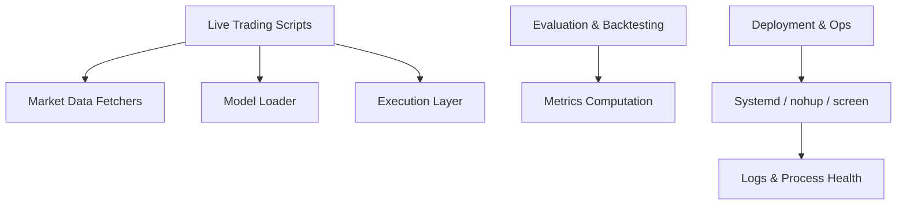
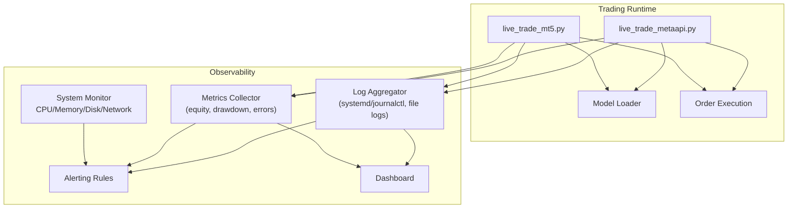
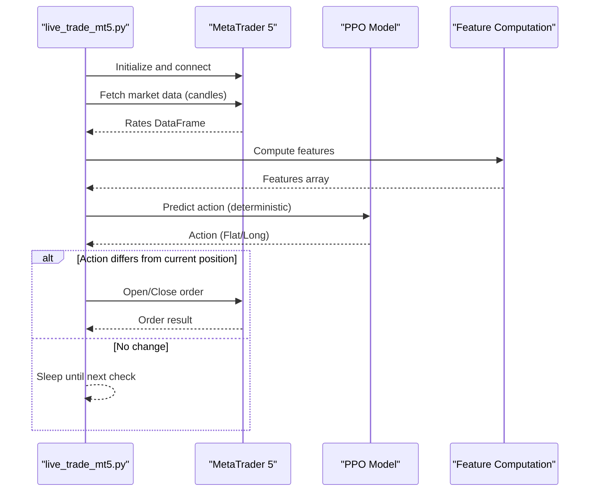
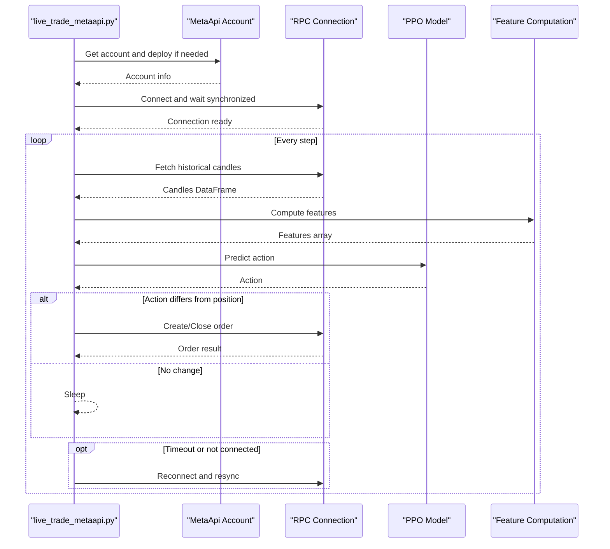
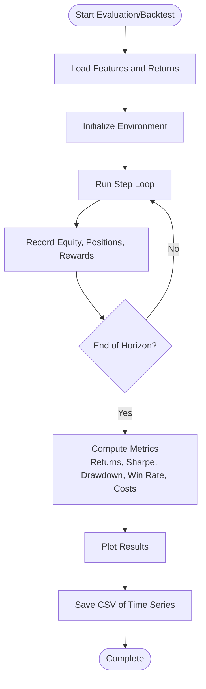
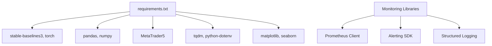

# Monitoring and Alerting

<cite>
**Referenced Files in This Document**
- [README.md](file://README.md)
- [DEPLOYMENT_GUIDE.md](file://DEPLOYMENT_GUIDE.md)
- [live_trade_mt5.py](file://live/live_trade_mt5.py)
- [live_trade_metaapi.py](file://live/live_trade_metaapi.py)
- [evaluate_model.py](file://evaluate_model.py)
- [backtest_engine.py](file://backtest/backtest_engine.py)
- [requirements.txt](file://requirements.txt)
</cite>

## Table of Contents
1. Introduction
2. Project Structure
3. Core Components
4. Architecture Overview
5. Detailed Component Analysis
6. Dependency Analysis
7. Performance Considerations
8. Troubleshooting Guide
9. Conclusion
10. Appendices

## Introduction
This document provides production-grade monitoring and alerting guidance for the autonomous trading system. It covers system health checks (CPU, memory, disk, network), centralized logging strategies with rotation and analysis, application-level metrics (trading performance, model prediction behavior, error rates), alerting rules for critical events and anomalies, dashboard setup for real-time visualization and historical analysis, and troubleshooting procedures using logs and metrics.

The guidance is tailored to the existing codebase’s live trading scripts, evaluation and backtesting tools, and deployment patterns.

## Project Structure
The repository includes:
- Live trading entry points for MetaTrader 5 and MetaAPI
- Evaluation and backtesting utilities that compute performance metrics
- Deployment instructions and basic log viewing via systemd or nohup/screen
- Dependencies for ML, data processing, and optional visualization libraries

**Section sources**
- [README.md:418-470](file://README.md#L418-L470)
- [DEPLOYMENT_GUIDE.md:137-158](file://DEPLOYMENT_GUIDE.md#L137-L158)

## Core Components
- Live trading loops:
  - MT5-based loop with periodic data fetch, feature computation, model inference, and order execution
  - Async MetaAPI-based loop with retries, timeouts, connection stabilization, and reconnection logic
- Evaluation and backtesting:
  - Metrics such as total return, annualized return, Sharpe ratio, max drawdown, win rate, profit factor, and cost accounting
- Deployment and ops:
  - Systemd service management and log access via journalctl
  - Local run modes with nohup/screen and log tailing

These components form the foundation for monitoring and alerting:
- System health: process status, connectivity, resource usage
- Application metrics: equity curve, drawdown, trade counts, latency, error rates
- Logs: structured outputs from live loops and evaluation/backtesting runs

**Section sources**
- [live_trade_mt5.py:111-173](file://live/live_trade_mt5.py#L111-L173)
- [live_trade_metaapi.py:135-231](file://live/live_trade_metaapi.py#L135-L231)
- [evaluate_model.py:87-161](file://evaluate_model.py#L87-L161)
- [backtest_engine.py:219-391](file://backtest/backtest_engine.py#L219-L391)
- [DEPLOYMENT_GUIDE.md:137-158](file://DEPLOYMENT_GUIDE.md#L137-L158)

## Architecture Overview
The production monitoring architecture integrates system-level observability with application-level metrics and logs.

**Diagram sources**
- [live_trade_mt5.py:111-173](file://live/live_trade_mt5.py#L111-L173)
- [live_trade_metaapi.py:135-231](file://live/live_trade_metaapi.py#L135-L231)
- [DEPLOYMENT_GUIDE.md:137-158](file://DEPLOYMENT_GUIDE.md#L137-L158)

## Detailed Component Analysis

### System Health Monitoring
- CPU, Memory, Disk Usage:
  - Use OS-level tools (e.g., top/htop, free, df) or cloud provider dashboards to track resource consumption of the trading process.
  - For systemd-managed services, monitor process uptime and restarts; correlate spikes with log entries.
- Network Connectivity:
  - Validate broker/platform connectivity by checking successful data fetches and order sends.
  - In the MetaAPI loop, observe timeout handling and reconnection attempts; treat repeated failures as alerts.
- Process Health:
  - Ensure the trading process remains alive; use watchdogs or systemd auto-restart policies.
  - Track exit codes and unexpected terminations.

Recommended thresholds and actions:
- CPU > 90% sustained: investigate feature computation or model inference bottlenecks
- Memory growth without release: check for unbounded buffers or large data frames
- Disk usage > 85%: trigger log rotation and archive old logs
- Network errors > threshold per minute: pause trading and alert

**Section sources**
- [DEPLOYMENT_GUIDE.md:137-158](file://DEPLOYMENT_GUIDE.md#L137-L158)
- [live_trade_metaapi.py:170-220](file://live/live_trade_metaapi.py#L170-L220)

### Centralized Logging Strategy
- Log Sources:
  - Live trading scripts print status updates on data fetch, model inference, position changes, and errors.
  - Evaluation and backtesting scripts log metrics and progress.
- Centralization:
  - On Linux systems managed by systemd, use journalctl to collect logs centrally.
  - For local runs with nohup/screen, aggregate into a single log file and rotate it.
- Rotation Policies:
  - Rotate logs daily or when size exceeds a threshold (e.g., 50 MB).
  - Keep retention for at least 30 days; compress older logs.
- Analysis Techniques:
  - Filter by keywords: “Error”, “Failed”, “timeout”, “not connected”.
  - Correlate timestamps across data fetch, inference, and execution steps.
  - Compute error rates per hour and alert on spikes.

Operational commands and practices:
- View live logs: journalctl -u trading-bot -f
- Tail recent lines: journalctl -u trading-bot -n 100
- For nohup/screen: tail -f trading.log

**Section sources**
- [DEPLOYMENT_GUIDE.md:137-158](file://DEPLOYMENT_GUIDE.md#L137-L158)
- [live_trade_mt5.py:124-173](file://live/live_trade_mt5.py#L124-L173)
- [live_trade_metaapi.py:135-231](file://live/live_trade_metaapi.py#L135-L231)

### Application-Level Monitoring
Key metrics to track:
- Trading Performance:
  - Equity curve, cumulative returns, drawdown, Sharpe ratio, win rate, profit factor
  - Trade frequency, average duration, costs (spread, slippage, commission)
- Model Prediction Behavior:
  - Action distribution over time (flat vs long), confidence if available
  - Observation window completeness and feature availability
- Error Rate Tracking:
  - Data fetch failures, timeouts, order send errors, connection issues
  - Exception counts and categories per time window

Implementation notes:
- The evaluation script computes comprehensive metrics including returns, risk ratios, and drawdown.
- The backtester computes detailed metrics including Sharpe, Sortino, Calmar ratios, win/loss stats, and costs.
- Live scripts emit status prints that can be parsed into metrics (e.g., action changes, order results).

**Section sources**
- [evaluate_model.py:87-161](file://evaluate_model.py#L87-L161)
- [backtest_engine.py:219-391](file://backtest/backtest_engine.py#L219-L391)
- [live_trade_mt5.py:124-173](file://live/live_trade_mt5.py#L124-L173)
- [live_trade_metaapi.py:135-231](file://live/live_trade_metaapi.py#L135-L231)

### Alerting Configuration
Define alert rules for:
- Critical System Events:
  - Process down or frequent restarts
  - Disk usage above threshold
  - Broker/platform connectivity loss beyond retry limits
- Trading Anomalies:
  - Sudden spike in error rate (data fetch or order execution)
  - Abnormal action distribution (e.g., continuous flat or long)
  - Drawdown exceeding configured limit
- Performance Degradation:
  - Latency increase in data fetch or inference
  - Declining Sharpe ratio or increasing drawdown over rolling windows
  - Elevated transaction costs due to spread/slippage

Alert channels:
- Email, Slack, or webhook notifications
- Escalation policy based on severity and duration

Example rule triggers:
- Connection errors > N per minute for M minutes
- Max drawdown > threshold
- Error rate > threshold
- CPU/Memory/Disk thresholds breached

**Section sources**
- [live_trade_metaapi.py:170-220](file://live/live_trade_metaapi.py#L170-L220)
- [backtest_engine.py:219-391](file://backtest/backtest_engine.py#L219-L391)

### Dashboard Setup
Real-time visualization:
- System metrics: CPU, memory, disk, network
- Application metrics: equity curve, drawdown, trade counts, error rates
- Logs: searchable and filterable view with timestamp correlation

Historical analysis:
- Rolling windows for Sharpe, Sortino, Calmar ratios
- Cost breakdown (spread, slippage, commission)
- Action distribution and position occupancy

Tools:
- Use a metrics backend (e.g., Prometheus) and visualization (e.g., Grafana) to build dashboards
- Aggregate logs into a search engine (e.g., Elasticsearch) for querying and alerting

[No sources needed since this section provides general guidance]

## Detailed Component Analysis

### Live Trading Loop (MetaTrader 5)

**Diagram sources**
- [live_trade_mt5.py:21-30](file://live/live_trade_mt5.py#L21-L30)
- [live_trade_mt5.py:32-56](file://live/live_trade_mt5.py#L32-L56)
- [live_trade_mt5.py:57-96](file://live/live_trade_mt5.py#L57-L96)
- [live_trade_mt5.py:97-109](file://live/live_trade_mt5.py#L97-L109)
- [live_trade_mt5.py:111-173](file://live/live_trade_mt5.py#L111-L173)

**Section sources**
- [live_trade_mt5.py:21-173](file://live/live_trade_mt5.py#L21-L173)

### Live Trading Loop (MetaAPI)

**Diagram sources**
- [live_trade_metaapi.py:40-86](file://live/live_trade_metaapi.py#L40-L86)
- [live_trade_metaapi.py:88-99](file://live/live_trade_metaapi.py#L88-L99)
- [live_trade_metaapi.py:100-134](file://live/live_trade_metaapi.py#L100-L134)
- [live_trade_metaapi.py:135-231](file://live/live_trade_metaapi.py#L135-L231)

**Section sources**
- [live_trade_metaapi.py:40-231](file://live/live_trade_metaapi.py#L40-L231)

### Evaluation and Backtesting Metrics

**Diagram sources**
- [evaluate_model.py:28-76](file://evaluate_model.py#L28-L76)
- [evaluate_model.py:87-161](file://evaluate_model.py#L87-L161)
- [evaluate_model.py:164-199](file://evaluate_model.py#L164-L199)
- [evaluate_model.py:218-306](file://evaluate_model.py#L218-L306)
- [backtest_engine.py:24-146](file://backtest/backtest_engine.py#L24-L146)
- [backtest_engine.py:219-391](file://backtest/backtest_engine.py#L219-L391)

**Section sources**
- [evaluate_model.py:28-306](file://evaluate_model.py#L28-L306)
- [backtest_engine.py:24-391](file://backtest/backtest_engine.py#L24-L391)

## Dependency Analysis
Monitoring and alerting rely on existing dependencies and can be extended with additional libraries:
- Current dependencies include ML frameworks, data processing, and optional visualization tools
- Add monitoring/alerting libraries as needed (e.g., Prometheus client, logging handlers, alerting SDKs)

**Diagram sources**
- [requirements.txt:1-29](file://requirements.txt#L1-L29)

**Section sources**
- [requirements.txt:1-29](file://requirements.txt#L1-L29)

## Performance Considerations
- Feature computation and model inference should be optimized to avoid latency spikes during live trading
- Batch operations where possible; ensure observation windows are precomputed efficiently
- Monitor memory usage to prevent leaks in data frames or caches
- Tune retry intervals and timeouts to balance responsiveness and stability
- Use asynchronous patterns (as implemented in MetaAPI loop) to handle network I/O efficiently

[No sources needed since this section provides general guidance]

## Troubleshooting Guide
Common issues and resolutions:
- Data fetch failures:
  - Check network connectivity and broker platform status
  - Inspect retry logic and timeouts; adjust if necessary
- Order execution errors:
  - Validate symbol, volume, deviation, and filling types
  - Review order send results and comments for rejection reasons
- Connection instability:
  - Observe reconnection attempts and synchronization delays
  - Ensure broker connection stabilizes before starting the loop
- Resource exhaustion:
  - Investigate high CPU/memory usage; profile feature computation and model inference
  - Implement log rotation and archival to prevent disk full conditions

Operational steps:
- Use journalctl to inspect service logs and recent errors
- Tail live logs for real-time debugging
- Correlate timestamps between data fetch, inference, and execution steps

**Section sources**
- [DEPLOYMENT_GUIDE.md:137-158](file://DEPLOYMENT_GUIDE.md#L137-L158)
- [live_trade_metaapi.py:170-220](file://live/live_trade_metaapi.py#L170-L220)
- [live_trade_mt5.py:124-173](file://live/live_trade_mt5.py#L124-L173)

## Conclusion
This monitoring and alerting guide aligns with the existing trading system’s architecture and operational practices. By integrating system health checks, centralized logging with rotation, application-level metrics, alerting rules, and dashboards, you can achieve robust production observability. Leverage the live trading loops’ built-in retries and error handling, and extend them with structured metrics and alerts to detect anomalies early and maintain reliable trading operations.

[No sources needed since this section summarizes without analyzing specific files]

## Appendices

### Appendix A: Key Metrics Definitions
- Total Return: Percentage change in equity over the period
- Annualized Return: Compounded yearly return based on observed horizon
- Sharpe Ratio: Risk-adjusted return metric
- Max Drawdown: Largest peak-to-trough decline in equity
- Win Rate: Proportion of profitable trades
- Profit Factor: Gross profit divided by gross loss
- Costs: Spread, slippage, and commission contributions to P&L

**Section sources**
- [evaluate_model.py:87-161](file://evaluate_model.py#L87-L161)
- [backtest_engine.py:219-391](file://backtest/backtest_engine.py#L219-L391)