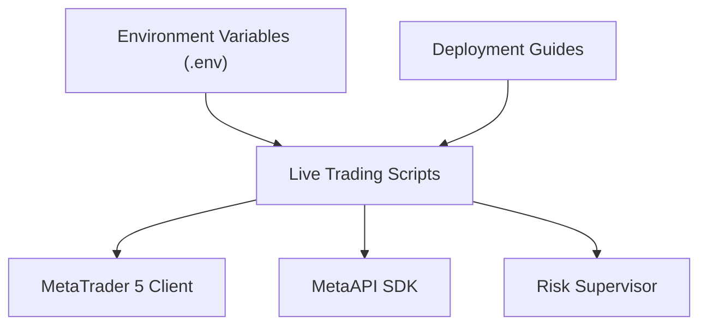
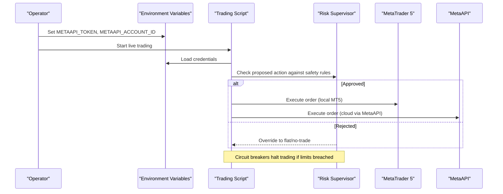
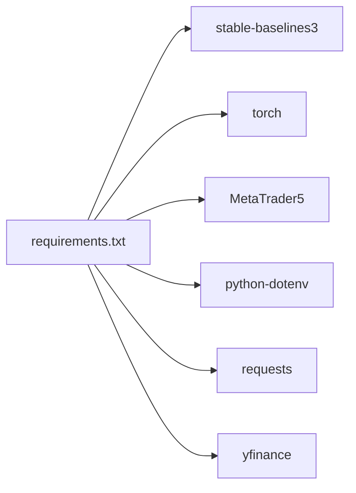

# Security and Access Control

<cite>
**Referenced Files in This Document**
- [SECURITY.md](file://SECURITY.md)
- [DEPLOYMENT_GUIDE.md](file://DEPLOYMENT_GUIDE.md)
- [README.md](file://README.md)
- [live_trade_metaapi.py](file://live/live_trade_metaapi.py)
- [live_trade_mt5.py](file://live/live_trade_mt5.py)
- [risk_supervisor.py](file://models/risk_supervisor.py)
- [requirements.txt](file://requirements.txt)
</cite>

## Table of Contents
1. Introduction
2. Project Structure
3. Core Components
4. Architecture Overview
5. Detailed Component Analysis
6. Dependency Analysis
7. Performance Considerations
8. Troubleshooting Guide
9. Conclusion

## Introduction
This document provides comprehensive security guidance for production deployment of the autonomous trading system. It focuses on secure API key management, secure communication with MetaTrader 5 and MetaAPI, access control mechanisms, vulnerability assessment and patching, incident response procedures, and compliance considerations relevant to financial applications. The guidance is grounded in the repository’s existing security practices and live trading integrations.

## Project Structure
The project includes:
- Live trading scripts that connect to MetaTrader 5 (MT5) and MetaAPI for execution
- A risk supervisor module that enforces hard safety limits over AI decisions
- Documentation outlining security best practices and deployment options
- Dependencies that include environment variable loading and networking libraries

**Diagram sources**
- [live_trade_metaapi.py:23-30](file://live/live_trade_metaapi.py#L23-L30)
- [live_trade_mt5.py:11-16](file://live/live_trade_mt5.py#L11-L16)
- [risk_supervisor.py:18-66](file://models/risk_supervisor.py#L18-L66)
- [DEPLOYMENT_GUIDE.md:1-192](file://DEPLOYMENT_GUIDE.md#L1-L192)

**Section sources**
- [SECURITY.md:1-167](file://SECURITY.md#L1-L167)
- [DEPLOYMENT_GUIDE.md:1-192](file://DEPLOYMENT_GUIDE.md#L1-L192)
- [README.md:264-292](file://README.md#L264-L292)
- [live_trade_metaapi.py:23-30](file://live/live_trade_metaapi.py#L23-L30)
- [live_trade_mt5.py:11-16](file://live/live_trade_mt5.py#L11-L16)
- [risk_supervisor.py:18-66](file://models/risk_supervisor.py#L18-L66)

## Core Components
- Secure credential handling via environment variables and .env files
- Live trading integration with MT5 and MetaAPI
- Risk supervisor enforcing circuit breakers, drawdown limits, spread filters, and trade frequency controls
- Deployment guidance for cloud VPS environments with built-in firewall and monitoring

Key responsibilities:
- Prevent secrets from being committed or logged
- Ensure robust connection handling and reconnection logic
- Enforce deterministic safety rules over AI-driven actions
- Provide operational controls for safe production runs

**Section sources**
- [SECURITY.md:23-84](file://SECURITY.md#L23-L84)
- [live_trade_metaapi.py:23-30](file://live/live_trade_metaapi.py#L23-L30)
- [live_trade_mt5.py:11-16](file://live/live_trade_mt5.py#L11-L16)
- [risk_supervisor.py:18-66](file://models/risk_supervisor.py#L18-L66)
- [DEPLOYMENT_GUIDE.md:176-192](file://DEPLOYMENT_GUIDE.md#L176-L192)

## Architecture Overview
The production architecture centers around secure credential management, encrypted communications with brokers, and a deterministic risk layer that overrides AI decisions when necessary.

**Diagram sources**
- [live_trade_metaapi.py:23-30](file://live/live_trade_metaapi.py#L23-L30)
- [live_trade_mt5.py:11-16](file://live/live_trade_mt5.py#L11-L16)
- [risk_supervisor.py:91-174](file://models/risk_supervisor.py#L91-L174)

## Detailed Component Analysis

### API Key Management Strategy
- Use environment variables for all sensitive credentials; never commit secrets to version control
- Maintain a .env file locally and ensure it is ignored by git
- In production, set environment variables via your platform’s secret manager or service configuration
- Rotate keys immediately upon suspected compromise and update environment variables accordingly
- Restrict file permissions on .env where applicable

Implementation references:
- Environment variable loading and usage in live trading script
- Security policy detailing required variables and rotation steps
- README instructions for creating and populating .env

**Section sources**
- [SECURITY.md:23-84](file://SECURITY.md#L23-L84)
- [SECURITY.md:70-84](file://SECURITY.md#L70-L84)
- [README.md:264-292](file://README.md#L264-L292)
- [live_trade_metaapi.py:23-30](file://live/live_trade_metaapi.py#L23-L30)

### Secure Communication Protocols
- MetaTrader 5: Uses the official MT5 client library for local execution; ensure the terminal is secured and only accessible from trusted hosts
- MetaAPI: Cloud-based execution via SDK; credentials are loaded from environment variables and used to authenticate connections
- Network-level protections: Use firewalls, restrict inbound ports, and prefer private networks or VPNs for server access
- Encryption: Rely on broker-provided TLS/SSL channels for data in transit; avoid logging tokens or account identifiers

Operational notes:
- Connection retries and timeouts are implemented to handle transient network issues
- Logs should not contain sensitive information; internal loggers can be suppressed to reduce noise

**Section sources**
- [live_trade_mt5.py:11-16](file://live/live_trade_mt5.py#L11-L16)
- [live_trade_metaapi.py:23-30](file://live/live_trade_metaapi.py#L23-L30)
- [live_trade_metaapi.py:40-86](file://live/live_trade_metaapi.py#L40-L86)
- [DEPLOYMENT_GUIDE.md:176-192](file://DEPLOYMENT_GUIDE.md#L176-L192)

### Access Control Mechanisms
- User authentication: Not implemented in this codebase; rely on OS-level access controls and SSH key-based login for servers
- Role-based permissions: Manage access at the platform level (e.g., cloud IAM roles) and limit who can modify environment variables or deploy code
- Network-level security: Configure firewalls to allow only necessary traffic; use VPNs for remote access; monitor logs for unauthorized attempts

Best practices:
- Use separate accounts for development and production
- Enable multi-factor authentication on external services (e.g., MetaAPI dashboard)
- Restrict server access to known IP ranges where possible

**Section sources**
- [SECURITY.md:113-132](file://SECURITY.md#L113-L132)
- [DEPLOYMENT_GUIDE.md:176-192](file://DEPLOYMENT_GUIDE.md#L176-L192)

### Vulnerability Assessment and Patching
- Keep dependencies updated regularly using the requirements file
- Perform periodic scans for known vulnerabilities in third-party packages
- Apply patches promptly, especially for networking and cryptography-related libraries
- Validate updates in a staging environment before deploying to production

Recommended process:
- Pin versions in requirements and review changelogs for breaking changes
- Use CI pipelines to run dependency checks and automated tests
- Maintain an audit trail of updates and approvals

**Section sources**
- [requirements.txt:1-29](file://requirements.txt#L1-L29)
- [SECURITY.md:122-125](file://SECURITY.md#L122-L125)

### Incident Response Procedures
Immediate actions for security incidents:
- Revoke compromised credentials and rotate keys
- Isolate affected systems and preserve logs for forensics
- Notify stakeholders and follow the reporting process outlined in the security policy
- Conduct post-incident reviews to improve defenses and detection

Common scenarios:
- Unauthorized access attempts: Block source IPs, strengthen authentication, and enhance monitoring
- System compromise: Restore from known-good backups, patch vulnerabilities, and enforce stricter access controls
- Data exfiltration: Audit data flows, revoke access, and notify relevant parties per compliance obligations

**Section sources**
- [SECURITY.md:86-112](file://SECURITY.md#L86-L112)
- [SECURITY.md:134-149](file://SECURITY.md#L134-L149)

### Compliance Considerations
- Financial regulations: Ensure adherence to applicable trading and data protection laws; maintain audit trails for trades and decisions
- Data protection: Minimize collection and retention of personal data; encrypt sensitive data at rest and in transit
- Operational resilience: Implement backup and recovery procedures; test disaster recovery plans periodically
- Governance: Establish clear policies for access, change management, and incident handling

Note: Consult legal and compliance experts to tailor policies to your jurisdiction and business model.

[No sources needed since this section provides general guidance]

## Dependency Analysis
The system depends on:
- Python packages for RL, data processing, and trading integrations
- Environment variable utilities for secure configuration
- Networking libraries for data fetching and API calls

**Diagram sources**
- [requirements.txt:1-29](file://requirements.txt#L1-L29)

**Section sources**
- [requirements.txt:1-29](file://requirements.txt#L1-L29)

## Performance Considerations
- Optimize network calls with retries and timeouts to reduce latency spikes
- Avoid logging sensitive data to prevent unnecessary overhead and exposure
- Use efficient feature computation and minimize redundant data fetches
- Monitor resource usage and adjust batch sizes or intervals based on server capacity

[No sources needed since this section provides general guidance]

## Troubleshooting Guide
Common issues and mitigations:
- Missing or invalid credentials: Ensure environment variables are set correctly; verify .env is loaded
- Connection failures: Use retry logic and check network/firewall settings; confirm broker account deployment status
- Excessive log noise: Suppress internal SDK logs to focus on critical errors
- Risk supervisor halts: Review daily loss limits, drawdown thresholds, and spread filters; adjust parameters as needed

Operational tips:
- Use systemd or process managers to auto-restart failed processes
- Centralize logs and set up alerts for critical events
- Regularly validate model paths and data availability

**Section sources**
- [live_trade_metaapi.py:13-21](file://live/live_trade_metaapi.py#L13-L21)
- [live_trade_metaapi.py:40-86](file://live/live_trade_metaapi.py#L40-L86)
- [live_trade_metaapi.py:136-197](file://live/live_trade_metaapi.py#L136-L197)
- [risk_supervisor.py:104-174](file://models/risk_supervisor.py#L104-L174)

## Conclusion
Production security for this autonomous trading system hinges on strict credential management, secure communications, robust access controls, proactive vulnerability management, and well-defined incident response procedures. The risk supervisor provides a critical safety net by enforcing deterministic limits over AI decisions. Follow the documented best practices and continuously monitor and update your environment to maintain a secure and resilient operation.

[No sources needed since this section summarizes without analyzing specific files]