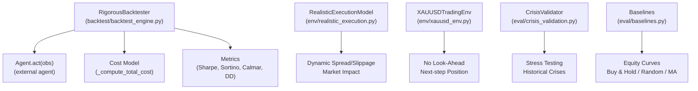
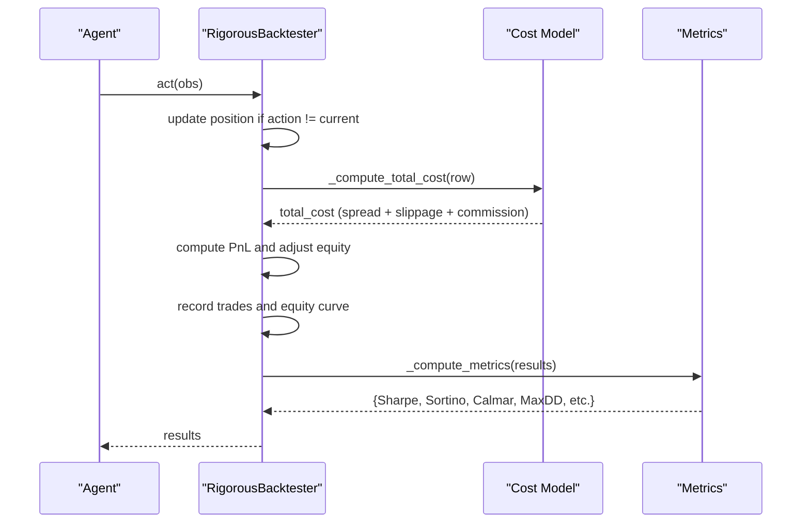
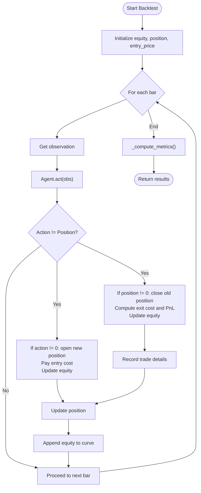
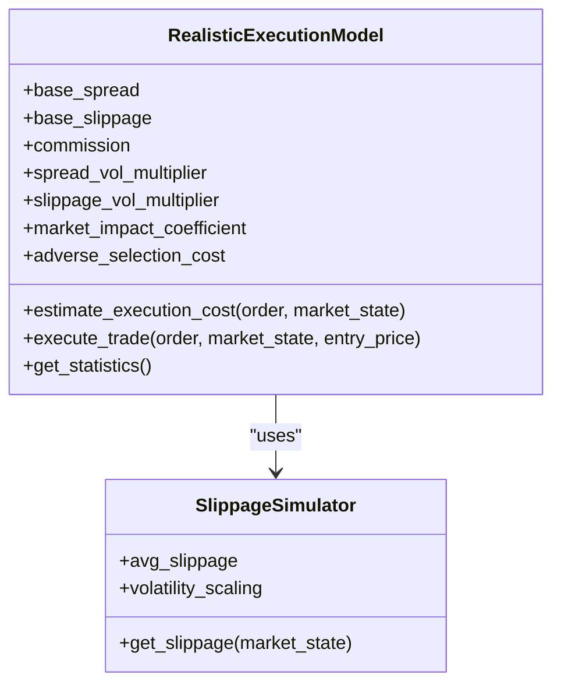
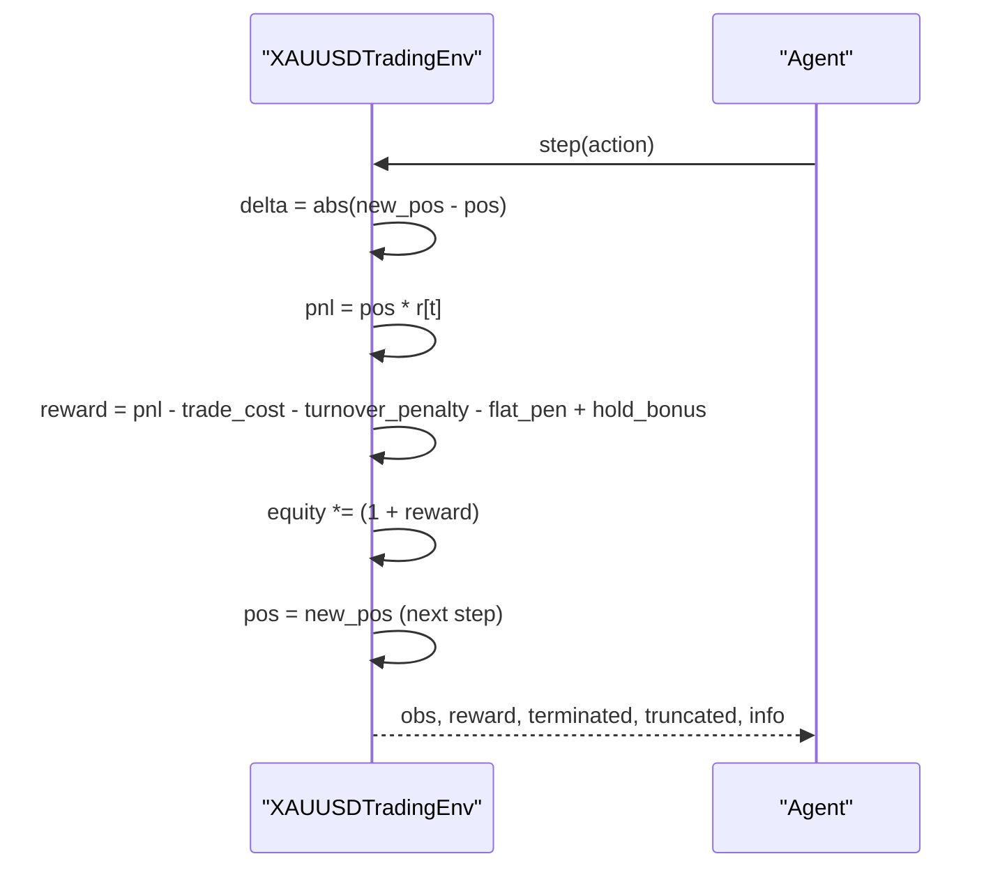
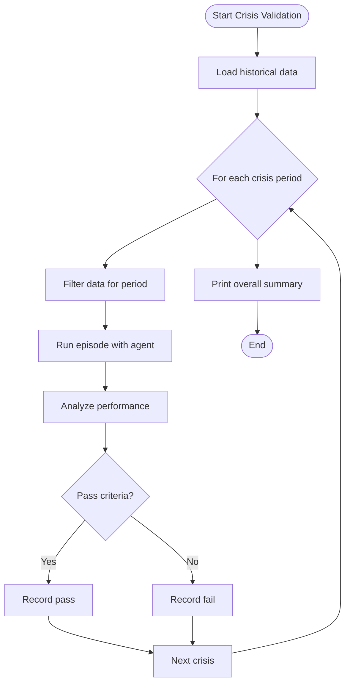
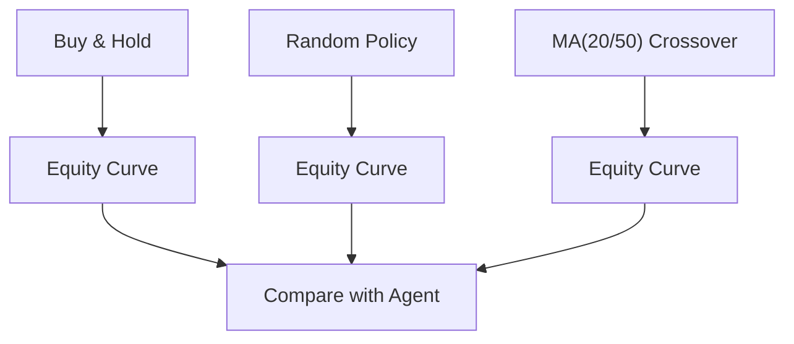
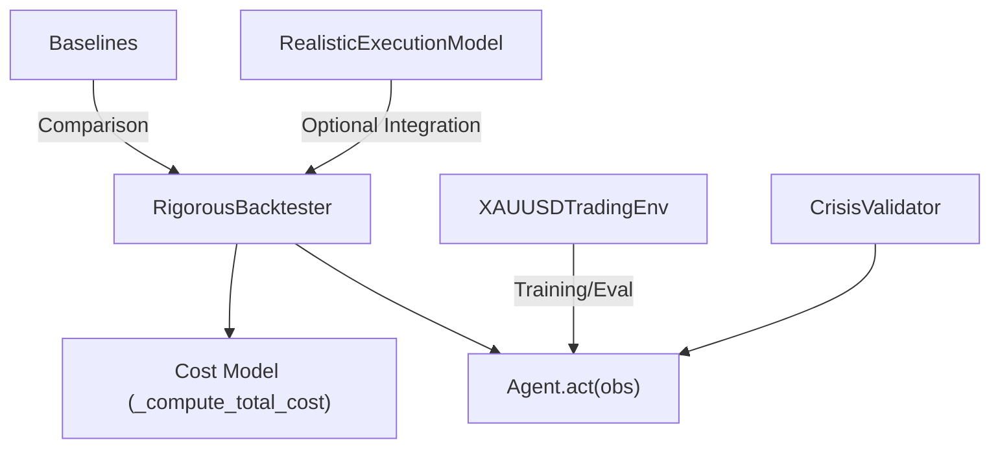

# Backtesting Engine

<cite>
**Referenced Files in This Document**
- [backtest_engine.py](file://backtest/backtest_engine.py)
- [realistic_execution.py](file://env/realistic_execution.py)
- [xauusd_env.py](file://env/xauusd_env.py)
- [crisis_validation.py](file://eval/crisis_validation.py)
- [baselines.py](file://eval/baselines.py)
</cite>

## Table of Contents
1. [Introduction](#introduction)
2. [Project Structure](#project-structure)
3. [Core Components](#core-components)
4. [Architecture Overview](#architecture-overview)
5. [Detailed Component Analysis](#detailed-component-analysis)
6. [Dependency Analysis](#dependency-analysis)
7. [Performance Considerations](#performance-considerations)
8. [Troubleshooting Guide](#troubleshooting-guide)
9. [Conclusion](#conclusion)
10. [Appendices](#appendices)

## Introduction
This document explains the rigorous backtesting engine designed to simulate realistic trading conditions and evaluate model robustness across market regimes. It focuses on:
- The RigorousBacktester class with conservative cost modeling (spread, slippage, commission)
- Walk-forward validation for testing across different market regimes
- Equity curve calculation, position management, and P&L computation including transaction costs
- Practical guidance for running backtests, configuring costs, interpreting metrics (Sharpe, Sortino, Calmar, max drawdown), and analyzing trade statistics
- Common pitfalls such as overfitting detection, look-ahead bias prevention, and statistical significance considerations

## Project Structure
The backtesting system spans several modules:
- backtest/backtest_engine.py: Core backtesting engine with cost modeling and metrics
- env/realistic_execution.py: Advanced execution cost model with dynamic spread/slippage and market impact
- env/xauusd_env.py: Gym-style environment that enforces no look-ahead by applying positions on the next step
- eval/crisis_validation.py: Crisis period validation to test robustness under stress
- eval/baselines.py: Baseline strategies and equity curves for comparison

**Diagram sources**
- [backtest_engine.py:24-146](file://backtest/backtest_engine.py#L24-L146)
- [realistic_execution.py:24-199](file://env/realistic_execution.py#L24-L199)
- [xauusd_env.py:7-118](file://env/xauusd_env.py#L7-L118)
- [crisis_validation.py:29-171](file://eval/crisis_validation.py#L29-L171)
- [baselines.py:7-53](file://eval/baselines.py#L7-L53)

**Section sources**
- [backtest_engine.py:1-146](file://backtest/backtest_engine.py#L1-L146)
- [realistic_execution.py:1-199](file://env/realistic_execution.py#L1-L199)
- [xauusd_env.py:1-118](file://env/xauusd_env.py#L1-L118)
- [crisis_validation.py:1-171](file://eval/crisis_validation.py#L1-L171)
- [baselines.py:1-53](file://eval/baselines.py#L1-L53)

## Core Components
- RigorousBacktester: Implements a pessimistic backtest loop with conservative cost assumptions, walk-forward validation, and comprehensive metrics.
- RealisticExecutionModel: Provides advanced execution cost estimation including volatility-dependent spread widening, event-window effects, market impact, and adverse selection.
- XAUUSDTradingEnv: A discrete long-only environment that applies actions on the next step to prevent look-ahead bias and includes turnover and holding penalties.
- CrisisValidator: Tests agents against known crisis periods with pass/fail criteria focused on survival, drawdown control, and reasonable Sharpe behavior.
- Baselines: Simple strategies (buy-and-hold, random, moving average crossover) used to benchmark performance without costs.

Key conservative cost assumptions in the backtester:
- Base spread: 3 pips (0.0003)
- Slippage: 3 pips (0.0003)
- Commission: 0.5 pip (0.00005)
- Spread multiplier: 1.5x historical spread to be more pessimistic

These assumptions simulate real trading conditions better than typical optimistic backtests by accounting for bid-ask costs, order fill degradation, and explicit commissions.

**Section sources**
- [backtest_engine.py:32-71](file://backtest/backtest_engine.py#L32-L71)
- [backtest_engine.py:202-217](file://backtest/backtest_engine.py#L202-L217)
- [realistic_execution.py:35-86](file://env/realistic_execution.py#L35-L86)
- [xauusd_env.py:21-31](file://env/xauusd_env.py#L21-L31)
- [crisis_validation.py:29-40](file://eval/crisis_validation.py#L29-L40)

## Architecture Overview
The backtesting architecture integrates an agent’s decision-making with realistic execution costs and evaluation metrics. The flow emphasizes conservatism and realism:

**Diagram sources**
- [backtest_engine.py:73-146](file://backtest/backtest_engine.py#L73-L146)
- [backtest_engine.py:202-217](file://backtest/backtest_engine.py#L202-L217)
- [backtest_engine.py:219-360](file://backtest/backtest_engine.py#L219-L360)

## Detailed Component Analysis

### RigorousBacktester Class
Responsibilities:
- Initialize with agent, data, and configuration for conservative costs
- Run backtest loop: iterate through data, get observations, execute trades when position changes, apply costs, compute PnL, update equity, and record trades
- Compute comprehensive metrics: total return, annualized return, max drawdown, Sharpe ratio, Sortino ratio, Calmar ratio, win rate, profit factor, average trade duration, and total costs
- Provide walk-forward validation: split data into rolling train/test windows and aggregate results

Conservative cost modeling:
- Spread: base_spread * spread_multiplier (default 1.5x)
- Slippage: fixed per trade
- Commission: fixed per trade
- Total cost = spread + slippage + commission

Equity curve and PnL:
- Entry cost deducted from equity at entry
- Exit PnL computed based on direction (long/short) minus exit cost
- Equity updated multiplicatively per trade

Walk-forward validation:
- Splits data into training and testing windows
- Runs backtest on each test window
- Aggregates results across windows to assess stability across regimes

**Diagram sources**
- [backtest_engine.py:73-146](file://backtest/backtest_engine.py#L73-L146)
- [backtest_engine.py:202-217](file://backtest/backtest_engine.py#L202-L217)
- [backtest_engine.py:219-360](file://backtest/backtest_engine.py#L219-L360)

**Section sources**
- [backtest_engine.py:24-146](file://backtest/backtest_engine.py#L24-L146)
- [backtest_engine.py:148-195](file://backtest/backtest_engine.py#L148-L195)
- [backtest_engine.py:202-360](file://backtest/backtest_engine.py#L202-L360)

### RealisticExecutionModel
Responsibilities:
- Estimate execution costs dynamically based on market state (volatility, spread, liquidity, event windows)
- Adjust fill prices for buys/sells considering total costs
- Track statistics and provide breakdowns of costs (spread, slippage, commission, market impact, adverse selection)

Dynamic cost components:
- Spread widens during high volatility and news events
- Slippage increases with volatility and market orders; amplified during events
- Market impact scales with position size relative to liquidity
- Adverse selection adds a small constant cost

**Diagram sources**
- [realistic_execution.py:24-229](file://env/realistic_execution.py#L24-L229)
- [realistic_execution.py:232-276](file://env/realistic_execution.py#L232-L276)

**Section sources**
- [realistic_execution.py:24-199](file://env/realistic_execution.py#L24-L199)
- [realistic_execution.py:201-229](file://env/realistic_execution.py#L201-L229)
- [realistic_execution.py:232-276](file://env/realistic_execution.py#L232-L276)

### XAUUSDTradingEnv (Look-Ahead Prevention)
Responsibilities:
- Discrete long-only environment with actions: 0=Flat, 1=Long
- Applies position on the next step to avoid look-ahead bias
- Computes reward incorporating PnL, trade costs, turnover penalty, flat penalty, and hold bonus
- Tracks equity and provides info for analysis

**Diagram sources**
- [xauusd_env.py:75-118](file://env/xauusd_env.py#L75-L118)

**Section sources**
- [xauusd_env.py:7-118](file://env/xauusd_env.py#L7-L118)

### CrisisValidator (Robustness Across Regimes)
Responsibilities:
- Test agent on known crisis periods (e.g., COVID crash, rate hikes, SVB collapse)
- Enforce pass criteria: final equity > 0.7, max drawdown < 30%, Sharpe > -1.0, limited overtrading
- Aggregate results and print summaries

**Diagram sources**
- [crisis_validation.py:109-171](file://eval/crisis_validation.py#L109-L171)
- [crisis_validation.py:236-317](file://eval/crisis_validation.py#L236-L317)

**Section sources**
- [crisis_validation.py:29-171](file://eval/crisis_validation.py#L29-L171)
- [crisis_validation.py:236-317](file://eval/crisis_validation.py#L236-L317)

### Baselines (Benchmarking)
Responsibilities:
- Implement simple strategies: buy-and-hold, random policy, moving average crossover
- Generate equity curves for comparison without costs

**Diagram sources**
- [baselines.py:7-53](file://eval/baselines.py#L7-L53)

**Section sources**
- [baselines.py:7-53](file://eval/baselines.py#L7-L53)

## Dependency Analysis
- RigorousBacktester depends on an external agent implementing act(obs) and historical data with a time index and price columns.
- RealisticExecutionModel is independent but can be integrated to enhance cost modeling beyond the backtester’s simplified approach.
- XAUUSDTradingEnv provides a controlled environment ensuring no look-ahead bias, useful for training and evaluating policies.
- CrisisValidator uses historical data and an agent to test robustness under stress scenarios.
- Baselines provide reference equity curves for strategy comparison.

**Diagram sources**
- [backtest_engine.py:24-146](file://backtest/backtest_engine.py#L24-L146)
- [realistic_execution.py:24-199](file://env/realistic_execution.py#L24-L199)
- [xauusd_env.py:7-118](file://env/xauusd_env.py#L7-L118)
- [crisis_validation.py:29-171](file://eval/crisis_validation.py#L29-L171)
- [baselines.py:7-53](file://eval/baselines.py#L7-L53)

**Section sources**
- [backtest_engine.py:24-146](file://backtest/backtest_engine.py#L24-L146)
- [realistic_execution.py:24-199](file://env/realistic_execution.py#L24-L199)
- [xauusd_env.py:7-118](file://env/xauusd_env.py#L7-L118)
- [crisis_validation.py:29-171](file://eval/crisis_validation.py#L29-L171)
- [baselines.py:7-53](file://eval/baselines.py#L7-L53)

## Performance Considerations
- Conservative cost assumptions reduce optimism bias and better approximate live trading friction.
- Walk-forward validation helps detect regime dependence and reduces overfitting risk by testing across multiple windows.
- Dynamic execution costs (in RealisticExecutionModel) capture volatility and event-driven market conditions, improving realism.
- Avoid excessive turnover: the environment penalizes frequent position changes, encouraging stable strategies.
- Use crisis validation to ensure strategies survive extreme market conditions before deployment.

[No sources needed since this section provides general guidance]

## Troubleshooting Guide
Common issues and resolutions:
- No trades executed: Ensure agent returns non-zero actions when appropriate; verify data contains required columns (close, time).
- Unrealistic performance: Increase cost parameters or integrate RealisticExecutionModel for dynamic costs; check for look-ahead bias in feature construction.
- Overfitting detection: Use walk-forward validation and crisis validation; compare against baselines; monitor stability of metrics across windows.
- Look-ahead bias prevention: In environments like XAUUSDTradingEnv, actions are applied on the next step; ensure features do not use future information.
- Statistical significance: Perform multiple walk-forward runs; report confidence intervals for key metrics; consider bootstrapping returns to assess robustness.

**Section sources**
- [backtest_engine.py:73-146](file://backtest/backtest_engine.py#L73-L146)
- [xauusd_env.py:75-118](file://env/xauusd_env.py#L75-L118)
- [crisis_validation.py:109-171](file://eval/crisis_validation.py#L109-L171)

## Conclusion
The backtesting engine prioritizes realism through conservative cost modeling, walk-forward validation, and crisis testing. By integrating dynamic execution costs and enforcing no look-ahead bias, it provides a more reliable assessment of strategy performance. Use the provided metrics and tools to interpret results, identify weaknesses, and improve robustness before live deployment.

[No sources needed since this section summarizes without analyzing specific files]

## Appendices

### Practical Examples
- Running a backtest:
  - Prepare historical data with a time index and price columns
  - Instantiate an agent with an act(obs) method
  - Create RigorousBacktester(agent, data, config) and call run_backtest()
  - Inspect results['metrics'] for Sharpe, Sortino, Calmar, max drawdown, win rate, profit factor, and total costs

- Configuring cost parameters:
  - Adjust spread, slippage, commission, and spread_mult in the config passed to RigorousBacktester
  - For advanced dynamics, integrate RealisticExecutionModel to estimate costs based on market state

- Interpreting metrics:
  - Sharpe ratio: risk-adjusted return; higher is better
  - Sortino ratio: downside risk-adjusted return; higher is better
  - Calmar ratio: annualized return divided by max drawdown; higher is better
  - Max drawdown: largest peak-to-trough decline; lower is better
  - Win rate and profit factor: measure consistency and efficiency of trades

- Analyzing trade statistics:
  - Review num_trades, avg_win, avg_loss, avg_trade_duration
  - Examine total_costs to understand friction impact

- Walk-forward validation:
  - Use walk_forward_validation(train_window, test_window) to test across regimes
  - Aggregate results to assess stability and robustness

- Crisis validation:
  - Use CrisisValidator to test on historical crises
  - Ensure pass criteria: survival, controlled drawdown, reasonable Sharpe, limited overtrading

**Section sources**
- [backtest_engine.py:32-71](file://backtest/backtest_engine.py#L32-L71)
- [backtest_engine.py:73-146](file://backtest/backtest_engine.py#L73-L146)
- [backtest_engine.py:148-195](file://backtest/backtest_engine.py#L148-L195)
- [backtest_engine.py:219-360](file://backtest/backtest_engine.py#L219-L360)
- [realistic_execution.py:35-86](file://env/realistic_execution.py#L35-L86)
- [crisis_validation.py:29-40](file://eval/crisis_validation.py#L29-L40)