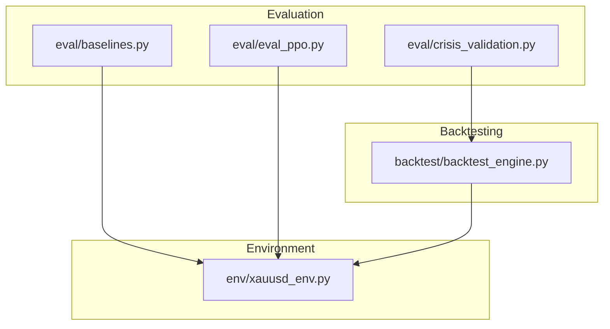
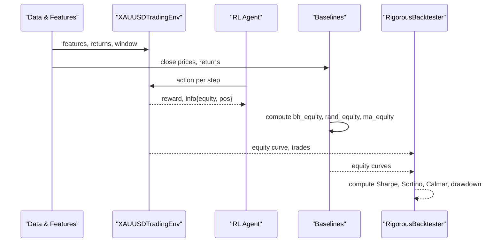
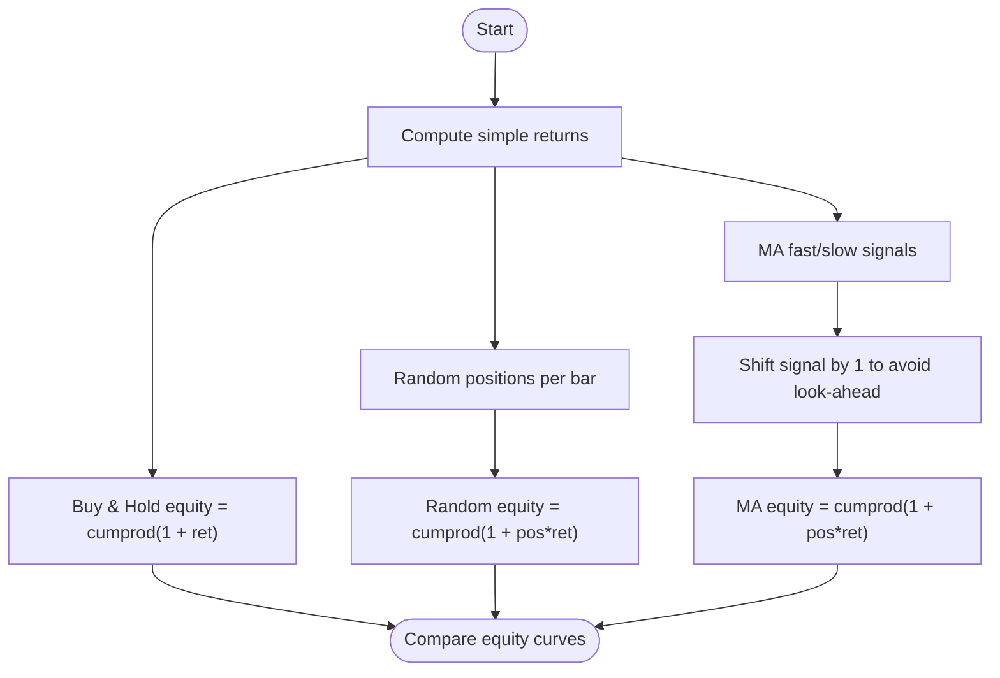
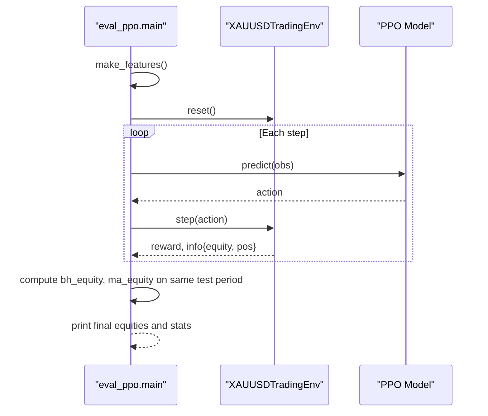
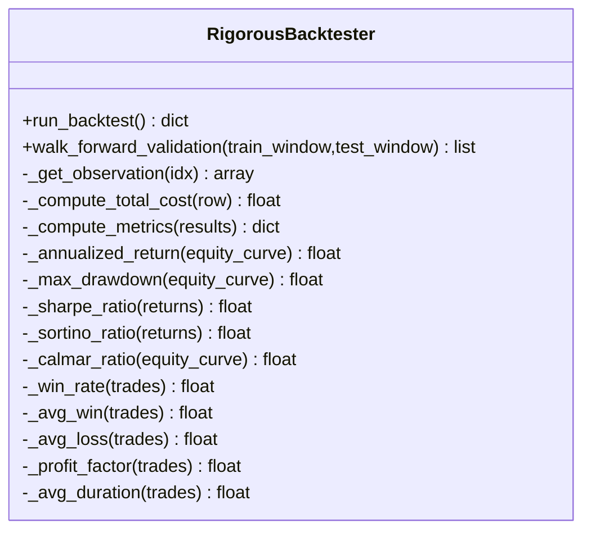
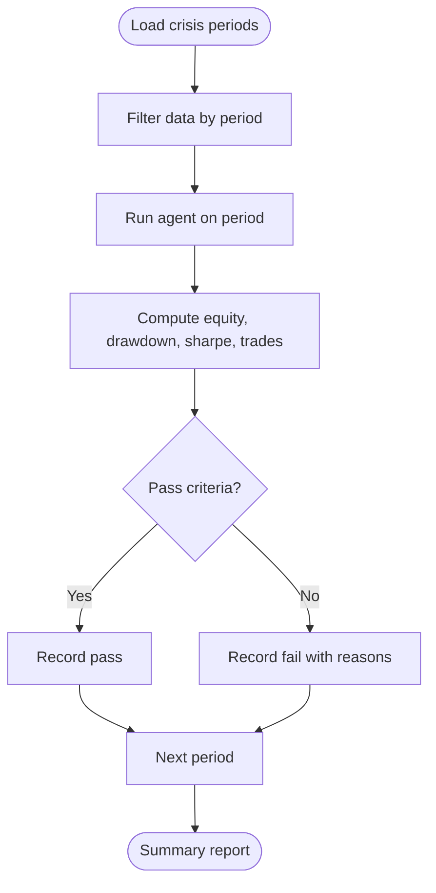
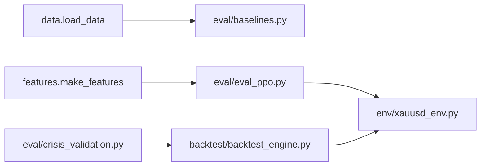

# Baseline Comparisons

<cite>
**Referenced Files in This Document**
- [baselines.py](file://eval/baselines.py)
- [eval_ppo.py](file://eval/eval_ppo.py)
- [backtest_engine.py](file://backtest/backtest_engine.py)
- [xauusd_env.py](file://env/xauusd_env.py)
- [crisis_validation.py](file://eval/crisis_validation.py)
</cite>

## Table of Contents
1. Introduction
2. Project Structure
3. Core Components
4. Architecture Overview
5. Detailed Component Analysis
6. Dependency Analysis
7. Performance Considerations
8. Troubleshooting Guide
9. Conclusion
10. Appendices

## Introduction
This document explains how to set up and interpret baseline comparisons for evaluating trading model performance against simple, naive strategies. It covers:
- Buy-and-hold, random trading, and moving average crossover baselines
- How to run baseline experiments alongside RL models on the same data and timeframes
- Interpreting risk-adjusted metrics (Sharpe, Sortino, Calmar, drawdown)
- Determining whether complex ML/RL models provide genuine alpha over simple strategies
- Practical guidance for designing robust baseline experiments and interpreting results

The goal is to ensure that any claimed edge from a sophisticated model is statistically and economically meaningful after accounting for costs, slippage, and realistic market conditions.

## Project Structure
Baseline evaluation spans several modules:
- Simple baselines are implemented directly in an evaluation script using price returns and rolling signals
- RL model evaluation runs on a Gym-style environment with transaction costs and position tracking
- A rigorous backtesting framework provides conservative cost assumptions and comprehensive metrics
- Crisis validation tests resilience during known turbulent periods

**Diagram sources**
- [baselines.py:1-54](file://eval/baselines.py#L1-L54)
- [eval_ppo.py:1-94](file://eval/eval_ppo.py#L1-L94)
- [backtest_engine.py:24-146](file://backtest/backtest_engine.py#L24-L146)
- [xauusd_env.py:7-118](file://env/xauusd_env.py#L7-L118)
- [crisis_validation.py:29-171](file://eval/crisis_validation.py#L29-L171)

**Section sources**
- [baselines.py:1-54](file://eval/baselines.py#L1-L54)
- [eval_ppo.py:1-94](file://eval/eval_ppo.py#L1-L94)
- [backtest_engine.py:24-146](file://backtest/backtest_engine.py#L24-L146)
- [xauusd_env.py:7-118](file://env/xauusd_env.py#L7-L118)
- [crisis_validation.py:29-171](file://eval/crisis_validation.py#L29-L171)

## Core Components
- Baseline strategies:
  - Buy-and-hold: cumulative product of simple returns
  - Random policy: randomly chosen long/flat/short positions applied per bar
  - Moving average crossover: signal based on fast/slow moving averages with one-step shift to avoid look-ahead bias
- RL evaluation:
  - Runs a trained RL agent on a test period within a Gym environment that applies transaction costs and tracks equity and positions
  - Computes equivalent buy-and-hold and MA crossover baselines on the same test period for direct comparison
- Rigorous backtester:
  - Implements pessimistic cost assumptions (spread, slippage, commission)
  - Produces comprehensive metrics including Sharpe, Sortino, Calmar, max drawdown, win rate, profit factor, and trade durations
  - Supports walk-forward validation across rolling windows
- Crisis validation:
  - Evaluates strategy behavior during historical crisis periods with pass/fail criteria focused on survival, drawdown, and turnover

**Section sources**
- [baselines.py:10-35](file://eval/baselines.py#L10-L35)
- [eval_ppo.py:45-70](file://eval/eval_ppo.py#L45-L70)
- [backtest_engine.py:48-71](file://backtest/backtest_engine.py#L48-L71)
- [backtest_engine.py:219-254](file://backtest/backtest_engine.py#L219-L254)
- [crisis_validation.py:29-40](file://eval/crisis_validation.py#L29-L40)

## Architecture Overview
The evaluation pipeline compares RL agents and naive strategies under consistent conditions:
- Data preparation and feature construction feed into both baselines and RL environments
- RL agent actions are executed in an environment that enforces realistic costs and position dynamics
- Baseline strategies compute synthetic positions and equity curves directly from returns
- Backtesting and crisis validation provide standardized metrics and stress tests

**Diagram sources**
- [eval_ppo.py:16-41](file://eval/eval_ppo.py#L16-L41)
- [xauusd_env.py:75-118](file://env/xauusd_env.py#L75-L118)
- [baselines.py:10-35](file://eval/baselines.py#L10-L35)
- [backtest_engine.py:73-146](file://backtest/backtest_engine.py#L73-L146)

## Detailed Component Analysis

### Baseline Strategies
- Buy-and-hold:
  - Uses simple returns and computes cumulative equity starting at 1.0
  - Serves as a no-cost benchmark for directional exposure
- Random policy:
  - Chooses positions uniformly from {-1, 0, 1} per bar
  - Demonstrates expected value of random trading without skill
- Moving average crossover:
  - Generates signals from fast vs slow moving averages
  - Shifts signal by one step to prevent look-ahead bias
  - Applies position to returns to compute equity curve

**Diagram sources**
- [baselines.py:10-35](file://eval/baselines.py#L10-L35)

**Section sources**
- [baselines.py:10-35](file://eval/baselines.py#L10-L35)

### RL Evaluation and Baseline Comparison
- The RL evaluation script:
  - Loads features and splits data into train/test by date
  - Runs the RL agent on the test period inside the trading environment
  - Computes equivalent buy-and-hold and MA crossover baselines on the same test period
  - Prints final equity values and basic statistics for comparison
- Environment details:
  - Discrete actions (flat or long)
  - Position applied next step to avoid look-ahead
  - Reward includes PnL minus trade costs, turnover penalties, flat penalty, and hold bonus
  - Tracks equity and position state per step

**Diagram sources**
- [eval_ppo.py:16-41](file://eval/eval_ppo.py#L16-L41)
- [xauusd_env.py:75-118](file://env/xauusd_env.py#L75-L118)

**Section sources**
- [eval_ppo.py:16-41](file://eval/eval_ppo.py#L16-L41)
- [xauusd_env.py:75-118](file://env/xauusd_env.py#L75-L118)

### Rigorous Backtester and Metrics
- Cost assumptions:
  - Spread, slippage, and commission are modeled conservatively
  - Total cost per trade combines spread multiplier, slippage, and commission
- Equity simulation:
  - Tracks entry/exit prices, computes PnL net of costs
  - Updates equity multiplicatively per trade
- Metrics:
  - Returns: total return, annualized return
  - Risk: max drawdown, Sharpe ratio, Sortino ratio, Calmar ratio
  - Trades: number of trades, win rate, average win/loss, profit factor, average duration
  - Costs: total costs as percentage
- Walk-forward validation:
  - Rolling train/test windows simulate realistic out-of-sample testing

**Diagram sources**
- [backtest_engine.py:24-146](file://backtest/backtest_engine.py#L24-L146)
- [backtest_engine.py:219-360](file://backtest/backtest_engine.py#L219-L360)

**Section sources**
- [backtest_engine.py:48-71](file://backtest/backtest_engine.py#L48-L71)
- [backtest_engine.py:73-146](file://backtest/backtest_engine.py#L73-L146)
- [backtest_engine.py:219-360](file://backtest/backtest_engine.py#L219-L360)

### Crisis Validation
- Tests strategies during known crisis periods
- Pass criteria include survival (final equity threshold), maximum drawdown limits, reasonable Sharpe, and controlled turnover
- Provides structured reporting and overall pass rates across crises

**Diagram sources**
- [crisis_validation.py:29-171](file://eval/crisis_validation.py#L29-L171)
- [crisis_validation.py:236-275](file://eval/crisis_validation.py#L236-L275)

**Section sources**
- [crisis_validation.py:29-171](file://eval/crisis_validation.py#L29-L171)
- [crisis_validation.py:236-275](file://eval/crisis_validation.py#L236-L275)

## Dependency Analysis
- Baseline scripts depend on data loading utilities and produce equity curves for comparison
- RL evaluation depends on feature generation and the trading environment
- Backtester depends on agent interface and produces standardized metrics
- Crisis validator depends on data availability and can integrate with backtester outputs

**Diagram sources**
- [baselines.py:5-8](file://eval/baselines.py#L5-L8)
- [eval_ppo.py:7-8](file://eval/eval_ppo.py#L7-L8)
- [xauusd_env.py:7-118](file://env/xauusd_env.py#L7-L118)
- [backtest_engine.py:24-146](file://backtest/backtest_engine.py#L24-L146)
- [crisis_validation.py:29-171](file://eval/crisis_validation.py#L29-L171)

**Section sources**
- [baselines.py:5-8](file://eval/baselines.py#L5-L8)
- [eval_ppo.py:7-8](file://eval/eval_ppo.py#L7-L8)
- [xauusd_env.py:7-118](file://env/xauusd_env.py#L7-L118)
- [backtest_engine.py:24-146](file://backtest/backtest_engine.py#L24-L146)
- [crisis_validation.py:29-171](file://eval/crisis_validation.py#L29-L171)

## Performance Considerations
- Use the same test period and data slice for all strategies to ensure fair comparison
- Include realistic transaction costs; naive baselines often ignore costs, which can inflate apparent performance
- Prefer risk-adjusted metrics over raw returns:
  - Sharpe ratio measures return per unit of volatility
  - Sortino ratio penalizes downside volatility only
  - Calmar ratio relates annualized return to maximum drawdown
- Validate stability via walk-forward validation rather than single split evaluations
- Stress-test during crisis periods to assess robustness

[No sources needed since this section provides general guidance]

## Troubleshooting Guide
- Missing data or incorrect paths:
  - Ensure OHLC CSV files exist and are correctly referenced
  - Verify feature generation steps complete before running evaluations
- Environment mismatch:
  - Confirm feature dimensions match environment expectations
  - Check that returns arrays align with features length
- Cost assumptions:
  - Adjust spread, slippage, and commission if your execution differs significantly
  - Re-run backtests with conservative parameters to avoid overoptimism
- Interpretation pitfalls:
  - Do not compare RL equity curves computed with costs to baselines without costs
  - Always compare like-for-like: either all with costs or all without costs for initial screening

**Section sources**
- [backtest_engine.py:48-71](file://backtest/backtest_engine.py#L48-L71)
- [eval_ppo.py:45-70](file://eval/eval_ppo.py#L45-L70)
- [xauusd_env.py:75-118](file://env/xauusd_env.py#L75-L118)

## Conclusion
Baseline comparisons are essential to determine whether complex RL models deliver genuine alpha beyond simple strategies. Implementing buy-and-hold, random trading, and moving average crossover baselines allows you to:
- Quantify the value added by RL policies after costs
- Assess risk-adjusted performance using Sharpe, Sortino, and Calmar ratios
- Validate robustness through walk-forward and crisis-period testing
- Make informed decisions about whether the complexity of RL models justifies their use

When baselines perform comparably or better, it indicates that further model complexity may not be warranted unless there are additional objectives (e.g., lower drawdown, higher stability). When RL consistently outperforms baselines across multiple metrics and periods, it suggests a credible edge worth pursuing.

[No sources needed since this section summarizes without analyzing specific files]

## Appendices

### How to Configure and Run Baseline Comparisons
- Prepare data and features:
  - Load OHLC data and generate features used by both baselines and RL
- Run baselines:
  - Compute buy-and-hold, random, and MA crossover equity curves on the full dataset or a specified period
- Evaluate RL model:
  - Split data by date, run RL agent on test period, compute equivalent baselines on the same test period
- Compare metrics:
  - Use the backtester to compute Sharpe, Sortino, Calmar, drawdown, and trade metrics for RL and baselines
- Stress-test:
  - Apply crisis validation to evaluate performance during known turbulent periods

**Section sources**
- [baselines.py:10-35](file://eval/baselines.py#L10-L35)
- [eval_ppo.py:16-41](file://eval/eval_ppo.py#L16-L41)
- [backtest_engine.py:73-146](file://backtest/backtest_engine.py#L73-L146)
- [crisis_validation.py:29-171](file://eval/crisis_validation.py#L29-L171)

### Interpreting Relative Performance Metrics
- Final equity multiples:
  - Compare cumulative growth across strategies; adjust for costs where applicable
- Risk-adjusted ratios:
  - Higher Sharpe/Sortino/Calmar indicates better risk-adjusted performance
- Drawdown:
  - Lower maximum drawdown implies more stable equity curves
- Trade activity:
  - Excessive turnover can erode returns due to costs; compare number of trades and durations

**Section sources**
- [backtest_engine.py:219-254](file://backtest/backtest_engine.py#L219-L254)
- [backtest_engine.py:362-391](file://backtest/backtest_engine.py#L362-L391)

### Statistical Significance and Testing Guidelines
- Current repository implementations focus on descriptive metrics and visual comparisons rather than formal statistical tests
- To assess significance:
  - Compare daily or per-bar returns between RL and baselines
  - Use appropriate tests (e.g., t-tests or non-parametric alternatives) on aligned return series
  - Account for multiple comparisons when evaluating across many periods or assets
- Emphasize economic significance:
  - Even small differences can be meaningful if they persist across regimes and survive costs
- Combine statistical and practical assessments:
  - Robustness across crises and walk-forward windows strengthens confidence in results

[No sources needed since this section provides general guidance]