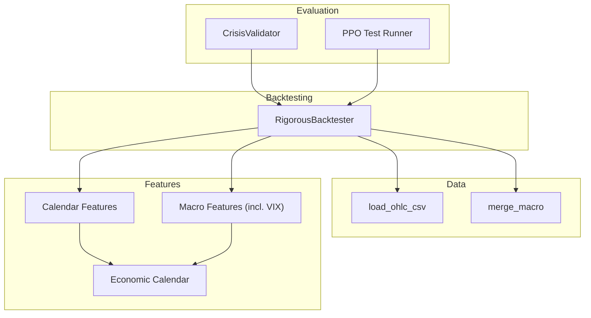
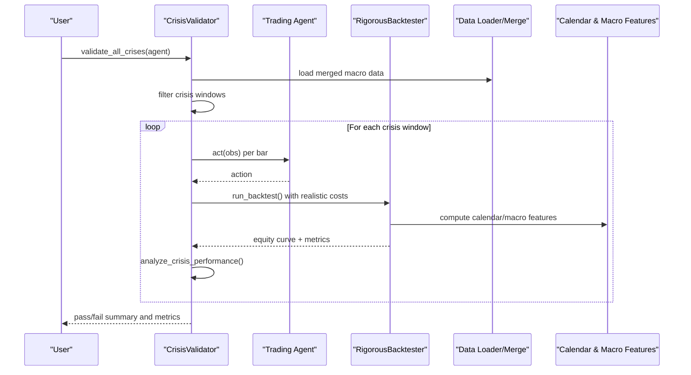
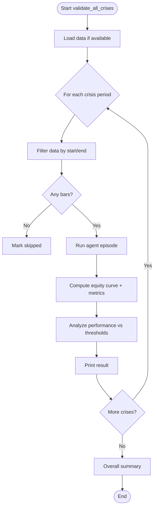
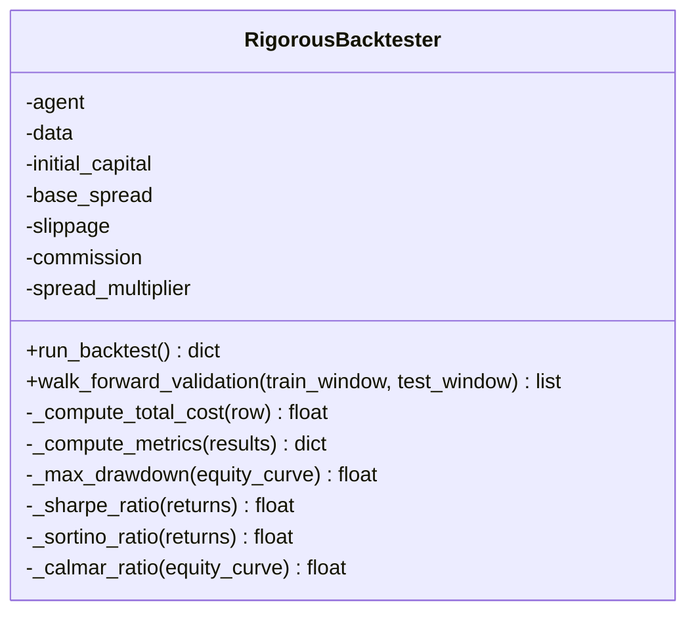
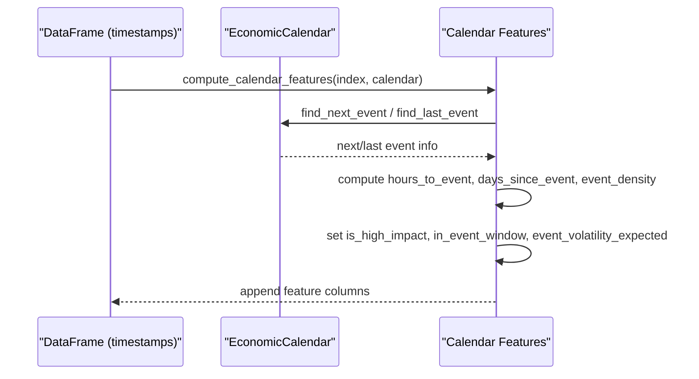
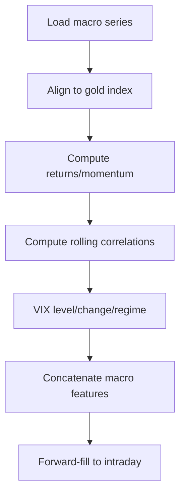
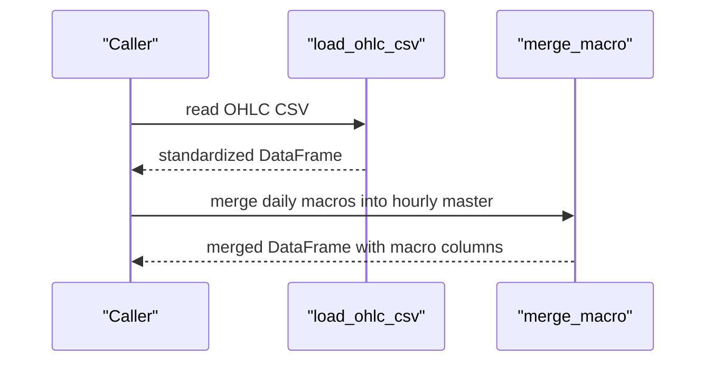
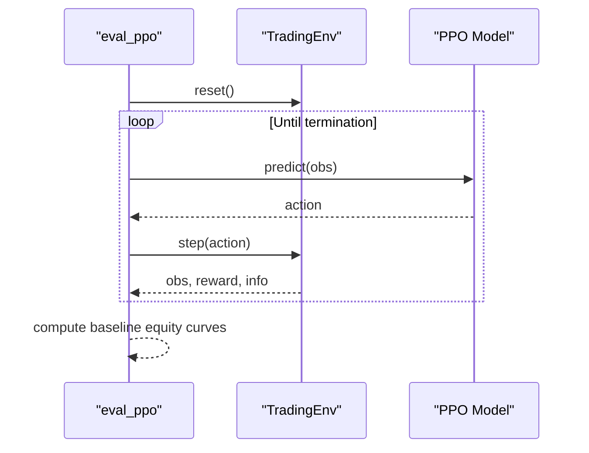
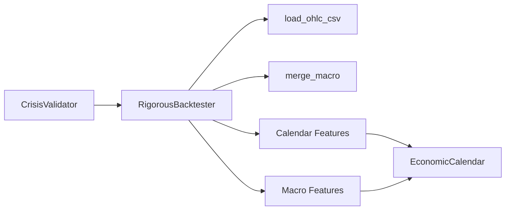

# Crisis Validation

<cite>
**Referenced Files in This Document**
- [crisis_validation.py](file://eval/crisis_validation.py)
- [backtest_engine.py](file://backtest/backtest_engine.py)
- [economic_calendar.py](file://data/economic_calendar.py)
- [calendar_features.py](file://features/calendar_features.py)
- [macro_features.py](file://features/macro_features.py)
- [merge_macro.py](file://data/merge_macro.py)
- [load_data.py](file://data/load_data.py)
- [eval_ppo.py](file://eval/eval_ppo.py)
</cite>

## Table of Contents
1. [Introduction](#introduction)
2. [Project Structure](#project-structure)
3. [Core Components](#core-components)
4. [Architecture Overview](#architecture-overview)
5. [Detailed Component Analysis](#detailed-component-analysis)
6. [Dependency Analysis](#dependency-analysis)
7. [Performance Considerations](#performance-considerations)
8. [Troubleshooting Guide](#troubleshooting-guide)
9. [Conclusion](#conclusion)
10. [Appendices](#appendices)

## Introduction
This document explains how the project validates model robustness during market crises and extreme volatility periods. It covers:
- How crisis periods are identified using economic indicators, VIX spikes, and historical crash windows
- The methodology for isolating stress periods and evaluating model performance under adverse conditions
- Practical steps to run crisis validation tests, interpret results, and compare normal vs. crisis performance
- Criteria used to define crisis periods and metrics to assess resilience
- Techniques to improve model resilience during market turmoil
- Why crisis validation is essential in production trading systems and how it complements regular backtesting

## Project Structure
The crisis validation workflow spans evaluation, data preparation, macro feature engineering, and rigorous backtesting:
- Evaluation layer: crisis-specific testing and comparison with baselines
- Data layer: loading OHLC and merging macro series into a unified dataset
- Feature layer: calendar-aware and macro-driven features that capture event risk and regime shifts
- Backtesting layer: realistic cost modeling, walk-forward validation, and comprehensive metrics

**Diagram sources**
- [crisis_validation.py:29-171](file://eval/crisis_validation.py#L29-L171)
- [backtest_engine.py:24-146](file://backtest/backtest_engine.py#L24-L146)
- [load_data.py:5-73](file://data/load_data.py#L5-L73)
- [merge_macro.py:4-56](file://data/merge_macro.py#L4-L56)
- [calendar_features.py:111-249](file://features/calendar_features.py#L111-L249)
- [macro_features.py:363-445](file://features/macro_features.py#L363-L445)
- [economic_calendar.py:27-234](file://data/economic_calendar.py#L27-L234)

**Section sources**
- [crisis_validation.py:29-171](file://eval/crisis_validation.py#L29-L171)
- [backtest_engine.py:24-146](file://backtest/backtest_engine.py#L24-L146)
- [load_data.py:5-73](file://data/load_data.py#L5-L73)
- [merge_macro.py:4-56](file://data/merge_macro.py#L4-L56)
- [calendar_features.py:111-249](file://features/calendar_features.py#L111-L249)
- [macro_features.py:363-445](file://features/macro_features.py#L363-L445)
- [economic_calendar.py:27-234](file://data/economic_calendar.py#L27-L234)

## Core Components
- CrisisValidator: Runs an agent across predefined crisis windows, computes equity curves, and evaluates pass/fail criteria tailored to stress periods.
- RigorousBacktester: Provides realistic backtesting with conservative costs, slippage, and comprehensive metrics; supports walk-forward validation.
- EconomicCalendar and Calendar Features: Track high-impact events and generate timing and volatility features around releases.
- Macro Features: Compute multi-asset features including VIX levels, changes, and regimes to signal fear/volatility environments.
- Data Utilities: Load and merge macro series into the primary time series to support feature computation and crisis windowing.

Key responsibilities:
- Identify and isolate crisis periods by date ranges and/or macro signals
- Run agents on those periods with realistic execution assumptions
- Measure survival, drawdown, risk-adjusted returns, and overtrading behavior
- Compare against baselines to contextualize performance

**Section sources**
- [crisis_validation.py:29-171](file://eval/crisis_validation.py#L29-L171)
- [backtest_engine.py:24-146](file://backtest/backtest_engine.py#L24-L146)
- [economic_calendar.py:27-234](file://data/economic_calendar.py#L27-L234)
- [calendar_features.py:111-249](file://features/calendar_features.py#L111-L249)
- [macro_features.py:363-445](file://features/macro_features.py#L363-L445)
- [load_data.py:5-73](file://data/load_data.py#L5-L73)
- [merge_macro.py:4-56](file://data/merge_macro.py#L4-L56)

## Architecture Overview
The system integrates crisis period selection, macro-aware features, and realistic backtesting to evaluate model resilience.

**Diagram sources**
- [crisis_validation.py:109-171](file://eval/crisis_validation.py#L109-L171)
- [backtest_engine.py:73-146](file://backtest/backtest_engine.py#L73-L146)
- [calendar_features.py:111-249](file://features/calendar_features.py#L111-L249)
- [macro_features.py:363-445](file://features/macro_features.py#L363-L445)

## Detailed Component Analysis

### Crisis Validator
- Purpose: Test an agent on known crisis periods and enforce survival and risk constraints.
- Crisis windows: Predefined historical episodes with severity labels and expected behaviors.
- Execution: Iterates through crisis windows, filters data, runs agent episode, computes equity curve and metrics, and evaluates pass/fail.
- Metrics: Final equity threshold, maximum drawdown limit, Sharpe ratio floor, and trade count cap to avoid churn.
- Output: Per-crisis results and overall pass rate summary.

**Diagram sources**
- [crisis_validation.py:109-171](file://eval/crisis_validation.py#L109-L171)
- [crisis_validation.py:236-317](file://eval/crisis_validation.py#L236-L317)

**Section sources**
- [crisis_validation.py:29-171](file://eval/crisis_validation.py#L29-L171)
- [crisis_validation.py:236-317](file://eval/crisis_validation.py#L236-L317)

### Rigorous Backtester
- Purpose: Provide realistic backtesting with conservative cost assumptions and comprehensive metrics.
- Cost model: Spread multiplier, slippage, commission; tracks entry/exit costs and equity impact.
- Walk-forward: Splits data into rolling train/test windows to simulate out-of-sample stability.
- Metrics: Total and annualized return, max drawdown, Sharpe/Sortino/Calmar ratios, win rate, profit factor, average duration, total costs.

**Diagram sources**
- [backtest_engine.py:24-146](file://backtest/backtest_engine.py#L24-L146)
- [backtest_engine.py:219-315](file://backtest/backtest_engine.py#L219-L315)

**Section sources**
- [backtest_engine.py:24-146](file://backtest/backtest_engine.py#L24-L146)
- [backtest_engine.py:219-315](file://backtest/backtest_engine.py#L219-L315)

### Economic Calendar and Calendar Features
- EconomicCalendar: Tracks scheduled high-impact events (NFP, CPI, FOMC, etc.), estimates expected volatility multipliers, and provides features like hours until event and event-window flags.
- Calendar Features: Computes timing and impact features aligned to timestamps, including event density and type flags (e.g., NFP/FOMC).

**Diagram sources**
- [economic_calendar.py:27-234](file://data/economic_calendar.py#L27-L234)
- [calendar_features.py:111-249](file://features/calendar_features.py#L111-L249)

**Section sources**
- [economic_calendar.py:27-234](file://data/economic_calendar.py#L27-L234)
- [calendar_features.py:111-249](file://features/calendar_features.py#L111-L249)

### Macro Features (Including VIX)
- Macro Features: Loads multiple macro series (DXY, SPX, US10Y, VIX, oil, BTC, EURUSD, silver/GLD), aligns to gold timestamps, and computes returns, momentum, and rolling correlations.
- VIX features: Level (normalized), daily change, and regime flag (>20 indicates elevated fear). These help identify stress periods and inform model behavior during crises.

**Diagram sources**
- [macro_features.py:26-75](file://features/macro_features.py#L26-L75)
- [macro_features.py:219-242](file://features/macro_features.py#L219-L242)
- [macro_features.py:363-445](file://features/macro_features.py#L363-L445)

**Section sources**
- [macro_features.py:26-75](file://features/macro_features.py#L26-L75)
- [macro_features.py:219-242](file://features/macro_features.py#L219-L242)
- [macro_features.py:363-445](file://features/macro_features.py#L363-L445)

### Data Loading and Merging
- load_ohlc_csv: Standardizes OHLC formats, handles MT5 bracket columns, ensures numeric types, sorts/deduplicates, and performs sanity checks.
- merge_macro: Merges daily macro series (e.g., DXY, SPX, US10Y) into hourly master data via forward fill to align frequencies.

**Diagram sources**
- [load_data.py:5-73](file://data/load_data.py#L5-L73)
- [merge_macro.py:4-56](file://data/merge_macro.py#L4-L56)

**Section sources**
- [load_data.py:5-73](file://data/load_data.py#L5-L73)
- [merge_macro.py:4-56](file://data/merge_macro.py#L4-L56)

### Baseline Comparison During Testing
- eval_ppo: Demonstrates running a trained PPO model on a test period and comparing against buy-and-hold and moving-average baselines, producing equity curves and position traces.

**Diagram sources**
- [eval_ppo.py:16-93](file://eval/eval_ppo.py#L16-L93)

**Section sources**
- [eval_ppo.py:16-93](file://eval/eval_ppo.py#L16-L93)

## Dependency Analysis
- CrisisValidator depends on:
  - Data availability (merged macro dataset)
  - Agent interface (act method)
  - Backtesting utilities for realistic execution and metrics
- Backtester depends on:
  - Data loader and merged macro series
  - Calendar and macro features to enrich observations and context
- Calendar and Macro features depend on:
  - Economic calendar definitions and macro price series
  - Time alignment utilities to match intraday timestamps

**Diagram sources**
- [crisis_validation.py:29-171](file://eval/crisis_validation.py#L29-L171)
- [backtest_engine.py:24-146](file://backtest/backtest_engine.py#L24-L146)
- [load_data.py:5-73](file://data/load_data.py#L5-L73)
- [merge_macro.py:4-56](file://data/merge_macro.py#L4-L56)
- [calendar_features.py:111-249](file://features/calendar_features.py#L111-L249)
- [macro_features.py:363-445](file://features/macro_features.py#L363-L445)
- [economic_calendar.py:27-234](file://data/economic_calendar.py#L27-L234)

**Section sources**
- [crisis_validation.py:29-171](file://eval/crisis_validation.py#L29-L171)
- [backtest_engine.py:24-146](file://backtest/backtest_engine.py#L24-L146)
- [load_data.py:5-73](file://data/load_data.py#L5-L73)
- [merge_macro.py:4-56](file://data/merge_macro.py#L4-L56)
- [calendar_features.py:111-249](file://features/calendar_features.py#L111-L249)
- [macro_features.py:363-445](file://features/macro_features.py#L363-L445)
- [economic_calendar.py:27-234](file://data/economic_calendar.py#L27-L234)

## Performance Considerations
- Realistic costs: The backtester applies spread multipliers, slippage, and commissions to avoid optimistic bias.
- Conservative defaults: Higher spreads and slippage ensure models survive live deployment frictions.
- Walk-forward validation: Rolling windows reduce overfitting and reveal stability across regimes.
- Feature quality: Calendar and macro features improve regime awareness; missing or misaligned data can degrade performance.
- Data frequency: Macro series are daily but aligned to intraday via forward fill; ensure sufficient coverage to avoid gaps.

[No sources needed since this section provides general guidance]

## Troubleshooting Guide
Common issues and resolutions:
- Missing data file: Ensure the merged macro dataset exists at the expected path; otherwise, crisis validation will skip periods.
- Time column mismatch: Confirm the dataset has a proper time column; without it, filtering by crisis windows fails.
- Macro files not found: If macro CSVs are missing, macro features will be incomplete; add required files or handle warnings gracefully.
- Event calendar missing: Without an economic calendar file, calendar features default to neutral values; provide a calendar JSON to enable event-aware features.
- Agent interface errors: The validator expects an agent.act method; implement or mock it to proceed.

**Section sources**
- [crisis_validation.py:78-107](file://eval/crisis_validation.py#L78-L107)
- [calendar_features.py:23-50](file://features/calendar_features.py#L23-L50)
- [macro_features.py:26-75](file://features/macro_features.py#L26-L75)
- [load_data.py:5-73](file://data/load_data.py#L5-L73)

## Conclusion
Crisis validation ensures that trading models can withstand extreme market conditions by testing them against known stress periods and measuring survival, drawdown control, risk-adjusted returns, and trading discipline. Combined with realistic backtesting and macro-aware features, it complements regular backtesting by exposing weaknesses that only appear under stress. Integrating economic calendars and VIX-based regime detection further strengthens resilience by making models aware of upcoming high-impact events and elevated fear environments.

[No sources needed since this section summarizes without analyzing specific files]

## Appendices

### Defining Crisis Periods and Stress Signals
- Historical windows: Use predefined crisis windows with start/end dates and severity labels to isolate stress periods.
- Economic indicators: Incorporate high-impact event flags and expected volatility multipliers from the economic calendar.
- VIX regime: Use VIX level and change features to detect fear spikes; treat elevated VIX as a stress signal.

**Section sources**
- [crisis_validation.py:42-76](file://eval/crisis_validation.py#L42-L76)
- [economic_calendar.py:57-67](file://data/economic_calendar.py#L57-L67)
- [macro_features.py:219-242](file://features/macro_features.py#L219-L242)

### Running Crisis Validation Tests
Steps:
- Prepare data: Ensure the merged macro dataset exists and contains a valid time column.
- Initialize validator: Create a CrisisValidator instance pointing to your data path.
- Provide an agent: Implement an agent with an act method that takes observations and returns actions.
- Execute validation: Call validate_all_crises to run tests across all defined crisis windows.
- Interpret results: Review per-crisis pass/fail status, final equity, drawdown, Sharpe, and trade counts.

**Section sources**
- [crisis_validation.py:78-171](file://eval/crisis_validation.py#L78-L171)

### Interpreting Stress Test Results
- Survival: Final equity must remain above a minimum threshold to avoid catastrophic loss.
- Drawdown: Maximum drawdown should stay within acceptable limits to preserve capital.
- Risk-adjusted returns: Sharpe ratio should meet a minimum floor to avoid poor risk-return profiles.
- Overtrading: Limit excessive trades to prevent churn and unnecessary costs.

**Section sources**
- [crisis_validation.py:236-317](file://eval/crisis_validation.py#L236-L317)

### Comparing Normal vs. Crisis Performance
- Use the same agent and data pipeline to run standard backtests and crisis-specific tests.
- Compare equity curves, drawdowns, and risk metrics between normal and crisis periods.
- Leverage baseline comparisons (buy-and-hold, moving averages) to contextualize relative performance.

**Section sources**
- [eval_ppo.py:45-93](file://eval/eval_ppo.py#L45-L93)
- [backtest_engine.py:219-315](file://backtest/backtest_engine.py#L219-L315)

### Improving Model Resilience During Turmoil
- Enhance features: Include calendar and macro features to anticipate event-driven volatility and regime shifts.
- Adjust risk controls: Tighten position sizing and stop-loss logic during high-volatility regimes.
- Validate rigorously: Use walk-forward validation and conservative cost assumptions to stress-test strategies.
- Monitor VIX: Treat elevated VIX as a trigger for defensive behavior or reduced exposure.

**Section sources**
- [calendar_features.py:111-249](file://features/calendar_features.py#L111-L249)
- [macro_features.py:363-445](file://features/macro_features.py#L363-L445)
- [backtest_engine.py:24-146](file://backtest/backtest_engine.py#L24-L146)