# Evaluation and Backtesting

<cite>
**Referenced Files in This Document**
- [backtest_engine.py](file://backtest/backtest_engine.py)
- [realistic_execution.py](file://env/realistic_execution.py)
- [xauusd_env.py](file://env/xauusd_env.py)
- [crisis_validation.py](file://eval/crisis_validation.py)
- [analyze_dreamer.py](file://eval/analyze_dreamer.py)
- [eval_ppo.py](file://eval/eval_ppo.py)
- [baselines.py](file://eval/baselines.py)
- [quick_test.py](file://eval/quick_test.py)
- [evaluate_model.py](file://evaluate_model.py)
</cite>

## Table of Contents
1. Introduction
2. Project Structure
3. Core Components
4. Architecture Overview
5. Detailed Component Analysis
6. Dependency Analysis
7. Performance Considerations
8. Troubleshooting Guide
9. Conclusion
10. Appendices

## Introduction
This document explains the evaluation and backtesting framework for a gold (XAUUSD) trading system that uses Deep Reinforcement Learning (PPO and Dreamer V3). It focuses on:
- Realistic cost modeling, slippage simulation, and performance metrics
- Crisis validation procedures to test robustness during market crashes
- Baseline comparisons against buy-and-hold and simple strategies
- Specialized analysis tools for Dreamer V3 world model diagnostics
- Practical examples for running backtests, interpreting results, and comparing strategies
- The relationship between backtesting and live trading (slippage, spread costs, execution latency)
- Common pitfalls: overfitting detection, look-ahead bias prevention, statistical significance testing
- Optimization techniques for large-scale backtesting and visualization tools

## Project Structure
The evaluation and backtesting capabilities are implemented across several modules:
- Backtesting engine with conservative cost assumptions and walk-forward validation
- Realistic execution model with dynamic spread, slippage, market impact, and adverse selection
- Trading environments for PPO and Dreamer evaluations
- Crisis validation tooling for known historical stress periods
- Baseline strategy implementations for comparison
- Specialized analysis scripts for Dreamer V3 internals (reconstruction, reward prediction, latent space)

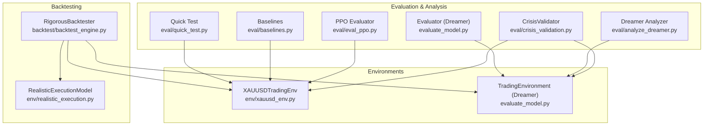

**Diagram sources**
- [backtest_engine.py:24-146](file://backtest/backtest_engine.py#L24-L146)
- [realistic_execution.py:24-199](file://env/realistic_execution.py#L24-L199)
- [xauusd_env.py:7-118](file://env/xauusd_env.py#L7-L118)
- [crisis_validation.py:29-171](file://eval/crisis_validation.py#L29-L171)
- [analyze_dreamer.py:23-142](file://eval/analyze_dreamer.py#L23-L142)
- [eval_ppo.py:16-93](file://eval/eval_ppo.py#L16-L93)
- [baselines.py:7-53](file://eval/baselines.py#L7-L53)
- [quick_test.py:10-68](file://eval/quick_test.py#L10-L68)
- [evaluate_model.py:28-161](file://evaluate_model.py#L28-L161)

**Section sources**
- [backtest_engine.py:24-146](file://backtest/backtest_engine.py#L24-L146)
- [realistic_execution.py:24-199](file://env/realistic_execution.py#L24-L199)
- [xauusd_env.py:7-118](file://env/xauusd_env.py#L7-L118)
- [crisis_validation.py:29-171](file://eval/crisis_validation.py#L29-L171)
- [analyze_dreamer.py:23-142](file://eval/analyze_dreamer.py#L23-L142)
- [eval_ppo.py:16-93](file://eval/eval_ppo.py#L16-L93)
- [baselines.py:7-53](file://eval/baselines.py#L7-L53)
- [quick_test.py:10-68](file://eval/quick_test.py#L10-L68)
- [evaluate_model.py:28-161](file://evaluate_model.py#L28-L161)

## Core Components
- RigorousBacktester: A conservative backtesting engine that applies pessimistic cost assumptions, computes comprehensive metrics, and supports walk-forward validation.
- RealisticExecutionModel: Models spread widening under volatility/events, slippage scaling, commissions, market impact, and adverse selection; provides fill price adjustments and statistics.
- XAUUSDTradingEnv: Gymnasium environment implementing discrete actions (flat/long), position application on next step to avoid look-ahead bias, and reward accounting including trade costs and turnover penalties.
- CrisisValidator: Tests agents over predefined crisis windows, enforces pass/fail criteria (survival, drawdown limits, Sharpe thresholds, overtrading checks), and prints detailed summaries.
- Baselines: Implements buy-and-hold, random policy, and moving average crossover baselines for comparative equity curves.
- PPO Evaluator: Runs a trained PPO model on a test period, compares equity curves to baselines, and plots positions and equity.
- Dreamer Analyzer: Evaluates reconstruction quality, reward prediction accuracy, latent space clustering, and compares Dreamer vs random agent performance.
- Quick Test: Executes a swing-trader PPO model on recent data and reports key statistics.
- Evaluate Model (Dreamer): Loads features, runs a Dreamer V3 agent on selected periods, computes metrics, and saves visualizations and CSV outputs.

**Section sources**
- [backtest_engine.py:24-146](file://backtest/backtest_engine.py#L24-L146)
- [realistic_execution.py:24-199](file://env/realistic_execution.py#L24-L199)
- [xauusd_env.py:7-118](file://env/xauusd_env.py#L7-L118)
- [crisis_validation.py:29-171](file://eval/crisis_validation.py#L29-L171)
- [baselines.py:7-53](file://eval/baselines.py#L7-L53)
- [eval_ppo.py:16-93](file://eval/eval_ppo.py#L16-L93)
- [analyze_dreamer.py:23-142](file://eval/analyze_dreamer.py#L23-L142)
- [quick_test.py:10-68](file://eval/quick_test.py#L10-L68)
- [evaluate_model.py:28-161](file://evaluate_model.py#L28-L161)

## Architecture Overview
The evaluation pipeline integrates backtesting, realistic execution, and specialized analyses:

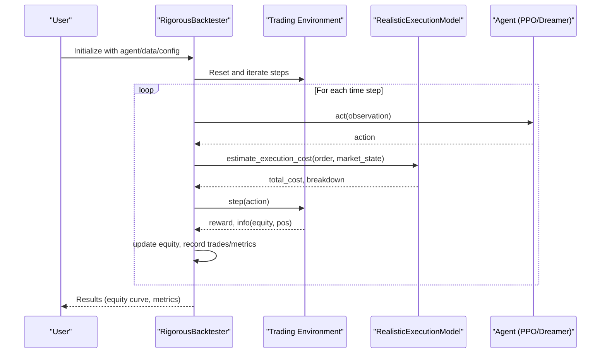

**Diagram sources**
- [backtest_engine.py:73-146](file://backtest/backtest_engine.py#L73-L146)
- [realistic_execution.py:88-169](file://env/realistic_execution.py#L88-L169)
- [xauusd_env.py:75-118](file://env/xauusd_env.py#L75-L118)

## Detailed Component Analysis

### Backtesting Engine: RigorousBacktester
- Conservative defaults: spread multiplier, slippage, commission, initial capital
- Walk-forward validation: rolling train/test windows to simulate realistic retraining/testing cycles
- Metrics: total return, annualized return, max drawdown, Sharpe, Sortino, Calmar, win rate, profit factor, avg duration, total costs
- Cost computation: combines spread, slippage, and commission per trade

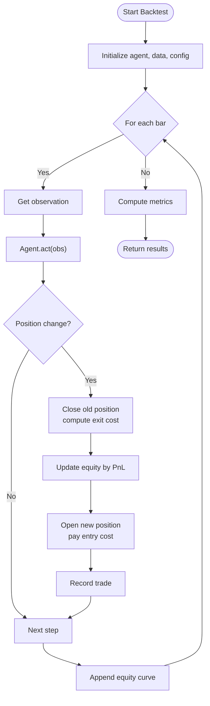

**Diagram sources**
- [backtest_engine.py:73-146](file://backtest/backtest_engine.py#L73-L146)
- [backtest_engine.py:202-217](file://backtest/backtest_engine.py#L202-L217)
- [backtest_engine.py:219-254](file://backtest/backtest_engine.py#L219-L254)

**Section sources**
- [backtest_engine.py:24-146](file://backtest/backtest_engine.py#L24-L146)
- [backtest_engine.py:148-195](file://backtest/backtest_engine.py#L148-L195)
- [backtest_engine.py:202-217](file://backtest/backtest_engine.py#L202-L217)
- [backtest_engine.py:219-360](file://backtest/backtest_engine.py#L219-L360)

### Realistic Execution Model
- Dynamic spread widening based on volatility ratio and event windows
- Slippage scaling with volatility and order type; includes randomness and occasional price improvement
- Market impact for large orders relative to liquidity
- Adverse selection cost component
- Statistics tracking: total trades, average cost per trade, cost breakdown

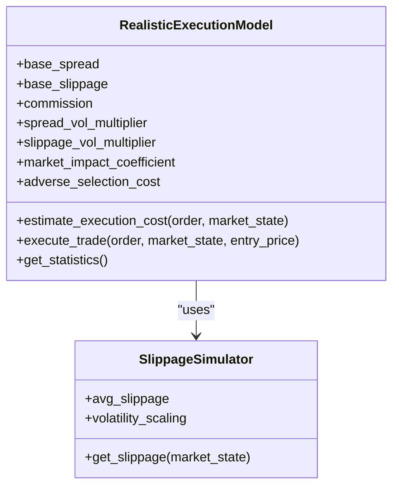

**Diagram sources**
- [realistic_execution.py:24-229](file://env/realistic_execution.py#L24-L229)
- [realistic_execution.py:232-275](file://env/realistic_execution.py#L232-L275)

**Section sources**
- [realistic_execution.py:24-229](file://env/realistic_execution.py#L24-L229)
- [realistic_execution.py:232-275](file://env/realistic_execution.py#L232-L275)

### Trading Environments
- XAUUSDTradingEnv: Discrete actions (flat/long), next-step position application to prevent look-ahead bias, reward includes PnL minus trade costs and turnover penalties, plus flat penalty and hold bonus for stability.
- TradingEnvironment (Dreamer): Simple environment used by evaluate_model.py for Dreamer V3 evaluation with cost-aware rewards and equity updates.

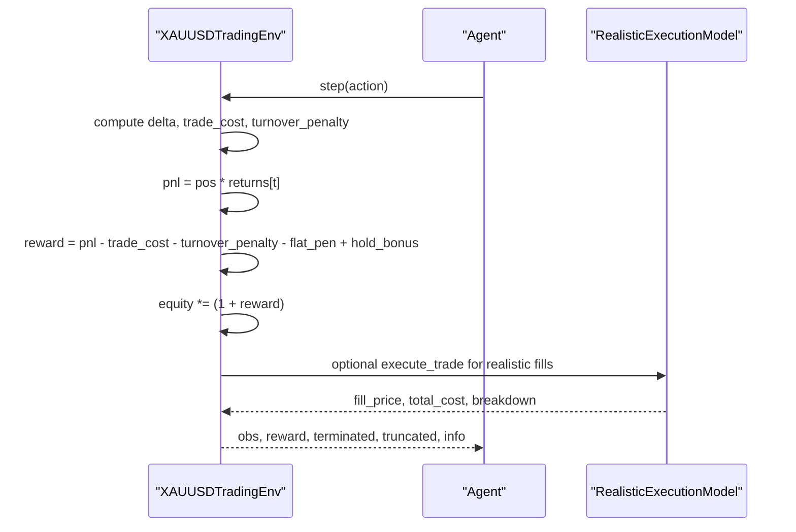

**Diagram sources**
- [xauusd_env.py:75-118](file://env/xauusd_env.py#L75-L118)
- [realistic_execution.py:171-199](file://env/realistic_execution.py#L171-L199)

**Section sources**
- [xauusd_env.py:7-118](file://env/xauusd_env.py#L7-L118)
- [evaluate_model.py:28-77](file://evaluate_model.py#L28-L77)

### Crisis Validation
- Predefined crisis periods with severity and expected behavior notes
- Filtering data by date ranges, running episodes, computing metrics, and applying pass/fail criteria
- Summary reporting with pass rates and failure reasons

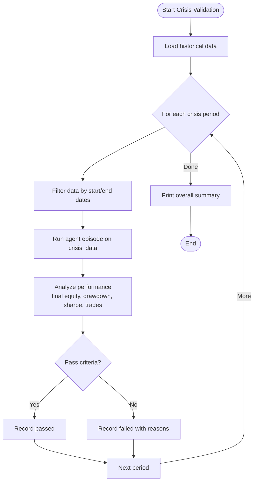

**Diagram sources**
- [crisis_validation.py:109-171](file://eval/crisis_validation.py#L109-L171)
- [crisis_validation.py:173-234](file://eval/crisis_validation.py#L173-L234)
- [crisis_validation.py:236-317](file://eval/crisis_validation.py#L236-L317)

**Section sources**
- [crisis_validation.py:29-171](file://eval/crisis_validation.py#L29-L171)
- [crisis_validation.py:173-317](file://eval/crisis_validation.py#L173-L317)

### Baseline Comparisons
- Buy-and-hold baseline using cumulative returns
- Random policy baseline for long/flat/short
- Moving average crossover (20/50) with look-ahead avoidance via shift
- Equity curves plotted for comparison

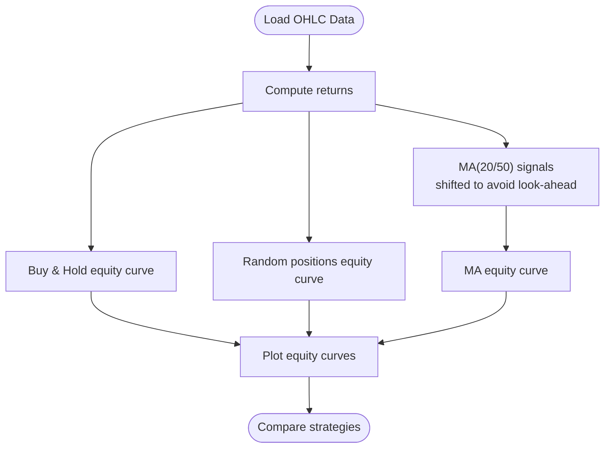

**Diagram sources**
- [baselines.py:7-53](file://eval/baselines.py#L7-L53)

**Section sources**
- [baselines.py:7-53](file://eval/baselines.py#L7-L53)

### PPO Evaluation
- Loads features, splits into test set, creates environment, loads PPO model
- Runs deterministic roll-out, tracks equity and positions
- Computes baseline equity curves on same test period
- Prints final equity, trades, exposure, and plots equity curves and positions

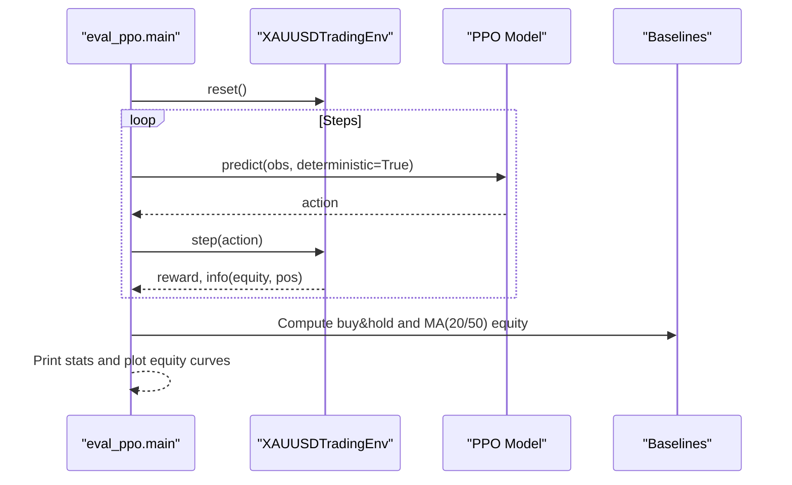

**Diagram sources**
- [eval_ppo.py:16-93](file://eval/eval_ppo.py#L16-L93)
- [baselines.py:7-53](file://eval/baselines.py#L7-L53)

**Section sources**
- [eval_ppo.py:16-93](file://eval/eval_ppo.py#L16-L93)
- [baselines.py:7-53](file://eval/baselines.py#L7-L53)

### Dreamer V3 Analysis Tools
- Reconstruction error analysis: measures how well the world model reconstructs observations
- Reward prediction accuracy: correlation between predicted and true rewards
- Latent space visualization: PCA to reveal market regimes colored by positions and rewards
- Comparison with random agent: validates learned behavior beyond chance

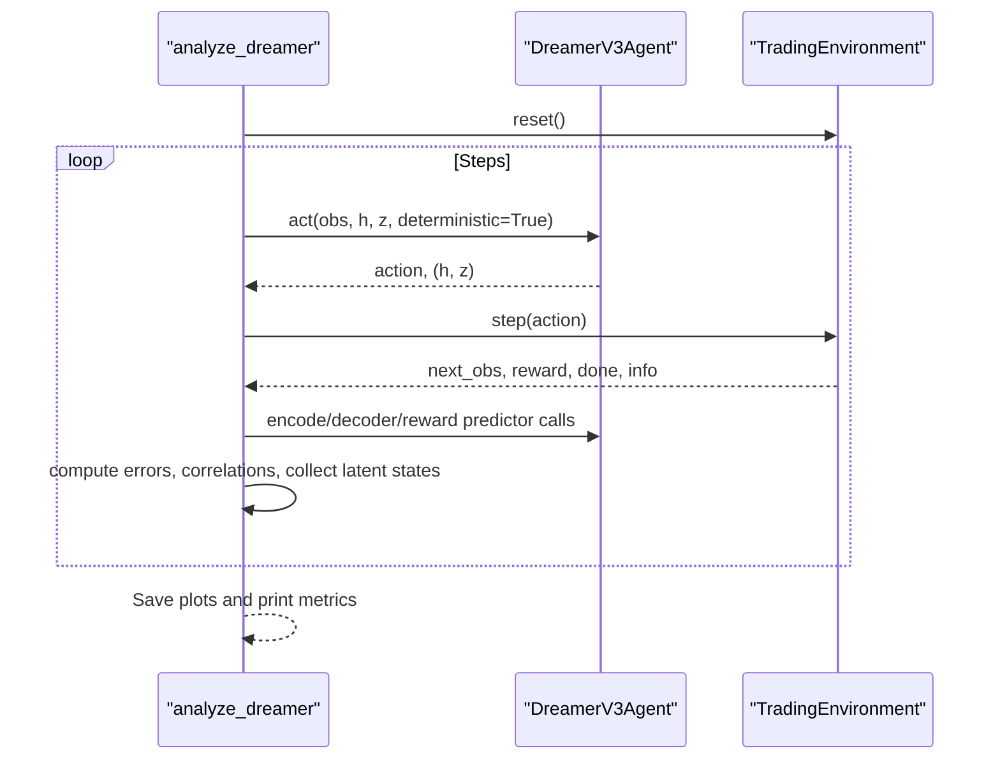

**Diagram sources**
- [analyze_dreamer.py:23-142](file://eval/analyze_dreamer.py#L23-L142)
- [analyze_dreamer.py:145-216](file://eval/analyze_dreamer.py#L145-L216)
- [analyze_dreamer.py:219-275](file://eval/analyze_dreamer.py#L219-L275)

**Section sources**
- [analyze_dreamer.py:23-142](file://eval/analyze_dreamer.py#L23-L142)
- [analyze_dreamer.py:145-216](file://eval/analyze_dreamer.py#L145-L216)
- [analyze_dreamer.py:219-275](file://eval/analyze_dreamer.py#L219-L275)

### Quick Test and Full Evaluation
- Quick test: runs a swing-trader PPO model on recent data and prints final equity, return, trades, and exposure percentages
- Full evaluation: loads ultimate features, selects periods (validation/test/all), evaluates Dreamer V3, prints metrics, plots results, and saves CSV

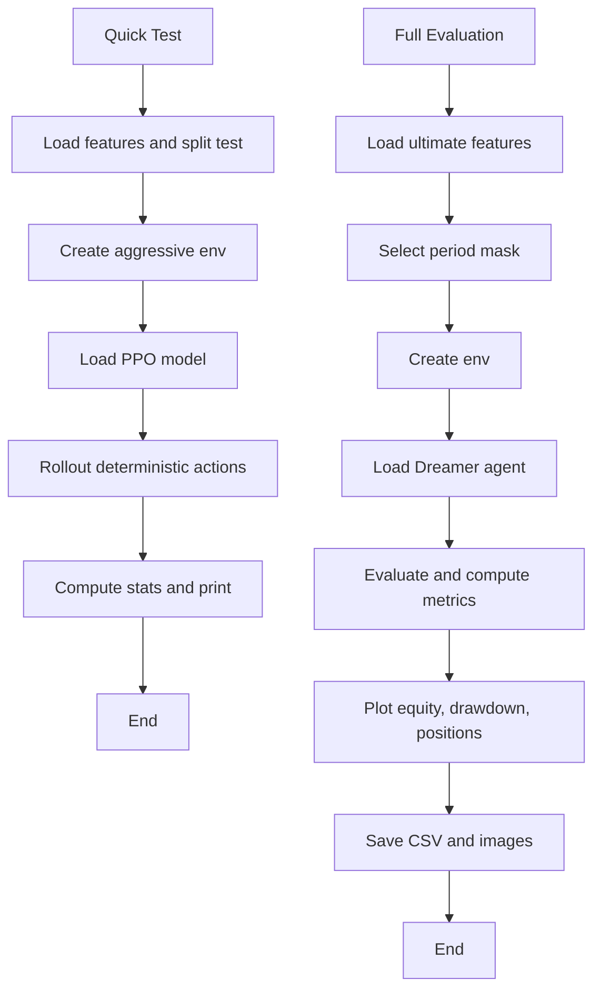

**Diagram sources**
- [quick_test.py:10-68](file://eval/quick_test.py#L10-L68)
- [evaluate_model.py:218-306](file://evaluate_model.py#L218-L306)

**Section sources**
- [quick_test.py:10-68](file://eval/quick_test.py#L10-L68)
- [evaluate_model.py:218-306](file://evaluate_model.py#L218-L306)

## Dependency Analysis
Key dependencies and relationships:
- Backtesting depends on agent interface and environment step semantics
- Realistic execution is integrated into environments or backtests to adjust fills and track costs
- Crisis validation requires historical data covering specific periods and an agent with act method
- Baselines depend on OHLC data and simple signal logic
- PPO evaluation depends on stable-baselines3 models and feature pipelines
- Dreamer analysis depends on PyTorch, sklearn, and matplotlib for diagnostics

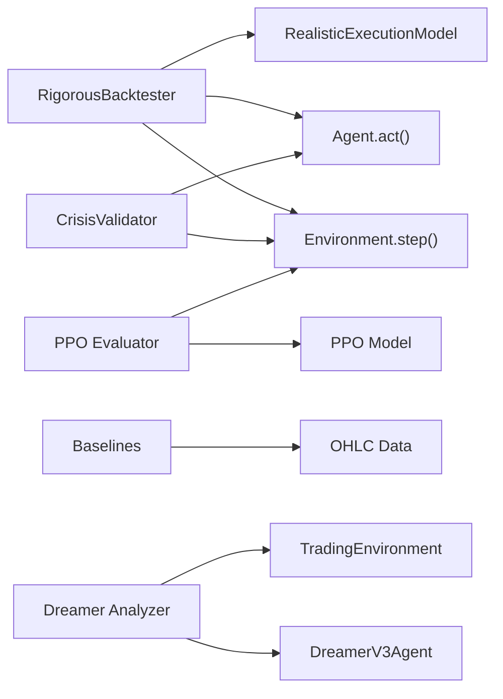

**Diagram sources**
- [backtest_engine.py:73-146](file://backtest/backtest_engine.py#L73-L146)
- [crisis_validation.py:109-171](file://eval/crisis_validation.py#L109-L171)
- [eval_ppo.py:16-93](file://eval/eval_ppo.py#L16-L93)
- [baselines.py:7-53](file://eval/baselines.py#L7-L53)
- [analyze_dreamer.py:23-142](file://eval/analyze_dreamer.py#L23-L142)

**Section sources**
- [backtest_engine.py:73-146](file://backtest/backtest_engine.py#L73-L146)
- [crisis_validation.py:109-171](file://eval/crisis_validation.py#L109-L171)
- [eval_ppo.py:16-93](file://eval/eval_ppo.py#L16-L93)
- [baselines.py:7-53](file://eval/baselines.py#L7-L53)
- [analyze_dreamer.py:23-142](file://eval/analyze_dreamer.py#L23-L142)

## Performance Considerations
- Use walk-forward validation to avoid overfitting to a single train/test split
- Apply realistic execution costs consistently during training and evaluation to reduce optimism bias
- Monitor cost breakdowns (spread, slippage, commission, market impact, adverse selection) to identify dominant cost drivers
- Prefer larger sample sizes and multiple crisis periods for robustness assessment
- Optimize backtesting loops by vectorizing where possible and minimizing object allocations
- Use deterministic evaluation for reproducibility and compare against baselines on identical test sets

[No sources needed since this section provides general guidance]

## Troubleshooting Guide
Common issues and resolutions:
- Missing data for crisis periods: ensure historical data covers required date ranges and contains a time column
- Agent lacks act method: implement a consistent interface or handle gracefully in crisis validation
- Import errors for sklearn/matplotlib: install required packages before running Dreamer analysis
- Look-ahead bias: verify environments apply positions on the next step and shift signals appropriately
- Overfitting detection: check consistency across walk-forward windows and crisis periods; if performance drops significantly on unseen data, reduce model complexity or increase regularization
- Statistical significance: use multiple out-of-sample periods and bootstrapping to assess whether improvements over baselines are significant

**Section sources**
- [crisis_validation.py:95-107](file://eval/crisis_validation.py#L95-L107)
- [crisis_validation.py:149-165](file://eval/crisis_validation.py#L149-L165)
- [analyze_dreamer.py:317-340](file://eval/analyze_dreamer.py#L317-L340)
- [xauusd_env.py:75-118](file://env/xauusd_env.py#L75-L118)
- [baselines.py:27-35](file://eval/baselines.py#L27-L35)

## Conclusion
The framework provides a rigorous, realistic evaluation pipeline:
- Backtesting with conservative cost assumptions and comprehensive metrics
- Realistic execution modeling to bridge the gap between backtests and live trading
- Crisis validation to ensure robustness under extreme market conditions
- Baseline comparisons and specialized analysis tools for both PPO and Dreamer V3
- Practical workflows for running tests, interpreting results, and optimizing performance

Adopt these practices to minimize overoptimism, detect overfitting, and improve confidence in live trading outcomes.

[No sources needed since this section summarizes without analyzing specific files]

## Appendices

### Practical Examples
- Running a backtest: initialize RigorousBacktester with agent and data, call run_backtest, inspect metrics and equity curve
- Crisis validation: load data, instantiate CrisisValidator, run validate_all_crises with an agent, review pass/fail summary
- PPO evaluation: load features, create environment, load PPO model, run deterministic rollout, compare equity curves to baselines
- Dreamer analysis: load checkpoint, run reconstruction, reward prediction, latent space visualization, and compare with random agent
- Quick test: load swing-trader PPO model, run on recent data, print final equity and exposure

**Section sources**
- [backtest_engine.py:393-423](file://backtest/backtest_engine.py#L393-L423)
- [crisis_validation.py:397-419](file://eval/crisis_validation.py#L397-L419)
- [eval_ppo.py:16-93](file://eval/eval_ppo.py#L16-L93)
- [analyze_dreamer.py:278-351](file://eval/analyze_dreamer.py#L278-L351)
- [quick_test.py:10-68](file://eval/quick_test.py#L10-L68)

### Relationship Between Backtesting and Live Trading
- Slippage: modeled dynamically and scaled with volatility; live markets may exhibit higher slippage due to latency and liquidity constraints
- Spread costs: backtests widen spreads conservatively; live spreads can widen further during events
- Execution latency: delays between signal and fill can degrade performance; incorporate latency-aware execution models when possible
- Market impact: large orders move prices; backtests should account for position size relative to liquidity
- Adverse selection: informed traders may take the other side; include adverse selection costs in evaluation

**Section sources**
- [realistic_execution.py:24-199](file://env/realistic_execution.py#L24-L199)
- [README.md:613-639](file://README.md#L613-L639)

### Avoiding Common Pitfalls
- Overfitting detection: use walk-forward validation, multiple out-of-sample periods, and crisis tests; monitor degradation in performance on unseen data
- Look-ahead bias prevention: ensure environments apply positions on the next step and shift signals; verify feature construction does not leak future information
- Statistical significance testing: compare strategies using multiple periods and resampling methods; report confidence intervals for key metrics

**Section sources**
- [backtest_engine.py:148-195](file://backtest/backtest_engine.py#L148-L195)
- [xauusd_env.py:75-118](file://env/xauusd_env.py#L75-L118)
- [baselines.py:27-35](file://eval/baselines.py#L27-L35)

### Visualization Tools
- Equity curves and drawdown plots for backtests and evaluations
- Position timelines to interpret strategy behavior
- Latent space scatter plots colored by positions and rewards for Dreamer V3
- Reward prediction correlation plots to assess world model quality

**Section sources**
- [eval_ppo.py:72-89](file://eval/eval_ppo.py#L72-L89)
- [evaluate_model.py:164-199](file://evaluate_model.py#L164-L199)
- [analyze_dreamer.py:118-142](file://eval/analyze_dreamer.py#L118-L142)
- [analyze_dreamer.py:195-216](file://eval/analyze_dreamer.py#L195-L216)