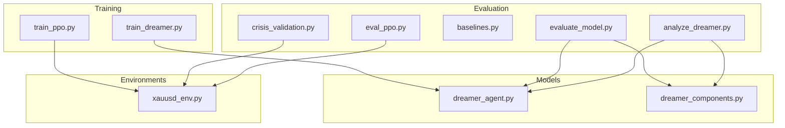
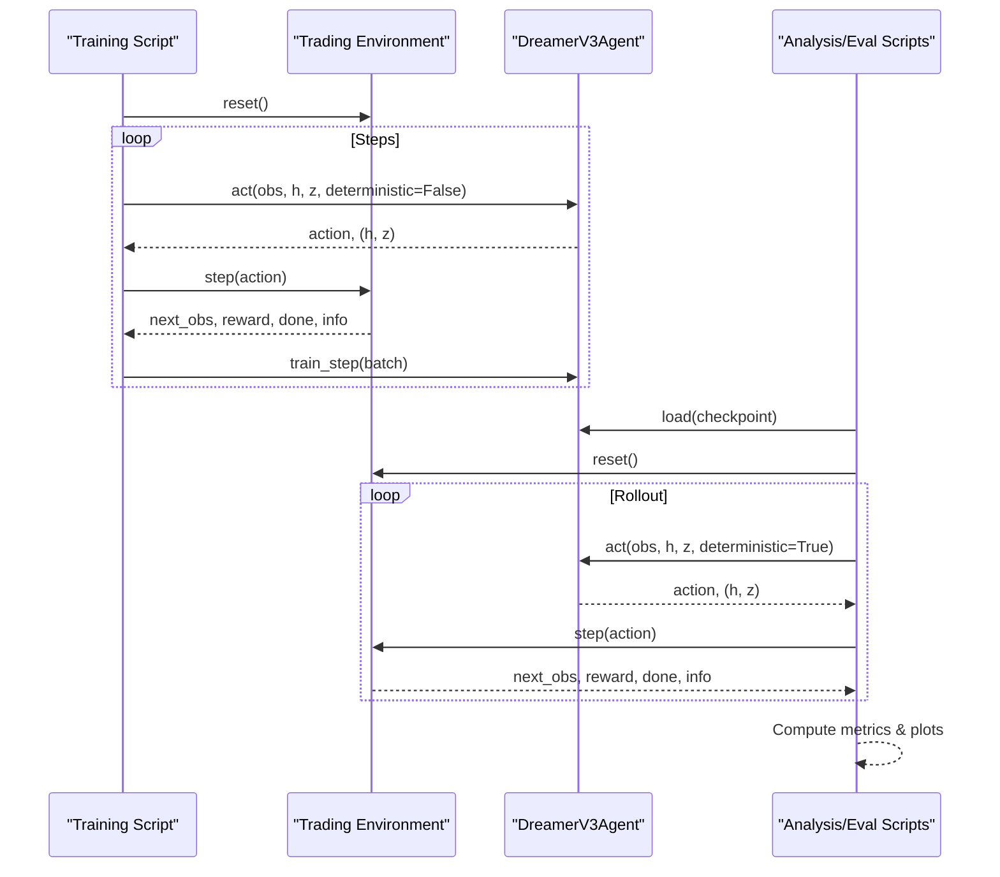
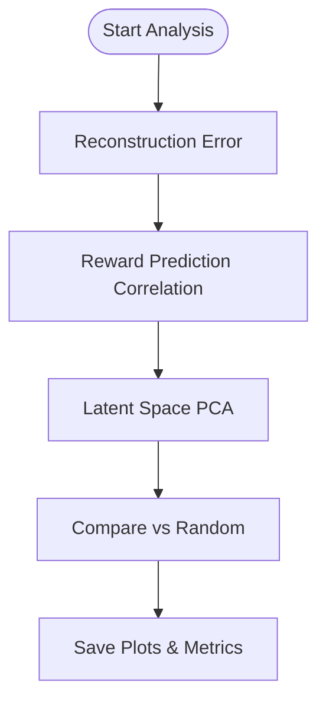
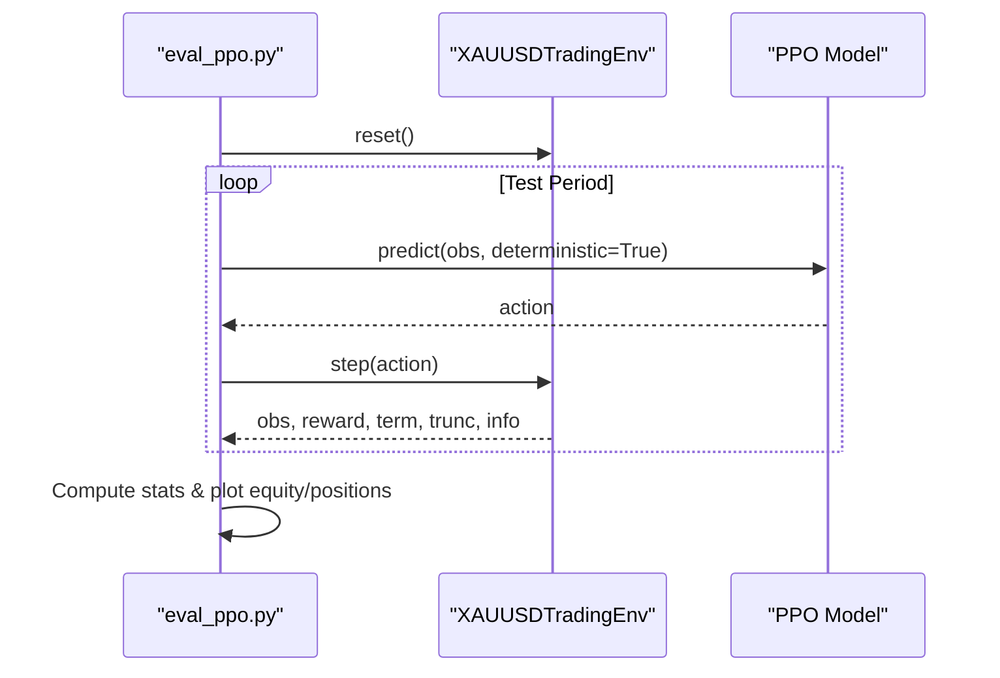
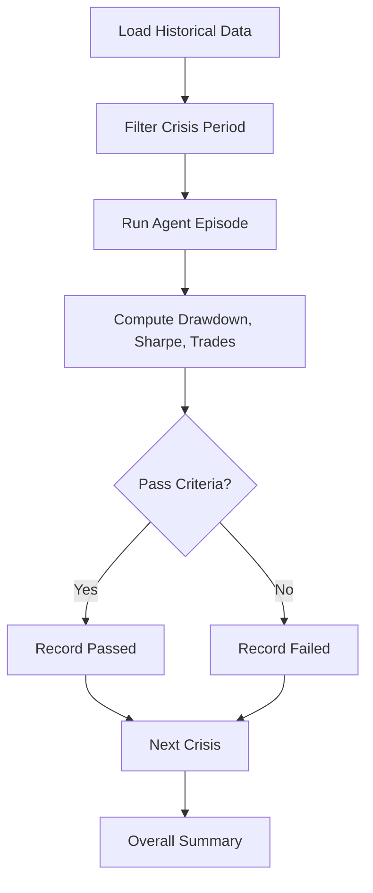
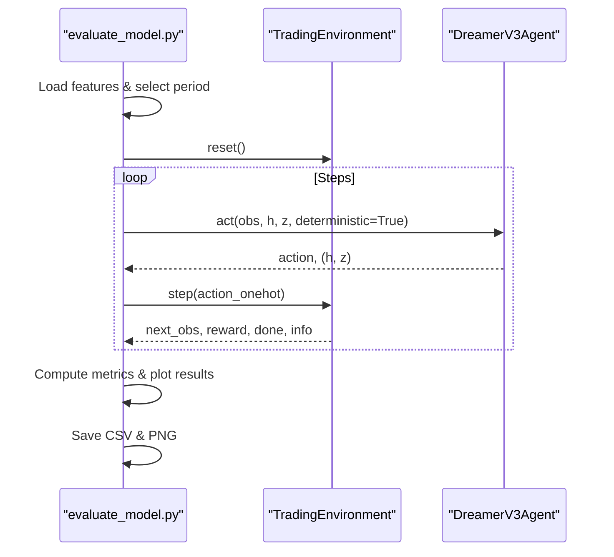
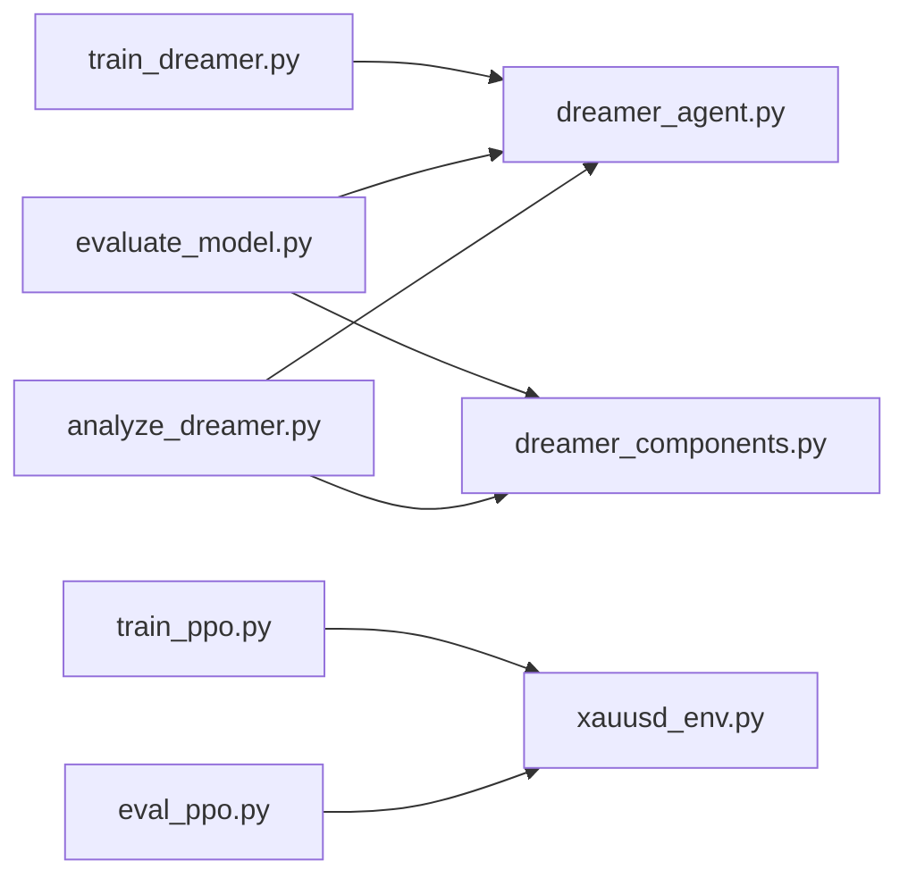

# Performance Analysis

<cite>
**Referenced Files in This Document**
- [analyze_dreamer.py](file://eval/analyze_dreamer.py)
- [eval_ppo.py](file://eval/eval_ppo.py)
- [baselines.py](file://eval/baselines.py)
- [crisis_validation.py](file://eval/crisis_validation.py)
- [evaluate_model.py](file://evaluate_model.py)
- [dreamer_agent.py](file://models/dreamer_agent.py)
- [dreamer_components.py](file://models/dreamer_components.py)
- [train_dreamer.py](file://train/train_dreamer.py)
- [train_ppo.py](file://train/train_ppo.py)
- [xauusd_env.py](file://env/xauusd_env.py)
</cite>

## Table of Contents
1. [Introduction](#introduction)
2. [Project Structure](#project-structure)
3. [Core Components](#core-components)
4. [Architecture Overview](#architecture-overview)
5. [Detailed Component Analysis](#detailed-component-analysis)
6. [Dependency Analysis](#dependency-analysis)
7. [Performance Considerations](#performance-considerations)
8. [Troubleshooting Guide](#troubleshooting-guide)
9. [Conclusion](#conclusion)
10. [Appendices](#appendices)

## Introduction
This document explains how to perform specialized performance analysis for Dreamer and PPO trading models in this repository. It focuses on:
- Extracting insights from trained models (action distribution, state-value evaluation, policy improvement tracking)
- Interpreting model-specific metrics
- Diagnosing training issues
- Running practical analyses and generating diagnostic reports
- Using visualization tools to understand behavior, detect overfitting, and compare algorithm implementations
- Advanced techniques to understand decision-making and refine strategy

The goal is to help you evaluate and improve both the DreamerV3 world-model-based agent and the PPO baseline using consistent, reproducible workflows.

## Project Structure
The performance analysis capability spans evaluation scripts, model components, environments, and training routines:
- Evaluation and diagnostics: eval/*
- Models: models/*
- Environments: env/*
- Training: train/*

**Diagram sources**
- [analyze_dreamer.py:1-351](file://eval/analyze_dreamer.py#L1-L351)
- [eval_ppo.py:1-94](file://eval/eval_ppo.py#L1-L94)
- [baselines.py:1-54](file://eval/baselines.py#L1-L54)
- [crisis_validation.py:1-419](file://eval/crisis_validation.py#L1-L419)
- [evaluate_model.py:1-306](file://evaluate_model.py#L1-L306)
- [dreamer_agent.py:1-460](file://models/dreamer_agent.py#L1-L460)
- [dreamer_components.py:1-338](file://models/dreamer_components.py#L1-L338)
- [xauusd_env.py:1-118](file://env/xauusd_env.py#L1-L118)
- [train_dreamer.py:1-331](file://train/train_dreamer.py#L1-L331)
- [train_ppo.py:1-93](file://train/train_ppo.py#L1-L93)

**Section sources**
- [analyze_dreamer.py:1-351](file://eval/analyze_dreamer.py#L1-L351)
- [eval_ppo.py:1-94](file://eval/eval_ppo.py#L1-L94)
- [dreamer_agent.py:1-460](file://models/dreamer_agent.py#L1-L460)
- [dreamer_components.py:1-338](file://models/dreamer_components.py#L1-L338)
- [train_dreamer.py:1-331](file://train/train_dreamer.py#L1-L331)
- [train_ppo.py:1-93](file://train/train_ppo.py#L1-L93)
- [xauusd_env.py:1-118](file://env/xauusd_env.py#L1-L118)

## Core Components
- DreamerV3 Agent: Implements a world model with encoder, RSSM (recurrent state space model), decoder, reward predictor, actor, and critic. Provides act() for inference and train_step() for learning with imagination-based planning.
- DreamerV3 Components: Neural modules including Encoder, RSSM, Decoder, RewardPredictor, Actor, Critic, plus symlog/symexp transformations and normalization utilities.
- PPO Baseline: Uses stable-baselines3 PPO with a custom XAUUSD environment; supports multi-environment training and evaluation.
- Environments: Discrete action spaces for long-only or flat positions with cost-aware rewards and equity tracking.
- Evaluation Tools:
  - analyze_dreamer.py: Reconstruction error, reward prediction accuracy, latent space PCA, random-agent comparison.
  - eval_ppo.py: Test-period rollout, equity curves, position plots, baseline comparisons.
  - baselines.py: Buy-and-hold, random policy, moving-average crossover baselines.
  - crisis_validation.py: Stress-test across historical crises with pass/fail criteria.
  - evaluate_model.py: End-to-end evaluation pipeline with metrics and visualizations.

**Section sources**
- [dreamer_agent.py:84-427](file://models/dreamer_agent.py#L84-L427)
- [dreamer_components.py:22-295](file://models/dreamer_components.py#L22-L295)
- [xauusd_env.py:7-118](file://env/xauusd_env.py#L7-L118)
- [analyze_dreamer.py:23-216](file://eval/analyze_dreamer.py#L23-L216)
- [eval_ppo.py:16-94](file://eval/eval_ppo.py#L16-L94)
- [baselines.py:1-54](file://eval/baselines.py#L1-L54)
- [crisis_validation.py:29-379](file://eval/crisis_validation.py#L29-L379)
- [evaluate_model.py:87-215](file://evaluate_model.py#L87-L215)

## Architecture Overview
The system integrates training, evaluation, and diagnostics into a cohesive workflow:
- Training loops collect experiences and update world model + policy (Dreamer) or policy only (PPO).
- Evaluation scripts load checkpoints and run deterministic rollouts to compute metrics and generate plots.
- Diagnostic tools probe internal model states (latent space, reward predictions) to interpret learned representations and policy quality.

**Diagram sources**
- [train_dreamer.py:214-291](file://train/train_dreamer.py#L214-L291)
- [dreamer_agent.py:148-188](file://models/dreamer_agent.py#L148-L188)
- [dreamer_agent.py:190-304](file://models/dreamer_agent.py#L190-L304)
- [evaluate_model.py:87-161](file://evaluate_model.py#L87-L161)
- [eval_ppo.py:24-40](file://eval/eval_ppo.py#L24-L40)

## Detailed Component Analysis

### DreamerV3 World Model Diagnostics
- Observation reconstruction: Measures how well the decoder reconstructs inputs from latent states. Lower MSE indicates better world model fidelity.
- Reward prediction accuracy: Correlates predicted vs. true rewards; higher correlation implies reliable value estimation for planning.
- Latent space analysis: Uses PCA to visualize market regimes captured by stochastic latent variables; color by position or reward to interpret regime clustering.
- Random-agent comparison: Validates that the agent learns meaningful policies beyond chance.

**Diagram sources**
- [analyze_dreamer.py:23-69](file://eval/analyze_dreamer.py#L23-L69)
- [analyze_dreamer.py:72-142](file://eval/analyze_dreamer.py#L72-L142)
- [analyze_dreamer.py:145-216](file://eval/analyze_dreamer.py#L145-L216)
- [analyze_dreamer.py:219-275](file://eval/analyze_dreamer.py#L219-L275)

**Section sources**
- [analyze_dreamer.py:23-275](file://eval/analyze_dreamer.py#L23-L275)
- [dreamer_components.py:71-205](file://models/dreamer_components.py#L71-L205)

### PPO Evaluation and Baselines
- Deterministic rollout on test set to compute final equity, trades, and time-in-position statistics.
- Baseline comparisons: Buy-and-hold and MA crossover strategies computed on the same test period without RL costs for fair comparison.
- Visualizations: Equity curves and position trajectories over time.

**Diagram sources**
- [eval_ppo.py:24-40](file://eval/eval_ppo.py#L24-L40)
- [xauusd_env.py:75-118](file://env/xauusd_env.py#L75-L118)

**Section sources**
- [eval_ppo.py:16-94](file://eval/eval_ppo.py#L16-L94)
- [baselines.py:1-54](file://eval/baselines.py#L1-L54)
- [xauusd_env.py:7-118](file://env/xauusd_env.py#L7-L118)

### Crisis Validation
- Tests agents across predefined crisis periods with pass/fail criteria: survival (final equity threshold), max drawdown limit, Sharpe ratio bounds, and overtrading limits.
- Produces per-crisis summaries and overall pass rate to assess robustness.

**Diagram sources**
- [crisis_validation.py:109-171](file://eval/crisis_validation.py#L109-L171)
- [crisis_validation.py:236-317](file://eval/crisis_validation.py#L236-L317)
- [crisis_validation.py:319-379](file://eval/crisis_validation.py#L319-L379)

**Section sources**
- [crisis_validation.py:29-379](file://eval/crisis_validation.py#L29-L379)

### End-to-End Evaluation Pipeline
- Loads features and timestamps, selects evaluation period, constructs environment, loads checkpoint, runs deterministic rollout, computes comprehensive metrics, and saves plots and CSV results.

**Diagram sources**
- [evaluate_model.py:218-306](file://evaluate_model.py#L218-L306)
- [evaluate_model.py:87-161](file://evaluate_model.py#L87-L161)

**Section sources**
- [evaluate_model.py:87-306](file://evaluate_model.py#L87-L306)

### Action Distribution Analysis (Dreamer)
- The actor outputs categorical logits over actions; during evaluation, deterministic mode selects the argmax action.
- To analyze action distributions:
  - Collect action logits during rollout via the actor’s forward pass.
  - Convert logits to probabilities and compute entropy to measure exploration/exploitation balance.
  - Track per-regime action frequencies by correlating with latent states or external regime labels.

Implementation references:
- Actor sampling and deterministic selection: [dreamer_components.py:246-275](file://models/dreamer_components.py#L246-L275)
- Inference path in agent.act(): [dreamer_agent.py:148-188](file://models/dreamer_agent.py#L148-L188)

**Section sources**
- [dreamer_components.py:246-275](file://models/dreamer_components.py#L246-L275)
- [dreamer_agent.py:148-188](file://models/dreamer_agent.py#L148-L188)

### State-Value Function Evaluation (Dreamer)
- The critic estimates values in latent space; during training, lambda-returns are used to update value targets.
- To evaluate value function quality:
  - Collect predicted values and bootstrap returns during imagined rollouts.
  - Compute value regression errors against realized returns.
  - Analyze advantage signals (TD target minus value) to assess policy gradient stability.

Implementation references:
- Value computation and lambda-returns: [dreamer_agent.py:340-369](file://models/dreamer_agent.py#L340-L369)
- Policy loss uses advantages derived from values: [dreamer_agent.py:371-403](file://models/dreamer_agent.py#L371-L403)

**Section sources**
- [dreamer_agent.py:340-403](file://models/dreamer_agent.py#L340-L403)

### Policy Improvement Tracking (Dreamer)
- Training alternates between world model updates and actor-critic updates on imagined trajectories.
- Track improvements via:
  - Decreasing policy loss and increasing expected return over steps.
  - Monitoring KL divergence to ensure stable learning dynamics.
  - Comparing test equity curves across checkpoints.

Implementation references:
- Training loop and logging: [train_dreamer.py:246-291](file://train/train_dreamer.py#L246-L291)
- Losses returned per step: [dreamer_agent.py:297-304](file://models/dreamer_agent.py#L297-L304)

**Section sources**
- [train_dreamer.py:246-291](file://train/train_dreamer.py#L246-L291)
- [dreamer_agent.py:297-304](file://models/dreamer_agent.py#L297-L304)

### PPO Policy and Value Analysis
- PPO’s policy network outputs discrete actions; evaluation uses deterministic predictions.
- To analyze PPO:
  - Record action probabilities and entropy during rollout.
  - Compare equity curves and turnover against baselines.
  - Use position plots to identify oscillation or excessive trading.

Implementation references:
- PPO rollout and plotting: [eval_ppo.py:24-94](file://eval/eval_ppo.py#L24-L94)

**Section sources**
- [eval_ppo.py:24-94](file://eval/eval_ppo.py#L24-L94)

## Dependency Analysis
Key dependencies and relationships:
- Evaluation scripts depend on model classes and environments.
- Dreamer analysis relies on internal components (RSSM, actor, critic) to extract latent states and value predictions.
- PPO evaluation depends on stable-baselines3 and the shared environment.

**Diagram sources**
- [analyze_dreamer.py:19-20](file://eval/analyze_dreamer.py#L19-L20)
- [eval_ppo.py:7-8](file://eval/eval_ppo.py#L7-L8)
- [evaluate_model.py:21-22](file://evaluate_model.py#L21-L22)
- [train_dreamer.py:17-18](file://train/train_dreamer.py#L17-L18)
- [train_ppo.py:8-9](file://train/train_ppo.py#L8-L9)

**Section sources**
- [analyze_dreamer.py:19-20](file://eval/analyze_dreamer.py#L19-L20)
- [eval_ppo.py:7-8](file://eval/eval_ppo.py#L7-L8)
- [evaluate_model.py:21-22](file://evaluate_model.py#L21-L22)
- [train_dreamer.py:17-18](file://train/train_dreamer.py#L17-L18)
- [train_ppo.py:8-9](file://train/train_ppo.py#L8-L9)

## Performance Considerations
- Batch size and horizon: Larger batch sizes and appropriate imagination horizons can stabilize learning but increase memory usage.
- Device selection: Auto-detects CUDA/MPS/CPU; use GPU acceleration when available for faster training and analysis.
- Cost modeling: Transaction costs and penalties influence turnover and equity; ensure consistent cost settings across training and evaluation.
- Overfitting detection: Compare training vs. test equity curves; monitor reconstruction error and reward prediction correlation for world model generalization.
- Visualization overhead: PCA and plotting require additional libraries; ensure dependencies are installed for full diagnostics.

[No sources needed since this section provides general guidance]

## Troubleshooting Guide
Common issues and resolutions:
- Missing data files: Ensure macro or OHLC data exists at expected paths before running evaluations.
- Sklearn/matplotlib not found: Install required packages to enable latent space analysis and plotting.
- Checkpoint not found: Verify model save paths and re-train if necessary.
- Import errors: Confirm environment setup and Python path configuration.

References:
- Data loading checks and fallbacks: [analyze_dreamer.py:285-298](file://eval/analyze_dreamer.py#L285-L298)
- Dependency warnings: [analyze_dreamer.py:317-333](file://eval/analyze_dreamer.py#L317-L333)
- Checkpoint validation: [evaluate_model.py:274-279](file://evaluate_model.py#L274-L279)

**Section sources**
- [analyze_dreamer.py:285-333](file://eval/analyze_dreamer.py#L285-L333)
- [evaluate_model.py:274-279](file://evaluate_model.py#L274-L279)

## Conclusion
This repository provides a comprehensive suite for analyzing Dreamer and PPO trading models:
- Dreamer diagnostics reveal world model quality, reward prediction reliability, and latent regime structure.
- PPO evaluation offers straightforward benchmarking against classical strategies.
- Crisis validation ensures robustness under stress conditions.
- End-to-end evaluation pipelines produce actionable metrics and visualizations to guide training refinements.

Use these tools iteratively: train, evaluate, diagnose, adjust hyperparameters or features, and re-evaluate to improve performance and robustness.

[No sources needed since this section summarizes without analyzing specific files]

## Appendices

### Practical Examples

- Run Dreamer analysis:
  - Execute the analysis script with a trained checkpoint to obtain reconstruction error, reward prediction correlation, latent space plots, and random-agent comparison.
  - Reference: [analyze_dreamer.py:278-346](file://eval/analyze_dreamer.py#L278-L346)

- Evaluate PPO on test set:
  - Load the latest PPO model and run deterministic rollouts to compute equity curves and position plots.
  - Reference: [eval_ppo.py:16-94](file://eval/eval_ppo.py#L16-L94)

- Generate comprehensive evaluation report:
  - Use the evaluation pipeline to compute metrics, plot equity/drawdown/positions, and save detailed CSV results.
  - Reference: [evaluate_model.py:218-306](file://evaluate_model.py#L218-L306)

- Validate resilience across crises:
  - Run crisis validation to check survival, drawdown, Sharpe, and overtrading constraints.
  - Reference: [crisis_validation.py:109-171](file://eval/crisis_validation.py#L109-L171)

**Section sources**
- [analyze_dreamer.py:278-346](file://eval/analyze_dreamer.py#L278-L346)
- [eval_ppo.py:16-94](file://eval/eval_ppo.py#L16-L94)
- [evaluate_model.py:218-306](file://evaluate_model.py#L218-L306)
- [crisis_validation.py:109-171](file://eval/crisis_validation.py#L109-L171)

### Advanced Analysis Techniques

- Action distribution analysis:
  - Collect action logits during rollout and compute probabilities and entropy to quantify exploration vs exploitation.
  - Reference: [dreamer_components.py:246-275](file://models/dreamer_components.py#L246-L275)

- State-value function evaluation:
  - Compare predicted values to realized returns; analyze advantages to tune policy gradients.
  - Reference: [dreamer_agent.py:340-403](file://models/dreamer_agent.py#L340-L403)

- Policy improvement tracking:
  - Monitor losses and test equity across checkpoints to confirm learning progress.
  - Reference: [train_dreamer.py:246-291](file://train/train_dreamer.py#L246-L291)

- Regime-aware strategy refinement:
  - Use latent space clusters to tailor risk controls or position sizing per regime.
  - Reference: [analyze_dreamer.py:145-216](file://eval/analyze_dreamer.py#L145-L216)

**Section sources**
- [dreamer_components.py:246-275](file://models/dreamer_components.py#L246-L275)
- [dreamer_agent.py:340-403](file://models/dreamer_agent.py#L340-L403)
- [train_dreamer.py:246-291](file://train/train_dreamer.py#L246-L291)
- [analyze_dreamer.py:145-216](file://eval/analyze_dreamer.py#L145-L216)