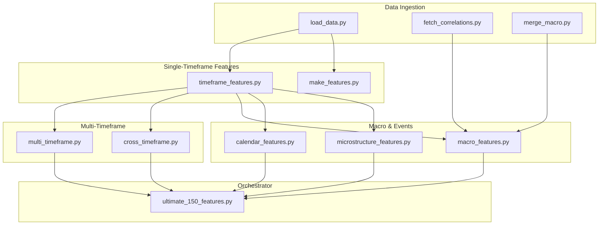
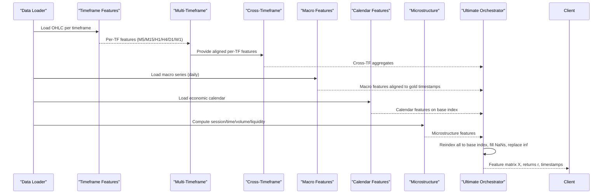
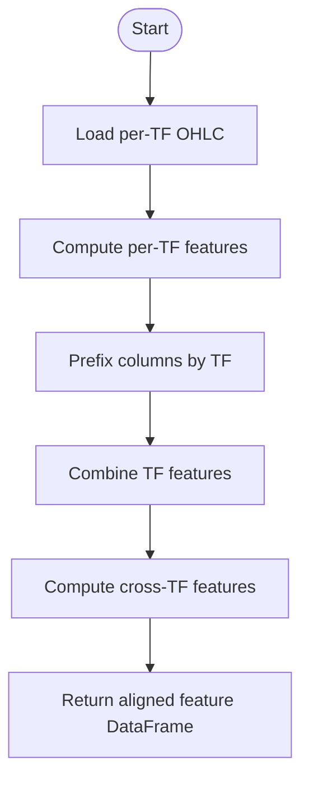
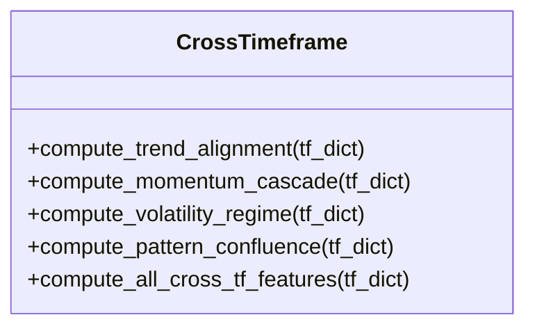
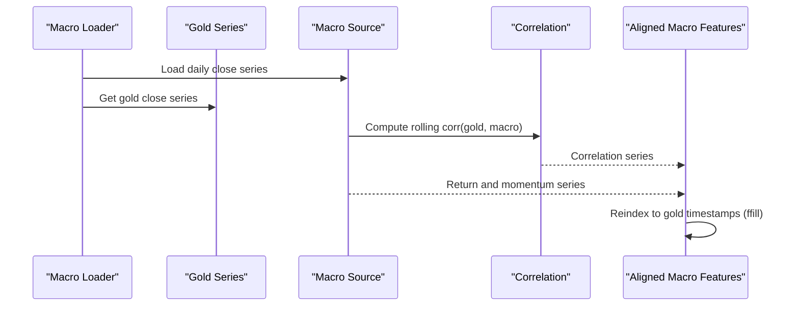
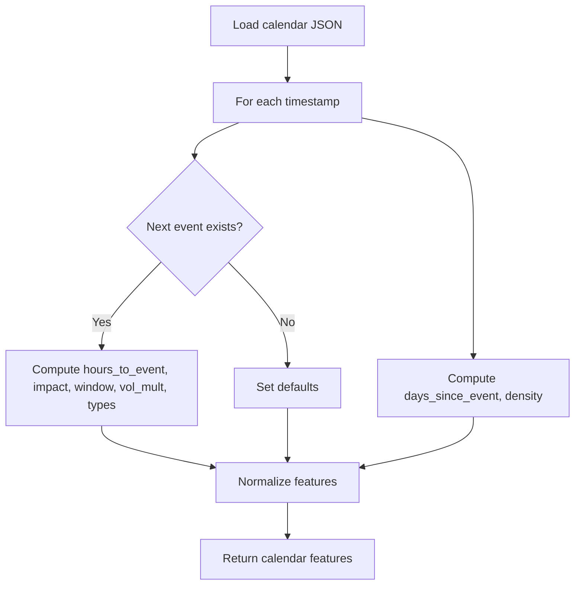
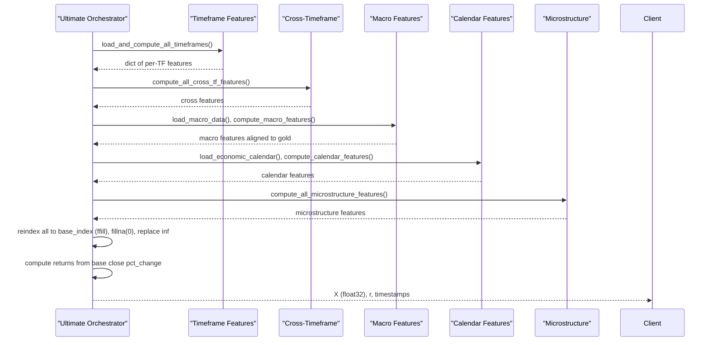
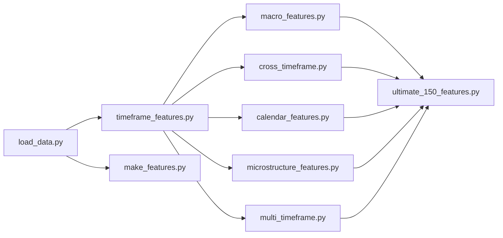

# Custom Features Development

<cite>
**Referenced Files in This Document**
- [make_features.py](file://features/make_features.py)
- [multi_timeframe.py](file://features/multi_timeframe.py)
- [timeframe_features.py](file://features/timeframe_features.py)
- [cross_timeframe.py](file://features/cross_timeframe.py)
- [macro_features.py](file://features/macro_features.py)
- [calendar_features.py](file://features/calendar_features.py)
- [microstructure_features.py](file://features/microstructure_features.py)
- [ultimate_150_features.py](file://features/ultimate_150_features.py)
- [load_data.py](file://data/load_data.py)
- [fetch_correlations.py](file://data/fetch_correlations.py)
- [merge_macro.py](file://data/merge_macro.py)
</cite>

## Table of Contents
1. [Introduction](#introduction)
2. [Project Structure](#project-structure)
3. [Core Components](#core-components)
4. [Architecture Overview](#architecture-overview)
5. [Detailed Component Analysis](#detailed-component-analysis)
6. [Dependency Analysis](#dependency-analysis)
7. [Performance Considerations](#performance-considerations)
8. [Troubleshooting Guide](#troubleshooting-guide)
9. [Conclusion](#conclusion)
10. [Appendices](#appendices)

## Introduction
This document explains how to develop custom technical indicators and features for the trading system, integrate them into the feature engineering pipeline, and ensure proper normalization and scaling. It covers handling missing data, aligning multiple timeframes, optimizing performance, and testing new features with statistical validation. The repository provides a modular framework that computes price-based indicators, macro correlations, calendar events, microstructure signals, and cross-timeframe intelligence, then combines them into a unified dataset for training or live inference.

## Project Structure
The feature system is organized by responsibility:
- Single-timeframe indicators and helpers
- Multi-timeframe computation and alignment
- Cross-timeframe relationships
- Macro data integration and correlation features
- Economic calendar event features
- Market microstructure features
- Master orchestrator that assembles all sources into a final feature matrix

**Diagram sources**
- [load_data.py:5-73](file://data/load_data.py#L5-L73)
- [fetch_correlations.py:5-54](file://data/fetch_correlations.py#L5-L54)
- [merge_macro.py:4-56](file://data/merge_macro.py#L4-L56)
- [timeframe_features.py:22-99](file://features/timeframe_features.py#L22-L99)
- [make_features.py:18-78](file://features/make_features.py#L18-L78)
- [multi_timeframe.py:32-96](file://features/multi_timeframe.py#L32-L96)
- [cross_timeframe.py:21-66](file://features/cross_timeframe.py#L21-L66)
- [macro_features.py:26-75](file://features/macro_features.py#L26-L75)
- [calendar_features.py:23-50](file://features/calendar_features.py#L23-L50)
- [microstructure_features.py:22-51](file://features/microstructure_features.py#L22-L51)
- [ultimate_150_features.py:27-226](file://features/ultimate_150_features.py#L27-L226)

**Section sources**
- [load_data.py:5-73](file://data/load_data.py#L5-L73)
- [timeframe_features.py:22-99](file://features/timeframe_features.py#L22-L99)
- [multi_timeframe.py:32-96](file://features/multi_timeframe.py#L32-L96)
- [cross_timeframe.py:21-66](file://features/cross_timeframe.py#L21-L66)
- [macro_features.py:26-75](file://features/macro_features.py#L26-L75)
- [calendar_features.py:23-50](file://features/calendar_features.py#L23-L50)
- [microstructure_features.py:22-51](file://features/microstructure_features.py#L22-L51)
- [ultimate_150_features.py:27-226](file://features/ultimate_150_features.py#L27-L226)

## Core Components
- Timeframe features: Standardized set of price action, trend, volatility, and volume metrics per timeframe.
- Multi-timeframe engine: Computes features across M5/M15/H1/H4/D1 and creates cross-timeframe aggregates.
- Cross-timeframe intelligence: Trend alignment, momentum cascade, volatility regime, support/resistance confluence.
- Macro features: Returns, momentum, and rolling correlations with DXY, SPX, US10Y, VIX, oil, BTC, EURUSD, silver/GLD.
- Calendar features: Event timing, impact windows, density, and type flags (NFP/FOMC).
- Microstructure features: Session effects, time-of-day, volume profile, liquidity proxies.
- Orchestrator: Aligns all sources to a base index, cleans, and returns a normalized feature matrix and target returns.

Normalization and scaling are applied at two levels:
- Per-feature normalization within single modules (e.g., RSI scaled to 0–1, ATR as percentage, BB position clipped to 0–1).
- Global standardization in the master pipeline using mean/std before model consumption.

Missing data handling:
- Forward-fill higher-frequency features to lower frequencies when aligning.
- Fill NaNs with safe defaults (e.g., 0 or neutral values) after computation.
- Validate OHLC integrity during ingestion.

Time alignment:
- Use DatetimeIndex and reindex with forward-fill to align disparate timeframes.
- Resample OHLCV to desired intervals when generating multi-timeframe datasets.

**Section sources**
- [timeframe_features.py:22-99](file://features/timeframe_features.py#L22-L99)
- [multi_timeframe.py:55-96](file://features/multi_timeframe.py#L55-L96)
- [cross_timeframe.py:205-249](file://features/cross_timeframe.py#L205-L249)
- [macro_features.py:363-445](file://features/macro_features.py#L363-L445)
- [calendar_features.py:111-249](file://features/calendar_features.py#L111-L249)
- [microstructure_features.py:170-225](file://features/microstructure_features.py#L170-L225)
- [ultimate_150_features.py:119-183](file://features/ultimate_150_features.py#L119-L183)
- [load_data.py:55-73](file://data/load_data.py#L55-L73)

## Architecture Overview
The pipeline ingests raw OHLC and macro data, computes per-timeframe indicators, derives cross-timeframe relationships, integrates macro correlations and calendar events, and outputs a unified feature matrix aligned to a base timeframe.

**Diagram sources**
- [load_data.py:5-73](file://data/load_data.py#L5-L73)
- [timeframe_features.py:22-99](file://features/timeframe_features.py#L22-L99)
- [multi_timeframe.py:55-96](file://features/multi_timeframe.py#L55-L96)
- [cross_timeframe.py:205-249](file://features/cross_timeframe.py#L205-L249)
- [macro_features.py:363-445](file://features/macro_features.py#L363-L445)
- [calendar_features.py:111-249](file://features/calendar_features.py#L111-L249)
- [microstructure_features.py:170-225](file://features/microstructure_features.py#L170-L225)
- [ultimate_150_features.py:119-183](file://features/ultimate_150_features.py#L119-L183)

## Detailed Component Analysis

### Single-Timeframe Indicators and Normalization
- Price action: returns, rolling volatility, momentum over multiple horizons.
- Trend: fast/slow moving averages, difference normalized by price, directional trend flag.
- Technical indicators: RSI (normalized to 0–1), MACD histogram normalized by price, ATR as percentage, Bollinger Band position clipped to [0,1].
- Volume and S/R: volume ratio vs rolling average, distance to recent high/low.

These indicators are designed to be stable across timeframes and produce bounded or normalized outputs where possible.

**Section sources**
- [timeframe_features.py:37-92](file://features/timeframe_features.py#L37-L92)
- [timeframe_features.py:102-178](file://features/timeframe_features.py#L102-L178)

### Multi-Timeframe Engine
- Computes per-timeframe features and prefixes columns by timeframe.
- Generates cross-timeframe aggregates such as trend alignment, momentum cascade, volatility regime, and support/resistance confluence.
- Provides helper to resample base data into multiple timeframes.

**Diagram sources**
- [multi_timeframe.py:55-96](file://features/multi_timeframe.py#L55-L96)
- [multi_timeframe.py:158-186](file://features/multi_timeframe.py#L158-L186)
- [multi_timeframe.py:350-396](file://features/multi_timeframe.py#L350-L396)

**Section sources**
- [multi_timeframe.py:55-96](file://features/multi_timeframe.py#L55-L96)
- [multi_timeframe.py:158-186](file://features/multi_timeframe.py#L158-L186)
- [multi_timeframe.py:350-396](file://features/multi_timeframe.py#L350-L396)

### Cross-Timeframe Intelligence
- Trend alignment: average trend across TFs; strength cascade via multiplication; divergence via std.
- Momentum cascade: pairwise interactions between higher and lower TF momentum.
- Volatility regime: current vs long-term vol; spike/compression flags.
- Pattern confluence: proximity to recent highs/lows across TFs; breakout alignment.

**Diagram sources**
- [cross_timeframe.py:21-66](file://features/cross_timeframe.py#L21-L66)
- [cross_timeframe.py:69-102](file://features/cross_timeframe.py#L69-L102)
- [cross_timeframe.py:105-138](file://features/cross_timeframe.py#L105-L138)
- [cross_timeframe.py:141-202](file://features/cross_timeframe.py#L141-L202)
- [cross_timeframe.py:205-249](file://features/cross_timeframe.py#L205-L249)

**Section sources**
- [cross_timeframe.py:21-66](file://features/cross_timeframe.py#L21-L66)
- [cross_timeframe.py:69-102](file://features/cross_timeframe.py#L69-L102)
- [cross_timeframe.py:105-138](file://features/cross_timeframe.py#L105-L138)
- [cross_timeframe.py:141-202](file://features/cross_timeframe.py#L141-L202)
- [cross_timeframe.py:205-249](file://features/cross_timeframe.py#L205-L249)

### Macro Correlations and Integration
- Loads daily macro series (DXY, SPX, US10Y, VIX, oil, BTC, EURUSD, silver/GLD).
- For each source, computes return, momentum, and rolling correlation with gold.
- Aligns daily macro features to intraday gold timestamps via forward-fill.

**Diagram sources**
- [macro_features.py:26-75](file://features/macro_features.py#L26-L75)
- [macro_features.py:114-132](file://features/macro_features.py#L114-L132)
- [macro_features.py:135-160](file://features/macro_features.py#L135-L160)
- [macro_features.py:363-445](file://features/macro_features.py#L363-L445)

**Section sources**
- [macro_features.py:26-75](file://features/macro_features.py#L26-L75)
- [macro_features.py:114-132](file://features/macro_features.py#L114-L132)
- [macro_features.py:135-160](file://features/macro_features.py#L135-L160)
- [macro_features.py:363-445](file://features/macro_features.py#L363-L445)

### Economic Calendar Features
- Detects next/last events, hours/days since event, event density, high-impact flags, in-window flags, expected volatility multiplier, and NFP/FOMC detection.
- Normalizes time-based features to bounded ranges.

**Diagram sources**
- [calendar_features.py:23-50](file://features/calendar_features.py#L23-L50)
- [calendar_features.py:53-108](file://features/calendar_features.py#L53-L108)
- [calendar_features.py:111-249](file://features/calendar_features.py#L111-L249)

**Section sources**
- [calendar_features.py:23-50](file://features/calendar_features.py#L23-L50)
- [calendar_features.py:53-108](file://features/calendar_features.py#L53-L108)
- [calendar_features.py:111-249](file://features/calendar_features.py#L111-L249)

### Market Microstructure Features
- Session effects: Asian/London/NY and overlap flags.
- Time features: hour/day/week/month encodings normalized.
- Volume analysis: percentile rank and imbalance proxy.
- Liquidity: spread proxy and regime classification.

**Section sources**
- [microstructure_features.py:22-51](file://features/microstructure_features.py#L22-L51)
- [microstructure_features.py:54-86](file://features/microstructure_features.py#L54-L86)
- [microstructure_features.py:89-130](file://features/microstructure_features.py#L89-L130)
- [microstructure_features.py:133-167](file://features/microstructure_features.py#L133-L167)
- [microstructure_features.py:170-225](file://features/microstructure_features.py#L170-L225)

### Master Orchestrator and Final Normalization
- Loads timeframe features, cross-timeframe features, macro features, calendar features, and microstructure features.
- Aligns all to a base index using forward-fill.
- Cleans NaNs and infinities, converts to float32.
- Computes target returns from base timeframe close prices.
- Logs comprehensive summaries and returns arrays ready for training.

**Diagram sources**
- [ultimate_150_features.py:27-226](file://features/ultimate_150_features.py#L27-L226)

**Section sources**
- [ultimate_150_features.py:27-226](file://features/ultimate_150_features.py#L27-L226)

## Dependency Analysis
- Data ingestion depends on robust OHLC parsing and timezone handling.
- Timeframe features depend on clean OHLC and optional volume.
- Multi-timeframe and cross-timeframe modules depend on consistent per-TF feature sets.
- Macro features depend on daily macro series availability and correct timezone alignment.
- Calendar features depend on an economic calendar file.
- Orchestrator coordinates all modules and ensures alignment and cleaning.

**Diagram sources**
- [load_data.py:5-73](file://data/load_data.py#L5-L73)
- [timeframe_features.py:22-99](file://features/timeframe_features.py#L22-L99)
- [multi_timeframe.py:55-96](file://features/multi_timeframe.py#L55-L96)
- [cross_timeframe.py:205-249](file://features/cross_timeframe.py#L205-L249)
- [macro_features.py:363-445](file://features/macro_features.py#L363-L445)
- [calendar_features.py:111-249](file://features/calendar_features.py#L111-L249)
- [microstructure_features.py:170-225](file://features/microstructure_features.py#L170-L225)
- [ultimate_150_features.py:119-183](file://features/ultimate_150_features.py#L119-L183)

**Section sources**
- [load_data.py:5-73](file://data/load_data.py#L5-L73)
- [ultimate_150_features.py:119-183](file://features/ultimate_150_features.py#L119-L183)

## Performance Considerations
- Prefer vectorized pandas/numpy operations for rolling computations; avoid Python loops over rows.
- Use appropriate rolling windows per timeframe to balance responsiveness and stability.
- Convert final feature matrices to float32 to reduce memory footprint.
- Minimize redundant recomputation by caching intermediate results when possible.
- Align timeframes once and reuse aligned indices throughout the pipeline.
- When computing rolling correlations, use reasonable windows to limit computational cost.
- Forward-fill macro data to intraday frequency rather than recalculating per bar.

[No sources needed since this section provides general guidance]

## Troubleshooting Guide
Common issues and resolutions:
- Missing OHLC columns or invalid OHLC: Ensure required columns exist and high >= max(open, close, low), low <= min(open, close, high).
- Timezone mismatches: Normalize macro series to timezone-naive UTC before alignment.
- NaN propagation: After feature computation, fill NaNs with safe defaults; verify no remaining NaNs before training.
- Infinite values: Replace infinities with zeros prior to model input.
- Macro data gaps: Forward-fill daily macro series to match intraday timestamps; handle holidays gracefully.
- Calendar file not found: Provide a valid economic calendar JSON path; otherwise features default to neutral values.

Validation checks:
- Inspect feature distributions and summary statistics.
- Confirm no NaNs or infinities in final feature matrix.
- Verify alignment to base index length and ordering.

**Section sources**
- [load_data.py:55-73](file://data/load_data.py#L55-L73)
- [macro_features.py:78-111](file://features/macro_features.py#L78-L111)
- [ultimate_150_features.py:156-173](file://features/ultimate_150_features.py#L156-L173)
- [calendar_features.py:128-138](file://features/calendar_features.py#L128-L138)

## Conclusion
The feature framework provides a robust, modular approach to building custom technical indicators and integrating them into a multi-timeframe, macro-aware, and event-driven pipeline. By following the established patterns—normalizing indicators, aligning timeframes, handling missing data, and validating outputs—you can extend the system with new momentum, volatility, or correlation features while maintaining performance and reliability.

[No sources needed since this section summarizes without analyzing specific files]

## Appendices

### How to Add a New Momentum Indicator
- Implement a function that takes a price series and returns a normalized indicator (e.g., bounded or percentage-based).
- Integrate it into the per-timeframe feature computation so it is available across all timeframes.
- If it requires lookback windows, choose periods appropriate for each timeframe.
- Ensure NaN handling and fill defaults are consistent with other features.
- Test via the timeframe module’s test function and validate output shapes and stats.

**Section sources**
- [timeframe_features.py:37-92](file://features/timeframe_features.py#L37-L92)
- [timeframe_features.py:102-178](file://features/timeframe_features.py#L102-L178)

### How to Add a Volatility Measure
- Compute realized volatility (rolling std of returns) or ATR-based measures.
- Normalize by price to make scale-invariant (e.g., ATR/close).
- Optionally add regime flags (compression/spike) similar to existing volatility features.
- Include in per-timeframe features and cross-timeframe modules if relevant.

**Section sources**
- [timeframe_features.py:42-48](file://features/timeframe_features.py#L42-L48)
- [timeframe_features.py:138-156](file://features/timeframe_features.py#L138-L156)
- [cross_timeframe.py:105-138](file://features/cross_timeframe.py#L105-L138)

### How to Add Custom Macro Correlations
- Add a new macro series loader and normalize timezone alignment.
- Compute returns, momentum, and rolling correlation with gold.
- Integrate into the macro features aggregator and ensure forward-fill alignment to gold timestamps.
- Validate feature presence and statistics in the ultimate pipeline.

**Section sources**
- [macro_features.py:26-75](file://features/macro_features.py#L26-L75)
- [macro_features.py:114-132](file://features/macro_features.py#L114-L132)
- [macro_features.py:363-445](file://features/macro_features.py#L363-L445)

### Testing and Validation Guidelines
- Unit tests:
  - Verify feature shapes and dtypes.
  - Check for NaNs/infs and ensure they are handled.
  - Validate bounds for normalized features (e.g., RSI 0–1, BB position 0–1).
- Statistical validation:
  - Inspect means, stds, and distributions.
  - Check autocorrelation and stationarity where applicable.
  - Compare feature behavior across regimes (high/low vol, trending/ranging).
- Integration tests:
  - Run the full orchestrator and confirm final X shape and return series.
  - Validate alignment to base index and sample count.

**Section sources**
- [timeframe_features.py:307-334](file://features/timeframe_features.py#L307-L334)
- [cross_timeframe.py:252-287](file://features/cross_timeframe.py#L252-L287)
- [macro_features.py:448-492](file://features/macro_features.py#L448-L492)
- [calendar_features.py:252-294](file://features/calendar_features.py#L252-L294)
- [microstructure_features.py:228-263](file://features/microstructure_features.py#L228-L263)
- [ultimate_150_features.py:229-267](file://features/ultimate_150_features.py#L229-L267)