# Customization and Extension Tutorials

<cite>
**Referenced Files in This Document**
- [README.md](file://README.md)
- [features/make_features.py](file://features/make_features.py)
- [features/god_mode_features.py](file://features/god_mode_features.py)
- [features/ultimate_150_features.py](file://features/ultimate_150_features.py)
- [data/load_data.py](file://data/load_data.py)
- [env/xauusd_env.py](file://env/xauusd_env.py)
- [env/realistic_execution.py](file://env/realistic_execution.py)
- [models/dreamer_agent.py](file://models/dreamer_agent.py)
- [models/dreamer_components.py](file://models/dreamer_components.py)
- [models/risk_supervisor.py](file://models/risk_supervisor.py)
- [train/train_ultimate_150.py](file://train/train_ultimate_150.py)
- [live/live_trade_mt5.py](file://live/live_trade_mt5.py)
- [live/live_trade_metaapi.py](file://live/live_trade_metaapi.py)
</cite>

## Table of Contents
1. Introduction
2. Project Structure
3. Core Components
4. Architecture Overview
5. Detailed Component Analysis
6. Dependency Analysis
7. Performance Considerations
8. Troubleshooting Guide
9. Conclusion
10. Appendices

## Introduction
This guide provides advanced customization and extension tutorials for experienced users who want to extend the trading system. It covers:
- Adding new technical indicators and integrating them into the feature pipeline
- Implementing custom reward functions and modifying agent architectures
- Integrating additional data sources (macro, sentiment, microstructure)
- Creating custom trading environments and alternative execution strategies
- Extending to new market instruments and broker APIs
- Implementing custom risk management rules
- Best practices for maintaining compatibility and performance

The repository is a Deep Reinforcement Learning trading system focused on XAUUSD with multi-timeframe features, macro awareness, economic calendar integration, and live trading via MetaTrader 5 or MetaAPI.

## Project Structure
Key directories and their roles:
- features/: Feature engineering modules (timeframes, macro, calendar, microstructure, ultimate aggregator)
- env/: Gymnasium trading environments and realistic execution modeling
- models/: RL agents (DreamerV3), components (RSSM, encoder, actor-critic), and risk supervisor
- train/: Training scripts orchestrating feature loading, environment creation, and agent training
- live/: Live trading integrations (MT5 and MetaAPI)
- data/: Data loaders and utilities for OHLC and macro data

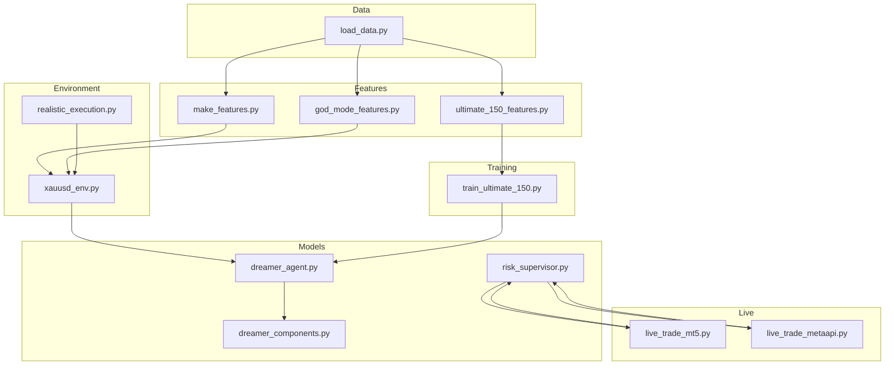

**Diagram sources**
- [features/make_features.py:18-83](file://features/make_features.py#L18-L83)
- [features/god_mode_features.py:291-379](file://features/god_mode_features.py#L291-L379)
- [features/ultimate_150_features.py:27-183](file://features/ultimate_150_features.py#L27-L183)
- [data/load_data.py:5-73](file://data/load_data.py#L5-L73)
- [env/xauusd_env.py:7-118](file://env/xauusd_env.py#L7-L118)
- [env/realistic_execution.py:24-229](file://env/realistic_execution.py#L24-L229)
- [models/dreamer_agent.py:84-427](file://models/dreamer_agent.py#L84-L427)
- [models/dreamer_components.py:71-200](file://models/dreamer_components.py#L71-L200)
- [models/risk_supervisor.py:18-286](file://models/risk_supervisor.py#L18-L286)
- [train/train_ultimate_150.py:49-151](file://train/train_ultimate_150.py#L49-L151)
- [live/live_trade_mt5.py:21-174](file://live/live_trade_mt5.py#L21-L174)
- [live/live_trade_metaapi.py:40-200](file://live/live_trade_metaapi.py#L40-L200)

**Section sources**
- [README.md:418-471](file://README.md#L418-L471)

## Core Components
- Feature Engineering: Modular pipelines that compute timeframe-based indicators, cross-timeframe signals, macro correlations, economic calendar events, and microstructure metrics. The ultimate aggregator combines all sources into a unified feature matrix.
- Trading Environment: A Gymnasium environment encapsulating observation windows, action spaces, rewards, and state transitions. Realistic execution modeling adds slippage, spread widening, commissions, and market impact.
- Agent Architecture: DreamerV3 implementation with world model learning (encoder, RSSM, decoder, reward predictor) and actor-critic policy/value networks trained via imagination trajectories.
- Risk Supervisor: Deterministic safety layer enforcing daily loss limits, drawdown protection, position sizing, volatility filters, event risk, overtrading prevention, and spread checks.
- Live Trading: MT5 and MetaAPI integrations that fetch market data, compute features, run inference, and execute orders with robust error handling and retries.

**Section sources**
- [features/ultimate_150_features.py:27-183](file://features/ultimate_150_features.py#L27-L183)
- [env/xauusd_env.py:7-118](file://env/xauusd_env.py#L7-L118)
- [env/realistic_execution.py:24-229](file://env/realistic_execution.py#L24-L229)
- [models/dreamer_agent.py:84-427](file://models/dreamer_agent.py#L84-L427)
- [models/dreamer_components.py:71-200](file://models/dreamer_components.py#L71-L200)
- [models/risk_supervisor.py:18-286](file://models/risk_supervisor.py#L18-L286)
- [live/live_trade_mt5.py:21-174](file://live/live_trade_mt5.py#L21-L174)
- [live/live_trade_metaapi.py:40-200](file://live/live_trade_metaapi.py#L40-L200)

## Architecture Overview
The system follows a modular pipeline:
- Data ingestion and normalization via load_data
- Feature computation across multiple timeframes and external sources
- Environment step function computes reward and updates state
- Agent trains using world model and actor-critic on imagined trajectories
- Risk supervisor gates live trades before execution
- Live scripts orchestrate data fetching, inference, and order placement

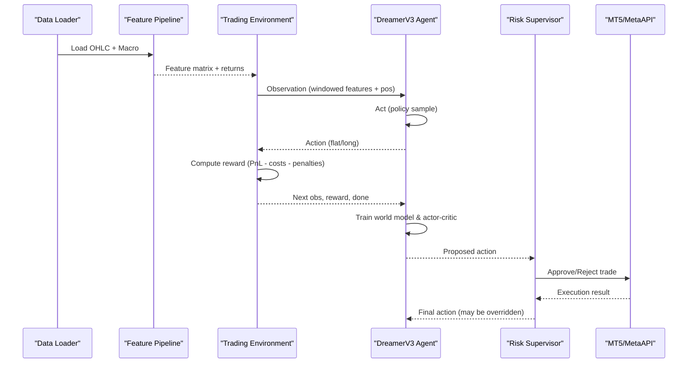

**Diagram sources**
- [data/load_data.py:5-73](file://data/load_data.py#L5-L73)
- [features/ultimate_150_features.py:27-183](file://features/ultimate_150_features.py#L27-L183)
- [env/xauusd_env.py:7-118](file://env/xauusd_env.py#L7-L118)
- [models/dreamer_agent.py:148-304](file://models/dreamer_agent.py#L148-L304)
- [models/risk_supervisor.py:91-174](file://models/risk_supervisor.py#L91-L174)
- [live/live_trade_mt5.py:21-174](file://live/live_trade_mt5.py#L21-L174)
- [live/live_trade_metaapi.py:40-200](file://live/live_trade_metaapi.py#L40-L200)

## Detailed Component Analysis

### Extending the Feature Engineering Pipeline
- Add new technical indicators:
  - Extend timeframe-specific computations in god_mode_features or timeframe-specific modules.
  - Integrate via ultimate_150_features aggregator to combine with other sources.
  - Ensure alignment to base timeframe index and handle NaNs gracefully.
- Integrate additional data sources:
  - Use load_data to standardize OHLC columns and timestamps.
  - For macro/sentiment/microstructure, append normalized series aligned to the base timeframe.
- Maintain performance:
  - Vectorized operations where possible.
  - Avoid unnecessary reindexing; pre-align indices.
  - Use float32 arrays to reduce memory footprint.

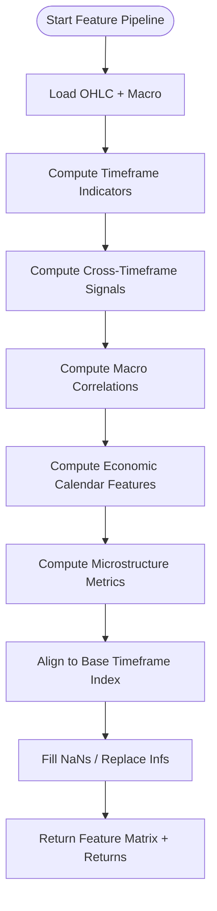

**Diagram sources**
- [features/god_mode_features.py:53-131](file://features/god_mode_features.py#L53-L131)
- [features/god_mode_features.py:134-191](file://features/god_mode_features.py#L134-L191)
- [features/god_mode_features.py:194-232](file://features/god_mode_features.py#L194-L232)
- [features/god_mode_features.py:235-288](file://features/god_mode_features.py#L235-L288)
- [features/ultimate_150_features.py:47-183](file://features/ultimate_150_features.py#L47-L183)
- [data/load_data.py:5-73](file://data/load_data.py#L5-L73)

**Section sources**
- [features/make_features.py:18-83](file://features/make_features.py#L18-L83)
- [features/god_mode_features.py:291-379](file://features/god_mode_features.py#L291-L379)
- [features/ultimate_150_features.py:27-183](file://features/ultimate_150_features.py#L27-L183)
- [data/load_data.py:5-73](file://data/load_data.py#L5-L73)

### Implementing Custom Reward Functions
- Modify reward logic in the environment step:
  - Adjust PnL weighting, turnover penalties, flat penalties, and hold bonuses.
  - Incorporate transaction costs from realistic execution model for more accurate backtests.
- Example considerations:
  - Penalize frequent flipping between flat and long to reduce churn.
  - Scale rewards by volatility regime to stabilize learning.
  - Include drawdown-aware penalties to discourage risky behavior during high drawdown.

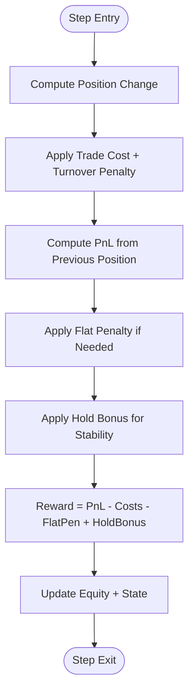

**Diagram sources**
- [env/xauusd_env.py:75-118](file://env/xauusd_env.py#L75-L118)
- [env/realistic_execution.py:88-169](file://env/realistic_execution.py#L88-L169)

**Section sources**
- [env/xauusd_env.py:7-118](file://env/xauusd_env.py#L7-L118)
- [env/realistic_execution.py:24-229](file://env/realistic_execution.py#L24-L229)

### Modifying Agent Architectures
- World Model:
  - Tune RSSM dimensions, categories, and hidden sizes for better latent representation.
  - Adjust KL regularization parameters to prevent posterior collapse.
- Actor-Critic:
  - Modify policy distribution (categorical vs continuous) depending on action space.
  - Adjust value network architecture and lambda-returns horizon for stability.
- Training Loop:
  - Increase imagination horizon for longer planning horizons.
  - Adjust batch size and training frequency for throughput vs convergence speed.

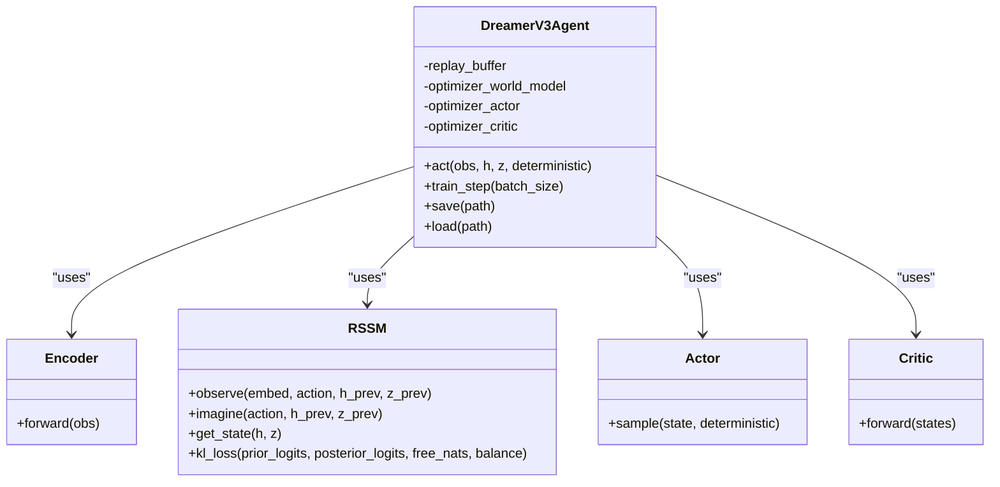

**Diagram sources**
- [models/dreamer_agent.py:84-427](file://models/dreamer_agent.py#L84-L427)
- [models/dreamer_components.py:71-200](file://models/dreamer_components.py#L71-L200)

**Section sources**
- [models/dreamer_agent.py:84-427](file://models/dreamer_agent.py#L84-L427)
- [models/dreamer_components.py:71-200](file://models/dreamer_components.py#L71-L200)

### Integrating Additional Data Sources
- Macro data:
  - Load via macro modules and compute correlations (e.g., gold vs DXY, SPX, yields).
  - Align to base timeframe using forward fill or interpolation.
- Sentiment analysis:
  - Append sentiment scores as additional features; ensure normalization and NaN handling.
- Microstructure:
  - Compute bid-ask spread dynamics, volume imbalances, and liquidity proxies.

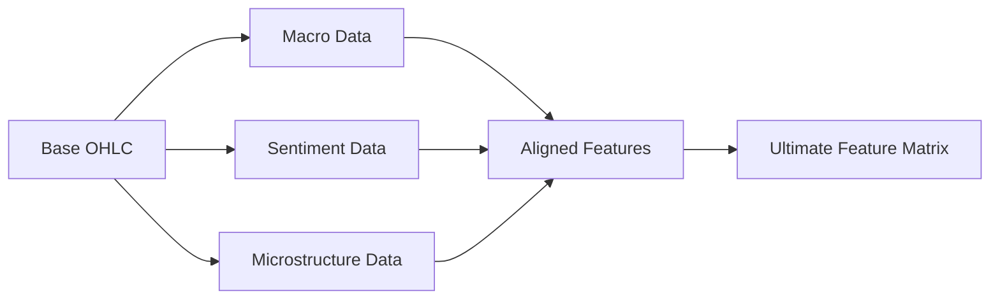

**Diagram sources**
- [features/god_mode_features.py:194-232](file://features/god_mode_features.py#L194-L232)
- [features/ultimate_150_features.py:72-117](file://features/ultimate_150_features.py#L72-L117)
- [data/load_data.py:5-73](file://data/load_data.py#L5-L73)

**Section sources**
- [features/god_mode_features.py:194-232](file://features/god_mode_features.py#L194-L232)
- [features/ultimate_150_features.py:72-117](file://features/ultimate_150_features.py#L72-L117)
- [data/load_data.py:5-73](file://data/load_data.py#L5-L73)

### Creating Custom Trading Environments
- Define observation window and action space:
  - Flatten last N timesteps of features and concatenate current position.
  - Discrete actions (flat/long) or continuous actions for position sizing.
- Implement step function:
  - Compute reward based on PnL, costs, penalties, and bonuses.
  - Track equity and update state after reward to avoid look-ahead bias.
- Integrate realistic execution:
  - Apply spread widening, slippage, commissions, and market impact during training/backtesting.

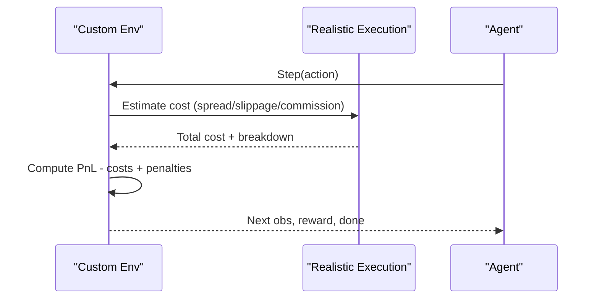

**Diagram sources**
- [env/xauusd_env.py:75-118](file://env/xauusd_env.py#L75-L118)
- [env/realistic_execution.py:88-169](file://env/realistic_execution.py#L88-L169)

**Section sources**
- [env/xauusd_env.py:7-118](file://env/xauusd_env.py#L7-L118)
- [env/realistic_execution.py:24-229](file://env/realistic_execution.py#L24-L229)

### Implementing Alternative Execution Strategies
- Market vs Limit Orders:
  - Market orders incur higher slippage but faster fills.
  - Limit orders reduce slippage but risk partial fills and missed opportunities.
- Dynamic Sizing:
  - Scale position size based on volatility and liquidity.
  - Reduce size during high-volatility or event windows.
- Adaptive Costs:
  - Increase spread/slippage multipliers during news events.
  - Monitor adverse selection and adjust strategy accordingly.

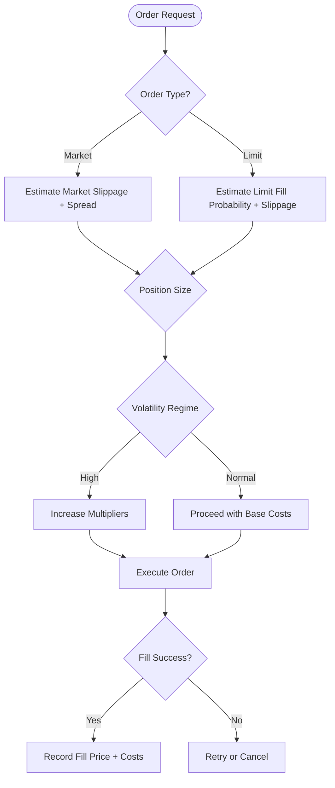

**Diagram sources**
- [env/realistic_execution.py:88-169](file://env/realistic_execution.py#L88-L169)
- [env/realistic_execution.py:232-276](file://env/realistic_execution.py#L232-L276)

**Section sources**
- [env/realistic_execution.py:24-229](file://env/realistic_execution.py#L24-L229)

### Adding New Market Instruments
- Data Preparation:
  - Ensure OHLC columns are standardized and time-aligned.
  - Generate multi-timeframe datasets for the new instrument.
- Feature Adaptation:
  - Reconfigure timeframe windows and indicator periods for instrument characteristics.
  - Integrate instrument-specific macro correlations (e.g., currency pairs vs DXY).
- Environment and Agent:
  - Adjust action space if shorting is allowed.
  - Retrain with instrument-specific returns and features.

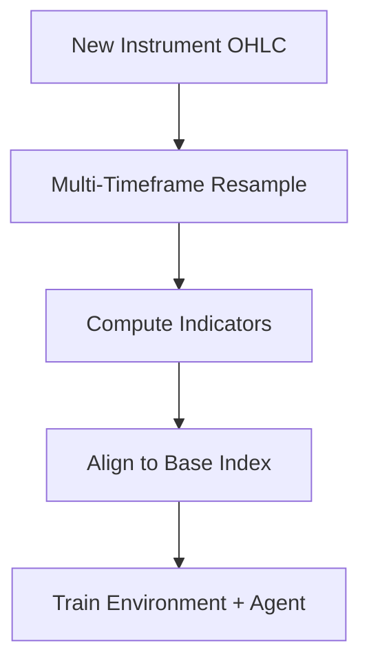

**Diagram sources**
- [data/load_data.py:5-73](file://data/load_data.py#L5-L73)
- [features/god_mode_features.py:306-355](file://features/god_mode_features.py#L306-L355)
- [train/train_ultimate_150.py:172-235](file://train/train_ultimate_150.py#L172-L235)

**Section sources**
- [data/load_data.py:5-73](file://data/load_data.py#L5-L73)
- [features/god_mode_features.py:306-355](file://features/god_mode_features.py#L306-L355)
- [train/train_ultimate_150.py:172-235](file://train/train_ultimate_150.py#L172-L235)

### Implementing Custom Risk Management Rules
- Extend RiskSupervisor:
  - Add new checks (e.g., correlation guards, event risk filters).
  - Configure dynamic thresholds based on market conditions.
- Integration:
  - Wrap AI agent with SafeTradingAgent to enforce approvals/rejections.
  - Log rejection reasons for post-trade analysis.

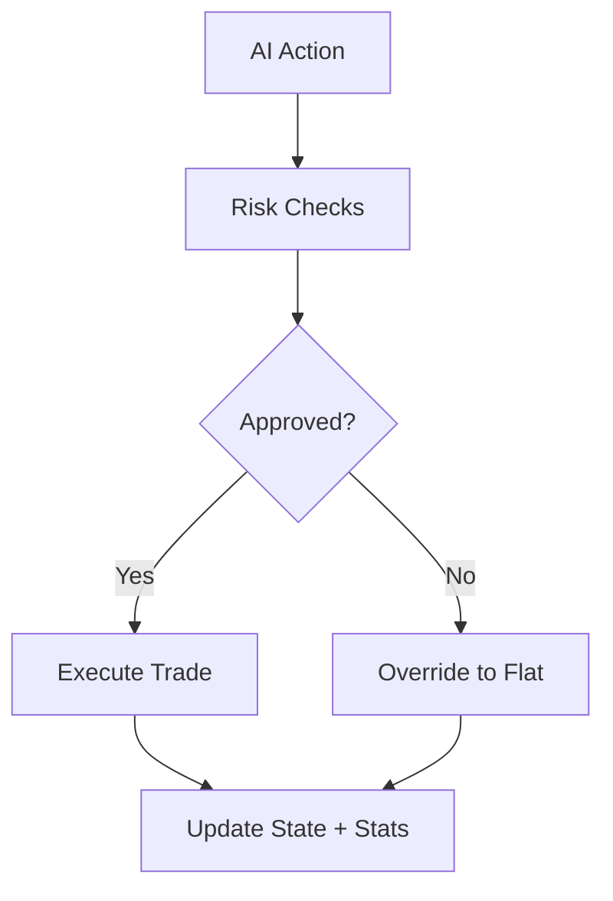

**Diagram sources**
- [models/risk_supervisor.py:91-174](file://models/risk_supervisor.py#L91-L174)
- [models/risk_supervisor.py:289-339](file://models/risk_supervisor.py#L289-L339)

**Section sources**
- [models/risk_supervisor.py:18-286](file://models/risk_supervisor.py#L18-L286)
- [models/risk_supervisor.py:289-339](file://models/risk_supervisor.py#L289-L339)

### Integrating with Different Broker APIs
- MT5 Integration:
  - Fetch candles, compute features, run inference, and send orders.
  - Handle connection errors and retries.
- MetaAPI Integration:
  - Async API calls for historical data and positions.
  - Robust deployment and connection stabilization.

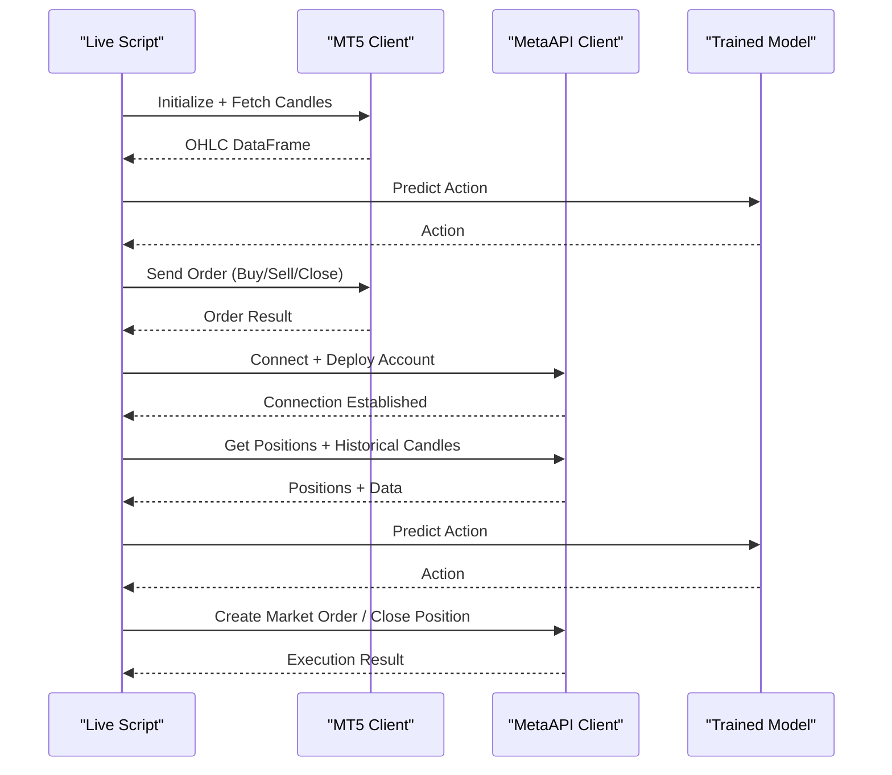

**Diagram sources**
- [live/live_trade_mt5.py:21-174](file://live/live_trade_mt5.py#L21-L174)
- [live/live_trade_metaapi.py:40-200](file://live/live_trade_metaapi.py#L40-L200)

**Section sources**
- [live/live_trade_mt5.py:21-174](file://live/live_trade_mt5.py#L21-L174)
- [live/live_trade_metaapi.py:40-200](file://live/live_trade_metaapi.py#L40-L200)

## Dependency Analysis
Key dependencies and relationships:
- Features depend on data loaders and each other via aggregation.
- Environment depends on features and returns for observations and rewards.
- Agent depends on environment and uses replay buffer for sequence sampling.
- Risk supervisor wraps agent decisions for live trading safety.
- Live scripts depend on models and brokers for execution.

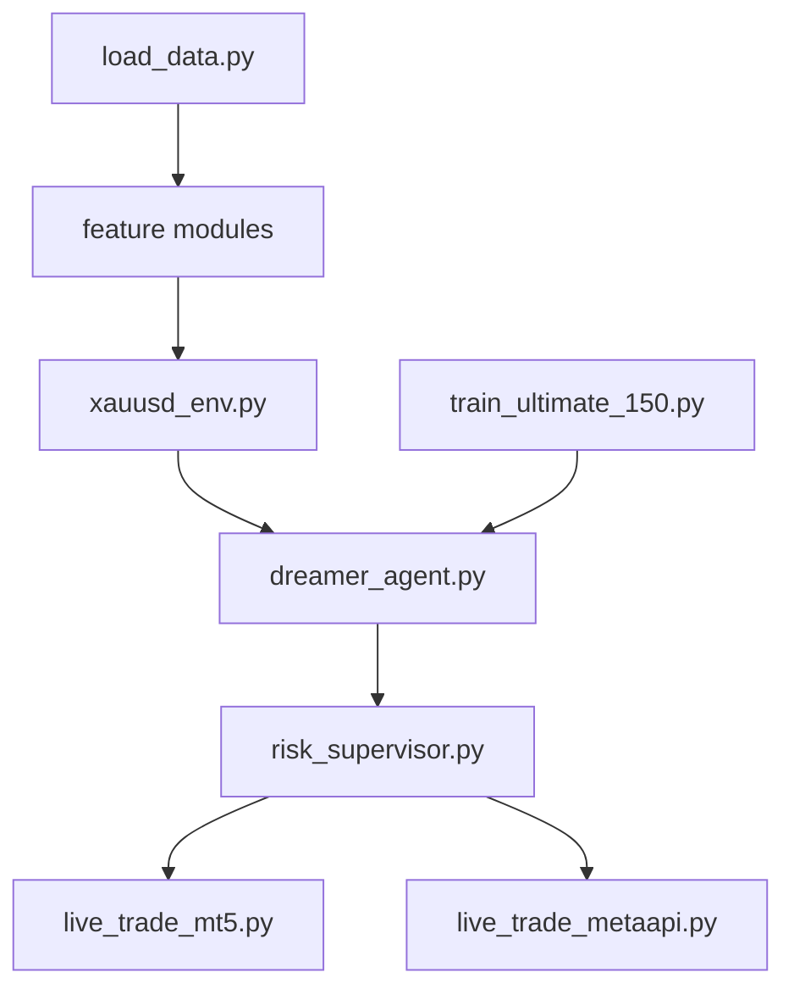

**Diagram sources**
- [data/load_data.py:5-73](file://data/load_data.py#L5-L73)
- [features/ultimate_150_features.py:27-183](file://features/ultimate_150_features.py#L27-L183)
- [env/xauusd_env.py:7-118](file://env/xauusd_env.py#L7-L118)
- [models/dreamer_agent.py:84-427](file://models/dreamer_agent.py#L84-L427)
- [models/risk_supervisor.py:18-286](file://models/risk_supervisor.py#L18-L286)
- [train/train_ultimate_150.py:49-151](file://train/train_ultimate_150.py#L49-L151)
- [live/live_trade_mt5.py:21-174](file://live/live_trade_mt5.py#L21-L174)
- [live/live_trade_metaapi.py:40-200](file://live/live_trade_metaapi.py#L40-L200)

**Section sources**
- [train/train_ultimate_150.py:49-151](file://train/train_ultimate_150.py#L49-L151)
- [models/dreamer_agent.py:84-427](file://models/dreamer_agent.py#L84-L427)

## Performance Considerations
- Feature Computation:
  - Use vectorized pandas/numpy operations; avoid loops over rows.
  - Precompute rolling statistics efficiently; cache intermediate results when possible.
- Memory Usage:
  - Convert to float32 early to reduce memory footprint.
  - Align indices once and reuse; avoid repeated reindexing.
- Training Throughput:
  - Increase batch size within GPU memory limits.
  - Use parallel environments if supported by your RL library.
- Execution Costs:
  - Calibrate realistic execution parameters per broker and instrument.
  - Monitor slippage and spread widening during volatile periods.

[No sources needed since this section provides general guidance]

## Troubleshooting Guide
Common issues and resolutions:
- Missing or malformed OHLC data:
  - Validate required columns and ranges; ensure time sorting and deduplication.
- NaN/Inf values in features:
  - Fill NaNs with zeros; replace infinities; verify indicator calculations.
- Environment shape mismatches:
  - Ensure observation window matches feature dimensions; check action space consistency.
- Agent training instability:
  - Adjust learning rates, KL regularization, and horizon; monitor losses.
- Live trading failures:
  - Check broker connectivity; implement retries; validate order parameters.

**Section sources**
- [data/load_data.py:5-73](file://data/load_data.py#L5-L73)
- [features/ultimate_150_features.py:156-183](file://features/ultimate_150_features.py#L156-L183)
- [env/xauusd_env.py:7-118](file://env/xauusd_env.py#L7-L118)
- [models/dreamer_agent.py:190-304](file://models/dreamer_agent.py#L190-L304)
- [live/live_trade_mt5.py:111-174](file://live/live_trade_mt5.py#L111-L174)
- [live/live_trade_metaapi.py:135-200](file://live/live_trade_metaapi.py#L135-L200)

## Conclusion
This tutorial outlined how to extend the trading system across feature engineering, reward design, agent architecture, data integration, environments, execution strategies, risk management, and broker integrations. By following modular patterns and best practices, you can maintain compatibility and performance while adding capabilities tailored to specific markets and strategies.

[No sources needed since this section summarizes without analyzing specific files]

## Appendices

### Best Practices for Compatibility and Performance
- Keep feature modules decoupled; aggregate via a central module.
- Standardize data formats and column names across sources.
- Use consistent normalization and scaling across features.
- Validate inputs at boundaries (data loading, environment steps, live execution).
- Log detailed metrics for debugging and post-analysis.

[No sources needed since this section provides general guidance]