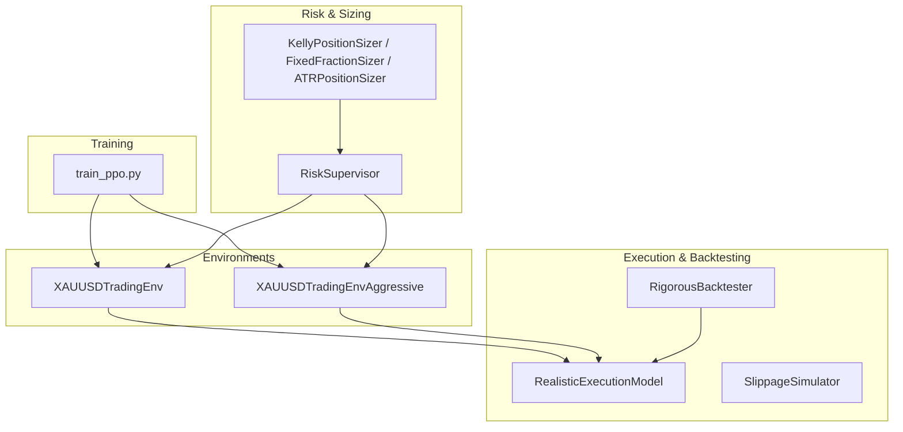
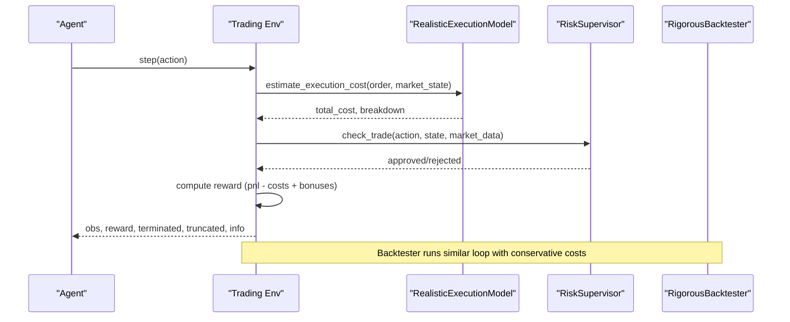
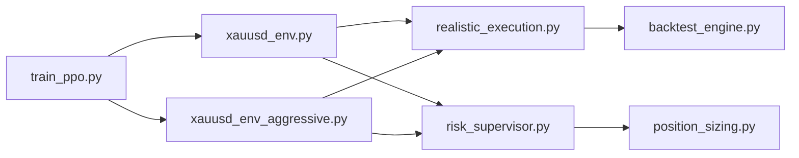

# Environment Customization

<cite>
**Referenced Files in This Document**
- [xauusd_env.py](file://env/xauusd_env.py)
- [xauusd_env_aggressive.py](file://env/xauusd_env_aggressive.py)
- [realistic_execution.py](file://env/realistic_execution.py)
- [backtest_engine.py](file://backtest/backtest_engine.py)
- [position_sizing.py](file://models/position_sizing.py)
- [risk_supervisor.py](file://models/risk_supervisor.py)
- [train_ppo.py](file://train/train_ppo.py)
</cite>

## Table of Contents
1. [Introduction](#introduction)
2. [Project Structure](#project-structure)
3. [Core Components](#core-components)
4. [Architecture Overview](#architecture-overview)
5. [Detailed Component Analysis](#detailed-component-analysis)
6. [Dependency Analysis](#dependency-analysis)
7. [Performance Considerations](#performance-considerations)
8. [Troubleshooting Guide](#troubleshooting-guide)
9. [Conclusion](#conclusion)
10. [Appendices](#appendices)

## Introduction
This document provides detailed guidance for customizing trading environments beyond the default XAUUSD setup. It explains how to modify action spaces, observation structures, and reward functions; implement alternative cost models, slippage assumptions, and execution constraints; create environments for different instruments (stocks, crypto); implement custom risk parameters; and adjust simulation fidelity levels. It also includes best practices for environment validation, debugging, and performance optimization when building custom trading simulations.

## Project Structure
The repository organizes environment logic under env/, with two primary Gymnasium-based environments for XAUUSD, a realistic execution model, and a rigorous backtesting framework. Risk management and position sizing are implemented as reusable modules that can be integrated into any environment or agent pipeline. Training scripts demonstrate how to instantiate environments and run parallel training loops.

**Diagram sources**
- [xauusd_env.py:7-118](file://env/xauusd_env.py#L7-L118)
- [xauusd_env_aggressive.py:6-144](file://env/xauusd_env_aggressive.py#L6-L144)
- [realistic_execution.py:24-229](file://env/realistic_execution.py#L24-L229)
- [backtest_engine.py:24-217](file://backtest/backtest_engine.py#L24-L217)
- [risk_supervisor.py:18-285](file://models/risk_supervisor.py#L18-L285)
- [position_sizing.py:29-336](file://models/position_sizing.py#L29-L336)
- [train_ppo.py:25-93](file://train/train_ppo.py#L25-L93)

**Section sources**
- [xauusd_env.py:7-118](file://env/xauusd_env.py#L7-L118)
- [xauusd_env_aggressive.py:6-144](file://env/xauusd_env_aggressive.py#L6-L144)
- [realistic_execution.py:24-229](file://env/realistic_execution.py#L24-L229)
- [backtest_engine.py:24-217](file://backtest/backtest_engine.py#L24-L217)
- [risk_supervisor.py:18-285](file://models/risk_supervisor.py#L18-L285)
- [position_sizing.py:29-336](file://models/position_sizing.py#L29-L336)
- [train_ppo.py:25-93](file://train/train_ppo.py#L25-L93)

## Core Components
- Discrete long-only XAUUSD environment with configurable costs, turnover penalties, flat penalty, and hold bonus.
- Aggressive XAUUSD environment supporting short/flat/long actions, leverage, stop-loss enforcement, and wider observation windows.
- Realistic execution model that estimates spread, slippage, commissions, market impact, and adverse selection with volatility and event-aware scaling.
- Rigorous backtester with conservative cost assumptions, walk-forward validation, and comprehensive metrics.
- Position sizing utilities (Kelly, fixed fraction, ATR-based).
- Deterministic risk supervisor providing circuit breakers, drawdown limits, trade frequency controls, and market condition filters.

**Section sources**
- [xauusd_env.py:21-118](file://env/xauusd_env.py#L21-L118)
- [xauusd_env_aggressive.py:20-144](file://env/xauusd_env_aggressive.py#L20-L144)
- [realistic_execution.py:35-229](file://env/realistic_execution.py#L35-L229)
- [backtest_engine.py:32-217](file://backtest/backtest_engine.py#L32-L217)
- [position_sizing.py:29-336](file://models/position_sizing.py#L29-L336)
- [risk_supervisor.py:35-285](file://models/risk_supervisor.py#L35-L285)

## Architecture Overview
The system composes environments with execution and risk layers to produce realistic training signals and evaluation pipelines. Environments expose observations and rewards based on features and returns, while execution models adjust fill prices and costs. The risk supervisor can gate actions deterministically, and the backtester aggregates results across conservative assumptions.

**Diagram sources**
- [xauusd_env.py:75-118](file://env/xauusd_env.py#L75-L118)
- [xauusd_env_aggressive.py:86-144](file://env/xauusd_env_aggressive.py#L86-L144)
- [realistic_execution.py:88-199](file://env/realistic_execution.py#L88-L199)
- [risk_supervisor.py:91-174](file://models/risk_supervisor.py#L91-L174)
- [backtest_engine.py:73-146](file://backtest/backtest_engine.py#L73-L146)

## Detailed Component Analysis

### Modifying Action Spaces
- Long-only discrete environment supports Flat and Long actions. Extend by adding Short or multi-level sizing if your strategy requires it.
- Aggressive environment supports Short, Flat, Long via a three-action space and maps actions to positions (-1, 0, 1). You can expand this to include partial fills or tiered sizes by changing the mapping and observation encoding.

Best practices:
- Keep action semantics consistent across environments to simplify policy reuse.
- Ensure action-to-position mapping is explicit and validated at reset/step boundaries.

**Section sources**
- [xauusd_env.py:54-56](file://env/xauusd_env.py#L54-L56)
- [xauusd_env_aggressive.py:61-63](file://env/xauusd_env_aggressive.py#L61-L63)

### Adjusting Observation Structures
- Base environment concatenates a sliding window of features with current position to form the observation vector.
- Aggressive environment uses a wider window and includes position as an additional feature.

Customization tips:
- Increase window size to capture longer-term dependencies.
- Append auxiliary features such as volatility regime, macro indicators, or liquidity proxies to the observation vector.
- Normalize or standardize features consistently to improve learning stability.

**Section sources**
- [xauusd_env.py:49-68](file://env/xauusd_env.py#L49-L68)
- [xauusd_env_aggressive.py:55-79](file://env/xauusd_env_aggressive.py#L55-L79)

### Rewriting Reward Functions
- Base environment reward combines PnL from previous position, transaction costs, turnover penalty, flat penalty, and hold bonus.
- Aggressive environment adds leverage scaling and stop-loss penalties, truncating episodes upon stop-loss hits.

Guidelines:
- Penalize churn to encourage stable strategies unless high-frequency trading is intended.
- Use small penalties/bonuses to shape behavior without dominating PnL signal.
- For aggressive strategies, incorporate explicit risk events (stop-loss, max drawdown) into rewards or episode termination.

**Section sources**
- [xauusd_env.py:75-118](file://env/xauusd_env.py#L75-L118)
- [xauusd_env_aggressive.py:86-144](file://env/xauusd_env_aggressive.py#L86-L144)

### Implementing Alternative Cost Models and Slippage Assumptions
- Realistic execution model computes spread, slippage, commission, market impact, and adverse selection with dynamic scaling based on volatility and event windows.
- Backtester applies conservative spread multipliers and fixed slippage/commission assumptions.

Implementation steps:
- Provide market state inputs (volatility, normal volatility, spread, liquidity, event flags) to the execution model.
- Use execute_trade to derive adjusted fill prices and track cost breakdowns.
- In backtests, tune spread multipliers and slippage to reflect instrument-specific liquidity and volatility regimes.

**Section sources**
- [realistic_execution.py:35-229](file://env/realistic_execution.py#L35-L229)
- [backtest_engine.py:45-71](file://backtest/backtest_engine.py#L45-L71)
- [backtest_engine.py:202-217](file://backtest/backtest_engine.py#L202-L217)

### Adding Execution Constraints
- Stop-loss enforcement in aggressive environment forces closure and truncation when thresholds are breached.
- Risk supervisor enforces daily loss limits, maximum drawdown, position caps, volatility filters, spread filters, and trade frequency limits.

Integration approach:
- Wrap environment step calls with risk checks before executing trades.
- Use position sizing modules to constrain exposure dynamically based on volatility and confidence.

**Section sources**
- [xauusd_env_aggressive.py:101-118](file://env/xauusd_env_aggressive.py#L101-L118)
- [risk_supervisor.py:91-174](file://models/risk_supervisor.py#L91-L174)
- [position_sizing.py:66-111](file://models/position_sizing.py#L66-L111)

### Creating Environments for Different Instruments
- Stocks:
  - Adjust cost model for commissions and higher spreads during illiquid periods.
  - Include corporate actions (dividends, splits) in returns calculation.
  - Use intraday or daily timeframes depending on strategy horizon.
- Crypto:
  - Model exchange fees, maker/taker differences, and funding rates for perpetuals.
  - Account for 24/7 markets and potential gaps due to exchange maintenance.
  - Incorporate order book depth and slippage models reflecting lower liquidity assets.

Observation and action design:
- Add instrument-specific features (e.g., volume profile, open interest, funding rate).
- Expand action space to include limit orders or conditional exits where applicable.

[No sources needed since this section provides conceptual guidance]

### Implementing Custom Risk Parameters
- Configure risk supervisor thresholds for daily loss, drawdown, volatility, spread, and trade frequency.
- Use position sizing methods (Kelly, fixed fraction, ATR-based) to adapt exposure to market conditions.

Operational notes:
- Always keep risk supervisor active in live trading to prevent catastrophic outcomes.
- Log rejection reasons and approval statistics to monitor safety layer effectiveness.

**Section sources**
- [risk_supervisor.py:35-89](file://models/risk_supervisor.py#L35-L89)
- [position_sizing.py:265-336](file://models/position_sizing.py#L265-L336)

### Adjusting Simulation Fidelity Levels
- Low fidelity: minimal costs, no slippage, simple reward shaping.
- Medium fidelity: realistic spread and slippage, basic market impact.
- High fidelity: full execution model with volatility/event scaling, adverse selection, and partial fills; integrate risk supervisor and strict constraints.

Recommendations:
- Start with low fidelity for rapid prototyping, then incrementally add realism.
- Validate each fidelity level against out-of-sample data and stress scenarios.

[No sources needed since this section provides general guidance]

### Best Practices for Environment Validation, Debugging, and Performance Optimization
- Validation:
  - Compare training vs. test performance using walk-forward validation.
  - Track cost breakdowns and ensure they align with expectations.
  - Stress-test under high volatility and news events.
- Debugging:
  - Inspect info dictionaries for equity, position, and costs per step.
  - Log risk supervisor rejections and reasons to identify constraint bottlenecks.
  - Verify observation shapes and normalization consistency.
- Performance:
  - Use parallel environments for training to increase throughput.
  - Tune window sizes and feature dimensions to balance memory and learning speed.
  - Profile execution model computations and consider simplifying during early iterations.

**Section sources**
- [backtest_engine.py:148-195](file://backtest/backtest_engine.py#L148-L195)
- [xauusd_env.py:112-117](file://env/xauusd_env.py#L112-L117)
- [risk_supervisor.py:243-285](file://models/risk_supervisor.py#L243-L285)
- [train_ppo.py:34-44](file://train/train_ppo.py#L34-L44)

## Dependency Analysis
The environments depend on feature arrays and return series, while execution and risk modules provide external constraints and cost modeling. Training scripts orchestrate environment instantiation and parallel execution.

**Diagram sources**
- [train_ppo.py:25-93](file://train/train_ppo.py#L25-L93)
- [xauusd_env.py:7-118](file://env/xauusd_env.py#L7-L118)
- [xauusd_env_aggressive.py:6-144](file://env/xauusd_env_aggressive.py#L6-L144)
- [realistic_execution.py:24-229](file://env/realistic_execution.py#L24-L229)
- [backtest_engine.py:24-217](file://backtest/backtest_engine.py#L24-L217)
- [risk_supervisor.py:18-285](file://models/risk_supervisor.py#L18-L285)
- [position_sizing.py:29-336](file://models/position_sizing.py#L29-L336)

**Section sources**
- [train_ppo.py:25-93](file://train/train_ppo.py#L25-L93)
- [xauusd_env.py:7-118](file://env/xauusd_env.py#L7-L118)
- [xauusd_env_aggressive.py:6-144](file://env/xauusd_env_aggressive.py#L6-L144)
- [realistic_execution.py:24-229](file://env/realistic_execution.py#L24-L229)
- [backtest_engine.py:24-217](file://backtest/backtest_engine.py#L24-L217)
- [risk_supervisor.py:18-285](file://models/risk_supervisor.py#L18-L285)
- [position_sizing.py:29-336](file://models/position_sizing.py#L29-L336)

## Performance Considerations
- Parallelize environment instances during training to maximize throughput.
- Choose appropriate window sizes to avoid excessive memory usage while retaining predictive power.
- Simplify execution model complexity during early experiments; enable full realism once policies stabilize.
- Monitor reward variance and cost components to detect instability or overfitting to unrealistic assumptions.

[No sources needed since this section provides general guidance]

## Troubleshooting Guide
Common issues and resolutions:
- Unexpected truncation: Check stop-loss thresholds and risk supervisor constraints; verify event windows and volatility flags.
- Poor performance after adding costs: Re-tune reward shaping and reduce turnover penalties; validate cost assumptions against historical data.
- Slow training: Reduce observation dimensionality, decrease window size, or lower feature count; ensure parallel environment setup is correct.
- Overtrading: Increase turnover penalties or tighten risk supervisor trade frequency limits; review spread filters.

Useful diagnostics:
- Inspect step info for equity, position, and costs.
- Review risk supervisor statistics and rejection reasons.
- Analyze backtester metrics including drawdown, Sharpe, Sortino, and profit factor.

**Section sources**
- [xauusd_env_aggressive.py:101-118](file://env/xauusd_env_aggressive.py#L101-L118)
- [risk_supervisor.py:91-174](file://models/risk_supervisor.py#L91-L174)
- [backtest_engine.py:219-254](file://backtest/backtest_engine.py#L219-L254)
- [xauusd_env.py:112-117](file://env/xauusd_env.py#L112-L117)

## Conclusion
By extending action spaces, tailoring observations, refining reward functions, and integrating realistic execution and risk controls, you can build robust, instrument-specific trading environments. Start with simpler fidelity levels, validate rigorously, and progressively introduce realism to ensure policies generalize to live markets. Leverage parallel training, careful parameter tuning, and comprehensive diagnostics to optimize performance and reliability.

[No sources needed since this section summarizes without analyzing specific files]

## Appendices

### Example: Building a Stock Environment
- Inputs: price series, volume, fundamentals, macro features.
- Actions: Flat, Long, Short; optionally include limit orders.
- Observations: Rolling windows of features plus position and regime indicators.
- Costs: Commission, spread widening during earnings, slippage proportional to volume imbalance.
- Risk: Daily loss limits, drawdown protection, event filters around earnings.

[No sources needed since this section provides conceptual guidance]

### Example: Building a Crypto Environment
- Inputs: OHLCV, funding rates, open interest, on-chain metrics.
- Actions: Spot and derivatives actions; include hedging options.
- Observations: Multi-timeframe features, volatility regimes, liquidity measures.
- Costs: Maker/taker fees, funding costs, slippage under low liquidity.
- Risk: Circuit breakers during exchange outages, extreme volatility halts.

[No sources needed since this section provides conceptual guidance]