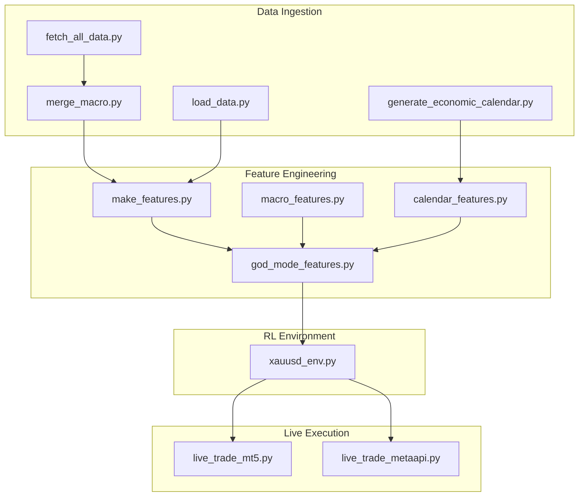
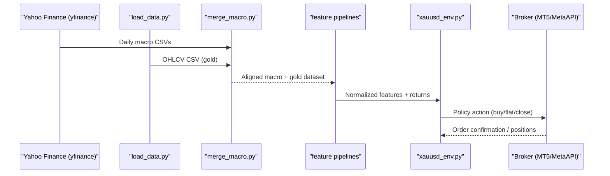
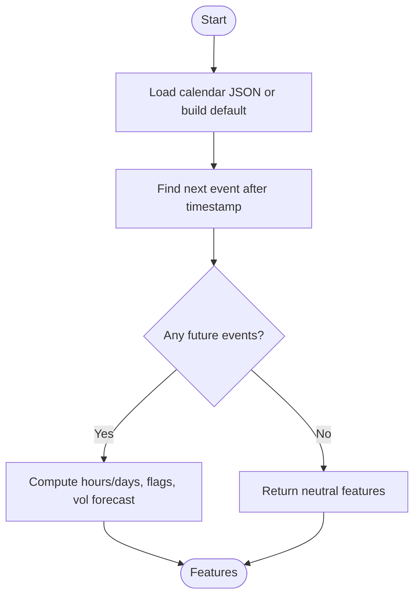
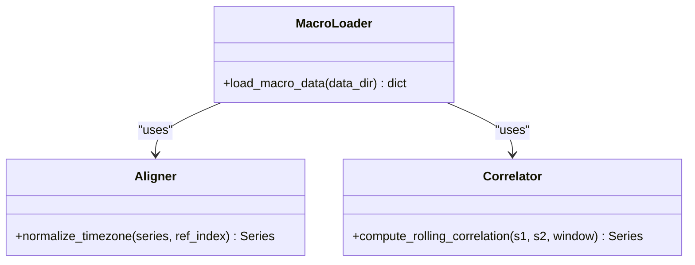
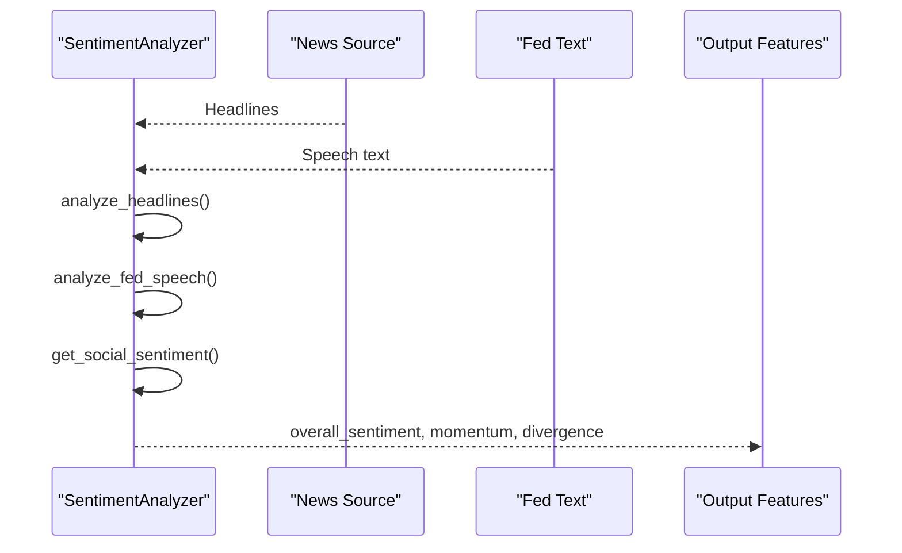
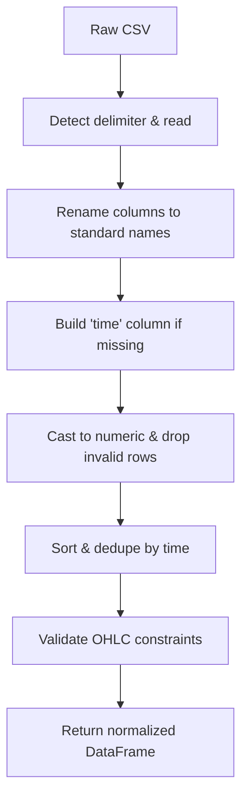
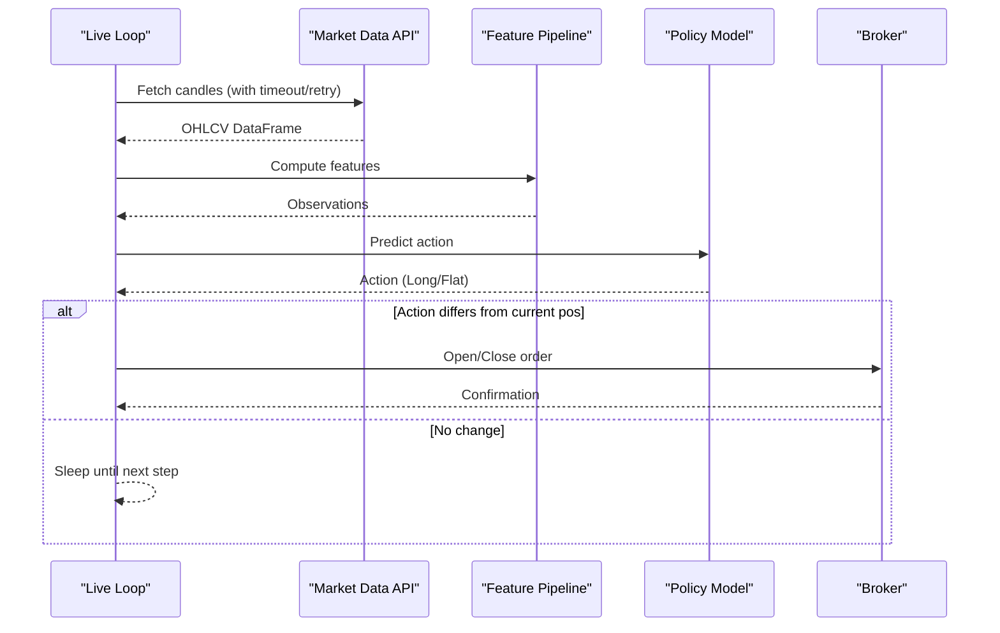
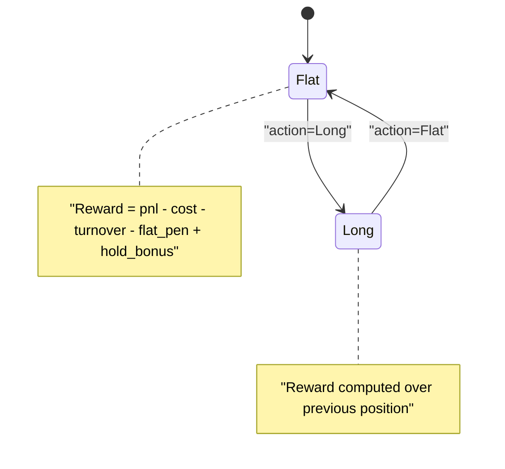
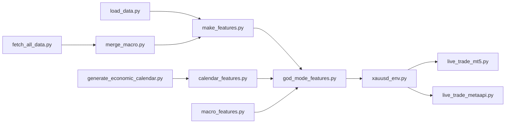

# Integration Patterns

<cite>
**Referenced Files in This Document**
- [economic_calendar.py](file://data/economic_calendar.py)
- [sentiment_analysis.py](file://data/sentiment_analysis.py)
- [calendar_features.py](file://features/calendar_features.py)
- [macro_features.py](file://features/macro_features.py)
- [make_features.py](file://features/make_features.py)
- [god_mode_features.py](file://features/god_mode_features.py)
- [load_data.py](file://data/load_data.py)
- [merge_macro.py](file://data/merge_macro.py)
- [fetch_all_data.py](file://scripts/fetch_all_data.py)
- [generate_economic_calendar.py](file://scripts/generate_economic_calendar.py)
- [live_trade_mt5.py](file://live/live_trade_mt5.py)
- [live_trade_metaapi.py](file://live/live_trade_metaapi.py)
- [xauusd_env.py](file://env/xauusd_env.py)
</cite>

## Table of Contents
1. Introduction
2. Project Structure
3. Core Components
4. Architecture Overview
5. Detailed Component Analysis
6. Dependency Analysis
7. Performance Considerations
8. Troubleshooting Guide
9. Conclusion

## Introduction
This document explains how to integrate external systems and data sources into the trading system. It covers connecting to broker APIs, implementing custom data providers, integrating alternative economic calendars, creating adapters for different market data formats, streaming real-time data, handling API rate limits and errors, and integrating news sentiment and alternative data. It also provides best practices for stability, connection failure recovery, and optimizing ingestion performance.

## Project Structure
The integration surface spans several modules:
- Data ingestion and normalization: load_data.py, merge_macro.py
- External data fetching: fetch_all_data.py (Yahoo Finance), generate_economic_calendar.py (rule-based calendar)
- Feature engineering with macro and calendar context: macro_features.py, calendar_features.py, god_mode_features.py, make_features.py
- Live execution via brokers: live_trade_mt5.py (MetaTrader 5), live_trade_metaapi.py (MetaAPI cloud)
- Reinforcement learning environment: xauusd_env.py

**Diagram sources**
- [load_data.py:1-84](file://data/load_data.py#L1-L84)
- [merge_macro.py:1-61](file://data/merge_macro.py#L1-L61)
- [fetch_all_data.py:1-233](file://scripts/fetch_all_data.py#L1-L233)
- [generate_economic_calendar.py:1-310](file://scripts/generate_economic_calendar.py#L1-L310)
- [make_features.py:1-83](file://features/make_features.py#L1-L83)
- [macro_features.py:1-513](file://features/macro_features.py#L1-L513)
- [calendar_features.py:1-315](file://features/calendar_features.py#L1-L315)
- [god_mode_features.py:1-433](file://features/god_mode_features.py#L1-L433)
- [xauusd_env.py:1-118](file://env/xauusd_env.py#L1-L118)
- [live_trade_mt5.py:1-174](file://live/live_trade_mt5.py#L1-L174)
- [live_trade_metaapi.py:1-231](file://live/live_trade_metaapi.py#L1-L231)

**Section sources**
- [load_data.py:1-84](file://data/load_data.py#L1-L84)
- [merge_macro.py:1-61](file://data/merge_macro.py#L1-L61)
- [fetch_all_data.py:1-233](file://scripts/fetch_all_data.py#L1-L233)
- [generate_economic_calendar.py:1-310](file://scripts/generate_economic_calendar.py#L1-L310)
- [make_features.py:1-83](file://features/make_features.py#L1-L83)
- [macro_features.py:1-513](file://features/macro_features.py#L1-L513)
- [calendar_features.py:1-315](file://features/calendar_features.py#L1-L315)
- [god_mode_features.py:1-433](file://features/god_mode_features.py#L1-L433)
- [xauusd_env.py:1-118](file://env/xauusd_env.py#L1-L118)
- [live_trade_mt5.py:1-174](file://live/live_trade_mt5.py#L1-L174)
- [live_trade_metaapi.py:1-231](file://live/live_trade_metaapi.py#L1-L231)

## Core Components
- Economic Calendar: Tracks scheduled high-impact events and computes time-to-event features used by models.
- Macro Features: Aligns daily macro series (DXY, SPX, US10Y, VIX, Oil, BTC, EURUSD, Silver/GLD) to intraday gold prices and derives returns, momentum, and correlations.
- Sentiment Analysis: Aggregates news, Fed speech, and social sentiment; supports FinBERT or keyword fallback.
- Feature Pipelines: Consolidate multi-timeframe technical indicators, macro signals, and calendar awareness into a unified feature set.
- Live Trading: Connects to MetaTrader 5 or MetaAPI to stream candles, compute features, run policy inference, and execute orders with robust error handling.
- RL Environment: Wraps features and returns into a Gymnasium environment for training and evaluation.

**Section sources**
- [economic_calendar.py:27-334](file://data/economic_calendar.py#L27-L334)
- [macro_features.py:26-445](file://features/macro_features.py#L26-L445)
- [sentiment_analysis.py:22-235](file://data/sentiment_analysis.py#L22-L235)
- [god_mode_features.py:53-379](file://features/god_mode_features.py#L53-L379)
- [live_trade_mt5.py:21-166](file://live/live_trade_mt5.py#L21-L166)
- [live_trade_metaapi.py:40-220](file://live/live_trade_metaapi.py#L40-L220)
- [xauusd_env.py:7-118](file://env/xauusd_env.py#L7-L118)

## Architecture Overview
End-to-end flow from raw data to live decisions:

**Diagram sources**
- [fetch_all_data.py:27-101](file://scripts/fetch_all_data.py#L27-L101)
- [merge_macro.py:4-56](file://data/merge_macro.py#L4-L56)
- [load_data.py:5-73](file://data/load_data.py#L5-L73)
- [macro_features.py:363-445](file://features/macro_features.py#L363-L445)
- [xauusd_env.py:75-118](file://env/xauusd_env.py#L75-L118)
- [live_trade_mt5.py:111-166](file://live/live_trade_mt5.py#L111-L166)
- [live_trade_metaapi.py:135-220](file://live/live_trade_metaapi.py#L135-L220)

## Detailed Component Analysis

### Economic Calendar Integration
- Purpose: Provide event-aware features such as hours until next event, high-impact flags, event windows, and expected volatility multipliers.
- Implementation highlights:
  - Loads JSON calendar or falls back to default 2024 schedule.
  - Computes per-timestamp features including type detection (NFP, CPI, FOMC).
  - Provides helpers to add/save events and query upcoming events.
- Extensibility:
  - Replace default calendar with scraped or API-driven sources (e.g., ForexFactory, Investing.com).
  - Add new event types and volatility maps.

**Diagram sources**
- [economic_calendar.py:81-113](file://data/economic_calendar.py#L81-L113)
- [economic_calendar.py:181-234](file://data/economic_calendar.py#L181-L234)
- [economic_calendar.py:276-334](file://data/economic_calendar.py#L276-L334)

**Section sources**
- [economic_calendar.py:27-334](file://data/economic_calendar.py#L27-L334)
- [calendar_features.py:23-249](file://features/calendar_features.py#L23-L249)
- [generate_economic_calendar.py:25-268](file://scripts/generate_economic_calendar.py#L25-L268)

### Macro Data Providers and Alignment
- Purpose: Integrate multiple macro sources (DXY, SPX, US10Y, VIX, Oil, BTC, EURUSD, Silver/GLD) and align them to gold price timestamps.
- Key patterns:
  - Fetch daily series via Yahoo Finance and persist CSVs.
  - Normalize timezone and reindex to gold’s index using forward-fill.
  - Compute returns, momentum, rolling correlations, and regime indicators.
- Extensibility:
  - Add new assets by extending loaders and feature functions.
  - Swap data sources (e.g., FRED, Quandl) while preserving alignment logic.

**Diagram sources**
- [macro_features.py:26-132](file://features/macro_features.py#L26-L132)
- [macro_features.py:135-360](file://features/macro_features.py#L135-L360)
- [fetch_all_data.py:27-101](file://scripts/fetch_all_data.py#L27-L101)

**Section sources**
- [macro_features.py:26-445](file://features/macro_features.py#L26-L445)
- [fetch_all_data.py:1-233](file://scripts/fetch_all_data.py#L1-L233)
- [merge_macro.py:4-56](file://data/merge_macro.py#L4-L56)

### News and Alternative Data (Sentiment)
- Purpose: Aggregate sentiment from headlines, Fed speeches, and social media; support FinBERT or keyword-based fallback.
- Usage:
  - Feed news headlines and Fed text to aggregate_sentiment.
  - Use sentiment features alongside macro and calendar features.
- Extensibility:
  - Integrate NewsAPI, Twitter/X API, Reddit PRAW for live streams.
  - Replace keyword model with fine-tuned transformers when available.

**Diagram sources**
- [sentiment_analysis.py:22-235](file://data/sentiment_analysis.py#L22-L235)

**Section sources**
- [sentiment_analysis.py:22-235](file://data/sentiment_analysis.py#L22-L235)

### Adapters for Market Data Formats
- Purpose: Standardize heterogeneous OHLCV inputs (e.g., MT5 angle-bracket columns) into a consistent schema.
- Highlights:
  - Auto-detect delimiter, rename columns, combine date/time, enforce numeric types, validate OHLC constraints, deduplicate by time.
- Extensibility:
  - Add new column mappings for other brokers or data vendors.
  - Extend validation rules for edge cases.

**Diagram sources**
- [load_data.py:5-73](file://data/load_data.py#L5-L73)

**Section sources**
- [load_data.py:5-73](file://data/load_data.py#L5-L73)

### Real-Time Data Streaming and Live Execution
- Broker integrations:
  - MetaTrader 5: Poll recent candles, compute features, predict actions, send orders with retry on failures.
  - MetaAPI Cloud: Async historical candle retrieval with timeouts and retries, position checks, order creation/closure, and auto-reconnect on network issues.
- Common patterns:
  - Timeouts and retries for data fetches.
  - Graceful degradation when insufficient history is available.
  - Explicit state synchronization before placing orders.

**Diagram sources**
- [live_trade_mt5.py:21-166](file://live/live_trade_mt5.py#L21-L166)
- [live_trade_metaapi.py:40-220](file://live/live_trade_metaapi.py#L40-L220)

**Section sources**
- [live_trade_mt5.py:21-166](file://live/live_trade_mt5.py#L21-L166)
- [live_trade_metaapi.py:40-220](file://live/live_trade_metaapi.py#L40-L220)

### Reinforcement Learning Environment Integration
- Purpose: Wrap features and returns into a Gymnasium environment that simulates trading with costs, penalties, and equity tracking.
- Highlights:
  - Discrete actions (Flat/Long).
  - Reward includes PnL, trade cost, turnover penalty, flat penalty, and hold bonus.
  - Observation concatenates sliding window of features and current position.

**Diagram sources**
- [xauusd_env.py:7-118](file://env/xauusd_env.py#L7-L118)

**Section sources**
- [xauusd_env.py:7-118](file://env/xauusd_env.py#L7-L118)

## Dependency Analysis
Key dependencies and coupling:
- Feature pipelines depend on normalized data and aligned macro series.
- Live loops depend on feature outputs and broker connectivity.
- Calendar and sentiment modules are optional but enhance feature richness.

**Diagram sources**
- [load_data.py:5-73](file://data/load_data.py#L5-L73)
- [fetch_all_data.py:27-101](file://scripts/fetch_all_data.py#L27-L101)
- [merge_macro.py:4-56](file://data/merge_macro.py#L4-L56)
- [make_features.py:18-78](file://features/make_features.py#L18-L78)
- [calendar_features.py:23-249](file://features/calendar_features.py#L23-L249)
- [macro_features.py:363-445](file://features/macro_features.py#L363-L445)
- [god_mode_features.py:291-379](file://features/god_mode_features.py#L291-L379)
- [xauusd_env.py:7-118](file://env/xauusd_env.py#L7-L118)
- [live_trade_mt5.py:111-166](file://live/live_trade_mt5.py#L111-L166)
- [live_trade_metaapi.py:135-220](file://live/live_trade_metaapi.py#L135-L220)

**Section sources**
- [make_features.py:18-78](file://features/make_features.py#L18-L78)
- [god_mode_features.py:291-379](file://features/god_mode_features.py#L291-L379)
- [macro_features.py:363-445](file://features/macro_features.py#L363-L445)
- [calendar_features.py:23-249](file://features/calendar_features.py#L23-L249)
- [live_trade_mt5.py:111-166](file://live/live_trade_mt5.py#L111-L166)
- [live_trade_metaapi.py:135-220](file://live/live_trade_metaapi.py#L135-L220)

## Performance Considerations
- Batch data loading and vectorized operations:
  - Use pandas resample and reindex with forward-fill to align daily macro to intraday frequencies efficiently.
- Minimize repeated I/O:
  - Persist fetched macro series to CSV and reuse across runs.
- Feature computation efficiency:
  - Compute rolling metrics with appropriate windows; avoid unnecessary copies.
- Real-time loop optimization:
  - Limit polling frequency to match timeframe (e.g., H1 loop sleeps between steps).
  - Cache model predictions and only recompute when new bars arrive.
- Memory management:
  - Drop unused columns early; use float32 where possible.

[No sources needed since this section provides general guidance]

## Troubleshooting Guide
Common issues and remedies:
- Missing or malformed OHLCV:
  - Ensure required columns exist; handle angle-bracket headers; validate OHLC constraints.
- Timezone mismatches:
  - Normalize all series to naive UTC-aligned indices before merging.
- Insufficient history:
  - Wait until enough bars are available before predicting; pad with zeros or defaults during warm-up.
- Network timeouts and retries:
  - Implement timeouts and exponential backoff for data fetches; reconnect on broker disconnects.
- Calendar not found:
  - Generate or download calendar JSON; fall back to default schedule.
- Macro files missing:
  - Run data fetch scripts to populate daily CSVs; verify file paths.

**Section sources**
- [load_data.py:5-73](file://data/load_data.py#L5-L73)
- [merge_macro.py:4-56](file://data/merge_macro.py#L4-L56)
- [fetch_all_data.py:131-214](file://scripts/fetch_all_data.py#L131-L214)
- [generate_economic_calendar.py:271-310](file://scripts/generate_economic_calendar.py#L271-L310)
- [live_trade_mt5.py:124-166](file://live/live_trade_mt5.py#L124-L166)
- [live_trade_metaapi.py:40-86](file://live/live_trade_metaapi.py#L40-L86)

## Conclusion
The system provides modular, extensible integration points for market data, macro indicators, economic calendars, and sentiment. By standardizing data formats, aligning disparate time series, and encapsulating live execution with robust error handling, it enables reliable real-time trading and continuous improvement through additional data sources and features.

[No sources needed since this section summarizes without analyzing specific files]