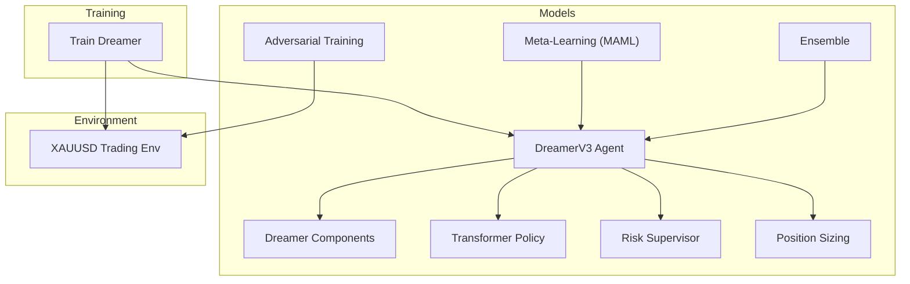
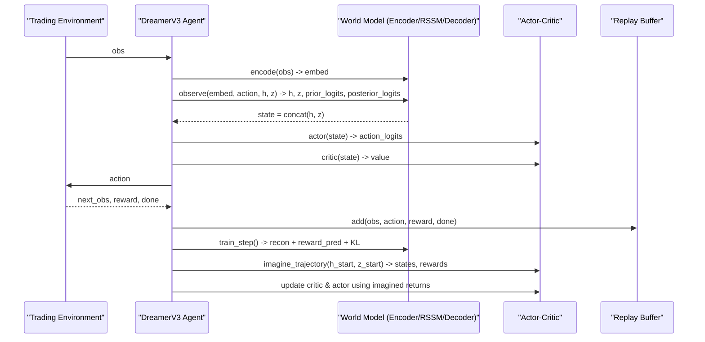
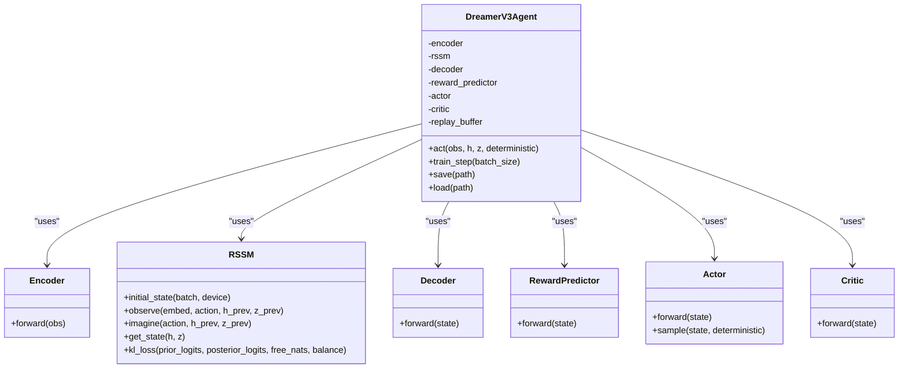
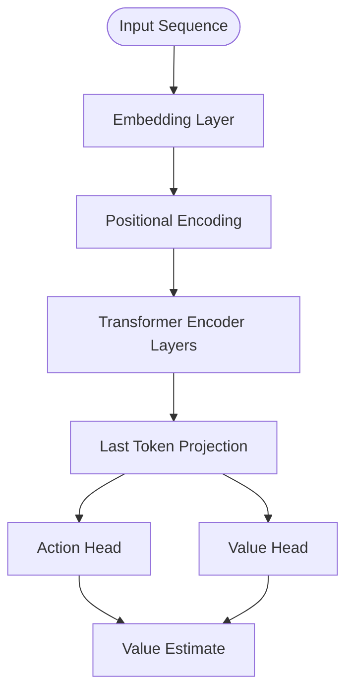
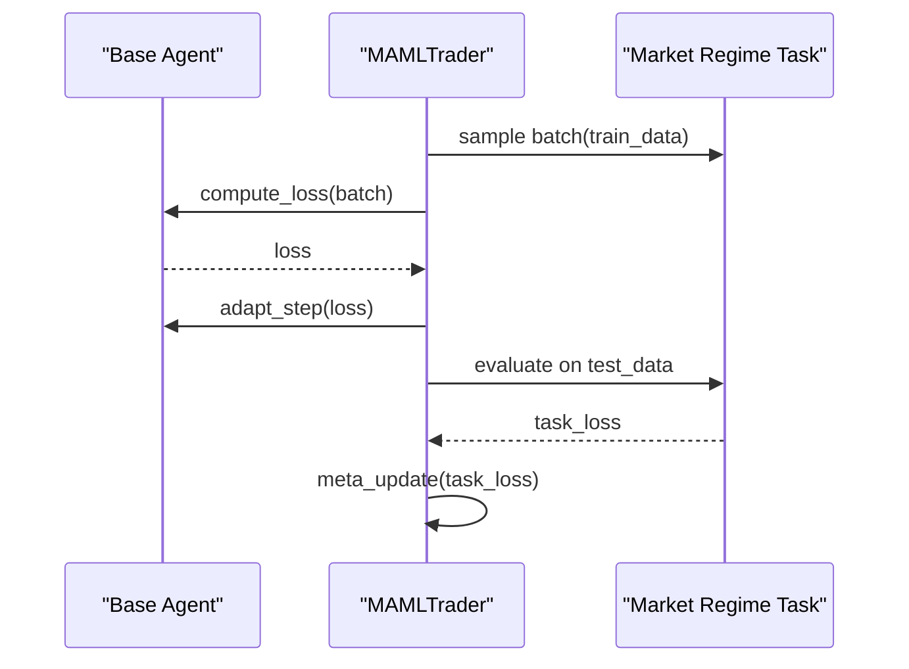
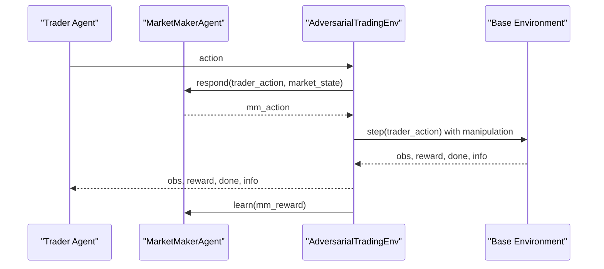
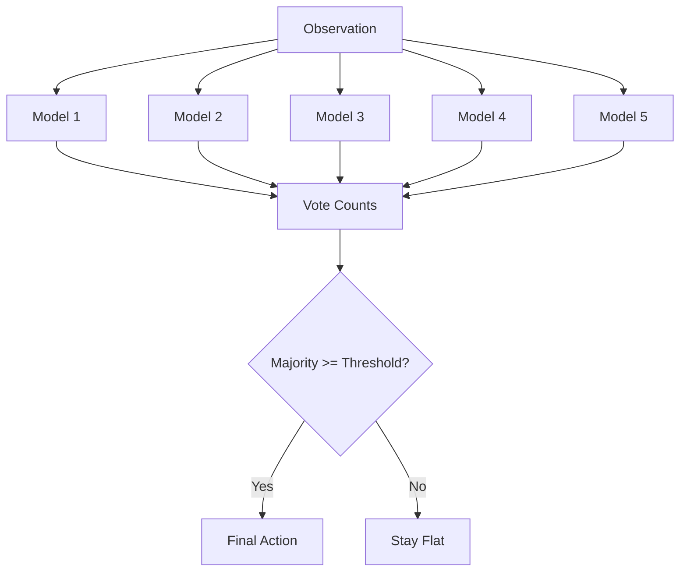
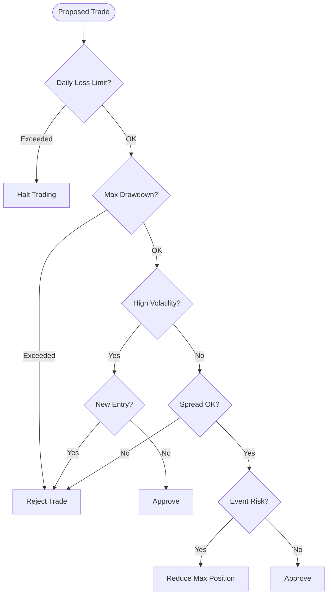
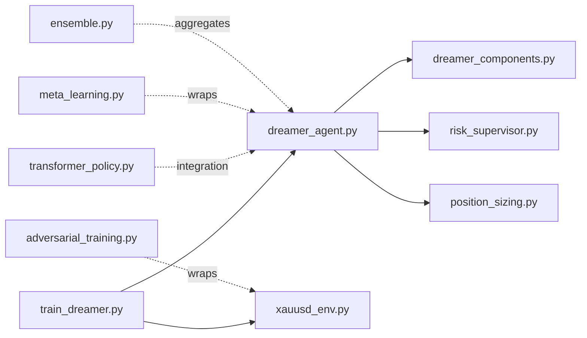

# Model Extensions

<cite>
**Referenced Files in This Document**
- [README.md](file://README.md)
- [models/dreamer_agent.py](file://models/dreamer_agent.py)
- [models/dreamer_components.py](file://models/dreamer_components.py)
- [models/transformer_policy.py](file://models/transformer_policy.py)
- [models/meta_learning.py](file://models/meta_learning.py)
- [models/adversarial_training.py](file://models/adversarial_training.py)
- [models/ensemble.py](file://models/ensemble.py)
- [models/risk_supervisor.py](file://models/risk_supervisor.py)
- [models/position_sizing.py](file://models/position_sizing.py)
- [train/train_dreamer.py](file://train/train_dreamer.py)
- [env/xauusd_env.py](file://env/xauusd_env.py)
</cite>

## Table of Contents
1. Introduction
2. Project Structure
3. Core Components
4. Architecture Overview
5. Detailed Component Analysis
6. Dependency Analysis
7. Performance Considerations
8. Troubleshooting Guide
9. Conclusion
10. Appendices

## Introduction
This document provides advanced guidance for extending model architectures and training methodologies in this trading system. It focuses on:
- Implementing custom neural network components (encoders, dynamics models, decoders, reward predictors, actors, critics)
- Modifying world model architectures (RSSM-based DreamerV3)
- Integrating alternative learning algorithms (meta-learning, adversarial self-play, ensemble methods)
- Adding new policy networks (MLP vs transformer-based), value function approximators, and attention mechanisms
- Implementing custom loss functions and regularization techniques
- Integrating transformer-based policies, adversarial training, and ensemble approaches
- Addressing compatibility, performance, and debugging for custom implementations

The codebase includes a complete DreamerV3 agent with modular components, a transformer-based actor-critic, meta-learning scaffolding, adversarial self-play environment, and robust risk management utilities.

## Project Structure
Key directories and files relevant to model extensions:
- models/: Core RL components (DreamerV3, Transformer Policy, Meta-Learning, Adversarial Training, Ensemble, Risk Supervisor, Position Sizing)
- train/: Training scripts (e.g., DreamerV3 training loop)
- env/: Gymnasium-style trading environments
- README.md: High-level overview and algorithm explanations

**Diagram sources**
- [models/dreamer_agent.py:84-146](file://models/dreamer_agent.py#L84-L146)
- [models/dreamer_components.py:71-295](file://models/dreamer_components.py#L71-L295)
- [models/transformer_policy.py:67-249](file://models/transformer_policy.py#L67-L249)
- [models/meta_learning.py:32-171](file://models/meta_learning.py#L32-L171)
- [models/adversarial_training.py:35-356](file://models/adversarial_training.py#L35-L356)
- [models/ensemble.py:27-179](file://models/ensemble.py#L27-L179)
- [models/risk_supervisor.py:18-285](file://models/risk_supervisor.py#L18-L285)
- [models/position_sizing.py:29-262](file://models/position_sizing.py#L29-L262)
- [train/train_dreamer.py:128-208](file://train/train_dreamer.py#L128-L208)
- [env/xauusd_env.py:7-118](file://env/xauusd_env.py#L7-L118)

**Section sources**
- [README.md:47-64](file://README.md#L47-L64)
- [README.md:418-471](file://README.md#L418-L471)

## Core Components
- DreamerV3 Agent: World model learning (encoder, RSSM, decoder, reward predictor) plus actor-critic trained via imagination. Includes replay buffer, sequence sampling, and multi-phase training.
- Dreamer Components: Modular building blocks (RMSNorm, GRUCell, Encoder, RSSM, Decoder, RewardPredictor, Actor, Critic).
- Transformer Policy: Transformer-based actor and critic with positional encoding and attention; wrapper to integrate with sequences.
- Meta-Learning: MAML-style framework for fast adaptation across market regimes.
- Adversarial Training: Self-play environment where a Market Maker agent manipulates conditions to challenge the trader.
- Ensemble: Multiple agents vote on actions; consensus and uncertainty estimation.
- Risk Supervisor: Deterministic safety layer that approves/rejects trades based on hard constraints.
- Position Sizing: Kelly Criterion and volatility-adjusted sizing strategies.

**Section sources**
- [models/dreamer_agent.py:84-146](file://models/dreamer_agent.py#L84-L146)
- [models/dreamer_components.py:71-295](file://models/dreamer_components.py#L71-L295)
- [models/transformer_policy.py:67-249](file://models/transformer_policy.py#L67-L249)
- [models/meta_learning.py:32-171](file://models/meta_learning.py#L32-L171)
- [models/adversarial_training.py:35-356](file://models/adversarial_training.py#L35-L356)
- [models/ensemble.py:27-179](file://models/ensemble.py#L27-L179)
- [models/risk_supervisor.py:18-285](file://models/risk_supervisor.py#L18-L285)
- [models/position_sizing.py:29-262](file://models/position_sizing.py#L29-L262)

## Architecture Overview
The system combines a world model (DreamerV3) with policy/value networks and optional transformer-based policies. Training alternates between world model updates and actor-critic optimization over imagined trajectories. Additional modules provide meta-learning, adversarial robustness, ensemble voting, and risk controls.

**Diagram sources**
- [models/dreamer_agent.py:148-188](file://models/dreamer_agent.py#L148-L188)
- [models/dreamer_agent.py:190-304](file://models/dreamer_agent.py#L190-L304)
- [models/dreamer_agent.py:306-403](file://models/dreamer_agent.py#L306-L403)
- [models/dreamer_components.py:71-205](file://models/dreamer_components.py#L71-L205)
- [env/xauusd_env.py:70-118](file://env/xauusd_env.py#L70-L118)

## Detailed Component Analysis

### DreamerV3 Agent and Components
- World Model:
  - Encoder compresses observations into embeddings with symlog stabilization.
  - RSSM maintains deterministic hidden state h and stochastic latent z; supports observe (posterior) and imagine (prior) modes.
  - Decoder reconstructs observations; RewardPredictor predicts rewards in symlog space.
- Actor-Critic:
  - Actor outputs categorical action logits; Critic estimates values.
  - Training uses lambda-returns and GAE-style advantages over imagined horizons.
- Replay Buffer:
  - Stores transitions and samples contiguous sequences for efficient training.

**Diagram sources**
- [models/dreamer_agent.py:84-146](file://models/dreamer_agent.py#L84-L146)
- [models/dreamer_components.py:71-295](file://models/dreamer_components.py#L71-L295)

**Section sources**
- [models/dreamer_agent.py:84-146](file://models/dreamer_agent.py#L84-L146)
- [models/dreamer_agent.py:190-304](file://models/dreamer_agent.py#L190-L304)
- [models/dreamer_agent.py:306-403](file://models/dreamer_agent.py#L306-L403)
- [models/dreamer_components.py:71-295](file://models/dreamer_components.py#L71-L295)

### Transformer-Based Policies
- TransformerActor and TransformerCritic use multi-head attention with positional encodings to capture long-range dependencies in time series.
- TransformerAgentWrapper manages sequential inputs and integrates with existing workflows.

**Diagram sources**
- [models/transformer_policy.py:34-153](file://models/transformer_policy.py#L34-L153)
- [models/transformer_policy.py:166-249](file://models/transformer_policy.py#L166-L249)
- [models/transformer_policy.py:252-347](file://models/transformer_policy.py#L252-L347)

**Section sources**
- [models/transformer_policy.py:67-249](file://models/transformer_policy.py#L67-L249)
- [models/transformer_policy.py:252-347](file://models/transformer_policy.py#L252-L347)

### Meta-Learning (MAML)
- MAMLTrader wraps a base agent to learn an initialization that adapts quickly to new market regimes using inner-loop adaptation and outer-loop meta-updates.
- MarketRegimeGenerator outlines task creation from historical data segments.

**Diagram sources**
- [models/meta_learning.py:32-171](file://models/meta_learning.py#L32-L171)
- [models/meta_learning.py:174-261](file://models/meta_learning.py#L174-L261)

**Section sources**
- [models/meta_learning.py:32-171](file://models/meta_learning.py#L32-L171)
- [models/meta_learning.py:174-261](file://models/meta_learning.py#L174-L261)

### Adversarial Training (Self-Play)
- MarketMakerAgent learns manipulation strategies (spread widening, fake breakouts, stop hunts) to challenge the trader.
- AdversarialTradingEnv wraps a base environment to apply manipulations and provide zero-sum feedback.
- SelfPlayTrainer alternates training phases for trader and market maker.

**Diagram sources**
- [models/adversarial_training.py:35-221](file://models/adversarial_training.py#L35-L221)
- [models/adversarial_training.py:223-356](file://models/adversarial_training.py#L223-L356)
- [models/adversarial_training.py:358-484](file://models/adversarial_training.py#L358-L484)

**Section sources**
- [models/adversarial_training.py:35-221](file://models/adversarial_training.py#L35-L221)
- [models/adversarial_training.py:223-356](file://models/adversarial_training.py#L223-L356)
- [models/adversarial_training.py:358-484](file://models/adversarial_training.py#L358-L484)

### Ensemble Approaches
- EnsembleAgent trains multiple models with varied seeds/architectures and aggregates decisions via majority voting.
- Provides uncertainty estimation through entropy of votes and can enforce consensus thresholds before acting.

**Diagram sources**
- [models/ensemble.py:27-179](file://models/ensemble.py#L27-L179)

**Section sources**
- [models/ensemble.py:27-179](file://models/ensemble.py#L27-L179)

### Risk Supervisor and Position Sizing
- RiskSupervisor enforces hard constraints (daily loss limits, drawdown caps, volatility filters, event risk, spread checks) and can halt trading.
- KellyPositionSizer computes optimal position sizes based on win probability and risk/reward ratios, with fractional Kelly and volatility adjustments.

**Diagram sources**
- [models/risk_supervisor.py:91-174](file://models/risk_supervisor.py#L91-L174)
- [models/position_sizing.py:66-111](file://models/position_sizing.py#L66-L111)

**Section sources**
- [models/risk_supervisor.py:18-285](file://models/risk_supervisor.py#L18-L285)
- [models/position_sizing.py:29-262](file://models/position_sizing.py#L29-L262)

## Dependency Analysis
- The DreamerV3 agent composes multiple modules: encoder, RSSM, decoder, reward predictor, actor, critic, and replay buffer.
- Training script wires data pipelines, environment, and agent instantiation, then runs prefill and training loops.
- Transformer policy is independent but can be integrated by replacing actor/critic or used as a standalone policy wrapper.
- Adversarial training depends on a base environment and wraps it to inject manipulations.
- Ensemble requires compatible agents implementing act/train/save/load interfaces.
- Risk supervisor and position sizing are orthogonal safety layers that can wrap any agent’s decision-making.

**Diagram sources**
- [train/train_dreamer.py:128-208](file://train/train_dreamer.py#L128-L208)
- [models/dreamer_agent.py:84-146](file://models/dreamer_agent.py#L84-L146)
- [models/dreamer_components.py:71-295](file://models/dreamer_components.py#L71-L295)
- [models/risk_supervisor.py:18-285](file://models/risk_supervisor.py#L18-L285)
- [models/position_sizing.py:29-262](file://models/position_sizing.py#L29-L262)
- [models/transformer_policy.py:67-249](file://models/transformer_policy.py#L67-L249)
- [models/adversarial_training.py:223-356](file://models/adversarial_training.py#L223-L356)
- [models/meta_learning.py:32-171](file://models/meta_learning.py#L32-L171)
- [models/ensemble.py:27-179](file://models/ensemble.py#L27-L179)
- [env/xauusd_env.py:7-118](file://env/xauusd_env.py#L7-L118)

**Section sources**
- [train/train_dreamer.py:128-208](file://train/train_dreamer.py#L128-L208)
- [models/dreamer_agent.py:84-146](file://models/dreamer_agent.py#L84-L146)
- [models/dreamer_components.py:71-295](file://models/dreamer_components.py#L71-L295)
- [env/xauusd_env.py:7-118](file://env/xauusd_env.py#L7-L118)

## Performance Considerations
- Batch size and device selection significantly impact throughput; prefer GPU/MPS when available.
- Sequence length and horizon affect memory and computation; tune to balance accuracy and speed.
- Gradient clipping prevents instability during world model and actor-critic updates.
- Transformers increase computational cost; consider reducing heads/layers or using smaller hidden dimensions for faster iteration.
- Ensemble multiplies compute; use consensus thresholds to reduce inference frequency if needed.
- Risk supervisor adds negligible overhead but crucially reduces catastrophic losses.

[No sources needed since this section provides general guidance]

## Troubleshooting Guide
Common issues and diagnostics:
- NaN or exploding gradients: Ensure gradient clipping is applied and check loss magnitudes; verify normalization (RMSNorm) and symlog transformations.
- Poor reconstruction or reward prediction: Inspect encoder/embedding quality and RSSM capacity; adjust stoch_dim/num_categories.
- Instability in actor-critic: Tune learning rates, horizon, and lambda; validate value targets and advantage computation.
- Transformer training divergence: Reduce learning rate, dropout, or depth; ensure proper masking and sequence padding.
- Adversarial imbalance: Adjust trainer phases and learning rates to maintain zero-sum balance; monitor MM profits vs trader rewards.
- Ensemble disagreement: Investigate model diversity and seed variations; consider increasing consensus threshold.
- Risk supervisor rejections: Review daily loss limits, drawdown caps, volatility thresholds, and spread filters; log rejection reasons.

**Section sources**
- [models/dreamer_agent.py:256-263](file://models/dreamer_agent.py#L256-L263)
- [models/dreamer_agent.py:278-293](file://models/dreamer_agent.py#L278-L293)
- [models/dreamer_components.py:188-205](file://models/dreamer_components.py#L188-L205)
- [models/transformer_policy.py:100-120](file://models/transformer_policy.py#L100-L120)
- [models/adversarial_training.py:409-436](file://models/adversarial_training.py#L409-L436)
- [models/risk_supervisor.py:104-174](file://models/risk_supervisor.py#L104-L174)

## Conclusion
This repository provides a comprehensive foundation for extending trading models:
- Use DreamerV3 components to build or modify world models and policy/value networks.
- Integrate transformer-based policies for sequence modeling and attention-driven decisions.
- Apply meta-learning for rapid adaptation to new regimes and adversarial training for robustness.
- Employ ensemble methods for uncertainty-aware decisions and risk supervision for safety.
- Follow best practices for performance tuning and debugging to ensure stable and effective training.

[No sources needed since this section summarizes without analyzing specific files]

## Appendices

### How to Add Custom Neural Network Components
- Encoders/Decoders: Extend feed-forward stacks with RMSNorm and activations; ensure input/output shapes match environment features.
- Dynamics Models: Implement recurrent cells (GRU/LSTM) and stochastic latent modeling similar to RSSM; define observe/imagine semantics.
- Reward Predictors: Map latent states to scalar rewards; consider symlog scaling for stability.
- Actors/Critics: Provide action distributions and value estimates; implement sampling and deterministic modes.

**Section sources**
- [models/dreamer_components.py:71-295](file://models/dreamer_components.py#L71-L295)

### How to Modify World Model Architectures
- Adjust RSSM capacities (hidden_dim, stoch_dim, num_categories) to control expressiveness.
- Change encoder/decoder depths and widths to fit feature dimensionality.
- Tune KL balancing and free nats to prevent posterior collapse while maintaining informative latents.

**Section sources**
- [models/dreamer_components.py:92-205](file://models/dreamer_components.py#L92-L205)
- [models/dreamer_agent.py:91-146](file://models/dreamer_agent.py#L91-L146)

### How to Integrate Alternative Learning Algorithms
- Meta-Learning: Wrap your base agent with MAMLTrader; generate regime tasks and run meta-train/fast-adapt cycles.
- Adversarial Training: Create a MarketMakerAgent and AdversarialTradingEnv; run self-play phases to improve robustness.
- Ensemble: Instantiate multiple agents with varied seeds/architectures; aggregate decisions via voting and uncertainty metrics.

**Section sources**
- [models/meta_learning.py:32-171](file://models/meta_learning.py#L32-L171)
- [models/adversarial_training.py:35-356](file://models/adversarial_training.py#L35-L356)
- [models/ensemble.py:27-179](file://models/ensemble.py#L27-L179)

### How to Add New Policy Networks and Value Function Approximators
- Replace Actor/Critic in DreamerV3 with TransformerActor/TransformerCritic or custom networks.
- Ensure consistent input/output shapes and sampling behavior for seamless integration.
- Update optimizers and training loops to handle new parameter sets.

**Section sources**
- [models/transformer_policy.py:67-249](file://models/transformer_policy.py#L67-L249)
- [models/dreamer_agent.py:119-136](file://models/dreamer_agent.py#L119-L136)

### How to Implement Custom Loss Functions and Regularization
- Reconstruction: MSE or distributional losses for observation reconstruction.
- Reward Prediction: MSE in symlog space for stability.
- KL Regularization: Balance prior/posterior with free nats and mixing coefficients.
- Policy/Value: GAE advantages, lambda-returns, and entropy bonuses for exploration.

**Section sources**
- [models/dreamer_agent.py:233-253](file://models/dreamer_agent.py#L233-L253)
- [models/dreamer_agent.py:340-403](file://models/dreamer_agent.py#L340-L403)
- [models/dreamer_components.py:188-205](file://models/dreamer_components.py#L188-L205)

### Integration Examples
- DreamerV3 Training Loop: See training script for environment setup, agent instantiation, prefill, and training phases.
- Transformer Wrapper: Use TransformerAgentWrapper to manage sequences and integrate with existing workflows.
- Adversarial Environment: Wrap base environment to simulate manipulations and train robust policies.

**Section sources**
- [train/train_dreamer.py:128-208](file://train/train_dreamer.py#L128-L208)
- [models/transformer_policy.py:252-347](file://models/transformer_policy.py#L252-L347)
- [models/adversarial_training.py:223-356](file://models/adversarial_training.py#L223-L356)

### Compatibility and Debugging Tips
- Ensure observation spaces match model expectations (windowed features + position indicator).
- Validate device placement (CPU/MPS/CUDA) and tensor shapes throughout the pipeline.
- Monitor logs for warnings and rejection reasons from risk supervisor; adjust thresholds as needed.
- Use checkpoints to resume training and compare performance across configurations.

**Section sources**
- [env/xauusd_env.py:49-68](file://env/xauusd_env.py#L49-L68)
- [models/risk_supervisor.py:243-285](file://models/risk_supervisor.py#L243-L285)
- [models/dreamer_agent.py:405-427](file://models/dreamer_agent.py#L405-L427)